# Cloud Computing — MAKAUT Complete Study Notes
## Units 1–3 | Detailed Professor-Style Markdown Notes

> **Purpose:** Detailed, exam-oriented notes for Cloud Computing.  
> **Style:** Simple explanations first, followed by technical detail, examples, diagrams, tables, memory tricks, viva questions, and MAKAUT-style answers.

---

# Table of Contents

- [How to Use These Notes](#how-to-use-these-notes)
- [Unit 1 — Cloud Computing Fundamentals](#unit-1--cloud-computing-fundamentals)
  - [Lecture 1 — What is Cloud Computing?](#lecture-1--what-is-cloud-computing)
  - [Lecture 2 — NIST Cloud Types](#lecture-2--nist-cloud-types)
  - [Lecture 3 — SaaS, PaaS and IaaS](#lecture-3--saas-paas-and-iaas)
  - [Lecture 4 — Cloud Reference Model and Characteristics](#lecture-4--cloud-reference-model-and-characteristics)
  - [Lecture 5 — Composability, Infrastructure, Platforms and Virtual Applications](#lecture-5--composability-infrastructure-platforms-and-virtual-applications)
  - [Lecture 6 — Communication Protocols and Applications](#lecture-6--communication-protocols-and-applications)
  - [Lecture 7 — Client Connections, Workloads, VPS, Pods and Aggregation](#lecture-7--client-connections-workloads-vps-pods-and-aggregation)
  - [Lecture 8 — PaaS, SaaS, SOA, Open SaaS and XaaS](#lecture-8--paas-saas-soa-open-saas-and-xaas)
- [Unit 2 — Virtualization and Cloud Platforms](#unit-2--virtualization-and-cloud-platforms)
  - [Lecture 1 — Abstraction and Virtualization](#lecture-1--abstraction-and-virtualization)
  - [Lecture 2 — Virtualization Mobility](#lecture-2--virtualization-mobility)
  - [Lecture 3 — Load Balancing and VM Provisioning](#lecture-3--load-balancing-and-vm-provisioning)
  - [Lecture 4 — VMs, Hypervisors, VMware vSphere, Imaging and OVF](#lecture-4--vms-hypervisors-vmware-vsphere-imaging-and-ovf)
  - [Lecture 5 — Application Porting, Cloud APIs and AppZero](#lecture-5--application-porting-cloud-apis-and-appzero)
  - [Lecture 6 — PaaS, Salesforce and Force.com](#lecture-6--paas-salesforce-and-forcecom)
  - [Lecture 7 — Google Cloud Ecosystem](#lecture-7--google-cloud-ecosystem)
  - [Lecture 8 — Microsoft Azure](#lecture-8--microsoft-azure)
- [Unit 3 — Cloud Infrastructure and Security](#unit-3--cloud-infrastructure-and-security)
  - [Lecture 1 — Cloud Management and NMS](#lecture-1--cloud-management-and-nms)
  - [Lecture 2 — Cloud Vendors and Monitoring](#lecture-2--cloud-vendors-and-monitoring)
  - [Lecture 3 — Cloud Service Lifecycle](#lecture-3--cloud-service-lifecycle)
  - [Lecture 4 — Cloud Security Concepts](#lecture-4--cloud-security-concepts)
  - [Lecture 5 — Data Security, Encryption, Compliance and Identity](#lecture-5--data-security-encryption-compliance-and-identity)
- [Master Comparison Tables](#master-comparison-tables)
- [Master Memory Sheet](#master-memory-sheet)
- [Important MAKAUT Questions](#important-makaut-questions)
- [Viva Revision](#viva-revision)

---

# How to Use These Notes

Cloud Computing becomes much easier if you keep one central idea in mind:

> **Cloud computing is about providing computing resources as services over a network, while abstracting much of the physical infrastructure from the user.**

For every topic, ask five questions:

1. **What is it?**
2. **Why is it needed?**
3. **How does it work?**
4. **What is an example?**
5. **How would I write it in an exam?**

A good semester-study pattern is:

```text
Understand → Draw → Compare → Recall → Write
```

For a 5-mark answer:

```text
Definition
   ↓
2–4 important points
   ↓
Example
   ↓
Small diagram/table
   ↓
Conclusion
```

---

# UNIT 1 — CLOUD COMPUTING FUNDAMENTALS

---

# Lecture 1 — What is Cloud Computing?

## 1.1 Definition of Cloud Computing

Cloud computing is a model in which computing resources such as:

- servers,
- storage,
- databases,
- networking,
- software,
- and processing power

are made available over a network, usually the Internet, as services.

The user generally does not need to own or physically maintain the underlying infrastructure.

### Simple Definition

> **Cloud computing means using computing resources over the Internet instead of depending entirely on your own physical computer or server.**

### Example

When you use Google Drive:

- You do not purchase Google's storage server.
- You do not maintain the data center.
- You access your files through the Internet.
- Google manages the underlying infrastructure.

That is cloud computing.

---

## 1.2 Traditional Computing vs Cloud Computing

### Traditional Computing

An organization purchases:

- physical servers,
- networking equipment,
- storage,
- cooling systems,
- backup systems.

The organization is responsible for maintenance.

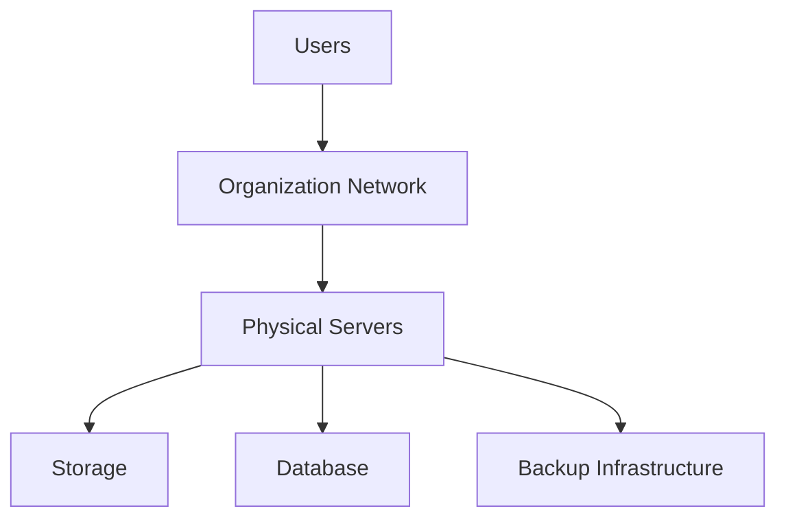

### Cloud Computing

The organization consumes resources from a cloud provider.

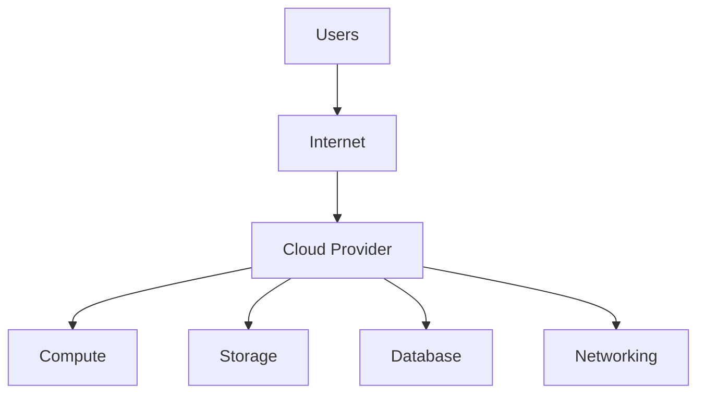

---

## 1.3 Why Did Cloud Computing Become Important?

Traditional infrastructure has several problems:

- High initial investment.
- Hardware can remain underutilized.
- Scaling requires purchasing additional hardware.
- Maintenance requires skilled staff.
- Disaster recovery can be expensive.
- Deploying new applications can take time.

Cloud computing addresses many of these problems through:

- resource pooling,
- virtualization,
- automation,
- elasticity,
- measured usage,
- on-demand provisioning.

---

## 1.4 Characteristics of Cloud Computing

The NIST definition identifies five essential characteristics.

### 1. On-Demand Self-Service

A user can provision resources when needed without requiring manual intervention from a provider employee.

**Example:**

A developer creates a virtual machine through a cloud portal.

---

### 2. Broad Network Access

Cloud services are available through standard network mechanisms.

They can be accessed using:

- laptops,
- phones,
- tablets,
- workstations,
- applications.

---

### 3. Resource Pooling

The provider pools physical resources and dynamically allocates them to multiple customers.

The customer generally does not know the exact physical machine where a workload runs.

---

### 4. Rapid Elasticity

Resources can be increased or decreased quickly according to demand.

**Example:**

An e-commerce website may need more compute resources during a sale.

---

### 5. Measured Service

Cloud usage can be monitored and measured.

Typical measurements include:

- CPU usage,
- storage,
- bandwidth,
- number of requests,
- running instance time.

This enables usage-based charging.

---

## 1.5 Paradigm Shift

Cloud computing represents a shift from:

> **Owning infrastructure → Consuming infrastructure as a service**

Traditional:

```text
Buy hardware
   ↓
Install software
   ↓
Operate infrastructure
   ↓
Maintain infrastructure
```

Cloud:

```text
Choose service
   ↓
Provision resource
   ↓
Use resource
   ↓
Scale when needed
   ↓
Pay according to model
```

---

## 1.6 Benefits of Cloud Computing

### Cost Efficiency

Organizations can avoid large upfront infrastructure purchases.

### Scalability

Resources can be increased when demand increases.

### Flexibility

Users can choose different service sizes and configurations.

### Availability

Cloud providers can design systems using redundant infrastructure.

### Faster Deployment

Resources can often be provisioned much faster than purchasing physical hardware.

### Global Reach

Cloud services can be deployed in different geographic regions.

---

## 1.7 Limitations and Challenges

Cloud computing is not automatically perfect.

Important concerns include:

- Internet dependency.
- Data privacy.
- Security configuration.
- Vendor lock-in.
- Compliance requirements.
- Service outages.
- Network latency.
- Unexpected usage costs.

A good cloud design considers both benefits and risks.

---

## Exam Answer

### Q. Define Cloud Computing and explain its characteristics.

**Answer:**

Cloud computing is a computing model in which resources such as compute, storage, networking, databases, and software are provided as services over a network. Important characteristics include on-demand self-service, broad network access, resource pooling, rapid elasticity, and measured service. Cloud computing reduces the need for users to maintain physical infrastructure and enables flexible resource provisioning.

---

## Viva Questions

**Q1. What is cloud computing?**  
Cloud computing provides computing resources as services over a network.

**Q2. What is elasticity?**  
Elasticity is the ability to dynamically increase or decrease resources according to demand.

**Q3. What is resource pooling?**  
It is the sharing of provider infrastructure among multiple customers through dynamic allocation.

**Q4. What is measured service?**  
It is monitoring and measuring resource usage for management, optimization, and often billing.

---

# Lecture 2 — NIST Cloud Types

## 2.1 NIST Deployment Models

The four major cloud deployment models are:

1. Public Cloud
2. Private Cloud
3. Community Cloud
4. Hybrid Cloud

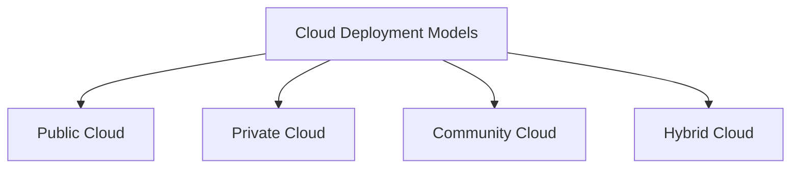

---

## 2.2 Public Cloud

A public cloud is infrastructure made available for use by multiple customers through a cloud provider.

Examples include services from:

- AWS
- Microsoft Azure
- Google Cloud

### Advantages

- No need to own data-center hardware.
- High scalability.
- Large service portfolio.
- Pay according to service model.

### Example

A startup hosts its web application using public cloud compute and storage.

---

## 2.3 Private Cloud

A private cloud is dedicated to a single organization.

It may be operated:

- internally,
- by a third party,
- on-premises,
- or externally.

### Advantages

- Greater organizational control.
- Custom security policies.
- Easier alignment with some internal requirements.

### Disadvantages

- Higher management responsibility.
- Infrastructure can be expensive.

---

## 2.4 Community Cloud

A community cloud is shared by organizations with common requirements.

Examples of common requirements may include:

- regulatory requirements,
- security requirements,
- mission objectives,
- industry-specific needs.

---

## 2.5 Hybrid Cloud

A hybrid cloud combines two or more distinct cloud environments, such as private and public clouds, connected so that data or applications can interoperate.

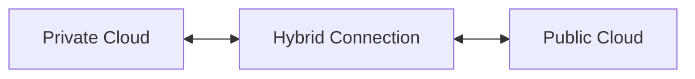

### Example

A company keeps sensitive internal data in a private environment while using public-cloud resources for scalable web applications.

---

## 2.6 Comparison

| Model | Main Idea | Typical Control | Typical Use |
|---|---|---|---|
| Public | Shared provider infrastructure | Provider | General workloads |
| Private | Dedicated organization environment | Organization/provider | Controlled workloads |
| Community | Shared by organizations with common needs | Shared | Sector-specific requirements |
| Hybrid | Combination of environments | Mixed | Workload separation/flexibility |

---

## Memory Trick

**PPCH**

- Public
- Private
- Community
- Hybrid

---

# Lecture 3 — SaaS, PaaS and IaaS

## 3.1 Service Models

Cloud service models describe **how much of the computing stack the provider manages**.

The three foundational models are:

- IaaS
- PaaS
- SaaS

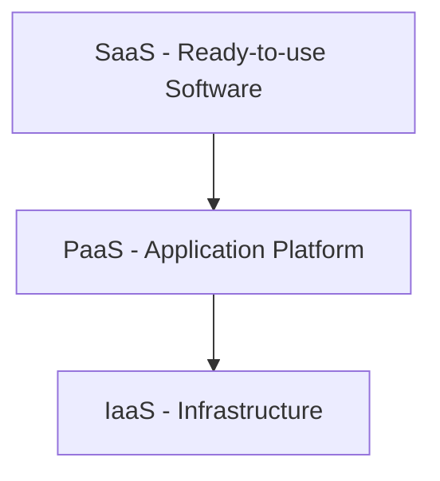

---

## 3.2 Infrastructure as a Service (IaaS)

IaaS provides fundamental computing resources.

Typical resources include:

- virtual machines,
- storage,
- networks,
- virtual disks.

The customer has substantial control over the operating system and applications.

### Example

A developer creates a virtual Linux server in AWS EC2.

---

## 3.3 Platform as a Service (PaaS)

PaaS provides a platform for application development and deployment.

The provider manages much of:

- infrastructure,
- operating system,
- runtime,
- platform services.

The developer focuses mainly on the application and its data.

### Example

A developer deploys a web application to Google App Engine.

---

## 3.4 Software as a Service (SaaS)

SaaS provides complete software applications to end users.

Users normally manage:

- application settings,
- their own data,
- account-level configuration.

The provider manages the application and underlying infrastructure.

### Examples

- Gmail
- Google Docs
- Salesforce

---

## 3.5 Responsibility Comparison

| Layer | IaaS Customer | PaaS Customer | SaaS Customer |
|---|---|---|---|
| Application | Customer | Customer | Provider |
| Data | Customer | Customer | Shared/Customer-controlled |
| Runtime | Customer | Provider | Provider |
| OS | Customer | Provider | Provider |
| Virtualization | Provider | Provider | Provider |
| Hardware | Provider | Provider | Provider |

This is a simplified conceptual comparison; exact responsibility varies by provider and service.

---

## 3.6 Easy Analogy

Think about food:

### IaaS = Kitchen Rental

You receive the kitchen and basic facilities. You prepare most things yourself.

### PaaS = Ready Kitchen

Kitchen and cooking environment are ready. You mainly prepare the application.

### SaaS = Restaurant Meal

The complete product is ready. You simply consume it.

---

## Exam Question

### Differentiate IaaS, PaaS and SaaS.

| IaaS | PaaS | SaaS |
|---|---|---|
| Infrastructure | Development platform | Complete software |
| More customer control | Medium control | Least infrastructure control |
| Used by IT administrators/developers | Mainly developers | End users |
| Example: EC2 | Example: App Engine | Example: Gmail |

---

# Lecture 4 — Cloud Reference Model and Characteristics

## 4.1 Cloud Reference Model

A cloud reference model provides a conceptual structure for understanding cloud components and relationships.

A simplified layered model is:

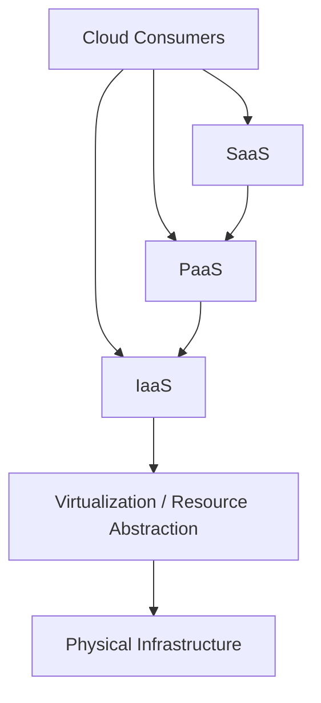

---

## 4.2 Cloud Consumers

Consumers use cloud services.

They may be:

- individuals,
- developers,
- companies,
- government organizations.

---

## 4.3 Cloud Providers

Providers operate cloud infrastructure and services.

They are responsible for:

- infrastructure,
- service delivery,
- resource management,
- availability,
- security controls within their responsibility.

---

## 4.4 Cloud Brokers

A cloud broker can help consumers select, combine, or manage services from one or more cloud providers.

A broker can perform activities such as:

- service selection,
- service aggregation,
- service optimization.

---

## 4.5 Cloud Carriers

A cloud carrier provides the connectivity through which cloud services are delivered.

Examples include:

- Internet service providers,
- telecommunications networks.

---

## 4.6 Cloud Auditors

A cloud auditor independently evaluates aspects of:

- security,
- performance,
- compliance,
- operational controls.

---

# Lecture 5 — Composability, Infrastructure, Platforms and Virtual Applications

## 5.1 Composability

Composability means building larger systems by combining smaller reusable components.

### Simple Example

Instead of writing an entire system from zero, combine:

```text
Authentication
+
Payment
+
Database
+
Notification
=
Complete Application
```

---

## 5.2 Why Composability Matters

It can provide:

- reuse,
- faster development,
- modularity,
- easier maintenance,
- easier scaling.

---

## 5.3 Infrastructure

Cloud infrastructure includes the physical and virtual resources needed to provide cloud services.

Examples:

- servers,
- storage systems,
- switches,
- routers,
- data centers,
- virtualization layers.

---

## 5.4 Platform

A platform provides an environment in which applications can be developed and executed.

A platform can include:

- operating system,
- runtime,
- databases,
- middleware,
- developer tools.

This is central to PaaS.

---

## 5.5 Virtual Application

A virtual application packages an application with the environment or dependencies needed to run it.

The objective is to make deployment and migration easier.

---

## 5.6 Client Connection to the Cloud

A client connects to cloud services through a network.

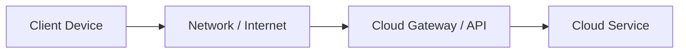

The client may use:

- web browser,
- mobile application,
- desktop application,
- API client.

---

# Lecture 6 — Communication Protocols and Applications

## 6.1 What is a Communication Protocol?

A communication protocol is a set of rules that devices and software follow when exchanging data.

Examples:

- HTTP
- HTTPS
- TCP/IP
- DNS
- TLS
- SSH

---

## 6.2 HTTP and HTTPS

### HTTP

HTTP is used for communication between web clients and servers.

### HTTPS

HTTPS is HTTP protected by TLS.

It provides:

- confidentiality,
- integrity,
- server authentication.

---

## 6.3 TCP/IP

TCP/IP is a family of networking protocols used for Internet communication.

TCP provides reliable, ordered delivery at the transport layer.

IP provides addressing and routing.

---

## 6.4 DNS

DNS translates domain names into IP addresses.

Example:

```text
example.com
     ↓
IP address
```

---

## 6.5 Cloud Applications

Cloud applications are applications delivered through cloud infrastructure.

Examples:

- online collaboration,
- webmail,
- streaming,
- online storage,
- enterprise applications.

---

# Lecture 7 — Connecting Clients, Workload, VPS, Pods and Aggregation

## 7.1 Connecting Clients to Cloud

A client can connect through:

- browser,
- REST API,
- SDK,
- mobile application,
- command-line interface.

---

## 7.2 Workload

A workload is the set of computing tasks performed by a system.

Examples:

- web workload,
- database workload,
- machine-learning workload,
- batch-processing workload.

A workload has requirements such as:

- CPU,
- memory,
- storage,
- network,
- availability.

---

## 7.3 Virtual Private Server

A VPS is a virtualized server environment that provides a customer with isolated virtual computing resources.

Multiple VPS instances can run on one physical server.

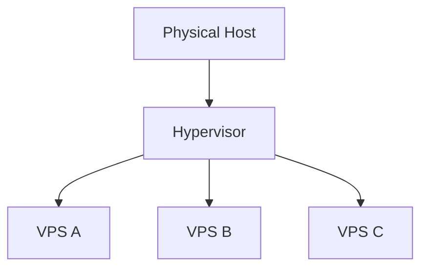

---

## 7.4 Pods

A pod is a logical grouping of one or more closely related containers in container orchestration systems such as Kubernetes.

Containers within a pod share certain networking and storage concepts.

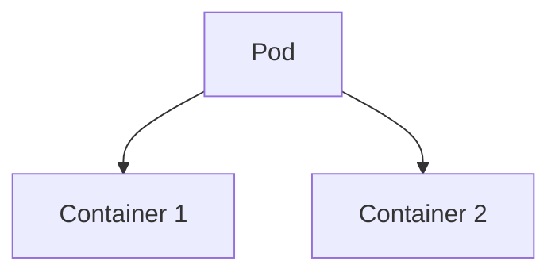

---

## 7.5 Aggregation

Aggregation means combining multiple resources or services into a larger logical service.

Examples:

- multiple storage resources,
- multiple APIs,
- multiple servers,
- multiple services.

---

# Lecture 8 — PaaS, SaaS, SOA, Open SaaS and XaaS

## 8.1 PaaS

PaaS provides an environment for developers to create and deploy applications.

Typical PaaS components:

- runtime,
- database,
- middleware,
- development tools,
- deployment mechanisms.

---

## 8.2 SaaS

SaaS provides a complete application through a network.

Characteristics:

- provider-managed application,
- subscription or usage-based access,
- browser/API access,
- centralized updates,
- multi-user support.

---

## 8.3 SOA

**Service-Oriented Architecture (SOA)** is an architectural style in which functionality is organized as reusable services.

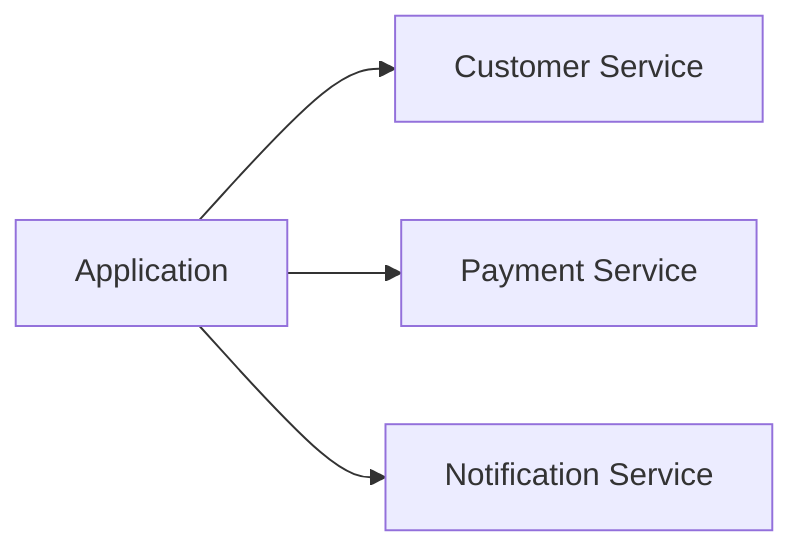

---

## 8.4 Open SaaS

Open SaaS generally refers to SaaS solutions emphasizing openness, interoperability, portability, or use of open technologies.

The exact meaning depends on the context or platform.

---

## 8.5 Identity as a Service

Identity as a Service (IDaaS) provides cloud-based identity capabilities such as:

- authentication,
- single sign-on,
- user management,
- multi-factor authentication,
- access control.

---

## 8.6 Compliance as a Service

Compliance as a Service provides cloud-based capabilities that help organizations satisfy regulatory and policy requirements.

Typical functions include:

- monitoring,
- reporting,
- audit evidence,
- policy enforcement.

---

# UNIT 2 — VIRTUALIZATION AND CLOUD PLATFORMS

---

# Lecture 1 — Abstraction and Virtualization

## 1.1 Abstraction

Abstraction hides unnecessary implementation details and exposes a simpler interface.

### Example

When using a cloud storage API, the user does not need to know:

- which disk stores the file,
- which physical server is used,
- how replication works internally.

The user sees a simple storage interface.

---

## 1.2 Virtualization

Virtualization creates a logical representation of a physical computing resource.

Examples:

- virtual machines,
- virtual networks,
- virtual storage,
- virtual CPUs.

---

## 1.3 Why Virtualization is Important

Virtualization enables:

- resource sharing,
- isolation,
- consolidation,
- flexible provisioning,
- migration.

---

## 1.4 Virtual Machine Architecture

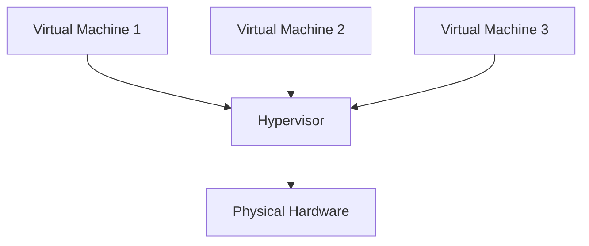

---

# Lecture 2 — Virtualization Mobility

## 2.1 What is Virtual Machine Mobility?

VM mobility means moving a virtual machine or its workload between physical or virtual environments.

---

## 2.2 P2V — Physical to Virtual

A physical machine is converted into a virtual machine.

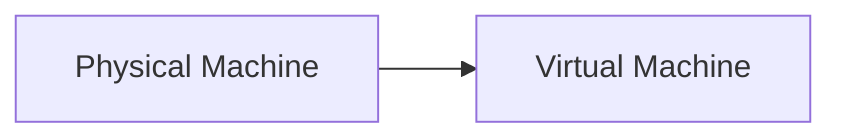

### Use

Useful when consolidating old physical servers into a virtualized environment.

---

## 2.3 V2V — Virtual to Virtual

A VM is moved or converted from one virtual platform/environment to another.

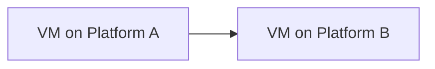

---

## 2.4 V2P — Virtual to Physical

A workload from a virtual environment is deployed onto physical hardware.

This is less common in modern cloud architectures but is conceptually possible.

---

## 2.5 Live Migration

Live migration moves a running VM with minimal service interruption.

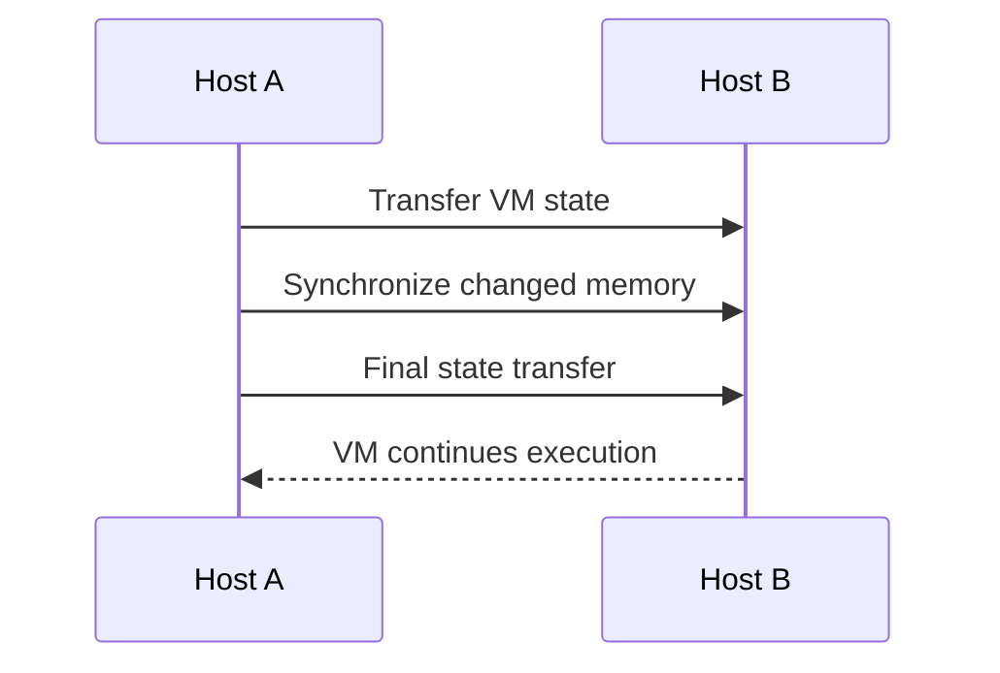

---

## 2.6 Benefits of Mobility

- Maintenance without major downtime.
- Load balancing.
- Disaster recovery.
- Hardware replacement.
- Resource optimization.

---

# Lecture 3 — Load Balancing and VM Provisioning

## 3.1 Load Balancing

Load balancing distributes incoming requests across multiple servers or instances.

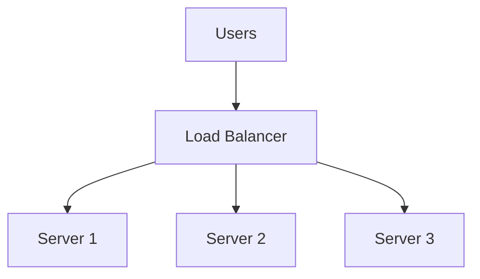

---

## 3.2 Why Load Balancing is Needed

Suppose one server receives 10,000 requests while two other servers are idle.

Without load balancing:

- response time increases,
- server may become overloaded,
- availability can decrease.

With load balancing, traffic is distributed.

---

## 3.3 Common Algorithms

### Round Robin

Requests are distributed sequentially.

```text
Request 1 → Server A
Request 2 → Server B
Request 3 → Server C
Request 4 → Server A
```

### Least Connections

New traffic is sent to the server with fewer active connections.

### Weighted Load Balancing

Servers receive traffic according to assigned capacity weights.

---

## 3.4 VM Provisioning

Provisioning means allocating and configuring a VM.

Typical steps:

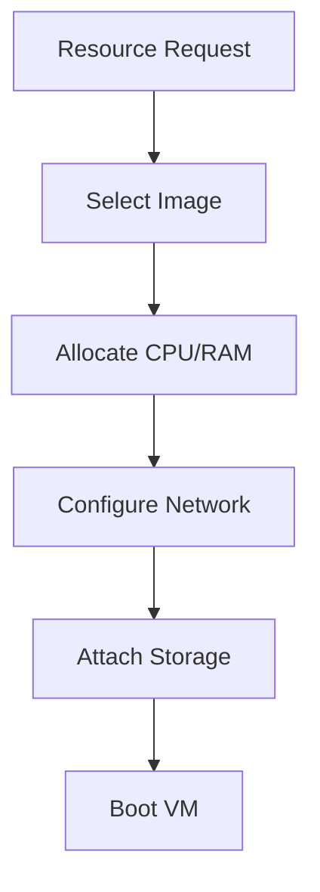

---

# Lecture 4 — VMs, Hypervisors, VMware vSphere, Imaging and OVF

## 4.1 Virtual Machine

A virtual machine is a software-defined computer with virtualized:

- CPU,
- memory,
- storage,
- network interfaces.

---

## 4.2 Hypervisor

A hypervisor creates and manages virtual machines.

### Type 1

Runs directly on physical hardware.

Examples:

- VMware ESXi
- Microsoft Hyper-V
- Xen

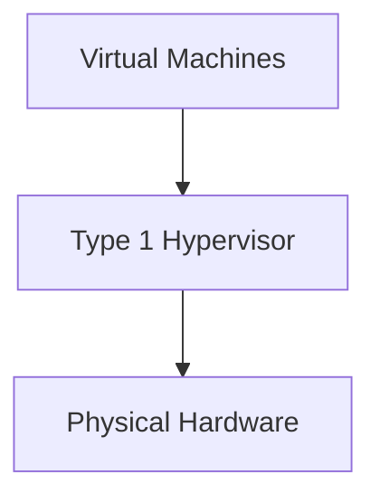

### Type 2

Runs on top of a host operating system.

Examples:

- VMware Workstation
- Oracle VirtualBox

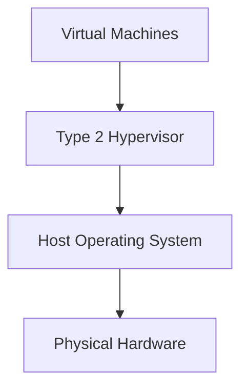

---

## 4.3 Type 1 vs Type 2

| Feature | Type 1 | Type 2 |
|---|---|---|
| Location | Directly on hardware | On host OS |
| Typical use | Data centers | Desktop/testing |
| Overhead | Generally lower | Generally higher |
| Example | ESXi | VirtualBox |

---

## 4.4 VMware vSphere

VMware vSphere is an enterprise virtualization platform.

Important components historically include:

- VMware ESXi,
- vCenter Server.

Capabilities include:

- VM management,
- resource management,
- high availability,
- live migration.

---

## 4.5 Machine Imaging

A machine image is a packaged representation of a system that can be used to create or restore instances.

It can include:

- operating system,
- applications,
- configuration,
- files.

### Example

Create one configured Linux image and use it to deploy many similar servers.

---

## 4.6 OVF

**Open Virtualization Format (OVF)** is a standard packaging format for virtual appliances.

It helps with:

- distribution,
- portability,
- deployment,
- exchange of virtual machines.

---

# Lecture 5 — Application Porting, Cloud APIs and AppZero

## 5.1 Application Porting

Application porting means adapting or moving an application so it can run in another environment.

Example:

```text
Local Server
     ↓
Compatibility Analysis
     ↓
Modification
     ↓
Testing
     ↓
Cloud Deployment
```

---

## 5.2 Why Port Applications?

- Cloud migration.
- New operating system support.
- Improved scalability.
- Modernization.
- Infrastructure changes.

---

## 5.3 Cloud API

A Cloud API provides programmatic access to cloud resources.

For example, an API can allow software to:

- create a VM,
- upload a file,
- create a database,
- read metrics.

---

## 5.4 API Analogy

Think of an API as a waiter.

```text
Customer = Application
Waiter = API
Kitchen = Cloud Service
```

The customer does not directly enter the kitchen. The waiter carries the request.

---

## 5.5 AppZero

AppZero is associated with application virtualization and migration technology.

Its goal is to package applications and their dependencies so that they can be moved between environments more easily.

---

# Lecture 6 — PaaS, Salesforce and Force.com

## 6.1 PaaS

PaaS provides a development and runtime environment.

The developer can focus on:

- application code,
- application configuration,
- application data.

The provider handles much of the underlying infrastructure.

---

## 6.2 Salesforce

Salesforce is a cloud-based CRM platform.

CRM means Customer Relationship Management.

It supports activities such as:

- customer information management,
- sales management,
- service operations,
- reporting,
- workflow automation.

---

## 6.3 Force.com

Force.com was Salesforce's platform for building custom applications on its cloud environment.

Conceptually:

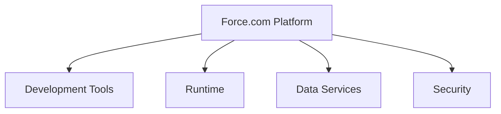

---

## 6.4 PaaS Application Development

Typical process:

```text
Plan
 ↓
Develop
 ↓
Test
 ↓
Deploy
 ↓
Monitor
 ↓
Update
```

---

# Lecture 7 — Google Cloud Ecosystem

## 7.1 Google Cloud Platform

Google Cloud is a cloud platform offering:

- compute,
- storage,
- databases,
- networking,
- analytics,
- AI/ML,
- application platforms.

---

## 7.2 Google Applications Portfolio

Examples include:

- Gmail,
- Google Drive,
- Google Docs,
- Google Sheets,
- Google Meet,
- Google Calendar.

These demonstrate cloud-delivered applications.

---

## 7.3 Indexed Search

Search engines build indexes of discoverable web content.

Simplified process:

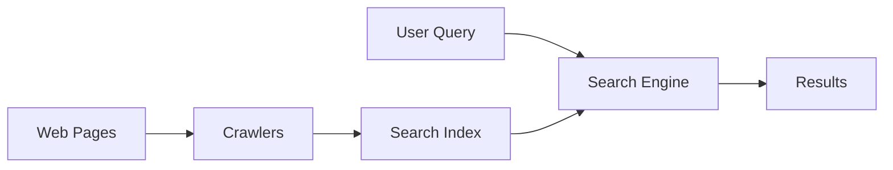

---

## 7.4 Surface Web, Deep Web and Dark Web

### Surface Web

Content that is generally discoverable and indexed by search engines.

### Deep Web

Content that is not generally indexed and may require authentication.

Examples:

- private email inbox,
- bank portal,
- private enterprise system.

### Dark Web

A portion of the Internet intentionally hidden from normal indexing and typically accessed through specialized software/networks.

---

## 7.5 Aggregation

Aggregation combines information or services from multiple sources.

Example:

A service aggregates data from multiple providers and presents it through one interface.

---

## 7.6 Disintermediation

Disintermediation removes an intermediary from a transaction.

Traditional:

```text
Customer → Agent → Provider
```

Direct:

```text
Customer → Provider
```

---

## 7.7 Productivity Applications

Examples:

- Google Docs,
- Google Sheets,
- Google Slides,
- Google Calendar.

Benefits:

- collaboration,
- automatic synchronization,
- accessibility,
- sharing.

---

## 7.8 Google Ads

Google Ads is an online advertising platform.

Advertisers can display ads across Google's advertising ecosystem.

---

## 7.9 Google Analytics

Google Analytics provides web and app analytics.

Typical information includes:

- traffic,
- user interactions,
- acquisition channels,
- conversions,
- engagement.

---

## 7.10 Google Translate

Google Translate provides machine translation services across many languages.

It demonstrates how language processing can be delivered as an online service.

---

## 7.11 Google Web Toolkit

Google Web Toolkit (GWT) is a development framework historically used to build browser applications using Java-based development that can be compiled to JavaScript.

---

## 7.12 Google APIs

APIs allow developers to integrate Google services.

Examples:

- Google Maps APIs,
- Google Drive APIs,
- YouTube APIs.

---

## 7.13 Google App Engine

Google App Engine is a platform for deploying applications without requiring the developer to manage the underlying server infrastructure directly.

Key concepts:

- managed runtime,
- deployment,
- scaling,
- application services.

---

# Lecture 8 — Microsoft Azure

## 8.1 What is Azure?

Microsoft Azure is Microsoft's cloud computing platform.

It provides services for:

- compute,
- storage,
- databases,
- networking,
- security,
- analytics,
- application development.

---

## 8.2 Azure Architecture

A simplified conceptual architecture:

```mermaid
flowchart TB
    U[Users] --> A[Azure Services]
    A --> C[Compute]
    A --> S[Storage]
    A --> D[Database]
    A --> N[Networking]
    A --> AI[AI and Analytics]
    A --> SEC[Security]
```

---

## 8.3 Compute

Azure provides virtual machines and managed compute services.

---

## 8.4 Storage

Azure provides storage for:

- objects,
- files,
- disks,
- backups.

Blob Storage is an important object-storage service.

---

## 8.5 Azure AppFabric

Azure AppFabric was a historical set of services associated with application integration and cloud middleware concepts.

Important concepts included:

- service connectivity,
- access control,
- caching,
- service bus-style communication.

---

## 8.6 Content Delivery Network

A CDN distributes content through geographically distributed edge locations.

```mermaid
flowchart LR
    O[Origin Server] --> E1[Edge Location A]
    O --> E2[Edge Location B]
    O --> E3[Edge Location C]
    E1 --> U1[Users A]
    E2 --> U2[Users B]
    E3 --> U3[Users C]
```

### Benefit

Users can receive content from a nearby edge location, reducing latency.

---

## 8.7 SQL Azure

SQL Azure, now commonly referred to as Azure SQL Database in current terminology, is Microsoft's managed relational database service.

Features include:

- managed operation,
- scalability,
- backups,
- security features,
- high availability capabilities.

---

## 8.8 Windows Live Services

Windows Live was Microsoft's historical branding for a family of online consumer services.

Examples historically associated with the ecosystem include:

- Hotmail/Outlook.com,
- SkyDrive/OneDrive,
- calendar and contacts services.

---

# UNIT 3 — CLOUD INFRASTRUCTURE AND SECURITY

---

# Lecture 1 — Cloud Management and NMS

## 1.1 Cloud Management

Cloud management is the process of monitoring, controlling, provisioning, optimizing, and securing cloud resources.

It can involve:

- compute,
- storage,
- networking,
- applications,
- identities,
- costs.

---

## 1.2 Network Management System

A Network Management System (NMS) is software used to monitor and manage network infrastructure.

Typical devices include:

- routers,
- switches,
- firewalls,
- servers,
- wireless devices.

---

## 1.3 NMS Functions

### Monitoring

Checks whether systems are operating.

### Fault Management

Detects failures and raises alerts.

### Configuration Management

Tracks and manages device configurations.

### Performance Management

Measures:

- latency,
- bandwidth,
- utilization,
- throughput.

### Security Management

Monitors security-related events and controls.

### Accounting

Tracks resource usage.

---

## 1.4 FCAPS

FCAPS is a classic network-management functional model.

| Letter | Meaning |
|---|---|
| F | Fault Management |
| C | Configuration Management |
| A | Accounting Management |
| P | Performance Management |
| S | Security Management |

### Memory Trick

> **FCAPS = Fault, Configuration, Accounting, Performance, Security**

---

# Lecture 2 — Cloud Vendors and Monitoring

## 2.1 Major Cloud Vendors

### AWS

Examples:

- EC2 — compute,
- S3 — object storage,
- RDS — managed relational database,
- CloudWatch — monitoring.

### Microsoft Azure

Examples:

- Azure Virtual Machines,
- Blob Storage,
- Azure SQL Database,
- Azure Monitor.

### Google Cloud

Examples:

- Compute Engine,
- Cloud Storage,
- Cloud SQL,
- Google Cloud Monitoring.

### IBM Cloud

Provides cloud infrastructure, platform services, AI, data, and hybrid-cloud capabilities.

---

## 2.2 Cloud Monitoring

Cloud monitoring means observing the health and performance of cloud resources.

Metrics may include:

- CPU utilization,
- memory usage,
- disk utilization,
- network traffic,
- request count,
- latency,
- error rate.

---

## 2.3 Deployment Stack Monitoring

A cloud application is not one single layer.

A simplified stack:

```mermaid
flowchart TB
    A[Application]
    DB[Database]
    OS[Operating System]
    VM[Virtual Machine]
    N[Network]
    H[Hardware]
    A --> DB
    DB --> OS
    OS --> VM
    VM --> N
    N --> H
```

Each layer may have different monitoring requirements.

---

## 2.4 Application Monitoring

Measures:

- response time,
- failures,
- throughput,
- availability.

---

## 2.5 Database Monitoring

Measures:

- query performance,
- connections,
- storage,
- replication,
- errors.

---

## 2.6 VM and OS Monitoring

Measures:

- CPU,
- memory,
- disk,
- processes,
- system errors.

---

## 2.7 Network Monitoring

Measures:

- latency,
- bandwidth,
- packet loss,
- connectivity.

---

# Lecture 3 — Cloud Service Lifecycle

## 3.1 Lifecycle Management

Lifecycle management covers the stages through which a cloud service passes from initial idea to retirement.

A simplified six-stage model:

```mermaid
flowchart LR
    P[Planning] --> D[Design]
    D --> DEV[Development]
    DEV --> DEP[Deployment]
    DEP --> O[Operation and Maintenance]
    O --> R[Retirement]
```

---

## 3.2 Planning

Identify:

- business requirements,
- users,
- budget,
- security requirements,
- service model,
- deployment model.

---

## 3.3 Design

Define:

- architecture,
- database,
- networking,
- security,
- scaling strategy.

---

## 3.4 Development

Build and test the application.

Activities:

- coding,
- integration,
- unit testing,
- system testing.

---

## 3.5 Deployment

Make the service available in the target cloud environment.

---

## 3.6 Operation and Maintenance

Activities include:

- monitoring,
- patching,
- backups,
- performance optimization,
- incident management.

---

## 3.7 Retirement

When the service is no longer required:

- preserve required records,
- migrate data if necessary,
- remove resources,
- revoke access,
- terminate service.

---

# Lecture 4 — Cloud Security Concepts

## 4.1 Cloud Security

Cloud security consists of technologies, processes, controls, and policies used to protect cloud systems and data.

---

## 4.2 Major Security Concerns

### Data Breach

Unauthorized access to sensitive information.

### Data Loss

Loss or destruction of data.

### Account Hijacking

An attacker obtains control of an account.

### Insecure APIs

Poorly protected interfaces can expose resources.

### Denial of Service

An attacker attempts to make a service unavailable.

### Insider Threat

A trusted user misuses legitimate access.

---

## 4.3 Security Boundary

A security boundary separates resources or environments with different trust/security requirements.

```mermaid
flowchart LR
    U[Untrusted Network] --> F[Firewall]
    F --> B[Security Boundary]
    B --> C[Protected Cloud Resources]
```

---

## 4.4 Security Service Boundary

A security service boundary describes where security responsibilities are divided between the cloud provider and customer.

This is closely related to the **shared responsibility model**.

Simplified example:

```text
Provider:
Physical infrastructure
Hardware
Data-center facilities
Underlying cloud platform

Customer:
Accounts
Passwords
Application configuration
Data
Access permissions
```

Exact responsibilities depend on the service model.

---

## 4.5 Security Mapping

Security mapping means matching security controls to assets and threats.

| Asset | Example Control |
|---|---|
| User account | MFA |
| Database | Encryption |
| Network | Firewall |
| Sensitive data | Access control |
| Logs | Integrity protection |

---

# Lecture 5 — Data Security, Encryption, Compliance and Identity

## 5.1 Data Security

Data security protects information from:

- unauthorized access,
- unauthorized modification,
- destruction,
- disclosure.

---

## 5.2 CIA Triad

The three fundamental security objectives are:

### Confidentiality

Only authorized entities can access information.

### Integrity

Information remains accurate and is not modified improperly.

### Availability

Authorized users can access information when needed.

```mermaid
graph TD
    C[Confidentiality]
    I[Integrity]
    A[Availability]
    C --- I
    I --- A
    A --- C
```

---

## 5.3 Brokered Cloud Storage Access

A storage broker can act as an intermediary between users/applications and storage services.

```mermaid
flowchart LR
    U[User/Application] --> B[Cloud Storage Broker]
    B --> A[AWS Storage]
    B --> AZ[Azure Storage]
    B --> G[Google Cloud Storage]
```

Potential benefits:

- centralized access,
- abstraction,
- policy enforcement,
- multi-provider management.

---

## 5.4 Storage Location

Storage location means the geographic or physical location in which data is stored.

It matters because of:

- latency,
- legal requirements,
- regulatory requirements,
- disaster recovery,
- data residency.

---

## 5.5 Tenancy

### Single Tenancy

Infrastructure or a resource is dedicated to one customer.

### Multi-Tenancy

Multiple customers share underlying infrastructure while logical isolation separates their resources.

```mermaid
flowchart TB
    H[Physical Infrastructure]
    H --> A[Tenant A]
    H --> B[Tenant B]
    H --> C[Tenant C]
```

---

## 5.6 Encryption

Encryption converts plaintext into ciphertext using an algorithm and key.

```mermaid
flowchart LR
    P[Plaintext] --> E[Encryption + Key]
    E --> C[Ciphertext]
    C --> D[Decryption + Key]
    D --> P2[Plaintext]
```

---

## 5.7 Symmetric Encryption

The same secret key is used for encryption and decryption.

Example:

- AES.

### Advantages

- Fast.
- Suitable for large amounts of data.

---

## 5.8 Asymmetric Encryption

Uses a key pair:

- public key,
- private key.

Example:

- RSA.

### Concept

Data encrypted with an appropriate public key can be decrypted with the corresponding private key in applicable schemes.

---

## 5.9 Auditing

Auditing involves reviewing system activity and controls.

Audit information may include:

- login events,
- data access,
- configuration changes,
- administrative actions.

---

## 5.10 Compliance

Compliance means meeting applicable laws, regulations, standards, and organizational policies.

Examples often discussed in cloud security:

- ISO/IEC 27001,
- GDPR,
- HIPAA,
- PCI DSS.

The applicable requirement depends on the organization and data involved.

---

## 5.11 Identity Management

Identity management handles:

- user identities,
- authentication,
- authorization,
- account lifecycle,
- access policies.

---

## 5.12 Authentication vs Authorization

### Authentication

Answers:

> **Who are you?**

Examples:

- password,
- OTP,
- biometrics,
- security key.

### Authorization

Answers:

> **What are you allowed to do?**

Example:

```text
Student:
View marks

Teacher:
View + update marks

Administrator:
Manage users + permissions
```

---

## 5.13 OAuth 2.0

OAuth 2.0 is an authorization framework.

It allows an application to obtain limited access to a resource on behalf of a user without requiring the application to know the user's password.

---

## 5.14 OpenID Connect

OpenID Connect builds an authentication layer on top of OAuth 2.0.

It is commonly used for modern identity/login systems.

---

## 5.15 SAML

SAML is an XML-based standard commonly used for exchanging authentication and authorization information between identity providers and service providers.

It is widely associated with enterprise Single Sign-On.

---

## 5.16 LDAP

LDAP is a protocol used to access and manage directory information.

It is commonly used in enterprise environments for:

- users,
- groups,
- organizational identities.

---

# MASTER COMPARISON TABLES

## IaaS vs PaaS vs SaaS

| Feature | IaaS | PaaS | SaaS |
|---|---|---|---|
| Main user | IT/admin/developer | Developer | End user |
| Provides | Infrastructure | Platform | Application |
| Customer manages app | Yes | Yes | Usually no |
| Customer manages OS | Usually yes | Usually no | No |
| Example | EC2 | App Engine | Gmail |

---

## Public vs Private vs Community vs Hybrid

| Feature | Public | Private | Community | Hybrid |
|---|---|---|---|---|
| Users | Multiple customers | One organization | Related organizations | Mixed |
| Control | Provider-centric | Higher organizational control | Shared | Mixed |
| Cost | Often economical | Often higher | Shared | Variable |
| Main benefit | Scalability | Control | Common requirements | Flexibility |

---

## Type 1 vs Type 2 Hypervisor

| Feature | Type 1 | Type 2 |
|---|---|---|
| Runs on | Hardware | Host OS |
| Common environment | Data center | Desktop |
| Example | ESXi | VirtualBox |
| Typical overhead | Lower | Higher |

---

## Authentication vs Authorization

| Authentication | Authorization |
|---|---|
| Verifies identity | Determines permissions |
| "Who are you?" | "What can you do?" |
| Login | Access decision |

---

## Single vs Multi-Tenancy

| Single Tenant | Multi Tenant |
|---|---|
| Dedicated environment | Shared underlying infrastructure |
| Strong isolation | Logical isolation |
| Potentially higher cost | Efficient resource utilization |

---

# MASTER MEMORY SHEET

## Cloud Fundamentals

```text
NIST Characteristics:
On-demand
Broad network access
Resource pooling
Rapid elasticity
Measured service
```

Memory:

> **O-B-R-R-M**

---

## Deployment Models

> **Public → Private → Community → Hybrid**

Memory:

> **PPCH**

---

## Service Models

> **IaaS → PaaS → SaaS**

Think:

> Infrastructure → Platform → Software

---

## FCAPS

> Fault → Configuration → Accounting → Performance → Security

---

## CIA

> Confidentiality → Integrity → Availability

---

## Lifecycle

> Planning → Design → Development → Deployment → Operation → Retirement

---

## Identity

> Authentication → Authorization

Remember:

> **Authentication = Who?**  
> **Authorization = What?**

---

# IMPORTANT MAKAUT QUESTIONS

## Unit 1

### Short Questions

1. Define cloud computing.
2. What is resource pooling?
3. What is elasticity?
4. Define public cloud.
5. Define private cloud.
6. What is hybrid cloud?
7. What is IaaS?
8. What is PaaS?
9. What is SaaS?
10. Define composability.

### Long Questions

1. Explain the characteristics of cloud computing.
2. Explain NIST deployment models.
3. Differentiate IaaS, PaaS and SaaS.
4. Explain the cloud reference model.
5. Explain the benefits and limitations of cloud computing.
6. Explain cloud communication protocols.

---

# Unit 2

### Short Questions

1. Define virtualization.
2. What is a hypervisor?
3. Differentiate Type 1 and Type 2 hypervisors.
4. What is VM migration?
5. Define P2V.
6. Define V2V.
7. What is load balancing?
8. What is OVF?
9. What is a machine image?
10. What is a cloud API?
11. What is Salesforce?
12. What is Force.com?
13. What is Google App Engine?
14. What is Azure?
15. What is CDN?

### Long Questions

1. Explain virtualization with a diagram.
2. Explain hypervisor types.
3. Explain VM mobility.
4. Explain load balancing.
5. Explain machine imaging and OVF.
6. Explain application porting.
7. Explain PaaS using Salesforce and Force.com.
8. Explain Google Cloud services.
9. Explain Microsoft Azure architecture.
10. Explain CDN and its benefits.

---

# Unit 3

### Short Questions

1. Define cloud management.
2. What is NMS?
3. Explain FCAPS.
4. What is cloud monitoring?
5. What is a cloud service lifecycle?
6. Define security boundary.
7. What is a data breach?
8. Define CIA triad.
9. What is encryption?
10. Define multi-tenancy.
11. What is auditing?
12. What is compliance?
13. What is identity management?
14. Differentiate authentication and authorization.
15. What is OAuth?
16. What is SAML?
17. What is LDAP?

### Long Questions

1. Explain Network Management System and FCAPS.
2. Explain cloud monitoring across the deployment stack.
3. Explain the six stages of cloud service lifecycle.
4. Discuss major cloud security concerns.
5. Explain security boundary and service boundary.
6. Explain CIA triad.
7. Explain encryption and its types.
8. Explain auditing and compliance.
9. Explain identity management and identity protocols.
10. Explain storage location and tenancy.

---

# 5-MARK ANSWER TEMPLATE

Use this structure for most definition/theory questions:

## 1. Definition

Start with a direct definition.

## 2. Explanation

Explain the concept in 3–5 sentences.

## 3. Components/Types

List the important categories.

## 4. Diagram

Draw a simple architecture.

## 5. Example

Give one practical example.

## 6. Conclusion

Mention why the concept is important.

---

# 10-MARK ANSWER TEMPLATE

For a 10-mark question:

```text
1. Definition
2. Background / Need
3. Architecture
4. Components
5. Working
6. Example
7. Advantages
8. Limitations
9. Comparison if relevant
10. Conclusion
```

---

# LAST-MINUTE REVISION

## Unit 1

Cloud computing:

> Computing resources delivered as services over a network.

Five NIST characteristics:

> On-demand self-service  
> Broad network access  
> Resource pooling  
> Rapid elasticity  
> Measured service

Deployment:

> Public / Private / Community / Hybrid

Service:

> IaaS / PaaS / SaaS

---

## Unit 2

Virtualization:

> Logical representation of physical resources.

Hypervisor:

> Creates and manages VMs.

Mobility:

> P2V / V2V / V2P / Live Migration

Load balancing:

> Distributes workload across resources.

OVF:

> Standard format for packaging virtual appliances.

PaaS:

> Platform for building and deploying applications.

Google Cloud:

> Compute / Storage / APIs / App Engine / Analytics

Azure:

> Compute / Storage / Database / Networking / Security

---

## Unit 3

NMS:

> Monitors and manages network infrastructure.

FCAPS:

> Fault / Configuration / Accounting / Performance / Security

Cloud monitoring:

> Observing cloud resources and application health.

Lifecycle:

> Planning / Design / Development / Deployment / Operation / Retirement

Security:

> Protect data, identities, applications and infrastructure.

CIA:

> Confidentiality / Integrity / Availability

Encryption:

> Plaintext → Ciphertext

Identity:

> Authentication + Authorization

Protocols:

> OAuth / OIDC / SAML / LDAP

---

# FINAL CONCEPT MAP

```mermaid
flowchart TD
    CC[Cloud Computing]

    CC --> U1[Unit 1: Fundamentals]
    CC --> U2[Unit 2: Virtualization and Platforms]
    CC --> U3[Unit 3: Infrastructure and Security]

    U1 --> C[Characteristics]
    U1 --> D[Deployment Models]
    U1 --> S[Service Models]
    U1 --> R[Reference Model]
    U1 --> A[Applications and APIs]

    U2 --> V[Virtualization]
    U2 --> H[Hypervisors]
    U2 --> M[VM Mobility]
    U2 --> L[Load Balancing]
    U2 --> P[PaaS Platforms]
    U2 --> G[Google Cloud]
    U2 --> AZ[Microsoft Azure]

    U3 --> N[NMS]
    U3 --> MON[Monitoring]
    U3 --> LC[Lifecycle]
    U3 --> SEC[Security]
    U3 --> DATA[Data Security]
    U3 --> ID[Identity Management]

    SEC --> CIA[CIA Triad]
    SEC --> ENC[Encryption]
    SEC --> COMP[Compliance]
    ID --> AUTH[Authentication]
    ID --> AUTHZ[Authorization]
```

---

# Final Exam Strategy

Do not try to memorize every paragraph.

For every topic, remember:

```text
Definition
   ↓
Purpose
   ↓
Architecture
   ↓
Working
   ↓
Example
   ↓
Advantages
   ↓
Comparison
```

If you understand those seven parts, you can construct most 5- and 10-mark answers yourself.

---

# Final Checklist

Before the examination, make sure you can explain without looking at the notes:

- [ ] Cloud computing definition
- [ ] Five NIST characteristics
- [ ] Four deployment models
- [ ] IaaS / PaaS / SaaS
- [ ] Cloud reference model
- [ ] Virtualization
- [ ] Hypervisor
- [ ] Type 1 vs Type 2
- [ ] P2V / V2V / V2P
- [ ] Live migration
- [ ] Load balancing
- [ ] Machine imaging
- [ ] OVF
- [ ] Application porting
- [ ] Cloud APIs
- [ ] Salesforce / Force.com
- [ ] Google Cloud
- [ ] Azure
- [ ] CDN
- [ ] NMS
- [ ] FCAPS
- [ ] Cloud monitoring
- [ ] Cloud lifecycle
- [ ] Cloud security concerns
- [ ] Security boundary
- [ ] CIA triad
- [ ] Encryption
- [ ] Tenancy
- [ ] Auditing
- [ ] Compliance
- [ ] Authentication
- [ ] Authorization
- [ ] OAuth
- [ ] OIDC
- [ ] SAML
- [ ] LDAP

---

# End of Units 1–3

**Cloud Computing — MAKAUT B.Tech CSE**

> Learn the concept → understand the diagram → practice the comparison → write the answer from memory.


# Unit 1 — Active Recall Drill

## 1. Cloud fundamentals — Active Recall

Before checking the answer, explain the topic aloud in your own words.

### Question 1
What is **Cloud fundamentals**?

### Question 2
Why is **Cloud fundamentals** needed in cloud computing?

### Question 3
What are the main components or categories related to **Cloud fundamentals**?

### Question 4
Give one real-world example of **Cloud fundamentals**.

### Question 5
Draw the architecture of **Cloud fundamentals** from memory.

### Exam Practice
Write a 5-mark answer for **Cloud fundamentals** using:
1. Definition
2. Explanation
3. Components
4. Example
5. Diagram or comparison
6. Conclusion

### One-Line Recall
> **Cloud fundamentals = ______________________________**

## 2. NIST deployment models — Active Recall

Before checking the answer, explain the topic aloud in your own words.

### Question 1
What is **NIST deployment models**?

### Question 2
Why is **NIST deployment models** needed in cloud computing?

### Question 3
What are the main components or categories related to **NIST deployment models**?

### Question 4
Give one real-world example of **NIST deployment models**.

### Question 5
Draw the architecture of **NIST deployment models** from memory.

### Exam Practice
Write a 5-mark answer for **NIST deployment models** using:
1. Definition
2. Explanation
3. Components
4. Example
5. Diagram or comparison
6. Conclusion

### One-Line Recall
> **NIST deployment models = ______________________________**

## 3. IaaS/PaaS/SaaS — Active Recall

Before checking the answer, explain the topic aloud in your own words.

### Question 1
What is **IaaS/PaaS/SaaS**?

### Question 2
Why is **IaaS/PaaS/SaaS** needed in cloud computing?

### Question 3
What are the main components or categories related to **IaaS/PaaS/SaaS**?

### Question 4
Give one real-world example of **IaaS/PaaS/SaaS**.

### Question 5
Draw the architecture of **IaaS/PaaS/SaaS** from memory.

### Exam Practice
Write a 5-mark answer for **IaaS/PaaS/SaaS** using:
1. Definition
2. Explanation
3. Components
4. Example
5. Diagram or comparison
6. Conclusion

### One-Line Recall
> **IaaS/PaaS/SaaS = ______________________________**

## 4. Reference model — Active Recall

Before checking the answer, explain the topic aloud in your own words.

### Question 1
What is **Reference model**?

### Question 2
Why is **Reference model** needed in cloud computing?

### Question 3
What are the main components or categories related to **Reference model**?

### Question 4
Give one real-world example of **Reference model**.

### Question 5
Draw the architecture of **Reference model** from memory.

### Exam Practice
Write a 5-mark answer for **Reference model** using:
1. Definition
2. Explanation
3. Components
4. Example
5. Diagram or comparison
6. Conclusion

### One-Line Recall
> **Reference model = ______________________________**

## 5. Composability — Active Recall

Before checking the answer, explain the topic aloud in your own words.

### Question 1
What is **Composability**?

### Question 2
Why is **Composability** needed in cloud computing?

### Question 3
What are the main components or categories related to **Composability**?

### Question 4
Give one real-world example of **Composability**.

### Question 5
Draw the architecture of **Composability** from memory.

### Exam Practice
Write a 5-mark answer for **Composability** using:
1. Definition
2. Explanation
3. Components
4. Example
5. Diagram or comparison
6. Conclusion

### One-Line Recall
> **Composability = ______________________________**

## 6. Protocols — Active Recall

Before checking the answer, explain the topic aloud in your own words.

### Question 1
What is **Protocols**?

### Question 2
Why is **Protocols** needed in cloud computing?

### Question 3
What are the main components or categories related to **Protocols**?

### Question 4
Give one real-world example of **Protocols**.

### Question 5
Draw the architecture of **Protocols** from memory.

### Exam Practice
Write a 5-mark answer for **Protocols** using:
1. Definition
2. Explanation
3. Components
4. Example
5. Diagram or comparison
6. Conclusion

### One-Line Recall
> **Protocols = ______________________________**

## 7. Client connection and workloads — Active Recall

Before checking the answer, explain the topic aloud in your own words.

### Question 1
What is **Client connection and workloads**?

### Question 2
Why is **Client connection and workloads** needed in cloud computing?

### Question 3
What are the main components or categories related to **Client connection and workloads**?

### Question 4
Give one real-world example of **Client connection and workloads**.

### Question 5
Draw the architecture of **Client connection and workloads** from memory.

### Exam Practice
Write a 5-mark answer for **Client connection and workloads** using:
1. Definition
2. Explanation
3. Components
4. Example
5. Diagram or comparison
6. Conclusion

### One-Line Recall
> **Client connection and workloads = ______________________________**

## 8. SOA and XaaS — Active Recall

Before checking the answer, explain the topic aloud in your own words.

### Question 1
What is **SOA and XaaS**?

### Question 2
Why is **SOA and XaaS** needed in cloud computing?

### Question 3
What are the main components or categories related to **SOA and XaaS**?

### Question 4
Give one real-world example of **SOA and XaaS**.

### Question 5
Draw the architecture of **SOA and XaaS** from memory.

### Exam Practice
Write a 5-mark answer for **SOA and XaaS** using:
1. Definition
2. Explanation
3. Components
4. Example
5. Diagram or comparison
6. Conclusion

### One-Line Recall
> **SOA and XaaS = ______________________________**


# Unit 2 — Active Recall Drill

## 1. Abstraction and virtualization — Active Recall

Before checking the answer, explain the topic aloud in your own words.

### Question 1
What is **Abstraction and virtualization**?

### Question 2
Why is **Abstraction and virtualization** needed in cloud computing?

### Question 3
What are the main components or categories related to **Abstraction and virtualization**?

### Question 4
Give one real-world example of **Abstraction and virtualization**.

### Question 5
Draw the architecture of **Abstraction and virtualization** from memory.

### Exam Practice
Write a 5-mark answer for **Abstraction and virtualization** using:
1. Definition
2. Explanation
3. Components
4. Example
5. Diagram or comparison
6. Conclusion

### One-Line Recall
> **Abstraction and virtualization = ______________________________**

## 2. VM mobility — Active Recall

Before checking the answer, explain the topic aloud in your own words.

### Question 1
What is **VM mobility**?

### Question 2
Why is **VM mobility** needed in cloud computing?

### Question 3
What are the main components or categories related to **VM mobility**?

### Question 4
Give one real-world example of **VM mobility**.

### Question 5
Draw the architecture of **VM mobility** from memory.

### Exam Practice
Write a 5-mark answer for **VM mobility** using:
1. Definition
2. Explanation
3. Components
4. Example
5. Diagram or comparison
6. Conclusion

### One-Line Recall
> **VM mobility = ______________________________**

## 3. Load balancing — Active Recall

Before checking the answer, explain the topic aloud in your own words.

### Question 1
What is **Load balancing**?

### Question 2
Why is **Load balancing** needed in cloud computing?

### Question 3
What are the main components or categories related to **Load balancing**?

### Question 4
Give one real-world example of **Load balancing**.

### Question 5
Draw the architecture of **Load balancing** from memory.

### Exam Practice
Write a 5-mark answer for **Load balancing** using:
1. Definition
2. Explanation
3. Components
4. Example
5. Diagram or comparison
6. Conclusion

### One-Line Recall
> **Load balancing = ______________________________**

## 4. Hypervisors and OVF — Active Recall

Before checking the answer, explain the topic aloud in your own words.

### Question 1
What is **Hypervisors and OVF**?

### Question 2
Why is **Hypervisors and OVF** needed in cloud computing?

### Question 3
What are the main components or categories related to **Hypervisors and OVF**?

### Question 4
Give one real-world example of **Hypervisors and OVF**.

### Question 5
Draw the architecture of **Hypervisors and OVF** from memory.

### Exam Practice
Write a 5-mark answer for **Hypervisors and OVF** using:
1. Definition
2. Explanation
3. Components
4. Example
5. Diagram or comparison
6. Conclusion

### One-Line Recall
> **Hypervisors and OVF = ______________________________**

## 5. Application porting and APIs — Active Recall

Before checking the answer, explain the topic aloud in your own words.

### Question 1
What is **Application porting and APIs**?

### Question 2
Why is **Application porting and APIs** needed in cloud computing?

### Question 3
What are the main components or categories related to **Application porting and APIs**?

### Question 4
Give one real-world example of **Application porting and APIs**.

### Question 5
Draw the architecture of **Application porting and APIs** from memory.

### Exam Practice
Write a 5-mark answer for **Application porting and APIs** using:
1. Definition
2. Explanation
3. Components
4. Example
5. Diagram or comparison
6. Conclusion

### One-Line Recall
> **Application porting and APIs = ______________________________**

## 6. PaaS and Salesforce — Active Recall

Before checking the answer, explain the topic aloud in your own words.

### Question 1
What is **PaaS and Salesforce**?

### Question 2
Why is **PaaS and Salesforce** needed in cloud computing?

### Question 3
What are the main components or categories related to **PaaS and Salesforce**?

### Question 4
Give one real-world example of **PaaS and Salesforce**.

### Question 5
Draw the architecture of **PaaS and Salesforce** from memory.

### Exam Practice
Write a 5-mark answer for **PaaS and Salesforce** using:
1. Definition
2. Explanation
3. Components
4. Example
5. Diagram or comparison
6. Conclusion

### One-Line Recall
> **PaaS and Salesforce = ______________________________**

## 7. Google Cloud — Active Recall

Before checking the answer, explain the topic aloud in your own words.

### Question 1
What is **Google Cloud**?

### Question 2
Why is **Google Cloud** needed in cloud computing?

### Question 3
What are the main components or categories related to **Google Cloud**?

### Question 4
Give one real-world example of **Google Cloud**.

### Question 5
Draw the architecture of **Google Cloud** from memory.

### Exam Practice
Write a 5-mark answer for **Google Cloud** using:
1. Definition
2. Explanation
3. Components
4. Example
5. Diagram or comparison
6. Conclusion

### One-Line Recall
> **Google Cloud = ______________________________**

## 8. Azure — Active Recall

Before checking the answer, explain the topic aloud in your own words.

### Question 1
What is **Azure**?

### Question 2
Why is **Azure** needed in cloud computing?

### Question 3
What are the main components or categories related to **Azure**?

### Question 4
Give one real-world example of **Azure**.

### Question 5
Draw the architecture of **Azure** from memory.

### Exam Practice
Write a 5-mark answer for **Azure** using:
1. Definition
2. Explanation
3. Components
4. Example
5. Diagram or comparison
6. Conclusion

### One-Line Recall
> **Azure = ______________________________**


# Unit 3 — Active Recall Drill

## 1. NMS and FCAPS — Active Recall

Before checking the answer, explain the topic aloud in your own words.

### Question 1
What is **NMS and FCAPS**?

### Question 2
Why is **NMS and FCAPS** needed in cloud computing?

### Question 3
What are the main components or categories related to **NMS and FCAPS**?

### Question 4
Give one real-world example of **NMS and FCAPS**.

### Question 5
Draw the architecture of **NMS and FCAPS** from memory.

### Exam Practice
Write a 5-mark answer for **NMS and FCAPS** using:
1. Definition
2. Explanation
3. Components
4. Example
5. Diagram or comparison
6. Conclusion

### One-Line Recall
> **NMS and FCAPS = ______________________________**

## 2. Cloud vendors and monitoring — Active Recall

Before checking the answer, explain the topic aloud in your own words.

### Question 1
What is **Cloud vendors and monitoring**?

### Question 2
Why is **Cloud vendors and monitoring** needed in cloud computing?

### Question 3
What are the main components or categories related to **Cloud vendors and monitoring**?

### Question 4
Give one real-world example of **Cloud vendors and monitoring**.

### Question 5
Draw the architecture of **Cloud vendors and monitoring** from memory.

### Exam Practice
Write a 5-mark answer for **Cloud vendors and monitoring** using:
1. Definition
2. Explanation
3. Components
4. Example
5. Diagram or comparison
6. Conclusion

### One-Line Recall
> **Cloud vendors and monitoring = ______________________________**

## 3. Service lifecycle — Active Recall

Before checking the answer, explain the topic aloud in your own words.

### Question 1
What is **Service lifecycle**?

### Question 2
Why is **Service lifecycle** needed in cloud computing?

### Question 3
What are the main components or categories related to **Service lifecycle**?

### Question 4
Give one real-world example of **Service lifecycle**.

### Question 5
Draw the architecture of **Service lifecycle** from memory.

### Exam Practice
Write a 5-mark answer for **Service lifecycle** using:
1. Definition
2. Explanation
3. Components
4. Example
5. Diagram or comparison
6. Conclusion

### One-Line Recall
> **Service lifecycle = ______________________________**

## 4. Cloud security — Active Recall

Before checking the answer, explain the topic aloud in your own words.

### Question 1
What is **Cloud security**?

### Question 2
Why is **Cloud security** needed in cloud computing?

### Question 3
What are the main components or categories related to **Cloud security**?

### Question 4
Give one real-world example of **Cloud security**.

### Question 5
Draw the architecture of **Cloud security** from memory.

### Exam Practice
Write a 5-mark answer for **Cloud security** using:
1. Definition
2. Explanation
3. Components
4. Example
5. Diagram or comparison
6. Conclusion

### One-Line Recall
> **Cloud security = ______________________________**

## 5. Data security and identity — Active Recall

Before checking the answer, explain the topic aloud in your own words.

### Question 1
What is **Data security and identity**?

### Question 2
Why is **Data security and identity** needed in cloud computing?

### Question 3
What are the main components or categories related to **Data security and identity**?

### Question 4
Give one real-world example of **Data security and identity**.

### Question 5
Draw the architecture of **Data security and identity** from memory.

### Exam Practice
Write a 5-mark answer for **Data security and identity** using:
1. Definition
2. Explanation
3. Components
4. Example
5. Diagram or comparison
6. Conclusion

### One-Line Recall
> **Data security and identity = ______________________________**


# Unit 1 — Flashcard Bank

## Flashcard 1: Cloud computing

**Definition:**  
Write a one-sentence definition of Cloud computing.

**Why it matters:**  
Explain the problem that Cloud computing solves.

**Key points:**  
- Point 1
- Point 2
- Point 3

**Example:**  
Give one practical cloud-computing example.

**Exam phrase:**  
> Cloud computing is an important concept because it ____________________.

**Recall question:**  
What is Cloud computing?


## Flashcard 2: Public cloud

**Definition:**  
Write a one-sentence definition of Public cloud.

**Why it matters:**  
Explain the problem that Public cloud solves.

**Key points:**  
- Point 1
- Point 2
- Point 3

**Example:**  
Give one practical cloud-computing example.

**Exam phrase:**  
> Public cloud is an important concept because it ____________________.

**Recall question:**  
What is Public cloud?


## Flashcard 3: Private cloud

**Definition:**  
Write a one-sentence definition of Private cloud.

**Why it matters:**  
Explain the problem that Private cloud solves.

**Key points:**  
- Point 1
- Point 2
- Point 3

**Example:**  
Give one practical cloud-computing example.

**Exam phrase:**  
> Private cloud is an important concept because it ____________________.

**Recall question:**  
What is Private cloud?


## Flashcard 4: Community cloud

**Definition:**  
Write a one-sentence definition of Community cloud.

**Why it matters:**  
Explain the problem that Community cloud solves.

**Key points:**  
- Point 1
- Point 2
- Point 3

**Example:**  
Give one practical cloud-computing example.

**Exam phrase:**  
> Community cloud is an important concept because it ____________________.

**Recall question:**  
What is Community cloud?


## Flashcard 5: Hybrid cloud

**Definition:**  
Write a one-sentence definition of Hybrid cloud.

**Why it matters:**  
Explain the problem that Hybrid cloud solves.

**Key points:**  
- Point 1
- Point 2
- Point 3

**Example:**  
Give one practical cloud-computing example.

**Exam phrase:**  
> Hybrid cloud is an important concept because it ____________________.

**Recall question:**  
What is Hybrid cloud?


## Flashcard 6: IaaS

**Definition:**  
Write a one-sentence definition of IaaS.

**Why it matters:**  
Explain the problem that IaaS solves.

**Key points:**  
- Point 1
- Point 2
- Point 3

**Example:**  
Give one practical cloud-computing example.

**Exam phrase:**  
> IaaS is an important concept because it ____________________.

**Recall question:**  
What is IaaS?


## Flashcard 7: PaaS

**Definition:**  
Write a one-sentence definition of PaaS.

**Why it matters:**  
Explain the problem that PaaS solves.

**Key points:**  
- Point 1
- Point 2
- Point 3

**Example:**  
Give one practical cloud-computing example.

**Exam phrase:**  
> PaaS is an important concept because it ____________________.

**Recall question:**  
What is PaaS?


## Flashcard 8: SaaS

**Definition:**  
Write a one-sentence definition of SaaS.

**Why it matters:**  
Explain the problem that SaaS solves.

**Key points:**  
- Point 1
- Point 2
- Point 3

**Example:**  
Give one practical cloud-computing example.

**Exam phrase:**  
> SaaS is an important concept because it ____________________.

**Recall question:**  
What is SaaS?


## Flashcard 9: Resource pooling

**Definition:**  
Write a one-sentence definition of Resource pooling.

**Why it matters:**  
Explain the problem that Resource pooling solves.

**Key points:**  
- Point 1
- Point 2
- Point 3

**Example:**  
Give one practical cloud-computing example.

**Exam phrase:**  
> Resource pooling is an important concept because it ____________________.

**Recall question:**  
What is Resource pooling?


## Flashcard 10: Elasticity

**Definition:**  
Write a one-sentence definition of Elasticity.

**Why it matters:**  
Explain the problem that Elasticity solves.

**Key points:**  
- Point 1
- Point 2
- Point 3

**Example:**  
Give one practical cloud-computing example.

**Exam phrase:**  
> Elasticity is an important concept because it ____________________.

**Recall question:**  
What is Elasticity?


## Flashcard 11: Measured service

**Definition:**  
Write a one-sentence definition of Measured service.

**Why it matters:**  
Explain the problem that Measured service solves.

**Key points:**  
- Point 1
- Point 2
- Point 3

**Example:**  
Give one practical cloud-computing example.

**Exam phrase:**  
> Measured service is an important concept because it ____________________.

**Recall question:**  
What is Measured service?


## Flashcard 12: Cloud reference model

**Definition:**  
Write a one-sentence definition of Cloud reference model.

**Why it matters:**  
Explain the problem that Cloud reference model solves.

**Key points:**  
- Point 1
- Point 2
- Point 3

**Example:**  
Give one practical cloud-computing example.

**Exam phrase:**  
> Cloud reference model is an important concept because it ____________________.

**Recall question:**  
What is Cloud reference model?


## Flashcard 13: Composability

**Definition:**  
Write a one-sentence definition of Composability.

**Why it matters:**  
Explain the problem that Composability solves.

**Key points:**  
- Point 1
- Point 2
- Point 3

**Example:**  
Give one practical cloud-computing example.

**Exam phrase:**  
> Composability is an important concept because it ____________________.

**Recall question:**  
What is Composability?


## Flashcard 14: Cloud API

**Definition:**  
Write a one-sentence definition of Cloud API.

**Why it matters:**  
Explain the problem that Cloud API solves.

**Key points:**  
- Point 1
- Point 2
- Point 3

**Example:**  
Give one practical cloud-computing example.

**Exam phrase:**  
> Cloud API is an important concept because it ____________________.

**Recall question:**  
What is Cloud API?


## Flashcard 15: SOA

**Definition:**  
Write a one-sentence definition of SOA.

**Why it matters:**  
Explain the problem that SOA solves.

**Key points:**  
- Point 1
- Point 2
- Point 3

**Example:**  
Give one practical cloud-computing example.

**Exam phrase:**  
> SOA is an important concept because it ____________________.

**Recall question:**  
What is SOA?


# Unit 2 — Flashcard Bank

## Flashcard 1: Abstraction

**Definition:**  
Write a one-sentence definition of Abstraction.

**Why it matters:**  
Explain the problem that Abstraction solves.

**Key points:**  
- Point 1
- Point 2
- Point 3

**Example:**  
Give one practical cloud-computing example.

**Exam phrase:**  
> Abstraction is an important concept because it ____________________.

**Recall question:**  
What is Abstraction?


## Flashcard 2: Virtualization

**Definition:**  
Write a one-sentence definition of Virtualization.

**Why it matters:**  
Explain the problem that Virtualization solves.

**Key points:**  
- Point 1
- Point 2
- Point 3

**Example:**  
Give one practical cloud-computing example.

**Exam phrase:**  
> Virtualization is an important concept because it ____________________.

**Recall question:**  
What is Virtualization?


## Flashcard 3: Hypervisor

**Definition:**  
Write a one-sentence definition of Hypervisor.

**Why it matters:**  
Explain the problem that Hypervisor solves.

**Key points:**  
- Point 1
- Point 2
- Point 3

**Example:**  
Give one practical cloud-computing example.

**Exam phrase:**  
> Hypervisor is an important concept because it ____________________.

**Recall question:**  
What is Hypervisor?


## Flashcard 4: Type 1 hypervisor

**Definition:**  
Write a one-sentence definition of Type 1 hypervisor.

**Why it matters:**  
Explain the problem that Type 1 hypervisor solves.

**Key points:**  
- Point 1
- Point 2
- Point 3

**Example:**  
Give one practical cloud-computing example.

**Exam phrase:**  
> Type 1 hypervisor is an important concept because it ____________________.

**Recall question:**  
What is Type 1 hypervisor?


## Flashcard 5: Type 2 hypervisor

**Definition:**  
Write a one-sentence definition of Type 2 hypervisor.

**Why it matters:**  
Explain the problem that Type 2 hypervisor solves.

**Key points:**  
- Point 1
- Point 2
- Point 3

**Example:**  
Give one practical cloud-computing example.

**Exam phrase:**  
> Type 2 hypervisor is an important concept because it ____________________.

**Recall question:**  
What is Type 2 hypervisor?


## Flashcard 6: P2V

**Definition:**  
Write a one-sentence definition of P2V.

**Why it matters:**  
Explain the problem that P2V solves.

**Key points:**  
- Point 1
- Point 2
- Point 3

**Example:**  
Give one practical cloud-computing example.

**Exam phrase:**  
> P2V is an important concept because it ____________________.

**Recall question:**  
What is P2V?


## Flashcard 7: V2V

**Definition:**  
Write a one-sentence definition of V2V.

**Why it matters:**  
Explain the problem that V2V solves.

**Key points:**  
- Point 1
- Point 2
- Point 3

**Example:**  
Give one practical cloud-computing example.

**Exam phrase:**  
> V2V is an important concept because it ____________________.

**Recall question:**  
What is V2V?


## Flashcard 8: V2P

**Definition:**  
Write a one-sentence definition of V2P.

**Why it matters:**  
Explain the problem that V2P solves.

**Key points:**  
- Point 1
- Point 2
- Point 3

**Example:**  
Give one practical cloud-computing example.

**Exam phrase:**  
> V2P is an important concept because it ____________________.

**Recall question:**  
What is V2P?


## Flashcard 9: Live migration

**Definition:**  
Write a one-sentence definition of Live migration.

**Why it matters:**  
Explain the problem that Live migration solves.

**Key points:**  
- Point 1
- Point 2
- Point 3

**Example:**  
Give one practical cloud-computing example.

**Exam phrase:**  
> Live migration is an important concept because it ____________________.

**Recall question:**  
What is Live migration?


## Flashcard 10: Load balancing

**Definition:**  
Write a one-sentence definition of Load balancing.

**Why it matters:**  
Explain the problem that Load balancing solves.

**Key points:**  
- Point 1
- Point 2
- Point 3

**Example:**  
Give one practical cloud-computing example.

**Exam phrase:**  
> Load balancing is an important concept because it ____________________.

**Recall question:**  
What is Load balancing?


## Flashcard 11: VM provisioning

**Definition:**  
Write a one-sentence definition of VM provisioning.

**Why it matters:**  
Explain the problem that VM provisioning solves.

**Key points:**  
- Point 1
- Point 2
- Point 3

**Example:**  
Give one practical cloud-computing example.

**Exam phrase:**  
> VM provisioning is an important concept because it ____________________.

**Recall question:**  
What is VM provisioning?


## Flashcard 12: Machine image

**Definition:**  
Write a one-sentence definition of Machine image.

**Why it matters:**  
Explain the problem that Machine image solves.

**Key points:**  
- Point 1
- Point 2
- Point 3

**Example:**  
Give one practical cloud-computing example.

**Exam phrase:**  
> Machine image is an important concept because it ____________________.

**Recall question:**  
What is Machine image?


## Flashcard 13: OVF

**Definition:**  
Write a one-sentence definition of OVF.

**Why it matters:**  
Explain the problem that OVF solves.

**Key points:**  
- Point 1
- Point 2
- Point 3

**Example:**  
Give one practical cloud-computing example.

**Exam phrase:**  
> OVF is an important concept because it ____________________.

**Recall question:**  
What is OVF?


## Flashcard 14: Application porting

**Definition:**  
Write a one-sentence definition of Application porting.

**Why it matters:**  
Explain the problem that Application porting solves.

**Key points:**  
- Point 1
- Point 2
- Point 3

**Example:**  
Give one practical cloud-computing example.

**Exam phrase:**  
> Application porting is an important concept because it ____________________.

**Recall question:**  
What is Application porting?


## Flashcard 15: Salesforce

**Definition:**  
Write a one-sentence definition of Salesforce.

**Why it matters:**  
Explain the problem that Salesforce solves.

**Key points:**  
- Point 1
- Point 2
- Point 3

**Example:**  
Give one practical cloud-computing example.

**Exam phrase:**  
> Salesforce is an important concept because it ____________________.

**Recall question:**  
What is Salesforce?


## Flashcard 16: Force.com

**Definition:**  
Write a one-sentence definition of Force.com.

**Why it matters:**  
Explain the problem that Force.com solves.

**Key points:**  
- Point 1
- Point 2
- Point 3

**Example:**  
Give one practical cloud-computing example.

**Exam phrase:**  
> Force.com is an important concept because it ____________________.

**Recall question:**  
What is Force.com?


## Flashcard 17: Google App Engine

**Definition:**  
Write a one-sentence definition of Google App Engine.

**Why it matters:**  
Explain the problem that Google App Engine solves.

**Key points:**  
- Point 1
- Point 2
- Point 3

**Example:**  
Give one practical cloud-computing example.

**Exam phrase:**  
> Google App Engine is an important concept because it ____________________.

**Recall question:**  
What is Google App Engine?


## Flashcard 18: Azure

**Definition:**  
Write a one-sentence definition of Azure.

**Why it matters:**  
Explain the problem that Azure solves.

**Key points:**  
- Point 1
- Point 2
- Point 3

**Example:**  
Give one practical cloud-computing example.

**Exam phrase:**  
> Azure is an important concept because it ____________________.

**Recall question:**  
What is Azure?


## Flashcard 19: CDN

**Definition:**  
Write a one-sentence definition of CDN.

**Why it matters:**  
Explain the problem that CDN solves.

**Key points:**  
- Point 1
- Point 2
- Point 3

**Example:**  
Give one practical cloud-computing example.

**Exam phrase:**  
> CDN is an important concept because it ____________________.

**Recall question:**  
What is CDN?


## Flashcard 20: SQL Azure

**Definition:**  
Write a one-sentence definition of SQL Azure.

**Why it matters:**  
Explain the problem that SQL Azure solves.

**Key points:**  
- Point 1
- Point 2
- Point 3

**Example:**  
Give one practical cloud-computing example.

**Exam phrase:**  
> SQL Azure is an important concept because it ____________________.

**Recall question:**  
What is SQL Azure?


# Unit 3 — Flashcard Bank

## Flashcard 1: Cloud management

**Definition:**  
Write a one-sentence definition of Cloud management.

**Why it matters:**  
Explain the problem that Cloud management solves.

**Key points:**  
- Point 1
- Point 2
- Point 3

**Example:**  
Give one practical cloud-computing example.

**Exam phrase:**  
> Cloud management is an important concept because it ____________________.

**Recall question:**  
What is Cloud management?


## Flashcard 2: NMS

**Definition:**  
Write a one-sentence definition of NMS.

**Why it matters:**  
Explain the problem that NMS solves.

**Key points:**  
- Point 1
- Point 2
- Point 3

**Example:**  
Give one practical cloud-computing example.

**Exam phrase:**  
> NMS is an important concept because it ____________________.

**Recall question:**  
What is NMS?


## Flashcard 3: FCAPS

**Definition:**  
Write a one-sentence definition of FCAPS.

**Why it matters:**  
Explain the problem that FCAPS solves.

**Key points:**  
- Point 1
- Point 2
- Point 3

**Example:**  
Give one practical cloud-computing example.

**Exam phrase:**  
> FCAPS is an important concept because it ____________________.

**Recall question:**  
What is FCAPS?


## Flashcard 4: Cloud monitoring

**Definition:**  
Write a one-sentence definition of Cloud monitoring.

**Why it matters:**  
Explain the problem that Cloud monitoring solves.

**Key points:**  
- Point 1
- Point 2
- Point 3

**Example:**  
Give one practical cloud-computing example.

**Exam phrase:**  
> Cloud monitoring is an important concept because it ____________________.

**Recall question:**  
What is Cloud monitoring?


## Flashcard 5: Lifecycle management

**Definition:**  
Write a one-sentence definition of Lifecycle management.

**Why it matters:**  
Explain the problem that Lifecycle management solves.

**Key points:**  
- Point 1
- Point 2
- Point 3

**Example:**  
Give one practical cloud-computing example.

**Exam phrase:**  
> Lifecycle management is an important concept because it ____________________.

**Recall question:**  
What is Lifecycle management?


## Flashcard 6: Security boundary

**Definition:**  
Write a one-sentence definition of Security boundary.

**Why it matters:**  
Explain the problem that Security boundary solves.

**Key points:**  
- Point 1
- Point 2
- Point 3

**Example:**  
Give one practical cloud-computing example.

**Exam phrase:**  
> Security boundary is an important concept because it ____________________.

**Recall question:**  
What is Security boundary?


## Flashcard 7: Security service boundary

**Definition:**  
Write a one-sentence definition of Security service boundary.

**Why it matters:**  
Explain the problem that Security service boundary solves.

**Key points:**  
- Point 1
- Point 2
- Point 3

**Example:**  
Give one practical cloud-computing example.

**Exam phrase:**  
> Security service boundary is an important concept because it ____________________.

**Recall question:**  
What is Security service boundary?


## Flashcard 8: Security mapping

**Definition:**  
Write a one-sentence definition of Security mapping.

**Why it matters:**  
Explain the problem that Security mapping solves.

**Key points:**  
- Point 1
- Point 2
- Point 3

**Example:**  
Give one practical cloud-computing example.

**Exam phrase:**  
> Security mapping is an important concept because it ____________________.

**Recall question:**  
What is Security mapping?


## Flashcard 9: CIA triad

**Definition:**  
Write a one-sentence definition of CIA triad.

**Why it matters:**  
Explain the problem that CIA triad solves.

**Key points:**  
- Point 1
- Point 2
- Point 3

**Example:**  
Give one practical cloud-computing example.

**Exam phrase:**  
> CIA triad is an important concept because it ____________________.

**Recall question:**  
What is CIA triad?


## Flashcard 10: Storage location

**Definition:**  
Write a one-sentence definition of Storage location.

**Why it matters:**  
Explain the problem that Storage location solves.

**Key points:**  
- Point 1
- Point 2
- Point 3

**Example:**  
Give one practical cloud-computing example.

**Exam phrase:**  
> Storage location is an important concept because it ____________________.

**Recall question:**  
What is Storage location?


## Flashcard 11: Single tenancy

**Definition:**  
Write a one-sentence definition of Single tenancy.

**Why it matters:**  
Explain the problem that Single tenancy solves.

**Key points:**  
- Point 1
- Point 2
- Point 3

**Example:**  
Give one practical cloud-computing example.

**Exam phrase:**  
> Single tenancy is an important concept because it ____________________.

**Recall question:**  
What is Single tenancy?


## Flashcard 12: Multi-tenancy

**Definition:**  
Write a one-sentence definition of Multi-tenancy.

**Why it matters:**  
Explain the problem that Multi-tenancy solves.

**Key points:**  
- Point 1
- Point 2
- Point 3

**Example:**  
Give one practical cloud-computing example.

**Exam phrase:**  
> Multi-tenancy is an important concept because it ____________________.

**Recall question:**  
What is Multi-tenancy?


## Flashcard 13: Encryption

**Definition:**  
Write a one-sentence definition of Encryption.

**Why it matters:**  
Explain the problem that Encryption solves.

**Key points:**  
- Point 1
- Point 2
- Point 3

**Example:**  
Give one practical cloud-computing example.

**Exam phrase:**  
> Encryption is an important concept because it ____________________.

**Recall question:**  
What is Encryption?


## Flashcard 14: Auditing

**Definition:**  
Write a one-sentence definition of Auditing.

**Why it matters:**  
Explain the problem that Auditing solves.

**Key points:**  
- Point 1
- Point 2
- Point 3

**Example:**  
Give one practical cloud-computing example.

**Exam phrase:**  
> Auditing is an important concept because it ____________________.

**Recall question:**  
What is Auditing?


## Flashcard 15: Compliance

**Definition:**  
Write a one-sentence definition of Compliance.

**Why it matters:**  
Explain the problem that Compliance solves.

**Key points:**  
- Point 1
- Point 2
- Point 3

**Example:**  
Give one practical cloud-computing example.

**Exam phrase:**  
> Compliance is an important concept because it ____________________.

**Recall question:**  
What is Compliance?


## Flashcard 16: Identity management

**Definition:**  
Write a one-sentence definition of Identity management.

**Why it matters:**  
Explain the problem that Identity management solves.

**Key points:**  
- Point 1
- Point 2
- Point 3

**Example:**  
Give one practical cloud-computing example.

**Exam phrase:**  
> Identity management is an important concept because it ____________________.

**Recall question:**  
What is Identity management?


## Flashcard 17: Authentication

**Definition:**  
Write a one-sentence definition of Authentication.

**Why it matters:**  
Explain the problem that Authentication solves.

**Key points:**  
- Point 1
- Point 2
- Point 3

**Example:**  
Give one practical cloud-computing example.

**Exam phrase:**  
> Authentication is an important concept because it ____________________.

**Recall question:**  
What is Authentication?


## Flashcard 18: Authorization

**Definition:**  
Write a one-sentence definition of Authorization.

**Why it matters:**  
Explain the problem that Authorization solves.

**Key points:**  
- Point 1
- Point 2
- Point 3

**Example:**  
Give one practical cloud-computing example.

**Exam phrase:**  
> Authorization is an important concept because it ____________________.

**Recall question:**  
What is Authorization?


## Flashcard 19: OAuth

**Definition:**  
Write a one-sentence definition of OAuth.

**Why it matters:**  
Explain the problem that OAuth solves.

**Key points:**  
- Point 1
- Point 2
- Point 3

**Example:**  
Give one practical cloud-computing example.

**Exam phrase:**  
> OAuth is an important concept because it ____________________.

**Recall question:**  
What is OAuth?


## Flashcard 20: OIDC

**Definition:**  
Write a one-sentence definition of OIDC.

**Why it matters:**  
Explain the problem that OIDC solves.

**Key points:**  
- Point 1
- Point 2
- Point 3

**Example:**  
Give one practical cloud-computing example.

**Exam phrase:**  
> OIDC is an important concept because it ____________________.

**Recall question:**  
What is OIDC?


## Flashcard 21: SAML

**Definition:**  
Write a one-sentence definition of SAML.

**Why it matters:**  
Explain the problem that SAML solves.

**Key points:**  
- Point 1
- Point 2
- Point 3

**Example:**  
Give one practical cloud-computing example.

**Exam phrase:**  
> SAML is an important concept because it ____________________.

**Recall question:**  
What is SAML?


## Flashcard 22: LDAP

**Definition:**  
Write a one-sentence definition of LDAP.

**Why it matters:**  
Explain the problem that LDAP solves.

**Key points:**  
- Point 1
- Point 2
- Point 3

**Example:**  
Give one practical cloud-computing example.

**Exam phrase:**  
> LDAP is an important concept because it ____________________.

**Recall question:**  
What is LDAP?


