# CYBER SECURITY — COMPLETE 4-UNIT MASTER NOTES

> **Detailed university exam notes — all four units in one Markdown file**
>
> This master file combines the four Cyber Security modules studied in this course: Introduction to Cyber Security; Hackers and Cyber Crimes; Ethical Hacking and Social Engineering; and Cyber Forensics and Auditing.
>
> **Study method:** Learn the definition first, understand the process second, connect it to a real-world example third, and then practice the 2/5/10-mark questions.

## Table of Contents

1. Unit 1 — Introduction to Cyber Security
2. Unit 2 — Hackers and Cyber Crimes
3. Unit 3 — Ethical Hacking and Social Engineering
4. Unit 4 — Cyber Forensics and Auditing
5. Master revision tables
6. Question bank
7. Final one-day revision sheet

---

# UNIT 1 — INTRODUCTION TO CYBER SECURITY

## Unit overview
This unit is written as a connected story rather than as isolated definitions. For every topic, focus on **what it is, why it matters, how it works, how it is defended, and how to write it in an examination**.

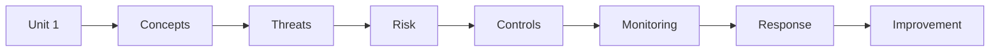

## 1. Introduction to Cyber Security

### 1. Exam-ready definition
**Introduction to Cyber Security** is a cybersecurity concept that must be understood in terms of purpose, process, risks, controls, and practical application.

### 2. Core idea
- cyber security protects systems, networks, applications, devices, and information from unauthorized or harmful activity.
- security is a continuous process rather than a one-time installation.
- the main goals are confidentiality, integrity, availability, authenticity, accountability, and resilience.
- security decisions should begin with identifying assets and understanding their business value.

### 3. Why this topic matters
- It connects a theoretical security principle with a practical security decision.
- It helps an examiner evaluate whether the student understands both the definition and its application.
- It provides a foundation for later topics in risk management, incident response, forensics, auditing, and governance.
- It explains why security controls must be selected according to assets, threats, vulnerabilities, and impact.
- It reinforces that cybersecurity is a continuous process of prevention, detection, response, and recovery.

### 4. Concept map
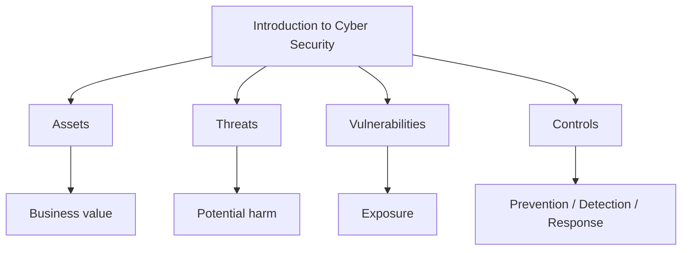

### 5. Step-by-step understanding
**Identify:** Identify the assets, people, systems, data, or processes involved.
- Exam point: explain why identify is necessary instead of merely listing the step.
**Understand:** Understand how the asset works and what normal behavior looks like.
- Exam point: explain why understand is necessary instead of merely listing the step.
**Assess:** Consider threats, vulnerabilities, likelihood, and possible impact.
- Exam point: explain why assess is necessary instead of merely listing the step.
**Protect:** Choose appropriate preventive and detective controls.
- Exam point: explain why protect is necessary instead of merely listing the step.
**Monitor:** Collect relevant logs, alerts, and evidence.
- Exam point: explain why monitor is necessary instead of merely listing the step.
**Respond:** Use a defined process when suspicious activity or an incident occurs.
- Exam point: explain why respond is necessary instead of merely listing the step.
**Recover:** Restore secure operations and verify that weaknesses are addressed.
- Exam point: explain why recover is necessary instead of merely listing the step.
**Improve:** Use lessons learned to strengthen future security decisions.
- Exam point: explain why improve is necessary instead of merely listing the step.

### 6. Important terms
- **Asset:** Something valuable that requires protection.
- **Threat:** A potential source or event that can cause harm.
- **Vulnerability:** A weakness that may be exploited or otherwise lead to loss.
- **Risk:** The possibility of loss or harm resulting from threats and vulnerabilities.
- **Control:** A safeguard used to reduce risk or improve assurance.
- **Incident:** A security event or series of events that requires investigation or response.
- **Evidence:** Information that can support an investigation, decision, or finding.
- **Mitigation:** An action that reduces likelihood, impact, or exposure.

### 7. Practical example
Consider an organization applying **Introduction to Cyber Security** to a customer-facing digital service.
- First, the organization identifies the service, its data, users, dependencies, and business purpose.
- Next, the security team identifies realistic threats and weaknesses.
- The team selects controls that address the relevant risks without unnecessarily disrupting legitimate use.
- Monitoring is configured so that important security events can be detected and investigated.
- If an incident occurs, the organization follows its response and evidence-handling procedures.
- After recovery, the organization reviews lessons learned and improves the controls.

### 8. Security controls
- Strong authentication and authorization
- Least privilege
- Secure configuration and patch management
- Network segmentation
- Encryption where appropriate
- Logging and monitoring
- Backups and recovery procedures
- Security awareness and training
- Incident response procedures
- Periodic review and testing

### 9. Preventive, detective, and corrective view
| Control type | Purpose | Typical examples |
|---|---|---|
| Preventive | Reduce the chance of an incident | MFA, patching, access control |
| Detective | Discover suspicious or unauthorized activity | SIEM, IDS, audit logs |
| Corrective | Restore and improve after an event | Recovery, reconfiguration, lessons learned |

### 10. Advantages
- Improves understanding of organizational exposure.
- Supports consistent security decisions.
- Makes security requirements easier to communicate.
- Provides evidence for review, audit, and incident investigation.
- Encourages continuous improvement.

### 11. Limitations and challenges
- No control eliminates every possible risk.
- Security measures can introduce cost and operational complexity.
- Human behavior can weaken technically strong controls.
- Threats and technologies change over time.
- Incomplete visibility can lead to incorrect conclusions.

### 12. Common mistakes in exam answers
- Giving only a one-line definition when the question asks for a detailed explanation.
- Listing controls without explaining what risk each control addresses.
- Confusing a threat with a vulnerability or a control.
- Using examples without connecting them back to the concept.
- Ignoring legal, ethical, authorization, or evidence-handling requirements.

### 13. Comparison table
| Dimension | This topic | Related concept |
|---|---|---|
| Main focus | Understanding and managing the security issue | Broader security lifecycle |
| Primary question | What is it and how is it handled? | How does it connect to other controls? |
| Evidence | Logs, records, observations, configurations | Policies, procedures, technical results |
| Outcome | Better understanding and action | Better overall security posture |

### 14. Short exam answer
**Introduction to Cyber Security:**
Introduction to Cyber Security is an important part of cybersecurity because it helps an organization understand security requirements, identify relevant risks, apply suitable controls, and respond appropriately to security events. A complete answer should define the concept, explain its major elements, describe the process or lifecycle, give a practical example, and mention important controls or challenges.

### 15. 2-mark questions
- What is Introduction to Cyber Security?
- State two important points about Introduction to Cyber Security.
- Why is Introduction to Cyber Security important in cybersecurity?
- Give one practical example related to Introduction to Cyber Security.
- Name two controls relevant to Introduction to Cyber Security.

### 16. 5-mark questions
- Explain Introduction to Cyber Security with suitable examples.
- Describe the major components or stages associated with Introduction to Cyber Security.
- Discuss the importance and challenges of Introduction to Cyber Security.
- Differentiate the main concepts related to Introduction to Cyber Security.

### 17. 10-mark question
**Discuss Introduction to Cyber Security in detail.**
A strong answer should contain: definition, objectives, core concepts, step-by-step process, diagram, practical example, controls, advantages, limitations, and a concise conclusion.

### 18. Memory aid
**Remember:** Definition → Purpose → Process → Example → Controls → Challenges → Conclusion.

### 19. Last-minute revision
- cyber security protects systems, networks, applications, devices, and information from unauthorized or harmful activity.
- security is a continuous process rather than a one-time installation.
- the main goals are confidentiality, integrity, availability, authenticity, accountability, and resilience.
- security decisions should begin with identifying assets and understanding their business value.
- Connect the concept to confidentiality, integrity, availability, accountability, and resilience where relevant.
- Always state authorization and safe-use requirements when discussing security testing.

### 20. Detailed checklist
- [ ] Can I define the concept in two sentences?
- [ ] Can I explain it to a beginner using a real-world analogy?
- [ ] Can I draw a simple flowchart?
- [ ] Can I identify assets involved?
- [ ] Can I identify realistic threats?
- [ ] Can I identify vulnerabilities?
- [ ] Can I name preventive controls?
- [ ] Can I name detective controls?
- [ ] Can I explain response or recovery implications?
- [ ] Can I give an organization-level example?
- [ ] Can I compare it with a related concept?
- [ ] Can I explain at least two challenges?
- [ ] Can I write a 2-mark answer?
- [ ] Can I write a 5-mark answer?
- [ ] Can I structure a 10-mark answer?

---

## 2. Importance and Challenges in Cyber Security

### 1. Exam-ready definition
**Importance and Challenges in Cyber Security** is a cybersecurity concept that must be understood in terms of purpose, process, risks, controls, and practical application.

### 2. Core idea
- digital services create dependence on networks, cloud platforms, applications, and connected devices.
- a security failure can affect money, privacy, operations, safety, reputation, and legal obligations.
- modern challenges include rapid technology change, human error, supply-chain exposure, and evolving attacks.
- security controls must balance protection, usability, cost, availability, and organizational requirements.

### 3. Why this topic matters
- It connects a theoretical security principle with a practical security decision.
- It helps an examiner evaluate whether the student understands both the definition and its application.
- It provides a foundation for later topics in risk management, incident response, forensics, auditing, and governance.
- It explains why security controls must be selected according to assets, threats, vulnerabilities, and impact.
- It reinforces that cybersecurity is a continuous process of prevention, detection, response, and recovery.

### 4. Concept map
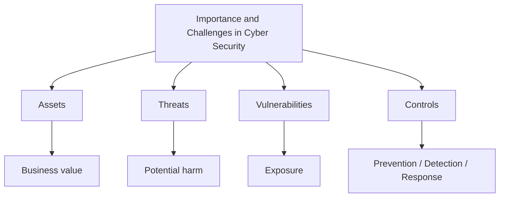

### 5. Step-by-step understanding
**Identify:** Identify the assets, people, systems, data, or processes involved.
- Exam point: explain why identify is necessary instead of merely listing the step.
**Understand:** Understand how the asset works and what normal behavior looks like.
- Exam point: explain why understand is necessary instead of merely listing the step.
**Assess:** Consider threats, vulnerabilities, likelihood, and possible impact.
- Exam point: explain why assess is necessary instead of merely listing the step.
**Protect:** Choose appropriate preventive and detective controls.
- Exam point: explain why protect is necessary instead of merely listing the step.
**Monitor:** Collect relevant logs, alerts, and evidence.
- Exam point: explain why monitor is necessary instead of merely listing the step.
**Respond:** Use a defined process when suspicious activity or an incident occurs.
- Exam point: explain why respond is necessary instead of merely listing the step.
**Recover:** Restore secure operations and verify that weaknesses are addressed.
- Exam point: explain why recover is necessary instead of merely listing the step.
**Improve:** Use lessons learned to strengthen future security decisions.
- Exam point: explain why improve is necessary instead of merely listing the step.

### 6. Important terms
- **Asset:** Something valuable that requires protection.
- **Threat:** A potential source or event that can cause harm.
- **Vulnerability:** A weakness that may be exploited or otherwise lead to loss.
- **Risk:** The possibility of loss or harm resulting from threats and vulnerabilities.
- **Control:** A safeguard used to reduce risk or improve assurance.
- **Incident:** A security event or series of events that requires investigation or response.
- **Evidence:** Information that can support an investigation, decision, or finding.
- **Mitigation:** An action that reduces likelihood, impact, or exposure.

### 7. Practical example
Consider an organization applying **Importance and Challenges in Cyber Security** to a customer-facing digital service.
- First, the organization identifies the service, its data, users, dependencies, and business purpose.
- Next, the security team identifies realistic threats and weaknesses.
- The team selects controls that address the relevant risks without unnecessarily disrupting legitimate use.
- Monitoring is configured so that important security events can be detected and investigated.
- If an incident occurs, the organization follows its response and evidence-handling procedures.
- After recovery, the organization reviews lessons learned and improves the controls.

### 8. Security controls
- Strong authentication and authorization
- Least privilege
- Secure configuration and patch management
- Network segmentation
- Encryption where appropriate
- Logging and monitoring
- Backups and recovery procedures
- Security awareness and training
- Incident response procedures
- Periodic review and testing

### 9. Preventive, detective, and corrective view
| Control type | Purpose | Typical examples |
|---|---|---|
| Preventive | Reduce the chance of an incident | MFA, patching, access control |
| Detective | Discover suspicious or unauthorized activity | SIEM, IDS, audit logs |
| Corrective | Restore and improve after an event | Recovery, reconfiguration, lessons learned |

### 10. Advantages
- Improves understanding of organizational exposure.
- Supports consistent security decisions.
- Makes security requirements easier to communicate.
- Provides evidence for review, audit, and incident investigation.
- Encourages continuous improvement.

### 11. Limitations and challenges
- No control eliminates every possible risk.
- Security measures can introduce cost and operational complexity.
- Human behavior can weaken technically strong controls.
- Threats and technologies change over time.
- Incomplete visibility can lead to incorrect conclusions.

### 12. Common mistakes in exam answers
- Giving only a one-line definition when the question asks for a detailed explanation.
- Listing controls without explaining what risk each control addresses.
- Confusing a threat with a vulnerability or a control.
- Using examples without connecting them back to the concept.
- Ignoring legal, ethical, authorization, or evidence-handling requirements.

### 13. Comparison table
| Dimension | This topic | Related concept |
|---|---|---|
| Main focus | Understanding and managing the security issue | Broader security lifecycle |
| Primary question | What is it and how is it handled? | How does it connect to other controls? |
| Evidence | Logs, records, observations, configurations | Policies, procedures, technical results |
| Outcome | Better understanding and action | Better overall security posture |

### 14. Short exam answer
**Importance and Challenges in Cyber Security:**
Importance and Challenges in Cyber Security is an important part of cybersecurity because it helps an organization understand security requirements, identify relevant risks, apply suitable controls, and respond appropriately to security events. A complete answer should define the concept, explain its major elements, describe the process or lifecycle, give a practical example, and mention important controls or challenges.

### 15. 2-mark questions
- What is Importance and Challenges in Cyber Security?
- State two important points about Importance and Challenges in Cyber Security.
- Why is Importance and Challenges in Cyber Security important in cybersecurity?
- Give one practical example related to Importance and Challenges in Cyber Security.
- Name two controls relevant to Importance and Challenges in Cyber Security.

### 16. 5-mark questions
- Explain Importance and Challenges in Cyber Security with suitable examples.
- Describe the major components or stages associated with Importance and Challenges in Cyber Security.
- Discuss the importance and challenges of Importance and Challenges in Cyber Security.
- Differentiate the main concepts related to Importance and Challenges in Cyber Security.

### 17. 10-mark question
**Discuss Importance and Challenges in Cyber Security in detail.**
A strong answer should contain: definition, objectives, core concepts, step-by-step process, diagram, practical example, controls, advantages, limitations, and a concise conclusion.

### 18. Memory aid
**Remember:** Definition → Purpose → Process → Example → Controls → Challenges → Conclusion.

### 19. Last-minute revision
- digital services create dependence on networks, cloud platforms, applications, and connected devices.
- a security failure can affect money, privacy, operations, safety, reputation, and legal obligations.
- modern challenges include rapid technology change, human error, supply-chain exposure, and evolving attacks.
- security controls must balance protection, usability, cost, availability, and organizational requirements.
- Connect the concept to confidentiality, integrity, availability, accountability, and resilience where relevant.
- Always state authorization and safe-use requirements when discussing security testing.

### 20. Detailed checklist
- [ ] Can I define the concept in two sentences?
- [ ] Can I explain it to a beginner using a real-world analogy?
- [ ] Can I draw a simple flowchart?
- [ ] Can I identify assets involved?
- [ ] Can I identify realistic threats?
- [ ] Can I identify vulnerabilities?
- [ ] Can I name preventive controls?
- [ ] Can I name detective controls?
- [ ] Can I explain response or recovery implications?
- [ ] Can I give an organization-level example?
- [ ] Can I compare it with a related concept?
- [ ] Can I explain at least two challenges?
- [ ] Can I write a 2-mark answer?
- [ ] Can I write a 5-mark answer?
- [ ] Can I structure a 10-mark answer?

---

## 3. Cyberspace

### 1. Exam-ready definition
**Cyberspace** is a cybersecurity concept that must be understood in terms of purpose, process, risks, controls, and practical application.

### 2. Core idea
- cyberspace is the interconnected environment formed by digital devices, networks, software, services, users, and data.
- it includes physical infrastructure as well as logical communication and information flows.
- IP addressing, routing, protocols, applications, and users work together to provide digital services.
- security in cyberspace requires protection across endpoints, networks, applications, identities, and data.

### 3. Why this topic matters
- It connects a theoretical security principle with a practical security decision.
- It helps an examiner evaluate whether the student understands both the definition and its application.
- It provides a foundation for later topics in risk management, incident response, forensics, auditing, and governance.
- It explains why security controls must be selected according to assets, threats, vulnerabilities, and impact.
- It reinforces that cybersecurity is a continuous process of prevention, detection, response, and recovery.

### 4. Concept map
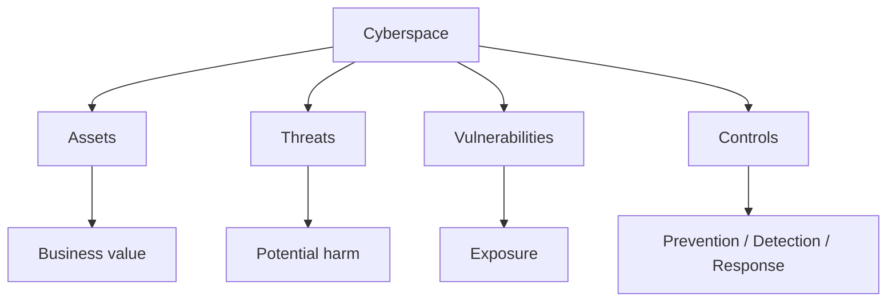

### 5. Step-by-step understanding
**Identify:** Identify the assets, people, systems, data, or processes involved.
- Exam point: explain why identify is necessary instead of merely listing the step.
**Understand:** Understand how the asset works and what normal behavior looks like.
- Exam point: explain why understand is necessary instead of merely listing the step.
**Assess:** Consider threats, vulnerabilities, likelihood, and possible impact.
- Exam point: explain why assess is necessary instead of merely listing the step.
**Protect:** Choose appropriate preventive and detective controls.
- Exam point: explain why protect is necessary instead of merely listing the step.
**Monitor:** Collect relevant logs, alerts, and evidence.
- Exam point: explain why monitor is necessary instead of merely listing the step.
**Respond:** Use a defined process when suspicious activity or an incident occurs.
- Exam point: explain why respond is necessary instead of merely listing the step.
**Recover:** Restore secure operations and verify that weaknesses are addressed.
- Exam point: explain why recover is necessary instead of merely listing the step.
**Improve:** Use lessons learned to strengthen future security decisions.
- Exam point: explain why improve is necessary instead of merely listing the step.

### 6. Important terms
- **Asset:** Something valuable that requires protection.
- **Threat:** A potential source or event that can cause harm.
- **Vulnerability:** A weakness that may be exploited or otherwise lead to loss.
- **Risk:** The possibility of loss or harm resulting from threats and vulnerabilities.
- **Control:** A safeguard used to reduce risk or improve assurance.
- **Incident:** A security event or series of events that requires investigation or response.
- **Evidence:** Information that can support an investigation, decision, or finding.
- **Mitigation:** An action that reduces likelihood, impact, or exposure.

### 7. Practical example
Consider an organization applying **Cyberspace** to a customer-facing digital service.
- First, the organization identifies the service, its data, users, dependencies, and business purpose.
- Next, the security team identifies realistic threats and weaknesses.
- The team selects controls that address the relevant risks without unnecessarily disrupting legitimate use.
- Monitoring is configured so that important security events can be detected and investigated.
- If an incident occurs, the organization follows its response and evidence-handling procedures.
- After recovery, the organization reviews lessons learned and improves the controls.

### 8. Security controls
- Strong authentication and authorization
- Least privilege
- Secure configuration and patch management
- Network segmentation
- Encryption where appropriate
- Logging and monitoring
- Backups and recovery procedures
- Security awareness and training
- Incident response procedures
- Periodic review and testing

### 9. Preventive, detective, and corrective view
| Control type | Purpose | Typical examples |
|---|---|---|
| Preventive | Reduce the chance of an incident | MFA, patching, access control |
| Detective | Discover suspicious or unauthorized activity | SIEM, IDS, audit logs |
| Corrective | Restore and improve after an event | Recovery, reconfiguration, lessons learned |

### 10. Advantages
- Improves understanding of organizational exposure.
- Supports consistent security decisions.
- Makes security requirements easier to communicate.
- Provides evidence for review, audit, and incident investigation.
- Encourages continuous improvement.

### 11. Limitations and challenges
- No control eliminates every possible risk.
- Security measures can introduce cost and operational complexity.
- Human behavior can weaken technically strong controls.
- Threats and technologies change over time.
- Incomplete visibility can lead to incorrect conclusions.

### 12. Common mistakes in exam answers
- Giving only a one-line definition when the question asks for a detailed explanation.
- Listing controls without explaining what risk each control addresses.
- Confusing a threat with a vulnerability or a control.
- Using examples without connecting them back to the concept.
- Ignoring legal, ethical, authorization, or evidence-handling requirements.

### 13. Comparison table
| Dimension | This topic | Related concept |
|---|---|---|
| Main focus | Understanding and managing the security issue | Broader security lifecycle |
| Primary question | What is it and how is it handled? | How does it connect to other controls? |
| Evidence | Logs, records, observations, configurations | Policies, procedures, technical results |
| Outcome | Better understanding and action | Better overall security posture |

### 14. Short exam answer
**Cyberspace:**
Cyberspace is an important part of cybersecurity because it helps an organization understand security requirements, identify relevant risks, apply suitable controls, and respond appropriately to security events. A complete answer should define the concept, explain its major elements, describe the process or lifecycle, give a practical example, and mention important controls or challenges.

### 15. 2-mark questions
- What is Cyberspace?
- State two important points about Cyberspace.
- Why is Cyberspace important in cybersecurity?
- Give one practical example related to Cyberspace.
- Name two controls relevant to Cyberspace.

### 16. 5-mark questions
- Explain Cyberspace with suitable examples.
- Describe the major components or stages associated with Cyberspace.
- Discuss the importance and challenges of Cyberspace.
- Differentiate the main concepts related to Cyberspace.

### 17. 10-mark question
**Discuss Cyberspace in detail.**
A strong answer should contain: definition, objectives, core concepts, step-by-step process, diagram, practical example, controls, advantages, limitations, and a concise conclusion.

### 18. Memory aid
**Remember:** Definition → Purpose → Process → Example → Controls → Challenges → Conclusion.

### 19. Last-minute revision
- cyberspace is the interconnected environment formed by digital devices, networks, software, services, users, and data.
- it includes physical infrastructure as well as logical communication and information flows.
- IP addressing, routing, protocols, applications, and users work together to provide digital services.
- security in cyberspace requires protection across endpoints, networks, applications, identities, and data.
- Connect the concept to confidentiality, integrity, availability, accountability, and resilience where relevant.
- Always state authorization and safe-use requirements when discussing security testing.

### 20. Detailed checklist
- [ ] Can I define the concept in two sentences?
- [ ] Can I explain it to a beginner using a real-world analogy?
- [ ] Can I draw a simple flowchart?
- [ ] Can I identify assets involved?
- [ ] Can I identify realistic threats?
- [ ] Can I identify vulnerabilities?
- [ ] Can I name preventive controls?
- [ ] Can I name detective controls?
- [ ] Can I explain response or recovery implications?
- [ ] Can I give an organization-level example?
- [ ] Can I compare it with a related concept?
- [ ] Can I explain at least two challenges?
- [ ] Can I write a 2-mark answer?
- [ ] Can I write a 5-mark answer?
- [ ] Can I structure a 10-mark answer?

---

## 4. Cyber Threats

### 1. Exam-ready definition
**Cyber Threats** is a cybersecurity concept that must be understood in terms of purpose, process, risks, controls, and practical application.

### 2. Core idea
- a cyber threat is a potential event, actor, technique, or condition capable of causing harm to digital assets.
- common categories include malware, phishing, credential attacks, denial of service, exploitation, and data theft.
- a threat becomes especially important when it can exploit a relevant vulnerability and produce meaningful impact.
- threat intelligence helps defenders understand likely actors, techniques, indicators, and trends.

### 3. Why this topic matters
- It connects a theoretical security principle with a practical security decision.
- It helps an examiner evaluate whether the student understands both the definition and its application.
- It provides a foundation for later topics in risk management, incident response, forensics, auditing, and governance.
- It explains why security controls must be selected according to assets, threats, vulnerabilities, and impact.
- It reinforces that cybersecurity is a continuous process of prevention, detection, response, and recovery.

### 4. Concept map


### 5. Step-by-step understanding
**Identify:** Identify the assets, people, systems, data, or processes involved.
- Exam point: explain why identify is necessary instead of merely listing the step.
**Understand:** Understand how the asset works and what normal behavior looks like.
- Exam point: explain why understand is necessary instead of merely listing the step.
**Assess:** Consider threats, vulnerabilities, likelihood, and possible impact.
- Exam point: explain why assess is necessary instead of merely listing the step.
**Protect:** Choose appropriate preventive and detective controls.
- Exam point: explain why protect is necessary instead of merely listing the step.
**Monitor:** Collect relevant logs, alerts, and evidence.
- Exam point: explain why monitor is necessary instead of merely listing the step.
**Respond:** Use a defined process when suspicious activity or an incident occurs.
- Exam point: explain why respond is necessary instead of merely listing the step.
**Recover:** Restore secure operations and verify that weaknesses are addressed.
- Exam point: explain why recover is necessary instead of merely listing the step.
**Improve:** Use lessons learned to strengthen future security decisions.
- Exam point: explain why improve is necessary instead of merely listing the step.

### 6. Important terms
- **Asset:** Something valuable that requires protection.
- **Threat:** A potential source or event that can cause harm.
- **Vulnerability:** A weakness that may be exploited or otherwise lead to loss.
- **Risk:** The possibility of loss or harm resulting from threats and vulnerabilities.
- **Control:** A safeguard used to reduce risk or improve assurance.
- **Incident:** A security event or series of events that requires investigation or response.
- **Evidence:** Information that can support an investigation, decision, or finding.
- **Mitigation:** An action that reduces likelihood, impact, or exposure.

### 7. Practical example
Consider an organization applying **Cyber Threats** to a customer-facing digital service.
- First, the organization identifies the service, its data, users, dependencies, and business purpose.
- Next, the security team identifies realistic threats and weaknesses.
- The team selects controls that address the relevant risks without unnecessarily disrupting legitimate use.
- Monitoring is configured so that important security events can be detected and investigated.
- If an incident occurs, the organization follows its response and evidence-handling procedures.
- After recovery, the organization reviews lessons learned and improves the controls.

### 8. Security controls
- Strong authentication and authorization
- Least privilege
- Secure configuration and patch management
- Network segmentation
- Encryption where appropriate
- Logging and monitoring
- Backups and recovery procedures
- Security awareness and training
- Incident response procedures
- Periodic review and testing

### 9. Preventive, detective, and corrective view
| Control type | Purpose | Typical examples |
|---|---|---|
| Preventive | Reduce the chance of an incident | MFA, patching, access control |
| Detective | Discover suspicious or unauthorized activity | SIEM, IDS, audit logs |
| Corrective | Restore and improve after an event | Recovery, reconfiguration, lessons learned |

### 10. Advantages
- Improves understanding of organizational exposure.
- Supports consistent security decisions.
- Makes security requirements easier to communicate.
- Provides evidence for review, audit, and incident investigation.
- Encourages continuous improvement.

### 11. Limitations and challenges
- No control eliminates every possible risk.
- Security measures can introduce cost and operational complexity.
- Human behavior can weaken technically strong controls.
- Threats and technologies change over time.
- Incomplete visibility can lead to incorrect conclusions.

### 12. Common mistakes in exam answers
- Giving only a one-line definition when the question asks for a detailed explanation.
- Listing controls without explaining what risk each control addresses.
- Confusing a threat with a vulnerability or a control.
- Using examples without connecting them back to the concept.
- Ignoring legal, ethical, authorization, or evidence-handling requirements.

### 13. Comparison table
| Dimension | This topic | Related concept |
|---|---|---|
| Main focus | Understanding and managing the security issue | Broader security lifecycle |
| Primary question | What is it and how is it handled? | How does it connect to other controls? |
| Evidence | Logs, records, observations, configurations | Policies, procedures, technical results |
| Outcome | Better understanding and action | Better overall security posture |

### 14. Short exam answer
**Cyber Threats:**
Cyber Threats is an important part of cybersecurity because it helps an organization understand security requirements, identify relevant risks, apply suitable controls, and respond appropriately to security events. A complete answer should define the concept, explain its major elements, describe the process or lifecycle, give a practical example, and mention important controls or challenges.

### 15. 2-mark questions
- What is Cyber Threats?
- State two important points about Cyber Threats.
- Why is Cyber Threats important in cybersecurity?
- Give one practical example related to Cyber Threats.
- Name two controls relevant to Cyber Threats.

### 16. 5-mark questions
- Explain Cyber Threats with suitable examples.
- Describe the major components or stages associated with Cyber Threats.
- Discuss the importance and challenges of Cyber Threats.
- Differentiate the main concepts related to Cyber Threats.

### 17. 10-mark question
**Discuss Cyber Threats in detail.**
A strong answer should contain: definition, objectives, core concepts, step-by-step process, diagram, practical example, controls, advantages, limitations, and a concise conclusion.

### 18. Memory aid
**Remember:** Definition → Purpose → Process → Example → Controls → Challenges → Conclusion.

### 19. Last-minute revision
- a cyber threat is a potential event, actor, technique, or condition capable of causing harm to digital assets.
- common categories include malware, phishing, credential attacks, denial of service, exploitation, and data theft.
- a threat becomes especially important when it can exploit a relevant vulnerability and produce meaningful impact.
- threat intelligence helps defenders understand likely actors, techniques, indicators, and trends.
- Connect the concept to confidentiality, integrity, availability, accountability, and resilience where relevant.
- Always state authorization and safe-use requirements when discussing security testing.

### 20. Detailed checklist
- [ ] Can I define the concept in two sentences?
- [ ] Can I explain it to a beginner using a real-world analogy?
- [ ] Can I draw a simple flowchart?
- [ ] Can I identify assets involved?
- [ ] Can I identify realistic threats?
- [ ] Can I identify vulnerabilities?
- [ ] Can I name preventive controls?
- [ ] Can I name detective controls?
- [ ] Can I explain response or recovery implications?
- [ ] Can I give an organization-level example?
- [ ] Can I compare it with a related concept?
- [ ] Can I explain at least two challenges?
- [ ] Can I write a 2-mark answer?
- [ ] Can I write a 5-mark answer?
- [ ] Can I structure a 10-mark answer?

---

## 5. Cyberwarfare

### 1. Exam-ready definition
**Cyberwarfare** is a cybersecurity concept that must be understood in terms of purpose, process, risks, controls, and practical application.

### 2. Core idea
- cyberwarfare refers to cyber operations conducted in the context of conflict between states or state-linked actors.
- targets may include government systems, military networks, communications, energy, transport, finance, or other strategic infrastructure.
- operations can involve espionage, disruption, influence, sabotage, or degradation of capabilities.
- attribution is difficult because technical evidence may be incomplete, deceptive, or routed through third parties.

### 3. Why this topic matters
- It connects a theoretical security principle with a practical security decision.
- It helps an examiner evaluate whether the student understands both the definition and its application.
- It provides a foundation for later topics in risk management, incident response, forensics, auditing, and governance.
- It explains why security controls must be selected according to assets, threats, vulnerabilities, and impact.
- It reinforces that cybersecurity is a continuous process of prevention, detection, response, and recovery.

### 4. Concept map


### 5. Step-by-step understanding
**Identify:** Identify the assets, people, systems, data, or processes involved.
- Exam point: explain why identify is necessary instead of merely listing the step.
**Understand:** Understand how the asset works and what normal behavior looks like.
- Exam point: explain why understand is necessary instead of merely listing the step.
**Assess:** Consider threats, vulnerabilities, likelihood, and possible impact.
- Exam point: explain why assess is necessary instead of merely listing the step.
**Protect:** Choose appropriate preventive and detective controls.
- Exam point: explain why protect is necessary instead of merely listing the step.
**Monitor:** Collect relevant logs, alerts, and evidence.
- Exam point: explain why monitor is necessary instead of merely listing the step.
**Respond:** Use a defined process when suspicious activity or an incident occurs.
- Exam point: explain why respond is necessary instead of merely listing the step.
**Recover:** Restore secure operations and verify that weaknesses are addressed.
- Exam point: explain why recover is necessary instead of merely listing the step.
**Improve:** Use lessons learned to strengthen future security decisions.
- Exam point: explain why improve is necessary instead of merely listing the step.

### 6. Important terms
- **Asset:** Something valuable that requires protection.
- **Threat:** A potential source or event that can cause harm.
- **Vulnerability:** A weakness that may be exploited or otherwise lead to loss.
- **Risk:** The possibility of loss or harm resulting from threats and vulnerabilities.
- **Control:** A safeguard used to reduce risk or improve assurance.
- **Incident:** A security event or series of events that requires investigation or response.
- **Evidence:** Information that can support an investigation, decision, or finding.
- **Mitigation:** An action that reduces likelihood, impact, or exposure.

### 7. Practical example
Consider an organization applying **Cyberwarfare** to a customer-facing digital service.
- First, the organization identifies the service, its data, users, dependencies, and business purpose.
- Next, the security team identifies realistic threats and weaknesses.
- The team selects controls that address the relevant risks without unnecessarily disrupting legitimate use.
- Monitoring is configured so that important security events can be detected and investigated.
- If an incident occurs, the organization follows its response and evidence-handling procedures.
- After recovery, the organization reviews lessons learned and improves the controls.

### 8. Security controls
- Strong authentication and authorization
- Least privilege
- Secure configuration and patch management
- Network segmentation
- Encryption where appropriate
- Logging and monitoring
- Backups and recovery procedures
- Security awareness and training
- Incident response procedures
- Periodic review and testing

### 9. Preventive, detective, and corrective view
| Control type | Purpose | Typical examples |
|---|---|---|
| Preventive | Reduce the chance of an incident | MFA, patching, access control |
| Detective | Discover suspicious or unauthorized activity | SIEM, IDS, audit logs |
| Corrective | Restore and improve after an event | Recovery, reconfiguration, lessons learned |

### 10. Advantages
- Improves understanding of organizational exposure.
- Supports consistent security decisions.
- Makes security requirements easier to communicate.
- Provides evidence for review, audit, and incident investigation.
- Encourages continuous improvement.

### 11. Limitations and challenges
- No control eliminates every possible risk.
- Security measures can introduce cost and operational complexity.
- Human behavior can weaken technically strong controls.
- Threats and technologies change over time.
- Incomplete visibility can lead to incorrect conclusions.

### 12. Common mistakes in exam answers
- Giving only a one-line definition when the question asks for a detailed explanation.
- Listing controls without explaining what risk each control addresses.
- Confusing a threat with a vulnerability or a control.
- Using examples without connecting them back to the concept.
- Ignoring legal, ethical, authorization, or evidence-handling requirements.

### 13. Comparison table
| Dimension | This topic | Related concept |
|---|---|---|
| Main focus | Understanding and managing the security issue | Broader security lifecycle |
| Primary question | What is it and how is it handled? | How does it connect to other controls? |
| Evidence | Logs, records, observations, configurations | Policies, procedures, technical results |
| Outcome | Better understanding and action | Better overall security posture |

### 14. Short exam answer
**Cyberwarfare:**
Cyberwarfare is an important part of cybersecurity because it helps an organization understand security requirements, identify relevant risks, apply suitable controls, and respond appropriately to security events. A complete answer should define the concept, explain its major elements, describe the process or lifecycle, give a practical example, and mention important controls or challenges.

### 15. 2-mark questions
- What is Cyberwarfare?
- State two important points about Cyberwarfare.
- Why is Cyberwarfare important in cybersecurity?
- Give one practical example related to Cyberwarfare.
- Name two controls relevant to Cyberwarfare.

### 16. 5-mark questions
- Explain Cyberwarfare with suitable examples.
- Describe the major components or stages associated with Cyberwarfare.
- Discuss the importance and challenges of Cyberwarfare.
- Differentiate the main concepts related to Cyberwarfare.

### 17. 10-mark question
**Discuss Cyberwarfare in detail.**
A strong answer should contain: definition, objectives, core concepts, step-by-step process, diagram, practical example, controls, advantages, limitations, and a concise conclusion.

### 18. Memory aid
**Remember:** Definition → Purpose → Process → Example → Controls → Challenges → Conclusion.

### 19. Last-minute revision
- cyberwarfare refers to cyber operations conducted in the context of conflict between states or state-linked actors.
- targets may include government systems, military networks, communications, energy, transport, finance, or other strategic infrastructure.
- operations can involve espionage, disruption, influence, sabotage, or degradation of capabilities.
- attribution is difficult because technical evidence may be incomplete, deceptive, or routed through third parties.
- Connect the concept to confidentiality, integrity, availability, accountability, and resilience where relevant.
- Always state authorization and safe-use requirements when discussing security testing.

### 20. Detailed checklist
- [ ] Can I define the concept in two sentences?
- [ ] Can I explain it to a beginner using a real-world analogy?
- [ ] Can I draw a simple flowchart?
- [ ] Can I identify assets involved?
- [ ] Can I identify realistic threats?
- [ ] Can I identify vulnerabilities?
- [ ] Can I name preventive controls?
- [ ] Can I name detective controls?
- [ ] Can I explain response or recovery implications?
- [ ] Can I give an organization-level example?
- [ ] Can I compare it with a related concept?
- [ ] Can I explain at least two challenges?
- [ ] Can I write a 2-mark answer?
- [ ] Can I write a 5-mark answer?
- [ ] Can I structure a 10-mark answer?

---

## 6. CIA Triad

### 1. Exam-ready definition
**CIA Triad** is a cybersecurity concept that must be understood in terms of purpose, process, risks, controls, and practical application.

### 2. Core idea
- confidentiality limits information access to authorized subjects.
- integrity protects accuracy, completeness, and trustworthiness of information.
- availability keeps systems and information accessible when legitimately required.
- security architecture normally balances all three rather than optimizing only one.

### 3. Why this topic matters
- It connects a theoretical security principle with a practical security decision.
- It helps an examiner evaluate whether the student understands both the definition and its application.
- It provides a foundation for later topics in risk management, incident response, forensics, auditing, and governance.
- It explains why security controls must be selected according to assets, threats, vulnerabilities, and impact.
- It reinforces that cybersecurity is a continuous process of prevention, detection, response, and recovery.

### 4. Concept map
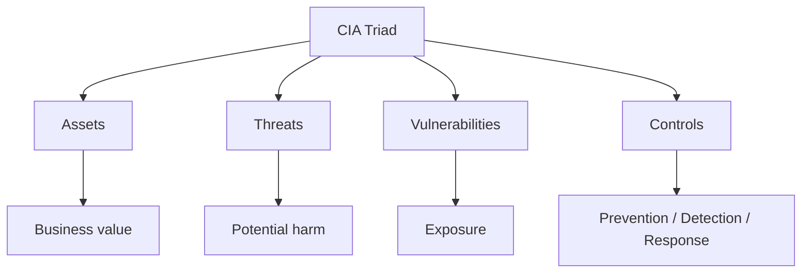

### 5. Step-by-step understanding
**Identify:** Identify the assets, people, systems, data, or processes involved.
- Exam point: explain why identify is necessary instead of merely listing the step.
**Understand:** Understand how the asset works and what normal behavior looks like.
- Exam point: explain why understand is necessary instead of merely listing the step.
**Assess:** Consider threats, vulnerabilities, likelihood, and possible impact.
- Exam point: explain why assess is necessary instead of merely listing the step.
**Protect:** Choose appropriate preventive and detective controls.
- Exam point: explain why protect is necessary instead of merely listing the step.
**Monitor:** Collect relevant logs, alerts, and evidence.
- Exam point: explain why monitor is necessary instead of merely listing the step.
**Respond:** Use a defined process when suspicious activity or an incident occurs.
- Exam point: explain why respond is necessary instead of merely listing the step.
**Recover:** Restore secure operations and verify that weaknesses are addressed.
- Exam point: explain why recover is necessary instead of merely listing the step.
**Improve:** Use lessons learned to strengthen future security decisions.
- Exam point: explain why improve is necessary instead of merely listing the step.

### 6. Important terms
- **Asset:** Something valuable that requires protection.
- **Threat:** A potential source or event that can cause harm.
- **Vulnerability:** A weakness that may be exploited or otherwise lead to loss.
- **Risk:** The possibility of loss or harm resulting from threats and vulnerabilities.
- **Control:** A safeguard used to reduce risk or improve assurance.
- **Incident:** A security event or series of events that requires investigation or response.
- **Evidence:** Information that can support an investigation, decision, or finding.
- **Mitigation:** An action that reduces likelihood, impact, or exposure.

### 7. Practical example
Consider an organization applying **CIA Triad** to a customer-facing digital service.
- First, the organization identifies the service, its data, users, dependencies, and business purpose.
- Next, the security team identifies realistic threats and weaknesses.
- The team selects controls that address the relevant risks without unnecessarily disrupting legitimate use.
- Monitoring is configured so that important security events can be detected and investigated.
- If an incident occurs, the organization follows its response and evidence-handling procedures.
- After recovery, the organization reviews lessons learned and improves the controls.

### 8. Security controls
- Strong authentication and authorization
- Least privilege
- Secure configuration and patch management
- Network segmentation
- Encryption where appropriate
- Logging and monitoring
- Backups and recovery procedures
- Security awareness and training
- Incident response procedures
- Periodic review and testing

### 9. Preventive, detective, and corrective view
| Control type | Purpose | Typical examples |
|---|---|---|
| Preventive | Reduce the chance of an incident | MFA, patching, access control |
| Detective | Discover suspicious or unauthorized activity | SIEM, IDS, audit logs |
| Corrective | Restore and improve after an event | Recovery, reconfiguration, lessons learned |

### 10. Advantages
- Improves understanding of organizational exposure.
- Supports consistent security decisions.
- Makes security requirements easier to communicate.
- Provides evidence for review, audit, and incident investigation.
- Encourages continuous improvement.

### 11. Limitations and challenges
- No control eliminates every possible risk.
- Security measures can introduce cost and operational complexity.
- Human behavior can weaken technically strong controls.
- Threats and technologies change over time.
- Incomplete visibility can lead to incorrect conclusions.

### 12. Common mistakes in exam answers
- Giving only a one-line definition when the question asks for a detailed explanation.
- Listing controls without explaining what risk each control addresses.
- Confusing a threat with a vulnerability or a control.
- Using examples without connecting them back to the concept.
- Ignoring legal, ethical, authorization, or evidence-handling requirements.

### 13. Comparison table
| Dimension | This topic | Related concept |
|---|---|---|
| Main focus | Understanding and managing the security issue | Broader security lifecycle |
| Primary question | What is it and how is it handled? | How does it connect to other controls? |
| Evidence | Logs, records, observations, configurations | Policies, procedures, technical results |
| Outcome | Better understanding and action | Better overall security posture |

### 14. Short exam answer
**CIA Triad:**
CIA Triad is an important part of cybersecurity because it helps an organization understand security requirements, identify relevant risks, apply suitable controls, and respond appropriately to security events. A complete answer should define the concept, explain its major elements, describe the process or lifecycle, give a practical example, and mention important controls or challenges.

### 15. 2-mark questions
- What is CIA Triad?
- State two important points about CIA Triad.
- Why is CIA Triad important in cybersecurity?
- Give one practical example related to CIA Triad.
- Name two controls relevant to CIA Triad.

### 16. 5-mark questions
- Explain CIA Triad with suitable examples.
- Describe the major components or stages associated with CIA Triad.
- Discuss the importance and challenges of CIA Triad.
- Differentiate the main concepts related to CIA Triad.

### 17. 10-mark question
**Discuss CIA Triad in detail.**
A strong answer should contain: definition, objectives, core concepts, step-by-step process, diagram, practical example, controls, advantages, limitations, and a concise conclusion.

### 18. Memory aid
**Remember:** Definition → Purpose → Process → Example → Controls → Challenges → Conclusion.

### 19. Last-minute revision
- confidentiality limits information access to authorized subjects.
- integrity protects accuracy, completeness, and trustworthiness of information.
- availability keeps systems and information accessible when legitimately required.
- security architecture normally balances all three rather than optimizing only one.
- Connect the concept to confidentiality, integrity, availability, accountability, and resilience where relevant.
- Always state authorization and safe-use requirements when discussing security testing.

### 20. Detailed checklist
- [ ] Can I define the concept in two sentences?
- [ ] Can I explain it to a beginner using a real-world analogy?
- [ ] Can I draw a simple flowchart?
- [ ] Can I identify assets involved?
- [ ] Can I identify realistic threats?
- [ ] Can I identify vulnerabilities?
- [ ] Can I name preventive controls?
- [ ] Can I name detective controls?
- [ ] Can I explain response or recovery implications?
- [ ] Can I give an organization-level example?
- [ ] Can I compare it with a related concept?
- [ ] Can I explain at least two challenges?
- [ ] Can I write a 2-mark answer?
- [ ] Can I write a 5-mark answer?
- [ ] Can I structure a 10-mark answer?

---

## 7. Cyber Terrorism

### 1. Exam-ready definition
**Cyber Terrorism** is a cybersecurity concept that must be understood in terms of purpose, process, risks, controls, and practical application.

### 2. Core idea
- cyber terrorism is commonly discussed as the use or threatened use of cyber capabilities to support terrorist objectives.
- the concept is debated because definitions vary by legal and academic context.
- potential targets may include critical services, public institutions, communications, or systems whose disruption could create fear or serious harm.
- prevention emphasizes resilience, monitoring, incident response, cooperation, and protection of critical systems.

### 3. Why this topic matters
- It connects a theoretical security principle with a practical security decision.
- It helps an examiner evaluate whether the student understands both the definition and its application.
- It provides a foundation for later topics in risk management, incident response, forensics, auditing, and governance.
- It explains why security controls must be selected according to assets, threats, vulnerabilities, and impact.
- It reinforces that cybersecurity is a continuous process of prevention, detection, response, and recovery.

### 4. Concept map


### 5. Step-by-step understanding
**Identify:** Identify the assets, people, systems, data, or processes involved.
- Exam point: explain why identify is necessary instead of merely listing the step.
**Understand:** Understand how the asset works and what normal behavior looks like.
- Exam point: explain why understand is necessary instead of merely listing the step.
**Assess:** Consider threats, vulnerabilities, likelihood, and possible impact.
- Exam point: explain why assess is necessary instead of merely listing the step.
**Protect:** Choose appropriate preventive and detective controls.
- Exam point: explain why protect is necessary instead of merely listing the step.
**Monitor:** Collect relevant logs, alerts, and evidence.
- Exam point: explain why monitor is necessary instead of merely listing the step.
**Respond:** Use a defined process when suspicious activity or an incident occurs.
- Exam point: explain why respond is necessary instead of merely listing the step.
**Recover:** Restore secure operations and verify that weaknesses are addressed.
- Exam point: explain why recover is necessary instead of merely listing the step.
**Improve:** Use lessons learned to strengthen future security decisions.
- Exam point: explain why improve is necessary instead of merely listing the step.

### 6. Important terms
- **Asset:** Something valuable that requires protection.
- **Threat:** A potential source or event that can cause harm.
- **Vulnerability:** A weakness that may be exploited or otherwise lead to loss.
- **Risk:** The possibility of loss or harm resulting from threats and vulnerabilities.
- **Control:** A safeguard used to reduce risk or improve assurance.
- **Incident:** A security event or series of events that requires investigation or response.
- **Evidence:** Information that can support an investigation, decision, or finding.
- **Mitigation:** An action that reduces likelihood, impact, or exposure.

### 7. Practical example
Consider an organization applying **Cyber Terrorism** to a customer-facing digital service.
- First, the organization identifies the service, its data, users, dependencies, and business purpose.
- Next, the security team identifies realistic threats and weaknesses.
- The team selects controls that address the relevant risks without unnecessarily disrupting legitimate use.
- Monitoring is configured so that important security events can be detected and investigated.
- If an incident occurs, the organization follows its response and evidence-handling procedures.
- After recovery, the organization reviews lessons learned and improves the controls.

### 8. Security controls
- Strong authentication and authorization
- Least privilege
- Secure configuration and patch management
- Network segmentation
- Encryption where appropriate
- Logging and monitoring
- Backups and recovery procedures
- Security awareness and training
- Incident response procedures
- Periodic review and testing

### 9. Preventive, detective, and corrective view
| Control type | Purpose | Typical examples |
|---|---|---|
| Preventive | Reduce the chance of an incident | MFA, patching, access control |
| Detective | Discover suspicious or unauthorized activity | SIEM, IDS, audit logs |
| Corrective | Restore and improve after an event | Recovery, reconfiguration, lessons learned |

### 10. Advantages
- Improves understanding of organizational exposure.
- Supports consistent security decisions.
- Makes security requirements easier to communicate.
- Provides evidence for review, audit, and incident investigation.
- Encourages continuous improvement.

### 11. Limitations and challenges
- No control eliminates every possible risk.
- Security measures can introduce cost and operational complexity.
- Human behavior can weaken technically strong controls.
- Threats and technologies change over time.
- Incomplete visibility can lead to incorrect conclusions.

### 12. Common mistakes in exam answers
- Giving only a one-line definition when the question asks for a detailed explanation.
- Listing controls without explaining what risk each control addresses.
- Confusing a threat with a vulnerability or a control.
- Using examples without connecting them back to the concept.
- Ignoring legal, ethical, authorization, or evidence-handling requirements.

### 13. Comparison table
| Dimension | This topic | Related concept |
|---|---|---|
| Main focus | Understanding and managing the security issue | Broader security lifecycle |
| Primary question | What is it and how is it handled? | How does it connect to other controls? |
| Evidence | Logs, records, observations, configurations | Policies, procedures, technical results |
| Outcome | Better understanding and action | Better overall security posture |

### 14. Short exam answer
**Cyber Terrorism:**
Cyber Terrorism is an important part of cybersecurity because it helps an organization understand security requirements, identify relevant risks, apply suitable controls, and respond appropriately to security events. A complete answer should define the concept, explain its major elements, describe the process or lifecycle, give a practical example, and mention important controls or challenges.

### 15. 2-mark questions
- What is Cyber Terrorism?
- State two important points about Cyber Terrorism.
- Why is Cyber Terrorism important in cybersecurity?
- Give one practical example related to Cyber Terrorism.
- Name two controls relevant to Cyber Terrorism.

### 16. 5-mark questions
- Explain Cyber Terrorism with suitable examples.
- Describe the major components or stages associated with Cyber Terrorism.
- Discuss the importance and challenges of Cyber Terrorism.
- Differentiate the main concepts related to Cyber Terrorism.

### 17. 10-mark question
**Discuss Cyber Terrorism in detail.**
A strong answer should contain: definition, objectives, core concepts, step-by-step process, diagram, practical example, controls, advantages, limitations, and a concise conclusion.

### 18. Memory aid
**Remember:** Definition → Purpose → Process → Example → Controls → Challenges → Conclusion.

### 19. Last-minute revision
- cyber terrorism is commonly discussed as the use or threatened use of cyber capabilities to support terrorist objectives.
- the concept is debated because definitions vary by legal and academic context.
- potential targets may include critical services, public institutions, communications, or systems whose disruption could create fear or serious harm.
- prevention emphasizes resilience, monitoring, incident response, cooperation, and protection of critical systems.
- Connect the concept to confidentiality, integrity, availability, accountability, and resilience where relevant.
- Always state authorization and safe-use requirements when discussing security testing.

### 20. Detailed checklist
- [ ] Can I define the concept in two sentences?
- [ ] Can I explain it to a beginner using a real-world analogy?
- [ ] Can I draw a simple flowchart?
- [ ] Can I identify assets involved?
- [ ] Can I identify realistic threats?
- [ ] Can I identify vulnerabilities?
- [ ] Can I name preventive controls?
- [ ] Can I name detective controls?
- [ ] Can I explain response or recovery implications?
- [ ] Can I give an organization-level example?
- [ ] Can I compare it with a related concept?
- [ ] Can I explain at least two challenges?
- [ ] Can I write a 2-mark answer?
- [ ] Can I write a 5-mark answer?
- [ ] Can I structure a 10-mark answer?

---

# UNIT 2 — HACKERS AND CYBER CRIMES

## Unit overview
This unit is written as a connected story rather than as isolated definitions. For every topic, focus on **what it is, why it matters, how it works, how it is defended, and how to write it in an examination**.

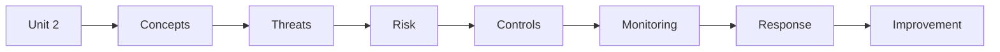

## 1. Hackers and Cyber Crimes

### 1. Exam-ready definition
**Hackers and Cyber Crimes** is a cybersecurity concept that must be understood in terms of purpose, process, risks, controls, and practical application.

### 2. Core idea
- hackers are people who use technical skills to interact with systems beyond ordinary use; intent and authorization distinguish legitimate security work from criminal activity.
- cybercrime includes offenses involving computers, networks, digital data, or online services.
- attack lifecycles often include reconnaissance, initial access, execution, persistence, privilege escalation, collection, and attempts to avoid detection.
- defenders study attacker behavior to improve prevention, detection, response, and recovery.

### 3. Why this topic matters
- It connects a theoretical security principle with a practical security decision.
- It helps an examiner evaluate whether the student understands both the definition and its application.
- It provides a foundation for later topics in risk management, incident response, forensics, auditing, and governance.
- It explains why security controls must be selected according to assets, threats, vulnerabilities, and impact.
- It reinforces that cybersecurity is a continuous process of prevention, detection, response, and recovery.

### 4. Concept map
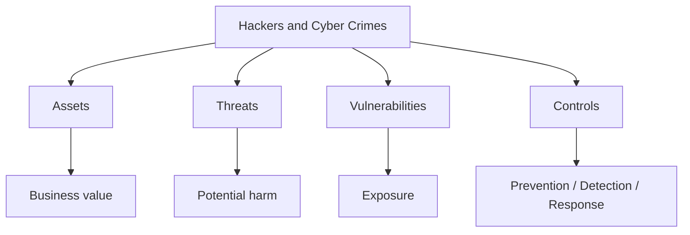

### 5. Step-by-step understanding
**Identify:** Identify the assets, people, systems, data, or processes involved.
- Exam point: explain why identify is necessary instead of merely listing the step.
**Understand:** Understand how the asset works and what normal behavior looks like.
- Exam point: explain why understand is necessary instead of merely listing the step.
**Assess:** Consider threats, vulnerabilities, likelihood, and possible impact.
- Exam point: explain why assess is necessary instead of merely listing the step.
**Protect:** Choose appropriate preventive and detective controls.
- Exam point: explain why protect is necessary instead of merely listing the step.
**Monitor:** Collect relevant logs, alerts, and evidence.
- Exam point: explain why monitor is necessary instead of merely listing the step.
**Respond:** Use a defined process when suspicious activity or an incident occurs.
- Exam point: explain why respond is necessary instead of merely listing the step.
**Recover:** Restore secure operations and verify that weaknesses are addressed.
- Exam point: explain why recover is necessary instead of merely listing the step.
**Improve:** Use lessons learned to strengthen future security decisions.
- Exam point: explain why improve is necessary instead of merely listing the step.

### 6. Important terms
- **Asset:** Something valuable that requires protection.
- **Threat:** A potential source or event that can cause harm.
- **Vulnerability:** A weakness that may be exploited or otherwise lead to loss.
- **Risk:** The possibility of loss or harm resulting from threats and vulnerabilities.
- **Control:** A safeguard used to reduce risk or improve assurance.
- **Incident:** A security event or series of events that requires investigation or response.
- **Evidence:** Information that can support an investigation, decision, or finding.
- **Mitigation:** An action that reduces likelihood, impact, or exposure.

### 7. Practical example
Consider an organization applying **Hackers and Cyber Crimes** to a customer-facing digital service.
- First, the organization identifies the service, its data, users, dependencies, and business purpose.
- Next, the security team identifies realistic threats and weaknesses.
- The team selects controls that address the relevant risks without unnecessarily disrupting legitimate use.
- Monitoring is configured so that important security events can be detected and investigated.
- If an incident occurs, the organization follows its response and evidence-handling procedures.
- After recovery, the organization reviews lessons learned and improves the controls.

### 8. Security controls
- Strong authentication and authorization
- Least privilege
- Secure configuration and patch management
- Network segmentation
- Encryption where appropriate
- Logging and monitoring
- Backups and recovery procedures
- Security awareness and training
- Incident response procedures
- Periodic review and testing

### 9. Preventive, detective, and corrective view
| Control type | Purpose | Typical examples |
|---|---|---|
| Preventive | Reduce the chance of an incident | MFA, patching, access control |
| Detective | Discover suspicious or unauthorized activity | SIEM, IDS, audit logs |
| Corrective | Restore and improve after an event | Recovery, reconfiguration, lessons learned |

### 10. Advantages
- Improves understanding of organizational exposure.
- Supports consistent security decisions.
- Makes security requirements easier to communicate.
- Provides evidence for review, audit, and incident investigation.
- Encourages continuous improvement.

### 11. Limitations and challenges
- No control eliminates every possible risk.
- Security measures can introduce cost and operational complexity.
- Human behavior can weaken technically strong controls.
- Threats and technologies change over time.
- Incomplete visibility can lead to incorrect conclusions.

### 12. Common mistakes in exam answers
- Giving only a one-line definition when the question asks for a detailed explanation.
- Listing controls without explaining what risk each control addresses.
- Confusing a threat with a vulnerability or a control.
- Using examples without connecting them back to the concept.
- Ignoring legal, ethical, authorization, or evidence-handling requirements.

### 13. Comparison table
| Dimension | This topic | Related concept |
|---|---|---|
| Main focus | Understanding and managing the security issue | Broader security lifecycle |
| Primary question | What is it and how is it handled? | How does it connect to other controls? |
| Evidence | Logs, records, observations, configurations | Policies, procedures, technical results |
| Outcome | Better understanding and action | Better overall security posture |

### 14. Short exam answer
**Hackers and Cyber Crimes:**
Hackers and Cyber Crimes is an important part of cybersecurity because it helps an organization understand security requirements, identify relevant risks, apply suitable controls, and respond appropriately to security events. A complete answer should define the concept, explain its major elements, describe the process or lifecycle, give a practical example, and mention important controls or challenges.

### 15. 2-mark questions
- What is Hackers and Cyber Crimes?
- State two important points about Hackers and Cyber Crimes.
- Why is Hackers and Cyber Crimes important in cybersecurity?
- Give one practical example related to Hackers and Cyber Crimes.
- Name two controls relevant to Hackers and Cyber Crimes.

### 16. 5-mark questions
- Explain Hackers and Cyber Crimes with suitable examples.
- Describe the major components or stages associated with Hackers and Cyber Crimes.
- Discuss the importance and challenges of Hackers and Cyber Crimes.
- Differentiate the main concepts related to Hackers and Cyber Crimes.

### 17. 10-mark question
**Discuss Hackers and Cyber Crimes in detail.**
A strong answer should contain: definition, objectives, core concepts, step-by-step process, diagram, practical example, controls, advantages, limitations, and a concise conclusion.

### 18. Memory aid
**Remember:** Definition → Purpose → Process → Example → Controls → Challenges → Conclusion.

### 19. Last-minute revision
- hackers are people who use technical skills to interact with systems beyond ordinary use; intent and authorization distinguish legitimate security work from criminal activity.
- cybercrime includes offenses involving computers, networks, digital data, or online services.
- attack lifecycles often include reconnaissance, initial access, execution, persistence, privilege escalation, collection, and attempts to avoid detection.
- defenders study attacker behavior to improve prevention, detection, response, and recovery.
- Connect the concept to confidentiality, integrity, availability, accountability, and resilience where relevant.
- Always state authorization and safe-use requirements when discussing security testing.

### 20. Detailed checklist
- [ ] Can I define the concept in two sentences?
- [ ] Can I explain it to a beginner using a real-world analogy?
- [ ] Can I draw a simple flowchart?
- [ ] Can I identify assets involved?
- [ ] Can I identify realistic threats?
- [ ] Can I identify vulnerabilities?
- [ ] Can I name preventive controls?
- [ ] Can I name detective controls?
- [ ] Can I explain response or recovery implications?
- [ ] Can I give an organization-level example?
- [ ] Can I compare it with a related concept?
- [ ] Can I explain at least two challenges?
- [ ] Can I write a 2-mark answer?
- [ ] Can I write a 5-mark answer?
- [ ] Can I structure a 10-mark answer?

---

## 2. Types of Hackers

### 1. Exam-ready definition
**Types of Hackers** is a cybersecurity concept that must be understood in terms of purpose, process, risks, controls, and practical application.

### 2. Core idea
- white-hat hackers work with authorization to find and report weaknesses.
- black-hat hackers act without authorization for harmful, fraudulent, disruptive, or exploitative purposes.
- gray-hat activity can fall outside authorization even when the stated intention is to discover vulnerabilities.
- other labels may describe roles or motivations such as security researchers, hacktivists, state-linked actors, or criminal groups.

### 3. Why this topic matters
- It connects a theoretical security principle with a practical security decision.
- It helps an examiner evaluate whether the student understands both the definition and its application.
- It provides a foundation for later topics in risk management, incident response, forensics, auditing, and governance.
- It explains why security controls must be selected according to assets, threats, vulnerabilities, and impact.
- It reinforces that cybersecurity is a continuous process of prevention, detection, response, and recovery.

### 4. Concept map
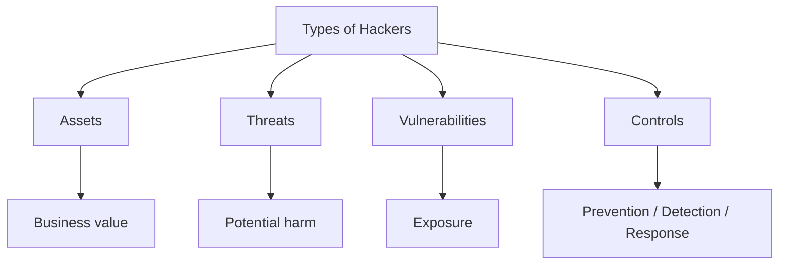

### 5. Step-by-step understanding
**Identify:** Identify the assets, people, systems, data, or processes involved.
- Exam point: explain why identify is necessary instead of merely listing the step.
**Understand:** Understand how the asset works and what normal behavior looks like.
- Exam point: explain why understand is necessary instead of merely listing the step.
**Assess:** Consider threats, vulnerabilities, likelihood, and possible impact.
- Exam point: explain why assess is necessary instead of merely listing the step.
**Protect:** Choose appropriate preventive and detective controls.
- Exam point: explain why protect is necessary instead of merely listing the step.
**Monitor:** Collect relevant logs, alerts, and evidence.
- Exam point: explain why monitor is necessary instead of merely listing the step.
**Respond:** Use a defined process when suspicious activity or an incident occurs.
- Exam point: explain why respond is necessary instead of merely listing the step.
**Recover:** Restore secure operations and verify that weaknesses are addressed.
- Exam point: explain why recover is necessary instead of merely listing the step.
**Improve:** Use lessons learned to strengthen future security decisions.
- Exam point: explain why improve is necessary instead of merely listing the step.

### 6. Important terms
- **Asset:** Something valuable that requires protection.
- **Threat:** A potential source or event that can cause harm.
- **Vulnerability:** A weakness that may be exploited or otherwise lead to loss.
- **Risk:** The possibility of loss or harm resulting from threats and vulnerabilities.
- **Control:** A safeguard used to reduce risk or improve assurance.
- **Incident:** A security event or series of events that requires investigation or response.
- **Evidence:** Information that can support an investigation, decision, or finding.
- **Mitigation:** An action that reduces likelihood, impact, or exposure.

### 7. Practical example
Consider an organization applying **Types of Hackers** to a customer-facing digital service.
- First, the organization identifies the service, its data, users, dependencies, and business purpose.
- Next, the security team identifies realistic threats and weaknesses.
- The team selects controls that address the relevant risks without unnecessarily disrupting legitimate use.
- Monitoring is configured so that important security events can be detected and investigated.
- If an incident occurs, the organization follows its response and evidence-handling procedures.
- After recovery, the organization reviews lessons learned and improves the controls.

### 8. Security controls
- Strong authentication and authorization
- Least privilege
- Secure configuration and patch management
- Network segmentation
- Encryption where appropriate
- Logging and monitoring
- Backups and recovery procedures
- Security awareness and training
- Incident response procedures
- Periodic review and testing

### 9. Preventive, detective, and corrective view
| Control type | Purpose | Typical examples |
|---|---|---|
| Preventive | Reduce the chance of an incident | MFA, patching, access control |
| Detective | Discover suspicious or unauthorized activity | SIEM, IDS, audit logs |
| Corrective | Restore and improve after an event | Recovery, reconfiguration, lessons learned |

### 10. Advantages
- Improves understanding of organizational exposure.
- Supports consistent security decisions.
- Makes security requirements easier to communicate.
- Provides evidence for review, audit, and incident investigation.
- Encourages continuous improvement.

### 11. Limitations and challenges
- No control eliminates every possible risk.
- Security measures can introduce cost and operational complexity.
- Human behavior can weaken technically strong controls.
- Threats and technologies change over time.
- Incomplete visibility can lead to incorrect conclusions.

### 12. Common mistakes in exam answers
- Giving only a one-line definition when the question asks for a detailed explanation.
- Listing controls without explaining what risk each control addresses.
- Confusing a threat with a vulnerability or a control.
- Using examples without connecting them back to the concept.
- Ignoring legal, ethical, authorization, or evidence-handling requirements.

### 13. Comparison table
| Dimension | This topic | Related concept |
|---|---|---|
| Main focus | Understanding and managing the security issue | Broader security lifecycle |
| Primary question | What is it and how is it handled? | How does it connect to other controls? |
| Evidence | Logs, records, observations, configurations | Policies, procedures, technical results |
| Outcome | Better understanding and action | Better overall security posture |

### 14. Short exam answer
**Types of Hackers:**
Types of Hackers is an important part of cybersecurity because it helps an organization understand security requirements, identify relevant risks, apply suitable controls, and respond appropriately to security events. A complete answer should define the concept, explain its major elements, describe the process or lifecycle, give a practical example, and mention important controls or challenges.

### 15. 2-mark questions
- What is Types of Hackers?
- State two important points about Types of Hackers.
- Why is Types of Hackers important in cybersecurity?
- Give one practical example related to Types of Hackers.
- Name two controls relevant to Types of Hackers.

### 16. 5-mark questions
- Explain Types of Hackers with suitable examples.
- Describe the major components or stages associated with Types of Hackers.
- Discuss the importance and challenges of Types of Hackers.
- Differentiate the main concepts related to Types of Hackers.

### 17. 10-mark question
**Discuss Types of Hackers in detail.**
A strong answer should contain: definition, objectives, core concepts, step-by-step process, diagram, practical example, controls, advantages, limitations, and a concise conclusion.

### 18. Memory aid
**Remember:** Definition → Purpose → Process → Example → Controls → Challenges → Conclusion.

### 19. Last-minute revision
- white-hat hackers work with authorization to find and report weaknesses.
- black-hat hackers act without authorization for harmful, fraudulent, disruptive, or exploitative purposes.
- gray-hat activity can fall outside authorization even when the stated intention is to discover vulnerabilities.
- other labels may describe roles or motivations such as security researchers, hacktivists, state-linked actors, or criminal groups.
- Connect the concept to confidentiality, integrity, availability, accountability, and resilience where relevant.
- Always state authorization and safe-use requirements when discussing security testing.

### 20. Detailed checklist
- [ ] Can I define the concept in two sentences?
- [ ] Can I explain it to a beginner using a real-world analogy?
- [ ] Can I draw a simple flowchart?
- [ ] Can I identify assets involved?
- [ ] Can I identify realistic threats?
- [ ] Can I identify vulnerabilities?
- [ ] Can I name preventive controls?
- [ ] Can I name detective controls?
- [ ] Can I explain response or recovery implications?
- [ ] Can I give an organization-level example?
- [ ] Can I compare it with a related concept?
- [ ] Can I explain at least two challenges?
- [ ] Can I write a 2-mark answer?
- [ ] Can I write a 5-mark answer?
- [ ] Can I structure a 10-mark answer?

---

## 3. Hackers and Crackers

### 1. Exam-ready definition
**Hackers and Crackers** is a cybersecurity concept that must be understood in terms of purpose, process, risks, controls, and practical application.

### 2. Core idea
- the term hacker is broad and can describe technical problem-solving or security research.
- cracker is an older term often used for someone who intentionally breaks security controls or software protections.
- the distinction is primarily about unauthorized or malicious behavior rather than technical skill alone.
- modern security writing often uses more precise terms such as attacker, threat actor, or malicious actor.

### 3. Why this topic matters
- It connects a theoretical security principle with a practical security decision.
- It helps an examiner evaluate whether the student understands both the definition and its application.
- It provides a foundation for later topics in risk management, incident response, forensics, auditing, and governance.
- It explains why security controls must be selected according to assets, threats, vulnerabilities, and impact.
- It reinforces that cybersecurity is a continuous process of prevention, detection, response, and recovery.

### 4. Concept map


### 5. Step-by-step understanding
**Identify:** Identify the assets, people, systems, data, or processes involved.
- Exam point: explain why identify is necessary instead of merely listing the step.
**Understand:** Understand how the asset works and what normal behavior looks like.
- Exam point: explain why understand is necessary instead of merely listing the step.
**Assess:** Consider threats, vulnerabilities, likelihood, and possible impact.
- Exam point: explain why assess is necessary instead of merely listing the step.
**Protect:** Choose appropriate preventive and detective controls.
- Exam point: explain why protect is necessary instead of merely listing the step.
**Monitor:** Collect relevant logs, alerts, and evidence.
- Exam point: explain why monitor is necessary instead of merely listing the step.
**Respond:** Use a defined process when suspicious activity or an incident occurs.
- Exam point: explain why respond is necessary instead of merely listing the step.
**Recover:** Restore secure operations and verify that weaknesses are addressed.
- Exam point: explain why recover is necessary instead of merely listing the step.
**Improve:** Use lessons learned to strengthen future security decisions.
- Exam point: explain why improve is necessary instead of merely listing the step.

### 6. Important terms
- **Asset:** Something valuable that requires protection.
- **Threat:** A potential source or event that can cause harm.
- **Vulnerability:** A weakness that may be exploited or otherwise lead to loss.
- **Risk:** The possibility of loss or harm resulting from threats and vulnerabilities.
- **Control:** A safeguard used to reduce risk or improve assurance.
- **Incident:** A security event or series of events that requires investigation or response.
- **Evidence:** Information that can support an investigation, decision, or finding.
- **Mitigation:** An action that reduces likelihood, impact, or exposure.

### 7. Practical example
Consider an organization applying **Hackers and Crackers** to a customer-facing digital service.
- First, the organization identifies the service, its data, users, dependencies, and business purpose.
- Next, the security team identifies realistic threats and weaknesses.
- The team selects controls that address the relevant risks without unnecessarily disrupting legitimate use.
- Monitoring is configured so that important security events can be detected and investigated.
- If an incident occurs, the organization follows its response and evidence-handling procedures.
- After recovery, the organization reviews lessons learned and improves the controls.

### 8. Security controls
- Strong authentication and authorization
- Least privilege
- Secure configuration and patch management
- Network segmentation
- Encryption where appropriate
- Logging and monitoring
- Backups and recovery procedures
- Security awareness and training
- Incident response procedures
- Periodic review and testing

### 9. Preventive, detective, and corrective view
| Control type | Purpose | Typical examples |
|---|---|---|
| Preventive | Reduce the chance of an incident | MFA, patching, access control |
| Detective | Discover suspicious or unauthorized activity | SIEM, IDS, audit logs |
| Corrective | Restore and improve after an event | Recovery, reconfiguration, lessons learned |

### 10. Advantages
- Improves understanding of organizational exposure.
- Supports consistent security decisions.
- Makes security requirements easier to communicate.
- Provides evidence for review, audit, and incident investigation.
- Encourages continuous improvement.

### 11. Limitations and challenges
- No control eliminates every possible risk.
- Security measures can introduce cost and operational complexity.
- Human behavior can weaken technically strong controls.
- Threats and technologies change over time.
- Incomplete visibility can lead to incorrect conclusions.

### 12. Common mistakes in exam answers
- Giving only a one-line definition when the question asks for a detailed explanation.
- Listing controls without explaining what risk each control addresses.
- Confusing a threat with a vulnerability or a control.
- Using examples without connecting them back to the concept.
- Ignoring legal, ethical, authorization, or evidence-handling requirements.

### 13. Comparison table
| Dimension | This topic | Related concept |
|---|---|---|
| Main focus | Understanding and managing the security issue | Broader security lifecycle |
| Primary question | What is it and how is it handled? | How does it connect to other controls? |
| Evidence | Logs, records, observations, configurations | Policies, procedures, technical results |
| Outcome | Better understanding and action | Better overall security posture |

### 14. Short exam answer
**Hackers and Crackers:**
Hackers and Crackers is an important part of cybersecurity because it helps an organization understand security requirements, identify relevant risks, apply suitable controls, and respond appropriately to security events. A complete answer should define the concept, explain its major elements, describe the process or lifecycle, give a practical example, and mention important controls or challenges.

### 15. 2-mark questions
- What is Hackers and Crackers?
- State two important points about Hackers and Crackers.
- Why is Hackers and Crackers important in cybersecurity?
- Give one practical example related to Hackers and Crackers.
- Name two controls relevant to Hackers and Crackers.

### 16. 5-mark questions
- Explain Hackers and Crackers with suitable examples.
- Describe the major components or stages associated with Hackers and Crackers.
- Discuss the importance and challenges of Hackers and Crackers.
- Differentiate the main concepts related to Hackers and Crackers.

### 17. 10-mark question
**Discuss Hackers and Crackers in detail.**
A strong answer should contain: definition, objectives, core concepts, step-by-step process, diagram, practical example, controls, advantages, limitations, and a concise conclusion.

### 18. Memory aid
**Remember:** Definition → Purpose → Process → Example → Controls → Challenges → Conclusion.

### 19. Last-minute revision
- the term hacker is broad and can describe technical problem-solving or security research.
- cracker is an older term often used for someone who intentionally breaks security controls or software protections.
- the distinction is primarily about unauthorized or malicious behavior rather than technical skill alone.
- modern security writing often uses more precise terms such as attacker, threat actor, or malicious actor.
- Connect the concept to confidentiality, integrity, availability, accountability, and resilience where relevant.
- Always state authorization and safe-use requirements when discussing security testing.

### 20. Detailed checklist
- [ ] Can I define the concept in two sentences?
- [ ] Can I explain it to a beginner using a real-world analogy?
- [ ] Can I draw a simple flowchart?
- [ ] Can I identify assets involved?
- [ ] Can I identify realistic threats?
- [ ] Can I identify vulnerabilities?
- [ ] Can I name preventive controls?
- [ ] Can I name detective controls?
- [ ] Can I explain response or recovery implications?
- [ ] Can I give an organization-level example?
- [ ] Can I compare it with a related concept?
- [ ] Can I explain at least two challenges?
- [ ] Can I write a 2-mark answer?
- [ ] Can I write a 5-mark answer?
- [ ] Can I structure a 10-mark answer?

---

## 4. Sniffing

### 1. Exam-ready definition
**Sniffing** is a cybersecurity concept that must be understood in terms of purpose, process, risks, controls, and practical application.

### 2. Core idea
- sniffing means observing network traffic or communications metadata.
- legitimate packet analysis is used for troubleshooting, monitoring, and incident investigation.
- unauthorized sniffing can expose credentials, session information, application data, or traffic patterns.
- encryption, segmentation, secure protocols, access control, and monitoring reduce the risk of harmful interception.

### 3. Why this topic matters
- It connects a theoretical security principle with a practical security decision.
- It helps an examiner evaluate whether the student understands both the definition and its application.
- It provides a foundation for later topics in risk management, incident response, forensics, auditing, and governance.
- It explains why security controls must be selected according to assets, threats, vulnerabilities, and impact.
- It reinforces that cybersecurity is a continuous process of prevention, detection, response, and recovery.

### 4. Concept map


### 5. Step-by-step understanding
**Identify:** Identify the assets, people, systems, data, or processes involved.
- Exam point: explain why identify is necessary instead of merely listing the step.
**Understand:** Understand how the asset works and what normal behavior looks like.
- Exam point: explain why understand is necessary instead of merely listing the step.
**Assess:** Consider threats, vulnerabilities, likelihood, and possible impact.
- Exam point: explain why assess is necessary instead of merely listing the step.
**Protect:** Choose appropriate preventive and detective controls.
- Exam point: explain why protect is necessary instead of merely listing the step.
**Monitor:** Collect relevant logs, alerts, and evidence.
- Exam point: explain why monitor is necessary instead of merely listing the step.
**Respond:** Use a defined process when suspicious activity or an incident occurs.
- Exam point: explain why respond is necessary instead of merely listing the step.
**Recover:** Restore secure operations and verify that weaknesses are addressed.
- Exam point: explain why recover is necessary instead of merely listing the step.
**Improve:** Use lessons learned to strengthen future security decisions.
- Exam point: explain why improve is necessary instead of merely listing the step.

### 6. Important terms
- **Asset:** Something valuable that requires protection.
- **Threat:** A potential source or event that can cause harm.
- **Vulnerability:** A weakness that may be exploited or otherwise lead to loss.
- **Risk:** The possibility of loss or harm resulting from threats and vulnerabilities.
- **Control:** A safeguard used to reduce risk or improve assurance.
- **Incident:** A security event or series of events that requires investigation or response.
- **Evidence:** Information that can support an investigation, decision, or finding.
- **Mitigation:** An action that reduces likelihood, impact, or exposure.

### 7. Practical example
Consider an organization applying **Sniffing** to a customer-facing digital service.
- First, the organization identifies the service, its data, users, dependencies, and business purpose.
- Next, the security team identifies realistic threats and weaknesses.
- The team selects controls that address the relevant risks without unnecessarily disrupting legitimate use.
- Monitoring is configured so that important security events can be detected and investigated.
- If an incident occurs, the organization follows its response and evidence-handling procedures.
- After recovery, the organization reviews lessons learned and improves the controls.

### 8. Security controls
- Strong authentication and authorization
- Least privilege
- Secure configuration and patch management
- Network segmentation
- Encryption where appropriate
- Logging and monitoring
- Backups and recovery procedures
- Security awareness and training
- Incident response procedures
- Periodic review and testing

### 9. Preventive, detective, and corrective view
| Control type | Purpose | Typical examples |
|---|---|---|
| Preventive | Reduce the chance of an incident | MFA, patching, access control |
| Detective | Discover suspicious or unauthorized activity | SIEM, IDS, audit logs |
| Corrective | Restore and improve after an event | Recovery, reconfiguration, lessons learned |

### 10. Advantages
- Improves understanding of organizational exposure.
- Supports consistent security decisions.
- Makes security requirements easier to communicate.
- Provides evidence for review, audit, and incident investigation.
- Encourages continuous improvement.

### 11. Limitations and challenges
- No control eliminates every possible risk.
- Security measures can introduce cost and operational complexity.
- Human behavior can weaken technically strong controls.
- Threats and technologies change over time.
- Incomplete visibility can lead to incorrect conclusions.

### 12. Common mistakes in exam answers
- Giving only a one-line definition when the question asks for a detailed explanation.
- Listing controls without explaining what risk each control addresses.
- Confusing a threat with a vulnerability or a control.
- Using examples without connecting them back to the concept.
- Ignoring legal, ethical, authorization, or evidence-handling requirements.

### 13. Comparison table
| Dimension | This topic | Related concept |
|---|---|---|
| Main focus | Understanding and managing the security issue | Broader security lifecycle |
| Primary question | What is it and how is it handled? | How does it connect to other controls? |
| Evidence | Logs, records, observations, configurations | Policies, procedures, technical results |
| Outcome | Better understanding and action | Better overall security posture |

### 14. Short exam answer
**Sniffing:**
Sniffing is an important part of cybersecurity because it helps an organization understand security requirements, identify relevant risks, apply suitable controls, and respond appropriately to security events. A complete answer should define the concept, explain its major elements, describe the process or lifecycle, give a practical example, and mention important controls or challenges.

### 15. 2-mark questions
- What is Sniffing?
- State two important points about Sniffing.
- Why is Sniffing important in cybersecurity?
- Give one practical example related to Sniffing.
- Name two controls relevant to Sniffing.

### 16. 5-mark questions
- Explain Sniffing with suitable examples.
- Describe the major components or stages associated with Sniffing.
- Discuss the importance and challenges of Sniffing.
- Differentiate the main concepts related to Sniffing.

### 17. 10-mark question
**Discuss Sniffing in detail.**
A strong answer should contain: definition, objectives, core concepts, step-by-step process, diagram, practical example, controls, advantages, limitations, and a concise conclusion.

### 18. Memory aid
**Remember:** Definition → Purpose → Process → Example → Controls → Challenges → Conclusion.

### 19. Last-minute revision
- sniffing means observing network traffic or communications metadata.
- legitimate packet analysis is used for troubleshooting, monitoring, and incident investigation.
- unauthorized sniffing can expose credentials, session information, application data, or traffic patterns.
- encryption, segmentation, secure protocols, access control, and monitoring reduce the risk of harmful interception.
- Connect the concept to confidentiality, integrity, availability, accountability, and resilience where relevant.
- Always state authorization and safe-use requirements when discussing security testing.

### 20. Detailed checklist
- [ ] Can I define the concept in two sentences?
- [ ] Can I explain it to a beginner using a real-world analogy?
- [ ] Can I draw a simple flowchart?
- [ ] Can I identify assets involved?
- [ ] Can I identify realistic threats?
- [ ] Can I identify vulnerabilities?
- [ ] Can I name preventive controls?
- [ ] Can I name detective controls?
- [ ] Can I explain response or recovery implications?
- [ ] Can I give an organization-level example?
- [ ] Can I compare it with a related concept?
- [ ] Can I explain at least two challenges?
- [ ] Can I write a 2-mark answer?
- [ ] Can I write a 5-mark answer?
- [ ] Can I structure a 10-mark answer?

---

## 5. Gaining Access

### 1. Exam-ready definition
**Gaining Access** is a cybersecurity concept that must be understood in terms of purpose, process, risks, controls, and practical application.

### 2. Core idea
- gaining access is the stage where an attacker attempts to obtain an initial foothold in a target environment.
- possible categories include stolen credentials, vulnerable services, malicious attachments, exposed interfaces, or social engineering.
- defenders reduce exposure through patching, MFA, secure configuration, least privilege, endpoint protection, and awareness.
- authorization is essential: security testing must be performed only within an approved scope.

### 3. Why this topic matters
- It connects a theoretical security principle with a practical security decision.
- It helps an examiner evaluate whether the student understands both the definition and its application.
- It provides a foundation for later topics in risk management, incident response, forensics, auditing, and governance.
- It explains why security controls must be selected according to assets, threats, vulnerabilities, and impact.
- It reinforces that cybersecurity is a continuous process of prevention, detection, response, and recovery.

### 4. Concept map


### 5. Step-by-step understanding
**Identify:** Identify the assets, people, systems, data, or processes involved.
- Exam point: explain why identify is necessary instead of merely listing the step.
**Understand:** Understand how the asset works and what normal behavior looks like.
- Exam point: explain why understand is necessary instead of merely listing the step.
**Assess:** Consider threats, vulnerabilities, likelihood, and possible impact.
- Exam point: explain why assess is necessary instead of merely listing the step.
**Protect:** Choose appropriate preventive and detective controls.
- Exam point: explain why protect is necessary instead of merely listing the step.
**Monitor:** Collect relevant logs, alerts, and evidence.
- Exam point: explain why monitor is necessary instead of merely listing the step.
**Respond:** Use a defined process when suspicious activity or an incident occurs.
- Exam point: explain why respond is necessary instead of merely listing the step.
**Recover:** Restore secure operations and verify that weaknesses are addressed.
- Exam point: explain why recover is necessary instead of merely listing the step.
**Improve:** Use lessons learned to strengthen future security decisions.
- Exam point: explain why improve is necessary instead of merely listing the step.

### 6. Important terms
- **Asset:** Something valuable that requires protection.
- **Threat:** A potential source or event that can cause harm.
- **Vulnerability:** A weakness that may be exploited or otherwise lead to loss.
- **Risk:** The possibility of loss or harm resulting from threats and vulnerabilities.
- **Control:** A safeguard used to reduce risk or improve assurance.
- **Incident:** A security event or series of events that requires investigation or response.
- **Evidence:** Information that can support an investigation, decision, or finding.
- **Mitigation:** An action that reduces likelihood, impact, or exposure.

### 7. Practical example
Consider an organization applying **Gaining Access** to a customer-facing digital service.
- First, the organization identifies the service, its data, users, dependencies, and business purpose.
- Next, the security team identifies realistic threats and weaknesses.
- The team selects controls that address the relevant risks without unnecessarily disrupting legitimate use.
- Monitoring is configured so that important security events can be detected and investigated.
- If an incident occurs, the organization follows its response and evidence-handling procedures.
- After recovery, the organization reviews lessons learned and improves the controls.

### 8. Security controls
- Strong authentication and authorization
- Least privilege
- Secure configuration and patch management
- Network segmentation
- Encryption where appropriate
- Logging and monitoring
- Backups and recovery procedures
- Security awareness and training
- Incident response procedures
- Periodic review and testing

### 9. Preventive, detective, and corrective view
| Control type | Purpose | Typical examples |
|---|---|---|
| Preventive | Reduce the chance of an incident | MFA, patching, access control |
| Detective | Discover suspicious or unauthorized activity | SIEM, IDS, audit logs |
| Corrective | Restore and improve after an event | Recovery, reconfiguration, lessons learned |

### 10. Advantages
- Improves understanding of organizational exposure.
- Supports consistent security decisions.
- Makes security requirements easier to communicate.
- Provides evidence for review, audit, and incident investigation.
- Encourages continuous improvement.

### 11. Limitations and challenges
- No control eliminates every possible risk.
- Security measures can introduce cost and operational complexity.
- Human behavior can weaken technically strong controls.
- Threats and technologies change over time.
- Incomplete visibility can lead to incorrect conclusions.

### 12. Common mistakes in exam answers
- Giving only a one-line definition when the question asks for a detailed explanation.
- Listing controls without explaining what risk each control addresses.
- Confusing a threat with a vulnerability or a control.
- Using examples without connecting them back to the concept.
- Ignoring legal, ethical, authorization, or evidence-handling requirements.

### 13. Comparison table
| Dimension | This topic | Related concept |
|---|---|---|
| Main focus | Understanding and managing the security issue | Broader security lifecycle |
| Primary question | What is it and how is it handled? | How does it connect to other controls? |
| Evidence | Logs, records, observations, configurations | Policies, procedures, technical results |
| Outcome | Better understanding and action | Better overall security posture |

### 14. Short exam answer
**Gaining Access:**
Gaining Access is an important part of cybersecurity because it helps an organization understand security requirements, identify relevant risks, apply suitable controls, and respond appropriately to security events. A complete answer should define the concept, explain its major elements, describe the process or lifecycle, give a practical example, and mention important controls or challenges.

### 15. 2-mark questions
- What is Gaining Access?
- State two important points about Gaining Access.
- Why is Gaining Access important in cybersecurity?
- Give one practical example related to Gaining Access.
- Name two controls relevant to Gaining Access.

### 16. 5-mark questions
- Explain Gaining Access with suitable examples.
- Describe the major components or stages associated with Gaining Access.
- Discuss the importance and challenges of Gaining Access.
- Differentiate the main concepts related to Gaining Access.

### 17. 10-mark question
**Discuss Gaining Access in detail.**
A strong answer should contain: definition, objectives, core concepts, step-by-step process, diagram, practical example, controls, advantages, limitations, and a concise conclusion.

### 18. Memory aid
**Remember:** Definition → Purpose → Process → Example → Controls → Challenges → Conclusion.

### 19. Last-minute revision
- gaining access is the stage where an attacker attempts to obtain an initial foothold in a target environment.
- possible categories include stolen credentials, vulnerable services, malicious attachments, exposed interfaces, or social engineering.
- defenders reduce exposure through patching, MFA, secure configuration, least privilege, endpoint protection, and awareness.
- authorization is essential: security testing must be performed only within an approved scope.
- Connect the concept to confidentiality, integrity, availability, accountability, and resilience where relevant.
- Always state authorization and safe-use requirements when discussing security testing.

### 20. Detailed checklist
- [ ] Can I define the concept in two sentences?
- [ ] Can I explain it to a beginner using a real-world analogy?
- [ ] Can I draw a simple flowchart?
- [ ] Can I identify assets involved?
- [ ] Can I identify realistic threats?
- [ ] Can I identify vulnerabilities?
- [ ] Can I name preventive controls?
- [ ] Can I name detective controls?
- [ ] Can I explain response or recovery implications?
- [ ] Can I give an organization-level example?
- [ ] Can I compare it with a related concept?
- [ ] Can I explain at least two challenges?
- [ ] Can I write a 2-mark answer?
- [ ] Can I write a 5-mark answer?
- [ ] Can I structure a 10-mark answer?

---

## 6. Escalating Privileges

### 1. Exam-ready definition
**Escalating Privileges** is a cybersecurity concept that must be understood in terms of purpose, process, risks, controls, and practical application.

### 2. Core idea
- privilege escalation occurs when a user or process obtains more permissions than originally granted.
- vertical escalation moves toward a higher privilege level such as administrator or root.
- horizontal escalation occurs when one account accesses another user's resources at a similar privilege level.
- least privilege, patching, application control, credential protection, and monitoring help reduce the risk.

### 3. Why this topic matters
- It connects a theoretical security principle with a practical security decision.
- It helps an examiner evaluate whether the student understands both the definition and its application.
- It provides a foundation for later topics in risk management, incident response, forensics, auditing, and governance.
- It explains why security controls must be selected according to assets, threats, vulnerabilities, and impact.
- It reinforces that cybersecurity is a continuous process of prevention, detection, response, and recovery.

### 4. Concept map


### 5. Step-by-step understanding
**Identify:** Identify the assets, people, systems, data, or processes involved.
- Exam point: explain why identify is necessary instead of merely listing the step.
**Understand:** Understand how the asset works and what normal behavior looks like.
- Exam point: explain why understand is necessary instead of merely listing the step.
**Assess:** Consider threats, vulnerabilities, likelihood, and possible impact.
- Exam point: explain why assess is necessary instead of merely listing the step.
**Protect:** Choose appropriate preventive and detective controls.
- Exam point: explain why protect is necessary instead of merely listing the step.
**Monitor:** Collect relevant logs, alerts, and evidence.
- Exam point: explain why monitor is necessary instead of merely listing the step.
**Respond:** Use a defined process when suspicious activity or an incident occurs.
- Exam point: explain why respond is necessary instead of merely listing the step.
**Recover:** Restore secure operations and verify that weaknesses are addressed.
- Exam point: explain why recover is necessary instead of merely listing the step.
**Improve:** Use lessons learned to strengthen future security decisions.
- Exam point: explain why improve is necessary instead of merely listing the step.

### 6. Important terms
- **Asset:** Something valuable that requires protection.
- **Threat:** A potential source or event that can cause harm.
- **Vulnerability:** A weakness that may be exploited or otherwise lead to loss.
- **Risk:** The possibility of loss or harm resulting from threats and vulnerabilities.
- **Control:** A safeguard used to reduce risk or improve assurance.
- **Incident:** A security event or series of events that requires investigation or response.
- **Evidence:** Information that can support an investigation, decision, or finding.
- **Mitigation:** An action that reduces likelihood, impact, or exposure.

### 7. Practical example
Consider an organization applying **Escalating Privileges** to a customer-facing digital service.
- First, the organization identifies the service, its data, users, dependencies, and business purpose.
- Next, the security team identifies realistic threats and weaknesses.
- The team selects controls that address the relevant risks without unnecessarily disrupting legitimate use.
- Monitoring is configured so that important security events can be detected and investigated.
- If an incident occurs, the organization follows its response and evidence-handling procedures.
- After recovery, the organization reviews lessons learned and improves the controls.

### 8. Security controls
- Strong authentication and authorization
- Least privilege
- Secure configuration and patch management
- Network segmentation
- Encryption where appropriate
- Logging and monitoring
- Backups and recovery procedures
- Security awareness and training
- Incident response procedures
- Periodic review and testing

### 9. Preventive, detective, and corrective view
| Control type | Purpose | Typical examples |
|---|---|---|
| Preventive | Reduce the chance of an incident | MFA, patching, access control |
| Detective | Discover suspicious or unauthorized activity | SIEM, IDS, audit logs |
| Corrective | Restore and improve after an event | Recovery, reconfiguration, lessons learned |

### 10. Advantages
- Improves understanding of organizational exposure.
- Supports consistent security decisions.
- Makes security requirements easier to communicate.
- Provides evidence for review, audit, and incident investigation.
- Encourages continuous improvement.

### 11. Limitations and challenges
- No control eliminates every possible risk.
- Security measures can introduce cost and operational complexity.
- Human behavior can weaken technically strong controls.
- Threats and technologies change over time.
- Incomplete visibility can lead to incorrect conclusions.

### 12. Common mistakes in exam answers
- Giving only a one-line definition when the question asks for a detailed explanation.
- Listing controls without explaining what risk each control addresses.
- Confusing a threat with a vulnerability or a control.
- Using examples without connecting them back to the concept.
- Ignoring legal, ethical, authorization, or evidence-handling requirements.

### 13. Comparison table
| Dimension | This topic | Related concept |
|---|---|---|
| Main focus | Understanding and managing the security issue | Broader security lifecycle |
| Primary question | What is it and how is it handled? | How does it connect to other controls? |
| Evidence | Logs, records, observations, configurations | Policies, procedures, technical results |
| Outcome | Better understanding and action | Better overall security posture |

### 14. Short exam answer
**Escalating Privileges:**
Escalating Privileges is an important part of cybersecurity because it helps an organization understand security requirements, identify relevant risks, apply suitable controls, and respond appropriately to security events. A complete answer should define the concept, explain its major elements, describe the process or lifecycle, give a practical example, and mention important controls or challenges.

### 15. 2-mark questions
- What is Escalating Privileges?
- State two important points about Escalating Privileges.
- Why is Escalating Privileges important in cybersecurity?
- Give one practical example related to Escalating Privileges.
- Name two controls relevant to Escalating Privileges.

### 16. 5-mark questions
- Explain Escalating Privileges with suitable examples.
- Describe the major components or stages associated with Escalating Privileges.
- Discuss the importance and challenges of Escalating Privileges.
- Differentiate the main concepts related to Escalating Privileges.

### 17. 10-mark question
**Discuss Escalating Privileges in detail.**
A strong answer should contain: definition, objectives, core concepts, step-by-step process, diagram, practical example, controls, advantages, limitations, and a concise conclusion.

### 18. Memory aid
**Remember:** Definition → Purpose → Process → Example → Controls → Challenges → Conclusion.

### 19. Last-minute revision
- privilege escalation occurs when a user or process obtains more permissions than originally granted.
- vertical escalation moves toward a higher privilege level such as administrator or root.
- horizontal escalation occurs when one account accesses another user's resources at a similar privilege level.
- least privilege, patching, application control, credential protection, and monitoring help reduce the risk.
- Connect the concept to confidentiality, integrity, availability, accountability, and resilience where relevant.
- Always state authorization and safe-use requirements when discussing security testing.

### 20. Detailed checklist
- [ ] Can I define the concept in two sentences?
- [ ] Can I explain it to a beginner using a real-world analogy?
- [ ] Can I draw a simple flowchart?
- [ ] Can I identify assets involved?
- [ ] Can I identify realistic threats?
- [ ] Can I identify vulnerabilities?
- [ ] Can I name preventive controls?
- [ ] Can I name detective controls?
- [ ] Can I explain response or recovery implications?
- [ ] Can I give an organization-level example?
- [ ] Can I compare it with a related concept?
- [ ] Can I explain at least two challenges?
- [ ] Can I write a 2-mark answer?
- [ ] Can I write a 5-mark answer?
- [ ] Can I structure a 10-mark answer?

---

## 7. Executing Applications

### 1. Exam-ready definition
**Executing Applications** is a cybersecurity concept that must be understood in terms of purpose, process, risks, controls, and practical application.

### 2. Core idea
- execution is the stage where code, scripts, commands, or applications run in an environment.
- execution can be legitimate or malicious depending on authorization, purpose, and context.
- defenders use application allowlisting, endpoint detection, script controls, logging, and behavior analysis.
- safe analysis should use isolated labs and intentionally vulnerable systems rather than production targets.

### 3. Why this topic matters
- It connects a theoretical security principle with a practical security decision.
- It helps an examiner evaluate whether the student understands both the definition and its application.
- It provides a foundation for later topics in risk management, incident response, forensics, auditing, and governance.
- It explains why security controls must be selected according to assets, threats, vulnerabilities, and impact.
- It reinforces that cybersecurity is a continuous process of prevention, detection, response, and recovery.

### 4. Concept map
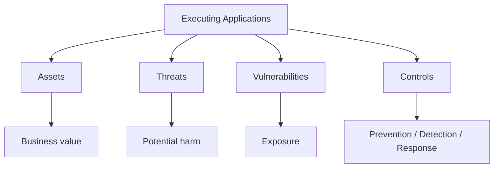

### 5. Step-by-step understanding
**Identify:** Identify the assets, people, systems, data, or processes involved.
- Exam point: explain why identify is necessary instead of merely listing the step.
**Understand:** Understand how the asset works and what normal behavior looks like.
- Exam point: explain why understand is necessary instead of merely listing the step.
**Assess:** Consider threats, vulnerabilities, likelihood, and possible impact.
- Exam point: explain why assess is necessary instead of merely listing the step.
**Protect:** Choose appropriate preventive and detective controls.
- Exam point: explain why protect is necessary instead of merely listing the step.
**Monitor:** Collect relevant logs, alerts, and evidence.
- Exam point: explain why monitor is necessary instead of merely listing the step.
**Respond:** Use a defined process when suspicious activity or an incident occurs.
- Exam point: explain why respond is necessary instead of merely listing the step.
**Recover:** Restore secure operations and verify that weaknesses are addressed.
- Exam point: explain why recover is necessary instead of merely listing the step.
**Improve:** Use lessons learned to strengthen future security decisions.
- Exam point: explain why improve is necessary instead of merely listing the step.

### 6. Important terms
- **Asset:** Something valuable that requires protection.
- **Threat:** A potential source or event that can cause harm.
- **Vulnerability:** A weakness that may be exploited or otherwise lead to loss.
- **Risk:** The possibility of loss or harm resulting from threats and vulnerabilities.
- **Control:** A safeguard used to reduce risk or improve assurance.
- **Incident:** A security event or series of events that requires investigation or response.
- **Evidence:** Information that can support an investigation, decision, or finding.
- **Mitigation:** An action that reduces likelihood, impact, or exposure.

### 7. Practical example
Consider an organization applying **Executing Applications** to a customer-facing digital service.
- First, the organization identifies the service, its data, users, dependencies, and business purpose.
- Next, the security team identifies realistic threats and weaknesses.
- The team selects controls that address the relevant risks without unnecessarily disrupting legitimate use.
- Monitoring is configured so that important security events can be detected and investigated.
- If an incident occurs, the organization follows its response and evidence-handling procedures.
- After recovery, the organization reviews lessons learned and improves the controls.

### 8. Security controls
- Strong authentication and authorization
- Least privilege
- Secure configuration and patch management
- Network segmentation
- Encryption where appropriate
- Logging and monitoring
- Backups and recovery procedures
- Security awareness and training
- Incident response procedures
- Periodic review and testing

### 9. Preventive, detective, and corrective view
| Control type | Purpose | Typical examples |
|---|---|---|
| Preventive | Reduce the chance of an incident | MFA, patching, access control |
| Detective | Discover suspicious or unauthorized activity | SIEM, IDS, audit logs |
| Corrective | Restore and improve after an event | Recovery, reconfiguration, lessons learned |

### 10. Advantages
- Improves understanding of organizational exposure.
- Supports consistent security decisions.
- Makes security requirements easier to communicate.
- Provides evidence for review, audit, and incident investigation.
- Encourages continuous improvement.

### 11. Limitations and challenges
- No control eliminates every possible risk.
- Security measures can introduce cost and operational complexity.
- Human behavior can weaken technically strong controls.
- Threats and technologies change over time.
- Incomplete visibility can lead to incorrect conclusions.

### 12. Common mistakes in exam answers
- Giving only a one-line definition when the question asks for a detailed explanation.
- Listing controls without explaining what risk each control addresses.
- Confusing a threat with a vulnerability or a control.
- Using examples without connecting them back to the concept.
- Ignoring legal, ethical, authorization, or evidence-handling requirements.

### 13. Comparison table
| Dimension | This topic | Related concept |
|---|---|---|
| Main focus | Understanding and managing the security issue | Broader security lifecycle |
| Primary question | What is it and how is it handled? | How does it connect to other controls? |
| Evidence | Logs, records, observations, configurations | Policies, procedures, technical results |
| Outcome | Better understanding and action | Better overall security posture |

### 14. Short exam answer
**Executing Applications:**
Executing Applications is an important part of cybersecurity because it helps an organization understand security requirements, identify relevant risks, apply suitable controls, and respond appropriately to security events. A complete answer should define the concept, explain its major elements, describe the process or lifecycle, give a practical example, and mention important controls or challenges.

### 15. 2-mark questions
- What is Executing Applications?
- State two important points about Executing Applications.
- Why is Executing Applications important in cybersecurity?
- Give one practical example related to Executing Applications.
- Name two controls relevant to Executing Applications.

### 16. 5-mark questions
- Explain Executing Applications with suitable examples.
- Describe the major components or stages associated with Executing Applications.
- Discuss the importance and challenges of Executing Applications.
- Differentiate the main concepts related to Executing Applications.

### 17. 10-mark question
**Discuss Executing Applications in detail.**
A strong answer should contain: definition, objectives, core concepts, step-by-step process, diagram, practical example, controls, advantages, limitations, and a concise conclusion.

### 18. Memory aid
**Remember:** Definition → Purpose → Process → Example → Controls → Challenges → Conclusion.

### 19. Last-minute revision
- execution is the stage where code, scripts, commands, or applications run in an environment.
- execution can be legitimate or malicious depending on authorization, purpose, and context.
- defenders use application allowlisting, endpoint detection, script controls, logging, and behavior analysis.
- safe analysis should use isolated labs and intentionally vulnerable systems rather than production targets.
- Connect the concept to confidentiality, integrity, availability, accountability, and resilience where relevant.
- Always state authorization and safe-use requirements when discussing security testing.

### 20. Detailed checklist
- [ ] Can I define the concept in two sentences?
- [ ] Can I explain it to a beginner using a real-world analogy?
- [ ] Can I draw a simple flowchart?
- [ ] Can I identify assets involved?
- [ ] Can I identify realistic threats?
- [ ] Can I identify vulnerabilities?
- [ ] Can I name preventive controls?
- [ ] Can I name detective controls?
- [ ] Can I explain response or recovery implications?
- [ ] Can I give an organization-level example?
- [ ] Can I compare it with a related concept?
- [ ] Can I explain at least two challenges?
- [ ] Can I write a 2-mark answer?
- [ ] Can I write a 5-mark answer?
- [ ] Can I structure a 10-mark answer?

---

## 8. Hiding Files

### 1. Exam-ready definition
**Hiding Files** is a cybersecurity concept that must be understood in terms of purpose, process, risks, controls, and practical application.

### 2. Core idea
- malicious actors may try to hide files or artifacts to reduce the chance of discovery.
- hiding can involve ordinary filesystem attributes, misleading names, unusual locations, archives, or other concealment techniques.
- forensic investigators look beyond visible folders and examine metadata, timelines, alternate locations, and system artifacts.
- defensive monitoring should focus on unusual file behavior and unexpected persistence rather than only filenames.

### 3. Why this topic matters
- It connects a theoretical security principle with a practical security decision.
- It helps an examiner evaluate whether the student understands both the definition and its application.
- It provides a foundation for later topics in risk management, incident response, forensics, auditing, and governance.
- It explains why security controls must be selected according to assets, threats, vulnerabilities, and impact.
- It reinforces that cybersecurity is a continuous process of prevention, detection, response, and recovery.

### 4. Concept map


### 5. Step-by-step understanding
**Identify:** Identify the assets, people, systems, data, or processes involved.
- Exam point: explain why identify is necessary instead of merely listing the step.
**Understand:** Understand how the asset works and what normal behavior looks like.
- Exam point: explain why understand is necessary instead of merely listing the step.
**Assess:** Consider threats, vulnerabilities, likelihood, and possible impact.
- Exam point: explain why assess is necessary instead of merely listing the step.
**Protect:** Choose appropriate preventive and detective controls.
- Exam point: explain why protect is necessary instead of merely listing the step.
**Monitor:** Collect relevant logs, alerts, and evidence.
- Exam point: explain why monitor is necessary instead of merely listing the step.
**Respond:** Use a defined process when suspicious activity or an incident occurs.
- Exam point: explain why respond is necessary instead of merely listing the step.
**Recover:** Restore secure operations and verify that weaknesses are addressed.
- Exam point: explain why recover is necessary instead of merely listing the step.
**Improve:** Use lessons learned to strengthen future security decisions.
- Exam point: explain why improve is necessary instead of merely listing the step.

### 6. Important terms
- **Asset:** Something valuable that requires protection.
- **Threat:** A potential source or event that can cause harm.
- **Vulnerability:** A weakness that may be exploited or otherwise lead to loss.
- **Risk:** The possibility of loss or harm resulting from threats and vulnerabilities.
- **Control:** A safeguard used to reduce risk or improve assurance.
- **Incident:** A security event or series of events that requires investigation or response.
- **Evidence:** Information that can support an investigation, decision, or finding.
- **Mitigation:** An action that reduces likelihood, impact, or exposure.

### 7. Practical example
Consider an organization applying **Hiding Files** to a customer-facing digital service.
- First, the organization identifies the service, its data, users, dependencies, and business purpose.
- Next, the security team identifies realistic threats and weaknesses.
- The team selects controls that address the relevant risks without unnecessarily disrupting legitimate use.
- Monitoring is configured so that important security events can be detected and investigated.
- If an incident occurs, the organization follows its response and evidence-handling procedures.
- After recovery, the organization reviews lessons learned and improves the controls.

### 8. Security controls
- Strong authentication and authorization
- Least privilege
- Secure configuration and patch management
- Network segmentation
- Encryption where appropriate
- Logging and monitoring
- Backups and recovery procedures
- Security awareness and training
- Incident response procedures
- Periodic review and testing

### 9. Preventive, detective, and corrective view
| Control type | Purpose | Typical examples |
|---|---|---|
| Preventive | Reduce the chance of an incident | MFA, patching, access control |
| Detective | Discover suspicious or unauthorized activity | SIEM, IDS, audit logs |
| Corrective | Restore and improve after an event | Recovery, reconfiguration, lessons learned |

### 10. Advantages
- Improves understanding of organizational exposure.
- Supports consistent security decisions.
- Makes security requirements easier to communicate.
- Provides evidence for review, audit, and incident investigation.
- Encourages continuous improvement.

### 11. Limitations and challenges
- No control eliminates every possible risk.
- Security measures can introduce cost and operational complexity.
- Human behavior can weaken technically strong controls.
- Threats and technologies change over time.
- Incomplete visibility can lead to incorrect conclusions.

### 12. Common mistakes in exam answers
- Giving only a one-line definition when the question asks for a detailed explanation.
- Listing controls without explaining what risk each control addresses.
- Confusing a threat with a vulnerability or a control.
- Using examples without connecting them back to the concept.
- Ignoring legal, ethical, authorization, or evidence-handling requirements.

### 13. Comparison table
| Dimension | This topic | Related concept |
|---|---|---|
| Main focus | Understanding and managing the security issue | Broader security lifecycle |
| Primary question | What is it and how is it handled? | How does it connect to other controls? |
| Evidence | Logs, records, observations, configurations | Policies, procedures, technical results |
| Outcome | Better understanding and action | Better overall security posture |

### 14. Short exam answer
**Hiding Files:**
Hiding Files is an important part of cybersecurity because it helps an organization understand security requirements, identify relevant risks, apply suitable controls, and respond appropriately to security events. A complete answer should define the concept, explain its major elements, describe the process or lifecycle, give a practical example, and mention important controls or challenges.

### 15. 2-mark questions
- What is Hiding Files?
- State two important points about Hiding Files.
- Why is Hiding Files important in cybersecurity?
- Give one practical example related to Hiding Files.
- Name two controls relevant to Hiding Files.

### 16. 5-mark questions
- Explain Hiding Files with suitable examples.
- Describe the major components or stages associated with Hiding Files.
- Discuss the importance and challenges of Hiding Files.
- Differentiate the main concepts related to Hiding Files.

### 17. 10-mark question
**Discuss Hiding Files in detail.**
A strong answer should contain: definition, objectives, core concepts, step-by-step process, diagram, practical example, controls, advantages, limitations, and a concise conclusion.

### 18. Memory aid
**Remember:** Definition → Purpose → Process → Example → Controls → Challenges → Conclusion.

### 19. Last-minute revision
- malicious actors may try to hide files or artifacts to reduce the chance of discovery.
- hiding can involve ordinary filesystem attributes, misleading names, unusual locations, archives, or other concealment techniques.
- forensic investigators look beyond visible folders and examine metadata, timelines, alternate locations, and system artifacts.
- defensive monitoring should focus on unusual file behavior and unexpected persistence rather than only filenames.
- Connect the concept to confidentiality, integrity, availability, accountability, and resilience where relevant.
- Always state authorization and safe-use requirements when discussing security testing.

### 20. Detailed checklist
- [ ] Can I define the concept in two sentences?
- [ ] Can I explain it to a beginner using a real-world analogy?
- [ ] Can I draw a simple flowchart?
- [ ] Can I identify assets involved?
- [ ] Can I identify realistic threats?
- [ ] Can I identify vulnerabilities?
- [ ] Can I name preventive controls?
- [ ] Can I name detective controls?
- [ ] Can I explain response or recovery implications?
- [ ] Can I give an organization-level example?
- [ ] Can I compare it with a related concept?
- [ ] Can I explain at least two challenges?
- [ ] Can I write a 2-mark answer?
- [ ] Can I write a 5-mark answer?
- [ ] Can I structure a 10-mark answer?

---

## 9. Covering Tracks

### 1. Exam-ready definition
**Covering Tracks** is a cybersecurity concept that must be understood in terms of purpose, process, risks, controls, and practical application.

### 2. Core idea
- covering tracks describes attempts to reduce evidence of unauthorized activity.
- examples at a conceptual level include deleting or altering logs, removing temporary artifacts, or manipulating timestamps.
- centralized logging and write-protected or access-controlled log storage improve resilience against local tampering.
- forensic work must distinguish between missing evidence and evidence proving that nothing happened.

### 3. Why this topic matters
- It connects a theoretical security principle with a practical security decision.
- It helps an examiner evaluate whether the student understands both the definition and its application.
- It provides a foundation for later topics in risk management, incident response, forensics, auditing, and governance.
- It explains why security controls must be selected according to assets, threats, vulnerabilities, and impact.
- It reinforces that cybersecurity is a continuous process of prevention, detection, response, and recovery.

### 4. Concept map
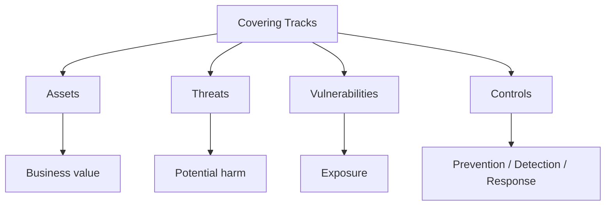

### 5. Step-by-step understanding
**Identify:** Identify the assets, people, systems, data, or processes involved.
- Exam point: explain why identify is necessary instead of merely listing the step.
**Understand:** Understand how the asset works and what normal behavior looks like.
- Exam point: explain why understand is necessary instead of merely listing the step.
**Assess:** Consider threats, vulnerabilities, likelihood, and possible impact.
- Exam point: explain why assess is necessary instead of merely listing the step.
**Protect:** Choose appropriate preventive and detective controls.
- Exam point: explain why protect is necessary instead of merely listing the step.
**Monitor:** Collect relevant logs, alerts, and evidence.
- Exam point: explain why monitor is necessary instead of merely listing the step.
**Respond:** Use a defined process when suspicious activity or an incident occurs.
- Exam point: explain why respond is necessary instead of merely listing the step.
**Recover:** Restore secure operations and verify that weaknesses are addressed.
- Exam point: explain why recover is necessary instead of merely listing the step.
**Improve:** Use lessons learned to strengthen future security decisions.
- Exam point: explain why improve is necessary instead of merely listing the step.

### 6. Important terms
- **Asset:** Something valuable that requires protection.
- **Threat:** A potential source or event that can cause harm.
- **Vulnerability:** A weakness that may be exploited or otherwise lead to loss.
- **Risk:** The possibility of loss or harm resulting from threats and vulnerabilities.
- **Control:** A safeguard used to reduce risk or improve assurance.
- **Incident:** A security event or series of events that requires investigation or response.
- **Evidence:** Information that can support an investigation, decision, or finding.
- **Mitigation:** An action that reduces likelihood, impact, or exposure.

### 7. Practical example
Consider an organization applying **Covering Tracks** to a customer-facing digital service.
- First, the organization identifies the service, its data, users, dependencies, and business purpose.
- Next, the security team identifies realistic threats and weaknesses.
- The team selects controls that address the relevant risks without unnecessarily disrupting legitimate use.
- Monitoring is configured so that important security events can be detected and investigated.
- If an incident occurs, the organization follows its response and evidence-handling procedures.
- After recovery, the organization reviews lessons learned and improves the controls.

### 8. Security controls
- Strong authentication and authorization
- Least privilege
- Secure configuration and patch management
- Network segmentation
- Encryption where appropriate
- Logging and monitoring
- Backups and recovery procedures
- Security awareness and training
- Incident response procedures
- Periodic review and testing

### 9. Preventive, detective, and corrective view
| Control type | Purpose | Typical examples |
|---|---|---|
| Preventive | Reduce the chance of an incident | MFA, patching, access control |
| Detective | Discover suspicious or unauthorized activity | SIEM, IDS, audit logs |
| Corrective | Restore and improve after an event | Recovery, reconfiguration, lessons learned |

### 10. Advantages
- Improves understanding of organizational exposure.
- Supports consistent security decisions.
- Makes security requirements easier to communicate.
- Provides evidence for review, audit, and incident investigation.
- Encourages continuous improvement.

### 11. Limitations and challenges
- No control eliminates every possible risk.
- Security measures can introduce cost and operational complexity.
- Human behavior can weaken technically strong controls.
- Threats and technologies change over time.
- Incomplete visibility can lead to incorrect conclusions.

### 12. Common mistakes in exam answers
- Giving only a one-line definition when the question asks for a detailed explanation.
- Listing controls without explaining what risk each control addresses.
- Confusing a threat with a vulnerability or a control.
- Using examples without connecting them back to the concept.
- Ignoring legal, ethical, authorization, or evidence-handling requirements.

### 13. Comparison table
| Dimension | This topic | Related concept |
|---|---|---|
| Main focus | Understanding and managing the security issue | Broader security lifecycle |
| Primary question | What is it and how is it handled? | How does it connect to other controls? |
| Evidence | Logs, records, observations, configurations | Policies, procedures, technical results |
| Outcome | Better understanding and action | Better overall security posture |

### 14. Short exam answer
**Covering Tracks:**
Covering Tracks is an important part of cybersecurity because it helps an organization understand security requirements, identify relevant risks, apply suitable controls, and respond appropriately to security events. A complete answer should define the concept, explain its major elements, describe the process or lifecycle, give a practical example, and mention important controls or challenges.

### 15. 2-mark questions
- What is Covering Tracks?
- State two important points about Covering Tracks.
- Why is Covering Tracks important in cybersecurity?
- Give one practical example related to Covering Tracks.
- Name two controls relevant to Covering Tracks.

### 16. 5-mark questions
- Explain Covering Tracks with suitable examples.
- Describe the major components or stages associated with Covering Tracks.
- Discuss the importance and challenges of Covering Tracks.
- Differentiate the main concepts related to Covering Tracks.

### 17. 10-mark question
**Discuss Covering Tracks in detail.**
A strong answer should contain: definition, objectives, core concepts, step-by-step process, diagram, practical example, controls, advantages, limitations, and a concise conclusion.

### 18. Memory aid
**Remember:** Definition → Purpose → Process → Example → Controls → Challenges → Conclusion.

### 19. Last-minute revision
- covering tracks describes attempts to reduce evidence of unauthorized activity.
- examples at a conceptual level include deleting or altering logs, removing temporary artifacts, or manipulating timestamps.
- centralized logging and write-protected or access-controlled log storage improve resilience against local tampering.
- forensic work must distinguish between missing evidence and evidence proving that nothing happened.
- Connect the concept to confidentiality, integrity, availability, accountability, and resilience where relevant.
- Always state authorization and safe-use requirements when discussing security testing.

### 20. Detailed checklist
- [ ] Can I define the concept in two sentences?
- [ ] Can I explain it to a beginner using a real-world analogy?
- [ ] Can I draw a simple flowchart?
- [ ] Can I identify assets involved?
- [ ] Can I identify realistic threats?
- [ ] Can I identify vulnerabilities?
- [ ] Can I name preventive controls?
- [ ] Can I name detective controls?
- [ ] Can I explain response or recovery implications?
- [ ] Can I give an organization-level example?
- [ ] Can I compare it with a related concept?
- [ ] Can I explain at least two challenges?
- [ ] Can I write a 2-mark answer?
- [ ] Can I write a 5-mark answer?
- [ ] Can I structure a 10-mark answer?

---

## 10. Viruses

### 1. Exam-ready definition
**Viruses** is a cybersecurity concept that must be understood in terms of purpose, process, risks, controls, and practical application.

### 2. Core idea
- a computer virus is malicious code that generally attaches itself to a host file or program and relies on execution for propagation.
- viruses can modify, corrupt, or destroy data and may carry additional payloads.
- modern malware often combines multiple behaviors, so simple labels may not describe the full threat.
- antimalware, application control, patching, backups, and user awareness are common defenses.

### 3. Why this topic matters
- It connects a theoretical security principle with a practical security decision.
- It helps an examiner evaluate whether the student understands both the definition and its application.
- It provides a foundation for later topics in risk management, incident response, forensics, auditing, and governance.
- It explains why security controls must be selected according to assets, threats, vulnerabilities, and impact.
- It reinforces that cybersecurity is a continuous process of prevention, detection, response, and recovery.

### 4. Concept map


### 5. Step-by-step understanding
**Identify:** Identify the assets, people, systems, data, or processes involved.
- Exam point: explain why identify is necessary instead of merely listing the step.
**Understand:** Understand how the asset works and what normal behavior looks like.
- Exam point: explain why understand is necessary instead of merely listing the step.
**Assess:** Consider threats, vulnerabilities, likelihood, and possible impact.
- Exam point: explain why assess is necessary instead of merely listing the step.
**Protect:** Choose appropriate preventive and detective controls.
- Exam point: explain why protect is necessary instead of merely listing the step.
**Monitor:** Collect relevant logs, alerts, and evidence.
- Exam point: explain why monitor is necessary instead of merely listing the step.
**Respond:** Use a defined process when suspicious activity or an incident occurs.
- Exam point: explain why respond is necessary instead of merely listing the step.
**Recover:** Restore secure operations and verify that weaknesses are addressed.
- Exam point: explain why recover is necessary instead of merely listing the step.
**Improve:** Use lessons learned to strengthen future security decisions.
- Exam point: explain why improve is necessary instead of merely listing the step.

### 6. Important terms
- **Asset:** Something valuable that requires protection.
- **Threat:** A potential source or event that can cause harm.
- **Vulnerability:** A weakness that may be exploited or otherwise lead to loss.
- **Risk:** The possibility of loss or harm resulting from threats and vulnerabilities.
- **Control:** A safeguard used to reduce risk or improve assurance.
- **Incident:** A security event or series of events that requires investigation or response.
- **Evidence:** Information that can support an investigation, decision, or finding.
- **Mitigation:** An action that reduces likelihood, impact, or exposure.

### 7. Practical example
Consider an organization applying **Viruses** to a customer-facing digital service.
- First, the organization identifies the service, its data, users, dependencies, and business purpose.
- Next, the security team identifies realistic threats and weaknesses.
- The team selects controls that address the relevant risks without unnecessarily disrupting legitimate use.
- Monitoring is configured so that important security events can be detected and investigated.
- If an incident occurs, the organization follows its response and evidence-handling procedures.
- After recovery, the organization reviews lessons learned and improves the controls.

### 8. Security controls
- Strong authentication and authorization
- Least privilege
- Secure configuration and patch management
- Network segmentation
- Encryption where appropriate
- Logging and monitoring
- Backups and recovery procedures
- Security awareness and training
- Incident response procedures
- Periodic review and testing

### 9. Preventive, detective, and corrective view
| Control type | Purpose | Typical examples |
|---|---|---|
| Preventive | Reduce the chance of an incident | MFA, patching, access control |
| Detective | Discover suspicious or unauthorized activity | SIEM, IDS, audit logs |
| Corrective | Restore and improve after an event | Recovery, reconfiguration, lessons learned |

### 10. Advantages
- Improves understanding of organizational exposure.
- Supports consistent security decisions.
- Makes security requirements easier to communicate.
- Provides evidence for review, audit, and incident investigation.
- Encourages continuous improvement.

### 11. Limitations and challenges
- No control eliminates every possible risk.
- Security measures can introduce cost and operational complexity.
- Human behavior can weaken technically strong controls.
- Threats and technologies change over time.
- Incomplete visibility can lead to incorrect conclusions.

### 12. Common mistakes in exam answers
- Giving only a one-line definition when the question asks for a detailed explanation.
- Listing controls without explaining what risk each control addresses.
- Confusing a threat with a vulnerability or a control.
- Using examples without connecting them back to the concept.
- Ignoring legal, ethical, authorization, or evidence-handling requirements.

### 13. Comparison table
| Dimension | This topic | Related concept |
|---|---|---|
| Main focus | Understanding and managing the security issue | Broader security lifecycle |
| Primary question | What is it and how is it handled? | How does it connect to other controls? |
| Evidence | Logs, records, observations, configurations | Policies, procedures, technical results |
| Outcome | Better understanding and action | Better overall security posture |

### 14. Short exam answer
**Viruses:**
Viruses is an important part of cybersecurity because it helps an organization understand security requirements, identify relevant risks, apply suitable controls, and respond appropriately to security events. A complete answer should define the concept, explain its major elements, describe the process or lifecycle, give a practical example, and mention important controls or challenges.

### 15. 2-mark questions
- What is Viruses?
- State two important points about Viruses.
- Why is Viruses important in cybersecurity?
- Give one practical example related to Viruses.
- Name two controls relevant to Viruses.

### 16. 5-mark questions
- Explain Viruses with suitable examples.
- Describe the major components or stages associated with Viruses.
- Discuss the importance and challenges of Viruses.
- Differentiate the main concepts related to Viruses.

### 17. 10-mark question
**Discuss Viruses in detail.**
A strong answer should contain: definition, objectives, core concepts, step-by-step process, diagram, practical example, controls, advantages, limitations, and a concise conclusion.

### 18. Memory aid
**Remember:** Definition → Purpose → Process → Example → Controls → Challenges → Conclusion.

### 19. Last-minute revision
- a computer virus is malicious code that generally attaches itself to a host file or program and relies on execution for propagation.
- viruses can modify, corrupt, or destroy data and may carry additional payloads.
- modern malware often combines multiple behaviors, so simple labels may not describe the full threat.
- antimalware, application control, patching, backups, and user awareness are common defenses.
- Connect the concept to confidentiality, integrity, availability, accountability, and resilience where relevant.
- Always state authorization and safe-use requirements when discussing security testing.

### 20. Detailed checklist
- [ ] Can I define the concept in two sentences?
- [ ] Can I explain it to a beginner using a real-world analogy?
- [ ] Can I draw a simple flowchart?
- [ ] Can I identify assets involved?
- [ ] Can I identify realistic threats?
- [ ] Can I identify vulnerabilities?
- [ ] Can I name preventive controls?
- [ ] Can I name detective controls?
- [ ] Can I explain response or recovery implications?
- [ ] Can I give an organization-level example?
- [ ] Can I compare it with a related concept?
- [ ] Can I explain at least two challenges?
- [ ] Can I write a 2-mark answer?
- [ ] Can I write a 5-mark answer?
- [ ] Can I structure a 10-mark answer?

---

## 11. Worms

### 1. Exam-ready definition
**Worms** is a cybersecurity concept that must be understood in terms of purpose, process, risks, controls, and practical application.

### 2. Core idea
- a worm is malware capable of spreading between systems without requiring a host file in the same way a traditional virus does.
- worms can exploit vulnerabilities or use other automated propagation mechanisms.
- rapid propagation can create large operational impact and network congestion.
- segmentation, patching, access control, monitoring, and rapid isolation are important defenses.

### 3. Why this topic matters
- It connects a theoretical security principle with a practical security decision.
- It helps an examiner evaluate whether the student understands both the definition and its application.
- It provides a foundation for later topics in risk management, incident response, forensics, auditing, and governance.
- It explains why security controls must be selected according to assets, threats, vulnerabilities, and impact.
- It reinforces that cybersecurity is a continuous process of prevention, detection, response, and recovery.

### 4. Concept map
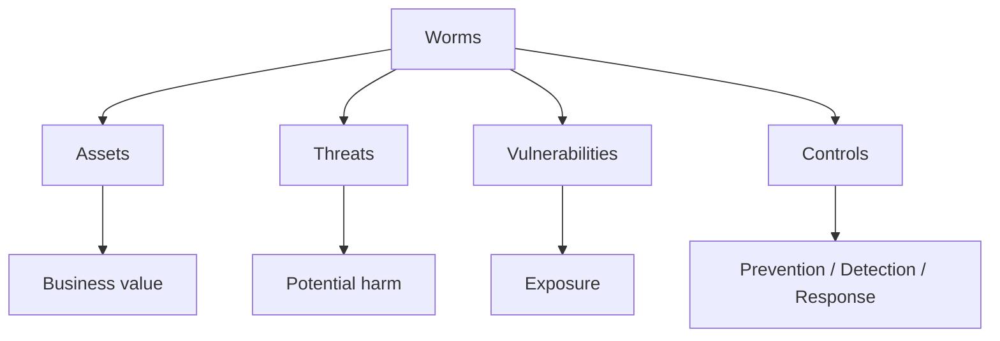

### 5. Step-by-step understanding
**Identify:** Identify the assets, people, systems, data, or processes involved.
- Exam point: explain why identify is necessary instead of merely listing the step.
**Understand:** Understand how the asset works and what normal behavior looks like.
- Exam point: explain why understand is necessary instead of merely listing the step.
**Assess:** Consider threats, vulnerabilities, likelihood, and possible impact.
- Exam point: explain why assess is necessary instead of merely listing the step.
**Protect:** Choose appropriate preventive and detective controls.
- Exam point: explain why protect is necessary instead of merely listing the step.
**Monitor:** Collect relevant logs, alerts, and evidence.
- Exam point: explain why monitor is necessary instead of merely listing the step.
**Respond:** Use a defined process when suspicious activity or an incident occurs.
- Exam point: explain why respond is necessary instead of merely listing the step.
**Recover:** Restore secure operations and verify that weaknesses are addressed.
- Exam point: explain why recover is necessary instead of merely listing the step.
**Improve:** Use lessons learned to strengthen future security decisions.
- Exam point: explain why improve is necessary instead of merely listing the step.

### 6. Important terms
- **Asset:** Something valuable that requires protection.
- **Threat:** A potential source or event that can cause harm.
- **Vulnerability:** A weakness that may be exploited or otherwise lead to loss.
- **Risk:** The possibility of loss or harm resulting from threats and vulnerabilities.
- **Control:** A safeguard used to reduce risk or improve assurance.
- **Incident:** A security event or series of events that requires investigation or response.
- **Evidence:** Information that can support an investigation, decision, or finding.
- **Mitigation:** An action that reduces likelihood, impact, or exposure.

### 7. Practical example
Consider an organization applying **Worms** to a customer-facing digital service.
- First, the organization identifies the service, its data, users, dependencies, and business purpose.
- Next, the security team identifies realistic threats and weaknesses.
- The team selects controls that address the relevant risks without unnecessarily disrupting legitimate use.
- Monitoring is configured so that important security events can be detected and investigated.
- If an incident occurs, the organization follows its response and evidence-handling procedures.
- After recovery, the organization reviews lessons learned and improves the controls.

### 8. Security controls
- Strong authentication and authorization
- Least privilege
- Secure configuration and patch management
- Network segmentation
- Encryption where appropriate
- Logging and monitoring
- Backups and recovery procedures
- Security awareness and training
- Incident response procedures
- Periodic review and testing

### 9. Preventive, detective, and corrective view
| Control type | Purpose | Typical examples |
|---|---|---|
| Preventive | Reduce the chance of an incident | MFA, patching, access control |
| Detective | Discover suspicious or unauthorized activity | SIEM, IDS, audit logs |
| Corrective | Restore and improve after an event | Recovery, reconfiguration, lessons learned |

### 10. Advantages
- Improves understanding of organizational exposure.
- Supports consistent security decisions.
- Makes security requirements easier to communicate.
- Provides evidence for review, audit, and incident investigation.
- Encourages continuous improvement.

### 11. Limitations and challenges
- No control eliminates every possible risk.
- Security measures can introduce cost and operational complexity.
- Human behavior can weaken technically strong controls.
- Threats and technologies change over time.
- Incomplete visibility can lead to incorrect conclusions.

### 12. Common mistakes in exam answers
- Giving only a one-line definition when the question asks for a detailed explanation.
- Listing controls without explaining what risk each control addresses.
- Confusing a threat with a vulnerability or a control.
- Using examples without connecting them back to the concept.
- Ignoring legal, ethical, authorization, or evidence-handling requirements.

### 13. Comparison table
| Dimension | This topic | Related concept |
|---|---|---|
| Main focus | Understanding and managing the security issue | Broader security lifecycle |
| Primary question | What is it and how is it handled? | How does it connect to other controls? |
| Evidence | Logs, records, observations, configurations | Policies, procedures, technical results |
| Outcome | Better understanding and action | Better overall security posture |

### 14. Short exam answer
**Worms:**
Worms is an important part of cybersecurity because it helps an organization understand security requirements, identify relevant risks, apply suitable controls, and respond appropriately to security events. A complete answer should define the concept, explain its major elements, describe the process or lifecycle, give a practical example, and mention important controls or challenges.

### 15. 2-mark questions
- What is Worms?
- State two important points about Worms.
- Why is Worms important in cybersecurity?
- Give one practical example related to Worms.
- Name two controls relevant to Worms.

### 16. 5-mark questions
- Explain Worms with suitable examples.
- Describe the major components or stages associated with Worms.
- Discuss the importance and challenges of Worms.
- Differentiate the main concepts related to Worms.

### 17. 10-mark question
**Discuss Worms in detail.**
A strong answer should contain: definition, objectives, core concepts, step-by-step process, diagram, practical example, controls, advantages, limitations, and a concise conclusion.

### 18. Memory aid
**Remember:** Definition → Purpose → Process → Example → Controls → Challenges → Conclusion.

### 19. Last-minute revision
- a worm is malware capable of spreading between systems without requiring a host file in the same way a traditional virus does.
- worms can exploit vulnerabilities or use other automated propagation mechanisms.
- rapid propagation can create large operational impact and network congestion.
- segmentation, patching, access control, monitoring, and rapid isolation are important defenses.
- Connect the concept to confidentiality, integrity, availability, accountability, and resilience where relevant.
- Always state authorization and safe-use requirements when discussing security testing.

### 20. Detailed checklist
- [ ] Can I define the concept in two sentences?
- [ ] Can I explain it to a beginner using a real-world analogy?
- [ ] Can I draw a simple flowchart?
- [ ] Can I identify assets involved?
- [ ] Can I identify realistic threats?
- [ ] Can I identify vulnerabilities?
- [ ] Can I name preventive controls?
- [ ] Can I name detective controls?
- [ ] Can I explain response or recovery implications?
- [ ] Can I give an organization-level example?
- [ ] Can I compare it with a related concept?
- [ ] Can I explain at least two challenges?
- [ ] Can I write a 2-mark answer?
- [ ] Can I write a 5-mark answer?
- [ ] Can I structure a 10-mark answer?

---

## 12. Trojans

### 1. Exam-ready definition
**Trojans** is a cybersecurity concept that must be understood in terms of purpose, process, risks, controls, and practical application.

### 2. Core idea
- a Trojan is malicious software that is presented or disguised as legitimate software or content.
- unlike a worm, the key idea is deception rather than self-propagation.
- Trojans may provide remote access, steal data, download additional malware, or manipulate systems.
- software provenance, application allowlisting, endpoint controls, and user awareness reduce risk.

### 3. Why this topic matters
- It connects a theoretical security principle with a practical security decision.
- It helps an examiner evaluate whether the student understands both the definition and its application.
- It provides a foundation for later topics in risk management, incident response, forensics, auditing, and governance.
- It explains why security controls must be selected according to assets, threats, vulnerabilities, and impact.
- It reinforces that cybersecurity is a continuous process of prevention, detection, response, and recovery.

### 4. Concept map
```mermaid
flowchart TD
    A[Trojans] --> B[Assets]
    A --> C[Threats]
    A --> D[Vulnerabilities]
    A --> E[Controls]
    B --> F[Business value]
    C --> G[Potential harm]
    D --> H[Exposure]
    E --> I[Prevention / Detection / Response]
```

### 5. Step-by-step understanding
**Identify:** Identify the assets, people, systems, data, or processes involved.
- Exam point: explain why identify is necessary instead of merely listing the step.
**Understand:** Understand how the asset works and what normal behavior looks like.
- Exam point: explain why understand is necessary instead of merely listing the step.
**Assess:** Consider threats, vulnerabilities, likelihood, and possible impact.
- Exam point: explain why assess is necessary instead of merely listing the step.
**Protect:** Choose appropriate preventive and detective controls.
- Exam point: explain why protect is necessary instead of merely listing the step.
**Monitor:** Collect relevant logs, alerts, and evidence.
- Exam point: explain why monitor is necessary instead of merely listing the step.
**Respond:** Use a defined process when suspicious activity or an incident occurs.
- Exam point: explain why respond is necessary instead of merely listing the step.
**Recover:** Restore secure operations and verify that weaknesses are addressed.
- Exam point: explain why recover is necessary instead of merely listing the step.
**Improve:** Use lessons learned to strengthen future security decisions.
- Exam point: explain why improve is necessary instead of merely listing the step.

### 6. Important terms
- **Asset:** Something valuable that requires protection.
- **Threat:** A potential source or event that can cause harm.
- **Vulnerability:** A weakness that may be exploited or otherwise lead to loss.
- **Risk:** The possibility of loss or harm resulting from threats and vulnerabilities.
- **Control:** A safeguard used to reduce risk or improve assurance.
- **Incident:** A security event or series of events that requires investigation or response.
- **Evidence:** Information that can support an investigation, decision, or finding.
- **Mitigation:** An action that reduces likelihood, impact, or exposure.

### 7. Practical example
Consider an organization applying **Trojans** to a customer-facing digital service.
- First, the organization identifies the service, its data, users, dependencies, and business purpose.
- Next, the security team identifies realistic threats and weaknesses.
- The team selects controls that address the relevant risks without unnecessarily disrupting legitimate use.
- Monitoring is configured so that important security events can be detected and investigated.
- If an incident occurs, the organization follows its response and evidence-handling procedures.
- After recovery, the organization reviews lessons learned and improves the controls.

### 8. Security controls
- Strong authentication and authorization
- Least privilege
- Secure configuration and patch management
- Network segmentation
- Encryption where appropriate
- Logging and monitoring
- Backups and recovery procedures
- Security awareness and training
- Incident response procedures
- Periodic review and testing

### 9. Preventive, detective, and corrective view
| Control type | Purpose | Typical examples |
|---|---|---|
| Preventive | Reduce the chance of an incident | MFA, patching, access control |
| Detective | Discover suspicious or unauthorized activity | SIEM, IDS, audit logs |
| Corrective | Restore and improve after an event | Recovery, reconfiguration, lessons learned |

### 10. Advantages
- Improves understanding of organizational exposure.
- Supports consistent security decisions.
- Makes security requirements easier to communicate.
- Provides evidence for review, audit, and incident investigation.
- Encourages continuous improvement.

### 11. Limitations and challenges
- No control eliminates every possible risk.
- Security measures can introduce cost and operational complexity.
- Human behavior can weaken technically strong controls.
- Threats and technologies change over time.
- Incomplete visibility can lead to incorrect conclusions.

### 12. Common mistakes in exam answers
- Giving only a one-line definition when the question asks for a detailed explanation.
- Listing controls without explaining what risk each control addresses.
- Confusing a threat with a vulnerability or a control.
- Using examples without connecting them back to the concept.
- Ignoring legal, ethical, authorization, or evidence-handling requirements.

### 13. Comparison table
| Dimension | This topic | Related concept |
|---|---|---|
| Main focus | Understanding and managing the security issue | Broader security lifecycle |
| Primary question | What is it and how is it handled? | How does it connect to other controls? |
| Evidence | Logs, records, observations, configurations | Policies, procedures, technical results |
| Outcome | Better understanding and action | Better overall security posture |

### 14. Short exam answer
**Trojans:**
Trojans is an important part of cybersecurity because it helps an organization understand security requirements, identify relevant risks, apply suitable controls, and respond appropriately to security events. A complete answer should define the concept, explain its major elements, describe the process or lifecycle, give a practical example, and mention important controls or challenges.

### 15. 2-mark questions
- What is Trojans?
- State two important points about Trojans.
- Why is Trojans important in cybersecurity?
- Give one practical example related to Trojans.
- Name two controls relevant to Trojans.

### 16. 5-mark questions
- Explain Trojans with suitable examples.
- Describe the major components or stages associated with Trojans.
- Discuss the importance and challenges of Trojans.
- Differentiate the main concepts related to Trojans.

### 17. 10-mark question
**Discuss Trojans in detail.**
A strong answer should contain: definition, objectives, core concepts, step-by-step process, diagram, practical example, controls, advantages, limitations, and a concise conclusion.

### 18. Memory aid
**Remember:** Definition → Purpose → Process → Example → Controls → Challenges → Conclusion.

### 19. Last-minute revision
- a Trojan is malicious software that is presented or disguised as legitimate software or content.
- unlike a worm, the key idea is deception rather than self-propagation.
- Trojans may provide remote access, steal data, download additional malware, or manipulate systems.
- software provenance, application allowlisting, endpoint controls, and user awareness reduce risk.
- Connect the concept to confidentiality, integrity, availability, accountability, and resilience where relevant.
- Always state authorization and safe-use requirements when discussing security testing.

### 20. Detailed checklist
- [ ] Can I define the concept in two sentences?
- [ ] Can I explain it to a beginner using a real-world analogy?
- [ ] Can I draw a simple flowchart?
- [ ] Can I identify assets involved?
- [ ] Can I identify realistic threats?
- [ ] Can I identify vulnerabilities?
- [ ] Can I name preventive controls?
- [ ] Can I name detective controls?
- [ ] Can I explain response or recovery implications?
- [ ] Can I give an organization-level example?
- [ ] Can I compare it with a related concept?
- [ ] Can I explain at least two challenges?
- [ ] Can I write a 2-mark answer?
- [ ] Can I write a 5-mark answer?
- [ ] Can I structure a 10-mark answer?

---

## 13. Backdoors

### 1. Exam-ready definition
**Backdoors** is a cybersecurity concept that must be understood in terms of purpose, process, risks, controls, and practical application.

### 2. Core idea
- a backdoor is a mechanism that bypasses normal authentication or security controls to provide access.
- backdoors can be intentionally built for administration or maliciously installed after compromise.
- persistence mechanisms should be documented and tightly controlled.
- detection relies on configuration review, endpoint monitoring, authentication logs, integrity checking, and incident response.

### 3. Why this topic matters
- It connects a theoretical security principle with a practical security decision.
- It helps an examiner evaluate whether the student understands both the definition and its application.
- It provides a foundation for later topics in risk management, incident response, forensics, auditing, and governance.
- It explains why security controls must be selected according to assets, threats, vulnerabilities, and impact.
- It reinforces that cybersecurity is a continuous process of prevention, detection, response, and recovery.

### 4. Concept map
```mermaid
flowchart TD
    A[Backdoors] --> B[Assets]
    A --> C[Threats]
    A --> D[Vulnerabilities]
    A --> E[Controls]
    B --> F[Business value]
    C --> G[Potential harm]
    D --> H[Exposure]
    E --> I[Prevention / Detection / Response]
```

### 5. Step-by-step understanding
**Identify:** Identify the assets, people, systems, data, or processes involved.
- Exam point: explain why identify is necessary instead of merely listing the step.
**Understand:** Understand how the asset works and what normal behavior looks like.
- Exam point: explain why understand is necessary instead of merely listing the step.
**Assess:** Consider threats, vulnerabilities, likelihood, and possible impact.
- Exam point: explain why assess is necessary instead of merely listing the step.
**Protect:** Choose appropriate preventive and detective controls.
- Exam point: explain why protect is necessary instead of merely listing the step.
**Monitor:** Collect relevant logs, alerts, and evidence.
- Exam point: explain why monitor is necessary instead of merely listing the step.
**Respond:** Use a defined process when suspicious activity or an incident occurs.
- Exam point: explain why respond is necessary instead of merely listing the step.
**Recover:** Restore secure operations and verify that weaknesses are addressed.
- Exam point: explain why recover is necessary instead of merely listing the step.
**Improve:** Use lessons learned to strengthen future security decisions.
- Exam point: explain why improve is necessary instead of merely listing the step.

### 6. Important terms
- **Asset:** Something valuable that requires protection.
- **Threat:** A potential source or event that can cause harm.
- **Vulnerability:** A weakness that may be exploited or otherwise lead to loss.
- **Risk:** The possibility of loss or harm resulting from threats and vulnerabilities.
- **Control:** A safeguard used to reduce risk or improve assurance.
- **Incident:** A security event or series of events that requires investigation or response.
- **Evidence:** Information that can support an investigation, decision, or finding.
- **Mitigation:** An action that reduces likelihood, impact, or exposure.

### 7. Practical example
Consider an organization applying **Backdoors** to a customer-facing digital service.
- First, the organization identifies the service, its data, users, dependencies, and business purpose.
- Next, the security team identifies realistic threats and weaknesses.
- The team selects controls that address the relevant risks without unnecessarily disrupting legitimate use.
- Monitoring is configured so that important security events can be detected and investigated.
- If an incident occurs, the organization follows its response and evidence-handling procedures.
- After recovery, the organization reviews lessons learned and improves the controls.

### 8. Security controls
- Strong authentication and authorization
- Least privilege
- Secure configuration and patch management
- Network segmentation
- Encryption where appropriate
- Logging and monitoring
- Backups and recovery procedures
- Security awareness and training
- Incident response procedures
- Periodic review and testing

### 9. Preventive, detective, and corrective view
| Control type | Purpose | Typical examples |
|---|---|---|
| Preventive | Reduce the chance of an incident | MFA, patching, access control |
| Detective | Discover suspicious or unauthorized activity | SIEM, IDS, audit logs |
| Corrective | Restore and improve after an event | Recovery, reconfiguration, lessons learned |

### 10. Advantages
- Improves understanding of organizational exposure.
- Supports consistent security decisions.
- Makes security requirements easier to communicate.
- Provides evidence for review, audit, and incident investigation.
- Encourages continuous improvement.

### 11. Limitations and challenges
- No control eliminates every possible risk.
- Security measures can introduce cost and operational complexity.
- Human behavior can weaken technically strong controls.
- Threats and technologies change over time.
- Incomplete visibility can lead to incorrect conclusions.

### 12. Common mistakes in exam answers
- Giving only a one-line definition when the question asks for a detailed explanation.
- Listing controls without explaining what risk each control addresses.
- Confusing a threat with a vulnerability or a control.
- Using examples without connecting them back to the concept.
- Ignoring legal, ethical, authorization, or evidence-handling requirements.

### 13. Comparison table
| Dimension | This topic | Related concept |
|---|---|---|
| Main focus | Understanding and managing the security issue | Broader security lifecycle |
| Primary question | What is it and how is it handled? | How does it connect to other controls? |
| Evidence | Logs, records, observations, configurations | Policies, procedures, technical results |
| Outcome | Better understanding and action | Better overall security posture |

### 14. Short exam answer
**Backdoors:**
Backdoors is an important part of cybersecurity because it helps an organization understand security requirements, identify relevant risks, apply suitable controls, and respond appropriately to security events. A complete answer should define the concept, explain its major elements, describe the process or lifecycle, give a practical example, and mention important controls or challenges.

### 15. 2-mark questions
- What is Backdoors?
- State two important points about Backdoors.
- Why is Backdoors important in cybersecurity?
- Give one practical example related to Backdoors.
- Name two controls relevant to Backdoors.

### 16. 5-mark questions
- Explain Backdoors with suitable examples.
- Describe the major components or stages associated with Backdoors.
- Discuss the importance and challenges of Backdoors.
- Differentiate the main concepts related to Backdoors.

### 17. 10-mark question
**Discuss Backdoors in detail.**
A strong answer should contain: definition, objectives, core concepts, step-by-step process, diagram, practical example, controls, advantages, limitations, and a concise conclusion.

### 18. Memory aid
**Remember:** Definition → Purpose → Process → Example → Controls → Challenges → Conclusion.

### 19. Last-minute revision
- a backdoor is a mechanism that bypasses normal authentication or security controls to provide access.
- backdoors can be intentionally built for administration or maliciously installed after compromise.
- persistence mechanisms should be documented and tightly controlled.
- detection relies on configuration review, endpoint monitoring, authentication logs, integrity checking, and incident response.
- Connect the concept to confidentiality, integrity, availability, accountability, and resilience where relevant.
- Always state authorization and safe-use requirements when discussing security testing.

### 20. Detailed checklist
- [ ] Can I define the concept in two sentences?
- [ ] Can I explain it to a beginner using a real-world analogy?
- [ ] Can I draw a simple flowchart?
- [ ] Can I identify assets involved?
- [ ] Can I identify realistic threats?
- [ ] Can I identify vulnerabilities?
- [ ] Can I name preventive controls?
- [ ] Can I name detective controls?
- [ ] Can I explain response or recovery implications?
- [ ] Can I give an organization-level example?
- [ ] Can I compare it with a related concept?
- [ ] Can I explain at least two challenges?
- [ ] Can I write a 2-mark answer?
- [ ] Can I write a 5-mark answer?
- [ ] Can I structure a 10-mark answer?

---

# UNIT 3 — ETHICAL HACKING AND SOCIAL ENGINEERING

## Unit overview
This unit is written as a connected story rather than as isolated definitions. For every topic, focus on **what it is, why it matters, how it works, how it is defended, and how to write it in an examination**.

```mermaid
flowchart LR
    A[Unit 3] --> B[Concepts]
    B --> C[Threats]
    C --> D[Risk]
    D --> E[Controls]
    E --> F[Monitoring]
    F --> G[Response]
    G --> H[Improvement]
```

## 1. Ethical Hacking and Social Engineering

### 1. Exam-ready definition
**Ethical Hacking and Social Engineering** is a cybersecurity concept that must be understood in terms of purpose, process, risks, controls, and practical application.

### 2. Core idea
- ethical hacking is authorized security testing intended to identify weaknesses and improve defenses.
- social engineering targets human decision-making rather than relying only on technical vulnerabilities.
- both areas require explicit authorization, defined scope, rules of engagement, evidence handling, and responsible reporting.
- the central professional principle is to test safely and avoid unnecessary harm.

### 3. Why this topic matters
- It connects a theoretical security principle with a practical security decision.
- It helps an examiner evaluate whether the student understands both the definition and its application.
- It provides a foundation for later topics in risk management, incident response, forensics, auditing, and governance.
- It explains why security controls must be selected according to assets, threats, vulnerabilities, and impact.
- It reinforces that cybersecurity is a continuous process of prevention, detection, response, and recovery.

### 4. Concept map
```mermaid
flowchart TD
    A[Ethical Hacking and Social Engineering] --> B[Assets]
    A --> C[Threats]
    A --> D[Vulnerabilities]
    A --> E[Controls]
    B --> F[Business value]
    C --> G[Potential harm]
    D --> H[Exposure]
    E --> I[Prevention / Detection / Response]
```

### 5. Step-by-step understanding
**Identify:** Identify the assets, people, systems, data, or processes involved.
- Exam point: explain why identify is necessary instead of merely listing the step.
**Understand:** Understand how the asset works and what normal behavior looks like.
- Exam point: explain why understand is necessary instead of merely listing the step.
**Assess:** Consider threats, vulnerabilities, likelihood, and possible impact.
- Exam point: explain why assess is necessary instead of merely listing the step.
**Protect:** Choose appropriate preventive and detective controls.
- Exam point: explain why protect is necessary instead of merely listing the step.
**Monitor:** Collect relevant logs, alerts, and evidence.
- Exam point: explain why monitor is necessary instead of merely listing the step.
**Respond:** Use a defined process when suspicious activity or an incident occurs.
- Exam point: explain why respond is necessary instead of merely listing the step.
**Recover:** Restore secure operations and verify that weaknesses are addressed.
- Exam point: explain why recover is necessary instead of merely listing the step.
**Improve:** Use lessons learned to strengthen future security decisions.
- Exam point: explain why improve is necessary instead of merely listing the step.

### 6. Important terms
- **Asset:** Something valuable that requires protection.
- **Threat:** A potential source or event that can cause harm.
- **Vulnerability:** A weakness that may be exploited or otherwise lead to loss.
- **Risk:** The possibility of loss or harm resulting from threats and vulnerabilities.
- **Control:** A safeguard used to reduce risk or improve assurance.
- **Incident:** A security event or series of events that requires investigation or response.
- **Evidence:** Information that can support an investigation, decision, or finding.
- **Mitigation:** An action that reduces likelihood, impact, or exposure.

### 7. Practical example
Consider an organization applying **Ethical Hacking and Social Engineering** to a customer-facing digital service.
- First, the organization identifies the service, its data, users, dependencies, and business purpose.
- Next, the security team identifies realistic threats and weaknesses.
- The team selects controls that address the relevant risks without unnecessarily disrupting legitimate use.
- Monitoring is configured so that important security events can be detected and investigated.
- If an incident occurs, the organization follows its response and evidence-handling procedures.
- After recovery, the organization reviews lessons learned and improves the controls.

### 8. Security controls
- Strong authentication and authorization
- Least privilege
- Secure configuration and patch management
- Network segmentation
- Encryption where appropriate
- Logging and monitoring
- Backups and recovery procedures
- Security awareness and training
- Incident response procedures
- Periodic review and testing

### 9. Preventive, detective, and corrective view
| Control type | Purpose | Typical examples |
|---|---|---|
| Preventive | Reduce the chance of an incident | MFA, patching, access control |
| Detective | Discover suspicious or unauthorized activity | SIEM, IDS, audit logs |
| Corrective | Restore and improve after an event | Recovery, reconfiguration, lessons learned |

### 10. Advantages
- Improves understanding of organizational exposure.
- Supports consistent security decisions.
- Makes security requirements easier to communicate.
- Provides evidence for review, audit, and incident investigation.
- Encourages continuous improvement.

### 11. Limitations and challenges
- No control eliminates every possible risk.
- Security measures can introduce cost and operational complexity.
- Human behavior can weaken technically strong controls.
- Threats and technologies change over time.
- Incomplete visibility can lead to incorrect conclusions.

### 12. Common mistakes in exam answers
- Giving only a one-line definition when the question asks for a detailed explanation.
- Listing controls without explaining what risk each control addresses.
- Confusing a threat with a vulnerability or a control.
- Using examples without connecting them back to the concept.
- Ignoring legal, ethical, authorization, or evidence-handling requirements.

### 13. Comparison table
| Dimension | This topic | Related concept |
|---|---|---|
| Main focus | Understanding and managing the security issue | Broader security lifecycle |
| Primary question | What is it and how is it handled? | How does it connect to other controls? |
| Evidence | Logs, records, observations, configurations | Policies, procedures, technical results |
| Outcome | Better understanding and action | Better overall security posture |

### 14. Short exam answer
**Ethical Hacking and Social Engineering:**
Ethical Hacking and Social Engineering is an important part of cybersecurity because it helps an organization understand security requirements, identify relevant risks, apply suitable controls, and respond appropriately to security events. A complete answer should define the concept, explain its major elements, describe the process or lifecycle, give a practical example, and mention important controls or challenges.

### 15. 2-mark questions
- What is Ethical Hacking and Social Engineering?
- State two important points about Ethical Hacking and Social Engineering.
- Why is Ethical Hacking and Social Engineering important in cybersecurity?
- Give one practical example related to Ethical Hacking and Social Engineering.
- Name two controls relevant to Ethical Hacking and Social Engineering.

### 16. 5-mark questions
- Explain Ethical Hacking and Social Engineering with suitable examples.
- Describe the major components or stages associated with Ethical Hacking and Social Engineering.
- Discuss the importance and challenges of Ethical Hacking and Social Engineering.
- Differentiate the main concepts related to Ethical Hacking and Social Engineering.

### 17. 10-mark question
**Discuss Ethical Hacking and Social Engineering in detail.**
A strong answer should contain: definition, objectives, core concepts, step-by-step process, diagram, practical example, controls, advantages, limitations, and a concise conclusion.

### 18. Memory aid
**Remember:** Definition → Purpose → Process → Example → Controls → Challenges → Conclusion.

### 19. Last-minute revision
- ethical hacking is authorized security testing intended to identify weaknesses and improve defenses.
- social engineering targets human decision-making rather than relying only on technical vulnerabilities.
- both areas require explicit authorization, defined scope, rules of engagement, evidence handling, and responsible reporting.
- the central professional principle is to test safely and avoid unnecessary harm.
- Connect the concept to confidentiality, integrity, availability, accountability, and resilience where relevant.
- Always state authorization and safe-use requirements when discussing security testing.

### 20. Detailed checklist
- [ ] Can I define the concept in two sentences?
- [ ] Can I explain it to a beginner using a real-world analogy?
- [ ] Can I draw a simple flowchart?
- [ ] Can I identify assets involved?
- [ ] Can I identify realistic threats?
- [ ] Can I identify vulnerabilities?
- [ ] Can I name preventive controls?
- [ ] Can I name detective controls?
- [ ] Can I explain response or recovery implications?
- [ ] Can I give an organization-level example?
- [ ] Can I compare it with a related concept?
- [ ] Can I explain at least two challenges?
- [ ] Can I write a 2-mark answer?
- [ ] Can I write a 5-mark answer?
- [ ] Can I structure a 10-mark answer?

---

## 2. Ethical Hacking Concepts and Scopes

### 1. Exam-ready definition
**Ethical Hacking Concepts and Scopes** is a cybersecurity concept that must be understood in terms of purpose, process, risks, controls, and practical application.

### 2. Core idea
- scope defines what systems, applications, identities, locations, time windows, and techniques are authorized.
- rules of engagement specify constraints, contacts, stop conditions, evidence handling, and reporting expectations.
- ethical testing normally follows planning, reconnaissance, assessment, controlled validation, analysis, and reporting.
- a test without authorization is not made ethical merely because the tester believes the goal is beneficial.

### 3. Why this topic matters
- It connects a theoretical security principle with a practical security decision.
- It helps an examiner evaluate whether the student understands both the definition and its application.
- It provides a foundation for later topics in risk management, incident response, forensics, auditing, and governance.
- It explains why security controls must be selected according to assets, threats, vulnerabilities, and impact.
- It reinforces that cybersecurity is a continuous process of prevention, detection, response, and recovery.

### 4. Concept map
```mermaid
flowchart TD
    A[Ethical Hacking Concepts and Scopes] --> B[Assets]
    A --> C[Threats]
    A --> D[Vulnerabilities]
    A --> E[Controls]
    B --> F[Business value]
    C --> G[Potential harm]
    D --> H[Exposure]
    E --> I[Prevention / Detection / Response]
```

### 5. Step-by-step understanding
**Identify:** Identify the assets, people, systems, data, or processes involved.
- Exam point: explain why identify is necessary instead of merely listing the step.
**Understand:** Understand how the asset works and what normal behavior looks like.
- Exam point: explain why understand is necessary instead of merely listing the step.
**Assess:** Consider threats, vulnerabilities, likelihood, and possible impact.
- Exam point: explain why assess is necessary instead of merely listing the step.
**Protect:** Choose appropriate preventive and detective controls.
- Exam point: explain why protect is necessary instead of merely listing the step.
**Monitor:** Collect relevant logs, alerts, and evidence.
- Exam point: explain why monitor is necessary instead of merely listing the step.
**Respond:** Use a defined process when suspicious activity or an incident occurs.
- Exam point: explain why respond is necessary instead of merely listing the step.
**Recover:** Restore secure operations and verify that weaknesses are addressed.
- Exam point: explain why recover is necessary instead of merely listing the step.
**Improve:** Use lessons learned to strengthen future security decisions.
- Exam point: explain why improve is necessary instead of merely listing the step.

### 6. Important terms
- **Asset:** Something valuable that requires protection.
- **Threat:** A potential source or event that can cause harm.
- **Vulnerability:** A weakness that may be exploited or otherwise lead to loss.
- **Risk:** The possibility of loss or harm resulting from threats and vulnerabilities.
- **Control:** A safeguard used to reduce risk or improve assurance.
- **Incident:** A security event or series of events that requires investigation or response.
- **Evidence:** Information that can support an investigation, decision, or finding.
- **Mitigation:** An action that reduces likelihood, impact, or exposure.

### 7. Practical example
Consider an organization applying **Ethical Hacking Concepts and Scopes** to a customer-facing digital service.
- First, the organization identifies the service, its data, users, dependencies, and business purpose.
- Next, the security team identifies realistic threats and weaknesses.
- The team selects controls that address the relevant risks without unnecessarily disrupting legitimate use.
- Monitoring is configured so that important security events can be detected and investigated.
- If an incident occurs, the organization follows its response and evidence-handling procedures.
- After recovery, the organization reviews lessons learned and improves the controls.

### 8. Security controls
- Strong authentication and authorization
- Least privilege
- Secure configuration and patch management
- Network segmentation
- Encryption where appropriate
- Logging and monitoring
- Backups and recovery procedures
- Security awareness and training
- Incident response procedures
- Periodic review and testing

### 9. Preventive, detective, and corrective view
| Control type | Purpose | Typical examples |
|---|---|---|
| Preventive | Reduce the chance of an incident | MFA, patching, access control |
| Detective | Discover suspicious or unauthorized activity | SIEM, IDS, audit logs |
| Corrective | Restore and improve after an event | Recovery, reconfiguration, lessons learned |

### 10. Advantages
- Improves understanding of organizational exposure.
- Supports consistent security decisions.
- Makes security requirements easier to communicate.
- Provides evidence for review, audit, and incident investigation.
- Encourages continuous improvement.

### 11. Limitations and challenges
- No control eliminates every possible risk.
- Security measures can introduce cost and operational complexity.
- Human behavior can weaken technically strong controls.
- Threats and technologies change over time.
- Incomplete visibility can lead to incorrect conclusions.

### 12. Common mistakes in exam answers
- Giving only a one-line definition when the question asks for a detailed explanation.
- Listing controls without explaining what risk each control addresses.
- Confusing a threat with a vulnerability or a control.
- Using examples without connecting them back to the concept.
- Ignoring legal, ethical, authorization, or evidence-handling requirements.

### 13. Comparison table
| Dimension | This topic | Related concept |
|---|---|---|
| Main focus | Understanding and managing the security issue | Broader security lifecycle |
| Primary question | What is it and how is it handled? | How does it connect to other controls? |
| Evidence | Logs, records, observations, configurations | Policies, procedures, technical results |
| Outcome | Better understanding and action | Better overall security posture |

### 14. Short exam answer
**Ethical Hacking Concepts and Scopes:**
Ethical Hacking Concepts and Scopes is an important part of cybersecurity because it helps an organization understand security requirements, identify relevant risks, apply suitable controls, and respond appropriately to security events. A complete answer should define the concept, explain its major elements, describe the process or lifecycle, give a practical example, and mention important controls or challenges.

### 15. 2-mark questions
- What is Ethical Hacking Concepts and Scopes?
- State two important points about Ethical Hacking Concepts and Scopes.
- Why is Ethical Hacking Concepts and Scopes important in cybersecurity?
- Give one practical example related to Ethical Hacking Concepts and Scopes.
- Name two controls relevant to Ethical Hacking Concepts and Scopes.

### 16. 5-mark questions
- Explain Ethical Hacking Concepts and Scopes with suitable examples.
- Describe the major components or stages associated with Ethical Hacking Concepts and Scopes.
- Discuss the importance and challenges of Ethical Hacking Concepts and Scopes.
- Differentiate the main concepts related to Ethical Hacking Concepts and Scopes.

### 17. 10-mark question
**Discuss Ethical Hacking Concepts and Scopes in detail.**
A strong answer should contain: definition, objectives, core concepts, step-by-step process, diagram, practical example, controls, advantages, limitations, and a concise conclusion.

### 18. Memory aid
**Remember:** Definition → Purpose → Process → Example → Controls → Challenges → Conclusion.

### 19. Last-minute revision
- scope defines what systems, applications, identities, locations, time windows, and techniques are authorized.
- rules of engagement specify constraints, contacts, stop conditions, evidence handling, and reporting expectations.
- ethical testing normally follows planning, reconnaissance, assessment, controlled validation, analysis, and reporting.
- a test without authorization is not made ethical merely because the tester believes the goal is beneficial.
- Connect the concept to confidentiality, integrity, availability, accountability, and resilience where relevant.
- Always state authorization and safe-use requirements when discussing security testing.

### 20. Detailed checklist
- [ ] Can I define the concept in two sentences?
- [ ] Can I explain it to a beginner using a real-world analogy?
- [ ] Can I draw a simple flowchart?
- [ ] Can I identify assets involved?
- [ ] Can I identify realistic threats?
- [ ] Can I identify vulnerabilities?
- [ ] Can I name preventive controls?
- [ ] Can I name detective controls?
- [ ] Can I explain response or recovery implications?
- [ ] Can I give an organization-level example?
- [ ] Can I compare it with a related concept?
- [ ] Can I explain at least two challenges?
- [ ] Can I write a 2-mark answer?
- [ ] Can I write a 5-mark answer?
- [ ] Can I structure a 10-mark answer?

---

## 3. Threats and Attack Vectors

### 1. Exam-ready definition
**Threats and Attack Vectors** is a cybersecurity concept that must be understood in terms of purpose, process, risks, controls, and practical application.

### 2. Core idea
- a threat is a potential source of harm, a vulnerability is a weakness, and an attack vector is a path or method used to reach a target.
- attack vectors may involve people, applications, networks, endpoints, credentials, cloud services, or physical access.
- attack-surface analysis helps identify where exposure exists.
- defense should reduce unnecessary exposure and add preventive, detective, and corrective controls.

### 3. Why this topic matters
- It connects a theoretical security principle with a practical security decision.
- It helps an examiner evaluate whether the student understands both the definition and its application.
- It provides a foundation for later topics in risk management, incident response, forensics, auditing, and governance.
- It explains why security controls must be selected according to assets, threats, vulnerabilities, and impact.
- It reinforces that cybersecurity is a continuous process of prevention, detection, response, and recovery.

### 4. Concept map
```mermaid
flowchart TD
    A[Threats and Attack Vectors] --> B[Assets]
    A --> C[Threats]
    A --> D[Vulnerabilities]
    A --> E[Controls]
    B --> F[Business value]
    C --> G[Potential harm]
    D --> H[Exposure]
    E --> I[Prevention / Detection / Response]
```

### 5. Step-by-step understanding
**Identify:** Identify the assets, people, systems, data, or processes involved.
- Exam point: explain why identify is necessary instead of merely listing the step.
**Understand:** Understand how the asset works and what normal behavior looks like.
- Exam point: explain why understand is necessary instead of merely listing the step.
**Assess:** Consider threats, vulnerabilities, likelihood, and possible impact.
- Exam point: explain why assess is necessary instead of merely listing the step.
**Protect:** Choose appropriate preventive and detective controls.
- Exam point: explain why protect is necessary instead of merely listing the step.
**Monitor:** Collect relevant logs, alerts, and evidence.
- Exam point: explain why monitor is necessary instead of merely listing the step.
**Respond:** Use a defined process when suspicious activity or an incident occurs.
- Exam point: explain why respond is necessary instead of merely listing the step.
**Recover:** Restore secure operations and verify that weaknesses are addressed.
- Exam point: explain why recover is necessary instead of merely listing the step.
**Improve:** Use lessons learned to strengthen future security decisions.
- Exam point: explain why improve is necessary instead of merely listing the step.

### 6. Important terms
- **Asset:** Something valuable that requires protection.
- **Threat:** A potential source or event that can cause harm.
- **Vulnerability:** A weakness that may be exploited or otherwise lead to loss.
- **Risk:** The possibility of loss or harm resulting from threats and vulnerabilities.
- **Control:** A safeguard used to reduce risk or improve assurance.
- **Incident:** A security event or series of events that requires investigation or response.
- **Evidence:** Information that can support an investigation, decision, or finding.
- **Mitigation:** An action that reduces likelihood, impact, or exposure.

### 7. Practical example
Consider an organization applying **Threats and Attack Vectors** to a customer-facing digital service.
- First, the organization identifies the service, its data, users, dependencies, and business purpose.
- Next, the security team identifies realistic threats and weaknesses.
- The team selects controls that address the relevant risks without unnecessarily disrupting legitimate use.
- Monitoring is configured so that important security events can be detected and investigated.
- If an incident occurs, the organization follows its response and evidence-handling procedures.
- After recovery, the organization reviews lessons learned and improves the controls.

### 8. Security controls
- Strong authentication and authorization
- Least privilege
- Secure configuration and patch management
- Network segmentation
- Encryption where appropriate
- Logging and monitoring
- Backups and recovery procedures
- Security awareness and training
- Incident response procedures
- Periodic review and testing

### 9. Preventive, detective, and corrective view
| Control type | Purpose | Typical examples |
|---|---|---|
| Preventive | Reduce the chance of an incident | MFA, patching, access control |
| Detective | Discover suspicious or unauthorized activity | SIEM, IDS, audit logs |
| Corrective | Restore and improve after an event | Recovery, reconfiguration, lessons learned |

### 10. Advantages
- Improves understanding of organizational exposure.
- Supports consistent security decisions.
- Makes security requirements easier to communicate.
- Provides evidence for review, audit, and incident investigation.
- Encourages continuous improvement.

### 11. Limitations and challenges
- No control eliminates every possible risk.
- Security measures can introduce cost and operational complexity.
- Human behavior can weaken technically strong controls.
- Threats and technologies change over time.
- Incomplete visibility can lead to incorrect conclusions.

### 12. Common mistakes in exam answers
- Giving only a one-line definition when the question asks for a detailed explanation.
- Listing controls without explaining what risk each control addresses.
- Confusing a threat with a vulnerability or a control.
- Using examples without connecting them back to the concept.
- Ignoring legal, ethical, authorization, or evidence-handling requirements.

### 13. Comparison table
| Dimension | This topic | Related concept |
|---|---|---|
| Main focus | Understanding and managing the security issue | Broader security lifecycle |
| Primary question | What is it and how is it handled? | How does it connect to other controls? |
| Evidence | Logs, records, observations, configurations | Policies, procedures, technical results |
| Outcome | Better understanding and action | Better overall security posture |

### 14. Short exam answer
**Threats and Attack Vectors:**
Threats and Attack Vectors is an important part of cybersecurity because it helps an organization understand security requirements, identify relevant risks, apply suitable controls, and respond appropriately to security events. A complete answer should define the concept, explain its major elements, describe the process or lifecycle, give a practical example, and mention important controls or challenges.

### 15. 2-mark questions
- What is Threats and Attack Vectors?
- State two important points about Threats and Attack Vectors.
- Why is Threats and Attack Vectors important in cybersecurity?
- Give one practical example related to Threats and Attack Vectors.
- Name two controls relevant to Threats and Attack Vectors.

### 16. 5-mark questions
- Explain Threats and Attack Vectors with suitable examples.
- Describe the major components or stages associated with Threats and Attack Vectors.
- Discuss the importance and challenges of Threats and Attack Vectors.
- Differentiate the main concepts related to Threats and Attack Vectors.

### 17. 10-mark question
**Discuss Threats and Attack Vectors in detail.**
A strong answer should contain: definition, objectives, core concepts, step-by-step process, diagram, practical example, controls, advantages, limitations, and a concise conclusion.

### 18. Memory aid
**Remember:** Definition → Purpose → Process → Example → Controls → Challenges → Conclusion.

### 19. Last-minute revision
- a threat is a potential source of harm, a vulnerability is a weakness, and an attack vector is a path or method used to reach a target.
- attack vectors may involve people, applications, networks, endpoints, credentials, cloud services, or physical access.
- attack-surface analysis helps identify where exposure exists.
- defense should reduce unnecessary exposure and add preventive, detective, and corrective controls.
- Connect the concept to confidentiality, integrity, availability, accountability, and resilience where relevant.
- Always state authorization and safe-use requirements when discussing security testing.

### 20. Detailed checklist
- [ ] Can I define the concept in two sentences?
- [ ] Can I explain it to a beginner using a real-world analogy?
- [ ] Can I draw a simple flowchart?
- [ ] Can I identify assets involved?
- [ ] Can I identify realistic threats?
- [ ] Can I identify vulnerabilities?
- [ ] Can I name preventive controls?
- [ ] Can I name detective controls?
- [ ] Can I explain response or recovery implications?
- [ ] Can I give an organization-level example?
- [ ] Can I compare it with a related concept?
- [ ] Can I explain at least two challenges?
- [ ] Can I write a 2-mark answer?
- [ ] Can I write a 5-mark answer?
- [ ] Can I structure a 10-mark answer?

---

## 4. Information Assurance

### 1. Exam-ready definition
**Information Assurance** is a cybersecurity concept that must be understood in terms of purpose, process, risks, controls, and practical application.

### 2. Core idea
- information assurance focuses on confidence that information and systems remain trustworthy and usable.
- it commonly considers confidentiality, integrity, availability, authentication, non-repudiation, and accountability.
- assurance combines technology, policies, processes, people, and governance.
- the objective is not only to prevent incidents but also to maintain confidence in information throughout its lifecycle.

### 3. Why this topic matters
- It connects a theoretical security principle with a practical security decision.
- It helps an examiner evaluate whether the student understands both the definition and its application.
- It provides a foundation for later topics in risk management, incident response, forensics, auditing, and governance.
- It explains why security controls must be selected according to assets, threats, vulnerabilities, and impact.
- It reinforces that cybersecurity is a continuous process of prevention, detection, response, and recovery.

### 4. Concept map
```mermaid
flowchart TD
    A[Information Assurance] --> B[Assets]
    A --> C[Threats]
    A --> D[Vulnerabilities]
    A --> E[Controls]
    B --> F[Business value]
    C --> G[Potential harm]
    D --> H[Exposure]
    E --> I[Prevention / Detection / Response]
```

### 5. Step-by-step understanding
**Identify:** Identify the assets, people, systems, data, or processes involved.
- Exam point: explain why identify is necessary instead of merely listing the step.
**Understand:** Understand how the asset works and what normal behavior looks like.
- Exam point: explain why understand is necessary instead of merely listing the step.
**Assess:** Consider threats, vulnerabilities, likelihood, and possible impact.
- Exam point: explain why assess is necessary instead of merely listing the step.
**Protect:** Choose appropriate preventive and detective controls.
- Exam point: explain why protect is necessary instead of merely listing the step.
**Monitor:** Collect relevant logs, alerts, and evidence.
- Exam point: explain why monitor is necessary instead of merely listing the step.
**Respond:** Use a defined process when suspicious activity or an incident occurs.
- Exam point: explain why respond is necessary instead of merely listing the step.
**Recover:** Restore secure operations and verify that weaknesses are addressed.
- Exam point: explain why recover is necessary instead of merely listing the step.
**Improve:** Use lessons learned to strengthen future security decisions.
- Exam point: explain why improve is necessary instead of merely listing the step.

### 6. Important terms
- **Asset:** Something valuable that requires protection.
- **Threat:** A potential source or event that can cause harm.
- **Vulnerability:** A weakness that may be exploited or otherwise lead to loss.
- **Risk:** The possibility of loss or harm resulting from threats and vulnerabilities.
- **Control:** A safeguard used to reduce risk or improve assurance.
- **Incident:** A security event or series of events that requires investigation or response.
- **Evidence:** Information that can support an investigation, decision, or finding.
- **Mitigation:** An action that reduces likelihood, impact, or exposure.

### 7. Practical example
Consider an organization applying **Information Assurance** to a customer-facing digital service.
- First, the organization identifies the service, its data, users, dependencies, and business purpose.
- Next, the security team identifies realistic threats and weaknesses.
- The team selects controls that address the relevant risks without unnecessarily disrupting legitimate use.
- Monitoring is configured so that important security events can be detected and investigated.
- If an incident occurs, the organization follows its response and evidence-handling procedures.
- After recovery, the organization reviews lessons learned and improves the controls.

### 8. Security controls
- Strong authentication and authorization
- Least privilege
- Secure configuration and patch management
- Network segmentation
- Encryption where appropriate
- Logging and monitoring
- Backups and recovery procedures
- Security awareness and training
- Incident response procedures
- Periodic review and testing

### 9. Preventive, detective, and corrective view
| Control type | Purpose | Typical examples |
|---|---|---|
| Preventive | Reduce the chance of an incident | MFA, patching, access control |
| Detective | Discover suspicious or unauthorized activity | SIEM, IDS, audit logs |
| Corrective | Restore and improve after an event | Recovery, reconfiguration, lessons learned |

### 10. Advantages
- Improves understanding of organizational exposure.
- Supports consistent security decisions.
- Makes security requirements easier to communicate.
- Provides evidence for review, audit, and incident investigation.
- Encourages continuous improvement.

### 11. Limitations and challenges
- No control eliminates every possible risk.
- Security measures can introduce cost and operational complexity.
- Human behavior can weaken technically strong controls.
- Threats and technologies change over time.
- Incomplete visibility can lead to incorrect conclusions.

### 12. Common mistakes in exam answers
- Giving only a one-line definition when the question asks for a detailed explanation.
- Listing controls without explaining what risk each control addresses.
- Confusing a threat with a vulnerability or a control.
- Using examples without connecting them back to the concept.
- Ignoring legal, ethical, authorization, or evidence-handling requirements.

### 13. Comparison table
| Dimension | This topic | Related concept |
|---|---|---|
| Main focus | Understanding and managing the security issue | Broader security lifecycle |
| Primary question | What is it and how is it handled? | How does it connect to other controls? |
| Evidence | Logs, records, observations, configurations | Policies, procedures, technical results |
| Outcome | Better understanding and action | Better overall security posture |

### 14. Short exam answer
**Information Assurance:**
Information Assurance is an important part of cybersecurity because it helps an organization understand security requirements, identify relevant risks, apply suitable controls, and respond appropriately to security events. A complete answer should define the concept, explain its major elements, describe the process or lifecycle, give a practical example, and mention important controls or challenges.

### 15. 2-mark questions
- What is Information Assurance?
- State two important points about Information Assurance.
- Why is Information Assurance important in cybersecurity?
- Give one practical example related to Information Assurance.
- Name two controls relevant to Information Assurance.

### 16. 5-mark questions
- Explain Information Assurance with suitable examples.
- Describe the major components or stages associated with Information Assurance.
- Discuss the importance and challenges of Information Assurance.
- Differentiate the main concepts related to Information Assurance.

### 17. 10-mark question
**Discuss Information Assurance in detail.**
A strong answer should contain: definition, objectives, core concepts, step-by-step process, diagram, practical example, controls, advantages, limitations, and a concise conclusion.

### 18. Memory aid
**Remember:** Definition → Purpose → Process → Example → Controls → Challenges → Conclusion.

### 19. Last-minute revision
- information assurance focuses on confidence that information and systems remain trustworthy and usable.
- it commonly considers confidentiality, integrity, availability, authentication, non-repudiation, and accountability.
- assurance combines technology, policies, processes, people, and governance.
- the objective is not only to prevent incidents but also to maintain confidence in information throughout its lifecycle.
- Connect the concept to confidentiality, integrity, availability, accountability, and resilience where relevant.
- Always state authorization and safe-use requirements when discussing security testing.

### 20. Detailed checklist
- [ ] Can I define the concept in two sentences?
- [ ] Can I explain it to a beginner using a real-world analogy?
- [ ] Can I draw a simple flowchart?
- [ ] Can I identify assets involved?
- [ ] Can I identify realistic threats?
- [ ] Can I identify vulnerabilities?
- [ ] Can I name preventive controls?
- [ ] Can I name detective controls?
- [ ] Can I explain response or recovery implications?
- [ ] Can I give an organization-level example?
- [ ] Can I compare it with a related concept?
- [ ] Can I explain at least two challenges?
- [ ] Can I write a 2-mark answer?
- [ ] Can I write a 5-mark answer?
- [ ] Can I structure a 10-mark answer?

---

## 5. Threat Modelling

### 1. Exam-ready definition
**Threat Modelling** is a cybersecurity concept that must be understood in terms of purpose, process, risks, controls, and practical application.

### 2. Core idea
- threat modeling is a structured method for identifying what can go wrong and deciding how to reduce risk.
- a model normally identifies assets, trust boundaries, data flows, assumptions, threats, mitigations, and validation methods.
- STRIDE is a commonly taught threat-modeling mnemonic covering spoofing, tampering, repudiation, information disclosure, denial of service, and elevation of privilege.
- threat modeling is most valuable when performed early and revisited when the system changes.

### 3. Why this topic matters
- It connects a theoretical security principle with a practical security decision.
- It helps an examiner evaluate whether the student understands both the definition and its application.
- It provides a foundation for later topics in risk management, incident response, forensics, auditing, and governance.
- It explains why security controls must be selected according to assets, threats, vulnerabilities, and impact.
- It reinforces that cybersecurity is a continuous process of prevention, detection, response, and recovery.

### 4. Concept map
```mermaid
flowchart TD
    A[Threat Modelling] --> B[Assets]
    A --> C[Threats]
    A --> D[Vulnerabilities]
    A --> E[Controls]
    B --> F[Business value]
    C --> G[Potential harm]
    D --> H[Exposure]
    E --> I[Prevention / Detection / Response]
```

### 5. Step-by-step understanding
**Identify:** Identify the assets, people, systems, data, or processes involved.
- Exam point: explain why identify is necessary instead of merely listing the step.
**Understand:** Understand how the asset works and what normal behavior looks like.
- Exam point: explain why understand is necessary instead of merely listing the step.
**Assess:** Consider threats, vulnerabilities, likelihood, and possible impact.
- Exam point: explain why assess is necessary instead of merely listing the step.
**Protect:** Choose appropriate preventive and detective controls.
- Exam point: explain why protect is necessary instead of merely listing the step.
**Monitor:** Collect relevant logs, alerts, and evidence.
- Exam point: explain why monitor is necessary instead of merely listing the step.
**Respond:** Use a defined process when suspicious activity or an incident occurs.
- Exam point: explain why respond is necessary instead of merely listing the step.
**Recover:** Restore secure operations and verify that weaknesses are addressed.
- Exam point: explain why recover is necessary instead of merely listing the step.
**Improve:** Use lessons learned to strengthen future security decisions.
- Exam point: explain why improve is necessary instead of merely listing the step.

### 6. Important terms
- **Asset:** Something valuable that requires protection.
- **Threat:** A potential source or event that can cause harm.
- **Vulnerability:** A weakness that may be exploited or otherwise lead to loss.
- **Risk:** The possibility of loss or harm resulting from threats and vulnerabilities.
- **Control:** A safeguard used to reduce risk or improve assurance.
- **Incident:** A security event or series of events that requires investigation or response.
- **Evidence:** Information that can support an investigation, decision, or finding.
- **Mitigation:** An action that reduces likelihood, impact, or exposure.

### 7. Practical example
Consider an organization applying **Threat Modelling** to a customer-facing digital service.
- First, the organization identifies the service, its data, users, dependencies, and business purpose.
- Next, the security team identifies realistic threats and weaknesses.
- The team selects controls that address the relevant risks without unnecessarily disrupting legitimate use.
- Monitoring is configured so that important security events can be detected and investigated.
- If an incident occurs, the organization follows its response and evidence-handling procedures.
- After recovery, the organization reviews lessons learned and improves the controls.

### 8. Security controls
- Strong authentication and authorization
- Least privilege
- Secure configuration and patch management
- Network segmentation
- Encryption where appropriate
- Logging and monitoring
- Backups and recovery procedures
- Security awareness and training
- Incident response procedures
- Periodic review and testing

### 9. Preventive, detective, and corrective view
| Control type | Purpose | Typical examples |
|---|---|---|
| Preventive | Reduce the chance of an incident | MFA, patching, access control |
| Detective | Discover suspicious or unauthorized activity | SIEM, IDS, audit logs |
| Corrective | Restore and improve after an event | Recovery, reconfiguration, lessons learned |

### 10. Advantages
- Improves understanding of organizational exposure.
- Supports consistent security decisions.
- Makes security requirements easier to communicate.
- Provides evidence for review, audit, and incident investigation.
- Encourages continuous improvement.

### 11. Limitations and challenges
- No control eliminates every possible risk.
- Security measures can introduce cost and operational complexity.
- Human behavior can weaken technically strong controls.
- Threats and technologies change over time.
- Incomplete visibility can lead to incorrect conclusions.

### 12. Common mistakes in exam answers
- Giving only a one-line definition when the question asks for a detailed explanation.
- Listing controls without explaining what risk each control addresses.
- Confusing a threat with a vulnerability or a control.
- Using examples without connecting them back to the concept.
- Ignoring legal, ethical, authorization, or evidence-handling requirements.

### 13. Comparison table
| Dimension | This topic | Related concept |
|---|---|---|
| Main focus | Understanding and managing the security issue | Broader security lifecycle |
| Primary question | What is it and how is it handled? | How does it connect to other controls? |
| Evidence | Logs, records, observations, configurations | Policies, procedures, technical results |
| Outcome | Better understanding and action | Better overall security posture |

### 14. Short exam answer
**Threat Modelling:**
Threat Modelling is an important part of cybersecurity because it helps an organization understand security requirements, identify relevant risks, apply suitable controls, and respond appropriately to security events. A complete answer should define the concept, explain its major elements, describe the process or lifecycle, give a practical example, and mention important controls or challenges.

### 15. 2-mark questions
- What is Threat Modelling?
- State two important points about Threat Modelling.
- Why is Threat Modelling important in cybersecurity?
- Give one practical example related to Threat Modelling.
- Name two controls relevant to Threat Modelling.

### 16. 5-mark questions
- Explain Threat Modelling with suitable examples.
- Describe the major components or stages associated with Threat Modelling.
- Discuss the importance and challenges of Threat Modelling.
- Differentiate the main concepts related to Threat Modelling.

### 17. 10-mark question
**Discuss Threat Modelling in detail.**
A strong answer should contain: definition, objectives, core concepts, step-by-step process, diagram, practical example, controls, advantages, limitations, and a concise conclusion.

### 18. Memory aid
**Remember:** Definition → Purpose → Process → Example → Controls → Challenges → Conclusion.

### 19. Last-minute revision
- threat modeling is a structured method for identifying what can go wrong and deciding how to reduce risk.
- a model normally identifies assets, trust boundaries, data flows, assumptions, threats, mitigations, and validation methods.
- STRIDE is a commonly taught threat-modeling mnemonic covering spoofing, tampering, repudiation, information disclosure, denial of service, and elevation of privilege.
- threat modeling is most valuable when performed early and revisited when the system changes.
- Connect the concept to confidentiality, integrity, availability, accountability, and resilience where relevant.
- Always state authorization and safe-use requirements when discussing security testing.

### 20. Detailed checklist
- [ ] Can I define the concept in two sentences?
- [ ] Can I explain it to a beginner using a real-world analogy?
- [ ] Can I draw a simple flowchart?
- [ ] Can I identify assets involved?
- [ ] Can I identify realistic threats?
- [ ] Can I identify vulnerabilities?
- [ ] Can I name preventive controls?
- [ ] Can I name detective controls?
- [ ] Can I explain response or recovery implications?
- [ ] Can I give an organization-level example?
- [ ] Can I compare it with a related concept?
- [ ] Can I explain at least two challenges?
- [ ] Can I write a 2-mark answer?
- [ ] Can I write a 5-mark answer?
- [ ] Can I structure a 10-mark answer?

---

## 6. Enterprise Information Security Architecture

### 1. Exam-ready definition
**Enterprise Information Security Architecture** is a cybersecurity concept that must be understood in terms of purpose, process, risks, controls, and practical application.

### 2. Core idea
- enterprise information security architecture aligns business processes, information, technology, people, and security controls.
- architecture provides a structured view of where controls belong and how they interact.
- important principles include defense in depth, least privilege, segmentation, secure defaults, resilience, and continuous monitoring.
- architecture should support business objectives rather than becoming an isolated technical layer.

### 3. Why this topic matters
- It connects a theoretical security principle with a practical security decision.
- It helps an examiner evaluate whether the student understands both the definition and its application.
- It provides a foundation for later topics in risk management, incident response, forensics, auditing, and governance.
- It explains why security controls must be selected according to assets, threats, vulnerabilities, and impact.
- It reinforces that cybersecurity is a continuous process of prevention, detection, response, and recovery.

### 4. Concept map
```mermaid
flowchart TD
    A[Enterprise Information Security Architecture] --> B[Assets]
    A --> C[Threats]
    A --> D[Vulnerabilities]
    A --> E[Controls]
    B --> F[Business value]
    C --> G[Potential harm]
    D --> H[Exposure]
    E --> I[Prevention / Detection / Response]
```

### 5. Step-by-step understanding
**Identify:** Identify the assets, people, systems, data, or processes involved.
- Exam point: explain why identify is necessary instead of merely listing the step.
**Understand:** Understand how the asset works and what normal behavior looks like.
- Exam point: explain why understand is necessary instead of merely listing the step.
**Assess:** Consider threats, vulnerabilities, likelihood, and possible impact.
- Exam point: explain why assess is necessary instead of merely listing the step.
**Protect:** Choose appropriate preventive and detective controls.
- Exam point: explain why protect is necessary instead of merely listing the step.
**Monitor:** Collect relevant logs, alerts, and evidence.
- Exam point: explain why monitor is necessary instead of merely listing the step.
**Respond:** Use a defined process when suspicious activity or an incident occurs.
- Exam point: explain why respond is necessary instead of merely listing the step.
**Recover:** Restore secure operations and verify that weaknesses are addressed.
- Exam point: explain why recover is necessary instead of merely listing the step.
**Improve:** Use lessons learned to strengthen future security decisions.
- Exam point: explain why improve is necessary instead of merely listing the step.

### 6. Important terms
- **Asset:** Something valuable that requires protection.
- **Threat:** A potential source or event that can cause harm.
- **Vulnerability:** A weakness that may be exploited or otherwise lead to loss.
- **Risk:** The possibility of loss or harm resulting from threats and vulnerabilities.
- **Control:** A safeguard used to reduce risk or improve assurance.
- **Incident:** A security event or series of events that requires investigation or response.
- **Evidence:** Information that can support an investigation, decision, or finding.
- **Mitigation:** An action that reduces likelihood, impact, or exposure.

### 7. Practical example
Consider an organization applying **Enterprise Information Security Architecture** to a customer-facing digital service.
- First, the organization identifies the service, its data, users, dependencies, and business purpose.
- Next, the security team identifies realistic threats and weaknesses.
- The team selects controls that address the relevant risks without unnecessarily disrupting legitimate use.
- Monitoring is configured so that important security events can be detected and investigated.
- If an incident occurs, the organization follows its response and evidence-handling procedures.
- After recovery, the organization reviews lessons learned and improves the controls.

### 8. Security controls
- Strong authentication and authorization
- Least privilege
- Secure configuration and patch management
- Network segmentation
- Encryption where appropriate
- Logging and monitoring
- Backups and recovery procedures
- Security awareness and training
- Incident response procedures
- Periodic review and testing

### 9. Preventive, detective, and corrective view
| Control type | Purpose | Typical examples |
|---|---|---|
| Preventive | Reduce the chance of an incident | MFA, patching, access control |
| Detective | Discover suspicious or unauthorized activity | SIEM, IDS, audit logs |
| Corrective | Restore and improve after an event | Recovery, reconfiguration, lessons learned |

### 10. Advantages
- Improves understanding of organizational exposure.
- Supports consistent security decisions.
- Makes security requirements easier to communicate.
- Provides evidence for review, audit, and incident investigation.
- Encourages continuous improvement.

### 11. Limitations and challenges
- No control eliminates every possible risk.
- Security measures can introduce cost and operational complexity.
- Human behavior can weaken technically strong controls.
- Threats and technologies change over time.
- Incomplete visibility can lead to incorrect conclusions.

### 12. Common mistakes in exam answers
- Giving only a one-line definition when the question asks for a detailed explanation.
- Listing controls without explaining what risk each control addresses.
- Confusing a threat with a vulnerability or a control.
- Using examples without connecting them back to the concept.
- Ignoring legal, ethical, authorization, or evidence-handling requirements.

### 13. Comparison table
| Dimension | This topic | Related concept |
|---|---|---|
| Main focus | Understanding and managing the security issue | Broader security lifecycle |
| Primary question | What is it and how is it handled? | How does it connect to other controls? |
| Evidence | Logs, records, observations, configurations | Policies, procedures, technical results |
| Outcome | Better understanding and action | Better overall security posture |

### 14. Short exam answer
**Enterprise Information Security Architecture:**
Enterprise Information Security Architecture is an important part of cybersecurity because it helps an organization understand security requirements, identify relevant risks, apply suitable controls, and respond appropriately to security events. A complete answer should define the concept, explain its major elements, describe the process or lifecycle, give a practical example, and mention important controls or challenges.

### 15. 2-mark questions
- What is Enterprise Information Security Architecture?
- State two important points about Enterprise Information Security Architecture.
- Why is Enterprise Information Security Architecture important in cybersecurity?
- Give one practical example related to Enterprise Information Security Architecture.
- Name two controls relevant to Enterprise Information Security Architecture.

### 16. 5-mark questions
- Explain Enterprise Information Security Architecture with suitable examples.
- Describe the major components or stages associated with Enterprise Information Security Architecture.
- Discuss the importance and challenges of Enterprise Information Security Architecture.
- Differentiate the main concepts related to Enterprise Information Security Architecture.

### 17. 10-mark question
**Discuss Enterprise Information Security Architecture in detail.**
A strong answer should contain: definition, objectives, core concepts, step-by-step process, diagram, practical example, controls, advantages, limitations, and a concise conclusion.

### 18. Memory aid
**Remember:** Definition → Purpose → Process → Example → Controls → Challenges → Conclusion.

### 19. Last-minute revision
- enterprise information security architecture aligns business processes, information, technology, people, and security controls.
- architecture provides a structured view of where controls belong and how they interact.
- important principles include defense in depth, least privilege, segmentation, secure defaults, resilience, and continuous monitoring.
- architecture should support business objectives rather than becoming an isolated technical layer.
- Connect the concept to confidentiality, integrity, availability, accountability, and resilience where relevant.
- Always state authorization and safe-use requirements when discussing security testing.

### 20. Detailed checklist
- [ ] Can I define the concept in two sentences?
- [ ] Can I explain it to a beginner using a real-world analogy?
- [ ] Can I draw a simple flowchart?
- [ ] Can I identify assets involved?
- [ ] Can I identify realistic threats?
- [ ] Can I identify vulnerabilities?
- [ ] Can I name preventive controls?
- [ ] Can I name detective controls?
- [ ] Can I explain response or recovery implications?
- [ ] Can I give an organization-level example?
- [ ] Can I compare it with a related concept?
- [ ] Can I explain at least two challenges?
- [ ] Can I write a 2-mark answer?
- [ ] Can I write a 5-mark answer?
- [ ] Can I structure a 10-mark answer?

---

## 7. Vulnerability Assessment and Penetration Testing

### 1. Exam-ready definition
**Vulnerability Assessment and Penetration Testing** is a cybersecurity concept that must be understood in terms of purpose, process, risks, controls, and practical application.

### 2. Core idea
- vulnerability assessment identifies and prioritizes weaknesses; penetration testing validates security through controlled, authorized testing.
- a typical lifecycle includes scope definition, discovery, assessment, controlled validation, evidence collection, analysis, reporting, and remediation verification.
- CVSS can help communicate vulnerability severity, while business context determines practical priority.
- testing should be repeatable, documented, and performed in a way that minimizes operational risk.

### 3. Why this topic matters
- It connects a theoretical security principle with a practical security decision.
- It helps an examiner evaluate whether the student understands both the definition and its application.
- It provides a foundation for later topics in risk management, incident response, forensics, auditing, and governance.
- It explains why security controls must be selected according to assets, threats, vulnerabilities, and impact.
- It reinforces that cybersecurity is a continuous process of prevention, detection, response, and recovery.

### 4. Concept map
```mermaid
flowchart TD
    A[Vulnerability Assessment and Penetration Testing] --> B[Assets]
    A --> C[Threats]
    A --> D[Vulnerabilities]
    A --> E[Controls]
    B --> F[Business value]
    C --> G[Potential harm]
    D --> H[Exposure]
    E --> I[Prevention / Detection / Response]
```

### 5. Step-by-step understanding
**Identify:** Identify the assets, people, systems, data, or processes involved.
- Exam point: explain why identify is necessary instead of merely listing the step.
**Understand:** Understand how the asset works and what normal behavior looks like.
- Exam point: explain why understand is necessary instead of merely listing the step.
**Assess:** Consider threats, vulnerabilities, likelihood, and possible impact.
- Exam point: explain why assess is necessary instead of merely listing the step.
**Protect:** Choose appropriate preventive and detective controls.
- Exam point: explain why protect is necessary instead of merely listing the step.
**Monitor:** Collect relevant logs, alerts, and evidence.
- Exam point: explain why monitor is necessary instead of merely listing the step.
**Respond:** Use a defined process when suspicious activity or an incident occurs.
- Exam point: explain why respond is necessary instead of merely listing the step.
**Recover:** Restore secure operations and verify that weaknesses are addressed.
- Exam point: explain why recover is necessary instead of merely listing the step.
**Improve:** Use lessons learned to strengthen future security decisions.
- Exam point: explain why improve is necessary instead of merely listing the step.

### 6. Important terms
- **Asset:** Something valuable that requires protection.
- **Threat:** A potential source or event that can cause harm.
- **Vulnerability:** A weakness that may be exploited or otherwise lead to loss.
- **Risk:** The possibility of loss or harm resulting from threats and vulnerabilities.
- **Control:** A safeguard used to reduce risk or improve assurance.
- **Incident:** A security event or series of events that requires investigation or response.
- **Evidence:** Information that can support an investigation, decision, or finding.
- **Mitigation:** An action that reduces likelihood, impact, or exposure.

### 7. Practical example
Consider an organization applying **Vulnerability Assessment and Penetration Testing** to a customer-facing digital service.
- First, the organization identifies the service, its data, users, dependencies, and business purpose.
- Next, the security team identifies realistic threats and weaknesses.
- The team selects controls that address the relevant risks without unnecessarily disrupting legitimate use.
- Monitoring is configured so that important security events can be detected and investigated.
- If an incident occurs, the organization follows its response and evidence-handling procedures.
- After recovery, the organization reviews lessons learned and improves the controls.

### 8. Security controls
- Strong authentication and authorization
- Least privilege
- Secure configuration and patch management
- Network segmentation
- Encryption where appropriate
- Logging and monitoring
- Backups and recovery procedures
- Security awareness and training
- Incident response procedures
- Periodic review and testing

### 9. Preventive, detective, and corrective view
| Control type | Purpose | Typical examples |
|---|---|---|
| Preventive | Reduce the chance of an incident | MFA, patching, access control |
| Detective | Discover suspicious or unauthorized activity | SIEM, IDS, audit logs |
| Corrective | Restore and improve after an event | Recovery, reconfiguration, lessons learned |

### 10. Advantages
- Improves understanding of organizational exposure.
- Supports consistent security decisions.
- Makes security requirements easier to communicate.
- Provides evidence for review, audit, and incident investigation.
- Encourages continuous improvement.

### 11. Limitations and challenges
- No control eliminates every possible risk.
- Security measures can introduce cost and operational complexity.
- Human behavior can weaken technically strong controls.
- Threats and technologies change over time.
- Incomplete visibility can lead to incorrect conclusions.

### 12. Common mistakes in exam answers
- Giving only a one-line definition when the question asks for a detailed explanation.
- Listing controls without explaining what risk each control addresses.
- Confusing a threat with a vulnerability or a control.
- Using examples without connecting them back to the concept.
- Ignoring legal, ethical, authorization, or evidence-handling requirements.

### 13. Comparison table
| Dimension | This topic | Related concept |
|---|---|---|
| Main focus | Understanding and managing the security issue | Broader security lifecycle |
| Primary question | What is it and how is it handled? | How does it connect to other controls? |
| Evidence | Logs, records, observations, configurations | Policies, procedures, technical results |
| Outcome | Better understanding and action | Better overall security posture |

### 14. Short exam answer
**Vulnerability Assessment and Penetration Testing:**
Vulnerability Assessment and Penetration Testing is an important part of cybersecurity because it helps an organization understand security requirements, identify relevant risks, apply suitable controls, and respond appropriately to security events. A complete answer should define the concept, explain its major elements, describe the process or lifecycle, give a practical example, and mention important controls or challenges.

### 15. 2-mark questions
- What is Vulnerability Assessment and Penetration Testing?
- State two important points about Vulnerability Assessment and Penetration Testing.
- Why is Vulnerability Assessment and Penetration Testing important in cybersecurity?
- Give one practical example related to Vulnerability Assessment and Penetration Testing.
- Name two controls relevant to Vulnerability Assessment and Penetration Testing.

### 16. 5-mark questions
- Explain Vulnerability Assessment and Penetration Testing with suitable examples.
- Describe the major components or stages associated with Vulnerability Assessment and Penetration Testing.
- Discuss the importance and challenges of Vulnerability Assessment and Penetration Testing.
- Differentiate the main concepts related to Vulnerability Assessment and Penetration Testing.

### 17. 10-mark question
**Discuss Vulnerability Assessment and Penetration Testing in detail.**
A strong answer should contain: definition, objectives, core concepts, step-by-step process, diagram, practical example, controls, advantages, limitations, and a concise conclusion.

### 18. Memory aid
**Remember:** Definition → Purpose → Process → Example → Controls → Challenges → Conclusion.

### 19. Last-minute revision
- vulnerability assessment identifies and prioritizes weaknesses; penetration testing validates security through controlled, authorized testing.
- a typical lifecycle includes scope definition, discovery, assessment, controlled validation, evidence collection, analysis, reporting, and remediation verification.
- CVSS can help communicate vulnerability severity, while business context determines practical priority.
- testing should be repeatable, documented, and performed in a way that minimizes operational risk.
- Connect the concept to confidentiality, integrity, availability, accountability, and resilience where relevant.
- Always state authorization and safe-use requirements when discussing security testing.

### 20. Detailed checklist
- [ ] Can I define the concept in two sentences?
- [ ] Can I explain it to a beginner using a real-world analogy?
- [ ] Can I draw a simple flowchart?
- [ ] Can I identify assets involved?
- [ ] Can I identify realistic threats?
- [ ] Can I identify vulnerabilities?
- [ ] Can I name preventive controls?
- [ ] Can I name detective controls?
- [ ] Can I explain response or recovery implications?
- [ ] Can I give an organization-level example?
- [ ] Can I compare it with a related concept?
- [ ] Can I explain at least two challenges?
- [ ] Can I write a 2-mark answer?
- [ ] Can I write a 5-mark answer?
- [ ] Can I structure a 10-mark answer?

---

## 8. Types of Social Engineering

### 1. Exam-ready definition
**Types of Social Engineering** is a cybersecurity concept that must be understood in terms of purpose, process, risks, controls, and practical application.

### 2. Core idea
- phishing uses deceptive messages to influence a target.
- spear phishing is more targeted and personalized.
- whaling targets senior or high-value individuals.
- pretexting uses a fabricated scenario; baiting uses an enticing object or offer; tailgating exploits physical access behavior; vishing and smishing use voice and messaging channels.

### 3. Why this topic matters
- It connects a theoretical security principle with a practical security decision.
- It helps an examiner evaluate whether the student understands both the definition and its application.
- It provides a foundation for later topics in risk management, incident response, forensics, auditing, and governance.
- It explains why security controls must be selected according to assets, threats, vulnerabilities, and impact.
- It reinforces that cybersecurity is a continuous process of prevention, detection, response, and recovery.

### 4. Concept map
```mermaid
flowchart TD
    A[Types of Social Engineering] --> B[Assets]
    A --> C[Threats]
    A --> D[Vulnerabilities]
    A --> E[Controls]
    B --> F[Business value]
    C --> G[Potential harm]
    D --> H[Exposure]
    E --> I[Prevention / Detection / Response]
```

### 5. Step-by-step understanding
**Identify:** Identify the assets, people, systems, data, or processes involved.
- Exam point: explain why identify is necessary instead of merely listing the step.
**Understand:** Understand how the asset works and what normal behavior looks like.
- Exam point: explain why understand is necessary instead of merely listing the step.
**Assess:** Consider threats, vulnerabilities, likelihood, and possible impact.
- Exam point: explain why assess is necessary instead of merely listing the step.
**Protect:** Choose appropriate preventive and detective controls.
- Exam point: explain why protect is necessary instead of merely listing the step.
**Monitor:** Collect relevant logs, alerts, and evidence.
- Exam point: explain why monitor is necessary instead of merely listing the step.
**Respond:** Use a defined process when suspicious activity or an incident occurs.
- Exam point: explain why respond is necessary instead of merely listing the step.
**Recover:** Restore secure operations and verify that weaknesses are addressed.
- Exam point: explain why recover is necessary instead of merely listing the step.
**Improve:** Use lessons learned to strengthen future security decisions.
- Exam point: explain why improve is necessary instead of merely listing the step.

### 6. Important terms
- **Asset:** Something valuable that requires protection.
- **Threat:** A potential source or event that can cause harm.
- **Vulnerability:** A weakness that may be exploited or otherwise lead to loss.
- **Risk:** The possibility of loss or harm resulting from threats and vulnerabilities.
- **Control:** A safeguard used to reduce risk or improve assurance.
- **Incident:** A security event or series of events that requires investigation or response.
- **Evidence:** Information that can support an investigation, decision, or finding.
- **Mitigation:** An action that reduces likelihood, impact, or exposure.

### 7. Practical example
Consider an organization applying **Types of Social Engineering** to a customer-facing digital service.
- First, the organization identifies the service, its data, users, dependencies, and business purpose.
- Next, the security team identifies realistic threats and weaknesses.
- The team selects controls that address the relevant risks without unnecessarily disrupting legitimate use.
- Monitoring is configured so that important security events can be detected and investigated.
- If an incident occurs, the organization follows its response and evidence-handling procedures.
- After recovery, the organization reviews lessons learned and improves the controls.

### 8. Security controls
- Strong authentication and authorization
- Least privilege
- Secure configuration and patch management
- Network segmentation
- Encryption where appropriate
- Logging and monitoring
- Backups and recovery procedures
- Security awareness and training
- Incident response procedures
- Periodic review and testing

### 9. Preventive, detective, and corrective view
| Control type | Purpose | Typical examples |
|---|---|---|
| Preventive | Reduce the chance of an incident | MFA, patching, access control |
| Detective | Discover suspicious or unauthorized activity | SIEM, IDS, audit logs |
| Corrective | Restore and improve after an event | Recovery, reconfiguration, lessons learned |

### 10. Advantages
- Improves understanding of organizational exposure.
- Supports consistent security decisions.
- Makes security requirements easier to communicate.
- Provides evidence for review, audit, and incident investigation.
- Encourages continuous improvement.

### 11. Limitations and challenges
- No control eliminates every possible risk.
- Security measures can introduce cost and operational complexity.
- Human behavior can weaken technically strong controls.
- Threats and technologies change over time.
- Incomplete visibility can lead to incorrect conclusions.

### 12. Common mistakes in exam answers
- Giving only a one-line definition when the question asks for a detailed explanation.
- Listing controls without explaining what risk each control addresses.
- Confusing a threat with a vulnerability or a control.
- Using examples without connecting them back to the concept.
- Ignoring legal, ethical, authorization, or evidence-handling requirements.

### 13. Comparison table
| Dimension | This topic | Related concept |
|---|---|---|
| Main focus | Understanding and managing the security issue | Broader security lifecycle |
| Primary question | What is it and how is it handled? | How does it connect to other controls? |
| Evidence | Logs, records, observations, configurations | Policies, procedures, technical results |
| Outcome | Better understanding and action | Better overall security posture |

### 14. Short exam answer
**Types of Social Engineering:**
Types of Social Engineering is an important part of cybersecurity because it helps an organization understand security requirements, identify relevant risks, apply suitable controls, and respond appropriately to security events. A complete answer should define the concept, explain its major elements, describe the process or lifecycle, give a practical example, and mention important controls or challenges.

### 15. 2-mark questions
- What is Types of Social Engineering?
- State two important points about Types of Social Engineering.
- Why is Types of Social Engineering important in cybersecurity?
- Give one practical example related to Types of Social Engineering.
- Name two controls relevant to Types of Social Engineering.

### 16. 5-mark questions
- Explain Types of Social Engineering with suitable examples.
- Describe the major components or stages associated with Types of Social Engineering.
- Discuss the importance and challenges of Types of Social Engineering.
- Differentiate the main concepts related to Types of Social Engineering.

### 17. 10-mark question
**Discuss Types of Social Engineering in detail.**
A strong answer should contain: definition, objectives, core concepts, step-by-step process, diagram, practical example, controls, advantages, limitations, and a concise conclusion.

### 18. Memory aid
**Remember:** Definition → Purpose → Process → Example → Controls → Challenges → Conclusion.

### 19. Last-minute revision
- phishing uses deceptive messages to influence a target.
- spear phishing is more targeted and personalized.
- whaling targets senior or high-value individuals.
- pretexting uses a fabricated scenario; baiting uses an enticing object or offer; tailgating exploits physical access behavior; vishing and smishing use voice and messaging channels.
- Connect the concept to confidentiality, integrity, availability, accountability, and resilience where relevant.
- Always state authorization and safe-use requirements when discussing security testing.

### 20. Detailed checklist
- [ ] Can I define the concept in two sentences?
- [ ] Can I explain it to a beginner using a real-world analogy?
- [ ] Can I draw a simple flowchart?
- [ ] Can I identify assets involved?
- [ ] Can I identify realistic threats?
- [ ] Can I identify vulnerabilities?
- [ ] Can I name preventive controls?
- [ ] Can I name detective controls?
- [ ] Can I explain response or recovery implications?
- [ ] Can I give an organization-level example?
- [ ] Can I compare it with a related concept?
- [ ] Can I explain at least two challenges?
- [ ] Can I write a 2-mark answer?
- [ ] Can I write a 5-mark answer?
- [ ] Can I structure a 10-mark answer?

---

## 9. Insider Attack

### 1. Exam-ready definition
**Insider Attack** is a cybersecurity concept that must be understood in terms of purpose, process, risks, controls, and practical application.

### 2. Core idea
- an insider threat involves a person with legitimate or formerly legitimate access whose actions create security risk.
- insiders may be malicious, negligent, compromised, or simply careless.
- risk increases when access is excessive, monitoring is weak, or sensitive resources are poorly segmented.
- defenses include least privilege, separation of duties, monitoring, strong offboarding, data controls, and security culture.

### 3. Why this topic matters
- It connects a theoretical security principle with a practical security decision.
- It helps an examiner evaluate whether the student understands both the definition and its application.
- It provides a foundation for later topics in risk management, incident response, forensics, auditing, and governance.
- It explains why security controls must be selected according to assets, threats, vulnerabilities, and impact.
- It reinforces that cybersecurity is a continuous process of prevention, detection, response, and recovery.

### 4. Concept map
```mermaid
flowchart TD
    A[Insider Attack] --> B[Assets]
    A --> C[Threats]
    A --> D[Vulnerabilities]
    A --> E[Controls]
    B --> F[Business value]
    C --> G[Potential harm]
    D --> H[Exposure]
    E --> I[Prevention / Detection / Response]
```

### 5. Step-by-step understanding
**Identify:** Identify the assets, people, systems, data, or processes involved.
- Exam point: explain why identify is necessary instead of merely listing the step.
**Understand:** Understand how the asset works and what normal behavior looks like.
- Exam point: explain why understand is necessary instead of merely listing the step.
**Assess:** Consider threats, vulnerabilities, likelihood, and possible impact.
- Exam point: explain why assess is necessary instead of merely listing the step.
**Protect:** Choose appropriate preventive and detective controls.
- Exam point: explain why protect is necessary instead of merely listing the step.
**Monitor:** Collect relevant logs, alerts, and evidence.
- Exam point: explain why monitor is necessary instead of merely listing the step.
**Respond:** Use a defined process when suspicious activity or an incident occurs.
- Exam point: explain why respond is necessary instead of merely listing the step.
**Recover:** Restore secure operations and verify that weaknesses are addressed.
- Exam point: explain why recover is necessary instead of merely listing the step.
**Improve:** Use lessons learned to strengthen future security decisions.
- Exam point: explain why improve is necessary instead of merely listing the step.

### 6. Important terms
- **Asset:** Something valuable that requires protection.
- **Threat:** A potential source or event that can cause harm.
- **Vulnerability:** A weakness that may be exploited or otherwise lead to loss.
- **Risk:** The possibility of loss or harm resulting from threats and vulnerabilities.
- **Control:** A safeguard used to reduce risk or improve assurance.
- **Incident:** A security event or series of events that requires investigation or response.
- **Evidence:** Information that can support an investigation, decision, or finding.
- **Mitigation:** An action that reduces likelihood, impact, or exposure.

### 7. Practical example
Consider an organization applying **Insider Attack** to a customer-facing digital service.
- First, the organization identifies the service, its data, users, dependencies, and business purpose.
- Next, the security team identifies realistic threats and weaknesses.
- The team selects controls that address the relevant risks without unnecessarily disrupting legitimate use.
- Monitoring is configured so that important security events can be detected and investigated.
- If an incident occurs, the organization follows its response and evidence-handling procedures.
- After recovery, the organization reviews lessons learned and improves the controls.

### 8. Security controls
- Strong authentication and authorization
- Least privilege
- Secure configuration and patch management
- Network segmentation
- Encryption where appropriate
- Logging and monitoring
- Backups and recovery procedures
- Security awareness and training
- Incident response procedures
- Periodic review and testing

### 9. Preventive, detective, and corrective view
| Control type | Purpose | Typical examples |
|---|---|---|
| Preventive | Reduce the chance of an incident | MFA, patching, access control |
| Detective | Discover suspicious or unauthorized activity | SIEM, IDS, audit logs |
| Corrective | Restore and improve after an event | Recovery, reconfiguration, lessons learned |

### 10. Advantages
- Improves understanding of organizational exposure.
- Supports consistent security decisions.
- Makes security requirements easier to communicate.
- Provides evidence for review, audit, and incident investigation.
- Encourages continuous improvement.

### 11. Limitations and challenges
- No control eliminates every possible risk.
- Security measures can introduce cost and operational complexity.
- Human behavior can weaken technically strong controls.
- Threats and technologies change over time.
- Incomplete visibility can lead to incorrect conclusions.

### 12. Common mistakes in exam answers
- Giving only a one-line definition when the question asks for a detailed explanation.
- Listing controls without explaining what risk each control addresses.
- Confusing a threat with a vulnerability or a control.
- Using examples without connecting them back to the concept.
- Ignoring legal, ethical, authorization, or evidence-handling requirements.

### 13. Comparison table
| Dimension | This topic | Related concept |
|---|---|---|
| Main focus | Understanding and managing the security issue | Broader security lifecycle |
| Primary question | What is it and how is it handled? | How does it connect to other controls? |
| Evidence | Logs, records, observations, configurations | Policies, procedures, technical results |
| Outcome | Better understanding and action | Better overall security posture |

### 14. Short exam answer
**Insider Attack:**
Insider Attack is an important part of cybersecurity because it helps an organization understand security requirements, identify relevant risks, apply suitable controls, and respond appropriately to security events. A complete answer should define the concept, explain its major elements, describe the process or lifecycle, give a practical example, and mention important controls or challenges.

### 15. 2-mark questions
- What is Insider Attack?
- State two important points about Insider Attack.
- Why is Insider Attack important in cybersecurity?
- Give one practical example related to Insider Attack.
- Name two controls relevant to Insider Attack.

### 16. 5-mark questions
- Explain Insider Attack with suitable examples.
- Describe the major components or stages associated with Insider Attack.
- Discuss the importance and challenges of Insider Attack.
- Differentiate the main concepts related to Insider Attack.

### 17. 10-mark question
**Discuss Insider Attack in detail.**
A strong answer should contain: definition, objectives, core concepts, step-by-step process, diagram, practical example, controls, advantages, limitations, and a concise conclusion.

### 18. Memory aid
**Remember:** Definition → Purpose → Process → Example → Controls → Challenges → Conclusion.

### 19. Last-minute revision
- an insider threat involves a person with legitimate or formerly legitimate access whose actions create security risk.
- insiders may be malicious, negligent, compromised, or simply careless.
- risk increases when access is excessive, monitoring is weak, or sensitive resources are poorly segmented.
- defenses include least privilege, separation of duties, monitoring, strong offboarding, data controls, and security culture.
- Connect the concept to confidentiality, integrity, availability, accountability, and resilience where relevant.
- Always state authorization and safe-use requirements when discussing security testing.

### 20. Detailed checklist
- [ ] Can I define the concept in two sentences?
- [ ] Can I explain it to a beginner using a real-world analogy?
- [ ] Can I draw a simple flowchart?
- [ ] Can I identify assets involved?
- [ ] Can I identify realistic threats?
- [ ] Can I identify vulnerabilities?
- [ ] Can I name preventive controls?
- [ ] Can I name detective controls?
- [ ] Can I explain response or recovery implications?
- [ ] Can I give an organization-level example?
- [ ] Can I compare it with a related concept?
- [ ] Can I explain at least two challenges?
- [ ] Can I write a 2-mark answer?
- [ ] Can I write a 5-mark answer?
- [ ] Can I structure a 10-mark answer?

---

## 10. Preventing Insider Threats

### 1. Exam-ready definition
**Preventing Insider Threats** is a cybersecurity concept that must be understood in terms of purpose, process, risks, controls, and practical application.

### 2. Core idea
- insider-threat prevention combines people, process, and technology.
- security awareness, access reviews, identity governance, data loss prevention, logging, behavioral analytics, and strong offboarding can contribute.
- controls should be proportionate and respect organizational policy, privacy, and applicable law.
- prevention should focus on reducing opportunity and improving early detection rather than assuming every employee is malicious.

### 3. Why this topic matters
- It connects a theoretical security principle with a practical security decision.
- It helps an examiner evaluate whether the student understands both the definition and its application.
- It provides a foundation for later topics in risk management, incident response, forensics, auditing, and governance.
- It explains why security controls must be selected according to assets, threats, vulnerabilities, and impact.
- It reinforces that cybersecurity is a continuous process of prevention, detection, response, and recovery.

### 4. Concept map
```mermaid
flowchart TD
    A[Preventing Insider Threats] --> B[Assets]
    A --> C[Threats]
    A --> D[Vulnerabilities]
    A --> E[Controls]
    B --> F[Business value]
    C --> G[Potential harm]
    D --> H[Exposure]
    E --> I[Prevention / Detection / Response]
```

### 5. Step-by-step understanding
**Identify:** Identify the assets, people, systems, data, or processes involved.
- Exam point: explain why identify is necessary instead of merely listing the step.
**Understand:** Understand how the asset works and what normal behavior looks like.
- Exam point: explain why understand is necessary instead of merely listing the step.
**Assess:** Consider threats, vulnerabilities, likelihood, and possible impact.
- Exam point: explain why assess is necessary instead of merely listing the step.
**Protect:** Choose appropriate preventive and detective controls.
- Exam point: explain why protect is necessary instead of merely listing the step.
**Monitor:** Collect relevant logs, alerts, and evidence.
- Exam point: explain why monitor is necessary instead of merely listing the step.
**Respond:** Use a defined process when suspicious activity or an incident occurs.
- Exam point: explain why respond is necessary instead of merely listing the step.
**Recover:** Restore secure operations and verify that weaknesses are addressed.
- Exam point: explain why recover is necessary instead of merely listing the step.
**Improve:** Use lessons learned to strengthen future security decisions.
- Exam point: explain why improve is necessary instead of merely listing the step.

### 6. Important terms
- **Asset:** Something valuable that requires protection.
- **Threat:** A potential source or event that can cause harm.
- **Vulnerability:** A weakness that may be exploited or otherwise lead to loss.
- **Risk:** The possibility of loss or harm resulting from threats and vulnerabilities.
- **Control:** A safeguard used to reduce risk or improve assurance.
- **Incident:** A security event or series of events that requires investigation or response.
- **Evidence:** Information that can support an investigation, decision, or finding.
- **Mitigation:** An action that reduces likelihood, impact, or exposure.

### 7. Practical example
Consider an organization applying **Preventing Insider Threats** to a customer-facing digital service.
- First, the organization identifies the service, its data, users, dependencies, and business purpose.
- Next, the security team identifies realistic threats and weaknesses.
- The team selects controls that address the relevant risks without unnecessarily disrupting legitimate use.
- Monitoring is configured so that important security events can be detected and investigated.
- If an incident occurs, the organization follows its response and evidence-handling procedures.
- After recovery, the organization reviews lessons learned and improves the controls.

### 8. Security controls
- Strong authentication and authorization
- Least privilege
- Secure configuration and patch management
- Network segmentation
- Encryption where appropriate
- Logging and monitoring
- Backups and recovery procedures
- Security awareness and training
- Incident response procedures
- Periodic review and testing

### 9. Preventive, detective, and corrective view
| Control type | Purpose | Typical examples |
|---|---|---|
| Preventive | Reduce the chance of an incident | MFA, patching, access control |
| Detective | Discover suspicious or unauthorized activity | SIEM, IDS, audit logs |
| Corrective | Restore and improve after an event | Recovery, reconfiguration, lessons learned |

### 10. Advantages
- Improves understanding of organizational exposure.
- Supports consistent security decisions.
- Makes security requirements easier to communicate.
- Provides evidence for review, audit, and incident investigation.
- Encourages continuous improvement.

### 11. Limitations and challenges
- No control eliminates every possible risk.
- Security measures can introduce cost and operational complexity.
- Human behavior can weaken technically strong controls.
- Threats and technologies change over time.
- Incomplete visibility can lead to incorrect conclusions.

### 12. Common mistakes in exam answers
- Giving only a one-line definition when the question asks for a detailed explanation.
- Listing controls without explaining what risk each control addresses.
- Confusing a threat with a vulnerability or a control.
- Using examples without connecting them back to the concept.
- Ignoring legal, ethical, authorization, or evidence-handling requirements.

### 13. Comparison table
| Dimension | This topic | Related concept |
|---|---|---|
| Main focus | Understanding and managing the security issue | Broader security lifecycle |
| Primary question | What is it and how is it handled? | How does it connect to other controls? |
| Evidence | Logs, records, observations, configurations | Policies, procedures, technical results |
| Outcome | Better understanding and action | Better overall security posture |

### 14. Short exam answer
**Preventing Insider Threats:**
Preventing Insider Threats is an important part of cybersecurity because it helps an organization understand security requirements, identify relevant risks, apply suitable controls, and respond appropriately to security events. A complete answer should define the concept, explain its major elements, describe the process or lifecycle, give a practical example, and mention important controls or challenges.

### 15. 2-mark questions
- What is Preventing Insider Threats?
- State two important points about Preventing Insider Threats.
- Why is Preventing Insider Threats important in cybersecurity?
- Give one practical example related to Preventing Insider Threats.
- Name two controls relevant to Preventing Insider Threats.

### 16. 5-mark questions
- Explain Preventing Insider Threats with suitable examples.
- Describe the major components or stages associated with Preventing Insider Threats.
- Discuss the importance and challenges of Preventing Insider Threats.
- Differentiate the main concepts related to Preventing Insider Threats.

### 17. 10-mark question
**Discuss Preventing Insider Threats in detail.**
A strong answer should contain: definition, objectives, core concepts, step-by-step process, diagram, practical example, controls, advantages, limitations, and a concise conclusion.

### 18. Memory aid
**Remember:** Definition → Purpose → Process → Example → Controls → Challenges → Conclusion.

### 19. Last-minute revision
- insider-threat prevention combines people, process, and technology.
- security awareness, access reviews, identity governance, data loss prevention, logging, behavioral analytics, and strong offboarding can contribute.
- controls should be proportionate and respect organizational policy, privacy, and applicable law.
- prevention should focus on reducing opportunity and improving early detection rather than assuming every employee is malicious.
- Connect the concept to confidentiality, integrity, availability, accountability, and resilience where relevant.
- Always state authorization and safe-use requirements when discussing security testing.

### 20. Detailed checklist
- [ ] Can I define the concept in two sentences?
- [ ] Can I explain it to a beginner using a real-world analogy?
- [ ] Can I draw a simple flowchart?
- [ ] Can I identify assets involved?
- [ ] Can I identify realistic threats?
- [ ] Can I identify vulnerabilities?
- [ ] Can I name preventive controls?
- [ ] Can I name detective controls?
- [ ] Can I explain response or recovery implications?
- [ ] Can I give an organization-level example?
- [ ] Can I compare it with a related concept?
- [ ] Can I explain at least two challenges?
- [ ] Can I write a 2-mark answer?
- [ ] Can I write a 5-mark answer?
- [ ] Can I structure a 10-mark answer?

---

## 11. Social Engineering Targets and Defense Strategies

### 1. Exam-ready definition
**Social Engineering Targets and Defense Strategies** is a cybersecurity concept that must be understood in terms of purpose, process, risks, controls, and practical application.

### 2. Core idea
- common targets include credentials, financial information, privileged access, sensitive documents, and authentication factors.
- attackers often exploit urgency, authority, fear, curiosity, familiarity, or helpfulness.
- defense strategies include verification through trusted channels, MFA, password managers, reporting mechanisms, training, and clear escalation procedures.
- the strongest defense is often a process that makes safe verification easy and expected.

### 3. Why this topic matters
- It connects a theoretical security principle with a practical security decision.
- It helps an examiner evaluate whether the student understands both the definition and its application.
- It provides a foundation for later topics in risk management, incident response, forensics, auditing, and governance.
- It explains why security controls must be selected according to assets, threats, vulnerabilities, and impact.
- It reinforces that cybersecurity is a continuous process of prevention, detection, response, and recovery.

### 4. Concept map
```mermaid
flowchart TD
    A[Social Engineering Targets and Defense Strategies] --> B[Assets]
    A --> C[Threats]
    A --> D[Vulnerabilities]
    A --> E[Controls]
    B --> F[Business value]
    C --> G[Potential harm]
    D --> H[Exposure]
    E --> I[Prevention / Detection / Response]
```

### 5. Step-by-step understanding
**Identify:** Identify the assets, people, systems, data, or processes involved.
- Exam point: explain why identify is necessary instead of merely listing the step.
**Understand:** Understand how the asset works and what normal behavior looks like.
- Exam point: explain why understand is necessary instead of merely listing the step.
**Assess:** Consider threats, vulnerabilities, likelihood, and possible impact.
- Exam point: explain why assess is necessary instead of merely listing the step.
**Protect:** Choose appropriate preventive and detective controls.
- Exam point: explain why protect is necessary instead of merely listing the step.
**Monitor:** Collect relevant logs, alerts, and evidence.
- Exam point: explain why monitor is necessary instead of merely listing the step.
**Respond:** Use a defined process when suspicious activity or an incident occurs.
- Exam point: explain why respond is necessary instead of merely listing the step.
**Recover:** Restore secure operations and verify that weaknesses are addressed.
- Exam point: explain why recover is necessary instead of merely listing the step.
**Improve:** Use lessons learned to strengthen future security decisions.
- Exam point: explain why improve is necessary instead of merely listing the step.

### 6. Important terms
- **Asset:** Something valuable that requires protection.
- **Threat:** A potential source or event that can cause harm.
- **Vulnerability:** A weakness that may be exploited or otherwise lead to loss.
- **Risk:** The possibility of loss or harm resulting from threats and vulnerabilities.
- **Control:** A safeguard used to reduce risk or improve assurance.
- **Incident:** A security event or series of events that requires investigation or response.
- **Evidence:** Information that can support an investigation, decision, or finding.
- **Mitigation:** An action that reduces likelihood, impact, or exposure.

### 7. Practical example
Consider an organization applying **Social Engineering Targets and Defense Strategies** to a customer-facing digital service.
- First, the organization identifies the service, its data, users, dependencies, and business purpose.
- Next, the security team identifies realistic threats and weaknesses.
- The team selects controls that address the relevant risks without unnecessarily disrupting legitimate use.
- Monitoring is configured so that important security events can be detected and investigated.
- If an incident occurs, the organization follows its response and evidence-handling procedures.
- After recovery, the organization reviews lessons learned and improves the controls.

### 8. Security controls
- Strong authentication and authorization
- Least privilege
- Secure configuration and patch management
- Network segmentation
- Encryption where appropriate
- Logging and monitoring
- Backups and recovery procedures
- Security awareness and training
- Incident response procedures
- Periodic review and testing

### 9. Preventive, detective, and corrective view
| Control type | Purpose | Typical examples |
|---|---|---|
| Preventive | Reduce the chance of an incident | MFA, patching, access control |
| Detective | Discover suspicious or unauthorized activity | SIEM, IDS, audit logs |
| Corrective | Restore and improve after an event | Recovery, reconfiguration, lessons learned |

### 10. Advantages
- Improves understanding of organizational exposure.
- Supports consistent security decisions.
- Makes security requirements easier to communicate.
- Provides evidence for review, audit, and incident investigation.
- Encourages continuous improvement.

### 11. Limitations and challenges
- No control eliminates every possible risk.
- Security measures can introduce cost and operational complexity.
- Human behavior can weaken technically strong controls.
- Threats and technologies change over time.
- Incomplete visibility can lead to incorrect conclusions.

### 12. Common mistakes in exam answers
- Giving only a one-line definition when the question asks for a detailed explanation.
- Listing controls without explaining what risk each control addresses.
- Confusing a threat with a vulnerability or a control.
- Using examples without connecting them back to the concept.
- Ignoring legal, ethical, authorization, or evidence-handling requirements.

### 13. Comparison table
| Dimension | This topic | Related concept |
|---|---|---|
| Main focus | Understanding and managing the security issue | Broader security lifecycle |
| Primary question | What is it and how is it handled? | How does it connect to other controls? |
| Evidence | Logs, records, observations, configurations | Policies, procedures, technical results |
| Outcome | Better understanding and action | Better overall security posture |

### 14. Short exam answer
**Social Engineering Targets and Defense Strategies:**
Social Engineering Targets and Defense Strategies is an important part of cybersecurity because it helps an organization understand security requirements, identify relevant risks, apply suitable controls, and respond appropriately to security events. A complete answer should define the concept, explain its major elements, describe the process or lifecycle, give a practical example, and mention important controls or challenges.

### 15. 2-mark questions
- What is Social Engineering Targets and Defense Strategies?
- State two important points about Social Engineering Targets and Defense Strategies.
- Why is Social Engineering Targets and Defense Strategies important in cybersecurity?
- Give one practical example related to Social Engineering Targets and Defense Strategies.
- Name two controls relevant to Social Engineering Targets and Defense Strategies.

### 16. 5-mark questions
- Explain Social Engineering Targets and Defense Strategies with suitable examples.
- Describe the major components or stages associated with Social Engineering Targets and Defense Strategies.
- Discuss the importance and challenges of Social Engineering Targets and Defense Strategies.
- Differentiate the main concepts related to Social Engineering Targets and Defense Strategies.

### 17. 10-mark question
**Discuss Social Engineering Targets and Defense Strategies in detail.**
A strong answer should contain: definition, objectives, core concepts, step-by-step process, diagram, practical example, controls, advantages, limitations, and a concise conclusion.

### 18. Memory aid
**Remember:** Definition → Purpose → Process → Example → Controls → Challenges → Conclusion.

### 19. Last-minute revision
- common targets include credentials, financial information, privileged access, sensitive documents, and authentication factors.
- attackers often exploit urgency, authority, fear, curiosity, familiarity, or helpfulness.
- defense strategies include verification through trusted channels, MFA, password managers, reporting mechanisms, training, and clear escalation procedures.
- the strongest defense is often a process that makes safe verification easy and expected.
- Connect the concept to confidentiality, integrity, availability, accountability, and resilience where relevant.
- Always state authorization and safe-use requirements when discussing security testing.

### 20. Detailed checklist
- [ ] Can I define the concept in two sentences?
- [ ] Can I explain it to a beginner using a real-world analogy?
- [ ] Can I draw a simple flowchart?
- [ ] Can I identify assets involved?
- [ ] Can I identify realistic threats?
- [ ] Can I identify vulnerabilities?
- [ ] Can I name preventive controls?
- [ ] Can I name detective controls?
- [ ] Can I explain response or recovery implications?
- [ ] Can I give an organization-level example?
- [ ] Can I compare it with a related concept?
- [ ] Can I explain at least two challenges?
- [ ] Can I write a 2-mark answer?
- [ ] Can I write a 5-mark answer?
- [ ] Can I structure a 10-mark answer?

---

# MASTER REVISION — UNITS 1 TO 3

## Security lifecycle across the syllabus

| Stage | Main question | Typical topics |
|---|---|---|
| Identify | What must be protected? | Assets, data, systems, identities |
| Assess | What can go wrong? | Threats, vulnerabilities, risk |
| Protect | How do we reduce exposure? | Controls, architecture, awareness |
| Detect | How do we know something happened? | Logs, monitoring, alerts |
| Respond | What do we do during an incident? | Containment, investigation, communication |
| Recover | How do we restore trusted operations? | Backups, recovery, lessons learned |
| Improve | How do we become more resilient? | Audits, reviews, training, governance |

## Core distinctions

| Term | Meaning | Easy memory cue |
|---|---|---|
| Threat | Potential source/event of harm | Danger |
| Vulnerability | Weakness | Weak point |
| Exploit | Method/code that uses a weakness | Method |
| Risk | Potential loss from exposure | Possibility of harm |
| Control | Safeguard | Protection |
| Attack vector | Path used to reach a target | Route |
| Incident | Security event requiring attention | Event |
| Evidence | Information supporting a finding | Proof/information |

## CIA triad quick table

| Property | Question | Example control |
|---|---|---|
| Confidentiality | Who may see it? | Access control, encryption |
| Integrity | Can it be trusted as accurate? | Hashing, integrity monitoring |
| Availability | Can authorized users access it? | Redundancy, backups, recovery |

## Defense-in-depth model

```mermaid
flowchart TB
    U[Users and identities] --> E[Endpoint security]
    E --> N[Network security]
    N --> A[Application security]
    A --> D[Data security]
    D --> M[Monitoring and response]
    M --> R[Recovery and improvement]
```

## Exam writing formula

1. Start with a precise definition.
2. Explain the purpose.
3. Break the topic into components.
4. Give a step-by-step process where applicable.
5. Add a simple Mermaid/ASCII-style flow diagram.
6. Give a realistic example.
7. Mention security controls.
8. Mention challenges or limitations.
9. Finish with a two-sentence conclusion.

# Cyber Security — Unit 4 Detailed Study Notes
## Cyber Forensics, Network Evidence, Auditing, ISMS & ISO/IEC 27001:2013

> **Exam-focused master notes**
>
> This document expands the Unit 4 lectures covered in this chat. It is designed for revision, conceptual understanding, and 2/5/10-mark university answers.
>
> **Important terminology note:** ISO/IEC 27001:2013 is the 2013 edition of the standard. In current professional practice, later editions exist, but these notes retain **2013** because that is the syllabus version being studied.

---

# 1. Unit 4 at a Glance

Unit 4 has two connected halves:

1. **Cyber/Digital Forensics** — investigating what happened after or during a cyber incident.
2. **Auditing and Information Security Management** — checking and improving how an organization manages security.

```mermaid
flowchart LR
    A[Cyber Incident] --> B[Digital Forensics]
    B --> C[Identify Evidence]
    C --> D[Collect & Preserve]
    D --> E[Examine]
    E --> F[Analyze]
    F --> G[Report]
    G --> H[Legal / Management Use]

    I[Security Management] --> J[Audit]
    J --> K[Find Weaknesses]
    K --> L[Risk Treatment]
    L --> M[ISMS]
    M --> N[ISO/IEC 27001]
    N --> O[Continuous Improvement]
```

### The central idea

**Forensics asks:** *What happened, how did it happen, and what evidence proves it?*

**Auditing asks:** *Are our security controls and processes working as intended, and do they meet requirements?*

---

# 2. Cyber Forensics

## 2.1 Definition

**Cyber forensics**, often called **digital forensics** or **computer forensics** depending on the scope, is the systematic process of identifying, collecting, preserving, examining, analyzing, documenting, and presenting digital evidence.

The key word is **systematic**. A forensic investigator should not simply open files and start changing things. Evidence must be handled in a way that preserves its integrity and allows another qualified person to understand and reproduce the investigation.

### Simple explanation

Imagine a physical crime scene.

A police investigator may collect:

- fingerprints,
- CCTV footage,
- photographs,
- documents,
- physical objects.

In a cyber investigation, the equivalent evidence can include:

- hard disks,
- SSDs,
- mobile phones,
- USB devices,
- emails,
- browser artifacts,
- system logs,
- firewall logs,
- network packets,
- cloud records.

```mermaid
flowchart TD
    A[Cyber Crime / Security Incident] --> B[Digital Evidence]
    B --> C[Collection]
    C --> D[Preservation]
    D --> E[Examination]
    E --> F[Analysis]
    F --> G[Documentation]
    G --> H[Presentation]
```

---

## 2.2 Objectives of Cyber Forensics

The major objectives are:

1. **Identify evidence**
   - Determine which systems and data may contain useful information.

2. **Preserve evidence**
   - Prevent accidental or intentional modification.

3. **Recover information**
   - Recover relevant files, logs, metadata, and sometimes deleted artifacts where technically possible.

4. **Determine what happened**
   - Reconstruct the sequence of events.

5. **Determine how it happened**
   - Identify the attack vector, compromised account, exploited service, or other mechanism.

6. **Identify relevant users/devices**
   - Establish which accounts or systems were involved, based on evidence.

7. **Document findings**
   - Produce a clear record of procedures and results.

8. **Support legal or organizational proceedings**
   - Provide evidence in a form that can be evaluated by authorized decision-makers or courts.

---

# 3. Digital Evidence

## 3.1 Definition

**Digital evidence** is information stored or transmitted in digital form that may be relevant to an investigation.

Examples:

- Email messages
- Documents
- Images
- Videos
- Browser history
- Chat records
- File metadata
- System logs
- Authentication records
- Network traffic
- Mobile-device data
- Cloud records

## 3.2 Important properties

Useful forensic evidence should be:

- **Authentic** — it should be possible to establish where it came from.
- **Reliable** — collection and analysis methods should be dependable.
- **Complete enough for the investigative question** — important context should not be omitted.
- **Preserved with integrity** — unauthorized modification should be prevented or detectable.
- **Properly documented** — the handling history should be recorded.

### Important distinction

A digital file being present does not automatically prove a person intentionally created or used it. Investigators interpret evidence in context.

For example:

> A file exists on a laptop.

This fact alone does not necessarily prove:

> The laptop owner created the file.

Additional evidence may be needed, such as timestamps, account activity, application artifacts, access logs, USB history, network records, or other corroborating information.

---

# 4. Sources of Digital Evidence

Digital evidence can come from many places.

```mermaid
mindmap
  root((Digital Evidence))
    Computers
      HDD
      SSD
      RAM
      OS artifacts
      Browser artifacts
    Mobile Devices
      Calls
      Messages
      Photos
      Apps
      Location artifacts
    Network
      Firewall logs
      Router logs
      PCAP
      IDS/IPS
      DNS logs
    Servers
      Authentication logs
      Application logs
      Database logs
      Web server logs
    Removable Media
      USB
      Memory cards
      External disks
    Cloud
      Account logs
      Access records
      Stored files
    Communication
      Email
      Chat
      Headers
```

---

# 5. Computer Equipment and Storage Media

## 5.1 Computer Equipment

Computer equipment refers to physical devices that can process, store, or transmit information.

Examples:

- Desktop computers
- Laptops
- Servers
- Smartphones
- Tablets
- Routers
- Switches
- Firewalls
- CCTV/DVR systems
- USB storage devices
- External hard disks

From a forensic perspective, **any device that can contain relevant evidence may become part of the investigation**.

---

# 6. Primary and Secondary Storage

## 6.1 Primary Storage

Primary storage is directly used by the computer during operation.

Examples:

- RAM
- CPU cache
- Registers

### Characteristics

- Very fast
- Used during active computation
- RAM is volatile
- Usually smaller than secondary storage

## 6.2 Secondary Storage

Secondary storage is used for longer-term storage.

Examples:

- HDD
- SSD
- USB flash drives
- Memory cards
- CD/DVD/Blu-ray
- External disks

### Characteristics

- Usually non-volatile
- Larger capacity
- Used to store operating systems, applications, documents, media, etc.

```mermaid
flowchart TB
    A[Computer Storage] --> B[Primary Storage]
    A --> C[Secondary Storage]

    B --> B1[RAM]
    B --> B2[Cache]
    B --> B3[Registers]

    C --> C1[HDD]
    C --> C2[SSD]
    C --> C3[USB]
    C --> C4[Memory Card]
    C --> C5[Optical Disk]
```

---

# 7. Volatile vs Non-Volatile Data

This is a highly important forensic concept.

## Volatile data

Data that can disappear when power is removed or the system state changes.

Example:

- RAM contents
- Active network connections
- Running processes
- Some temporary system state

## Non-volatile data

Data that normally remains stored after power is removed.

Examples:

- HDD contents
- SSD contents
- USB files
- Memory-card data

| Feature | Volatile | Non-Volatile |
|---|---|---|
| Power off | Data may disappear | Data normally remains |
| Example | RAM | HDD/SSD |
| Forensic concern | Often highly time-sensitive | Can usually be acquired after controlled seizure |
| Typical use | Active system state | Long-term storage |

### Memory trick

> **Volatile = Vanishes when power/state is lost**

> **Non-volatile = Normally remains after power is removed**

---

# 8. HDD, SSD and Removable Storage

## 8.1 HDD — Hard Disk Drive

An HDD uses magnetic storage and mechanical components.

### Forensic relevance

Investigators may examine:

- File system structures
- Existing files
- Deleted-file remnants
- Metadata
- Browser artifacts
- User activity
- System logs

### Advantages

- High capacity
- Relatively inexpensive

### Limitations

- Mechanical components
- Slower than modern SSDs
- Physical damage can complicate acquisition

---

## 8.2 SSD — Solid State Drive

An SSD uses flash memory rather than spinning magnetic disks.

### Advantages

- Fast
- No moving mechanical parts
- Low latency

### Forensic challenge

SSD storage uses technologies such as **wear leveling** and may support **TRIM**, which can make recovery of deleted data different from traditional HDD recovery.

Therefore, investigators must use appropriate acquisition and analysis procedures rather than assuming HDD recovery behavior applies to SSDs.

---

## 8.3 USB Flash Drive

USB drives are portable and can be used for:

- Data transfer
- Backup
- Software storage
- Unauthorized copying of files

Forensic examination may include:

- File contents
- Metadata
- Relevant system artifacts showing USB connection
- Timestamps
- Other corroborating evidence

---

## 8.4 Memory Cards

Common in:

- Smartphones
- Digital cameras
- Drones
- Embedded devices

Potential evidence:

- Photos
- Videos
- Documents
- Application data
- File-system artifacts

---

# 9. Role of a Forensics Investigator

## Definition

A **forensics investigator** is a trained professional who collects, preserves, examines, analyzes, documents, and communicates findings from digital evidence.

A useful mental model is:

> **A cyber detective who must also protect the evidence.**

---

# 10. Responsibilities of a Forensics Investigator

## 10.1 Identify Evidence

Determine:

- Which devices are relevant?
- Which accounts may be relevant?
- Which logs should be preserved?
- Which data sources could answer the investigative question?

## 10.2 Collect Evidence

Acquire evidence using controlled procedures.

Examples:

- Forensic disk image
- Relevant log exports
- Mobile-device acquisition
- Network captures
- Cloud records

## 10.3 Preserve Evidence

The investigator must minimize the possibility of changing the original evidence.

Typical concepts include:

- Write protection
- Forensic imaging
- Hash verification
- Secure evidence storage
- Chain of custody

## 10.4 Examine Evidence

Extract relevant artifacts.

Examples:

- Deleted-file artifacts
- Browser history
- Login records
- Application data
- Malware
- USB activity

## 10.5 Analyze Evidence

Interpret artifacts together to answer questions such as:

- What happened?
- When did it happen?
- Which systems were involved?
- What actions are supported by the evidence?

## 10.6 Document the Investigation

Record:

- Date/time
- Evidence identifier
- Acquisition method
- Tools
- Procedures
- Findings
- Hash values where appropriate
- Analyst observations

## 10.7 Present Findings

Communicate findings clearly to:

- Management
- Incident-response teams
- Legal counsel
- Investigators
- Courts, where applicable

---

# 11. Skills of a Forensics Investigator

A good investigator needs both technical and non-technical skills.

### Technical

- Operating systems
- File systems
- Networking
- Security
- Digital-forensic tools
- Log analysis
- Malware concepts
- Storage technology

### Analytical

- Logical reasoning
- Timeline reconstruction
- Correlation of evidence
- Attention to detail
- Hypothesis testing

### Professional

- Clear report writing
- Confidentiality
- Ethical behavior
- Impartiality
- Evidence-handling discipline

---

# 12. Ethics in Digital Forensics

A forensic investigator should:

- Follow applicable law and organizational authority.
- Avoid unnecessary access to unrelated private information.
- Preserve evidence integrity.
- Document procedures accurately.
- Avoid deliberately changing evidence.
- Distinguish facts from assumptions.
- Report limitations honestly.
- Maintain confidentiality.

### Important principle

> **A forensic investigator should report what the evidence supports, not what the investigator wants the evidence to prove.**

---

# 13. Chain of Custody

## Definition

**Chain of Custody** is the documented history of the handling of evidence from acquisition/seizure through storage, transfer, examination, and presentation.

It answers:

- Who collected it?
- When?
- Where?
- How?
- Who received it?
- Who accessed it?
- Where was it stored?

```mermaid
flowchart LR
    A[Evidence Identified] --> B[Collected]
    B --> C[Evidence ID Assigned]
    C --> D[Secure Storage]
    D --> E[Transferred to Analyst]
    E --> F[Examined]
    F --> G[Returned / Stored]
    G --> H[Presented if Required]
```

## Why is Chain of Custody important?

It helps demonstrate:

- Evidence provenance
- Proper handling
- Accountability
- Integrity of the investigative process

### Example

| Time | Person | Action |
|---|---|---|
| 10:00 | Investigator A | Collected laptop |
| 10:20 | Investigator A | Assigned evidence ID |
| 10:30 | Custodian | Placed in secure storage |
| 14:00 | Analyst B | Received forensic copy |
| 14:05 | Analyst B | Began analysis |

---

# 14. Forensics Investigation Process

A general digital forensic workflow is:

```mermaid
flowchart TD
    A[Incident / Investigation Trigger] --> B[Identification]
    B --> C[Preservation]
    C --> D[Collection / Acquisition]
    D --> E[Examination]
    E --> F[Analysis]
    F --> G[Documentation / Reporting]
    G --> H[Presentation / Communication]
```

Different forensic frameworks may use different names or combine stages, but the underlying principles remain similar.

---

# 15. Step 1 — Identification

The investigator determines:

- What happened?
- What systems may be involved?
- What evidence may exist?
- What evidence is likely to be volatile?

### Example

A company's database has been accessed without authorization.

Potential evidence:

- Database server
- Authentication logs
- Firewall logs
- Employee workstation
- VPN records
- Cloud logs

---

# 16. Step 2 — Preservation

Preservation protects evidence from:

- Modification
- Deletion
- Contamination
- Accidental overwriting

Important activities may include:

- Isolating a device when appropriate
- Creating forensic images
- Using write-blocking mechanisms where applicable
- Securing original media
- Recording hashes
- Documenting every transfer

### Why preservation comes before careless examination

Opening applications, browsing files, rebooting a system, or allowing automated processes to run can change evidence. Therefore, forensic acquisition should be carefully planned.

---

# 17. Step 3 — Collection / Acquisition

Collection means obtaining relevant evidence.

Possible evidence:

- Disk images
- Memory captures
- Log files
- Email data
- Network captures
- Mobile-device data
- Cloud records

### Forensic image

A forensic image is a bit-level or otherwise forensic acquisition of storage media, depending on the acquisition method.

The objective is to create a controlled copy that can be analyzed while preserving the original.

---

# 18. Hashing and Evidence Integrity

A **cryptographic hash** produces a fixed-size value from data.

Conceptually:

```text
Evidence
   |
   v
Hash Function
   |
   v
Hash Value
```

If the relevant data changes, a secure hash algorithm will generally produce a different hash value.

Example:

```text
Original Image  ---> SHA-256 ---> Hash A
Forensic Copy   ---> SHA-256 ---> Hash B
```

If the acquisition process and comparison are appropriate, matching hashes can provide evidence that the compared data is identical.

### Important

A hash does **not** prove that a file is true, malicious, or created by a particular person. It is primarily an integrity/comparison mechanism.

---

# 19. Step 4 — Examination

Examination extracts useful information.

Typical activities:

- File-system examination
- Keyword searching
- Metadata extraction
- Deleted-artifact examination
- Browser-artifact analysis
- Email examination
- Log parsing
- Malware identification

---

# 20. Step 5 — Analysis

Analysis interprets evidence.

### Examination asks:

> **What data is present?**

### Analysis asks:

> **What does the evidence mean in the context of the investigation?**

Example:

```text
Evidence:
Login record at 02:15
        +
USB device connected at 02:18
        +
Sensitive file accessed at 02:20
        +
Network transfer at 02:25
        =
Possible sequence requiring further investigation
```

The investigator should avoid turning correlation into certainty without sufficient evidence.

---

# 21. Step 6 — Documentation

Documentation should allow another qualified person to understand:

- What was examined
- How it was examined
- What tools were used
- What evidence was found
- What limitations existed
- How conclusions were reached

---

# 22. Step 7 — Presentation

The findings may be communicated through:

- Written report
- Technical briefing
- Management presentation
- Legal proceedings
- Expert testimony, where applicable

The investigator should explain technical findings in understandable language.

---

# 23. Examination vs Analysis

| Examination | Analysis |
|---|---|
| Extracts and organizes evidence | Interprets evidence |
| More technical | More investigative |
| Finds artifacts | Determines significance |
| Example: find login record | Example: correlate login with other events |

### Easy memory

> **Examination = What is there?**

> **Analysis = What does it tell us?**

---

# 24. Collecting Network-Based Evidence

## Definition

**Network-based evidence** is digital evidence obtained from network communication, network devices, security systems, and network-related logs.

Network evidence can help reconstruct:

- Connections
- Attack attempts
- Authentication activity
- Data transfers
- Malware communication
- Timelines

---

# 25. Major Sources of Network Evidence

```mermaid
flowchart TD
    A[Network-Based Evidence] --> B[Firewall Logs]
    A --> C[Router Logs]
    A --> D[Switch Data / Logs]
    A --> E[Server Logs]
    A --> F[IDS/IPS Alerts]
    A --> G[Packet Captures]
    A --> H[DNS Logs]
    A --> I[Email Headers]
    A --> J[VPN / Authentication Logs]
```

---

# 26. Firewall Logs

A firewall controls traffic according to configured rules.

A firewall log may contain:

- Timestamp
- Source IP
- Destination IP
- Source port
- Destination port
- Protocol
- Action such as allow/deny
- Rule identifier

### Example

```text
Time: 02:15
Source: 203.0.113.10
Destination: Internal Server
Port: 443
Action: ALLOW
```

A single log entry is not automatically proof of malicious activity. It must be correlated with other evidence.

---

# 27. Router and Switch Evidence

## Router

Routers connect networks and may provide information about:

- Network paths
- Interface activity
- Routing events
- Administrative events

## Switch

Switches connect devices inside local networks.

Potential evidence may include:

- MAC-address information
- Port associations
- Authentication events
- Network-management logs

---

# 28. Server Logs

Server logs are extremely valuable.

Possible information:

- Login attempts
- Successful authentication
- Failed authentication
- File access
- Application errors
- Administrative actions
- API requests
- Database activity

### Example

```text
02:15:22  LOGIN SUCCESS
02:16:04  ADMIN ACTION
02:18:17  FILE ACCESS
02:20:51  DATABASE QUERY
```

Investigators correlate these timestamps with other sources.

---

# 29. IDS and IPS

## IDS — Intrusion Detection System

An IDS monitors activity and generates alerts about potentially suspicious behavior.

## IPS — Intrusion Prevention System

An IPS can detect and take configured preventive actions, such as blocking or dropping traffic.

```mermaid
flowchart LR
    A[Network Traffic] --> B[IDS]
    B --> C[Alert]

    A --> D[IPS]
    D --> E[Detection]
    E --> F[Configured Prevention Action]
```

### Evidence

- Alert time
- Source/destination
- Detection rule
- Signature
- Severity
- Action taken

---

# 30. Packet Capture — PCAP

## Definition

**Packet capture** records network packets for later analysis.

Common packet-analysis software includes tools such as Wireshark and command-line capture tools, subject to organizational authorization.

A packet may contain:

- Source address
- Destination address
- Protocol
- Port
- Timestamp
- Protocol headers
- Payload, when available and not encrypted

### Important limitation

Modern traffic is often encrypted. Packet captures may still provide useful metadata, but they may not reveal application content.

---

# 31. Email Headers

Email headers contain technical routing and message information.

Potential fields include:

- From
- To
- Date
- Message-ID
- Received headers
- Mail servers involved

Investigators can use these fields to reconstruct message routing.

### Important caution

Email attribution is not always straightforward. Attackers can use compromised accounts, relays, spoofed fields, or other techniques. Header analysis should therefore be combined with other evidence.

---

# 32. Network Evidence Investigation Workflow

```mermaid
flowchart LR
    A[Incident] --> B[Preserve Relevant Logs]
    B --> C[Collect Network Evidence]
    C --> D[Normalize Timestamps]
    D --> E[Correlate Events]
    E --> F[Reconstruct Timeline]
    F --> G[Document Findings]
```

---

# 33. Challenges in Network Forensics

### 1. Huge Data Volume

Large networks can generate millions of events.

### 2. Encryption

Encrypted traffic can hide application content.

### 3. Short Log Retention

Some systems overwrite old logs.

### 4. NAT

Many devices can share one public IP address, making attribution more difficult.

### 5. VPN/Proxy/Tor

Traffic may pass through intermediary systems.

### 6. Time Synchronization Problems

Different system clocks can make timelines confusing.

### 7. Cloud and Distributed Systems

Evidence may be distributed across several providers and geographic locations.

---

# 34. Best Practices for Network Evidence

- Preserve logs quickly.
- Synchronize clocks where possible.
- Record time zones.
- Maintain original copies.
- Document collection methods.
- Restrict access.
- Use appropriate hashing/integrity controls.
- Correlate multiple independent sources.
- Record limitations.

---

# 35. Writing Computer Forensics Reports

## Definition

A **computer forensics report** is a formal document describing the investigation, evidence, methods, findings, and conclusions.

It is the major communication product of a forensic investigation.

---

# 36. Structure of a Forensic Report

```mermaid
flowchart TD
    A[Forensic Report] --> B[Case Information]
    A --> C[Investigation Objective]
    A --> D[Scope]
    A --> E[Evidence Inventory]
    A --> F[Methods / Tools]
    A --> G[Analysis]
    A --> H[Findings]
    A --> I[Limitations]
    A --> J[Conclusion]
    A --> K[Recommendations]
    A --> L[Appendices]
```

---

# 37. Case Information

May include:

- Case number
- Organization
- Investigator
- Date
- Incident description
- Evidence identifiers

---

# 38. Investigation Objective

Clearly state why the investigation was performed.

Example:

> Determine the sequence of events associated with unauthorized access to the organization's database.

A good objective is specific rather than vague.

---

# 39. Scope

Scope defines what was examined.

Example:

**Included:**

- Web server
- Database logs
- Firewall logs
- Relevant administrator workstation

**Excluded:**

- Unrelated employee systems

---

# 40. Evidence Inventory

Every evidence item should have an identifier.

Example:

| Evidence ID | Item | Source | Condition |
|---|---|---|---|
| E-01 | Laptop | IT department | Powered off |
| E-02 | HDD image | E-01 | Acquired |
| E-03 | Firewall logs | Firewall | Exported |
| E-04 | USB drive | Office | Seized |

---

# 41. Methods and Tools

The report should explain:

- Acquisition method
- Examination method
- Relevant tools
- Hash algorithms where used
- Important configuration details

Do not simply write:

> "I used a forensic tool."

Instead explain what the tool was used for.

---

# 42. Findings

Findings should be evidence-based.

### Weak wording

> "The employee definitely hacked the server."

### Better wording

> "The collected logs show a successful administrative login from the workstation at 02:15, followed by access to the specified database account."

The second statement separates observation from unsupported assumptions.

---

# 43. Limitations

A professional report should disclose limitations.

Examples:

- Some logs had expired.
- Encrypted data could not be inspected.
- The device was damaged.
- Relevant cloud records were unavailable.
- System clocks were not synchronized.

Reporting limitations increases transparency.

---

# 44. Conclusion

The conclusion should answer the investigation objective using evidence.

It should not introduce unsupported claims.

---

# 45. Recommendations

Recommendations can include:

- MFA
- Access-control improvements
- Patch management
- Better logging
- Longer appropriate log retention
- Security awareness
- Backup improvements
- Incident-response improvements

---

# 46. Characteristics of a Good Forensic Report

A good report is:

- Accurate
- Clear
- Complete
- Objective
- Reproducible
- Traceable
- Well organized
- Professionally written

### Key principle

> **Facts first, interpretation second, speculation avoided.**

---

# 47. Auditing

Now we move to the second major part of Unit 4.

## Definition

**Security auditing** is the systematic examination of information systems, policies, processes, and controls to determine whether they meet defined requirements and operate as intended.

### Simple explanation

A forensic investigation usually focuses on **an incident or evidence**.

An audit usually evaluates **controls, compliance, and management processes**.

---

# 48. Objectives of Security Auditing

An audit may aim to:

1. Evaluate security controls.
2. Identify weaknesses.
3. Verify policy compliance.
4. Assess risk-management practices.
5. Verify regulatory/contractual requirements.
6. Recommend improvements.
7. Support management decision-making.

---

# 49. Types of Audits

## 49.1 Internal Audit

Conducted by personnel within the organization or an internal audit function.

### Purpose

- Internal assurance
- Control evaluation
- Improvement

## 49.2 External Audit

Conducted by an independent external party.

### Purpose

- Independent assessment
- Certification or assurance activities
- Customer/contract requirements in some contexts

## 49.3 Compliance Audit

Checks whether required laws, regulations, standards, policies, or contractual requirements are being met.

---

# 50. Audit Process

```mermaid
flowchart TD
    A[Audit Planning] --> B[Define Scope & Criteria]
    B --> C[Collect Evidence]
    C --> D[Evaluate Controls]
    D --> E[Identify Findings]
    E --> F[Prepare Report]
    F --> G[Corrective Action]
    G --> H[Follow-up]
```

---

# 51. Audit Planning

## Definition

**Audit planning** is the process of deciding the objectives, scope, criteria, resources, schedule, methods, and responsibilities for an audit.

Before auditing, ask:

- What are we auditing?
- Why?
- Against which criteria?
- Who will audit?
- When?
- What evidence is needed?
- What risks or constraints exist?

---

# 52. Objectives of Audit Planning

Good planning helps:

- Define clear objectives.
- Establish audit scope.
- Identify important risks.
- Allocate resources.
- Schedule activities.
- Choose appropriate audit criteria.
- Avoid unnecessary work.
- Ensure adequate evidence.

---

# 53. Audit Scope

**Scope** defines the boundaries of the audit.

It can specify:

- Departments
- Systems
- Applications
- Locations
- Processes
- Time period
- Data types

### Example

> Audit the organization's customer portal, authentication system, database access controls, and supporting security logs.

---

# 54. Audit Criteria

**Audit criteria** are the requirements against which evidence is evaluated.

Examples:

- Internal security policy
- Contractual requirements
- Regulatory requirements
- ISO/IEC 27001 requirements
- Industry standards

---

# 55. Risk Assessment in Audit Planning

Risk assessment helps auditors prioritize areas where failure could have greater consequences.

A simple conceptual model is:

```text
Risk ≈ Likelihood × Impact
```

This is a simplified risk concept, not a universal mandatory formula.

### Example

| Risk | Likelihood | Impact | Priority |
|---|---|---|---|
| Weak admin authentication | High | High | High |
| Old documentation | Medium | Low | Medium |
| Non-critical unused device | Low | Low | Low |

---

# 56. Audit Resources

Resources may include:

- Auditors
- Security specialists
- Technical tools
- Documentation
- Budget
- Time
- System access

The team should have suitable competence for the scope.

---

# 57. Audit Schedule

A schedule assigns activities and time.

Example:

| Day | Activity |
|---|---|
| Day 1 | Opening meeting and document review |
| Day 2 | Access-control assessment |
| Day 3 | Network/security-control assessment |
| Day 4 | Evidence review and findings |
| Day 5 | Reporting |

---

# 58. Audit Checklist

A checklist helps ensure important controls are reviewed.

Example:

```text
[ ] Password policy reviewed
[ ] MFA checked
[ ] User access reviewed
[ ] Firewall rules reviewed
[ ] Backup process checked
[ ] Patch management checked
[ ] Logging reviewed
[ ] Incident response procedure checked
```

A checklist supports consistency but should not replace professional judgment.

---

# 59. ISMS — Information Security Management System

## Definition

An **Information Security Management System (ISMS)** is a systematic framework through which an organization manages information-security risks using policies, processes, people, and controls.

### Simple explanation

An ISMS is not just a firewall or antivirus.

It combines:

- People
- Policies
- Processes
- Technology
- Risk management
- Monitoring
- Improvement

```mermaid
flowchart TD
    A[ISMS] --> B[People]
    A --> C[Policies]
    A --> D[Processes]
    A --> E[Technology]
    A --> F[Risk Management]
    A --> G[Monitoring]
    A --> H[Continuous Improvement]
```

---

# 60. Objectives of ISMS

The main objective is to manage information-security risks and protect information.

The classic CIA objectives are:

### Confidentiality

Information is accessible only to authorized parties.

Example:

> Only authorized HR staff can access employee salary records.

### Integrity

Information remains accurate and protected from unauthorized modification.

Example:

> An attacker cannot silently change transaction amounts.

### Availability

Authorized users can access information when needed.

Example:

> An online banking system remains available for legitimate customers.

```mermaid
flowchart TD
    A[Information Security] --> B[Confidentiality]
    A --> C[Integrity]
    A --> D[Availability]
```

---

# 61. Components of an ISMS

Important components include:

## 61.1 Information Security Policies

Define management direction and rules.

Examples:

- Password policy
- Access-control policy
- Acceptable-use policy
- Backup policy

## 61.2 Risk Management

Identify:

- Assets
- Threats
- Vulnerabilities
- Risks
- Risk treatments

## 61.3 Security Controls

Controls can be:

- Technical
- Physical
- Organizational

Examples:

- Encryption
- Access control
- CCTV
- Security procedures
- Training

## 61.4 Procedures

Detailed instructions for recurring activities.

Examples:

- Backup procedure
- Incident-response procedure
- User onboarding/offboarding

## 61.5 Awareness and Training

Employees learn:

- Phishing awareness
- Password security
- Data handling
- Incident reporting

## 61.6 Monitoring and Review

The organization monitors performance and reviews whether controls remain suitable.

---

# 62. PDCA Cycle

A commonly taught model associated with ISO/IEC 27001:2013 is **PDCA — Plan, Do, Check, Act**.

```mermaid
flowchart LR
    A[PLAN<br/>Set objectives & assess risk] --> B[DO<br/>Implement controls]
    B --> C[CHECK<br/>Monitor & audit]
    C --> D[ACT<br/>Correct & improve]
    D --> A
```

## Plan

- Define objectives.
- Understand context.
- Identify and assess risks.
- Select appropriate treatments and controls.

## Do

- Implement planned processes and controls.
- Train people.
- Operate the ISMS.

## Check

- Monitor.
- Measure where appropriate.
- Audit.
- Review performance.

## Act

- Correct problems.
- Address nonconformities.
- Improve the ISMS.

### Memory

> **Plan it → Do it → Check it → Improve it**

---

# 63. Why ISMS Matters

An ISMS helps an organization move from:

> **Ad-hoc security**

to:

> **Managed, risk-based, documented security**

Benefits can include:

- Better risk management
- Clear responsibilities
- More consistent security processes
- Improved compliance management
- Better incident preparedness
- Continuous improvement
- Increased confidence of stakeholders

---

# 64. ISMS Challenges

Implementation may face:

- Cost
- Lack of skilled staff
- Organizational resistance
- Complex systems
- Changing threats
- Poor documentation
- Difficulty maintaining continuous improvement

---

# 65. ISO and IEC

## ISO

**International Organization for Standardization**

## IEC

**International Electrotechnical Commission**

ISO and IEC jointly publish many international standards.

---

# 66. ISO/IEC 27001:2013

## Definition

**ISO/IEC 27001:2013** specifies requirements for establishing, implementing, maintaining, and continually improving an Information Security Management System.

It is a standard for **management of information security**, not simply a list of technical security products.

---

# 67. ISO 27001 and ISMS

This distinction is very important.

```mermaid
flowchart LR
    A[ISO/IEC 27001] --> B[Requirements / Framework for ISMS]
    B --> C[Organization Implements ISMS]
    C --> D[Manage Information Security Risks]
    D --> E[Monitor, Audit & Improve]
```

### Easy analogy

> **ISMS = the organization's information-security management system**

> **ISO/IEC 27001 = the international standard containing requirements for an ISMS**

---

# 68. What Does ISO 27001 Focus On?

The standard focuses on a management system approach involving areas such as:

- Organizational context
- Leadership
- Planning
- Support
- Operation
- Performance evaluation
- Improvement

The organization must understand its information-security context and manage risks systematically.

---

# 69. Risk Management Under ISO 27001

A simplified risk-management flow is:

```mermaid
flowchart TD
    A[Identify Information Assets] --> B[Identify Threats & Vulnerabilities]
    B --> C[Assess Risks]
    C --> D[Select Risk Treatment]
    D --> E[Implement Controls]
    E --> F[Monitor & Review]
    F --> C
```

### Example

Asset:

> Customer database

Threat:

> Unauthorized access

Vulnerability:

> Weak authentication

Risk:

> Customer information may be exposed.

Possible treatment:

- Strong authentication
- Access control
- Monitoring
- Encryption where appropriate

---

# 70. Statement of Applicability — SoA

A particularly important ISO 27001 concept is the **Statement of Applicability (SoA)**.

The SoA records which Annex A controls are applicable to the organization's information-security risk treatment and explains inclusion/exclusion decisions.

### Simple explanation

It answers:

> **Which controls are relevant to us, and why?**

For exam purposes, remember:

> **SoA = documented applicability of controls and justification.**

---

# 71. Annex A Controls in ISO/IEC 27001:2013

The 2013 edition's Annex A contains a set of reference security controls organized into **14 domains**.

The 14 domains are:

1. Information security policies
2. Organization of information security
3. Human resource security
4. Asset management
5. Access control
6. Cryptography
7. Physical and environmental security
8. Operations security
9. Communications security
10. System acquisition, development and maintenance
11. Supplier relationships
12. Information security incident management
13. Information security aspects of business continuity management
14. Compliance

### Important exam note

These 14 domains belong specifically to the **2013 edition**. Later editions reorganized the control structure, so do not mix the 2013 domain count with newer editions.

---

# 72. Examples of ISO 27001 Control Areas

## Access Control

Ensures users receive appropriate access.

Examples:

- User accounts
- Privilege management
- Authentication
- Access reviews

## Cryptography

Protects information using cryptographic mechanisms.

Examples:

- Encryption
- Key management

## Physical Security

Protects facilities and equipment.

Examples:

- Entry controls
- Secure areas
- Equipment protection

## Operations Security

Includes secure operation of systems.

Examples:

- Malware protection
- Backup
- Logging
- Change management

## Incident Management

Ensures security incidents are:

- Reported
- Assessed
- Handled
- Documented
- Learned from

---

# 73. ISO 27001 Certification — Conceptual Process

A simplified certification path is:

```mermaid
flowchart TD
    A[Define Scope] --> B[Establish ISMS]
    B --> C[Risk Assessment & Treatment]
    C --> D[Implement Required Processes & Controls]
    D --> E[Operate & Collect Evidence]
    E --> F[Internal Audit]
    F --> G[Management Review]
    G --> H[Certification Audit]
    H --> I[Address Findings]
    I --> J[Certification Decision]
    J --> K[Ongoing Surveillance / Improvement]
```

### Important

Certification is not the same thing as becoming permanently secure.

Security is an ongoing process. The organization must continue to operate, review, and improve its ISMS.

---

# 74. Benefits of ISO 27001

Potential organizational benefits include:

- Structured risk management
- Better information-security governance
- Clearer responsibilities
- Improved security processes
- Better stakeholder confidence
- Support for contractual requirements
- Continuous improvement

---

# 75. Challenges of ISO 27001

Organizations may face:

- Implementation cost
- Documentation effort
- Training requirements
- Resource constraints
- Maintaining evidence
- Continuous auditing and improvement
- Organizational resistance

---

# 76. Audit vs Forensics

This is a very important comparison.

| Aspect | Security Audit | Digital Forensics |
|---|---|---|
| Main purpose | Evaluate controls/processes | Investigate an incident or question |
| Typical timing | Planned/periodic | Often incident-driven |
| Main focus | Compliance, effectiveness, risk | Evidence, events, reconstruction |
| Output | Audit report | Forensic report |
| Evidence | Policies, configurations, records, samples | Digital artifacts, logs, images, captures |
| Key question | "Are controls working/meeting requirements?" | "What happened and what does the evidence show?" |

### Memory

> **Audit = Evaluate**

> **Forensics = Investigate**

---

# 77. ISMS vs Cyber Security

These terms are related but not identical.

| ISMS | Cyber Security |
|---|---|
| Management framework | Broad discipline |
| Risk and governance focused | Protection and defense focused |
| Includes people/processes/technology | Includes technical and organizational practices |
| Uses policies and controls | Uses technologies and procedures |
| ISO 27001 can specify ISMS requirements | Cybersecurity is broader than one standard |

---

# 78. ISO 27001 vs ISMS

| ISMS | ISO/IEC 27001 |
|---|---|
| Actual management system implemented by organization | International standard |
| Includes policies, processes, responsibilities, controls | Specifies requirements for the ISMS |
| Operates continuously | Used as a basis for assessment/certification |
| Organization-specific | Internationally standardized |

### One-line answer

> **ISMS is what the organization operates; ISO/IEC 27001 provides requirements against which the ISMS can be assessed.**

---

# 79. Forensics vs Incident Response

These are related but different.

## Incident Response

Focuses on:

- Detecting incident
- Containing it
- Eradicating threat
- Recovering systems
- Learning lessons

## Forensics

Focuses on:

- Evidence preservation
- Examination
- Analysis
- Reconstruction
- Documentation

```mermaid
flowchart LR
    A[Security Incident] --> B[Incident Response]
    A --> C[Digital Forensics]

    B --> D[Contain]
    B --> E[Eradicate]
    B --> F[Recover]

    C --> G[Preserve]
    C --> H[Examine]
    C --> I[Analyze]
    C --> J[Report]
```

In real organizations, incident response and forensics often work together.

---

# 80. Complete Unit 4 Concept Map

```mermaid
flowchart TD
    U4[UNIT 4] --> F[Cyber Forensics]
    U4 --> A[Auditing & ISMS]

    F --> F1[Digital Evidence]
    F --> F2[Storage Media]
    F --> F3[Forensics Investigator]
    F --> F4[Investigation Process]
    F --> F5[Network Evidence]
    F --> F6[Forensic Report]

    F1 --> E1[Integrity]
    F1 --> E2[Authenticity]
    F1 --> E3[Chain of Custody]

    F2 --> S1[Primary]
    F2 --> S2[Secondary]
    F2 --> S3[Volatile]
    F2 --> S4[Non-Volatile]

    F4 --> P1[Identify]
    F4 --> P2[Preserve]
    F4 --> P3[Collect]
    F4 --> P4[Examine]
    F4 --> P5[Analyze]
    F4 --> P6[Document]
    F4 --> P7[Present]

    F5 --> N1[Firewall]
    F5 --> N2[Router]
    F5 --> N3[Server]
    F5 --> N4[IDS/IPS]
    F5 --> N5[PCAP]
    F5 --> N6[Email Headers]

    A --> A1[Audit]
    A --> A2[Audit Planning]
    A --> A3[ISMS]
    A --> A4[ISO/IEC 27001:2013]

    A1 --> AT1[Internal]
    A1 --> AT2[External]
    A1 --> AT3[Compliance]

    A2 --> AP1[Objectives]
    A2 --> AP2[Scope]
    A2 --> AP3[Risk]
    A2 --> AP4[Resources]
    A2 --> AP5[Schedule]
    A2 --> AP6[Checklist]

    A3 --> I1[CIA]
    A3 --> I2[Policies]
    A3 --> I3[Risk Management]
    A3 --> I4[Controls]
    A3 --> I5[Training]
    A3 --> I6[PDCA]

    A4 --> ISO1[ISMS Requirements]
    A4 --> ISO2[Risk Treatment]
    A4 --> ISO3[Statement of Applicability]
    A4 --> ISO4[Annex A 2013]
    A4 --> ISO5[Certification]
```

---

# 81. Important Definitions — Last-Minute Revision

## Cyber Forensics

> Systematic identification, collection, preservation, examination, analysis, documentation, and presentation of digital evidence.

## Digital Evidence

> Information stored or transmitted digitally that may be relevant to an investigation.

## Chain of Custody

> Documented history of evidence handling from collection through storage, transfer, examination, and presentation.

## Volatile Data

> Data that can be lost when power or system state changes.

## Network-Based Evidence

> Evidence obtained from network communications, devices, and network-related logs.

## PCAP

> Captured network packets used for network analysis and investigation.

## Security Audit

> Systematic examination of security controls, processes, and requirements.

## Audit Planning

> Planning the objectives, scope, criteria, resources, schedule, and methods of an audit.

## ISMS

> A systematic framework for managing information-security risks through people, processes, policies, and controls.

## ISO/IEC 27001:2013

> An international standard specifying requirements for establishing, implementing, maintaining, and continually improving an ISMS.

---

# 82. Important 2-Mark Questions

### Q1. Define Cyber Forensics.

**Answer:** Cyber forensics is the systematic process of identifying, collecting, preserving, examining, analyzing, documenting, and presenting digital evidence for an investigation.

### Q2. What is Chain of Custody?

**Answer:** Chain of Custody is the documented history of how evidence was collected, stored, transferred, examined, and handled throughout an investigation.

### Q3. What is volatile data?

**Answer:** Volatile data is information that may be lost when a system loses power or changes state, such as RAM contents.

### Q4. What is PCAP?

**Answer:** PCAP refers to captured network packets that can be analyzed to investigate network communication.

### Q5. Define ISMS.

**Answer:** ISMS is a systematic framework used by an organization to manage information-security risks using policies, processes, people, and controls.

### Q6. What is ISO/IEC 27001:2013?

**Answer:** It is an international standard specifying requirements for an Information Security Management System.

---

# 83. Important 5-Mark Questions

## Q1. Explain the role of a forensic investigator.

### Answer structure

1. Define forensic investigator.
2. Identify evidence.
3. Collect evidence.
4. Preserve evidence.
5. Examine and analyze.
6. Document findings.
7. Present findings.

---

## Q2. Explain the digital forensic investigation process.

Use:

```mermaid
flowchart LR
    A[Identify] --> B[Preserve]
    B --> C[Collect]
    C --> D[Examine]
    D --> E[Analyze]
    E --> F[Document]
    F --> G[Present]
```

Then explain each stage in 2–3 lines.

---

## Q3. Explain sources of network-based evidence.

Mention:

- Firewall logs
- Router/switch records
- Server logs
- IDS/IPS
- PCAP
- DNS logs
- VPN/authentication logs
- Email headers

---

## Q4. Explain the components of ISMS.

Mention:

- Security policies
- Risk management
- Security controls
- Procedures
- Training
- Monitoring
- Continuous improvement

---

# 84. Important 10-Mark Questions

## Q1. Explain the complete cyber forensic investigation process.

### Recommended answer structure

**Introduction**

Define cyber forensics.

**Diagram**

```mermaid
flowchart TD
    A[Incident] --> B[Identification]
    B --> C[Preservation]
    C --> D[Collection]
    D --> E[Examination]
    E --> F[Analysis]
    F --> G[Documentation]
    G --> H[Presentation]
```

**Body**

Explain each phase.

**Add Chain of Custody**

Explain why evidence handling matters.

**Conclusion**

State that a systematic process helps maintain evidence integrity and supports reliable investigation.

---

# 85. Important 10-Mark Question — ISO 27001

## Question

> Explain ISO/IEC 27001:2013, its objectives, requirements, benefits, and certification process.

### Recommended structure

1. Definition
2. Purpose
3. Relationship with ISMS
4. Risk management
5. Security controls
6. Statement of Applicability
7. Internal audit
8. Management review
9. Certification process
10. Benefits
11. Conclusion

---

# 86. High-Value Differences to Memorize

## Primary vs Secondary Storage

> Primary = temporary/working memory

> Secondary = long-term storage

## Volatile vs Non-Volatile

> Volatile = may disappear when power/state changes

> Non-volatile = normally persists after power off

## Examination vs Analysis

> Examination = extract evidence

> Analysis = interpret evidence

## Audit vs Forensics

> Audit = evaluate controls

> Forensics = investigate evidence

## ISMS vs ISO 27001

> ISMS = organization's management system

> ISO 27001 = standard specifying requirements for the ISMS

## IDS vs IPS

> IDS = detects and alerts

> IPS = detects and can take configured preventive action

---

# 87. Common Exam Mistakes

### Mistake 1: Saying forensic investigation means "hacking"

Incorrect.

Forensics is about **evidence and investigation**, not unauthorized access.

### Mistake 2: Saying every deleted file can be recovered

Incorrect.

Recovery depends on factors such as storage technology, overwriting, TRIM, encryption, and acquisition conditions.

### Mistake 3: Treating an IP address as automatically identifying a person

Incorrect.

An IP address may identify a network endpoint or public connection, not necessarily a specific human.

### Mistake 4: Saying ISO 27001 is an antivirus standard

Incorrect.

ISO 27001 is an **information-security management-system standard**.

### Mistake 5: Saying auditing is always performed after an attack

Incorrect.

Audits are often planned and periodic and may occur without any security incident.

---

# 88. Final Unit 4 Memory Sheet

```mermaid
flowchart LR
    A[FORENSICS] --> B[Evidence]
    B --> C[Preserve]
    C --> D[Examine]
    D --> E[Analyze]
    E --> F[Report]

    G[AUDIT] --> H[Plan]
    H --> I[Collect Evidence]
    I --> J[Evaluate]
    J --> K[Findings]
    K --> L[Improve]

    M[ISMS] --> N[Risk Management]
    N --> O[Controls]
    O --> P[Monitor]
    P --> Q[Improve]

    R[ISO 27001:2013] --> S[ISMS Requirements]
    S --> T[Risk-Based Approach]
    T --> U[Controls / SoA]
    U --> V[Audit & Improvement]
```

---

# 89. One-Minute Revision

If you have only one minute before the exam, remember this:

### Cyber Forensics

**Identify → Preserve → Collect → Examine → Analyze → Document → Present**

### Evidence

**Computer + Mobile + Storage + Logs + Network + Email + Cloud**

### Chain of Custody

**Who → When → What → Where → How**

### Network Evidence

**Firewall + Router + Server + IDS/IPS + PCAP + DNS + Email**

### Audit

**Plan → Collect → Evaluate → Findings → Report → Follow-up**

### Audit Planning

**Objectives + Scope + Criteria + Risk + Resources + Schedule**

### ISMS

**People + Policies + Processes + Technology + Risk + Controls + Improvement**

### PDCA

**Plan → Do → Check → Act**

### ISO/IEC 27001:2013

**International standard for requirements of an ISMS**

### CIA

**Confidentiality + Integrity + Availability**

### ISO 27001:2013 Annex A

**14 control domains**

---

# 90. Final Exam Strategy for Unit 4

For a **5-mark answer**:

1. Definition
2. Diagram
3. 4–5 key points
4. Example
5. Short conclusion

For a **10-mark answer**:

1. Definition/introduction
2. Neat Mermaid-style conceptual diagram
3. Detailed explanation of every component
4. Example/case scenario
5. Advantages/importance
6. Limitations/challenges if relevant
7. Conclusion

### Most important topics to revise first

1. ⭐⭐⭐⭐⭐ Forensics Investigation Process
2. ⭐⭐⭐⭐⭐ ISO/IEC 27001:2013
3. ⭐⭐⭐⭐⭐ ISMS + PDCA
4. ⭐⭐⭐⭐ Digital Evidence + Chain of Custody
5. ⭐⭐⭐⭐ Network-Based Evidence
6. ⭐⭐⭐⭐ Role of Forensics Investigator
7. ⭐⭐⭐⭐ Audit Planning
8. ⭐⭐⭐ Computer Equipment and Storage Media
9. ⭐⭐⭐ Forensic Reports
10. ⭐⭐⭐ Types of Audits

---

# 🎓 Unit 4 Complete

You can now think of the whole unit as one connected story:

```mermaid
flowchart TD
    A[Cyber Incident] --> B{What do we need?}

    B --> C[Investigation]
    C --> D[Digital Forensics]
    D --> E[Evidence]
    E --> F[Preserve]
    F --> G[Examine]
    G --> H[Analyze]
    H --> I[Forensic Report]

    B --> J[Security Improvement]
    J --> K[Audit]
    K --> L[Find Weaknesses]
    L --> M[Risk Management]
    M --> N[ISMS]
    N --> O[ISO/IEC 27001:2013]
    O --> P[Continuous Improvement]
```

**Core idea:**  
**Forensics helps understand and document what happened; auditing checks whether security management and controls are working; ISMS provides the management framework; ISO/IEC 27001:2013 provides requirements for that ISMS.**


# FINAL EXAM QUESTION BANK

## Unit 1 — 2-mark questions
- What is cyber security?
- Define cyberspace.
- What is a cyber threat?
- State the three properties of the CIA triad.
- What is cyberwarfare?
- Define cyber terrorism.
- State two challenges of cyber security.
- What is a vulnerability?
- Differentiate threat and vulnerability.
- Why is availability important?

## Unit 1 — 5-mark questions
- Explain the importance of cyber security.
- Explain cyberspace and its major components.
- Describe common cyber threats.
- Explain the CIA triad with examples.
- Discuss cyberwarfare at a conceptual level.
- Explain cyber terrorism and the security challenges associated with it.

## Unit 1 — 10-mark questions
- Discuss cyber security in detail, including objectives, challenges, controls, and real-world applications.
- Explain the CIA triad and show how confidentiality, integrity, and availability can conflict or require balancing.
- Discuss major cyber threats and explain appropriate preventive and detective controls.

## Unit 2 — 2-mark questions
- What is a hacker?
- What is a cracker?
- Define sniffing.
- What is privilege escalation?
- What is a Trojan?
- What is a worm?
- What is a virus?
- What is a backdoor?
- What is covering tracks?
- Differentiate a virus and a worm.

## Unit 2 — 5-mark questions
- Explain different types of hackers.
- Differentiate hackers and crackers.
- Explain sniffing and its security implications.
- Explain gaining access and privilege escalation conceptually.
- Compare viruses, worms, and Trojans.
- Explain backdoors and defensive measures.
- Explain why attackers attempt to hide files and cover tracks.

## Unit 2 — 10-mark questions
- Explain the major stages of a cyber attack from reconnaissance through post-compromise activity.
- Discuss malware categories including viruses, worms, Trojans, and backdoors.
- Explain common attacker behaviors and the corresponding defensive controls.

## Unit 3 — 2-mark questions
- Define ethical hacking.
- What is an attack vector?
- What is threat modeling?
- What is information assurance?
- What is VAPT?
- Define social engineering.
- What is an insider threat?
- What is phishing?
- What is pretexting?
- What is least privilege?

## Unit 3 — 5-mark questions
- Explain the scope and rules of ethical hacking.
- Explain threat and attack vectors.
- Describe the information assurance model.
- Explain threat modeling and STRIDE.
- Explain enterprise information security architecture.
- Differentiate vulnerability assessment and penetration testing.
- Explain types of social engineering.
- Discuss insider attacks and preventive controls.

## Unit 3 — 10-mark questions
- Explain ethical hacking, its scope, phases, authorization requirements, and reporting.
- Discuss threat modeling in detail with a suitable diagram.
- Explain VAPT, its lifecycle, objectives, and reporting.
- Discuss social engineering techniques and organizational defense strategies.
- Explain insider threats and a layered prevention strategy.

## Unit 4 — 2-mark questions
- What is cyber forensics?
- What is digital evidence?
- What is chain of custody?
- What is a write blocker?
- Why are hash values used in forensics?
- What is network-based evidence?
- What is a forensic report?
- What is security auditing?
- What is audit planning?
- What is an ISMS?
- What is ISO/IEC 27001:2013?

## Unit 4 — 5-mark questions
- Explain the role of a forensic investigator.
- Describe the forensic investigation process.
- Explain collection and preservation of digital evidence.
- Explain collecting network-based evidence.
- Discuss the structure of a computer forensics report.
- Explain cybersecurity auditing.
- Explain audit planning against a set of audit criteria.
- Explain ISMS and its major components.
- Explain ISO/IEC 27001:2013 at a high level.

## Unit 4 — 10-mark questions
- Explain the complete cyber forensics investigation process with a flow diagram.
- Discuss digital evidence, integrity, preservation, and chain of custody.
- Explain the collection, preservation, analysis, and reporting of network-based evidence.
- Discuss cybersecurity audit planning and execution.
- Explain ISMS and ISO/IEC 27001:2013, including risk management, controls, monitoring, and continual improvement.

# FINAL ONE-DAY REVISION SHEET

## 25 definitions to memorize
1. Cyber security — protection of digital systems, networks, applications, and information from unauthorized or harmful activity.
2. Asset — something valuable that requires protection.
3. Threat — potential source of harm.
4. Vulnerability — weakness that may lead to compromise or loss.
5. Risk — potential loss arising from exposure to threats and weaknesses.
6. Control — safeguard used to reduce risk.
7. CIA triad — confidentiality, integrity, availability.
8. Hacker — person using technical skills to interact with systems; intent and authorization determine context.
9. Sniffing — observing network communications or traffic.
10. Privilege escalation — obtaining permissions beyond those originally granted.
11. Virus — malware that typically attaches to a host and propagates through execution.
12. Worm — malware capable of self-propagation between systems.
13. Trojan — malicious software disguised or presented as legitimate.
14. Backdoor — mechanism that bypasses normal access controls.
15. Ethical hacking — authorized security testing.
16. Attack vector — path or method used to reach a target.
17. Threat modeling — structured identification and mitigation of potential threats.
18. Information assurance — maintaining confidence in information and systems.
19. VAPT — vulnerability assessment and penetration testing.
20. Social engineering — manipulation of people to influence actions or disclose information.
21. Insider threat — risk arising from a person with legitimate or formerly legitimate access.
22. Digital evidence — electronically stored or transmitted information relevant to an investigation.
23. Chain of custody — documented history of evidence possession and handling.
24. ISMS — systematic management framework for information security.
25. ISO/IEC 27001:2013 — standard specifying requirements for an ISMS in the syllabus edition.

## Universal 10-mark answer skeleton
```text
1. Definition
2. Introduction / background
3. Objectives
4. Components
5. Step-by-step process
6. Diagram
7. Practical example
8. Security controls
9. Advantages
10. Limitations / challenges
11. Conclusion
```

## Final memory chain
```mermaid
flowchart LR
    A[Assets] --> B[Threats]
    B --> C[Vulnerabilities]
    C --> D[Risk]
    D --> E[Controls]
    E --> F[Monitoring]
    F --> G[Incident Response]
    G --> H[Forensics]
    H --> I[Audit]
    I --> J[ISMS]
    J --> K[Continuous Improvement]
```

## Final exam advice
- Do not memorize isolated paragraphs; memorize the logical relationships.
- Use definitions first and examples second.
- Draw diagrams whenever a process or lifecycle is asked.
- In ethical hacking answers, explicitly mention authorization and scope.
- In forensics answers, explicitly mention preservation, integrity, documentation, and chain of custody.
- In audit answers, explicitly mention objective, scope, criteria, evidence, findings, reporting, and follow-up.
- In ISMS answers, connect policy, risk management, controls, monitoring, and continual improvement.
- Keep conclusions concise and connected to the question.

---

**End of complete four-unit Cyber Security master notes.**
- **Revision checkpoint 5493:** Explain one cybersecurity concept in your own words, give one example, name one control, and state one limitation.
- **Revision checkpoint 5494:** Explain one cybersecurity concept in your own words, give one example, name one control, and state one limitation.
- **Revision checkpoint 5495:** Explain one cybersecurity concept in your own words, give one example, name one control, and state one limitation.
- **Revision checkpoint 5496:** Explain one cybersecurity concept in your own words, give one example, name one control, and state one limitation.
- **Revision checkpoint 5497:** Explain one cybersecurity concept in your own words, give one example, name one control, and state one limitation.
- **Revision checkpoint 5498:** Explain one cybersecurity concept in your own words, give one example, name one control, and state one limitation.
- **Revision checkpoint 5499:** Explain one cybersecurity concept in your own words, give one example, name one control, and state one limitation.
- **Revision checkpoint 5500:** Explain one cybersecurity concept in your own words, give one example, name one control, and state one limitation.
- **Revision checkpoint 5501:** Explain one cybersecurity concept in your own words, give one example, name one control, and state one limitation.
- **Revision checkpoint 5502:** Explain one cybersecurity concept in your own words, give one example, name one control, and state one limitation.
- **Revision checkpoint 5503:** Explain one cybersecurity concept in your own words, give one example, name one control, and state one limitation.
- **Revision checkpoint 5504:** Explain one cybersecurity concept in your own words, give one example, name one control, and state one limitation.
- **Revision checkpoint 5505:** Explain one cybersecurity concept in your own words, give one example, name one control, and state one limitation.
- **Revision checkpoint 5506:** Explain one cybersecurity concept in your own words, give one example, name one control, and state one limitation.
- **Revision checkpoint 5507:** Explain one cybersecurity concept in your own words, give one example, name one control, and state one limitation.
- **Revision checkpoint 5508:** Explain one cybersecurity concept in your own words, give one example, name one control, and state one limitation.
- **Revision checkpoint 5509:** Explain one cybersecurity concept in your own words, give one example, name one control, and state one limitation.
- **Revision checkpoint 5510:** Explain one cybersecurity concept in your own words, give one example, name one control, and state one limitation.
- **Revision checkpoint 5511:** Explain one cybersecurity concept in your own words, give one example, name one control, and state one limitation.
- **Revision checkpoint 5512:** Explain one cybersecurity concept in your own words, give one example, name one control, and state one limitation.
- **Revision checkpoint 5513:** Explain one cybersecurity concept in your own words, give one example, name one control, and state one limitation.
- **Revision checkpoint 5514:** Explain one cybersecurity concept in your own words, give one example, name one control, and state one limitation.
- **Revision checkpoint 5515:** Explain one cybersecurity concept in your own words, give one example, name one control, and state one limitation.
- **Revision checkpoint 5516:** Explain one cybersecurity concept in your own words, give one example, name one control, and state one limitation.
- **Revision checkpoint 5517:** Explain one cybersecurity concept in your own words, give one example, name one control, and state one limitation.
- **Revision checkpoint 5518:** Explain one cybersecurity concept in your own words, give one example, name one control, and state one limitation.
- **Revision checkpoint 5519:** Explain one cybersecurity concept in your own words, give one example, name one control, and state one limitation.
- **Revision checkpoint 5520:** Explain one cybersecurity concept in your own words, give one example, name one control, and state one limitation.
- **Revision checkpoint 5521:** Explain one cybersecurity concept in your own words, give one example, name one control, and state one limitation.
- **Revision checkpoint 5522:** Explain one cybersecurity concept in your own words, give one example, name one control, and state one limitation.
- **Revision checkpoint 5523:** Explain one cybersecurity concept in your own words, give one example, name one control, and state one limitation.
- **Revision checkpoint 5524:** Explain one cybersecurity concept in your own words, give one example, name one control, and state one limitation.
- **Revision checkpoint 5525:** Explain one cybersecurity concept in your own words, give one example, name one control, and state one limitation.
- **Revision checkpoint 5526:** Explain one cybersecurity concept in your own words, give one example, name one control, and state one limitation.
- **Revision checkpoint 5527:** Explain one cybersecurity concept in your own words, give one example, name one control, and state one limitation.
- **Revision checkpoint 5528:** Explain one cybersecurity concept in your own words, give one example, name one control, and state one limitation.
- **Revision checkpoint 5529:** Explain one cybersecurity concept in your own words, give one example, name one control, and state one limitation.
- **Revision checkpoint 5530:** Explain one cybersecurity concept in your own words, give one example, name one control, and state one limitation.
- **Revision checkpoint 5531:** Explain one cybersecurity concept in your own words, give one example, name one control, and state one limitation.
- **Revision checkpoint 5532:** Explain one cybersecurity concept in your own words, give one example, name one control, and state one limitation.
- **Revision checkpoint 5533:** Explain one cybersecurity concept in your own words, give one example, name one control, and state one limitation.
- **Revision checkpoint 5534:** Explain one cybersecurity concept in your own words, give one example, name one control, and state one limitation.
- **Revision checkpoint 5535:** Explain one cybersecurity concept in your own words, give one example, name one control, and state one limitation.
- **Revision checkpoint 5536:** Explain one cybersecurity concept in your own words, give one example, name one control, and state one limitation.
- **Revision checkpoint 5537:** Explain one cybersecurity concept in your own words, give one example, name one control, and state one limitation.
- **Revision checkpoint 5538:** Explain one cybersecurity concept in your own words, give one example, name one control, and state one limitation.
- **Revision checkpoint 5539:** Explain one cybersecurity concept in your own words, give one example, name one control, and state one limitation.
- **Revision checkpoint 5540:** Explain one cybersecurity concept in your own words, give one example, name one control, and state one limitation.
- **Revision checkpoint 5541:** Explain one cybersecurity concept in your own words, give one example, name one control, and state one limitation.
- **Revision checkpoint 5542:** Explain one cybersecurity concept in your own words, give one example, name one control, and state one limitation.
- **Revision checkpoint 5543:** Explain one cybersecurity concept in your own words, give one example, name one control, and state one limitation.
- **Revision checkpoint 5544:** Explain one cybersecurity concept in your own words, give one example, name one control, and state one limitation.
- **Revision checkpoint 5545:** Explain one cybersecurity concept in your own words, give one example, name one control, and state one limitation.
- **Revision checkpoint 5546:** Explain one cybersecurity concept in your own words, give one example, name one control, and state one limitation.
- **Revision checkpoint 5547:** Explain one cybersecurity concept in your own words, give one example, name one control, and state one limitation.
- **Revision checkpoint 5548:** Explain one cybersecurity concept in your own words, give one example, name one control, and state one limitation.
- **Revision checkpoint 5549:** Explain one cybersecurity concept in your own words, give one example, name one control, and state one limitation.
- **Revision checkpoint 5550:** Explain one cybersecurity concept in your own words, give one example, name one control, and state one limitation.
- **Revision checkpoint 5551:** Explain one cybersecurity concept in your own words, give one example, name one control, and state one limitation.
- **Revision checkpoint 5552:** Explain one cybersecurity concept in your own words, give one example, name one control, and state one limitation.
- **Revision checkpoint 5553:** Explain one cybersecurity concept in your own words, give one example, name one control, and state one limitation.
- **Revision checkpoint 5554:** Explain one cybersecurity concept in your own words, give one example, name one control, and state one limitation.
- **Revision checkpoint 5555:** Explain one cybersecurity concept in your own words, give one example, name one control, and state one limitation.
- **Revision checkpoint 5556:** Explain one cybersecurity concept in your own words, give one example, name one control, and state one limitation.
- **Revision checkpoint 5557:** Explain one cybersecurity concept in your own words, give one example, name one control, and state one limitation.
- **Revision checkpoint 5558:** Explain one cybersecurity concept in your own words, give one example, name one control, and state one limitation.
- **Revision checkpoint 5559:** Explain one cybersecurity concept in your own words, give one example, name one control, and state one limitation.
- **Revision checkpoint 5560:** Explain one cybersecurity concept in your own words, give one example, name one control, and state one limitation.
- **Revision checkpoint 5561:** Explain one cybersecurity concept in your own words, give one example, name one control, and state one limitation.
- **Revision checkpoint 5562:** Explain one cybersecurity concept in your own words, give one example, name one control, and state one limitation.
- **Revision checkpoint 5563:** Explain one cybersecurity concept in your own words, give one example, name one control, and state one limitation.
- **Revision checkpoint 5564:** Explain one cybersecurity concept in your own words, give one example, name one control, and state one limitation.
- **Revision checkpoint 5565:** Explain one cybersecurity concept in your own words, give one example, name one control, and state one limitation.
- **Revision checkpoint 5566:** Explain one cybersecurity concept in your own words, give one example, name one control, and state one limitation.
- **Revision checkpoint 5567:** Explain one cybersecurity concept in your own words, give one example, name one control, and state one limitation.
- **Revision checkpoint 5568:** Explain one cybersecurity concept in your own words, give one example, name one control, and state one limitation.
- **Revision checkpoint 5569:** Explain one cybersecurity concept in your own words, give one example, name one control, and state one limitation.
- **Revision checkpoint 5570:** Explain one cybersecurity concept in your own words, give one example, name one control, and state one limitation.
- **Revision checkpoint 5571:** Explain one cybersecurity concept in your own words, give one example, name one control, and state one limitation.
- **Revision checkpoint 5572:** Explain one cybersecurity concept in your own words, give one example, name one control, and state one limitation.
- **Revision checkpoint 5573:** Explain one cybersecurity concept in your own words, give one example, name one control, and state one limitation.
- **Revision checkpoint 5574:** Explain one cybersecurity concept in your own words, give one example, name one control, and state one limitation.
- **Revision checkpoint 5575:** Explain one cybersecurity concept in your own words, give one example, name one control, and state one limitation.
- **Revision checkpoint 5576:** Explain one cybersecurity concept in your own words, give one example, name one control, and state one limitation.
- **Revision checkpoint 5577:** Explain one cybersecurity concept in your own words, give one example, name one control, and state one limitation.
- **Revision checkpoint 5578:** Explain one cybersecurity concept in your own words, give one example, name one control, and state one limitation.
- **Revision checkpoint 5579:** Explain one cybersecurity concept in your own words, give one example, name one control, and state one limitation.
- **Revision checkpoint 5580:** Explain one cybersecurity concept in your own words, give one example, name one control, and state one limitation.
- **Revision checkpoint 5581:** Explain one cybersecurity concept in your own words, give one example, name one control, and state one limitation.
- **Revision checkpoint 5582:** Explain one cybersecurity concept in your own words, give one example, name one control, and state one limitation.
- **Revision checkpoint 5583:** Explain one cybersecurity concept in your own words, give one example, name one control, and state one limitation.
- **Revision checkpoint 5584:** Explain one cybersecurity concept in your own words, give one example, name one control, and state one limitation.
- **Revision checkpoint 5585:** Explain one cybersecurity concept in your own words, give one example, name one control, and state one limitation.
- **Revision checkpoint 5586:** Explain one cybersecurity concept in your own words, give one example, name one control, and state one limitation.
- **Revision checkpoint 5587:** Explain one cybersecurity concept in your own words, give one example, name one control, and state one limitation.
- **Revision checkpoint 5588:** Explain one cybersecurity concept in your own words, give one example, name one control, and state one limitation.
- **Revision checkpoint 5589:** Explain one cybersecurity concept in your own words, give one example, name one control, and state one limitation.
- **Revision checkpoint 5590:** Explain one cybersecurity concept in your own words, give one example, name one control, and state one limitation.
- **Revision checkpoint 5591:** Explain one cybersecurity concept in your own words, give one example, name one control, and state one limitation.
- **Revision checkpoint 5592:** Explain one cybersecurity concept in your own words, give one example, name one control, and state one limitation.
- **Revision checkpoint 5593:** Explain one cybersecurity concept in your own words, give one example, name one control, and state one limitation.
- **Revision checkpoint 5594:** Explain one cybersecurity concept in your own words, give one example, name one control, and state one limitation.
- **Revision checkpoint 5595:** Explain one cybersecurity concept in your own words, give one example, name one control, and state one limitation.
- **Revision checkpoint 5596:** Explain one cybersecurity concept in your own words, give one example, name one control, and state one limitation.
- **Revision checkpoint 5597:** Explain one cybersecurity concept in your own words, give one example, name one control, and state one limitation.
- **Revision checkpoint 5598:** Explain one cybersecurity concept in your own words, give one example, name one control, and state one limitation.
- **Revision checkpoint 5599:** Explain one cybersecurity concept in your own words, give one example, name one control, and state one limitation.
- **Revision checkpoint 5600:** Explain one cybersecurity concept in your own words, give one example, name one control, and state one limitation.
- **Revision checkpoint 5601:** Explain one cybersecurity concept in your own words, give one example, name one control, and state one limitation.
- **Revision checkpoint 5602:** Explain one cybersecurity concept in your own words, give one example, name one control, and state one limitation.
- **Revision checkpoint 5603:** Explain one cybersecurity concept in your own words, give one example, name one control, and state one limitation.
- **Revision checkpoint 5604:** Explain one cybersecurity concept in your own words, give one example, name one control, and state one limitation.
- **Revision checkpoint 5605:** Explain one cybersecurity concept in your own words, give one example, name one control, and state one limitation.
- **Revision checkpoint 5606:** Explain one cybersecurity concept in your own words, give one example, name one control, and state one limitation.
- **Revision checkpoint 5607:** Explain one cybersecurity concept in your own words, give one example, name one control, and state one limitation.
- **Revision checkpoint 5608:** Explain one cybersecurity concept in your own words, give one example, name one control, and state one limitation.
- **Revision checkpoint 5609:** Explain one cybersecurity concept in your own words, give one example, name one control, and state one limitation.
- **Revision checkpoint 5610:** Explain one cybersecurity concept in your own words, give one example, name one control, and state one limitation.
- **Revision checkpoint 5611:** Explain one cybersecurity concept in your own words, give one example, name one control, and state one limitation.
- **Revision checkpoint 5612:** Explain one cybersecurity concept in your own words, give one example, name one control, and state one limitation.
- **Revision checkpoint 5613:** Explain one cybersecurity concept in your own words, give one example, name one control, and state one limitation.
- **Revision checkpoint 5614:** Explain one cybersecurity concept in your own words, give one example, name one control, and state one limitation.
- **Revision checkpoint 5615:** Explain one cybersecurity concept in your own words, give one example, name one control, and state one limitation.
- **Revision checkpoint 5616:** Explain one cybersecurity concept in your own words, give one example, name one control, and state one limitation.
- **Revision checkpoint 5617:** Explain one cybersecurity concept in your own words, give one example, name one control, and state one limitation.
- **Revision checkpoint 5618:** Explain one cybersecurity concept in your own words, give one example, name one control, and state one limitation.
- **Revision checkpoint 5619:** Explain one cybersecurity concept in your own words, give one example, name one control, and state one limitation.
- **Revision checkpoint 5620:** Explain one cybersecurity concept in your own words, give one example, name one control, and state one limitation.
- **Revision checkpoint 5621:** Explain one cybersecurity concept in your own words, give one example, name one control, and state one limitation.
- **Revision checkpoint 5622:** Explain one cybersecurity concept in your own words, give one example, name one control, and state one limitation.
- **Revision checkpoint 5623:** Explain one cybersecurity concept in your own words, give one example, name one control, and state one limitation.
- **Revision checkpoint 5624:** Explain one cybersecurity concept in your own words, give one example, name one control, and state one limitation.
- **Revision checkpoint 5625:** Explain one cybersecurity concept in your own words, give one example, name one control, and state one limitation.
- **Revision checkpoint 5626:** Explain one cybersecurity concept in your own words, give one example, name one control, and state one limitation.
- **Revision checkpoint 5627:** Explain one cybersecurity concept in your own words, give one example, name one control, and state one limitation.
- **Revision checkpoint 5628:** Explain one cybersecurity concept in your own words, give one example, name one control, and state one limitation.
- **Revision checkpoint 5629:** Explain one cybersecurity concept in your own words, give one example, name one control, and state one limitation.
- **Revision checkpoint 5630:** Explain one cybersecurity concept in your own words, give one example, name one control, and state one limitation.
- **Revision checkpoint 5631:** Explain one cybersecurity concept in your own words, give one example, name one control, and state one limitation.
- **Revision checkpoint 5632:** Explain one cybersecurity concept in your own words, give one example, name one control, and state one limitation.
- **Revision checkpoint 5633:** Explain one cybersecurity concept in your own words, give one example, name one control, and state one limitation.
- **Revision checkpoint 5634:** Explain one cybersecurity concept in your own words, give one example, name one control, and state one limitation.
- **Revision checkpoint 5635:** Explain one cybersecurity concept in your own words, give one example, name one control, and state one limitation.
- **Revision checkpoint 5636:** Explain one cybersecurity concept in your own words, give one example, name one control, and state one limitation.
- **Revision checkpoint 5637:** Explain one cybersecurity concept in your own words, give one example, name one control, and state one limitation.
- **Revision checkpoint 5638:** Explain one cybersecurity concept in your own words, give one example, name one control, and state one limitation.
- **Revision checkpoint 5639:** Explain one cybersecurity concept in your own words, give one example, name one control, and state one limitation.
- **Revision checkpoint 5640:** Explain one cybersecurity concept in your own words, give one example, name one control, and state one limitation.
- **Revision checkpoint 5641:** Explain one cybersecurity concept in your own words, give one example, name one control, and state one limitation.
- **Revision checkpoint 5642:** Explain one cybersecurity concept in your own words, give one example, name one control, and state one limitation.
- **Revision checkpoint 5643:** Explain one cybersecurity concept in your own words, give one example, name one control, and state one limitation.
- **Revision checkpoint 5644:** Explain one cybersecurity concept in your own words, give one example, name one control, and state one limitation.
- **Revision checkpoint 5645:** Explain one cybersecurity concept in your own words, give one example, name one control, and state one limitation.
- **Revision checkpoint 5646:** Explain one cybersecurity concept in your own words, give one example, name one control, and state one limitation.
- **Revision checkpoint 5647:** Explain one cybersecurity concept in your own words, give one example, name one control, and state one limitation.
- **Revision checkpoint 5648:** Explain one cybersecurity concept in your own words, give one example, name one control, and state one limitation.
- **Revision checkpoint 5649:** Explain one cybersecurity concept in your own words, give one example, name one control, and state one limitation.
- **Revision checkpoint 5650:** Explain one cybersecurity concept in your own words, give one example, name one control, and state one limitation.
- **Revision checkpoint 5651:** Explain one cybersecurity concept in your own words, give one example, name one control, and state one limitation.
- **Revision checkpoint 5652:** Explain one cybersecurity concept in your own words, give one example, name one control, and state one limitation.
- **Revision checkpoint 5653:** Explain one cybersecurity concept in your own words, give one example, name one control, and state one limitation.
- **Revision checkpoint 5654:** Explain one cybersecurity concept in your own words, give one example, name one control, and state one limitation.
- **Revision checkpoint 5655:** Explain one cybersecurity concept in your own words, give one example, name one control, and state one limitation.
- **Revision checkpoint 5656:** Explain one cybersecurity concept in your own words, give one example, name one control, and state one limitation.
- **Revision checkpoint 5657:** Explain one cybersecurity concept in your own words, give one example, name one control, and state one limitation.
- **Revision checkpoint 5658:** Explain one cybersecurity concept in your own words, give one example, name one control, and state one limitation.
- **Revision checkpoint 5659:** Explain one cybersecurity concept in your own words, give one example, name one control, and state one limitation.
- **Revision checkpoint 5660:** Explain one cybersecurity concept in your own words, give one example, name one control, and state one limitation.
- **Revision checkpoint 5661:** Explain one cybersecurity concept in your own words, give one example, name one control, and state one limitation.
- **Revision checkpoint 5662:** Explain one cybersecurity concept in your own words, give one example, name one control, and state one limitation.
- **Revision checkpoint 5663:** Explain one cybersecurity concept in your own words, give one example, name one control, and state one limitation.
- **Revision checkpoint 5664:** Explain one cybersecurity concept in your own words, give one example, name one control, and state one limitation.
- **Revision checkpoint 5665:** Explain one cybersecurity concept in your own words, give one example, name one control, and state one limitation.
- **Revision checkpoint 5666:** Explain one cybersecurity concept in your own words, give one example, name one control, and state one limitation.
- **Revision checkpoint 5667:** Explain one cybersecurity concept in your own words, give one example, name one control, and state one limitation.
- **Revision checkpoint 5668:** Explain one cybersecurity concept in your own words, give one example, name one control, and state one limitation.
- **Revision checkpoint 5669:** Explain one cybersecurity concept in your own words, give one example, name one control, and state one limitation.
- **Revision checkpoint 5670:** Explain one cybersecurity concept in your own words, give one example, name one control, and state one limitation.
- **Revision checkpoint 5671:** Explain one cybersecurity concept in your own words, give one example, name one control, and state one limitation.
- **Revision checkpoint 5672:** Explain one cybersecurity concept in your own words, give one example, name one control, and state one limitation.
- **Revision checkpoint 5673:** Explain one cybersecurity concept in your own words, give one example, name one control, and state one limitation.
- **Revision checkpoint 5674:** Explain one cybersecurity concept in your own words, give one example, name one control, and state one limitation.
- **Revision checkpoint 5675:** Explain one cybersecurity concept in your own words, give one example, name one control, and state one limitation.
- **Revision checkpoint 5676:** Explain one cybersecurity concept in your own words, give one example, name one control, and state one limitation.
- **Revision checkpoint 5677:** Explain one cybersecurity concept in your own words, give one example, name one control, and state one limitation.
- **Revision checkpoint 5678:** Explain one cybersecurity concept in your own words, give one example, name one control, and state one limitation.
- **Revision checkpoint 5679:** Explain one cybersecurity concept in your own words, give one example, name one control, and state one limitation.
- **Revision checkpoint 5680:** Explain one cybersecurity concept in your own words, give one example, name one control, and state one limitation.
- **Revision checkpoint 5681:** Explain one cybersecurity concept in your own words, give one example, name one control, and state one limitation.
- **Revision checkpoint 5682:** Explain one cybersecurity concept in your own words, give one example, name one control, and state one limitation.
- **Revision checkpoint 5683:** Explain one cybersecurity concept in your own words, give one example, name one control, and state one limitation.
- **Revision checkpoint 5684:** Explain one cybersecurity concept in your own words, give one example, name one control, and state one limitation.
- **Revision checkpoint 5685:** Explain one cybersecurity concept in your own words, give one example, name one control, and state one limitation.
- **Revision checkpoint 5686:** Explain one cybersecurity concept in your own words, give one example, name one control, and state one limitation.
- **Revision checkpoint 5687:** Explain one cybersecurity concept in your own words, give one example, name one control, and state one limitation.
- **Revision checkpoint 5688:** Explain one cybersecurity concept in your own words, give one example, name one control, and state one limitation.
- **Revision checkpoint 5689:** Explain one cybersecurity concept in your own words, give one example, name one control, and state one limitation.
- **Revision checkpoint 5690:** Explain one cybersecurity concept in your own words, give one example, name one control, and state one limitation.
- **Revision checkpoint 5691:** Explain one cybersecurity concept in your own words, give one example, name one control, and state one limitation.
- **Revision checkpoint 5692:** Explain one cybersecurity concept in your own words, give one example, name one control, and state one limitation.
- **Revision checkpoint 5693:** Explain one cybersecurity concept in your own words, give one example, name one control, and state one limitation.
- **Revision checkpoint 5694:** Explain one cybersecurity concept in your own words, give one example, name one control, and state one limitation.
- **Revision checkpoint 5695:** Explain one cybersecurity concept in your own words, give one example, name one control, and state one limitation.
- **Revision checkpoint 5696:** Explain one cybersecurity concept in your own words, give one example, name one control, and state one limitation.
- **Revision checkpoint 5697:** Explain one cybersecurity concept in your own words, give one example, name one control, and state one limitation.
- **Revision checkpoint 5698:** Explain one cybersecurity concept in your own words, give one example, name one control, and state one limitation.
- **Revision checkpoint 5699:** Explain one cybersecurity concept in your own words, give one example, name one control, and state one limitation.
- **Revision checkpoint 5700:** Explain one cybersecurity concept in your own words, give one example, name one control, and state one limitation.
- **Revision checkpoint 5701:** Explain one cybersecurity concept in your own words, give one example, name one control, and state one limitation.
- **Revision checkpoint 5702:** Explain one cybersecurity concept in your own words, give one example, name one control, and state one limitation.
- **Revision checkpoint 5703:** Explain one cybersecurity concept in your own words, give one example, name one control, and state one limitation.
- **Revision checkpoint 5704:** Explain one cybersecurity concept in your own words, give one example, name one control, and state one limitation.
- **Revision checkpoint 5705:** Explain one cybersecurity concept in your own words, give one example, name one control, and state one limitation.
- **Revision checkpoint 5706:** Explain one cybersecurity concept in your own words, give one example, name one control, and state one limitation.
- **Revision checkpoint 5707:** Explain one cybersecurity concept in your own words, give one example, name one control, and state one limitation.
- **Revision checkpoint 5708:** Explain one cybersecurity concept in your own words, give one example, name one control, and state one limitation.
- **Revision checkpoint 5709:** Explain one cybersecurity concept in your own words, give one example, name one control, and state one limitation.
- **Revision checkpoint 5710:** Explain one cybersecurity concept in your own words, give one example, name one control, and state one limitation.
- **Revision checkpoint 5711:** Explain one cybersecurity concept in your own words, give one example, name one control, and state one limitation.
- **Revision checkpoint 5712:** Explain one cybersecurity concept in your own words, give one example, name one control, and state one limitation.
- **Revision checkpoint 5713:** Explain one cybersecurity concept in your own words, give one example, name one control, and state one limitation.
- **Revision checkpoint 5714:** Explain one cybersecurity concept in your own words, give one example, name one control, and state one limitation.
- **Revision checkpoint 5715:** Explain one cybersecurity concept in your own words, give one example, name one control, and state one limitation.
- **Revision checkpoint 5716:** Explain one cybersecurity concept in your own words, give one example, name one control, and state one limitation.
- **Revision checkpoint 5717:** Explain one cybersecurity concept in your own words, give one example, name one control, and state one limitation.
- **Revision checkpoint 5718:** Explain one cybersecurity concept in your own words, give one example, name one control, and state one limitation.
- **Revision checkpoint 5719:** Explain one cybersecurity concept in your own words, give one example, name one control, and state one limitation.
- **Revision checkpoint 5720:** Explain one cybersecurity concept in your own words, give one example, name one control, and state one limitation.
- **Revision checkpoint 5721:** Explain one cybersecurity concept in your own words, give one example, name one control, and state one limitation.
- **Revision checkpoint 5722:** Explain one cybersecurity concept in your own words, give one example, name one control, and state one limitation.
- **Revision checkpoint 5723:** Explain one cybersecurity concept in your own words, give one example, name one control, and state one limitation.
- **Revision checkpoint 5724:** Explain one cybersecurity concept in your own words, give one example, name one control, and state one limitation.
- **Revision checkpoint 5725:** Explain one cybersecurity concept in your own words, give one example, name one control, and state one limitation.
- **Revision checkpoint 5726:** Explain one cybersecurity concept in your own words, give one example, name one control, and state one limitation.
- **Revision checkpoint 5727:** Explain one cybersecurity concept in your own words, give one example, name one control, and state one limitation.
- **Revision checkpoint 5728:** Explain one cybersecurity concept in your own words, give one example, name one control, and state one limitation.
- **Revision checkpoint 5729:** Explain one cybersecurity concept in your own words, give one example, name one control, and state one limitation.
- **Revision checkpoint 5730:** Explain one cybersecurity concept in your own words, give one example, name one control, and state one limitation.
- **Revision checkpoint 5731:** Explain one cybersecurity concept in your own words, give one example, name one control, and state one limitation.
- **Revision checkpoint 5732:** Explain one cybersecurity concept in your own words, give one example, name one control, and state one limitation.
- **Revision checkpoint 5733:** Explain one cybersecurity concept in your own words, give one example, name one control, and state one limitation.
- **Revision checkpoint 5734:** Explain one cybersecurity concept in your own words, give one example, name one control, and state one limitation.
- **Revision checkpoint 5735:** Explain one cybersecurity concept in your own words, give one example, name one control, and state one limitation.
- **Revision checkpoint 5736:** Explain one cybersecurity concept in your own words, give one example, name one control, and state one limitation.
- **Revision checkpoint 5737:** Explain one cybersecurity concept in your own words, give one example, name one control, and state one limitation.
- **Revision checkpoint 5738:** Explain one cybersecurity concept in your own words, give one example, name one control, and state one limitation.
- **Revision checkpoint 5739:** Explain one cybersecurity concept in your own words, give one example, name one control, and state one limitation.
- **Revision checkpoint 5740:** Explain one cybersecurity concept in your own words, give one example, name one control, and state one limitation.
- **Revision checkpoint 5741:** Explain one cybersecurity concept in your own words, give one example, name one control, and state one limitation.
- **Revision checkpoint 5742:** Explain one cybersecurity concept in your own words, give one example, name one control, and state one limitation.
- **Revision checkpoint 5743:** Explain one cybersecurity concept in your own words, give one example, name one control, and state one limitation.
- **Revision checkpoint 5744:** Explain one cybersecurity concept in your own words, give one example, name one control, and state one limitation.
- **Revision checkpoint 5745:** Explain one cybersecurity concept in your own words, give one example, name one control, and state one limitation.
- **Revision checkpoint 5746:** Explain one cybersecurity concept in your own words, give one example, name one control, and state one limitation.
- **Revision checkpoint 5747:** Explain one cybersecurity concept in your own words, give one example, name one control, and state one limitation.
- **Revision checkpoint 5748:** Explain one cybersecurity concept in your own words, give one example, name one control, and state one limitation.
- **Revision checkpoint 5749:** Explain one cybersecurity concept in your own words, give one example, name one control, and state one limitation.
- **Revision checkpoint 5750:** Explain one cybersecurity concept in your own words, give one example, name one control, and state one limitation.
- **Revision checkpoint 5751:** Explain one cybersecurity concept in your own words, give one example, name one control, and state one limitation.
- **Revision checkpoint 5752:** Explain one cybersecurity concept in your own words, give one example, name one control, and state one limitation.
- **Revision checkpoint 5753:** Explain one cybersecurity concept in your own words, give one example, name one control, and state one limitation.
- **Revision checkpoint 5754:** Explain one cybersecurity concept in your own words, give one example, name one control, and state one limitation.
- **Revision checkpoint 5755:** Explain one cybersecurity concept in your own words, give one example, name one control, and state one limitation.
- **Revision checkpoint 5756:** Explain one cybersecurity concept in your own words, give one example, name one control, and state one limitation.
- **Revision checkpoint 5757:** Explain one cybersecurity concept in your own words, give one example, name one control, and state one limitation.
- **Revision checkpoint 5758:** Explain one cybersecurity concept in your own words, give one example, name one control, and state one limitation.
- **Revision checkpoint 5759:** Explain one cybersecurity concept in your own words, give one example, name one control, and state one limitation.
- **Revision checkpoint 5760:** Explain one cybersecurity concept in your own words, give one example, name one control, and state one limitation.
- **Revision checkpoint 5761:** Explain one cybersecurity concept in your own words, give one example, name one control, and state one limitation.
- **Revision checkpoint 5762:** Explain one cybersecurity concept in your own words, give one example, name one control, and state one limitation.
- **Revision checkpoint 5763:** Explain one cybersecurity concept in your own words, give one example, name one control, and state one limitation.
- **Revision checkpoint 5764:** Explain one cybersecurity concept in your own words, give one example, name one control, and state one limitation.
- **Revision checkpoint 5765:** Explain one cybersecurity concept in your own words, give one example, name one control, and state one limitation.
- **Revision checkpoint 5766:** Explain one cybersecurity concept in your own words, give one example, name one control, and state one limitation.
- **Revision checkpoint 5767:** Explain one cybersecurity concept in your own words, give one example, name one control, and state one limitation.
- **Revision checkpoint 5768:** Explain one cybersecurity concept in your own words, give one example, name one control, and state one limitation.
- **Revision checkpoint 5769:** Explain one cybersecurity concept in your own words, give one example, name one control, and state one limitation.
- **Revision checkpoint 5770:** Explain one cybersecurity concept in your own words, give one example, name one control, and state one limitation.
- **Revision checkpoint 5771:** Explain one cybersecurity concept in your own words, give one example, name one control, and state one limitation.
- **Revision checkpoint 5772:** Explain one cybersecurity concept in your own words, give one example, name one control, and state one limitation.
- **Revision checkpoint 5773:** Explain one cybersecurity concept in your own words, give one example, name one control, and state one limitation.
- **Revision checkpoint 5774:** Explain one cybersecurity concept in your own words, give one example, name one control, and state one limitation.
- **Revision checkpoint 5775:** Explain one cybersecurity concept in your own words, give one example, name one control, and state one limitation.
- **Revision checkpoint 5776:** Explain one cybersecurity concept in your own words, give one example, name one control, and state one limitation.
- **Revision checkpoint 5777:** Explain one cybersecurity concept in your own words, give one example, name one control, and state one limitation.
- **Revision checkpoint 5778:** Explain one cybersecurity concept in your own words, give one example, name one control, and state one limitation.
- **Revision checkpoint 5779:** Explain one cybersecurity concept in your own words, give one example, name one control, and state one limitation.
- **Revision checkpoint 5780:** Explain one cybersecurity concept in your own words, give one example, name one control, and state one limitation.
- **Revision checkpoint 5781:** Explain one cybersecurity concept in your own words, give one example, name one control, and state one limitation.
- **Revision checkpoint 5782:** Explain one cybersecurity concept in your own words, give one example, name one control, and state one limitation.
- **Revision checkpoint 5783:** Explain one cybersecurity concept in your own words, give one example, name one control, and state one limitation.
- **Revision checkpoint 5784:** Explain one cybersecurity concept in your own words, give one example, name one control, and state one limitation.
- **Revision checkpoint 5785:** Explain one cybersecurity concept in your own words, give one example, name one control, and state one limitation.
- **Revision checkpoint 5786:** Explain one cybersecurity concept in your own words, give one example, name one control, and state one limitation.
- **Revision checkpoint 5787:** Explain one cybersecurity concept in your own words, give one example, name one control, and state one limitation.
- **Revision checkpoint 5788:** Explain one cybersecurity concept in your own words, give one example, name one control, and state one limitation.
- **Revision checkpoint 5789:** Explain one cybersecurity concept in your own words, give one example, name one control, and state one limitation.
- **Revision checkpoint 5790:** Explain one cybersecurity concept in your own words, give one example, name one control, and state one limitation.
- **Revision checkpoint 5791:** Explain one cybersecurity concept in your own words, give one example, name one control, and state one limitation.
- **Revision checkpoint 5792:** Explain one cybersecurity concept in your own words, give one example, name one control, and state one limitation.
- **Revision checkpoint 5793:** Explain one cybersecurity concept in your own words, give one example, name one control, and state one limitation.
- **Revision checkpoint 5794:** Explain one cybersecurity concept in your own words, give one example, name one control, and state one limitation.
- **Revision checkpoint 5795:** Explain one cybersecurity concept in your own words, give one example, name one control, and state one limitation.
- **Revision checkpoint 5796:** Explain one cybersecurity concept in your own words, give one example, name one control, and state one limitation.
- **Revision checkpoint 5797:** Explain one cybersecurity concept in your own words, give one example, name one control, and state one limitation.
- **Revision checkpoint 5798:** Explain one cybersecurity concept in your own words, give one example, name one control, and state one limitation.
- **Revision checkpoint 5799:** Explain one cybersecurity concept in your own words, give one example, name one control, and state one limitation.
- **Revision checkpoint 5800:** Explain one cybersecurity concept in your own words, give one example, name one control, and state one limitation.
- **Revision checkpoint 5801:** Explain one cybersecurity concept in your own words, give one example, name one control, and state one limitation.
- **Revision checkpoint 5802:** Explain one cybersecurity concept in your own words, give one example, name one control, and state one limitation.
- **Revision checkpoint 5803:** Explain one cybersecurity concept in your own words, give one example, name one control, and state one limitation.
- **Revision checkpoint 5804:** Explain one cybersecurity concept in your own words, give one example, name one control, and state one limitation.
- **Revision checkpoint 5805:** Explain one cybersecurity concept in your own words, give one example, name one control, and state one limitation.
- **Revision checkpoint 5806:** Explain one cybersecurity concept in your own words, give one example, name one control, and state one limitation.
- **Revision checkpoint 5807:** Explain one cybersecurity concept in your own words, give one example, name one control, and state one limitation.
- **Revision checkpoint 5808:** Explain one cybersecurity concept in your own words, give one example, name one control, and state one limitation.
- **Revision checkpoint 5809:** Explain one cybersecurity concept in your own words, give one example, name one control, and state one limitation.
- **Revision checkpoint 5810:** Explain one cybersecurity concept in your own words, give one example, name one control, and state one limitation.
- **Revision checkpoint 5811:** Explain one cybersecurity concept in your own words, give one example, name one control, and state one limitation.
- **Revision checkpoint 5812:** Explain one cybersecurity concept in your own words, give one example, name one control, and state one limitation.
- **Revision checkpoint 5813:** Explain one cybersecurity concept in your own words, give one example, name one control, and state one limitation.
- **Revision checkpoint 5814:** Explain one cybersecurity concept in your own words, give one example, name one control, and state one limitation.
- **Revision checkpoint 5815:** Explain one cybersecurity concept in your own words, give one example, name one control, and state one limitation.
- **Revision checkpoint 5816:** Explain one cybersecurity concept in your own words, give one example, name one control, and state one limitation.
- **Revision checkpoint 5817:** Explain one cybersecurity concept in your own words, give one example, name one control, and state one limitation.
- **Revision checkpoint 5818:** Explain one cybersecurity concept in your own words, give one example, name one control, and state one limitation.
- **Revision checkpoint 5819:** Explain one cybersecurity concept in your own words, give one example, name one control, and state one limitation.
- **Revision checkpoint 5820:** Explain one cybersecurity concept in your own words, give one example, name one control, and state one limitation.
- **Revision checkpoint 5821:** Explain one cybersecurity concept in your own words, give one example, name one control, and state one limitation.
- **Revision checkpoint 5822:** Explain one cybersecurity concept in your own words, give one example, name one control, and state one limitation.
- **Revision checkpoint 5823:** Explain one cybersecurity concept in your own words, give one example, name one control, and state one limitation.
- **Revision checkpoint 5824:** Explain one cybersecurity concept in your own words, give one example, name one control, and state one limitation.
- **Revision checkpoint 5825:** Explain one cybersecurity concept in your own words, give one example, name one control, and state one limitation.
- **Revision checkpoint 5826:** Explain one cybersecurity concept in your own words, give one example, name one control, and state one limitation.
- **Revision checkpoint 5827:** Explain one cybersecurity concept in your own words, give one example, name one control, and state one limitation.
- **Revision checkpoint 5828:** Explain one cybersecurity concept in your own words, give one example, name one control, and state one limitation.
- **Revision checkpoint 5829:** Explain one cybersecurity concept in your own words, give one example, name one control, and state one limitation.
- **Revision checkpoint 5830:** Explain one cybersecurity concept in your own words, give one example, name one control, and state one limitation.
- **Revision checkpoint 5831:** Explain one cybersecurity concept in your own words, give one example, name one control, and state one limitation.
- **Revision checkpoint 5832:** Explain one cybersecurity concept in your own words, give one example, name one control, and state one limitation.
- **Revision checkpoint 5833:** Explain one cybersecurity concept in your own words, give one example, name one control, and state one limitation.
- **Revision checkpoint 5834:** Explain one cybersecurity concept in your own words, give one example, name one control, and state one limitation.
- **Revision checkpoint 5835:** Explain one cybersecurity concept in your own words, give one example, name one control, and state one limitation.
- **Revision checkpoint 5836:** Explain one cybersecurity concept in your own words, give one example, name one control, and state one limitation.
- **Revision checkpoint 5837:** Explain one cybersecurity concept in your own words, give one example, name one control, and state one limitation.
- **Revision checkpoint 5838:** Explain one cybersecurity concept in your own words, give one example, name one control, and state one limitation.
- **Revision checkpoint 5839:** Explain one cybersecurity concept in your own words, give one example, name one control, and state one limitation.
- **Revision checkpoint 5840:** Explain one cybersecurity concept in your own words, give one example, name one control, and state one limitation.
- **Revision checkpoint 5841:** Explain one cybersecurity concept in your own words, give one example, name one control, and state one limitation.
- **Revision checkpoint 5842:** Explain one cybersecurity concept in your own words, give one example, name one control, and state one limitation.
- **Revision checkpoint 5843:** Explain one cybersecurity concept in your own words, give one example, name one control, and state one limitation.
- **Revision checkpoint 5844:** Explain one cybersecurity concept in your own words, give one example, name one control, and state one limitation.
- **Revision checkpoint 5845:** Explain one cybersecurity concept in your own words, give one example, name one control, and state one limitation.
- **Revision checkpoint 5846:** Explain one cybersecurity concept in your own words, give one example, name one control, and state one limitation.
- **Revision checkpoint 5847:** Explain one cybersecurity concept in your own words, give one example, name one control, and state one limitation.
- **Revision checkpoint 5848:** Explain one cybersecurity concept in your own words, give one example, name one control, and state one limitation.
- **Revision checkpoint 5849:** Explain one cybersecurity concept in your own words, give one example, name one control, and state one limitation.
- **Revision checkpoint 5850:** Explain one cybersecurity concept in your own words, give one example, name one control, and state one limitation.
- **Revision checkpoint 5851:** Explain one cybersecurity concept in your own words, give one example, name one control, and state one limitation.
- **Revision checkpoint 5852:** Explain one cybersecurity concept in your own words, give one example, name one control, and state one limitation.
- **Revision checkpoint 5853:** Explain one cybersecurity concept in your own words, give one example, name one control, and state one limitation.
- **Revision checkpoint 5854:** Explain one cybersecurity concept in your own words, give one example, name one control, and state one limitation.
- **Revision checkpoint 5855:** Explain one cybersecurity concept in your own words, give one example, name one control, and state one limitation.
- **Revision checkpoint 5856:** Explain one cybersecurity concept in your own words, give one example, name one control, and state one limitation.
- **Revision checkpoint 5857:** Explain one cybersecurity concept in your own words, give one example, name one control, and state one limitation.
- **Revision checkpoint 5858:** Explain one cybersecurity concept in your own words, give one example, name one control, and state one limitation.
- **Revision checkpoint 5859:** Explain one cybersecurity concept in your own words, give one example, name one control, and state one limitation.
- **Revision checkpoint 5860:** Explain one cybersecurity concept in your own words, give one example, name one control, and state one limitation.
- **Revision checkpoint 5861:** Explain one cybersecurity concept in your own words, give one example, name one control, and state one limitation.
- **Revision checkpoint 5862:** Explain one cybersecurity concept in your own words, give one example, name one control, and state one limitation.
- **Revision checkpoint 5863:** Explain one cybersecurity concept in your own words, give one example, name one control, and state one limitation.
- **Revision checkpoint 5864:** Explain one cybersecurity concept in your own words, give one example, name one control, and state one limitation.
- **Revision checkpoint 5865:** Explain one cybersecurity concept in your own words, give one example, name one control, and state one limitation.
- **Revision checkpoint 5866:** Explain one cybersecurity concept in your own words, give one example, name one control, and state one limitation.
- **Revision checkpoint 5867:** Explain one cybersecurity concept in your own words, give one example, name one control, and state one limitation.
- **Revision checkpoint 5868:** Explain one cybersecurity concept in your own words, give one example, name one control, and state one limitation.
- **Revision checkpoint 5869:** Explain one cybersecurity concept in your own words, give one example, name one control, and state one limitation.
- **Revision checkpoint 5870:** Explain one cybersecurity concept in your own words, give one example, name one control, and state one limitation.
- **Revision checkpoint 5871:** Explain one cybersecurity concept in your own words, give one example, name one control, and state one limitation.
- **Revision checkpoint 5872:** Explain one cybersecurity concept in your own words, give one example, name one control, and state one limitation.
- **Revision checkpoint 5873:** Explain one cybersecurity concept in your own words, give one example, name one control, and state one limitation.
- **Revision checkpoint 5874:** Explain one cybersecurity concept in your own words, give one example, name one control, and state one limitation.
- **Revision checkpoint 5875:** Explain one cybersecurity concept in your own words, give one example, name one control, and state one limitation.
- **Revision checkpoint 5876:** Explain one cybersecurity concept in your own words, give one example, name one control, and state one limitation.
- **Revision checkpoint 5877:** Explain one cybersecurity concept in your own words, give one example, name one control, and state one limitation.
- **Revision checkpoint 5878:** Explain one cybersecurity concept in your own words, give one example, name one control, and state one limitation.
- **Revision checkpoint 5879:** Explain one cybersecurity concept in your own words, give one example, name one control, and state one limitation.
- **Revision checkpoint 5880:** Explain one cybersecurity concept in your own words, give one example, name one control, and state one limitation.
- **Revision checkpoint 5881:** Explain one cybersecurity concept in your own words, give one example, name one control, and state one limitation.
- **Revision checkpoint 5882:** Explain one cybersecurity concept in your own words, give one example, name one control, and state one limitation.
- **Revision checkpoint 5883:** Explain one cybersecurity concept in your own words, give one example, name one control, and state one limitation.
- **Revision checkpoint 5884:** Explain one cybersecurity concept in your own words, give one example, name one control, and state one limitation.
- **Revision checkpoint 5885:** Explain one cybersecurity concept in your own words, give one example, name one control, and state one limitation.
- **Revision checkpoint 5886:** Explain one cybersecurity concept in your own words, give one example, name one control, and state one limitation.
- **Revision checkpoint 5887:** Explain one cybersecurity concept in your own words, give one example, name one control, and state one limitation.
- **Revision checkpoint 5888:** Explain one cybersecurity concept in your own words, give one example, name one control, and state one limitation.
- **Revision checkpoint 5889:** Explain one cybersecurity concept in your own words, give one example, name one control, and state one limitation.
- **Revision checkpoint 5890:** Explain one cybersecurity concept in your own words, give one example, name one control, and state one limitation.
- **Revision checkpoint 5891:** Explain one cybersecurity concept in your own words, give one example, name one control, and state one limitation.
- **Revision checkpoint 5892:** Explain one cybersecurity concept in your own words, give one example, name one control, and state one limitation.
- **Revision checkpoint 5893:** Explain one cybersecurity concept in your own words, give one example, name one control, and state one limitation.
- **Revision checkpoint 5894:** Explain one cybersecurity concept in your own words, give one example, name one control, and state one limitation.
- **Revision checkpoint 5895:** Explain one cybersecurity concept in your own words, give one example, name one control, and state one limitation.
- **Revision checkpoint 5896:** Explain one cybersecurity concept in your own words, give one example, name one control, and state one limitation.
- **Revision checkpoint 5897:** Explain one cybersecurity concept in your own words, give one example, name one control, and state one limitation.
- **Revision checkpoint 5898:** Explain one cybersecurity concept in your own words, give one example, name one control, and state one limitation.
- **Revision checkpoint 5899:** Explain one cybersecurity concept in your own words, give one example, name one control, and state one limitation.
- **Revision checkpoint 5900:** Explain one cybersecurity concept in your own words, give one example, name one control, and state one limitation.
- **Revision checkpoint 5901:** Explain one cybersecurity concept in your own words, give one example, name one control, and state one limitation.
- **Revision checkpoint 5902:** Explain one cybersecurity concept in your own words, give one example, name one control, and state one limitation.
- **Revision checkpoint 5903:** Explain one cybersecurity concept in your own words, give one example, name one control, and state one limitation.
- **Revision checkpoint 5904:** Explain one cybersecurity concept in your own words, give one example, name one control, and state one limitation.
- **Revision checkpoint 5905:** Explain one cybersecurity concept in your own words, give one example, name one control, and state one limitation.
- **Revision checkpoint 5906:** Explain one cybersecurity concept in your own words, give one example, name one control, and state one limitation.
- **Revision checkpoint 5907:** Explain one cybersecurity concept in your own words, give one example, name one control, and state one limitation.
- **Revision checkpoint 5908:** Explain one cybersecurity concept in your own words, give one example, name one control, and state one limitation.
- **Revision checkpoint 5909:** Explain one cybersecurity concept in your own words, give one example, name one control, and state one limitation.
- **Revision checkpoint 5910:** Explain one cybersecurity concept in your own words, give one example, name one control, and state one limitation.
- **Revision checkpoint 5911:** Explain one cybersecurity concept in your own words, give one example, name one control, and state one limitation.
- **Revision checkpoint 5912:** Explain one cybersecurity concept in your own words, give one example, name one control, and state one limitation.
- **Revision checkpoint 5913:** Explain one cybersecurity concept in your own words, give one example, name one control, and state one limitation.
- **Revision checkpoint 5914:** Explain one cybersecurity concept in your own words, give one example, name one control, and state one limitation.
- **Revision checkpoint 5915:** Explain one cybersecurity concept in your own words, give one example, name one control, and state one limitation.
- **Revision checkpoint 5916:** Explain one cybersecurity concept in your own words, give one example, name one control, and state one limitation.
- **Revision checkpoint 5917:** Explain one cybersecurity concept in your own words, give one example, name one control, and state one limitation.
- **Revision checkpoint 5918:** Explain one cybersecurity concept in your own words, give one example, name one control, and state one limitation.
- **Revision checkpoint 5919:** Explain one cybersecurity concept in your own words, give one example, name one control, and state one limitation.
- **Revision checkpoint 5920:** Explain one cybersecurity concept in your own words, give one example, name one control, and state one limitation.
- **Revision checkpoint 5921:** Explain one cybersecurity concept in your own words, give one example, name one control, and state one limitation.
- **Revision checkpoint 5922:** Explain one cybersecurity concept in your own words, give one example, name one control, and state one limitation.
- **Revision checkpoint 5923:** Explain one cybersecurity concept in your own words, give one example, name one control, and state one limitation.
- **Revision checkpoint 5924:** Explain one cybersecurity concept in your own words, give one example, name one control, and state one limitation.
- **Revision checkpoint 5925:** Explain one cybersecurity concept in your own words, give one example, name one control, and state one limitation.
- **Revision checkpoint 5926:** Explain one cybersecurity concept in your own words, give one example, name one control, and state one limitation.
- **Revision checkpoint 5927:** Explain one cybersecurity concept in your own words, give one example, name one control, and state one limitation.
- **Revision checkpoint 5928:** Explain one cybersecurity concept in your own words, give one example, name one control, and state one limitation.
- **Revision checkpoint 5929:** Explain one cybersecurity concept in your own words, give one example, name one control, and state one limitation.
- **Revision checkpoint 5930:** Explain one cybersecurity concept in your own words, give one example, name one control, and state one limitation.
- **Revision checkpoint 5931:** Explain one cybersecurity concept in your own words, give one example, name one control, and state one limitation.
- **Revision checkpoint 5932:** Explain one cybersecurity concept in your own words, give one example, name one control, and state one limitation.
- **Revision checkpoint 5933:** Explain one cybersecurity concept in your own words, give one example, name one control, and state one limitation.
- **Revision checkpoint 5934:** Explain one cybersecurity concept in your own words, give one example, name one control, and state one limitation.
- **Revision checkpoint 5935:** Explain one cybersecurity concept in your own words, give one example, name one control, and state one limitation.
- **Revision checkpoint 5936:** Explain one cybersecurity concept in your own words, give one example, name one control, and state one limitation.
- **Revision checkpoint 5937:** Explain one cybersecurity concept in your own words, give one example, name one control, and state one limitation.
- **Revision checkpoint 5938:** Explain one cybersecurity concept in your own words, give one example, name one control, and state one limitation.
- **Revision checkpoint 5939:** Explain one cybersecurity concept in your own words, give one example, name one control, and state one limitation.
- **Revision checkpoint 5940:** Explain one cybersecurity concept in your own words, give one example, name one control, and state one limitation.
- **Revision checkpoint 5941:** Explain one cybersecurity concept in your own words, give one example, name one control, and state one limitation.
- **Revision checkpoint 5942:** Explain one cybersecurity concept in your own words, give one example, name one control, and state one limitation.
- **Revision checkpoint 5943:** Explain one cybersecurity concept in your own words, give one example, name one control, and state one limitation.
- **Revision checkpoint 5944:** Explain one cybersecurity concept in your own words, give one example, name one control, and state one limitation.
- **Revision checkpoint 5945:** Explain one cybersecurity concept in your own words, give one example, name one control, and state one limitation.
- **Revision checkpoint 5946:** Explain one cybersecurity concept in your own words, give one example, name one control, and state one limitation.
- **Revision checkpoint 5947:** Explain one cybersecurity concept in your own words, give one example, name one control, and state one limitation.
- **Revision checkpoint 5948:** Explain one cybersecurity concept in your own words, give one example, name one control, and state one limitation.
- **Revision checkpoint 5949:** Explain one cybersecurity concept in your own words, give one example, name one control, and state one limitation.
- **Revision checkpoint 5950:** Explain one cybersecurity concept in your own words, give one example, name one control, and state one limitation.
- **Revision checkpoint 5951:** Explain one cybersecurity concept in your own words, give one example, name one control, and state one limitation.
- **Revision checkpoint 5952:** Explain one cybersecurity concept in your own words, give one example, name one control, and state one limitation.
- **Revision checkpoint 5953:** Explain one cybersecurity concept in your own words, give one example, name one control, and state one limitation.
- **Revision checkpoint 5954:** Explain one cybersecurity concept in your own words, give one example, name one control, and state one limitation.
- **Revision checkpoint 5955:** Explain one cybersecurity concept in your own words, give one example, name one control, and state one limitation.
- **Revision checkpoint 5956:** Explain one cybersecurity concept in your own words, give one example, name one control, and state one limitation.
- **Revision checkpoint 5957:** Explain one cybersecurity concept in your own words, give one example, name one control, and state one limitation.
- **Revision checkpoint 5958:** Explain one cybersecurity concept in your own words, give one example, name one control, and state one limitation.
- **Revision checkpoint 5959:** Explain one cybersecurity concept in your own words, give one example, name one control, and state one limitation.
- **Revision checkpoint 5960:** Explain one cybersecurity concept in your own words, give one example, name one control, and state one limitation.
- **Revision checkpoint 5961:** Explain one cybersecurity concept in your own words, give one example, name one control, and state one limitation.
- **Revision checkpoint 5962:** Explain one cybersecurity concept in your own words, give one example, name one control, and state one limitation.
- **Revision checkpoint 5963:** Explain one cybersecurity concept in your own words, give one example, name one control, and state one limitation.
- **Revision checkpoint 5964:** Explain one cybersecurity concept in your own words, give one example, name one control, and state one limitation.
- **Revision checkpoint 5965:** Explain one cybersecurity concept in your own words, give one example, name one control, and state one limitation.
- **Revision checkpoint 5966:** Explain one cybersecurity concept in your own words, give one example, name one control, and state one limitation.
- **Revision checkpoint 5967:** Explain one cybersecurity concept in your own words, give one example, name one control, and state one limitation.
- **Revision checkpoint 5968:** Explain one cybersecurity concept in your own words, give one example, name one control, and state one limitation.
- **Revision checkpoint 5969:** Explain one cybersecurity concept in your own words, give one example, name one control, and state one limitation.
- **Revision checkpoint 5970:** Explain one cybersecurity concept in your own words, give one example, name one control, and state one limitation.
- **Revision checkpoint 5971:** Explain one cybersecurity concept in your own words, give one example, name one control, and state one limitation.
- **Revision checkpoint 5972:** Explain one cybersecurity concept in your own words, give one example, name one control, and state one limitation.
- **Revision checkpoint 5973:** Explain one cybersecurity concept in your own words, give one example, name one control, and state one limitation.
- **Revision checkpoint 5974:** Explain one cybersecurity concept in your own words, give one example, name one control, and state one limitation.
- **Revision checkpoint 5975:** Explain one cybersecurity concept in your own words, give one example, name one control, and state one limitation.
- **Revision checkpoint 5976:** Explain one cybersecurity concept in your own words, give one example, name one control, and state one limitation.
- **Revision checkpoint 5977:** Explain one cybersecurity concept in your own words, give one example, name one control, and state one limitation.
- **Revision checkpoint 5978:** Explain one cybersecurity concept in your own words, give one example, name one control, and state one limitation.
- **Revision checkpoint 5979:** Explain one cybersecurity concept in your own words, give one example, name one control, and state one limitation.
- **Revision checkpoint 5980:** Explain one cybersecurity concept in your own words, give one example, name one control, and state one limitation.
- **Revision checkpoint 5981:** Explain one cybersecurity concept in your own words, give one example, name one control, and state one limitation.
- **Revision checkpoint 5982:** Explain one cybersecurity concept in your own words, give one example, name one control, and state one limitation.
- **Revision checkpoint 5983:** Explain one cybersecurity concept in your own words, give one example, name one control, and state one limitation.
- **Revision checkpoint 5984:** Explain one cybersecurity concept in your own words, give one example, name one control, and state one limitation.
- **Revision checkpoint 5985:** Explain one cybersecurity concept in your own words, give one example, name one control, and state one limitation.
- **Revision checkpoint 5986:** Explain one cybersecurity concept in your own words, give one example, name one control, and state one limitation.
- **Revision checkpoint 5987:** Explain one cybersecurity concept in your own words, give one example, name one control, and state one limitation.
- **Revision checkpoint 5988:** Explain one cybersecurity concept in your own words, give one example, name one control, and state one limitation.
- **Revision checkpoint 5989:** Explain one cybersecurity concept in your own words, give one example, name one control, and state one limitation.
- **Revision checkpoint 5990:** Explain one cybersecurity concept in your own words, give one example, name one control, and state one limitation.
- **Revision checkpoint 5991:** Explain one cybersecurity concept in your own words, give one example, name one control, and state one limitation.
- **Revision checkpoint 5992:** Explain one cybersecurity concept in your own words, give one example, name one control, and state one limitation.
- **Revision checkpoint 5993:** Explain one cybersecurity concept in your own words, give one example, name one control, and state one limitation.
- **Revision checkpoint 5994:** Explain one cybersecurity concept in your own words, give one example, name one control, and state one limitation.
- **Revision checkpoint 5995:** Explain one cybersecurity concept in your own words, give one example, name one control, and state one limitation.
- **Revision checkpoint 5996:** Explain one cybersecurity concept in your own words, give one example, name one control, and state one limitation.
- **Revision checkpoint 5997:** Explain one cybersecurity concept in your own words, give one example, name one control, and state one limitation.
- **Revision checkpoint 5998:** Explain one cybersecurity concept in your own words, give one example, name one control, and state one limitation.
- **Revision checkpoint 5999:** Explain one cybersecurity concept in your own words, give one example, name one control, and state one limitation.
- **Revision checkpoint 6000:** Explain one cybersecurity concept in your own words, give one example, name one control, and state one limitation.
- **Revision checkpoint 6001:** Explain one cybersecurity concept in your own words, give one example, name one control, and state one limitation.
- **Revision checkpoint 6002:** Explain one cybersecurity concept in your own words, give one example, name one control, and state one limitation.
- **Revision checkpoint 6003:** Explain one cybersecurity concept in your own words, give one example, name one control, and state one limitation.
- **Revision checkpoint 6004:** Explain one cybersecurity concept in your own words, give one example, name one control, and state one limitation.
- **Revision checkpoint 6005:** Explain one cybersecurity concept in your own words, give one example, name one control, and state one limitation.
- **Revision checkpoint 6006:** Explain one cybersecurity concept in your own words, give one example, name one control, and state one limitation.
- **Revision checkpoint 6007:** Explain one cybersecurity concept in your own words, give one example, name one control, and state one limitation.
- **Revision checkpoint 6008:** Explain one cybersecurity concept in your own words, give one example, name one control, and state one limitation.
- **Revision checkpoint 6009:** Explain one cybersecurity concept in your own words, give one example, name one control, and state one limitation.
- **Revision checkpoint 6010:** Explain one cybersecurity concept in your own words, give one example, name one control, and state one limitation.
- **Revision checkpoint 6011:** Explain one cybersecurity concept in your own words, give one example, name one control, and state one limitation.
- **Revision checkpoint 6012:** Explain one cybersecurity concept in your own words, give one example, name one control, and state one limitation.
- **Revision checkpoint 6013:** Explain one cybersecurity concept in your own words, give one example, name one control, and state one limitation.
- **Revision checkpoint 6014:** Explain one cybersecurity concept in your own words, give one example, name one control, and state one limitation.
- **Revision checkpoint 6015:** Explain one cybersecurity concept in your own words, give one example, name one control, and state one limitation.
- **Revision checkpoint 6016:** Explain one cybersecurity concept in your own words, give one example, name one control, and state one limitation.
- **Revision checkpoint 6017:** Explain one cybersecurity concept in your own words, give one example, name one control, and state one limitation.
- **Revision checkpoint 6018:** Explain one cybersecurity concept in your own words, give one example, name one control, and state one limitation.
- **Revision checkpoint 6019:** Explain one cybersecurity concept in your own words, give one example, name one control, and state one limitation.
- **Revision checkpoint 6020:** Explain one cybersecurity concept in your own words, give one example, name one control, and state one limitation.
- **Revision checkpoint 6021:** Explain one cybersecurity concept in your own words, give one example, name one control, and state one limitation.
- **Revision checkpoint 6022:** Explain one cybersecurity concept in your own words, give one example, name one control, and state one limitation.
- **Revision checkpoint 6023:** Explain one cybersecurity concept in your own words, give one example, name one control, and state one limitation.
- **Revision checkpoint 6024:** Explain one cybersecurity concept in your own words, give one example, name one control, and state one limitation.
- **Revision checkpoint 6025:** Explain one cybersecurity concept in your own words, give one example, name one control, and state one limitation.
- **Revision checkpoint 6026:** Explain one cybersecurity concept in your own words, give one example, name one control, and state one limitation.
- **Revision checkpoint 6027:** Explain one cybersecurity concept in your own words, give one example, name one control, and state one limitation.
- **Revision checkpoint 6028:** Explain one cybersecurity concept in your own words, give one example, name one control, and state one limitation.
- **Revision checkpoint 6029:** Explain one cybersecurity concept in your own words, give one example, name one control, and state one limitation.
- **Revision checkpoint 6030:** Explain one cybersecurity concept in your own words, give one example, name one control, and state one limitation.
- **Revision checkpoint 6031:** Explain one cybersecurity concept in your own words, give one example, name one control, and state one limitation.
- **Revision checkpoint 6032:** Explain one cybersecurity concept in your own words, give one example, name one control, and state one limitation.
- **Revision checkpoint 6033:** Explain one cybersecurity concept in your own words, give one example, name one control, and state one limitation.
- **Revision checkpoint 6034:** Explain one cybersecurity concept in your own words, give one example, name one control, and state one limitation.
- **Revision checkpoint 6035:** Explain one cybersecurity concept in your own words, give one example, name one control, and state one limitation.
- **Revision checkpoint 6036:** Explain one cybersecurity concept in your own words, give one example, name one control, and state one limitation.
- **Revision checkpoint 6037:** Explain one cybersecurity concept in your own words, give one example, name one control, and state one limitation.
- **Revision checkpoint 6038:** Explain one cybersecurity concept in your own words, give one example, name one control, and state one limitation.
- **Revision checkpoint 6039:** Explain one cybersecurity concept in your own words, give one example, name one control, and state one limitation.
- **Revision checkpoint 6040:** Explain one cybersecurity concept in your own words, give one example, name one control, and state one limitation.
- **Revision checkpoint 6041:** Explain one cybersecurity concept in your own words, give one example, name one control, and state one limitation.
- **Revision checkpoint 6042:** Explain one cybersecurity concept in your own words, give one example, name one control, and state one limitation.
- **Revision checkpoint 6043:** Explain one cybersecurity concept in your own words, give one example, name one control, and state one limitation.
- **Revision checkpoint 6044:** Explain one cybersecurity concept in your own words, give one example, name one control, and state one limitation.
- **Revision checkpoint 6045:** Explain one cybersecurity concept in your own words, give one example, name one control, and state one limitation.
- **Revision checkpoint 6046:** Explain one cybersecurity concept in your own words, give one example, name one control, and state one limitation.
- **Revision checkpoint 6047:** Explain one cybersecurity concept in your own words, give one example, name one control, and state one limitation.
- **Revision checkpoint 6048:** Explain one cybersecurity concept in your own words, give one example, name one control, and state one limitation.
- **Revision checkpoint 6049:** Explain one cybersecurity concept in your own words, give one example, name one control, and state one limitation.
- **Revision checkpoint 6050:** Explain one cybersecurity concept in your own words, give one example, name one control, and state one limitation.
- **Revision checkpoint 6051:** Explain one cybersecurity concept in your own words, give one example, name one control, and state one limitation.
- **Revision checkpoint 6052:** Explain one cybersecurity concept in your own words, give one example, name one control, and state one limitation.
- **Revision checkpoint 6053:** Explain one cybersecurity concept in your own words, give one example, name one control, and state one limitation.
- **Revision checkpoint 6054:** Explain one cybersecurity concept in your own words, give one example, name one control, and state one limitation.
- **Revision checkpoint 6055:** Explain one cybersecurity concept in your own words, give one example, name one control, and state one limitation.
- **Revision checkpoint 6056:** Explain one cybersecurity concept in your own words, give one example, name one control, and state one limitation.
- **Revision checkpoint 6057:** Explain one cybersecurity concept in your own words, give one example, name one control, and state one limitation.
- **Revision checkpoint 6058:** Explain one cybersecurity concept in your own words, give one example, name one control, and state one limitation.
- **Revision checkpoint 6059:** Explain one cybersecurity concept in your own words, give one example, name one control, and state one limitation.
- **Revision checkpoint 6060:** Explain one cybersecurity concept in your own words, give one example, name one control, and state one limitation.
- **Revision checkpoint 6061:** Explain one cybersecurity concept in your own words, give one example, name one control, and state one limitation.
- **Revision checkpoint 6062:** Explain one cybersecurity concept in your own words, give one example, name one control, and state one limitation.
- **Revision checkpoint 6063:** Explain one cybersecurity concept in your own words, give one example, name one control, and state one limitation.
- **Revision checkpoint 6064:** Explain one cybersecurity concept in your own words, give one example, name one control, and state one limitation.
- **Revision checkpoint 6065:** Explain one cybersecurity concept in your own words, give one example, name one control, and state one limitation.
- **Revision checkpoint 6066:** Explain one cybersecurity concept in your own words, give one example, name one control, and state one limitation.
- **Revision checkpoint 6067:** Explain one cybersecurity concept in your own words, give one example, name one control, and state one limitation.
- **Revision checkpoint 6068:** Explain one cybersecurity concept in your own words, give one example, name one control, and state one limitation.
- **Revision checkpoint 6069:** Explain one cybersecurity concept in your own words, give one example, name one control, and state one limitation.
- **Revision checkpoint 6070:** Explain one cybersecurity concept in your own words, give one example, name one control, and state one limitation.
- **Revision checkpoint 6071:** Explain one cybersecurity concept in your own words, give one example, name one control, and state one limitation.
- **Revision checkpoint 6072:** Explain one cybersecurity concept in your own words, give one example, name one control, and state one limitation.
- **Revision checkpoint 6073:** Explain one cybersecurity concept in your own words, give one example, name one control, and state one limitation.
- **Revision checkpoint 6074:** Explain one cybersecurity concept in your own words, give one example, name one control, and state one limitation.
- **Revision checkpoint 6075:** Explain one cybersecurity concept in your own words, give one example, name one control, and state one limitation.
- **Revision checkpoint 6076:** Explain one cybersecurity concept in your own words, give one example, name one control, and state one limitation.
- **Revision checkpoint 6077:** Explain one cybersecurity concept in your own words, give one example, name one control, and state one limitation.
- **Revision checkpoint 6078:** Explain one cybersecurity concept in your own words, give one example, name one control, and state one limitation.
- **Revision checkpoint 6079:** Explain one cybersecurity concept in your own words, give one example, name one control, and state one limitation.
- **Revision checkpoint 6080:** Explain one cybersecurity concept in your own words, give one example, name one control, and state one limitation.
- **Revision checkpoint 6081:** Explain one cybersecurity concept in your own words, give one example, name one control, and state one limitation.
- **Revision checkpoint 6082:** Explain one cybersecurity concept in your own words, give one example, name one control, and state one limitation.
- **Revision checkpoint 6083:** Explain one cybersecurity concept in your own words, give one example, name one control, and state one limitation.
- **Revision checkpoint 6084:** Explain one cybersecurity concept in your own words, give one example, name one control, and state one limitation.
- **Revision checkpoint 6085:** Explain one cybersecurity concept in your own words, give one example, name one control, and state one limitation.
- **Revision checkpoint 6086:** Explain one cybersecurity concept in your own words, give one example, name one control, and state one limitation.
- **Revision checkpoint 6087:** Explain one cybersecurity concept in your own words, give one example, name one control, and state one limitation.
- **Revision checkpoint 6088:** Explain one cybersecurity concept in your own words, give one example, name one control, and state one limitation.
- **Revision checkpoint 6089:** Explain one cybersecurity concept in your own words, give one example, name one control, and state one limitation.
- **Revision checkpoint 6090:** Explain one cybersecurity concept in your own words, give one example, name one control, and state one limitation.
- **Revision checkpoint 6091:** Explain one cybersecurity concept in your own words, give one example, name one control, and state one limitation.
- **Revision checkpoint 6092:** Explain one cybersecurity concept in your own words, give one example, name one control, and state one limitation.
- **Revision checkpoint 6093:** Explain one cybersecurity concept in your own words, give one example, name one control, and state one limitation.
- **Revision checkpoint 6094:** Explain one cybersecurity concept in your own words, give one example, name one control, and state one limitation.
- **Revision checkpoint 6095:** Explain one cybersecurity concept in your own words, give one example, name one control, and state one limitation.
- **Revision checkpoint 6096:** Explain one cybersecurity concept in your own words, give one example, name one control, and state one limitation.
- **Revision checkpoint 6097:** Explain one cybersecurity concept in your own words, give one example, name one control, and state one limitation.
- **Revision checkpoint 6098:** Explain one cybersecurity concept in your own words, give one example, name one control, and state one limitation.
- **Revision checkpoint 6099:** Explain one cybersecurity concept in your own words, give one example, name one control, and state one limitation.
- **Revision checkpoint 6100:** Explain one cybersecurity concept in your own words, give one example, name one control, and state one limitation.
- **Revision checkpoint 6101:** Explain one cybersecurity concept in your own words, give one example, name one control, and state one limitation.
- **Revision checkpoint 6102:** Explain one cybersecurity concept in your own words, give one example, name one control, and state one limitation.
- **Revision checkpoint 6103:** Explain one cybersecurity concept in your own words, give one example, name one control, and state one limitation.
- **Revision checkpoint 6104:** Explain one cybersecurity concept in your own words, give one example, name one control, and state one limitation.
- **Revision checkpoint 6105:** Explain one cybersecurity concept in your own words, give one example, name one control, and state one limitation.
- **Revision checkpoint 6106:** Explain one cybersecurity concept in your own words, give one example, name one control, and state one limitation.
- **Revision checkpoint 6107:** Explain one cybersecurity concept in your own words, give one example, name one control, and state one limitation.
- **Revision checkpoint 6108:** Explain one cybersecurity concept in your own words, give one example, name one control, and state one limitation.
- **Revision checkpoint 6109:** Explain one cybersecurity concept in your own words, give one example, name one control, and state one limitation.
- **Revision checkpoint 6110:** Explain one cybersecurity concept in your own words, give one example, name one control, and state one limitation.
- **Revision checkpoint 6111:** Explain one cybersecurity concept in your own words, give one example, name one control, and state one limitation.
- **Revision checkpoint 6112:** Explain one cybersecurity concept in your own words, give one example, name one control, and state one limitation.
- **Revision checkpoint 6113:** Explain one cybersecurity concept in your own words, give one example, name one control, and state one limitation.
- **Revision checkpoint 6114:** Explain one cybersecurity concept in your own words, give one example, name one control, and state one limitation.
- **Revision checkpoint 6115:** Explain one cybersecurity concept in your own words, give one example, name one control, and state one limitation.
- **Revision checkpoint 6116:** Explain one cybersecurity concept in your own words, give one example, name one control, and state one limitation.
- **Revision checkpoint 6117:** Explain one cybersecurity concept in your own words, give one example, name one control, and state one limitation.
- **Revision checkpoint 6118:** Explain one cybersecurity concept in your own words, give one example, name one control, and state one limitation.
- **Revision checkpoint 6119:** Explain one cybersecurity concept in your own words, give one example, name one control, and state one limitation.
- **Revision checkpoint 6120:** Explain one cybersecurity concept in your own words, give one example, name one control, and state one limitation.
- **Revision checkpoint 6121:** Explain one cybersecurity concept in your own words, give one example, name one control, and state one limitation.
- **Revision checkpoint 6122:** Explain one cybersecurity concept in your own words, give one example, name one control, and state one limitation.
- **Revision checkpoint 6123:** Explain one cybersecurity concept in your own words, give one example, name one control, and state one limitation.
- **Revision checkpoint 6124:** Explain one cybersecurity concept in your own words, give one example, name one control, and state one limitation.
- **Revision checkpoint 6125:** Explain one cybersecurity concept in your own words, give one example, name one control, and state one limitation.
- **Revision checkpoint 6126:** Explain one cybersecurity concept in your own words, give one example, name one control, and state one limitation.
- **Revision checkpoint 6127:** Explain one cybersecurity concept in your own words, give one example, name one control, and state one limitation.
- **Revision checkpoint 6128:** Explain one cybersecurity concept in your own words, give one example, name one control, and state one limitation.
- **Revision checkpoint 6129:** Explain one cybersecurity concept in your own words, give one example, name one control, and state one limitation.
- **Revision checkpoint 6130:** Explain one cybersecurity concept in your own words, give one example, name one control, and state one limitation.
- **Revision checkpoint 6131:** Explain one cybersecurity concept in your own words, give one example, name one control, and state one limitation.
- **Revision checkpoint 6132:** Explain one cybersecurity concept in your own words, give one example, name one control, and state one limitation.
- **Revision checkpoint 6133:** Explain one cybersecurity concept in your own words, give one example, name one control, and state one limitation.
- **Revision checkpoint 6134:** Explain one cybersecurity concept in your own words, give one example, name one control, and state one limitation.
- **Revision checkpoint 6135:** Explain one cybersecurity concept in your own words, give one example, name one control, and state one limitation.
- **Revision checkpoint 6136:** Explain one cybersecurity concept in your own words, give one example, name one control, and state one limitation.
- **Revision checkpoint 6137:** Explain one cybersecurity concept in your own words, give one example, name one control, and state one limitation.
- **Revision checkpoint 6138:** Explain one cybersecurity concept in your own words, give one example, name one control, and state one limitation.
- **Revision checkpoint 6139:** Explain one cybersecurity concept in your own words, give one example, name one control, and state one limitation.
- **Revision checkpoint 6140:** Explain one cybersecurity concept in your own words, give one example, name one control, and state one limitation.
- **Revision checkpoint 6141:** Explain one cybersecurity concept in your own words, give one example, name one control, and state one limitation.
- **Revision checkpoint 6142:** Explain one cybersecurity concept in your own words, give one example, name one control, and state one limitation.
- **Revision checkpoint 6143:** Explain one cybersecurity concept in your own words, give one example, name one control, and state one limitation.
- **Revision checkpoint 6144:** Explain one cybersecurity concept in your own words, give one example, name one control, and state one limitation.
- **Revision checkpoint 6145:** Explain one cybersecurity concept in your own words, give one example, name one control, and state one limitation.
- **Revision checkpoint 6146:** Explain one cybersecurity concept in your own words, give one example, name one control, and state one limitation.
- **Revision checkpoint 6147:** Explain one cybersecurity concept in your own words, give one example, name one control, and state one limitation.
- **Revision checkpoint 6148:** Explain one cybersecurity concept in your own words, give one example, name one control, and state one limitation.
- **Revision checkpoint 6149:** Explain one cybersecurity concept in your own words, give one example, name one control, and state one limitation.
- **Revision checkpoint 6150:** Explain one cybersecurity concept in your own words, give one example, name one control, and state one limitation.
- **Revision checkpoint 6151:** Explain one cybersecurity concept in your own words, give one example, name one control, and state one limitation.
- **Revision checkpoint 6152:** Explain one cybersecurity concept in your own words, give one example, name one control, and state one limitation.
- **Revision checkpoint 6153:** Explain one cybersecurity concept in your own words, give one example, name one control, and state one limitation.
- **Revision checkpoint 6154:** Explain one cybersecurity concept in your own words, give one example, name one control, and state one limitation.
- **Revision checkpoint 6155:** Explain one cybersecurity concept in your own words, give one example, name one control, and state one limitation.
- **Revision checkpoint 6156:** Explain one cybersecurity concept in your own words, give one example, name one control, and state one limitation.
- **Revision checkpoint 6157:** Explain one cybersecurity concept in your own words, give one example, name one control, and state one limitation.
- **Revision checkpoint 6158:** Explain one cybersecurity concept in your own words, give one example, name one control, and state one limitation.
- **Revision checkpoint 6159:** Explain one cybersecurity concept in your own words, give one example, name one control, and state one limitation.
- **Revision checkpoint 6160:** Explain one cybersecurity concept in your own words, give one example, name one control, and state one limitation.
- **Revision checkpoint 6161:** Explain one cybersecurity concept in your own words, give one example, name one control, and state one limitation.
- **Revision checkpoint 6162:** Explain one cybersecurity concept in your own words, give one example, name one control, and state one limitation.
- **Revision checkpoint 6163:** Explain one cybersecurity concept in your own words, give one example, name one control, and state one limitation.
- **Revision checkpoint 6164:** Explain one cybersecurity concept in your own words, give one example, name one control, and state one limitation.
- **Revision checkpoint 6165:** Explain one cybersecurity concept in your own words, give one example, name one control, and state one limitation.
- **Revision checkpoint 6166:** Explain one cybersecurity concept in your own words, give one example, name one control, and state one limitation.
- **Revision checkpoint 6167:** Explain one cybersecurity concept in your own words, give one example, name one control, and state one limitation.
- **Revision checkpoint 6168:** Explain one cybersecurity concept in your own words, give one example, name one control, and state one limitation.
- **Revision checkpoint 6169:** Explain one cybersecurity concept in your own words, give one example, name one control, and state one limitation.
- **Revision checkpoint 6170:** Explain one cybersecurity concept in your own words, give one example, name one control, and state one limitation.
- **Revision checkpoint 6171:** Explain one cybersecurity concept in your own words, give one example, name one control, and state one limitation.
- **Revision checkpoint 6172:** Explain one cybersecurity concept in your own words, give one example, name one control, and state one limitation.
- **Revision checkpoint 6173:** Explain one cybersecurity concept in your own words, give one example, name one control, and state one limitation.
- **Revision checkpoint 6174:** Explain one cybersecurity concept in your own words, give one example, name one control, and state one limitation.
- **Revision checkpoint 6175:** Explain one cybersecurity concept in your own words, give one example, name one control, and state one limitation.
- **Revision checkpoint 6176:** Explain one cybersecurity concept in your own words, give one example, name one control, and state one limitation.
- **Revision checkpoint 6177:** Explain one cybersecurity concept in your own words, give one example, name one control, and state one limitation.
- **Revision checkpoint 6178:** Explain one cybersecurity concept in your own words, give one example, name one control, and state one limitation.
- **Revision checkpoint 6179:** Explain one cybersecurity concept in your own words, give one example, name one control, and state one limitation.
- **Revision checkpoint 6180:** Explain one cybersecurity concept in your own words, give one example, name one control, and state one limitation.
- **Revision checkpoint 6181:** Explain one cybersecurity concept in your own words, give one example, name one control, and state one limitation.
- **Revision checkpoint 6182:** Explain one cybersecurity concept in your own words, give one example, name one control, and state one limitation.
- **Revision checkpoint 6183:** Explain one cybersecurity concept in your own words, give one example, name one control, and state one limitation.
- **Revision checkpoint 6184:** Explain one cybersecurity concept in your own words, give one example, name one control, and state one limitation.
- **Revision checkpoint 6185:** Explain one cybersecurity concept in your own words, give one example, name one control, and state one limitation.
- **Revision checkpoint 6186:** Explain one cybersecurity concept in your own words, give one example, name one control, and state one limitation.
- **Revision checkpoint 6187:** Explain one cybersecurity concept in your own words, give one example, name one control, and state one limitation.
- **Revision checkpoint 6188:** Explain one cybersecurity concept in your own words, give one example, name one control, and state one limitation.
- **Revision checkpoint 6189:** Explain one cybersecurity concept in your own words, give one example, name one control, and state one limitation.
- **Revision checkpoint 6190:** Explain one cybersecurity concept in your own words, give one example, name one control, and state one limitation.
- **Revision checkpoint 6191:** Explain one cybersecurity concept in your own words, give one example, name one control, and state one limitation.
- **Revision checkpoint 6192:** Explain one cybersecurity concept in your own words, give one example, name one control, and state one limitation.
- **Revision checkpoint 6193:** Explain one cybersecurity concept in your own words, give one example, name one control, and state one limitation.
- **Revision checkpoint 6194:** Explain one cybersecurity concept in your own words, give one example, name one control, and state one limitation.
- **Revision checkpoint 6195:** Explain one cybersecurity concept in your own words, give one example, name one control, and state one limitation.
- **Revision checkpoint 6196:** Explain one cybersecurity concept in your own words, give one example, name one control, and state one limitation.
- **Revision checkpoint 6197:** Explain one cybersecurity concept in your own words, give one example, name one control, and state one limitation.
- **Revision checkpoint 6198:** Explain one cybersecurity concept in your own words, give one example, name one control, and state one limitation.
- **Revision checkpoint 6199:** Explain one cybersecurity concept in your own words, give one example, name one control, and state one limitation.
- **Revision checkpoint 6200:** Explain one cybersecurity concept in your own words, give one example, name one control, and state one limitation.
- **Revision checkpoint 6201:** Explain one cybersecurity concept in your own words, give one example, name one control, and state one limitation.
- **Revision checkpoint 6202:** Explain one cybersecurity concept in your own words, give one example, name one control, and state one limitation.
- **Revision checkpoint 6203:** Explain one cybersecurity concept in your own words, give one example, name one control, and state one limitation.
- **Revision checkpoint 6204:** Explain one cybersecurity concept in your own words, give one example, name one control, and state one limitation.
- **Revision checkpoint 6205:** Explain one cybersecurity concept in your own words, give one example, name one control, and state one limitation.
- **Revision checkpoint 6206:** Explain one cybersecurity concept in your own words, give one example, name one control, and state one limitation.
- **Revision checkpoint 6207:** Explain one cybersecurity concept in your own words, give one example, name one control, and state one limitation.
- **Revision checkpoint 6208:** Explain one cybersecurity concept in your own words, give one example, name one control, and state one limitation.
- **Revision checkpoint 6209:** Explain one cybersecurity concept in your own words, give one example, name one control, and state one limitation.
- **Revision checkpoint 6210:** Explain one cybersecurity concept in your own words, give one example, name one control, and state one limitation.
- **Revision checkpoint 6211:** Explain one cybersecurity concept in your own words, give one example, name one control, and state one limitation.
- **Revision checkpoint 6212:** Explain one cybersecurity concept in your own words, give one example, name one control, and state one limitation.
- **Revision checkpoint 6213:** Explain one cybersecurity concept in your own words, give one example, name one control, and state one limitation.
- **Revision checkpoint 6214:** Explain one cybersecurity concept in your own words, give one example, name one control, and state one limitation.
- **Revision checkpoint 6215:** Explain one cybersecurity concept in your own words, give one example, name one control, and state one limitation.
- **Revision checkpoint 6216:** Explain one cybersecurity concept in your own words, give one example, name one control, and state one limitation.
- **Revision checkpoint 6217:** Explain one cybersecurity concept in your own words, give one example, name one control, and state one limitation.
- **Revision checkpoint 6218:** Explain one cybersecurity concept in your own words, give one example, name one control, and state one limitation.
- **Revision checkpoint 6219:** Explain one cybersecurity concept in your own words, give one example, name one control, and state one limitation.
- **Revision checkpoint 6220:** Explain one cybersecurity concept in your own words, give one example, name one control, and state one limitation.
- **Revision checkpoint 6221:** Explain one cybersecurity concept in your own words, give one example, name one control, and state one limitation.
- **Revision checkpoint 6222:** Explain one cybersecurity concept in your own words, give one example, name one control, and state one limitation.
- **Revision checkpoint 6223:** Explain one cybersecurity concept in your own words, give one example, name one control, and state one limitation.
- **Revision checkpoint 6224:** Explain one cybersecurity concept in your own words, give one example, name one control, and state one limitation.
- **Revision checkpoint 6225:** Explain one cybersecurity concept in your own words, give one example, name one control, and state one limitation.
- **Revision checkpoint 6226:** Explain one cybersecurity concept in your own words, give one example, name one control, and state one limitation.
- **Revision checkpoint 6227:** Explain one cybersecurity concept in your own words, give one example, name one control, and state one limitation.
- **Revision checkpoint 6228:** Explain one cybersecurity concept in your own words, give one example, name one control, and state one limitation.
- **Revision checkpoint 6229:** Explain one cybersecurity concept in your own words, give one example, name one control, and state one limitation.
- **Revision checkpoint 6230:** Explain one cybersecurity concept in your own words, give one example, name one control, and state one limitation.
- **Revision checkpoint 6231:** Explain one cybersecurity concept in your own words, give one example, name one control, and state one limitation.
- **Revision checkpoint 6232:** Explain one cybersecurity concept in your own words, give one example, name one control, and state one limitation.
- **Revision checkpoint 6233:** Explain one cybersecurity concept in your own words, give one example, name one control, and state one limitation.
- **Revision checkpoint 6234:** Explain one cybersecurity concept in your own words, give one example, name one control, and state one limitation.
- **Revision checkpoint 6235:** Explain one cybersecurity concept in your own words, give one example, name one control, and state one limitation.
- **Revision checkpoint 6236:** Explain one cybersecurity concept in your own words, give one example, name one control, and state one limitation.
- **Revision checkpoint 6237:** Explain one cybersecurity concept in your own words, give one example, name one control, and state one limitation.
- **Revision checkpoint 6238:** Explain one cybersecurity concept in your own words, give one example, name one control, and state one limitation.
- **Revision checkpoint 6239:** Explain one cybersecurity concept in your own words, give one example, name one control, and state one limitation.
- **Revision checkpoint 6240:** Explain one cybersecurity concept in your own words, give one example, name one control, and state one limitation.
- **Revision checkpoint 6241:** Explain one cybersecurity concept in your own words, give one example, name one control, and state one limitation.
- **Revision checkpoint 6242:** Explain one cybersecurity concept in your own words, give one example, name one control, and state one limitation.
- **Revision checkpoint 6243:** Explain one cybersecurity concept in your own words, give one example, name one control, and state one limitation.
- **Revision checkpoint 6244:** Explain one cybersecurity concept in your own words, give one example, name one control, and state one limitation.
- **Revision checkpoint 6245:** Explain one cybersecurity concept in your own words, give one example, name one control, and state one limitation.
- **Revision checkpoint 6246:** Explain one cybersecurity concept in your own words, give one example, name one control, and state one limitation.
- **Revision checkpoint 6247:** Explain one cybersecurity concept in your own words, give one example, name one control, and state one limitation.
- **Revision checkpoint 6248:** Explain one cybersecurity concept in your own words, give one example, name one control, and state one limitation.
- **Revision checkpoint 6249:** Explain one cybersecurity concept in your own words, give one example, name one control, and state one limitation.
- **Revision checkpoint 6250:** Explain one cybersecurity concept in your own words, give one example, name one control, and state one limitation.
- **Revision checkpoint 6251:** Explain one cybersecurity concept in your own words, give one example, name one control, and state one limitation.
- **Revision checkpoint 6252:** Explain one cybersecurity concept in your own words, give one example, name one control, and state one limitation.
- **Revision checkpoint 6253:** Explain one cybersecurity concept in your own words, give one example, name one control, and state one limitation.
- **Revision checkpoint 6254:** Explain one cybersecurity concept in your own words, give one example, name one control, and state one limitation.
- **Revision checkpoint 6255:** Explain one cybersecurity concept in your own words, give one example, name one control, and state one limitation.
- **Revision checkpoint 6256:** Explain one cybersecurity concept in your own words, give one example, name one control, and state one limitation.
- **Revision checkpoint 6257:** Explain one cybersecurity concept in your own words, give one example, name one control, and state one limitation.
- **Revision checkpoint 6258:** Explain one cybersecurity concept in your own words, give one example, name one control, and state one limitation.
- **Revision checkpoint 6259:** Explain one cybersecurity concept in your own words, give one example, name one control, and state one limitation.
- **Revision checkpoint 6260:** Explain one cybersecurity concept in your own words, give one example, name one control, and state one limitation.
- **Revision checkpoint 6261:** Explain one cybersecurity concept in your own words, give one example, name one control, and state one limitation.
- **Revision checkpoint 6262:** Explain one cybersecurity concept in your own words, give one example, name one control, and state one limitation.
- **Revision checkpoint 6263:** Explain one cybersecurity concept in your own words, give one example, name one control, and state one limitation.
- **Revision checkpoint 6264:** Explain one cybersecurity concept in your own words, give one example, name one control, and state one limitation.
- **Revision checkpoint 6265:** Explain one cybersecurity concept in your own words, give one example, name one control, and state one limitation.
- **Revision checkpoint 6266:** Explain one cybersecurity concept in your own words, give one example, name one control, and state one limitation.
- **Revision checkpoint 6267:** Explain one cybersecurity concept in your own words, give one example, name one control, and state one limitation.
- **Revision checkpoint 6268:** Explain one cybersecurity concept in your own words, give one example, name one control, and state one limitation.
- **Revision checkpoint 6269:** Explain one cybersecurity concept in your own words, give one example, name one control, and state one limitation.
- **Revision checkpoint 6270:** Explain one cybersecurity concept in your own words, give one example, name one control, and state one limitation.
- **Revision checkpoint 6271:** Explain one cybersecurity concept in your own words, give one example, name one control, and state one limitation.
- **Revision checkpoint 6272:** Explain one cybersecurity concept in your own words, give one example, name one control, and state one limitation.
- **Revision checkpoint 6273:** Explain one cybersecurity concept in your own words, give one example, name one control, and state one limitation.
- **Revision checkpoint 6274:** Explain one cybersecurity concept in your own words, give one example, name one control, and state one limitation.
- **Revision checkpoint 6275:** Explain one cybersecurity concept in your own words, give one example, name one control, and state one limitation.
- **Revision checkpoint 6276:** Explain one cybersecurity concept in your own words, give one example, name one control, and state one limitation.
- **Revision checkpoint 6277:** Explain one cybersecurity concept in your own words, give one example, name one control, and state one limitation.
- **Revision checkpoint 6278:** Explain one cybersecurity concept in your own words, give one example, name one control, and state one limitation.
- **Revision checkpoint 6279:** Explain one cybersecurity concept in your own words, give one example, name one control, and state one limitation.
- **Revision checkpoint 6280:** Explain one cybersecurity concept in your own words, give one example, name one control, and state one limitation.
- **Revision checkpoint 6281:** Explain one cybersecurity concept in your own words, give one example, name one control, and state one limitation.
- **Revision checkpoint 6282:** Explain one cybersecurity concept in your own words, give one example, name one control, and state one limitation.
- **Revision checkpoint 6283:** Explain one cybersecurity concept in your own words, give one example, name one control, and state one limitation.
- **Revision checkpoint 6284:** Explain one cybersecurity concept in your own words, give one example, name one control, and state one limitation.
- **Revision checkpoint 6285:** Explain one cybersecurity concept in your own words, give one example, name one control, and state one limitation.
- **Revision checkpoint 6286:** Explain one cybersecurity concept in your own words, give one example, name one control, and state one limitation.
- **Revision checkpoint 6287:** Explain one cybersecurity concept in your own words, give one example, name one control, and state one limitation.
- **Revision checkpoint 6288:** Explain one cybersecurity concept in your own words, give one example, name one control, and state one limitation.
- **Revision checkpoint 6289:** Explain one cybersecurity concept in your own words, give one example, name one control, and state one limitation.
- **Revision checkpoint 6290:** Explain one cybersecurity concept in your own words, give one example, name one control, and state one limitation.
- **Revision checkpoint 6291:** Explain one cybersecurity concept in your own words, give one example, name one control, and state one limitation.
- **Revision checkpoint 6292:** Explain one cybersecurity concept in your own words, give one example, name one control, and state one limitation.
- **Revision checkpoint 6293:** Explain one cybersecurity concept in your own words, give one example, name one control, and state one limitation.
- **Revision checkpoint 6294:** Explain one cybersecurity concept in your own words, give one example, name one control, and state one limitation.
- **Revision checkpoint 6295:** Explain one cybersecurity concept in your own words, give one example, name one control, and state one limitation.
- **Revision checkpoint 6296:** Explain one cybersecurity concept in your own words, give one example, name one control, and state one limitation.
- **Revision checkpoint 6297:** Explain one cybersecurity concept in your own words, give one example, name one control, and state one limitation.
- **Revision checkpoint 6298:** Explain one cybersecurity concept in your own words, give one example, name one control, and state one limitation.
- **Revision checkpoint 6299:** Explain one cybersecurity concept in your own words, give one example, name one control, and state one limitation.
- **Revision checkpoint 6300:** Explain one cybersecurity concept in your own words, give one example, name one control, and state one limitation.
- **Revision checkpoint 6301:** Explain one cybersecurity concept in your own words, give one example, name one control, and state one limitation.
- **Revision checkpoint 6302:** Explain one cybersecurity concept in your own words, give one example, name one control, and state one limitation.
- **Revision checkpoint 6303:** Explain one cybersecurity concept in your own words, give one example, name one control, and state one limitation.
- **Revision checkpoint 6304:** Explain one cybersecurity concept in your own words, give one example, name one control, and state one limitation.
- **Revision checkpoint 6305:** Explain one cybersecurity concept in your own words, give one example, name one control, and state one limitation.
- **Revision checkpoint 6306:** Explain one cybersecurity concept in your own words, give one example, name one control, and state one limitation.
- **Revision checkpoint 6307:** Explain one cybersecurity concept in your own words, give one example, name one control, and state one limitation.
- **Revision checkpoint 6308:** Explain one cybersecurity concept in your own words, give one example, name one control, and state one limitation.
- **Revision checkpoint 6309:** Explain one cybersecurity concept in your own words, give one example, name one control, and state one limitation.
- **Revision checkpoint 6310:** Explain one cybersecurity concept in your own words, give one example, name one control, and state one limitation.
- **Revision checkpoint 6311:** Explain one cybersecurity concept in your own words, give one example, name one control, and state one limitation.
- **Revision checkpoint 6312:** Explain one cybersecurity concept in your own words, give one example, name one control, and state one limitation.
- **Revision checkpoint 6313:** Explain one cybersecurity concept in your own words, give one example, name one control, and state one limitation.
- **Revision checkpoint 6314:** Explain one cybersecurity concept in your own words, give one example, name one control, and state one limitation.
- **Revision checkpoint 6315:** Explain one cybersecurity concept in your own words, give one example, name one control, and state one limitation.
- **Revision checkpoint 6316:** Explain one cybersecurity concept in your own words, give one example, name one control, and state one limitation.
- **Revision checkpoint 6317:** Explain one cybersecurity concept in your own words, give one example, name one control, and state one limitation.
- **Revision checkpoint 6318:** Explain one cybersecurity concept in your own words, give one example, name one control, and state one limitation.
- **Revision checkpoint 6319:** Explain one cybersecurity concept in your own words, give one example, name one control, and state one limitation.
- **Revision checkpoint 6320:** Explain one cybersecurity concept in your own words, give one example, name one control, and state one limitation.
- **Revision checkpoint 6321:** Explain one cybersecurity concept in your own words, give one example, name one control, and state one limitation.
- **Revision checkpoint 6322:** Explain one cybersecurity concept in your own words, give one example, name one control, and state one limitation.
- **Revision checkpoint 6323:** Explain one cybersecurity concept in your own words, give one example, name one control, and state one limitation.
- **Revision checkpoint 6324:** Explain one cybersecurity concept in your own words, give one example, name one control, and state one limitation.
- **Revision checkpoint 6325:** Explain one cybersecurity concept in your own words, give one example, name one control, and state one limitation.
- **Revision checkpoint 6326:** Explain one cybersecurity concept in your own words, give one example, name one control, and state one limitation.
- **Revision checkpoint 6327:** Explain one cybersecurity concept in your own words, give one example, name one control, and state one limitation.
- **Revision checkpoint 6328:** Explain one cybersecurity concept in your own words, give one example, name one control, and state one limitation.
- **Revision checkpoint 6329:** Explain one cybersecurity concept in your own words, give one example, name one control, and state one limitation.
- **Revision checkpoint 6330:** Explain one cybersecurity concept in your own words, give one example, name one control, and state one limitation.
- **Revision checkpoint 6331:** Explain one cybersecurity concept in your own words, give one example, name one control, and state one limitation.
- **Revision checkpoint 6332:** Explain one cybersecurity concept in your own words, give one example, name one control, and state one limitation.
- **Revision checkpoint 6333:** Explain one cybersecurity concept in your own words, give one example, name one control, and state one limitation.
- **Revision checkpoint 6334:** Explain one cybersecurity concept in your own words, give one example, name one control, and state one limitation.
- **Revision checkpoint 6335:** Explain one cybersecurity concept in your own words, give one example, name one control, and state one limitation.
- **Revision checkpoint 6336:** Explain one cybersecurity concept in your own words, give one example, name one control, and state one limitation.
- **Revision checkpoint 6337:** Explain one cybersecurity concept in your own words, give one example, name one control, and state one limitation.
- **Revision checkpoint 6338:** Explain one cybersecurity concept in your own words, give one example, name one control, and state one limitation.
- **Revision checkpoint 6339:** Explain one cybersecurity concept in your own words, give one example, name one control, and state one limitation.
- **Revision checkpoint 6340:** Explain one cybersecurity concept in your own words, give one example, name one control, and state one limitation.
- **Revision checkpoint 6341:** Explain one cybersecurity concept in your own words, give one example, name one control, and state one limitation.
- **Revision checkpoint 6342:** Explain one cybersecurity concept in your own words, give one example, name one control, and state one limitation.
- **Revision checkpoint 6343:** Explain one cybersecurity concept in your own words, give one example, name one control, and state one limitation.
- **Revision checkpoint 6344:** Explain one cybersecurity concept in your own words, give one example, name one control, and state one limitation.
- **Revision checkpoint 6345:** Explain one cybersecurity concept in your own words, give one example, name one control, and state one limitation.
- **Revision checkpoint 6346:** Explain one cybersecurity concept in your own words, give one example, name one control, and state one limitation.
- **Revision checkpoint 6347:** Explain one cybersecurity concept in your own words, give one example, name one control, and state one limitation.
- **Revision checkpoint 6348:** Explain one cybersecurity concept in your own words, give one example, name one control, and state one limitation.
- **Revision checkpoint 6349:** Explain one cybersecurity concept in your own words, give one example, name one control, and state one limitation.
- **Revision checkpoint 6350:** Explain one cybersecurity concept in your own words, give one example, name one control, and state one limitation.
- **Revision checkpoint 6351:** Explain one cybersecurity concept in your own words, give one example, name one control, and state one limitation.
- **Revision checkpoint 6352:** Explain one cybersecurity concept in your own words, give one example, name one control, and state one limitation.
- **Revision checkpoint 6353:** Explain one cybersecurity concept in your own words, give one example, name one control, and state one limitation.
- **Revision checkpoint 6354:** Explain one cybersecurity concept in your own words, give one example, name one control, and state one limitation.
- **Revision checkpoint 6355:** Explain one cybersecurity concept in your own words, give one example, name one control, and state one limitation.
- **Revision checkpoint 6356:** Explain one cybersecurity concept in your own words, give one example, name one control, and state one limitation.
- **Revision checkpoint 6357:** Explain one cybersecurity concept in your own words, give one example, name one control, and state one limitation.
- **Revision checkpoint 6358:** Explain one cybersecurity concept in your own words, give one example, name one control, and state one limitation.
- **Revision checkpoint 6359:** Explain one cybersecurity concept in your own words, give one example, name one control, and state one limitation.
- **Revision checkpoint 6360:** Explain one cybersecurity concept in your own words, give one example, name one control, and state one limitation.
- **Revision checkpoint 6361:** Explain one cybersecurity concept in your own words, give one example, name one control, and state one limitation.
- **Revision checkpoint 6362:** Explain one cybersecurity concept in your own words, give one example, name one control, and state one limitation.
- **Revision checkpoint 6363:** Explain one cybersecurity concept in your own words, give one example, name one control, and state one limitation.
- **Revision checkpoint 6364:** Explain one cybersecurity concept in your own words, give one example, name one control, and state one limitation.
- **Revision checkpoint 6365:** Explain one cybersecurity concept in your own words, give one example, name one control, and state one limitation.
- **Revision checkpoint 6366:** Explain one cybersecurity concept in your own words, give one example, name one control, and state one limitation.
- **Revision checkpoint 6367:** Explain one cybersecurity concept in your own words, give one example, name one control, and state one limitation.
- **Revision checkpoint 6368:** Explain one cybersecurity concept in your own words, give one example, name one control, and state one limitation.
- **Revision checkpoint 6369:** Explain one cybersecurity concept in your own words, give one example, name one control, and state one limitation.
- **Revision checkpoint 6370:** Explain one cybersecurity concept in your own words, give one example, name one control, and state one limitation.
- **Revision checkpoint 6371:** Explain one cybersecurity concept in your own words, give one example, name one control, and state one limitation.
- **Revision checkpoint 6372:** Explain one cybersecurity concept in your own words, give one example, name one control, and state one limitation.
- **Revision checkpoint 6373:** Explain one cybersecurity concept in your own words, give one example, name one control, and state one limitation.
- **Revision checkpoint 6374:** Explain one cybersecurity concept in your own words, give one example, name one control, and state one limitation.
- **Revision checkpoint 6375:** Explain one cybersecurity concept in your own words, give one example, name one control, and state one limitation.
- **Revision checkpoint 6376:** Explain one cybersecurity concept in your own words, give one example, name one control, and state one limitation.
- **Revision checkpoint 6377:** Explain one cybersecurity concept in your own words, give one example, name one control, and state one limitation.
- **Revision checkpoint 6378:** Explain one cybersecurity concept in your own words, give one example, name one control, and state one limitation.
- **Revision checkpoint 6379:** Explain one cybersecurity concept in your own words, give one example, name one control, and state one limitation.
- **Revision checkpoint 6380:** Explain one cybersecurity concept in your own words, give one example, name one control, and state one limitation.
- **Revision checkpoint 6381:** Explain one cybersecurity concept in your own words, give one example, name one control, and state one limitation.
- **Revision checkpoint 6382:** Explain one cybersecurity concept in your own words, give one example, name one control, and state one limitation.
- **Revision checkpoint 6383:** Explain one cybersecurity concept in your own words, give one example, name one control, and state one limitation.
- **Revision checkpoint 6384:** Explain one cybersecurity concept in your own words, give one example, name one control, and state one limitation.
- **Revision checkpoint 6385:** Explain one cybersecurity concept in your own words, give one example, name one control, and state one limitation.
- **Revision checkpoint 6386:** Explain one cybersecurity concept in your own words, give one example, name one control, and state one limitation.
- **Revision checkpoint 6387:** Explain one cybersecurity concept in your own words, give one example, name one control, and state one limitation.
- **Revision checkpoint 6388:** Explain one cybersecurity concept in your own words, give one example, name one control, and state one limitation.
- **Revision checkpoint 6389:** Explain one cybersecurity concept in your own words, give one example, name one control, and state one limitation.
- **Revision checkpoint 6390:** Explain one cybersecurity concept in your own words, give one example, name one control, and state one limitation.
- **Revision checkpoint 6391:** Explain one cybersecurity concept in your own words, give one example, name one control, and state one limitation.
- **Revision checkpoint 6392:** Explain one cybersecurity concept in your own words, give one example, name one control, and state one limitation.
- **Revision checkpoint 6393:** Explain one cybersecurity concept in your own words, give one example, name one control, and state one limitation.
- **Revision checkpoint 6394:** Explain one cybersecurity concept in your own words, give one example, name one control, and state one limitation.
- **Revision checkpoint 6395:** Explain one cybersecurity concept in your own words, give one example, name one control, and state one limitation.
- **Revision checkpoint 6396:** Explain one cybersecurity concept in your own words, give one example, name one control, and state one limitation.
- **Revision checkpoint 6397:** Explain one cybersecurity concept in your own words, give one example, name one control, and state one limitation.
- **Revision checkpoint 6398:** Explain one cybersecurity concept in your own words, give one example, name one control, and state one limitation.
- **Revision checkpoint 6399:** Explain one cybersecurity concept in your own words, give one example, name one control, and state one limitation.
- **Revision checkpoint 6400:** Explain one cybersecurity concept in your own words, give one example, name one control, and state one limitation.
- **Revision checkpoint 6401:** Explain one cybersecurity concept in your own words, give one example, name one control, and state one limitation.
- **Revision checkpoint 6402:** Explain one cybersecurity concept in your own words, give one example, name one control, and state one limitation.
- **Revision checkpoint 6403:** Explain one cybersecurity concept in your own words, give one example, name one control, and state one limitation.
- **Revision checkpoint 6404:** Explain one cybersecurity concept in your own words, give one example, name one control, and state one limitation.
- **Revision checkpoint 6405:** Explain one cybersecurity concept in your own words, give one example, name one control, and state one limitation.
- **Revision checkpoint 6406:** Explain one cybersecurity concept in your own words, give one example, name one control, and state one limitation.
- **Revision checkpoint 6407:** Explain one cybersecurity concept in your own words, give one example, name one control, and state one limitation.
- **Revision checkpoint 6408:** Explain one cybersecurity concept in your own words, give one example, name one control, and state one limitation.
- **Revision checkpoint 6409:** Explain one cybersecurity concept in your own words, give one example, name one control, and state one limitation.
- **Revision checkpoint 6410:** Explain one cybersecurity concept in your own words, give one example, name one control, and state one limitation.
- **Revision checkpoint 6411:** Explain one cybersecurity concept in your own words, give one example, name one control, and state one limitation.
- **Revision checkpoint 6412:** Explain one cybersecurity concept in your own words, give one example, name one control, and state one limitation.
- **Revision checkpoint 6413:** Explain one cybersecurity concept in your own words, give one example, name one control, and state one limitation.
- **Revision checkpoint 6414:** Explain one cybersecurity concept in your own words, give one example, name one control, and state one limitation.
- **Revision checkpoint 6415:** Explain one cybersecurity concept in your own words, give one example, name one control, and state one limitation.
- **Revision checkpoint 6416:** Explain one cybersecurity concept in your own words, give one example, name one control, and state one limitation.
- **Revision checkpoint 6417:** Explain one cybersecurity concept in your own words, give one example, name one control, and state one limitation.
- **Revision checkpoint 6418:** Explain one cybersecurity concept in your own words, give one example, name one control, and state one limitation.
- **Revision checkpoint 6419:** Explain one cybersecurity concept in your own words, give one example, name one control, and state one limitation.
- **Revision checkpoint 6420:** Explain one cybersecurity concept in your own words, give one example, name one control, and state one limitation.
- **Revision checkpoint 6421:** Explain one cybersecurity concept in your own words, give one example, name one control, and state one limitation.
- **Revision checkpoint 6422:** Explain one cybersecurity concept in your own words, give one example, name one control, and state one limitation.
- **Revision checkpoint 6423:** Explain one cybersecurity concept in your own words, give one example, name one control, and state one limitation.
- **Revision checkpoint 6424:** Explain one cybersecurity concept in your own words, give one example, name one control, and state one limitation.
- **Revision checkpoint 6425:** Explain one cybersecurity concept in your own words, give one example, name one control, and state one limitation.
- **Revision checkpoint 6426:** Explain one cybersecurity concept in your own words, give one example, name one control, and state one limitation.
- **Revision checkpoint 6427:** Explain one cybersecurity concept in your own words, give one example, name one control, and state one limitation.
- **Revision checkpoint 6428:** Explain one cybersecurity concept in your own words, give one example, name one control, and state one limitation.
- **Revision checkpoint 6429:** Explain one cybersecurity concept in your own words, give one example, name one control, and state one limitation.
- **Revision checkpoint 6430:** Explain one cybersecurity concept in your own words, give one example, name one control, and state one limitation.
- **Revision checkpoint 6431:** Explain one cybersecurity concept in your own words, give one example, name one control, and state one limitation.
- **Revision checkpoint 6432:** Explain one cybersecurity concept in your own words, give one example, name one control, and state one limitation.
- **Revision checkpoint 6433:** Explain one cybersecurity concept in your own words, give one example, name one control, and state one limitation.
- **Revision checkpoint 6434:** Explain one cybersecurity concept in your own words, give one example, name one control, and state one limitation.
- **Revision checkpoint 6435:** Explain one cybersecurity concept in your own words, give one example, name one control, and state one limitation.
- **Revision checkpoint 6436:** Explain one cybersecurity concept in your own words, give one example, name one control, and state one limitation.
- **Revision checkpoint 6437:** Explain one cybersecurity concept in your own words, give one example, name one control, and state one limitation.
- **Revision checkpoint 6438:** Explain one cybersecurity concept in your own words, give one example, name one control, and state one limitation.
- **Revision checkpoint 6439:** Explain one cybersecurity concept in your own words, give one example, name one control, and state one limitation.
- **Revision checkpoint 6440:** Explain one cybersecurity concept in your own words, give one example, name one control, and state one limitation.
- **Revision checkpoint 6441:** Explain one cybersecurity concept in your own words, give one example, name one control, and state one limitation.
- **Revision checkpoint 6442:** Explain one cybersecurity concept in your own words, give one example, name one control, and state one limitation.
- **Revision checkpoint 6443:** Explain one cybersecurity concept in your own words, give one example, name one control, and state one limitation.
- **Revision checkpoint 6444:** Explain one cybersecurity concept in your own words, give one example, name one control, and state one limitation.
- **Revision checkpoint 6445:** Explain one cybersecurity concept in your own words, give one example, name one control, and state one limitation.
- **Revision checkpoint 6446:** Explain one cybersecurity concept in your own words, give one example, name one control, and state one limitation.
- **Revision checkpoint 6447:** Explain one cybersecurity concept in your own words, give one example, name one control, and state one limitation.
- **Revision checkpoint 6448:** Explain one cybersecurity concept in your own words, give one example, name one control, and state one limitation.
- **Revision checkpoint 6449:** Explain one cybersecurity concept in your own words, give one example, name one control, and state one limitation.
- **Revision checkpoint 6450:** Explain one cybersecurity concept in your own words, give one example, name one control, and state one limitation.
- **Revision checkpoint 6451:** Explain one cybersecurity concept in your own words, give one example, name one control, and state one limitation.
- **Revision checkpoint 6452:** Explain one cybersecurity concept in your own words, give one example, name one control, and state one limitation.
- **Revision checkpoint 6453:** Explain one cybersecurity concept in your own words, give one example, name one control, and state one limitation.
- **Revision checkpoint 6454:** Explain one cybersecurity concept in your own words, give one example, name one control, and state one limitation.
- **Revision checkpoint 6455:** Explain one cybersecurity concept in your own words, give one example, name one control, and state one limitation.
- **Revision checkpoint 6456:** Explain one cybersecurity concept in your own words, give one example, name one control, and state one limitation.
- **Revision checkpoint 6457:** Explain one cybersecurity concept in your own words, give one example, name one control, and state one limitation.
- **Revision checkpoint 6458:** Explain one cybersecurity concept in your own words, give one example, name one control, and state one limitation.
- **Revision checkpoint 6459:** Explain one cybersecurity concept in your own words, give one example, name one control, and state one limitation.
- **Revision checkpoint 6460:** Explain one cybersecurity concept in your own words, give one example, name one control, and state one limitation.
- **Revision checkpoint 6461:** Explain one cybersecurity concept in your own words, give one example, name one control, and state one limitation.
- **Revision checkpoint 6462:** Explain one cybersecurity concept in your own words, give one example, name one control, and state one limitation.
- **Revision checkpoint 6463:** Explain one cybersecurity concept in your own words, give one example, name one control, and state one limitation.
- **Revision checkpoint 6464:** Explain one cybersecurity concept in your own words, give one example, name one control, and state one limitation.
- **Revision checkpoint 6465:** Explain one cybersecurity concept in your own words, give one example, name one control, and state one limitation.
- **Revision checkpoint 6466:** Explain one cybersecurity concept in your own words, give one example, name one control, and state one limitation.
- **Revision checkpoint 6467:** Explain one cybersecurity concept in your own words, give one example, name one control, and state one limitation.
- **Revision checkpoint 6468:** Explain one cybersecurity concept in your own words, give one example, name one control, and state one limitation.
- **Revision checkpoint 6469:** Explain one cybersecurity concept in your own words, give one example, name one control, and state one limitation.
- **Revision checkpoint 6470:** Explain one cybersecurity concept in your own words, give one example, name one control, and state one limitation.
- **Revision checkpoint 6471:** Explain one cybersecurity concept in your own words, give one example, name one control, and state one limitation.
- **Revision checkpoint 6472:** Explain one cybersecurity concept in your own words, give one example, name one control, and state one limitation.
- **Revision checkpoint 6473:** Explain one cybersecurity concept in your own words, give one example, name one control, and state one limitation.
- **Revision checkpoint 6474:** Explain one cybersecurity concept in your own words, give one example, name one control, and state one limitation.
- **Revision checkpoint 6475:** Explain one cybersecurity concept in your own words, give one example, name one control, and state one limitation.
- **Revision checkpoint 6476:** Explain one cybersecurity concept in your own words, give one example, name one control, and state one limitation.
- **Revision checkpoint 6477:** Explain one cybersecurity concept in your own words, give one example, name one control, and state one limitation.
- **Revision checkpoint 6478:** Explain one cybersecurity concept in your own words, give one example, name one control, and state one limitation.
- **Revision checkpoint 6479:** Explain one cybersecurity concept in your own words, give one example, name one control, and state one limitation.
- **Revision checkpoint 6480:** Explain one cybersecurity concept in your own words, give one example, name one control, and state one limitation.
- **Revision checkpoint 6481:** Explain one cybersecurity concept in your own words, give one example, name one control, and state one limitation.
- **Revision checkpoint 6482:** Explain one cybersecurity concept in your own words, give one example, name one control, and state one limitation.
- **Revision checkpoint 6483:** Explain one cybersecurity concept in your own words, give one example, name one control, and state one limitation.
- **Revision checkpoint 6484:** Explain one cybersecurity concept in your own words, give one example, name one control, and state one limitation.
- **Revision checkpoint 6485:** Explain one cybersecurity concept in your own words, give one example, name one control, and state one limitation.
- **Revision checkpoint 6486:** Explain one cybersecurity concept in your own words, give one example, name one control, and state one limitation.
- **Revision checkpoint 6487:** Explain one cybersecurity concept in your own words, give one example, name one control, and state one limitation.
- **Revision checkpoint 6488:** Explain one cybersecurity concept in your own words, give one example, name one control, and state one limitation.
- **Revision checkpoint 6489:** Explain one cybersecurity concept in your own words, give one example, name one control, and state one limitation.
- **Revision checkpoint 6490:** Explain one cybersecurity concept in your own words, give one example, name one control, and state one limitation.
- **Revision checkpoint 6491:** Explain one cybersecurity concept in your own words, give one example, name one control, and state one limitation.
- **Revision checkpoint 6492:** Explain one cybersecurity concept in your own words, give one example, name one control, and state one limitation.
- **Revision checkpoint 6493:** Explain one cybersecurity concept in your own words, give one example, name one control, and state one limitation.
- **Revision checkpoint 6494:** Explain one cybersecurity concept in your own words, give one example, name one control, and state one limitation.
- **Revision checkpoint 6495:** Explain one cybersecurity concept in your own words, give one example, name one control, and state one limitation.
- **Revision checkpoint 6496:** Explain one cybersecurity concept in your own words, give one example, name one control, and state one limitation.
- **Revision checkpoint 6497:** Explain one cybersecurity concept in your own words, give one example, name one control, and state one limitation.
- **Revision checkpoint 6498:** Explain one cybersecurity concept in your own words, give one example, name one control, and state one limitation.
- **Revision checkpoint 6499:** Explain one cybersecurity concept in your own words, give one example, name one control, and state one limitation.
- **Revision checkpoint 6500:** Explain one cybersecurity concept in your own words, give one example, name one control, and state one limitation.
- **Revision checkpoint 6501:** Explain one cybersecurity concept in your own words, give one example, name one control, and state one limitation.
- **Revision checkpoint 6502:** Explain one cybersecurity concept in your own words, give one example, name one control, and state one limitation.
- **Revision checkpoint 6503:** Explain one cybersecurity concept in your own words, give one example, name one control, and state one limitation.
- **Revision checkpoint 6504:** Explain one cybersecurity concept in your own words, give one example, name one control, and state one limitation.
- **Revision checkpoint 6505:** Explain one cybersecurity concept in your own words, give one example, name one control, and state one limitation.
- **Revision checkpoint 6506:** Explain one cybersecurity concept in your own words, give one example, name one control, and state one limitation.
- **Revision checkpoint 6507:** Explain one cybersecurity concept in your own words, give one example, name one control, and state one limitation.
- **Revision checkpoint 6508:** Explain one cybersecurity concept in your own words, give one example, name one control, and state one limitation.
- **Revision checkpoint 6509:** Explain one cybersecurity concept in your own words, give one example, name one control, and state one limitation.
- **Revision checkpoint 6510:** Explain one cybersecurity concept in your own words, give one example, name one control, and state one limitation.
- **Revision checkpoint 6511:** Explain one cybersecurity concept in your own words, give one example, name one control, and state one limitation.
- **Revision checkpoint 6512:** Explain one cybersecurity concept in your own words, give one example, name one control, and state one limitation.
- **Revision checkpoint 6513:** Explain one cybersecurity concept in your own words, give one example, name one control, and state one limitation.
- **Revision checkpoint 6514:** Explain one cybersecurity concept in your own words, give one example, name one control, and state one limitation.
- **Revision checkpoint 6515:** Explain one cybersecurity concept in your own words, give one example, name one control, and state one limitation.
- **Revision checkpoint 6516:** Explain one cybersecurity concept in your own words, give one example, name one control, and state one limitation.
- **Revision checkpoint 6517:** Explain one cybersecurity concept in your own words, give one example, name one control, and state one limitation.
- **Revision checkpoint 6518:** Explain one cybersecurity concept in your own words, give one example, name one control, and state one limitation.
- **Revision checkpoint 6519:** Explain one cybersecurity concept in your own words, give one example, name one control, and state one limitation.
- **Revision checkpoint 6520:** Explain one cybersecurity concept in your own words, give one example, name one control, and state one limitation.
- **Revision checkpoint 6521:** Explain one cybersecurity concept in your own words, give one example, name one control, and state one limitation.
- **Revision checkpoint 6522:** Explain one cybersecurity concept in your own words, give one example, name one control, and state one limitation.
- **Revision checkpoint 6523:** Explain one cybersecurity concept in your own words, give one example, name one control, and state one limitation.
- **Revision checkpoint 6524:** Explain one cybersecurity concept in your own words, give one example, name one control, and state one limitation.
- **Revision checkpoint 6525:** Explain one cybersecurity concept in your own words, give one example, name one control, and state one limitation.
- **Revision checkpoint 6526:** Explain one cybersecurity concept in your own words, give one example, name one control, and state one limitation.
- **Revision checkpoint 6527:** Explain one cybersecurity concept in your own words, give one example, name one control, and state one limitation.
- **Revision checkpoint 6528:** Explain one cybersecurity concept in your own words, give one example, name one control, and state one limitation.
- **Revision checkpoint 6529:** Explain one cybersecurity concept in your own words, give one example, name one control, and state one limitation.
- **Revision checkpoint 6530:** Explain one cybersecurity concept in your own words, give one example, name one control, and state one limitation.
- **Revision checkpoint 6531:** Explain one cybersecurity concept in your own words, give one example, name one control, and state one limitation.
- **Revision checkpoint 6532:** Explain one cybersecurity concept in your own words, give one example, name one control, and state one limitation.
- **Revision checkpoint 6533:** Explain one cybersecurity concept in your own words, give one example, name one control, and state one limitation.
- **Revision checkpoint 6534:** Explain one cybersecurity concept in your own words, give one example, name one control, and state one limitation.
- **Revision checkpoint 6535:** Explain one cybersecurity concept in your own words, give one example, name one control, and state one limitation.
- **Revision checkpoint 6536:** Explain one cybersecurity concept in your own words, give one example, name one control, and state one limitation.
- **Revision checkpoint 6537:** Explain one cybersecurity concept in your own words, give one example, name one control, and state one limitation.
- **Revision checkpoint 6538:** Explain one cybersecurity concept in your own words, give one example, name one control, and state one limitation.
- **Revision checkpoint 6539:** Explain one cybersecurity concept in your own words, give one example, name one control, and state one limitation.
- **Revision checkpoint 6540:** Explain one cybersecurity concept in your own words, give one example, name one control, and state one limitation.
- **Revision checkpoint 6541:** Explain one cybersecurity concept in your own words, give one example, name one control, and state one limitation.
- **Revision checkpoint 6542:** Explain one cybersecurity concept in your own words, give one example, name one control, and state one limitation.
- **Revision checkpoint 6543:** Explain one cybersecurity concept in your own words, give one example, name one control, and state one limitation.
- **Revision checkpoint 6544:** Explain one cybersecurity concept in your own words, give one example, name one control, and state one limitation.
- **Revision checkpoint 6545:** Explain one cybersecurity concept in your own words, give one example, name one control, and state one limitation.
- **Revision checkpoint 6546:** Explain one cybersecurity concept in your own words, give one example, name one control, and state one limitation.
- **Revision checkpoint 6547:** Explain one cybersecurity concept in your own words, give one example, name one control, and state one limitation.
- **Revision checkpoint 6548:** Explain one cybersecurity concept in your own words, give one example, name one control, and state one limitation.
- **Revision checkpoint 6549:** Explain one cybersecurity concept in your own words, give one example, name one control, and state one limitation.
- **Revision checkpoint 6550:** Explain one cybersecurity concept in your own words, give one example, name one control, and state one limitation.
- **Revision checkpoint 6551:** Explain one cybersecurity concept in your own words, give one example, name one control, and state one limitation.
- **Revision checkpoint 6552:** Explain one cybersecurity concept in your own words, give one example, name one control, and state one limitation.
- **Revision checkpoint 6553:** Explain one cybersecurity concept in your own words, give one example, name one control, and state one limitation.
- **Revision checkpoint 6554:** Explain one cybersecurity concept in your own words, give one example, name one control, and state one limitation.
- **Revision checkpoint 6555:** Explain one cybersecurity concept in your own words, give one example, name one control, and state one limitation.
- **Revision checkpoint 6556:** Explain one cybersecurity concept in your own words, give one example, name one control, and state one limitation.
- **Revision checkpoint 6557:** Explain one cybersecurity concept in your own words, give one example, name one control, and state one limitation.
- **Revision checkpoint 6558:** Explain one cybersecurity concept in your own words, give one example, name one control, and state one limitation.
- **Revision checkpoint 6559:** Explain one cybersecurity concept in your own words, give one example, name one control, and state one limitation.
- **Revision checkpoint 6560:** Explain one cybersecurity concept in your own words, give one example, name one control, and state one limitation.
- **Revision checkpoint 6561:** Explain one cybersecurity concept in your own words, give one example, name one control, and state one limitation.
- **Revision checkpoint 6562:** Explain one cybersecurity concept in your own words, give one example, name one control, and state one limitation.
- **Revision checkpoint 6563:** Explain one cybersecurity concept in your own words, give one example, name one control, and state one limitation.
- **Revision checkpoint 6564:** Explain one cybersecurity concept in your own words, give one example, name one control, and state one limitation.
- **Revision checkpoint 6565:** Explain one cybersecurity concept in your own words, give one example, name one control, and state one limitation.
- **Revision checkpoint 6566:** Explain one cybersecurity concept in your own words, give one example, name one control, and state one limitation.
- **Revision checkpoint 6567:** Explain one cybersecurity concept in your own words, give one example, name one control, and state one limitation.
- **Revision checkpoint 6568:** Explain one cybersecurity concept in your own words, give one example, name one control, and state one limitation.
- **Revision checkpoint 6569:** Explain one cybersecurity concept in your own words, give one example, name one control, and state one limitation.
- **Revision checkpoint 6570:** Explain one cybersecurity concept in your own words, give one example, name one control, and state one limitation.
- **Revision checkpoint 6571:** Explain one cybersecurity concept in your own words, give one example, name one control, and state one limitation.
- **Revision checkpoint 6572:** Explain one cybersecurity concept in your own words, give one example, name one control, and state one limitation.
- **Revision checkpoint 6573:** Explain one cybersecurity concept in your own words, give one example, name one control, and state one limitation.
- **Revision checkpoint 6574:** Explain one cybersecurity concept in your own words, give one example, name one control, and state one limitation.
- **Revision checkpoint 6575:** Explain one cybersecurity concept in your own words, give one example, name one control, and state one limitation.
- **Revision checkpoint 6576:** Explain one cybersecurity concept in your own words, give one example, name one control, and state one limitation.
- **Revision checkpoint 6577:** Explain one cybersecurity concept in your own words, give one example, name one control, and state one limitation.
- **Revision checkpoint 6578:** Explain one cybersecurity concept in your own words, give one example, name one control, and state one limitation.
- **Revision checkpoint 6579:** Explain one cybersecurity concept in your own words, give one example, name one control, and state one limitation.
- **Revision checkpoint 6580:** Explain one cybersecurity concept in your own words, give one example, name one control, and state one limitation.
- **Revision checkpoint 6581:** Explain one cybersecurity concept in your own words, give one example, name one control, and state one limitation.
- **Revision checkpoint 6582:** Explain one cybersecurity concept in your own words, give one example, name one control, and state one limitation.
- **Revision checkpoint 6583:** Explain one cybersecurity concept in your own words, give one example, name one control, and state one limitation.
- **Revision checkpoint 6584:** Explain one cybersecurity concept in your own words, give one example, name one control, and state one limitation.
- **Revision checkpoint 6585:** Explain one cybersecurity concept in your own words, give one example, name one control, and state one limitation.
- **Revision checkpoint 6586:** Explain one cybersecurity concept in your own words, give one example, name one control, and state one limitation.
- **Revision checkpoint 6587:** Explain one cybersecurity concept in your own words, give one example, name one control, and state one limitation.
- **Revision checkpoint 6588:** Explain one cybersecurity concept in your own words, give one example, name one control, and state one limitation.
- **Revision checkpoint 6589:** Explain one cybersecurity concept in your own words, give one example, name one control, and state one limitation.
- **Revision checkpoint 6590:** Explain one cybersecurity concept in your own words, give one example, name one control, and state one limitation.
- **Revision checkpoint 6591:** Explain one cybersecurity concept in your own words, give one example, name one control, and state one limitation.
- **Revision checkpoint 6592:** Explain one cybersecurity concept in your own words, give one example, name one control, and state one limitation.
- **Revision checkpoint 6593:** Explain one cybersecurity concept in your own words, give one example, name one control, and state one limitation.
- **Revision checkpoint 6594:** Explain one cybersecurity concept in your own words, give one example, name one control, and state one limitation.
- **Revision checkpoint 6595:** Explain one cybersecurity concept in your own words, give one example, name one control, and state one limitation.
- **Revision checkpoint 6596:** Explain one cybersecurity concept in your own words, give one example, name one control, and state one limitation.
- **Revision checkpoint 6597:** Explain one cybersecurity concept in your own words, give one example, name one control, and state one limitation.
- **Revision checkpoint 6598:** Explain one cybersecurity concept in your own words, give one example, name one control, and state one limitation.
- **Revision checkpoint 6599:** Explain one cybersecurity concept in your own words, give one example, name one control, and state one limitation.
- **Revision checkpoint 6600:** Explain one cybersecurity concept in your own words, give one example, name one control, and state one limitation.
- **Revision checkpoint 6601:** Explain one cybersecurity concept in your own words, give one example, name one control, and state one limitation.
- **Revision checkpoint 6602:** Explain one cybersecurity concept in your own words, give one example, name one control, and state one limitation.
- **Revision checkpoint 6603:** Explain one cybersecurity concept in your own words, give one example, name one control, and state one limitation.
- **Revision checkpoint 6604:** Explain one cybersecurity concept in your own words, give one example, name one control, and state one limitation.
- **Revision checkpoint 6605:** Explain one cybersecurity concept in your own words, give one example, name one control, and state one limitation.
- **Revision checkpoint 6606:** Explain one cybersecurity concept in your own words, give one example, name one control, and state one limitation.
- **Revision checkpoint 6607:** Explain one cybersecurity concept in your own words, give one example, name one control, and state one limitation.
- **Revision checkpoint 6608:** Explain one cybersecurity concept in your own words, give one example, name one control, and state one limitation.
- **Revision checkpoint 6609:** Explain one cybersecurity concept in your own words, give one example, name one control, and state one limitation.
- **Revision checkpoint 6610:** Explain one cybersecurity concept in your own words, give one example, name one control, and state one limitation.
- **Revision checkpoint 6611:** Explain one cybersecurity concept in your own words, give one example, name one control, and state one limitation.
- **Revision checkpoint 6612:** Explain one cybersecurity concept in your own words, give one example, name one control, and state one limitation.
- **Revision checkpoint 6613:** Explain one cybersecurity concept in your own words, give one example, name one control, and state one limitation.
- **Revision checkpoint 6614:** Explain one cybersecurity concept in your own words, give one example, name one control, and state one limitation.
- **Revision checkpoint 6615:** Explain one cybersecurity concept in your own words, give one example, name one control, and state one limitation.
- **Revision checkpoint 6616:** Explain one cybersecurity concept in your own words, give one example, name one control, and state one limitation.
- **Revision checkpoint 6617:** Explain one cybersecurity concept in your own words, give one example, name one control, and state one limitation.
- **Revision checkpoint 6618:** Explain one cybersecurity concept in your own words, give one example, name one control, and state one limitation.
- **Revision checkpoint 6619:** Explain one cybersecurity concept in your own words, give one example, name one control, and state one limitation.
- **Revision checkpoint 6620:** Explain one cybersecurity concept in your own words, give one example, name one control, and state one limitation.
- **Revision checkpoint 6621:** Explain one cybersecurity concept in your own words, give one example, name one control, and state one limitation.
- **Revision checkpoint 6622:** Explain one cybersecurity concept in your own words, give one example, name one control, and state one limitation.
- **Revision checkpoint 6623:** Explain one cybersecurity concept in your own words, give one example, name one control, and state one limitation.
- **Revision checkpoint 6624:** Explain one cybersecurity concept in your own words, give one example, name one control, and state one limitation.
- **Revision checkpoint 6625:** Explain one cybersecurity concept in your own words, give one example, name one control, and state one limitation.
- **Revision checkpoint 6626:** Explain one cybersecurity concept in your own words, give one example, name one control, and state one limitation.
- **Revision checkpoint 6627:** Explain one cybersecurity concept in your own words, give one example, name one control, and state one limitation.
- **Revision checkpoint 6628:** Explain one cybersecurity concept in your own words, give one example, name one control, and state one limitation.
- **Revision checkpoint 6629:** Explain one cybersecurity concept in your own words, give one example, name one control, and state one limitation.
- **Revision checkpoint 6630:** Explain one cybersecurity concept in your own words, give one example, name one control, and state one limitation.
- **Revision checkpoint 6631:** Explain one cybersecurity concept in your own words, give one example, name one control, and state one limitation.
- **Revision checkpoint 6632:** Explain one cybersecurity concept in your own words, give one example, name one control, and state one limitation.
- **Revision checkpoint 6633:** Explain one cybersecurity concept in your own words, give one example, name one control, and state one limitation.
- **Revision checkpoint 6634:** Explain one cybersecurity concept in your own words, give one example, name one control, and state one limitation.
- **Revision checkpoint 6635:** Explain one cybersecurity concept in your own words, give one example, name one control, and state one limitation.
- **Revision checkpoint 6636:** Explain one cybersecurity concept in your own words, give one example, name one control, and state one limitation.
- **Revision checkpoint 6637:** Explain one cybersecurity concept in your own words, give one example, name one control, and state one limitation.
- **Revision checkpoint 6638:** Explain one cybersecurity concept in your own words, give one example, name one control, and state one limitation.
- **Revision checkpoint 6639:** Explain one cybersecurity concept in your own words, give one example, name one control, and state one limitation.
- **Revision checkpoint 6640:** Explain one cybersecurity concept in your own words, give one example, name one control, and state one limitation.
- **Revision checkpoint 6641:** Explain one cybersecurity concept in your own words, give one example, name one control, and state one limitation.
- **Revision checkpoint 6642:** Explain one cybersecurity concept in your own words, give one example, name one control, and state one limitation.
- **Revision checkpoint 6643:** Explain one cybersecurity concept in your own words, give one example, name one control, and state one limitation.
- **Revision checkpoint 6644:** Explain one cybersecurity concept in your own words, give one example, name one control, and state one limitation.
- **Revision checkpoint 6645:** Explain one cybersecurity concept in your own words, give one example, name one control, and state one limitation.
- **Revision checkpoint 6646:** Explain one cybersecurity concept in your own words, give one example, name one control, and state one limitation.
- **Revision checkpoint 6647:** Explain one cybersecurity concept in your own words, give one example, name one control, and state one limitation.
- **Revision checkpoint 6648:** Explain one cybersecurity concept in your own words, give one example, name one control, and state one limitation.
- **Revision checkpoint 6649:** Explain one cybersecurity concept in your own words, give one example, name one control, and state one limitation.
- **Revision checkpoint 6650:** Explain one cybersecurity concept in your own words, give one example, name one control, and state one limitation.
- **Revision checkpoint 6651:** Explain one cybersecurity concept in your own words, give one example, name one control, and state one limitation.
- **Revision checkpoint 6652:** Explain one cybersecurity concept in your own words, give one example, name one control, and state one limitation.
- **Revision checkpoint 6653:** Explain one cybersecurity concept in your own words, give one example, name one control, and state one limitation.
- **Revision checkpoint 6654:** Explain one cybersecurity concept in your own words, give one example, name one control, and state one limitation.
- **Revision checkpoint 6655:** Explain one cybersecurity concept in your own words, give one example, name one control, and state one limitation.
- **Revision checkpoint 6656:** Explain one cybersecurity concept in your own words, give one example, name one control, and state one limitation.
- **Revision checkpoint 6657:** Explain one cybersecurity concept in your own words, give one example, name one control, and state one limitation.
- **Revision checkpoint 6658:** Explain one cybersecurity concept in your own words, give one example, name one control, and state one limitation.
- **Revision checkpoint 6659:** Explain one cybersecurity concept in your own words, give one example, name one control, and state one limitation.
- **Revision checkpoint 6660:** Explain one cybersecurity concept in your own words, give one example, name one control, and state one limitation.
- **Revision checkpoint 6661:** Explain one cybersecurity concept in your own words, give one example, name one control, and state one limitation.
- **Revision checkpoint 6662:** Explain one cybersecurity concept in your own words, give one example, name one control, and state one limitation.
- **Revision checkpoint 6663:** Explain one cybersecurity concept in your own words, give one example, name one control, and state one limitation.
- **Revision checkpoint 6664:** Explain one cybersecurity concept in your own words, give one example, name one control, and state one limitation.
- **Revision checkpoint 6665:** Explain one cybersecurity concept in your own words, give one example, name one control, and state one limitation.
- **Revision checkpoint 6666:** Explain one cybersecurity concept in your own words, give one example, name one control, and state one limitation.
- **Revision checkpoint 6667:** Explain one cybersecurity concept in your own words, give one example, name one control, and state one limitation.
- **Revision checkpoint 6668:** Explain one cybersecurity concept in your own words, give one example, name one control, and state one limitation.
- **Revision checkpoint 6669:** Explain one cybersecurity concept in your own words, give one example, name one control, and state one limitation.
- **Revision checkpoint 6670:** Explain one cybersecurity concept in your own words, give one example, name one control, and state one limitation.
- **Revision checkpoint 6671:** Explain one cybersecurity concept in your own words, give one example, name one control, and state one limitation.
- **Revision checkpoint 6672:** Explain one cybersecurity concept in your own words, give one example, name one control, and state one limitation.
- **Revision checkpoint 6673:** Explain one cybersecurity concept in your own words, give one example, name one control, and state one limitation.
- **Revision checkpoint 6674:** Explain one cybersecurity concept in your own words, give one example, name one control, and state one limitation.
- **Revision checkpoint 6675:** Explain one cybersecurity concept in your own words, give one example, name one control, and state one limitation.
- **Revision checkpoint 6676:** Explain one cybersecurity concept in your own words, give one example, name one control, and state one limitation.
- **Revision checkpoint 6677:** Explain one cybersecurity concept in your own words, give one example, name one control, and state one limitation.
- **Revision checkpoint 6678:** Explain one cybersecurity concept in your own words, give one example, name one control, and state one limitation.
- **Revision checkpoint 6679:** Explain one cybersecurity concept in your own words, give one example, name one control, and state one limitation.
- **Revision checkpoint 6680:** Explain one cybersecurity concept in your own words, give one example, name one control, and state one limitation.
- **Revision checkpoint 6681:** Explain one cybersecurity concept in your own words, give one example, name one control, and state one limitation.
- **Revision checkpoint 6682:** Explain one cybersecurity concept in your own words, give one example, name one control, and state one limitation.
- **Revision checkpoint 6683:** Explain one cybersecurity concept in your own words, give one example, name one control, and state one limitation.
- **Revision checkpoint 6684:** Explain one cybersecurity concept in your own words, give one example, name one control, and state one limitation.
- **Revision checkpoint 6685:** Explain one cybersecurity concept in your own words, give one example, name one control, and state one limitation.
- **Revision checkpoint 6686:** Explain one cybersecurity concept in your own words, give one example, name one control, and state one limitation.
- **Revision checkpoint 6687:** Explain one cybersecurity concept in your own words, give one example, name one control, and state one limitation.
- **Revision checkpoint 6688:** Explain one cybersecurity concept in your own words, give one example, name one control, and state one limitation.
- **Revision checkpoint 6689:** Explain one cybersecurity concept in your own words, give one example, name one control, and state one limitation.
- **Revision checkpoint 6690:** Explain one cybersecurity concept in your own words, give one example, name one control, and state one limitation.
- **Revision checkpoint 6691:** Explain one cybersecurity concept in your own words, give one example, name one control, and state one limitation.
- **Revision checkpoint 6692:** Explain one cybersecurity concept in your own words, give one example, name one control, and state one limitation.
- **Revision checkpoint 6693:** Explain one cybersecurity concept in your own words, give one example, name one control, and state one limitation.
- **Revision checkpoint 6694:** Explain one cybersecurity concept in your own words, give one example, name one control, and state one limitation.
- **Revision checkpoint 6695:** Explain one cybersecurity concept in your own words, give one example, name one control, and state one limitation.
- **Revision checkpoint 6696:** Explain one cybersecurity concept in your own words, give one example, name one control, and state one limitation.
- **Revision checkpoint 6697:** Explain one cybersecurity concept in your own words, give one example, name one control, and state one limitation.
- **Revision checkpoint 6698:** Explain one cybersecurity concept in your own words, give one example, name one control, and state one limitation.
- **Revision checkpoint 6699:** Explain one cybersecurity concept in your own words, give one example, name one control, and state one limitation.
- **Revision checkpoint 6700:** Explain one cybersecurity concept in your own words, give one example, name one control, and state one limitation.
- **Revision checkpoint 6701:** Explain one cybersecurity concept in your own words, give one example, name one control, and state one limitation.
- **Revision checkpoint 6702:** Explain one cybersecurity concept in your own words, give one example, name one control, and state one limitation.
- **Revision checkpoint 6703:** Explain one cybersecurity concept in your own words, give one example, name one control, and state one limitation.
- **Revision checkpoint 6704:** Explain one cybersecurity concept in your own words, give one example, name one control, and state one limitation.
- **Revision checkpoint 6705:** Explain one cybersecurity concept in your own words, give one example, name one control, and state one limitation.
- **Revision checkpoint 6706:** Explain one cybersecurity concept in your own words, give one example, name one control, and state one limitation.
- **Revision checkpoint 6707:** Explain one cybersecurity concept in your own words, give one example, name one control, and state one limitation.
- **Revision checkpoint 6708:** Explain one cybersecurity concept in your own words, give one example, name one control, and state one limitation.
- **Revision checkpoint 6709:** Explain one cybersecurity concept in your own words, give one example, name one control, and state one limitation.
- **Revision checkpoint 6710:** Explain one cybersecurity concept in your own words, give one example, name one control, and state one limitation.
- **Revision checkpoint 6711:** Explain one cybersecurity concept in your own words, give one example, name one control, and state one limitation.
- **Revision checkpoint 6712:** Explain one cybersecurity concept in your own words, give one example, name one control, and state one limitation.
- **Revision checkpoint 6713:** Explain one cybersecurity concept in your own words, give one example, name one control, and state one limitation.
- **Revision checkpoint 6714:** Explain one cybersecurity concept in your own words, give one example, name one control, and state one limitation.
- **Revision checkpoint 6715:** Explain one cybersecurity concept in your own words, give one example, name one control, and state one limitation.
- **Revision checkpoint 6716:** Explain one cybersecurity concept in your own words, give one example, name one control, and state one limitation.
- **Revision checkpoint 6717:** Explain one cybersecurity concept in your own words, give one example, name one control, and state one limitation.
- **Revision checkpoint 6718:** Explain one cybersecurity concept in your own words, give one example, name one control, and state one limitation.
- **Revision checkpoint 6719:** Explain one cybersecurity concept in your own words, give one example, name one control, and state one limitation.
- **Revision checkpoint 6720:** Explain one cybersecurity concept in your own words, give one example, name one control, and state one limitation.
- **Revision checkpoint 6721:** Explain one cybersecurity concept in your own words, give one example, name one control, and state one limitation.
- **Revision checkpoint 6722:** Explain one cybersecurity concept in your own words, give one example, name one control, and state one limitation.
- **Revision checkpoint 6723:** Explain one cybersecurity concept in your own words, give one example, name one control, and state one limitation.
- **Revision checkpoint 6724:** Explain one cybersecurity concept in your own words, give one example, name one control, and state one limitation.
- **Revision checkpoint 6725:** Explain one cybersecurity concept in your own words, give one example, name one control, and state one limitation.
- **Revision checkpoint 6726:** Explain one cybersecurity concept in your own words, give one example, name one control, and state one limitation.
- **Revision checkpoint 6727:** Explain one cybersecurity concept in your own words, give one example, name one control, and state one limitation.
- **Revision checkpoint 6728:** Explain one cybersecurity concept in your own words, give one example, name one control, and state one limitation.
- **Revision checkpoint 6729:** Explain one cybersecurity concept in your own words, give one example, name one control, and state one limitation.
- **Revision checkpoint 6730:** Explain one cybersecurity concept in your own words, give one example, name one control, and state one limitation.
- **Revision checkpoint 6731:** Explain one cybersecurity concept in your own words, give one example, name one control, and state one limitation.
- **Revision checkpoint 6732:** Explain one cybersecurity concept in your own words, give one example, name one control, and state one limitation.
- **Revision checkpoint 6733:** Explain one cybersecurity concept in your own words, give one example, name one control, and state one limitation.
- **Revision checkpoint 6734:** Explain one cybersecurity concept in your own words, give one example, name one control, and state one limitation.
- **Revision checkpoint 6735:** Explain one cybersecurity concept in your own words, give one example, name one control, and state one limitation.
- **Revision checkpoint 6736:** Explain one cybersecurity concept in your own words, give one example, name one control, and state one limitation.
- **Revision checkpoint 6737:** Explain one cybersecurity concept in your own words, give one example, name one control, and state one limitation.
- **Revision checkpoint 6738:** Explain one cybersecurity concept in your own words, give one example, name one control, and state one limitation.
- **Revision checkpoint 6739:** Explain one cybersecurity concept in your own words, give one example, name one control, and state one limitation.
- **Revision checkpoint 6740:** Explain one cybersecurity concept in your own words, give one example, name one control, and state one limitation.
- **Revision checkpoint 6741:** Explain one cybersecurity concept in your own words, give one example, name one control, and state one limitation.
- **Revision checkpoint 6742:** Explain one cybersecurity concept in your own words, give one example, name one control, and state one limitation.
- **Revision checkpoint 6743:** Explain one cybersecurity concept in your own words, give one example, name one control, and state one limitation.
- **Revision checkpoint 6744:** Explain one cybersecurity concept in your own words, give one example, name one control, and state one limitation.
- **Revision checkpoint 6745:** Explain one cybersecurity concept in your own words, give one example, name one control, and state one limitation.
- **Revision checkpoint 6746:** Explain one cybersecurity concept in your own words, give one example, name one control, and state one limitation.
- **Revision checkpoint 6747:** Explain one cybersecurity concept in your own words, give one example, name one control, and state one limitation.
- **Revision checkpoint 6748:** Explain one cybersecurity concept in your own words, give one example, name one control, and state one limitation.
- **Revision checkpoint 6749:** Explain one cybersecurity concept in your own words, give one example, name one control, and state one limitation.
- **Revision checkpoint 6750:** Explain one cybersecurity concept in your own words, give one example, name one control, and state one limitation.
- **Revision checkpoint 6751:** Explain one cybersecurity concept in your own words, give one example, name one control, and state one limitation.
- **Revision checkpoint 6752:** Explain one cybersecurity concept in your own words, give one example, name one control, and state one limitation.
- **Revision checkpoint 6753:** Explain one cybersecurity concept in your own words, give one example, name one control, and state one limitation.
- **Revision checkpoint 6754:** Explain one cybersecurity concept in your own words, give one example, name one control, and state one limitation.
- **Revision checkpoint 6755:** Explain one cybersecurity concept in your own words, give one example, name one control, and state one limitation.
- **Revision checkpoint 6756:** Explain one cybersecurity concept in your own words, give one example, name one control, and state one limitation.
- **Revision checkpoint 6757:** Explain one cybersecurity concept in your own words, give one example, name one control, and state one limitation.
- **Revision checkpoint 6758:** Explain one cybersecurity concept in your own words, give one example, name one control, and state one limitation.
- **Revision checkpoint 6759:** Explain one cybersecurity concept in your own words, give one example, name one control, and state one limitation.
- **Revision checkpoint 6760:** Explain one cybersecurity concept in your own words, give one example, name one control, and state one limitation.
- **Revision checkpoint 6761:** Explain one cybersecurity concept in your own words, give one example, name one control, and state one limitation.
- **Revision checkpoint 6762:** Explain one cybersecurity concept in your own words, give one example, name one control, and state one limitation.
- **Revision checkpoint 6763:** Explain one cybersecurity concept in your own words, give one example, name one control, and state one limitation.
- **Revision checkpoint 6764:** Explain one cybersecurity concept in your own words, give one example, name one control, and state one limitation.
- **Revision checkpoint 6765:** Explain one cybersecurity concept in your own words, give one example, name one control, and state one limitation.
- **Revision checkpoint 6766:** Explain one cybersecurity concept in your own words, give one example, name one control, and state one limitation.
- **Revision checkpoint 6767:** Explain one cybersecurity concept in your own words, give one example, name one control, and state one limitation.
- **Revision checkpoint 6768:** Explain one cybersecurity concept in your own words, give one example, name one control, and state one limitation.
- **Revision checkpoint 6769:** Explain one cybersecurity concept in your own words, give one example, name one control, and state one limitation.
- **Revision checkpoint 6770:** Explain one cybersecurity concept in your own words, give one example, name one control, and state one limitation.
- **Revision checkpoint 6771:** Explain one cybersecurity concept in your own words, give one example, name one control, and state one limitation.
- **Revision checkpoint 6772:** Explain one cybersecurity concept in your own words, give one example, name one control, and state one limitation.
- **Revision checkpoint 6773:** Explain one cybersecurity concept in your own words, give one example, name one control, and state one limitation.
- **Revision checkpoint 6774:** Explain one cybersecurity concept in your own words, give one example, name one control, and state one limitation.
- **Revision checkpoint 6775:** Explain one cybersecurity concept in your own words, give one example, name one control, and state one limitation.
- **Revision checkpoint 6776:** Explain one cybersecurity concept in your own words, give one example, name one control, and state one limitation.
- **Revision checkpoint 6777:** Explain one cybersecurity concept in your own words, give one example, name one control, and state one limitation.
- **Revision checkpoint 6778:** Explain one cybersecurity concept in your own words, give one example, name one control, and state one limitation.
- **Revision checkpoint 6779:** Explain one cybersecurity concept in your own words, give one example, name one control, and state one limitation.
- **Revision checkpoint 6780:** Explain one cybersecurity concept in your own words, give one example, name one control, and state one limitation.
- **Revision checkpoint 6781:** Explain one cybersecurity concept in your own words, give one example, name one control, and state one limitation.
- **Revision checkpoint 6782:** Explain one cybersecurity concept in your own words, give one example, name one control, and state one limitation.
- **Revision checkpoint 6783:** Explain one cybersecurity concept in your own words, give one example, name one control, and state one limitation.
- **Revision checkpoint 6784:** Explain one cybersecurity concept in your own words, give one example, name one control, and state one limitation.
- **Revision checkpoint 6785:** Explain one cybersecurity concept in your own words, give one example, name one control, and state one limitation.
- **Revision checkpoint 6786:** Explain one cybersecurity concept in your own words, give one example, name one control, and state one limitation.
- **Revision checkpoint 6787:** Explain one cybersecurity concept in your own words, give one example, name one control, and state one limitation.
- **Revision checkpoint 6788:** Explain one cybersecurity concept in your own words, give one example, name one control, and state one limitation.
- **Revision checkpoint 6789:** Explain one cybersecurity concept in your own words, give one example, name one control, and state one limitation.
- **Revision checkpoint 6790:** Explain one cybersecurity concept in your own words, give one example, name one control, and state one limitation.
- **Revision checkpoint 6791:** Explain one cybersecurity concept in your own words, give one example, name one control, and state one limitation.
- **Revision checkpoint 6792:** Explain one cybersecurity concept in your own words, give one example, name one control, and state one limitation.
- **Revision checkpoint 6793:** Explain one cybersecurity concept in your own words, give one example, name one control, and state one limitation.
- **Revision checkpoint 6794:** Explain one cybersecurity concept in your own words, give one example, name one control, and state one limitation.
- **Revision checkpoint 6795:** Explain one cybersecurity concept in your own words, give one example, name one control, and state one limitation.
- **Revision checkpoint 6796:** Explain one cybersecurity concept in your own words, give one example, name one control, and state one limitation.
- **Revision checkpoint 6797:** Explain one cybersecurity concept in your own words, give one example, name one control, and state one limitation.
- **Revision checkpoint 6798:** Explain one cybersecurity concept in your own words, give one example, name one control, and state one limitation.
- **Revision checkpoint 6799:** Explain one cybersecurity concept in your own words, give one example, name one control, and state one limitation.
- **Revision checkpoint 6800:** Explain one cybersecurity concept in your own words, give one example, name one control, and state one limitation.
- **Revision checkpoint 6801:** Explain one cybersecurity concept in your own words, give one example, name one control, and state one limitation.
- **Revision checkpoint 6802:** Explain one cybersecurity concept in your own words, give one example, name one control, and state one limitation.
- **Revision checkpoint 6803:** Explain one cybersecurity concept in your own words, give one example, name one control, and state one limitation.
- **Revision checkpoint 6804:** Explain one cybersecurity concept in your own words, give one example, name one control, and state one limitation.
- **Revision checkpoint 6805:** Explain one cybersecurity concept in your own words, give one example, name one control, and state one limitation.
- **Revision checkpoint 6806:** Explain one cybersecurity concept in your own words, give one example, name one control, and state one limitation.
- **Revision checkpoint 6807:** Explain one cybersecurity concept in your own words, give one example, name one control, and state one limitation.
- **Revision checkpoint 6808:** Explain one cybersecurity concept in your own words, give one example, name one control, and state one limitation.
- **Revision checkpoint 6809:** Explain one cybersecurity concept in your own words, give one example, name one control, and state one limitation.
- **Revision checkpoint 6810:** Explain one cybersecurity concept in your own words, give one example, name one control, and state one limitation.
- **Revision checkpoint 6811:** Explain one cybersecurity concept in your own words, give one example, name one control, and state one limitation.
- **Revision checkpoint 6812:** Explain one cybersecurity concept in your own words, give one example, name one control, and state one limitation.
- **Revision checkpoint 6813:** Explain one cybersecurity concept in your own words, give one example, name one control, and state one limitation.
- **Revision checkpoint 6814:** Explain one cybersecurity concept in your own words, give one example, name one control, and state one limitation.
- **Revision checkpoint 6815:** Explain one cybersecurity concept in your own words, give one example, name one control, and state one limitation.
- **Revision checkpoint 6816:** Explain one cybersecurity concept in your own words, give one example, name one control, and state one limitation.
- **Revision checkpoint 6817:** Explain one cybersecurity concept in your own words, give one example, name one control, and state one limitation.
- **Revision checkpoint 6818:** Explain one cybersecurity concept in your own words, give one example, name one control, and state one limitation.
- **Revision checkpoint 6819:** Explain one cybersecurity concept in your own words, give one example, name one control, and state one limitation.
- **Revision checkpoint 6820:** Explain one cybersecurity concept in your own words, give one example, name one control, and state one limitation.
- **Revision checkpoint 6821:** Explain one cybersecurity concept in your own words, give one example, name one control, and state one limitation.
- **Revision checkpoint 6822:** Explain one cybersecurity concept in your own words, give one example, name one control, and state one limitation.
- **Revision checkpoint 6823:** Explain one cybersecurity concept in your own words, give one example, name one control, and state one limitation.
- **Revision checkpoint 6824:** Explain one cybersecurity concept in your own words, give one example, name one control, and state one limitation.
- **Revision checkpoint 6825:** Explain one cybersecurity concept in your own words, give one example, name one control, and state one limitation.
- **Revision checkpoint 6826:** Explain one cybersecurity concept in your own words, give one example, name one control, and state one limitation.
- **Revision checkpoint 6827:** Explain one cybersecurity concept in your own words, give one example, name one control, and state one limitation.
- **Revision checkpoint 6828:** Explain one cybersecurity concept in your own words, give one example, name one control, and state one limitation.
- **Revision checkpoint 6829:** Explain one cybersecurity concept in your own words, give one example, name one control, and state one limitation.
- **Revision checkpoint 6830:** Explain one cybersecurity concept in your own words, give one example, name one control, and state one limitation.
- **Revision checkpoint 6831:** Explain one cybersecurity concept in your own words, give one example, name one control, and state one limitation.
- **Revision checkpoint 6832:** Explain one cybersecurity concept in your own words, give one example, name one control, and state one limitation.
- **Revision checkpoint 6833:** Explain one cybersecurity concept in your own words, give one example, name one control, and state one limitation.
- **Revision checkpoint 6834:** Explain one cybersecurity concept in your own words, give one example, name one control, and state one limitation.
- **Revision checkpoint 6835:** Explain one cybersecurity concept in your own words, give one example, name one control, and state one limitation.
- **Revision checkpoint 6836:** Explain one cybersecurity concept in your own words, give one example, name one control, and state one limitation.
- **Revision checkpoint 6837:** Explain one cybersecurity concept in your own words, give one example, name one control, and state one limitation.
- **Revision checkpoint 6838:** Explain one cybersecurity concept in your own words, give one example, name one control, and state one limitation.
- **Revision checkpoint 6839:** Explain one cybersecurity concept in your own words, give one example, name one control, and state one limitation.
- **Revision checkpoint 6840:** Explain one cybersecurity concept in your own words, give one example, name one control, and state one limitation.
- **Revision checkpoint 6841:** Explain one cybersecurity concept in your own words, give one example, name one control, and state one limitation.
- **Revision checkpoint 6842:** Explain one cybersecurity concept in your own words, give one example, name one control, and state one limitation.
- **Revision checkpoint 6843:** Explain one cybersecurity concept in your own words, give one example, name one control, and state one limitation.
- **Revision checkpoint 6844:** Explain one cybersecurity concept in your own words, give one example, name one control, and state one limitation.
- **Revision checkpoint 6845:** Explain one cybersecurity concept in your own words, give one example, name one control, and state one limitation.
- **Revision checkpoint 6846:** Explain one cybersecurity concept in your own words, give one example, name one control, and state one limitation.
- **Revision checkpoint 6847:** Explain one cybersecurity concept in your own words, give one example, name one control, and state one limitation.
- **Revision checkpoint 6848:** Explain one cybersecurity concept in your own words, give one example, name one control, and state one limitation.
- **Revision checkpoint 6849:** Explain one cybersecurity concept in your own words, give one example, name one control, and state one limitation.
- **Revision checkpoint 6850:** Explain one cybersecurity concept in your own words, give one example, name one control, and state one limitation.
- **Revision checkpoint 6851:** Explain one cybersecurity concept in your own words, give one example, name one control, and state one limitation.
- **Revision checkpoint 6852:** Explain one cybersecurity concept in your own words, give one example, name one control, and state one limitation.
- **Revision checkpoint 6853:** Explain one cybersecurity concept in your own words, give one example, name one control, and state one limitation.
- **Revision checkpoint 6854:** Explain one cybersecurity concept in your own words, give one example, name one control, and state one limitation.
- **Revision checkpoint 6855:** Explain one cybersecurity concept in your own words, give one example, name one control, and state one limitation.
- **Revision checkpoint 6856:** Explain one cybersecurity concept in your own words, give one example, name one control, and state one limitation.
- **Revision checkpoint 6857:** Explain one cybersecurity concept in your own words, give one example, name one control, and state one limitation.
- **Revision checkpoint 6858:** Explain one cybersecurity concept in your own words, give one example, name one control, and state one limitation.
- **Revision checkpoint 6859:** Explain one cybersecurity concept in your own words, give one example, name one control, and state one limitation.
- **Revision checkpoint 6860:** Explain one cybersecurity concept in your own words, give one example, name one control, and state one limitation.
- **Revision checkpoint 6861:** Explain one cybersecurity concept in your own words, give one example, name one control, and state one limitation.
- **Revision checkpoint 6862:** Explain one cybersecurity concept in your own words, give one example, name one control, and state one limitation.
- **Revision checkpoint 6863:** Explain one cybersecurity concept in your own words, give one example, name one control, and state one limitation.
- **Revision checkpoint 6864:** Explain one cybersecurity concept in your own words, give one example, name one control, and state one limitation.
- **Revision checkpoint 6865:** Explain one cybersecurity concept in your own words, give one example, name one control, and state one limitation.
- **Revision checkpoint 6866:** Explain one cybersecurity concept in your own words, give one example, name one control, and state one limitation.
- **Revision checkpoint 6867:** Explain one cybersecurity concept in your own words, give one example, name one control, and state one limitation.
- **Revision checkpoint 6868:** Explain one cybersecurity concept in your own words, give one example, name one control, and state one limitation.
- **Revision checkpoint 6869:** Explain one cybersecurity concept in your own words, give one example, name one control, and state one limitation.
- **Revision checkpoint 6870:** Explain one cybersecurity concept in your own words, give one example, name one control, and state one limitation.
- **Revision checkpoint 6871:** Explain one cybersecurity concept in your own words, give one example, name one control, and state one limitation.
- **Revision checkpoint 6872:** Explain one cybersecurity concept in your own words, give one example, name one control, and state one limitation.
- **Revision checkpoint 6873:** Explain one cybersecurity concept in your own words, give one example, name one control, and state one limitation.
- **Revision checkpoint 6874:** Explain one cybersecurity concept in your own words, give one example, name one control, and state one limitation.
- **Revision checkpoint 6875:** Explain one cybersecurity concept in your own words, give one example, name one control, and state one limitation.
- **Revision checkpoint 6876:** Explain one cybersecurity concept in your own words, give one example, name one control, and state one limitation.
- **Revision checkpoint 6877:** Explain one cybersecurity concept in your own words, give one example, name one control, and state one limitation.
- **Revision checkpoint 6878:** Explain one cybersecurity concept in your own words, give one example, name one control, and state one limitation.
- **Revision checkpoint 6879:** Explain one cybersecurity concept in your own words, give one example, name one control, and state one limitation.
- **Revision checkpoint 6880:** Explain one cybersecurity concept in your own words, give one example, name one control, and state one limitation.
- **Revision checkpoint 6881:** Explain one cybersecurity concept in your own words, give one example, name one control, and state one limitation.
- **Revision checkpoint 6882:** Explain one cybersecurity concept in your own words, give one example, name one control, and state one limitation.
- **Revision checkpoint 6883:** Explain one cybersecurity concept in your own words, give one example, name one control, and state one limitation.
- **Revision checkpoint 6884:** Explain one cybersecurity concept in your own words, give one example, name one control, and state one limitation.
- **Revision checkpoint 6885:** Explain one cybersecurity concept in your own words, give one example, name one control, and state one limitation.
- **Revision checkpoint 6886:** Explain one cybersecurity concept in your own words, give one example, name one control, and state one limitation.
- **Revision checkpoint 6887:** Explain one cybersecurity concept in your own words, give one example, name one control, and state one limitation.
- **Revision checkpoint 6888:** Explain one cybersecurity concept in your own words, give one example, name one control, and state one limitation.
- **Revision checkpoint 6889:** Explain one cybersecurity concept in your own words, give one example, name one control, and state one limitation.
- **Revision checkpoint 6890:** Explain one cybersecurity concept in your own words, give one example, name one control, and state one limitation.
- **Revision checkpoint 6891:** Explain one cybersecurity concept in your own words, give one example, name one control, and state one limitation.
- **Revision checkpoint 6892:** Explain one cybersecurity concept in your own words, give one example, name one control, and state one limitation.
- **Revision checkpoint 6893:** Explain one cybersecurity concept in your own words, give one example, name one control, and state one limitation.
- **Revision checkpoint 6894:** Explain one cybersecurity concept in your own words, give one example, name one control, and state one limitation.
- **Revision checkpoint 6895:** Explain one cybersecurity concept in your own words, give one example, name one control, and state one limitation.
- **Revision checkpoint 6896:** Explain one cybersecurity concept in your own words, give one example, name one control, and state one limitation.
- **Revision checkpoint 6897:** Explain one cybersecurity concept in your own words, give one example, name one control, and state one limitation.
- **Revision checkpoint 6898:** Explain one cybersecurity concept in your own words, give one example, name one control, and state one limitation.
- **Revision checkpoint 6899:** Explain one cybersecurity concept in your own words, give one example, name one control, and state one limitation.
- **Revision checkpoint 6900:** Explain one cybersecurity concept in your own words, give one example, name one control, and state one limitation.
- **Revision checkpoint 6901:** Explain one cybersecurity concept in your own words, give one example, name one control, and state one limitation.
- **Revision checkpoint 6902:** Explain one cybersecurity concept in your own words, give one example, name one control, and state one limitation.
- **Revision checkpoint 6903:** Explain one cybersecurity concept in your own words, give one example, name one control, and state one limitation.
- **Revision checkpoint 6904:** Explain one cybersecurity concept in your own words, give one example, name one control, and state one limitation.
- **Revision checkpoint 6905:** Explain one cybersecurity concept in your own words, give one example, name one control, and state one limitation.
- **Revision checkpoint 6906:** Explain one cybersecurity concept in your own words, give one example, name one control, and state one limitation.
- **Revision checkpoint 6907:** Explain one cybersecurity concept in your own words, give one example, name one control, and state one limitation.
- **Revision checkpoint 6908:** Explain one cybersecurity concept in your own words, give one example, name one control, and state one limitation.
- **Revision checkpoint 6909:** Explain one cybersecurity concept in your own words, give one example, name one control, and state one limitation.
- **Revision checkpoint 6910:** Explain one cybersecurity concept in your own words, give one example, name one control, and state one limitation.
- **Revision checkpoint 6911:** Explain one cybersecurity concept in your own words, give one example, name one control, and state one limitation.
- **Revision checkpoint 6912:** Explain one cybersecurity concept in your own words, give one example, name one control, and state one limitation.
- **Revision checkpoint 6913:** Explain one cybersecurity concept in your own words, give one example, name one control, and state one limitation.
- **Revision checkpoint 6914:** Explain one cybersecurity concept in your own words, give one example, name one control, and state one limitation.
- **Revision checkpoint 6915:** Explain one cybersecurity concept in your own words, give one example, name one control, and state one limitation.
- **Revision checkpoint 6916:** Explain one cybersecurity concept in your own words, give one example, name one control, and state one limitation.
- **Revision checkpoint 6917:** Explain one cybersecurity concept in your own words, give one example, name one control, and state one limitation.
- **Revision checkpoint 6918:** Explain one cybersecurity concept in your own words, give one example, name one control, and state one limitation.
- **Revision checkpoint 6919:** Explain one cybersecurity concept in your own words, give one example, name one control, and state one limitation.
- **Revision checkpoint 6920:** Explain one cybersecurity concept in your own words, give one example, name one control, and state one limitation.
- **Revision checkpoint 6921:** Explain one cybersecurity concept in your own words, give one example, name one control, and state one limitation.
- **Revision checkpoint 6922:** Explain one cybersecurity concept in your own words, give one example, name one control, and state one limitation.
- **Revision checkpoint 6923:** Explain one cybersecurity concept in your own words, give one example, name one control, and state one limitation.
- **Revision checkpoint 6924:** Explain one cybersecurity concept in your own words, give one example, name one control, and state one limitation.
- **Revision checkpoint 6925:** Explain one cybersecurity concept in your own words, give one example, name one control, and state one limitation.
- **Revision checkpoint 6926:** Explain one cybersecurity concept in your own words, give one example, name one control, and state one limitation.
- **Revision checkpoint 6927:** Explain one cybersecurity concept in your own words, give one example, name one control, and state one limitation.
- **Revision checkpoint 6928:** Explain one cybersecurity concept in your own words, give one example, name one control, and state one limitation.
- **Revision checkpoint 6929:** Explain one cybersecurity concept in your own words, give one example, name one control, and state one limitation.
- **Revision checkpoint 6930:** Explain one cybersecurity concept in your own words, give one example, name one control, and state one limitation.
- **Revision checkpoint 6931:** Explain one cybersecurity concept in your own words, give one example, name one control, and state one limitation.
- **Revision checkpoint 6932:** Explain one cybersecurity concept in your own words, give one example, name one control, and state one limitation.
- **Revision checkpoint 6933:** Explain one cybersecurity concept in your own words, give one example, name one control, and state one limitation.
- **Revision checkpoint 6934:** Explain one cybersecurity concept in your own words, give one example, name one control, and state one limitation.
- **Revision checkpoint 6935:** Explain one cybersecurity concept in your own words, give one example, name one control, and state one limitation.
- **Revision checkpoint 6936:** Explain one cybersecurity concept in your own words, give one example, name one control, and state one limitation.
- **Revision checkpoint 6937:** Explain one cybersecurity concept in your own words, give one example, name one control, and state one limitation.
- **Revision checkpoint 6938:** Explain one cybersecurity concept in your own words, give one example, name one control, and state one limitation.
- **Revision checkpoint 6939:** Explain one cybersecurity concept in your own words, give one example, name one control, and state one limitation.
- **Revision checkpoint 6940:** Explain one cybersecurity concept in your own words, give one example, name one control, and state one limitation.
- **Revision checkpoint 6941:** Explain one cybersecurity concept in your own words, give one example, name one control, and state one limitation.
- **Revision checkpoint 6942:** Explain one cybersecurity concept in your own words, give one example, name one control, and state one limitation.
- **Revision checkpoint 6943:** Explain one cybersecurity concept in your own words, give one example, name one control, and state one limitation.
- **Revision checkpoint 6944:** Explain one cybersecurity concept in your own words, give one example, name one control, and state one limitation.
- **Revision checkpoint 6945:** Explain one cybersecurity concept in your own words, give one example, name one control, and state one limitation.
- **Revision checkpoint 6946:** Explain one cybersecurity concept in your own words, give one example, name one control, and state one limitation.
- **Revision checkpoint 6947:** Explain one cybersecurity concept in your own words, give one example, name one control, and state one limitation.
- **Revision checkpoint 6948:** Explain one cybersecurity concept in your own words, give one example, name one control, and state one limitation.
- **Revision checkpoint 6949:** Explain one cybersecurity concept in your own words, give one example, name one control, and state one limitation.
- **Revision checkpoint 6950:** Explain one cybersecurity concept in your own words, give one example, name one control, and state one limitation.
- **Revision checkpoint 6951:** Explain one cybersecurity concept in your own words, give one example, name one control, and state one limitation.
- **Revision checkpoint 6952:** Explain one cybersecurity concept in your own words, give one example, name one control, and state one limitation.
- **Revision checkpoint 6953:** Explain one cybersecurity concept in your own words, give one example, name one control, and state one limitation.
- **Revision checkpoint 6954:** Explain one cybersecurity concept in your own words, give one example, name one control, and state one limitation.
- **Revision checkpoint 6955:** Explain one cybersecurity concept in your own words, give one example, name one control, and state one limitation.
- **Revision checkpoint 6956:** Explain one cybersecurity concept in your own words, give one example, name one control, and state one limitation.
- **Revision checkpoint 6957:** Explain one cybersecurity concept in your own words, give one example, name one control, and state one limitation.
- **Revision checkpoint 6958:** Explain one cybersecurity concept in your own words, give one example, name one control, and state one limitation.
- **Revision checkpoint 6959:** Explain one cybersecurity concept in your own words, give one example, name one control, and state one limitation.
- **Revision checkpoint 6960:** Explain one cybersecurity concept in your own words, give one example, name one control, and state one limitation.
- **Revision checkpoint 6961:** Explain one cybersecurity concept in your own words, give one example, name one control, and state one limitation.
- **Revision checkpoint 6962:** Explain one cybersecurity concept in your own words, give one example, name one control, and state one limitation.
- **Revision checkpoint 6963:** Explain one cybersecurity concept in your own words, give one example, name one control, and state one limitation.
- **Revision checkpoint 6964:** Explain one cybersecurity concept in your own words, give one example, name one control, and state one limitation.
- **Revision checkpoint 6965:** Explain one cybersecurity concept in your own words, give one example, name one control, and state one limitation.
- **Revision checkpoint 6966:** Explain one cybersecurity concept in your own words, give one example, name one control, and state one limitation.
- **Revision checkpoint 6967:** Explain one cybersecurity concept in your own words, give one example, name one control, and state one limitation.
- **Revision checkpoint 6968:** Explain one cybersecurity concept in your own words, give one example, name one control, and state one limitation.
- **Revision checkpoint 6969:** Explain one cybersecurity concept in your own words, give one example, name one control, and state one limitation.
- **Revision checkpoint 6970:** Explain one cybersecurity concept in your own words, give one example, name one control, and state one limitation.
- **Revision checkpoint 6971:** Explain one cybersecurity concept in your own words, give one example, name one control, and state one limitation.
- **Revision checkpoint 6972:** Explain one cybersecurity concept in your own words, give one example, name one control, and state one limitation.
- **Revision checkpoint 6973:** Explain one cybersecurity concept in your own words, give one example, name one control, and state one limitation.
- **Revision checkpoint 6974:** Explain one cybersecurity concept in your own words, give one example, name one control, and state one limitation.
- **Revision checkpoint 6975:** Explain one cybersecurity concept in your own words, give one example, name one control, and state one limitation.
- **Revision checkpoint 6976:** Explain one cybersecurity concept in your own words, give one example, name one control, and state one limitation.
- **Revision checkpoint 6977:** Explain one cybersecurity concept in your own words, give one example, name one control, and state one limitation.
- **Revision checkpoint 6978:** Explain one cybersecurity concept in your own words, give one example, name one control, and state one limitation.
- **Revision checkpoint 6979:** Explain one cybersecurity concept in your own words, give one example, name one control, and state one limitation.
- **Revision checkpoint 6980:** Explain one cybersecurity concept in your own words, give one example, name one control, and state one limitation.
- **Revision checkpoint 6981:** Explain one cybersecurity concept in your own words, give one example, name one control, and state one limitation.
- **Revision checkpoint 6982:** Explain one cybersecurity concept in your own words, give one example, name one control, and state one limitation.
- **Revision checkpoint 6983:** Explain one cybersecurity concept in your own words, give one example, name one control, and state one limitation.
- **Revision checkpoint 6984:** Explain one cybersecurity concept in your own words, give one example, name one control, and state one limitation.
- **Revision checkpoint 6985:** Explain one cybersecurity concept in your own words, give one example, name one control, and state one limitation.
- **Revision checkpoint 6986:** Explain one cybersecurity concept in your own words, give one example, name one control, and state one limitation.
- **Revision checkpoint 6987:** Explain one cybersecurity concept in your own words, give one example, name one control, and state one limitation.
- **Revision checkpoint 6988:** Explain one cybersecurity concept in your own words, give one example, name one control, and state one limitation.
- **Revision checkpoint 6989:** Explain one cybersecurity concept in your own words, give one example, name one control, and state one limitation.
- **Revision checkpoint 6990:** Explain one cybersecurity concept in your own words, give one example, name one control, and state one limitation.
- **Revision checkpoint 6991:** Explain one cybersecurity concept in your own words, give one example, name one control, and state one limitation.
- **Revision checkpoint 6992:** Explain one cybersecurity concept in your own words, give one example, name one control, and state one limitation.
- **Revision checkpoint 6993:** Explain one cybersecurity concept in your own words, give one example, name one control, and state one limitation.
- **Revision checkpoint 6994:** Explain one cybersecurity concept in your own words, give one example, name one control, and state one limitation.
- **Revision checkpoint 6995:** Explain one cybersecurity concept in your own words, give one example, name one control, and state one limitation.
- **Revision checkpoint 6996:** Explain one cybersecurity concept in your own words, give one example, name one control, and state one limitation.
- **Revision checkpoint 6997:** Explain one cybersecurity concept in your own words, give one example, name one control, and state one limitation.
- **Revision checkpoint 6998:** Explain one cybersecurity concept in your own words, give one example, name one control, and state one limitation.
- **Revision checkpoint 6999:** Explain one cybersecurity concept in your own words, give one example, name one control, and state one limitation.
- **Revision checkpoint 7000:** Explain one cybersecurity concept in your own words, give one example, name one control, and state one limitation.
- **Revision checkpoint 7001:** Explain one cybersecurity concept in your own words, give one example, name one control, and state one limitation.
- **Revision checkpoint 7002:** Explain one cybersecurity concept in your own words, give one example, name one control, and state one limitation.
- **Revision checkpoint 7003:** Explain one cybersecurity concept in your own words, give one example, name one control, and state one limitation.
- **Revision checkpoint 7004:** Explain one cybersecurity concept in your own words, give one example, name one control, and state one limitation.
- **Revision checkpoint 7005:** Explain one cybersecurity concept in your own words, give one example, name one control, and state one limitation.
- **Revision checkpoint 7006:** Explain one cybersecurity concept in your own words, give one example, name one control, and state one limitation.
- **Revision checkpoint 7007:** Explain one cybersecurity concept in your own words, give one example, name one control, and state one limitation.
- **Revision checkpoint 7008:** Explain one cybersecurity concept in your own words, give one example, name one control, and state one limitation.
- **Revision checkpoint 7009:** Explain one cybersecurity concept in your own words, give one example, name one control, and state one limitation.
- **Revision checkpoint 7010:** Explain one cybersecurity concept in your own words, give one example, name one control, and state one limitation.
- **Revision checkpoint 7011:** Explain one cybersecurity concept in your own words, give one example, name one control, and state one limitation.
- **Revision checkpoint 7012:** Explain one cybersecurity concept in your own words, give one example, name one control, and state one limitation.
- **Revision checkpoint 7013:** Explain one cybersecurity concept in your own words, give one example, name one control, and state one limitation.
- **Revision checkpoint 7014:** Explain one cybersecurity concept in your own words, give one example, name one control, and state one limitation.
- **Revision checkpoint 7015:** Explain one cybersecurity concept in your own words, give one example, name one control, and state one limitation.
- **Revision checkpoint 7016:** Explain one cybersecurity concept in your own words, give one example, name one control, and state one limitation.
- **Revision checkpoint 7017:** Explain one cybersecurity concept in your own words, give one example, name one control, and state one limitation.
- **Revision checkpoint 7018:** Explain one cybersecurity concept in your own words, give one example, name one control, and state one limitation.
- **Revision checkpoint 7019:** Explain one cybersecurity concept in your own words, give one example, name one control, and state one limitation.
- **Revision checkpoint 7020:** Explain one cybersecurity concept in your own words, give one example, name one control, and state one limitation.
- **Revision checkpoint 7021:** Explain one cybersecurity concept in your own words, give one example, name one control, and state one limitation.
- **Revision checkpoint 7022:** Explain one cybersecurity concept in your own words, give one example, name one control, and state one limitation.
- **Revision checkpoint 7023:** Explain one cybersecurity concept in your own words, give one example, name one control, and state one limitation.
- **Revision checkpoint 7024:** Explain one cybersecurity concept in your own words, give one example, name one control, and state one limitation.
- **Revision checkpoint 7025:** Explain one cybersecurity concept in your own words, give one example, name one control, and state one limitation.
- **Revision checkpoint 7026:** Explain one cybersecurity concept in your own words, give one example, name one control, and state one limitation.
- **Revision checkpoint 7027:** Explain one cybersecurity concept in your own words, give one example, name one control, and state one limitation.
- **Revision checkpoint 7028:** Explain one cybersecurity concept in your own words, give one example, name one control, and state one limitation.
- **Revision checkpoint 7029:** Explain one cybersecurity concept in your own words, give one example, name one control, and state one limitation.
- **Revision checkpoint 7030:** Explain one cybersecurity concept in your own words, give one example, name one control, and state one limitation.
- **Revision checkpoint 7031:** Explain one cybersecurity concept in your own words, give one example, name one control, and state one limitation.
- **Revision checkpoint 7032:** Explain one cybersecurity concept in your own words, give one example, name one control, and state one limitation.
- **Revision checkpoint 7033:** Explain one cybersecurity concept in your own words, give one example, name one control, and state one limitation.
- **Revision checkpoint 7034:** Explain one cybersecurity concept in your own words, give one example, name one control, and state one limitation.
- **Revision checkpoint 7035:** Explain one cybersecurity concept in your own words, give one example, name one control, and state one limitation.
- **Revision checkpoint 7036:** Explain one cybersecurity concept in your own words, give one example, name one control, and state one limitation.
- **Revision checkpoint 7037:** Explain one cybersecurity concept in your own words, give one example, name one control, and state one limitation.
- **Revision checkpoint 7038:** Explain one cybersecurity concept in your own words, give one example, name one control, and state one limitation.
- **Revision checkpoint 7039:** Explain one cybersecurity concept in your own words, give one example, name one control, and state one limitation.
- **Revision checkpoint 7040:** Explain one cybersecurity concept in your own words, give one example, name one control, and state one limitation.
- **Revision checkpoint 7041:** Explain one cybersecurity concept in your own words, give one example, name one control, and state one limitation.
- **Revision checkpoint 7042:** Explain one cybersecurity concept in your own words, give one example, name one control, and state one limitation.
- **Revision checkpoint 7043:** Explain one cybersecurity concept in your own words, give one example, name one control, and state one limitation.
- **Revision checkpoint 7044:** Explain one cybersecurity concept in your own words, give one example, name one control, and state one limitation.
- **Revision checkpoint 7045:** Explain one cybersecurity concept in your own words, give one example, name one control, and state one limitation.
- **Revision checkpoint 7046:** Explain one cybersecurity concept in your own words, give one example, name one control, and state one limitation.
- **Revision checkpoint 7047:** Explain one cybersecurity concept in your own words, give one example, name one control, and state one limitation.
- **Revision checkpoint 7048:** Explain one cybersecurity concept in your own words, give one example, name one control, and state one limitation.
- **Revision checkpoint 7049:** Explain one cybersecurity concept in your own words, give one example, name one control, and state one limitation.
- **Revision checkpoint 7050:** Explain one cybersecurity concept in your own words, give one example, name one control, and state one limitation.
- **Revision checkpoint 7051:** Explain one cybersecurity concept in your own words, give one example, name one control, and state one limitation.
- **Revision checkpoint 7052:** Explain one cybersecurity concept in your own words, give one example, name one control, and state one limitation.
- **Revision checkpoint 7053:** Explain one cybersecurity concept in your own words, give one example, name one control, and state one limitation.
- **Revision checkpoint 7054:** Explain one cybersecurity concept in your own words, give one example, name one control, and state one limitation.
- **Revision checkpoint 7055:** Explain one cybersecurity concept in your own words, give one example, name one control, and state one limitation.
- **Revision checkpoint 7056:** Explain one cybersecurity concept in your own words, give one example, name one control, and state one limitation.
- **Revision checkpoint 7057:** Explain one cybersecurity concept in your own words, give one example, name one control, and state one limitation.
- **Revision checkpoint 7058:** Explain one cybersecurity concept in your own words, give one example, name one control, and state one limitation.
- **Revision checkpoint 7059:** Explain one cybersecurity concept in your own words, give one example, name one control, and state one limitation.
- **Revision checkpoint 7060:** Explain one cybersecurity concept in your own words, give one example, name one control, and state one limitation.
- **Revision checkpoint 7061:** Explain one cybersecurity concept in your own words, give one example, name one control, and state one limitation.
- **Revision checkpoint 7062:** Explain one cybersecurity concept in your own words, give one example, name one control, and state one limitation.
- **Revision checkpoint 7063:** Explain one cybersecurity concept in your own words, give one example, name one control, and state one limitation.
- **Revision checkpoint 7064:** Explain one cybersecurity concept in your own words, give one example, name one control, and state one limitation.
- **Revision checkpoint 7065:** Explain one cybersecurity concept in your own words, give one example, name one control, and state one limitation.
- **Revision checkpoint 7066:** Explain one cybersecurity concept in your own words, give one example, name one control, and state one limitation.
- **Revision checkpoint 7067:** Explain one cybersecurity concept in your own words, give one example, name one control, and state one limitation.
- **Revision checkpoint 7068:** Explain one cybersecurity concept in your own words, give one example, name one control, and state one limitation.
- **Revision checkpoint 7069:** Explain one cybersecurity concept in your own words, give one example, name one control, and state one limitation.
- **Revision checkpoint 7070:** Explain one cybersecurity concept in your own words, give one example, name one control, and state one limitation.
- **Revision checkpoint 7071:** Explain one cybersecurity concept in your own words, give one example, name one control, and state one limitation.
- **Revision checkpoint 7072:** Explain one cybersecurity concept in your own words, give one example, name one control, and state one limitation.
- **Revision checkpoint 7073:** Explain one cybersecurity concept in your own words, give one example, name one control, and state one limitation.
- **Revision checkpoint 7074:** Explain one cybersecurity concept in your own words, give one example, name one control, and state one limitation.
- **Revision checkpoint 7075:** Explain one cybersecurity concept in your own words, give one example, name one control, and state one limitation.
- **Revision checkpoint 7076:** Explain one cybersecurity concept in your own words, give one example, name one control, and state one limitation.
- **Revision checkpoint 7077:** Explain one cybersecurity concept in your own words, give one example, name one control, and state one limitation.
- **Revision checkpoint 7078:** Explain one cybersecurity concept in your own words, give one example, name one control, and state one limitation.
- **Revision checkpoint 7079:** Explain one cybersecurity concept in your own words, give one example, name one control, and state one limitation.
- **Revision checkpoint 7080:** Explain one cybersecurity concept in your own words, give one example, name one control, and state one limitation.
- **Revision checkpoint 7081:** Explain one cybersecurity concept in your own words, give one example, name one control, and state one limitation.
- **Revision checkpoint 7082:** Explain one cybersecurity concept in your own words, give one example, name one control, and state one limitation.
- **Revision checkpoint 7083:** Explain one cybersecurity concept in your own words, give one example, name one control, and state one limitation.
- **Revision checkpoint 7084:** Explain one cybersecurity concept in your own words, give one example, name one control, and state one limitation.
- **Revision checkpoint 7085:** Explain one cybersecurity concept in your own words, give one example, name one control, and state one limitation.
- **Revision checkpoint 7086:** Explain one cybersecurity concept in your own words, give one example, name one control, and state one limitation.
- **Revision checkpoint 7087:** Explain one cybersecurity concept in your own words, give one example, name one control, and state one limitation.
- **Revision checkpoint 7088:** Explain one cybersecurity concept in your own words, give one example, name one control, and state one limitation.
- **Revision checkpoint 7089:** Explain one cybersecurity concept in your own words, give one example, name one control, and state one limitation.
- **Revision checkpoint 7090:** Explain one cybersecurity concept in your own words, give one example, name one control, and state one limitation.
- **Revision checkpoint 7091:** Explain one cybersecurity concept in your own words, give one example, name one control, and state one limitation.
- **Revision checkpoint 7092:** Explain one cybersecurity concept in your own words, give one example, name one control, and state one limitation.
- **Revision checkpoint 7093:** Explain one cybersecurity concept in your own words, give one example, name one control, and state one limitation.
- **Revision checkpoint 7094:** Explain one cybersecurity concept in your own words, give one example, name one control, and state one limitation.
- **Revision checkpoint 7095:** Explain one cybersecurity concept in your own words, give one example, name one control, and state one limitation.
- **Revision checkpoint 7096:** Explain one cybersecurity concept in your own words, give one example, name one control, and state one limitation.
- **Revision checkpoint 7097:** Explain one cybersecurity concept in your own words, give one example, name one control, and state one limitation.
- **Revision checkpoint 7098:** Explain one cybersecurity concept in your own words, give one example, name one control, and state one limitation.
- **Revision checkpoint 7099:** Explain one cybersecurity concept in your own words, give one example, name one control, and state one limitation.
- **Revision checkpoint 7100:** Explain one cybersecurity concept in your own words, give one example, name one control, and state one limitation.
- **Revision checkpoint 7101:** Explain one cybersecurity concept in your own words, give one example, name one control, and state one limitation.
- **Revision checkpoint 7102:** Explain one cybersecurity concept in your own words, give one example, name one control, and state one limitation.
- **Revision checkpoint 7103:** Explain one cybersecurity concept in your own words, give one example, name one control, and state one limitation.
- **Revision checkpoint 7104:** Explain one cybersecurity concept in your own words, give one example, name one control, and state one limitation.
- **Revision checkpoint 7105:** Explain one cybersecurity concept in your own words, give one example, name one control, and state one limitation.
- **Revision checkpoint 7106:** Explain one cybersecurity concept in your own words, give one example, name one control, and state one limitation.
- **Revision checkpoint 7107:** Explain one cybersecurity concept in your own words, give one example, name one control, and state one limitation.
- **Revision checkpoint 7108:** Explain one cybersecurity concept in your own words, give one example, name one control, and state one limitation.
- **Revision checkpoint 7109:** Explain one cybersecurity concept in your own words, give one example, name one control, and state one limitation.
- **Revision checkpoint 7110:** Explain one cybersecurity concept in your own words, give one example, name one control, and state one limitation.
- **Revision checkpoint 7111:** Explain one cybersecurity concept in your own words, give one example, name one control, and state one limitation.
- **Revision checkpoint 7112:** Explain one cybersecurity concept in your own words, give one example, name one control, and state one limitation.
- **Revision checkpoint 7113:** Explain one cybersecurity concept in your own words, give one example, name one control, and state one limitation.
- **Revision checkpoint 7114:** Explain one cybersecurity concept in your own words, give one example, name one control, and state one limitation.
- **Revision checkpoint 7115:** Explain one cybersecurity concept in your own words, give one example, name one control, and state one limitation.
- **Revision checkpoint 7116:** Explain one cybersecurity concept in your own words, give one example, name one control, and state one limitation.
- **Revision checkpoint 7117:** Explain one cybersecurity concept in your own words, give one example, name one control, and state one limitation.
- **Revision checkpoint 7118:** Explain one cybersecurity concept in your own words, give one example, name one control, and state one limitation.
- **Revision checkpoint 7119:** Explain one cybersecurity concept in your own words, give one example, name one control, and state one limitation.
- **Revision checkpoint 7120:** Explain one cybersecurity concept in your own words, give one example, name one control, and state one limitation.
- **Revision checkpoint 7121:** Explain one cybersecurity concept in your own words, give one example, name one control, and state one limitation.
- **Revision checkpoint 7122:** Explain one cybersecurity concept in your own words, give one example, name one control, and state one limitation.
- **Revision checkpoint 7123:** Explain one cybersecurity concept in your own words, give one example, name one control, and state one limitation.
- **Revision checkpoint 7124:** Explain one cybersecurity concept in your own words, give one example, name one control, and state one limitation.
- **Revision checkpoint 7125:** Explain one cybersecurity concept in your own words, give one example, name one control, and state one limitation.
- **Revision checkpoint 7126:** Explain one cybersecurity concept in your own words, give one example, name one control, and state one limitation.
- **Revision checkpoint 7127:** Explain one cybersecurity concept in your own words, give one example, name one control, and state one limitation.
- **Revision checkpoint 7128:** Explain one cybersecurity concept in your own words, give one example, name one control, and state one limitation.
- **Revision checkpoint 7129:** Explain one cybersecurity concept in your own words, give one example, name one control, and state one limitation.
- **Revision checkpoint 7130:** Explain one cybersecurity concept in your own words, give one example, name one control, and state one limitation.
- **Revision checkpoint 7131:** Explain one cybersecurity concept in your own words, give one example, name one control, and state one limitation.
- **Revision checkpoint 7132:** Explain one cybersecurity concept in your own words, give one example, name one control, and state one limitation.
- **Revision checkpoint 7133:** Explain one cybersecurity concept in your own words, give one example, name one control, and state one limitation.
- **Revision checkpoint 7134:** Explain one cybersecurity concept in your own words, give one example, name one control, and state one limitation.
- **Revision checkpoint 7135:** Explain one cybersecurity concept in your own words, give one example, name one control, and state one limitation.
- **Revision checkpoint 7136:** Explain one cybersecurity concept in your own words, give one example, name one control, and state one limitation.
- **Revision checkpoint 7137:** Explain one cybersecurity concept in your own words, give one example, name one control, and state one limitation.
- **Revision checkpoint 7138:** Explain one cybersecurity concept in your own words, give one example, name one control, and state one limitation.
- **Revision checkpoint 7139:** Explain one cybersecurity concept in your own words, give one example, name one control, and state one limitation.
- **Revision checkpoint 7140:** Explain one cybersecurity concept in your own words, give one example, name one control, and state one limitation.
- **Revision checkpoint 7141:** Explain one cybersecurity concept in your own words, give one example, name one control, and state one limitation.
- **Revision checkpoint 7142:** Explain one cybersecurity concept in your own words, give one example, name one control, and state one limitation.
- **Revision checkpoint 7143:** Explain one cybersecurity concept in your own words, give one example, name one control, and state one limitation.
- **Revision checkpoint 7144:** Explain one cybersecurity concept in your own words, give one example, name one control, and state one limitation.
- **Revision checkpoint 7145:** Explain one cybersecurity concept in your own words, give one example, name one control, and state one limitation.
- **Revision checkpoint 7146:** Explain one cybersecurity concept in your own words, give one example, name one control, and state one limitation.
- **Revision checkpoint 7147:** Explain one cybersecurity concept in your own words, give one example, name one control, and state one limitation.
- **Revision checkpoint 7148:** Explain one cybersecurity concept in your own words, give one example, name one control, and state one limitation.
- **Revision checkpoint 7149:** Explain one cybersecurity concept in your own words, give one example, name one control, and state one limitation.
- **Revision checkpoint 7150:** Explain one cybersecurity concept in your own words, give one example, name one control, and state one limitation.
- **Revision checkpoint 7151:** Explain one cybersecurity concept in your own words, give one example, name one control, and state one limitation.
- **Revision checkpoint 7152:** Explain one cybersecurity concept in your own words, give one example, name one control, and state one limitation.
- **Revision checkpoint 7153:** Explain one cybersecurity concept in your own words, give one example, name one control, and state one limitation.
- **Revision checkpoint 7154:** Explain one cybersecurity concept in your own words, give one example, name one control, and state one limitation.
- **Revision checkpoint 7155:** Explain one cybersecurity concept in your own words, give one example, name one control, and state one limitation.
- **Revision checkpoint 7156:** Explain one cybersecurity concept in your own words, give one example, name one control, and state one limitation.
- **Revision checkpoint 7157:** Explain one cybersecurity concept in your own words, give one example, name one control, and state one limitation.
- **Revision checkpoint 7158:** Explain one cybersecurity concept in your own words, give one example, name one control, and state one limitation.
- **Revision checkpoint 7159:** Explain one cybersecurity concept in your own words, give one example, name one control, and state one limitation.
- **Revision checkpoint 7160:** Explain one cybersecurity concept in your own words, give one example, name one control, and state one limitation.
- **Revision checkpoint 7161:** Explain one cybersecurity concept in your own words, give one example, name one control, and state one limitation.
- **Revision checkpoint 7162:** Explain one cybersecurity concept in your own words, give one example, name one control, and state one limitation.
- **Revision checkpoint 7163:** Explain one cybersecurity concept in your own words, give one example, name one control, and state one limitation.
- **Revision checkpoint 7164:** Explain one cybersecurity concept in your own words, give one example, name one control, and state one limitation.
- **Revision checkpoint 7165:** Explain one cybersecurity concept in your own words, give one example, name one control, and state one limitation.
- **Revision checkpoint 7166:** Explain one cybersecurity concept in your own words, give one example, name one control, and state one limitation.
- **Revision checkpoint 7167:** Explain one cybersecurity concept in your own words, give one example, name one control, and state one limitation.
- **Revision checkpoint 7168:** Explain one cybersecurity concept in your own words, give one example, name one control, and state one limitation.
- **Revision checkpoint 7169:** Explain one cybersecurity concept in your own words, give one example, name one control, and state one limitation.
- **Revision checkpoint 7170:** Explain one cybersecurity concept in your own words, give one example, name one control, and state one limitation.
- **Revision checkpoint 7171:** Explain one cybersecurity concept in your own words, give one example, name one control, and state one limitation.
- **Revision checkpoint 7172:** Explain one cybersecurity concept in your own words, give one example, name one control, and state one limitation.
- **Revision checkpoint 7173:** Explain one cybersecurity concept in your own words, give one example, name one control, and state one limitation.
- **Revision checkpoint 7174:** Explain one cybersecurity concept in your own words, give one example, name one control, and state one limitation.
- **Revision checkpoint 7175:** Explain one cybersecurity concept in your own words, give one example, name one control, and state one limitation.
- **Revision checkpoint 7176:** Explain one cybersecurity concept in your own words, give one example, name one control, and state one limitation.
- **Revision checkpoint 7177:** Explain one cybersecurity concept in your own words, give one example, name one control, and state one limitation.
- **Revision checkpoint 7178:** Explain one cybersecurity concept in your own words, give one example, name one control, and state one limitation.
- **Revision checkpoint 7179:** Explain one cybersecurity concept in your own words, give one example, name one control, and state one limitation.
- **Revision checkpoint 7180:** Explain one cybersecurity concept in your own words, give one example, name one control, and state one limitation.
- **Revision checkpoint 7181:** Explain one cybersecurity concept in your own words, give one example, name one control, and state one limitation.
- **Revision checkpoint 7182:** Explain one cybersecurity concept in your own words, give one example, name one control, and state one limitation.
- **Revision checkpoint 7183:** Explain one cybersecurity concept in your own words, give one example, name one control, and state one limitation.
- **Revision checkpoint 7184:** Explain one cybersecurity concept in your own words, give one example, name one control, and state one limitation.
- **Revision checkpoint 7185:** Explain one cybersecurity concept in your own words, give one example, name one control, and state one limitation.
- **Revision checkpoint 7186:** Explain one cybersecurity concept in your own words, give one example, name one control, and state one limitation.
- **Revision checkpoint 7187:** Explain one cybersecurity concept in your own words, give one example, name one control, and state one limitation.
- **Revision checkpoint 7188:** Explain one cybersecurity concept in your own words, give one example, name one control, and state one limitation.
- **Revision checkpoint 7189:** Explain one cybersecurity concept in your own words, give one example, name one control, and state one limitation.
- **Revision checkpoint 7190:** Explain one cybersecurity concept in your own words, give one example, name one control, and state one limitation.
- **Revision checkpoint 7191:** Explain one cybersecurity concept in your own words, give one example, name one control, and state one limitation.
- **Revision checkpoint 7192:** Explain one cybersecurity concept in your own words, give one example, name one control, and state one limitation.
- **Revision checkpoint 7193:** Explain one cybersecurity concept in your own words, give one example, name one control, and state one limitation.
- **Revision checkpoint 7194:** Explain one cybersecurity concept in your own words, give one example, name one control, and state one limitation.
- **Revision checkpoint 7195:** Explain one cybersecurity concept in your own words, give one example, name one control, and state one limitation.
- **Revision checkpoint 7196:** Explain one cybersecurity concept in your own words, give one example, name one control, and state one limitation.
- **Revision checkpoint 7197:** Explain one cybersecurity concept in your own words, give one example, name one control, and state one limitation.
- **Revision checkpoint 7198:** Explain one cybersecurity concept in your own words, give one example, name one control, and state one limitation.
- **Revision checkpoint 7199:** Explain one cybersecurity concept in your own words, give one example, name one control, and state one limitation.
- **Revision checkpoint 7200:** Explain one cybersecurity concept in your own words, give one example, name one control, and state one limitation.
- **Revision checkpoint 7201:** Explain one cybersecurity concept in your own words, give one example, name one control, and state one limitation.
- **Revision checkpoint 7202:** Explain one cybersecurity concept in your own words, give one example, name one control, and state one limitation.
- **Revision checkpoint 7203:** Explain one cybersecurity concept in your own words, give one example, name one control, and state one limitation.
- **Revision checkpoint 7204:** Explain one cybersecurity concept in your own words, give one example, name one control, and state one limitation.
- **Revision checkpoint 7205:** Explain one cybersecurity concept in your own words, give one example, name one control, and state one limitation.
- **Revision checkpoint 7206:** Explain one cybersecurity concept in your own words, give one example, name one control, and state one limitation.
- **Revision checkpoint 7207:** Explain one cybersecurity concept in your own words, give one example, name one control, and state one limitation.
- **Revision checkpoint 7208:** Explain one cybersecurity concept in your own words, give one example, name one control, and state one limitation.
- **Revision checkpoint 7209:** Explain one cybersecurity concept in your own words, give one example, name one control, and state one limitation.
- **Revision checkpoint 7210:** Explain one cybersecurity concept in your own words, give one example, name one control, and state one limitation.
- **Revision checkpoint 7211:** Explain one cybersecurity concept in your own words, give one example, name one control, and state one limitation.
- **Revision checkpoint 7212:** Explain one cybersecurity concept in your own words, give one example, name one control, and state one limitation.
- **Revision checkpoint 7213:** Explain one cybersecurity concept in your own words, give one example, name one control, and state one limitation.
- **Revision checkpoint 7214:** Explain one cybersecurity concept in your own words, give one example, name one control, and state one limitation.
- **Revision checkpoint 7215:** Explain one cybersecurity concept in your own words, give one example, name one control, and state one limitation.
- **Revision checkpoint 7216:** Explain one cybersecurity concept in your own words, give one example, name one control, and state one limitation.
- **Revision checkpoint 7217:** Explain one cybersecurity concept in your own words, give one example, name one control, and state one limitation.
- **Revision checkpoint 7218:** Explain one cybersecurity concept in your own words, give one example, name one control, and state one limitation.
- **Revision checkpoint 7219:** Explain one cybersecurity concept in your own words, give one example, name one control, and state one limitation.
- **Revision checkpoint 7220:** Explain one cybersecurity concept in your own words, give one example, name one control, and state one limitation.
- **Revision checkpoint 7221:** Explain one cybersecurity concept in your own words, give one example, name one control, and state one limitation.
- **Revision checkpoint 7222:** Explain one cybersecurity concept in your own words, give one example, name one control, and state one limitation.
- **Revision checkpoint 7223:** Explain one cybersecurity concept in your own words, give one example, name one control, and state one limitation.
- **Revision checkpoint 7224:** Explain one cybersecurity concept in your own words, give one example, name one control, and state one limitation.
- **Revision checkpoint 7225:** Explain one cybersecurity concept in your own words, give one example, name one control, and state one limitation.
- **Revision checkpoint 7226:** Explain one cybersecurity concept in your own words, give one example, name one control, and state one limitation.
- **Revision checkpoint 7227:** Explain one cybersecurity concept in your own words, give one example, name one control, and state one limitation.
- **Revision checkpoint 7228:** Explain one cybersecurity concept in your own words, give one example, name one control, and state one limitation.
- **Revision checkpoint 7229:** Explain one cybersecurity concept in your own words, give one example, name one control, and state one limitation.
- **Revision checkpoint 7230:** Explain one cybersecurity concept in your own words, give one example, name one control, and state one limitation.
- **Revision checkpoint 7231:** Explain one cybersecurity concept in your own words, give one example, name one control, and state one limitation.
- **Revision checkpoint 7232:** Explain one cybersecurity concept in your own words, give one example, name one control, and state one limitation.
- **Revision checkpoint 7233:** Explain one cybersecurity concept in your own words, give one example, name one control, and state one limitation.
- **Revision checkpoint 7234:** Explain one cybersecurity concept in your own words, give one example, name one control, and state one limitation.
- **Revision checkpoint 7235:** Explain one cybersecurity concept in your own words, give one example, name one control, and state one limitation.
- **Revision checkpoint 7236:** Explain one cybersecurity concept in your own words, give one example, name one control, and state one limitation.
- **Revision checkpoint 7237:** Explain one cybersecurity concept in your own words, give one example, name one control, and state one limitation.
- **Revision checkpoint 7238:** Explain one cybersecurity concept in your own words, give one example, name one control, and state one limitation.
- **Revision checkpoint 7239:** Explain one cybersecurity concept in your own words, give one example, name one control, and state one limitation.
- **Revision checkpoint 7240:** Explain one cybersecurity concept in your own words, give one example, name one control, and state one limitation.
- **Revision checkpoint 7241:** Explain one cybersecurity concept in your own words, give one example, name one control, and state one limitation.
- **Revision checkpoint 7242:** Explain one cybersecurity concept in your own words, give one example, name one control, and state one limitation.
- **Revision checkpoint 7243:** Explain one cybersecurity concept in your own words, give one example, name one control, and state one limitation.
- **Revision checkpoint 7244:** Explain one cybersecurity concept in your own words, give one example, name one control, and state one limitation.
- **Revision checkpoint 7245:** Explain one cybersecurity concept in your own words, give one example, name one control, and state one limitation.
- **Revision checkpoint 7246:** Explain one cybersecurity concept in your own words, give one example, name one control, and state one limitation.
- **Revision checkpoint 7247:** Explain one cybersecurity concept in your own words, give one example, name one control, and state one limitation.
- **Revision checkpoint 7248:** Explain one cybersecurity concept in your own words, give one example, name one control, and state one limitation.
- **Revision checkpoint 7249:** Explain one cybersecurity concept in your own words, give one example, name one control, and state one limitation.
- **Revision checkpoint 7250:** Explain one cybersecurity concept in your own words, give one example, name one control, and state one limitation.
- **Revision checkpoint 7251:** Explain one cybersecurity concept in your own words, give one example, name one control, and state one limitation.
- **Revision checkpoint 7252:** Explain one cybersecurity concept in your own words, give one example, name one control, and state one limitation.
- **Revision checkpoint 7253:** Explain one cybersecurity concept in your own words, give one example, name one control, and state one limitation.
- **Revision checkpoint 7254:** Explain one cybersecurity concept in your own words, give one example, name one control, and state one limitation.
- **Revision checkpoint 7255:** Explain one cybersecurity concept in your own words, give one example, name one control, and state one limitation.
- **Revision checkpoint 7256:** Explain one cybersecurity concept in your own words, give one example, name one control, and state one limitation.
- **Revision checkpoint 7257:** Explain one cybersecurity concept in your own words, give one example, name one control, and state one limitation.
- **Revision checkpoint 7258:** Explain one cybersecurity concept in your own words, give one example, name one control, and state one limitation.
- **Revision checkpoint 7259:** Explain one cybersecurity concept in your own words, give one example, name one control, and state one limitation.
- **Revision checkpoint 7260:** Explain one cybersecurity concept in your own words, give one example, name one control, and state one limitation.
- **Revision checkpoint 7261:** Explain one cybersecurity concept in your own words, give one example, name one control, and state one limitation.
- **Revision checkpoint 7262:** Explain one cybersecurity concept in your own words, give one example, name one control, and state one limitation.
- **Revision checkpoint 7263:** Explain one cybersecurity concept in your own words, give one example, name one control, and state one limitation.
- **Revision checkpoint 7264:** Explain one cybersecurity concept in your own words, give one example, name one control, and state one limitation.
- **Revision checkpoint 7265:** Explain one cybersecurity concept in your own words, give one example, name one control, and state one limitation.
- **Revision checkpoint 7266:** Explain one cybersecurity concept in your own words, give one example, name one control, and state one limitation.
- **Revision checkpoint 7267:** Explain one cybersecurity concept in your own words, give one example, name one control, and state one limitation.
- **Revision checkpoint 7268:** Explain one cybersecurity concept in your own words, give one example, name one control, and state one limitation.
- **Revision checkpoint 7269:** Explain one cybersecurity concept in your own words, give one example, name one control, and state one limitation.
- **Revision checkpoint 7270:** Explain one cybersecurity concept in your own words, give one example, name one control, and state one limitation.
- **Revision checkpoint 7271:** Explain one cybersecurity concept in your own words, give one example, name one control, and state one limitation.
- **Revision checkpoint 7272:** Explain one cybersecurity concept in your own words, give one example, name one control, and state one limitation.
- **Revision checkpoint 7273:** Explain one cybersecurity concept in your own words, give one example, name one control, and state one limitation.
- **Revision checkpoint 7274:** Explain one cybersecurity concept in your own words, give one example, name one control, and state one limitation.
- **Revision checkpoint 7275:** Explain one cybersecurity concept in your own words, give one example, name one control, and state one limitation.
- **Revision checkpoint 7276:** Explain one cybersecurity concept in your own words, give one example, name one control, and state one limitation.
- **Revision checkpoint 7277:** Explain one cybersecurity concept in your own words, give one example, name one control, and state one limitation.
- **Revision checkpoint 7278:** Explain one cybersecurity concept in your own words, give one example, name one control, and state one limitation.
- **Revision checkpoint 7279:** Explain one cybersecurity concept in your own words, give one example, name one control, and state one limitation.
- **Revision checkpoint 7280:** Explain one cybersecurity concept in your own words, give one example, name one control, and state one limitation.
- **Revision checkpoint 7281:** Explain one cybersecurity concept in your own words, give one example, name one control, and state one limitation.
- **Revision checkpoint 7282:** Explain one cybersecurity concept in your own words, give one example, name one control, and state one limitation.
- **Revision checkpoint 7283:** Explain one cybersecurity concept in your own words, give one example, name one control, and state one limitation.
- **Revision checkpoint 7284:** Explain one cybersecurity concept in your own words, give one example, name one control, and state one limitation.
- **Revision checkpoint 7285:** Explain one cybersecurity concept in your own words, give one example, name one control, and state one limitation.
- **Revision checkpoint 7286:** Explain one cybersecurity concept in your own words, give one example, name one control, and state one limitation.
- **Revision checkpoint 7287:** Explain one cybersecurity concept in your own words, give one example, name one control, and state one limitation.
- **Revision checkpoint 7288:** Explain one cybersecurity concept in your own words, give one example, name one control, and state one limitation.
- **Revision checkpoint 7289:** Explain one cybersecurity concept in your own words, give one example, name one control, and state one limitation.
- **Revision checkpoint 7290:** Explain one cybersecurity concept in your own words, give one example, name one control, and state one limitation.
- **Revision checkpoint 7291:** Explain one cybersecurity concept in your own words, give one example, name one control, and state one limitation.
- **Revision checkpoint 7292:** Explain one cybersecurity concept in your own words, give one example, name one control, and state one limitation.
- **Revision checkpoint 7293:** Explain one cybersecurity concept in your own words, give one example, name one control, and state one limitation.
- **Revision checkpoint 7294:** Explain one cybersecurity concept in your own words, give one example, name one control, and state one limitation.
- **Revision checkpoint 7295:** Explain one cybersecurity concept in your own words, give one example, name one control, and state one limitation.
- **Revision checkpoint 7296:** Explain one cybersecurity concept in your own words, give one example, name one control, and state one limitation.
- **Revision checkpoint 7297:** Explain one cybersecurity concept in your own words, give one example, name one control, and state one limitation.
- **Revision checkpoint 7298:** Explain one cybersecurity concept in your own words, give one example, name one control, and state one limitation.
- **Revision checkpoint 7299:** Explain one cybersecurity concept in your own words, give one example, name one control, and state one limitation.
- **Revision checkpoint 7300:** Explain one cybersecurity concept in your own words, give one example, name one control, and state one limitation.
- **Revision checkpoint 7301:** Explain one cybersecurity concept in your own words, give one example, name one control, and state one limitation.
- **Revision checkpoint 7302:** Explain one cybersecurity concept in your own words, give one example, name one control, and state one limitation.
- **Revision checkpoint 7303:** Explain one cybersecurity concept in your own words, give one example, name one control, and state one limitation.
- **Revision checkpoint 7304:** Explain one cybersecurity concept in your own words, give one example, name one control, and state one limitation.
- **Revision checkpoint 7305:** Explain one cybersecurity concept in your own words, give one example, name one control, and state one limitation.
- **Revision checkpoint 7306:** Explain one cybersecurity concept in your own words, give one example, name one control, and state one limitation.
- **Revision checkpoint 7307:** Explain one cybersecurity concept in your own words, give one example, name one control, and state one limitation.
- **Revision checkpoint 7308:** Explain one cybersecurity concept in your own words, give one example, name one control, and state one limitation.
- **Revision checkpoint 7309:** Explain one cybersecurity concept in your own words, give one example, name one control, and state one limitation.
- **Revision checkpoint 7310:** Explain one cybersecurity concept in your own words, give one example, name one control, and state one limitation.
- **Revision checkpoint 7311:** Explain one cybersecurity concept in your own words, give one example, name one control, and state one limitation.
- **Revision checkpoint 7312:** Explain one cybersecurity concept in your own words, give one example, name one control, and state one limitation.
- **Revision checkpoint 7313:** Explain one cybersecurity concept in your own words, give one example, name one control, and state one limitation.
- **Revision checkpoint 7314:** Explain one cybersecurity concept in your own words, give one example, name one control, and state one limitation.
- **Revision checkpoint 7315:** Explain one cybersecurity concept in your own words, give one example, name one control, and state one limitation.
- **Revision checkpoint 7316:** Explain one cybersecurity concept in your own words, give one example, name one control, and state one limitation.
- **Revision checkpoint 7317:** Explain one cybersecurity concept in your own words, give one example, name one control, and state one limitation.
- **Revision checkpoint 7318:** Explain one cybersecurity concept in your own words, give one example, name one control, and state one limitation.
- **Revision checkpoint 7319:** Explain one cybersecurity concept in your own words, give one example, name one control, and state one limitation.
- **Revision checkpoint 7320:** Explain one cybersecurity concept in your own words, give one example, name one control, and state one limitation.
- **Revision checkpoint 7321:** Explain one cybersecurity concept in your own words, give one example, name one control, and state one limitation.
- **Revision checkpoint 7322:** Explain one cybersecurity concept in your own words, give one example, name one control, and state one limitation.
- **Revision checkpoint 7323:** Explain one cybersecurity concept in your own words, give one example, name one control, and state one limitation.
- **Revision checkpoint 7324:** Explain one cybersecurity concept in your own words, give one example, name one control, and state one limitation.
- **Revision checkpoint 7325:** Explain one cybersecurity concept in your own words, give one example, name one control, and state one limitation.
- **Revision checkpoint 7326:** Explain one cybersecurity concept in your own words, give one example, name one control, and state one limitation.
- **Revision checkpoint 7327:** Explain one cybersecurity concept in your own words, give one example, name one control, and state one limitation.
- **Revision checkpoint 7328:** Explain one cybersecurity concept in your own words, give one example, name one control, and state one limitation.
- **Revision checkpoint 7329:** Explain one cybersecurity concept in your own words, give one example, name one control, and state one limitation.
- **Revision checkpoint 7330:** Explain one cybersecurity concept in your own words, give one example, name one control, and state one limitation.
- **Revision checkpoint 7331:** Explain one cybersecurity concept in your own words, give one example, name one control, and state one limitation.
- **Revision checkpoint 7332:** Explain one cybersecurity concept in your own words, give one example, name one control, and state one limitation.
- **Revision checkpoint 7333:** Explain one cybersecurity concept in your own words, give one example, name one control, and state one limitation.
- **Revision checkpoint 7334:** Explain one cybersecurity concept in your own words, give one example, name one control, and state one limitation.
- **Revision checkpoint 7335:** Explain one cybersecurity concept in your own words, give one example, name one control, and state one limitation.
- **Revision checkpoint 7336:** Explain one cybersecurity concept in your own words, give one example, name one control, and state one limitation.
- **Revision checkpoint 7337:** Explain one cybersecurity concept in your own words, give one example, name one control, and state one limitation.
- **Revision checkpoint 7338:** Explain one cybersecurity concept in your own words, give one example, name one control, and state one limitation.
- **Revision checkpoint 7339:** Explain one cybersecurity concept in your own words, give one example, name one control, and state one limitation.
- **Revision checkpoint 7340:** Explain one cybersecurity concept in your own words, give one example, name one control, and state one limitation.
- **Revision checkpoint 7341:** Explain one cybersecurity concept in your own words, give one example, name one control, and state one limitation.
- **Revision checkpoint 7342:** Explain one cybersecurity concept in your own words, give one example, name one control, and state one limitation.
- **Revision checkpoint 7343:** Explain one cybersecurity concept in your own words, give one example, name one control, and state one limitation.
- **Revision checkpoint 7344:** Explain one cybersecurity concept in your own words, give one example, name one control, and state one limitation.
- **Revision checkpoint 7345:** Explain one cybersecurity concept in your own words, give one example, name one control, and state one limitation.
- **Revision checkpoint 7346:** Explain one cybersecurity concept in your own words, give one example, name one control, and state one limitation.
- **Revision checkpoint 7347:** Explain one cybersecurity concept in your own words, give one example, name one control, and state one limitation.
- **Revision checkpoint 7348:** Explain one cybersecurity concept in your own words, give one example, name one control, and state one limitation.
- **Revision checkpoint 7349:** Explain one cybersecurity concept in your own words, give one example, name one control, and state one limitation.
- **Revision checkpoint 7350:** Explain one cybersecurity concept in your own words, give one example, name one control, and state one limitation.
- **Revision checkpoint 7351:** Explain one cybersecurity concept in your own words, give one example, name one control, and state one limitation.
- **Revision checkpoint 7352:** Explain one cybersecurity concept in your own words, give one example, name one control, and state one limitation.
- **Revision checkpoint 7353:** Explain one cybersecurity concept in your own words, give one example, name one control, and state one limitation.
- **Revision checkpoint 7354:** Explain one cybersecurity concept in your own words, give one example, name one control, and state one limitation.
- **Revision checkpoint 7355:** Explain one cybersecurity concept in your own words, give one example, name one control, and state one limitation.
- **Revision checkpoint 7356:** Explain one cybersecurity concept in your own words, give one example, name one control, and state one limitation.
- **Revision checkpoint 7357:** Explain one cybersecurity concept in your own words, give one example, name one control, and state one limitation.
- **Revision checkpoint 7358:** Explain one cybersecurity concept in your own words, give one example, name one control, and state one limitation.
- **Revision checkpoint 7359:** Explain one cybersecurity concept in your own words, give one example, name one control, and state one limitation.
- **Revision checkpoint 7360:** Explain one cybersecurity concept in your own words, give one example, name one control, and state one limitation.
- **Revision checkpoint 7361:** Explain one cybersecurity concept in your own words, give one example, name one control, and state one limitation.
- **Revision checkpoint 7362:** Explain one cybersecurity concept in your own words, give one example, name one control, and state one limitation.
- **Revision checkpoint 7363:** Explain one cybersecurity concept in your own words, give one example, name one control, and state one limitation.
- **Revision checkpoint 7364:** Explain one cybersecurity concept in your own words, give one example, name one control, and state one limitation.
- **Revision checkpoint 7365:** Explain one cybersecurity concept in your own words, give one example, name one control, and state one limitation.
- **Revision checkpoint 7366:** Explain one cybersecurity concept in your own words, give one example, name one control, and state one limitation.
- **Revision checkpoint 7367:** Explain one cybersecurity concept in your own words, give one example, name one control, and state one limitation.
- **Revision checkpoint 7368:** Explain one cybersecurity concept in your own words, give one example, name one control, and state one limitation.
- **Revision checkpoint 7369:** Explain one cybersecurity concept in your own words, give one example, name one control, and state one limitation.
- **Revision checkpoint 7370:** Explain one cybersecurity concept in your own words, give one example, name one control, and state one limitation.
- **Revision checkpoint 7371:** Explain one cybersecurity concept in your own words, give one example, name one control, and state one limitation.
- **Revision checkpoint 7372:** Explain one cybersecurity concept in your own words, give one example, name one control, and state one limitation.
- **Revision checkpoint 7373:** Explain one cybersecurity concept in your own words, give one example, name one control, and state one limitation.
- **Revision checkpoint 7374:** Explain one cybersecurity concept in your own words, give one example, name one control, and state one limitation.
- **Revision checkpoint 7375:** Explain one cybersecurity concept in your own words, give one example, name one control, and state one limitation.
- **Revision checkpoint 7376:** Explain one cybersecurity concept in your own words, give one example, name one control, and state one limitation.
- **Revision checkpoint 7377:** Explain one cybersecurity concept in your own words, give one example, name one control, and state one limitation.
- **Revision checkpoint 7378:** Explain one cybersecurity concept in your own words, give one example, name one control, and state one limitation.
- **Revision checkpoint 7379:** Explain one cybersecurity concept in your own words, give one example, name one control, and state one limitation.
- **Revision checkpoint 7380:** Explain one cybersecurity concept in your own words, give one example, name one control, and state one limitation.
- **Revision checkpoint 7381:** Explain one cybersecurity concept in your own words, give one example, name one control, and state one limitation.
- **Revision checkpoint 7382:** Explain one cybersecurity concept in your own words, give one example, name one control, and state one limitation.
- **Revision checkpoint 7383:** Explain one cybersecurity concept in your own words, give one example, name one control, and state one limitation.
- **Revision checkpoint 7384:** Explain one cybersecurity concept in your own words, give one example, name one control, and state one limitation.
- **Revision checkpoint 7385:** Explain one cybersecurity concept in your own words, give one example, name one control, and state one limitation.
- **Revision checkpoint 7386:** Explain one cybersecurity concept in your own words, give one example, name one control, and state one limitation.
- **Revision checkpoint 7387:** Explain one cybersecurity concept in your own words, give one example, name one control, and state one limitation.
- **Revision checkpoint 7388:** Explain one cybersecurity concept in your own words, give one example, name one control, and state one limitation.
- **Revision checkpoint 7389:** Explain one cybersecurity concept in your own words, give one example, name one control, and state one limitation.
- **Revision checkpoint 7390:** Explain one cybersecurity concept in your own words, give one example, name one control, and state one limitation.
- **Revision checkpoint 7391:** Explain one cybersecurity concept in your own words, give one example, name one control, and state one limitation.
- **Revision checkpoint 7392:** Explain one cybersecurity concept in your own words, give one example, name one control, and state one limitation.
- **Revision checkpoint 7393:** Explain one cybersecurity concept in your own words, give one example, name one control, and state one limitation.
- **Revision checkpoint 7394:** Explain one cybersecurity concept in your own words, give one example, name one control, and state one limitation.
- **Revision checkpoint 7395:** Explain one cybersecurity concept in your own words, give one example, name one control, and state one limitation.
- **Revision checkpoint 7396:** Explain one cybersecurity concept in your own words, give one example, name one control, and state one limitation.
- **Revision checkpoint 7397:** Explain one cybersecurity concept in your own words, give one example, name one control, and state one limitation.
- **Revision checkpoint 7398:** Explain one cybersecurity concept in your own words, give one example, name one control, and state one limitation.
- **Revision checkpoint 7399:** Explain one cybersecurity concept in your own words, give one example, name one control, and state one limitation.
- **Revision checkpoint 7400:** Explain one cybersecurity concept in your own words, give one example, name one control, and state one limitation.
- **Revision checkpoint 7401:** Explain one cybersecurity concept in your own words, give one example, name one control, and state one limitation.
- **Revision checkpoint 7402:** Explain one cybersecurity concept in your own words, give one example, name one control, and state one limitation.
- **Revision checkpoint 7403:** Explain one cybersecurity concept in your own words, give one example, name one control, and state one limitation.
- **Revision checkpoint 7404:** Explain one cybersecurity concept in your own words, give one example, name one control, and state one limitation.
- **Revision checkpoint 7405:** Explain one cybersecurity concept in your own words, give one example, name one control, and state one limitation.
- **Revision checkpoint 7406:** Explain one cybersecurity concept in your own words, give one example, name one control, and state one limitation.
- **Revision checkpoint 7407:** Explain one cybersecurity concept in your own words, give one example, name one control, and state one limitation.
- **Revision checkpoint 7408:** Explain one cybersecurity concept in your own words, give one example, name one control, and state one limitation.
- **Revision checkpoint 7409:** Explain one cybersecurity concept in your own words, give one example, name one control, and state one limitation.
- **Revision checkpoint 7410:** Explain one cybersecurity concept in your own words, give one example, name one control, and state one limitation.
- **Revision checkpoint 7411:** Explain one cybersecurity concept in your own words, give one example, name one control, and state one limitation.
- **Revision checkpoint 7412:** Explain one cybersecurity concept in your own words, give one example, name one control, and state one limitation.
- **Revision checkpoint 7413:** Explain one cybersecurity concept in your own words, give one example, name one control, and state one limitation.
- **Revision checkpoint 7414:** Explain one cybersecurity concept in your own words, give one example, name one control, and state one limitation.
- **Revision checkpoint 7415:** Explain one cybersecurity concept in your own words, give one example, name one control, and state one limitation.
- **Revision checkpoint 7416:** Explain one cybersecurity concept in your own words, give one example, name one control, and state one limitation.
- **Revision checkpoint 7417:** Explain one cybersecurity concept in your own words, give one example, name one control, and state one limitation.
- **Revision checkpoint 7418:** Explain one cybersecurity concept in your own words, give one example, name one control, and state one limitation.
- **Revision checkpoint 7419:** Explain one cybersecurity concept in your own words, give one example, name one control, and state one limitation.
- **Revision checkpoint 7420:** Explain one cybersecurity concept in your own words, give one example, name one control, and state one limitation.
- **Revision checkpoint 7421:** Explain one cybersecurity concept in your own words, give one example, name one control, and state one limitation.
- **Revision checkpoint 7422:** Explain one cybersecurity concept in your own words, give one example, name one control, and state one limitation.
- **Revision checkpoint 7423:** Explain one cybersecurity concept in your own words, give one example, name one control, and state one limitation.
- **Revision checkpoint 7424:** Explain one cybersecurity concept in your own words, give one example, name one control, and state one limitation.
- **Revision checkpoint 7425:** Explain one cybersecurity concept in your own words, give one example, name one control, and state one limitation.
- **Revision checkpoint 7426:** Explain one cybersecurity concept in your own words, give one example, name one control, and state one limitation.
- **Revision checkpoint 7427:** Explain one cybersecurity concept in your own words, give one example, name one control, and state one limitation.
- **Revision checkpoint 7428:** Explain one cybersecurity concept in your own words, give one example, name one control, and state one limitation.
- **Revision checkpoint 7429:** Explain one cybersecurity concept in your own words, give one example, name one control, and state one limitation.
- **Revision checkpoint 7430:** Explain one cybersecurity concept in your own words, give one example, name one control, and state one limitation.
- **Revision checkpoint 7431:** Explain one cybersecurity concept in your own words, give one example, name one control, and state one limitation.
- **Revision checkpoint 7432:** Explain one cybersecurity concept in your own words, give one example, name one control, and state one limitation.
- **Revision checkpoint 7433:** Explain one cybersecurity concept in your own words, give one example, name one control, and state one limitation.
- **Revision checkpoint 7434:** Explain one cybersecurity concept in your own words, give one example, name one control, and state one limitation.
- **Revision checkpoint 7435:** Explain one cybersecurity concept in your own words, give one example, name one control, and state one limitation.
- **Revision checkpoint 7436:** Explain one cybersecurity concept in your own words, give one example, name one control, and state one limitation.
- **Revision checkpoint 7437:** Explain one cybersecurity concept in your own words, give one example, name one control, and state one limitation.
- **Revision checkpoint 7438:** Explain one cybersecurity concept in your own words, give one example, name one control, and state one limitation.
- **Revision checkpoint 7439:** Explain one cybersecurity concept in your own words, give one example, name one control, and state one limitation.
- **Revision checkpoint 7440:** Explain one cybersecurity concept in your own words, give one example, name one control, and state one limitation.
- **Revision checkpoint 7441:** Explain one cybersecurity concept in your own words, give one example, name one control, and state one limitation.
- **Revision checkpoint 7442:** Explain one cybersecurity concept in your own words, give one example, name one control, and state one limitation.
- **Revision checkpoint 7443:** Explain one cybersecurity concept in your own words, give one example, name one control, and state one limitation.
- **Revision checkpoint 7444:** Explain one cybersecurity concept in your own words, give one example, name one control, and state one limitation.
- **Revision checkpoint 7445:** Explain one cybersecurity concept in your own words, give one example, name one control, and state one limitation.
- **Revision checkpoint 7446:** Explain one cybersecurity concept in your own words, give one example, name one control, and state one limitation.
- **Revision checkpoint 7447:** Explain one cybersecurity concept in your own words, give one example, name one control, and state one limitation.
- **Revision checkpoint 7448:** Explain one cybersecurity concept in your own words, give one example, name one control, and state one limitation.
- **Revision checkpoint 7449:** Explain one cybersecurity concept in your own words, give one example, name one control, and state one limitation.
- **Revision checkpoint 7450:** Explain one cybersecurity concept in your own words, give one example, name one control, and state one limitation.
- **Revision checkpoint 7451:** Explain one cybersecurity concept in your own words, give one example, name one control, and state one limitation.
- **Revision checkpoint 7452:** Explain one cybersecurity concept in your own words, give one example, name one control, and state one limitation.
- **Revision checkpoint 7453:** Explain one cybersecurity concept in your own words, give one example, name one control, and state one limitation.
- **Revision checkpoint 7454:** Explain one cybersecurity concept in your own words, give one example, name one control, and state one limitation.
- **Revision checkpoint 7455:** Explain one cybersecurity concept in your own words, give one example, name one control, and state one limitation.
- **Revision checkpoint 7456:** Explain one cybersecurity concept in your own words, give one example, name one control, and state one limitation.
- **Revision checkpoint 7457:** Explain one cybersecurity concept in your own words, give one example, name one control, and state one limitation.
- **Revision checkpoint 7458:** Explain one cybersecurity concept in your own words, give one example, name one control, and state one limitation.
- **Revision checkpoint 7459:** Explain one cybersecurity concept in your own words, give one example, name one control, and state one limitation.
- **Revision checkpoint 7460:** Explain one cybersecurity concept in your own words, give one example, name one control, and state one limitation.
- **Revision checkpoint 7461:** Explain one cybersecurity concept in your own words, give one example, name one control, and state one limitation.
- **Revision checkpoint 7462:** Explain one cybersecurity concept in your own words, give one example, name one control, and state one limitation.
- **Revision checkpoint 7463:** Explain one cybersecurity concept in your own words, give one example, name one control, and state one limitation.
- **Revision checkpoint 7464:** Explain one cybersecurity concept in your own words, give one example, name one control, and state one limitation.
- **Revision checkpoint 7465:** Explain one cybersecurity concept in your own words, give one example, name one control, and state one limitation.
- **Revision checkpoint 7466:** Explain one cybersecurity concept in your own words, give one example, name one control, and state one limitation.
- **Revision checkpoint 7467:** Explain one cybersecurity concept in your own words, give one example, name one control, and state one limitation.
- **Revision checkpoint 7468:** Explain one cybersecurity concept in your own words, give one example, name one control, and state one limitation.
- **Revision checkpoint 7469:** Explain one cybersecurity concept in your own words, give one example, name one control, and state one limitation.
- **Revision checkpoint 7470:** Explain one cybersecurity concept in your own words, give one example, name one control, and state one limitation.
- **Revision checkpoint 7471:** Explain one cybersecurity concept in your own words, give one example, name one control, and state one limitation.
- **Revision checkpoint 7472:** Explain one cybersecurity concept in your own words, give one example, name one control, and state one limitation.
- **Revision checkpoint 7473:** Explain one cybersecurity concept in your own words, give one example, name one control, and state one limitation.
- **Revision checkpoint 7474:** Explain one cybersecurity concept in your own words, give one example, name one control, and state one limitation.
- **Revision checkpoint 7475:** Explain one cybersecurity concept in your own words, give one example, name one control, and state one limitation.
- **Revision checkpoint 7476:** Explain one cybersecurity concept in your own words, give one example, name one control, and state one limitation.
- **Revision checkpoint 7477:** Explain one cybersecurity concept in your own words, give one example, name one control, and state one limitation.
- **Revision checkpoint 7478:** Explain one cybersecurity concept in your own words, give one example, name one control, and state one limitation.
- **Revision checkpoint 7479:** Explain one cybersecurity concept in your own words, give one example, name one control, and state one limitation.
- **Revision checkpoint 7480:** Explain one cybersecurity concept in your own words, give one example, name one control, and state one limitation.
- **Revision checkpoint 7481:** Explain one cybersecurity concept in your own words, give one example, name one control, and state one limitation.
- **Revision checkpoint 7482:** Explain one cybersecurity concept in your own words, give one example, name one control, and state one limitation.
- **Revision checkpoint 7483:** Explain one cybersecurity concept in your own words, give one example, name one control, and state one limitation.
- **Revision checkpoint 7484:** Explain one cybersecurity concept in your own words, give one example, name one control, and state one limitation.
- **Revision checkpoint 7485:** Explain one cybersecurity concept in your own words, give one example, name one control, and state one limitation.
- **Revision checkpoint 7486:** Explain one cybersecurity concept in your own words, give one example, name one control, and state one limitation.
- **Revision checkpoint 7487:** Explain one cybersecurity concept in your own words, give one example, name one control, and state one limitation.
- **Revision checkpoint 7488:** Explain one cybersecurity concept in your own words, give one example, name one control, and state one limitation.
- **Revision checkpoint 7489:** Explain one cybersecurity concept in your own words, give one example, name one control, and state one limitation.
- **Revision checkpoint 7490:** Explain one cybersecurity concept in your own words, give one example, name one control, and state one limitation.
- **Revision checkpoint 7491:** Explain one cybersecurity concept in your own words, give one example, name one control, and state one limitation.
- **Revision checkpoint 7492:** Explain one cybersecurity concept in your own words, give one example, name one control, and state one limitation.
- **Revision checkpoint 7493:** Explain one cybersecurity concept in your own words, give one example, name one control, and state one limitation.
- **Revision checkpoint 7494:** Explain one cybersecurity concept in your own words, give one example, name one control, and state one limitation.
- **Revision checkpoint 7495:** Explain one cybersecurity concept in your own words, give one example, name one control, and state one limitation.
- **Revision checkpoint 7496:** Explain one cybersecurity concept in your own words, give one example, name one control, and state one limitation.
- **Revision checkpoint 7497:** Explain one cybersecurity concept in your own words, give one example, name one control, and state one limitation.
- **Revision checkpoint 7498:** Explain one cybersecurity concept in your own words, give one example, name one control, and state one limitation.
- **Revision checkpoint 7499:** Explain one cybersecurity concept in your own words, give one example, name one control, and state one limitation.
- **Revision checkpoint 7500:** Explain one cybersecurity concept in your own words, give one example, name one control, and state one limitation.
- **Revision checkpoint 7501:** Explain one cybersecurity concept in your own words, give one example, name one control, and state one limitation.
- **Revision checkpoint 7502:** Explain one cybersecurity concept in your own words, give one example, name one control, and state one limitation.
- **Revision checkpoint 7503:** Explain one cybersecurity concept in your own words, give one example, name one control, and state one limitation.
- **Revision checkpoint 7504:** Explain one cybersecurity concept in your own words, give one example, name one control, and state one limitation.
- **Revision checkpoint 7505:** Explain one cybersecurity concept in your own words, give one example, name one control, and state one limitation.
- **Revision checkpoint 7506:** Explain one cybersecurity concept in your own words, give one example, name one control, and state one limitation.
- **Revision checkpoint 7507:** Explain one cybersecurity concept in your own words, give one example, name one control, and state one limitation.
- **Revision checkpoint 7508:** Explain one cybersecurity concept in your own words, give one example, name one control, and state one limitation.
- **Revision checkpoint 7509:** Explain one cybersecurity concept in your own words, give one example, name one control, and state one limitation.
- **Revision checkpoint 7510:** Explain one cybersecurity concept in your own words, give one example, name one control, and state one limitation.
- **Revision checkpoint 7511:** Explain one cybersecurity concept in your own words, give one example, name one control, and state one limitation.
- **Revision checkpoint 7512:** Explain one cybersecurity concept in your own words, give one example, name one control, and state one limitation.
- **Revision checkpoint 7513:** Explain one cybersecurity concept in your own words, give one example, name one control, and state one limitation.
- **Revision checkpoint 7514:** Explain one cybersecurity concept in your own words, give one example, name one control, and state one limitation.
- **Revision checkpoint 7515:** Explain one cybersecurity concept in your own words, give one example, name one control, and state one limitation.
- **Revision checkpoint 7516:** Explain one cybersecurity concept in your own words, give one example, name one control, and state one limitation.
- **Revision checkpoint 7517:** Explain one cybersecurity concept in your own words, give one example, name one control, and state one limitation.
- **Revision checkpoint 7518:** Explain one cybersecurity concept in your own words, give one example, name one control, and state one limitation.
- **Revision checkpoint 7519:** Explain one cybersecurity concept in your own words, give one example, name one control, and state one limitation.
- **Revision checkpoint 7520:** Explain one cybersecurity concept in your own words, give one example, name one control, and state one limitation.
- **Revision checkpoint 7521:** Explain one cybersecurity concept in your own words, give one example, name one control, and state one limitation.
- **Revision checkpoint 7522:** Explain one cybersecurity concept in your own words, give one example, name one control, and state one limitation.
- **Revision checkpoint 7523:** Explain one cybersecurity concept in your own words, give one example, name one control, and state one limitation.
- **Revision checkpoint 7524:** Explain one cybersecurity concept in your own words, give one example, name one control, and state one limitation.
- **Revision checkpoint 7525:** Explain one cybersecurity concept in your own words, give one example, name one control, and state one limitation.
- **Revision checkpoint 7526:** Explain one cybersecurity concept in your own words, give one example, name one control, and state one limitation.
- **Revision checkpoint 7527:** Explain one cybersecurity concept in your own words, give one example, name one control, and state one limitation.
- **Revision checkpoint 7528:** Explain one cybersecurity concept in your own words, give one example, name one control, and state one limitation.
- **Revision checkpoint 7529:** Explain one cybersecurity concept in your own words, give one example, name one control, and state one limitation.
- **Revision checkpoint 7530:** Explain one cybersecurity concept in your own words, give one example, name one control, and state one limitation.
- **Revision checkpoint 7531:** Explain one cybersecurity concept in your own words, give one example, name one control, and state one limitation.
- **Revision checkpoint 7532:** Explain one cybersecurity concept in your own words, give one example, name one control, and state one limitation.
- **Revision checkpoint 7533:** Explain one cybersecurity concept in your own words, give one example, name one control, and state one limitation.
- **Revision checkpoint 7534:** Explain one cybersecurity concept in your own words, give one example, name one control, and state one limitation.
- **Revision checkpoint 7535:** Explain one cybersecurity concept in your own words, give one example, name one control, and state one limitation.
- **Revision checkpoint 7536:** Explain one cybersecurity concept in your own words, give one example, name one control, and state one limitation.
- **Revision checkpoint 7537:** Explain one cybersecurity concept in your own words, give one example, name one control, and state one limitation.
- **Revision checkpoint 7538:** Explain one cybersecurity concept in your own words, give one example, name one control, and state one limitation.
- **Revision checkpoint 7539:** Explain one cybersecurity concept in your own words, give one example, name one control, and state one limitation.
- **Revision checkpoint 7540:** Explain one cybersecurity concept in your own words, give one example, name one control, and state one limitation.
- **Revision checkpoint 7541:** Explain one cybersecurity concept in your own words, give one example, name one control, and state one limitation.
- **Revision checkpoint 7542:** Explain one cybersecurity concept in your own words, give one example, name one control, and state one limitation.
- **Revision checkpoint 7543:** Explain one cybersecurity concept in your own words, give one example, name one control, and state one limitation.
- **Revision checkpoint 7544:** Explain one cybersecurity concept in your own words, give one example, name one control, and state one limitation.
- **Revision checkpoint 7545:** Explain one cybersecurity concept in your own words, give one example, name one control, and state one limitation.
- **Revision checkpoint 7546:** Explain one cybersecurity concept in your own words, give one example, name one control, and state one limitation.
- **Revision checkpoint 7547:** Explain one cybersecurity concept in your own words, give one example, name one control, and state one limitation.
- **Revision checkpoint 7548:** Explain one cybersecurity concept in your own words, give one example, name one control, and state one limitation.
- **Revision checkpoint 7549:** Explain one cybersecurity concept in your own words, give one example, name one control, and state one limitation.
- **Revision checkpoint 7550:** Explain one cybersecurity concept in your own words, give one example, name one control, and state one limitation.
- **Revision checkpoint 7551:** Explain one cybersecurity concept in your own words, give one example, name one control, and state one limitation.
- **Revision checkpoint 7552:** Explain one cybersecurity concept in your own words, give one example, name one control, and state one limitation.
- **Revision checkpoint 7553:** Explain one cybersecurity concept in your own words, give one example, name one control, and state one limitation.
- **Revision checkpoint 7554:** Explain one cybersecurity concept in your own words, give one example, name one control, and state one limitation.
- **Revision checkpoint 7555:** Explain one cybersecurity concept in your own words, give one example, name one control, and state one limitation.
- **Revision checkpoint 7556:** Explain one cybersecurity concept in your own words, give one example, name one control, and state one limitation.
- **Revision checkpoint 7557:** Explain one cybersecurity concept in your own words, give one example, name one control, and state one limitation.
- **Revision checkpoint 7558:** Explain one cybersecurity concept in your own words, give one example, name one control, and state one limitation.
- **Revision checkpoint 7559:** Explain one cybersecurity concept in your own words, give one example, name one control, and state one limitation.
- **Revision checkpoint 7560:** Explain one cybersecurity concept in your own words, give one example, name one control, and state one limitation.
- **Revision checkpoint 7561:** Explain one cybersecurity concept in your own words, give one example, name one control, and state one limitation.
- **Revision checkpoint 7562:** Explain one cybersecurity concept in your own words, give one example, name one control, and state one limitation.
- **Revision checkpoint 7563:** Explain one cybersecurity concept in your own words, give one example, name one control, and state one limitation.
- **Revision checkpoint 7564:** Explain one cybersecurity concept in your own words, give one example, name one control, and state one limitation.
- **Revision checkpoint 7565:** Explain one cybersecurity concept in your own words, give one example, name one control, and state one limitation.
- **Revision checkpoint 7566:** Explain one cybersecurity concept in your own words, give one example, name one control, and state one limitation.
- **Revision checkpoint 7567:** Explain one cybersecurity concept in your own words, give one example, name one control, and state one limitation.
- **Revision checkpoint 7568:** Explain one cybersecurity concept in your own words, give one example, name one control, and state one limitation.
- **Revision checkpoint 7569:** Explain one cybersecurity concept in your own words, give one example, name one control, and state one limitation.
- **Revision checkpoint 7570:** Explain one cybersecurity concept in your own words, give one example, name one control, and state one limitation.
- **Revision checkpoint 7571:** Explain one cybersecurity concept in your own words, give one example, name one control, and state one limitation.
- **Revision checkpoint 7572:** Explain one cybersecurity concept in your own words, give one example, name one control, and state one limitation.
- **Revision checkpoint 7573:** Explain one cybersecurity concept in your own words, give one example, name one control, and state one limitation.
- **Revision checkpoint 7574:** Explain one cybersecurity concept in your own words, give one example, name one control, and state one limitation.
- **Revision checkpoint 7575:** Explain one cybersecurity concept in your own words, give one example, name one control, and state one limitation.
- **Revision checkpoint 7576:** Explain one cybersecurity concept in your own words, give one example, name one control, and state one limitation.
- **Revision checkpoint 7577:** Explain one cybersecurity concept in your own words, give one example, name one control, and state one limitation.
- **Revision checkpoint 7578:** Explain one cybersecurity concept in your own words, give one example, name one control, and state one limitation.
- **Revision checkpoint 7579:** Explain one cybersecurity concept in your own words, give one example, name one control, and state one limitation.
- **Revision checkpoint 7580:** Explain one cybersecurity concept in your own words, give one example, name one control, and state one limitation.
- **Revision checkpoint 7581:** Explain one cybersecurity concept in your own words, give one example, name one control, and state one limitation.
- **Revision checkpoint 7582:** Explain one cybersecurity concept in your own words, give one example, name one control, and state one limitation.
- **Revision checkpoint 7583:** Explain one cybersecurity concept in your own words, give one example, name one control, and state one limitation.
- **Revision checkpoint 7584:** Explain one cybersecurity concept in your own words, give one example, name one control, and state one limitation.
- **Revision checkpoint 7585:** Explain one cybersecurity concept in your own words, give one example, name one control, and state one limitation.
- **Revision checkpoint 7586:** Explain one cybersecurity concept in your own words, give one example, name one control, and state one limitation.
- **Revision checkpoint 7587:** Explain one cybersecurity concept in your own words, give one example, name one control, and state one limitation.
- **Revision checkpoint 7588:** Explain one cybersecurity concept in your own words, give one example, name one control, and state one limitation.
- **Revision checkpoint 7589:** Explain one cybersecurity concept in your own words, give one example, name one control, and state one limitation.
- **Revision checkpoint 7590:** Explain one cybersecurity concept in your own words, give one example, name one control, and state one limitation.
- **Revision checkpoint 7591:** Explain one cybersecurity concept in your own words, give one example, name one control, and state one limitation.
- **Revision checkpoint 7592:** Explain one cybersecurity concept in your own words, give one example, name one control, and state one limitation.
- **Revision checkpoint 7593:** Explain one cybersecurity concept in your own words, give one example, name one control, and state one limitation.
- **Revision checkpoint 7594:** Explain one cybersecurity concept in your own words, give one example, name one control, and state one limitation.
- **Revision checkpoint 7595:** Explain one cybersecurity concept in your own words, give one example, name one control, and state one limitation.
- **Revision checkpoint 7596:** Explain one cybersecurity concept in your own words, give one example, name one control, and state one limitation.
- **Revision checkpoint 7597:** Explain one cybersecurity concept in your own words, give one example, name one control, and state one limitation.
- **Revision checkpoint 7598:** Explain one cybersecurity concept in your own words, give one example, name one control, and state one limitation.
- **Revision checkpoint 7599:** Explain one cybersecurity concept in your own words, give one example, name one control, and state one limitation.
- **Revision checkpoint 7600:** Explain one cybersecurity concept in your own words, give one example, name one control, and state one limitation.
- **Revision checkpoint 7601:** Explain one cybersecurity concept in your own words, give one example, name one control, and state one limitation.
- **Revision checkpoint 7602:** Explain one cybersecurity concept in your own words, give one example, name one control, and state one limitation.
- **Revision checkpoint 7603:** Explain one cybersecurity concept in your own words, give one example, name one control, and state one limitation.
- **Revision checkpoint 7604:** Explain one cybersecurity concept in your own words, give one example, name one control, and state one limitation.
- **Revision checkpoint 7605:** Explain one cybersecurity concept in your own words, give one example, name one control, and state one limitation.
- **Revision checkpoint 7606:** Explain one cybersecurity concept in your own words, give one example, name one control, and state one limitation.
- **Revision checkpoint 7607:** Explain one cybersecurity concept in your own words, give one example, name one control, and state one limitation.
- **Revision checkpoint 7608:** Explain one cybersecurity concept in your own words, give one example, name one control, and state one limitation.
- **Revision checkpoint 7609:** Explain one cybersecurity concept in your own words, give one example, name one control, and state one limitation.
- **Revision checkpoint 7610:** Explain one cybersecurity concept in your own words, give one example, name one control, and state one limitation.
- **Revision checkpoint 7611:** Explain one cybersecurity concept in your own words, give one example, name one control, and state one limitation.
- **Revision checkpoint 7612:** Explain one cybersecurity concept in your own words, give one example, name one control, and state one limitation.
- **Revision checkpoint 7613:** Explain one cybersecurity concept in your own words, give one example, name one control, and state one limitation.
- **Revision checkpoint 7614:** Explain one cybersecurity concept in your own words, give one example, name one control, and state one limitation.
- **Revision checkpoint 7615:** Explain one cybersecurity concept in your own words, give one example, name one control, and state one limitation.
- **Revision checkpoint 7616:** Explain one cybersecurity concept in your own words, give one example, name one control, and state one limitation.
- **Revision checkpoint 7617:** Explain one cybersecurity concept in your own words, give one example, name one control, and state one limitation.
- **Revision checkpoint 7618:** Explain one cybersecurity concept in your own words, give one example, name one control, and state one limitation.
- **Revision checkpoint 7619:** Explain one cybersecurity concept in your own words, give one example, name one control, and state one limitation.
- **Revision checkpoint 7620:** Explain one cybersecurity concept in your own words, give one example, name one control, and state one limitation.
- **Revision checkpoint 7621:** Explain one cybersecurity concept in your own words, give one example, name one control, and state one limitation.
- **Revision checkpoint 7622:** Explain one cybersecurity concept in your own words, give one example, name one control, and state one limitation.
- **Revision checkpoint 7623:** Explain one cybersecurity concept in your own words, give one example, name one control, and state one limitation.
- **Revision checkpoint 7624:** Explain one cybersecurity concept in your own words, give one example, name one control, and state one limitation.
- **Revision checkpoint 7625:** Explain one cybersecurity concept in your own words, give one example, name one control, and state one limitation.
- **Revision checkpoint 7626:** Explain one cybersecurity concept in your own words, give one example, name one control, and state one limitation.
- **Revision checkpoint 7627:** Explain one cybersecurity concept in your own words, give one example, name one control, and state one limitation.
- **Revision checkpoint 7628:** Explain one cybersecurity concept in your own words, give one example, name one control, and state one limitation.
- **Revision checkpoint 7629:** Explain one cybersecurity concept in your own words, give one example, name one control, and state one limitation.
- **Revision checkpoint 7630:** Explain one cybersecurity concept in your own words, give one example, name one control, and state one limitation.
- **Revision checkpoint 7631:** Explain one cybersecurity concept in your own words, give one example, name one control, and state one limitation.
- **Revision checkpoint 7632:** Explain one cybersecurity concept in your own words, give one example, name one control, and state one limitation.
- **Revision checkpoint 7633:** Explain one cybersecurity concept in your own words, give one example, name one control, and state one limitation.
- **Revision checkpoint 7634:** Explain one cybersecurity concept in your own words, give one example, name one control, and state one limitation.
- **Revision checkpoint 7635:** Explain one cybersecurity concept in your own words, give one example, name one control, and state one limitation.
- **Revision checkpoint 7636:** Explain one cybersecurity concept in your own words, give one example, name one control, and state one limitation.
- **Revision checkpoint 7637:** Explain one cybersecurity concept in your own words, give one example, name one control, and state one limitation.
- **Revision checkpoint 7638:** Explain one cybersecurity concept in your own words, give one example, name one control, and state one limitation.
- **Revision checkpoint 7639:** Explain one cybersecurity concept in your own words, give one example, name one control, and state one limitation.
- **Revision checkpoint 7640:** Explain one cybersecurity concept in your own words, give one example, name one control, and state one limitation.
- **Revision checkpoint 7641:** Explain one cybersecurity concept in your own words, give one example, name one control, and state one limitation.
- **Revision checkpoint 7642:** Explain one cybersecurity concept in your own words, give one example, name one control, and state one limitation.
- **Revision checkpoint 7643:** Explain one cybersecurity concept in your own words, give one example, name one control, and state one limitation.
- **Revision checkpoint 7644:** Explain one cybersecurity concept in your own words, give one example, name one control, and state one limitation.
- **Revision checkpoint 7645:** Explain one cybersecurity concept in your own words, give one example, name one control, and state one limitation.
- **Revision checkpoint 7646:** Explain one cybersecurity concept in your own words, give one example, name one control, and state one limitation.
- **Revision checkpoint 7647:** Explain one cybersecurity concept in your own words, give one example, name one control, and state one limitation.
- **Revision checkpoint 7648:** Explain one cybersecurity concept in your own words, give one example, name one control, and state one limitation.
- **Revision checkpoint 7649:** Explain one cybersecurity concept in your own words, give one example, name one control, and state one limitation.
- **Revision checkpoint 7650:** Explain one cybersecurity concept in your own words, give one example, name one control, and state one limitation.
- **Revision checkpoint 7651:** Explain one cybersecurity concept in your own words, give one example, name one control, and state one limitation.
- **Revision checkpoint 7652:** Explain one cybersecurity concept in your own words, give one example, name one control, and state one limitation.
- **Revision checkpoint 7653:** Explain one cybersecurity concept in your own words, give one example, name one control, and state one limitation.
- **Revision checkpoint 7654:** Explain one cybersecurity concept in your own words, give one example, name one control, and state one limitation.
- **Revision checkpoint 7655:** Explain one cybersecurity concept in your own words, give one example, name one control, and state one limitation.
- **Revision checkpoint 7656:** Explain one cybersecurity concept in your own words, give one example, name one control, and state one limitation.
- **Revision checkpoint 7657:** Explain one cybersecurity concept in your own words, give one example, name one control, and state one limitation.
- **Revision checkpoint 7658:** Explain one cybersecurity concept in your own words, give one example, name one control, and state one limitation.
- **Revision checkpoint 7659:** Explain one cybersecurity concept in your own words, give one example, name one control, and state one limitation.
- **Revision checkpoint 7660:** Explain one cybersecurity concept in your own words, give one example, name one control, and state one limitation.
- **Revision checkpoint 7661:** Explain one cybersecurity concept in your own words, give one example, name one control, and state one limitation.
- **Revision checkpoint 7662:** Explain one cybersecurity concept in your own words, give one example, name one control, and state one limitation.
- **Revision checkpoint 7663:** Explain one cybersecurity concept in your own words, give one example, name one control, and state one limitation.
- **Revision checkpoint 7664:** Explain one cybersecurity concept in your own words, give one example, name one control, and state one limitation.
- **Revision checkpoint 7665:** Explain one cybersecurity concept in your own words, give one example, name one control, and state one limitation.
- **Revision checkpoint 7666:** Explain one cybersecurity concept in your own words, give one example, name one control, and state one limitation.
- **Revision checkpoint 7667:** Explain one cybersecurity concept in your own words, give one example, name one control, and state one limitation.
- **Revision checkpoint 7668:** Explain one cybersecurity concept in your own words, give one example, name one control, and state one limitation.
- **Revision checkpoint 7669:** Explain one cybersecurity concept in your own words, give one example, name one control, and state one limitation.
- **Revision checkpoint 7670:** Explain one cybersecurity concept in your own words, give one example, name one control, and state one limitation.
- **Revision checkpoint 7671:** Explain one cybersecurity concept in your own words, give one example, name one control, and state one limitation.
- **Revision checkpoint 7672:** Explain one cybersecurity concept in your own words, give one example, name one control, and state one limitation.
- **Revision checkpoint 7673:** Explain one cybersecurity concept in your own words, give one example, name one control, and state one limitation.
- **Revision checkpoint 7674:** Explain one cybersecurity concept in your own words, give one example, name one control, and state one limitation.
- **Revision checkpoint 7675:** Explain one cybersecurity concept in your own words, give one example, name one control, and state one limitation.
- **Revision checkpoint 7676:** Explain one cybersecurity concept in your own words, give one example, name one control, and state one limitation.
- **Revision checkpoint 7677:** Explain one cybersecurity concept in your own words, give one example, name one control, and state one limitation.
- **Revision checkpoint 7678:** Explain one cybersecurity concept in your own words, give one example, name one control, and state one limitation.
- **Revision checkpoint 7679:** Explain one cybersecurity concept in your own words, give one example, name one control, and state one limitation.
- **Revision checkpoint 7680:** Explain one cybersecurity concept in your own words, give one example, name one control, and state one limitation.
- **Revision checkpoint 7681:** Explain one cybersecurity concept in your own words, give one example, name one control, and state one limitation.
- **Revision checkpoint 7682:** Explain one cybersecurity concept in your own words, give one example, name one control, and state one limitation.
- **Revision checkpoint 7683:** Explain one cybersecurity concept in your own words, give one example, name one control, and state one limitation.
- **Revision checkpoint 7684:** Explain one cybersecurity concept in your own words, give one example, name one control, and state one limitation.
- **Revision checkpoint 7685:** Explain one cybersecurity concept in your own words, give one example, name one control, and state one limitation.
- **Revision checkpoint 7686:** Explain one cybersecurity concept in your own words, give one example, name one control, and state one limitation.
- **Revision checkpoint 7687:** Explain one cybersecurity concept in your own words, give one example, name one control, and state one limitation.
- **Revision checkpoint 7688:** Explain one cybersecurity concept in your own words, give one example, name one control, and state one limitation.
- **Revision checkpoint 7689:** Explain one cybersecurity concept in your own words, give one example, name one control, and state one limitation.
- **Revision checkpoint 7690:** Explain one cybersecurity concept in your own words, give one example, name one control, and state one limitation.
- **Revision checkpoint 7691:** Explain one cybersecurity concept in your own words, give one example, name one control, and state one limitation.
- **Revision checkpoint 7692:** Explain one cybersecurity concept in your own words, give one example, name one control, and state one limitation.
- **Revision checkpoint 7693:** Explain one cybersecurity concept in your own words, give one example, name one control, and state one limitation.
- **Revision checkpoint 7694:** Explain one cybersecurity concept in your own words, give one example, name one control, and state one limitation.
- **Revision checkpoint 7695:** Explain one cybersecurity concept in your own words, give one example, name one control, and state one limitation.
- **Revision checkpoint 7696:** Explain one cybersecurity concept in your own words, give one example, name one control, and state one limitation.
- **Revision checkpoint 7697:** Explain one cybersecurity concept in your own words, give one example, name one control, and state one limitation.
- **Revision checkpoint 7698:** Explain one cybersecurity concept in your own words, give one example, name one control, and state one limitation.
- **Revision checkpoint 7699:** Explain one cybersecurity concept in your own words, give one example, name one control, and state one limitation.
- **Revision checkpoint 7700:** Explain one cybersecurity concept in your own words, give one example, name one control, and state one limitation.
- **Revision checkpoint 7701:** Explain one cybersecurity concept in your own words, give one example, name one control, and state one limitation.
- **Revision checkpoint 7702:** Explain one cybersecurity concept in your own words, give one example, name one control, and state one limitation.
- **Revision checkpoint 7703:** Explain one cybersecurity concept in your own words, give one example, name one control, and state one limitation.
- **Revision checkpoint 7704:** Explain one cybersecurity concept in your own words, give one example, name one control, and state one limitation.
- **Revision checkpoint 7705:** Explain one cybersecurity concept in your own words, give one example, name one control, and state one limitation.
- **Revision checkpoint 7706:** Explain one cybersecurity concept in your own words, give one example, name one control, and state one limitation.
- **Revision checkpoint 7707:** Explain one cybersecurity concept in your own words, give one example, name one control, and state one limitation.
- **Revision checkpoint 7708:** Explain one cybersecurity concept in your own words, give one example, name one control, and state one limitation.
- **Revision checkpoint 7709:** Explain one cybersecurity concept in your own words, give one example, name one control, and state one limitation.
- **Revision checkpoint 7710:** Explain one cybersecurity concept in your own words, give one example, name one control, and state one limitation.
- **Revision checkpoint 7711:** Explain one cybersecurity concept in your own words, give one example, name one control, and state one limitation.
- **Revision checkpoint 7712:** Explain one cybersecurity concept in your own words, give one example, name one control, and state one limitation.
- **Revision checkpoint 7713:** Explain one cybersecurity concept in your own words, give one example, name one control, and state one limitation.
- **Revision checkpoint 7714:** Explain one cybersecurity concept in your own words, give one example, name one control, and state one limitation.
- **Revision checkpoint 7715:** Explain one cybersecurity concept in your own words, give one example, name one control, and state one limitation.
- **Revision checkpoint 7716:** Explain one cybersecurity concept in your own words, give one example, name one control, and state one limitation.
- **Revision checkpoint 7717:** Explain one cybersecurity concept in your own words, give one example, name one control, and state one limitation.
- **Revision checkpoint 7718:** Explain one cybersecurity concept in your own words, give one example, name one control, and state one limitation.
- **Revision checkpoint 7719:** Explain one cybersecurity concept in your own words, give one example, name one control, and state one limitation.
- **Revision checkpoint 7720:** Explain one cybersecurity concept in your own words, give one example, name one control, and state one limitation.
- **Revision checkpoint 7721:** Explain one cybersecurity concept in your own words, give one example, name one control, and state one limitation.
- **Revision checkpoint 7722:** Explain one cybersecurity concept in your own words, give one example, name one control, and state one limitation.
- **Revision checkpoint 7723:** Explain one cybersecurity concept in your own words, give one example, name one control, and state one limitation.
- **Revision checkpoint 7724:** Explain one cybersecurity concept in your own words, give one example, name one control, and state one limitation.
- **Revision checkpoint 7725:** Explain one cybersecurity concept in your own words, give one example, name one control, and state one limitation.
- **Revision checkpoint 7726:** Explain one cybersecurity concept in your own words, give one example, name one control, and state one limitation.
- **Revision checkpoint 7727:** Explain one cybersecurity concept in your own words, give one example, name one control, and state one limitation.
- **Revision checkpoint 7728:** Explain one cybersecurity concept in your own words, give one example, name one control, and state one limitation.
- **Revision checkpoint 7729:** Explain one cybersecurity concept in your own words, give one example, name one control, and state one limitation.
- **Revision checkpoint 7730:** Explain one cybersecurity concept in your own words, give one example, name one control, and state one limitation.
- **Revision checkpoint 7731:** Explain one cybersecurity concept in your own words, give one example, name one control, and state one limitation.
- **Revision checkpoint 7732:** Explain one cybersecurity concept in your own words, give one example, name one control, and state one limitation.
- **Revision checkpoint 7733:** Explain one cybersecurity concept in your own words, give one example, name one control, and state one limitation.
- **Revision checkpoint 7734:** Explain one cybersecurity concept in your own words, give one example, name one control, and state one limitation.
- **Revision checkpoint 7735:** Explain one cybersecurity concept in your own words, give one example, name one control, and state one limitation.
- **Revision checkpoint 7736:** Explain one cybersecurity concept in your own words, give one example, name one control, and state one limitation.
- **Revision checkpoint 7737:** Explain one cybersecurity concept in your own words, give one example, name one control, and state one limitation.
- **Revision checkpoint 7738:** Explain one cybersecurity concept in your own words, give one example, name one control, and state one limitation.
- **Revision checkpoint 7739:** Explain one cybersecurity concept in your own words, give one example, name one control, and state one limitation.
- **Revision checkpoint 7740:** Explain one cybersecurity concept in your own words, give one example, name one control, and state one limitation.
- **Revision checkpoint 7741:** Explain one cybersecurity concept in your own words, give one example, name one control, and state one limitation.
- **Revision checkpoint 7742:** Explain one cybersecurity concept in your own words, give one example, name one control, and state one limitation.
- **Revision checkpoint 7743:** Explain one cybersecurity concept in your own words, give one example, name one control, and state one limitation.
- **Revision checkpoint 7744:** Explain one cybersecurity concept in your own words, give one example, name one control, and state one limitation.
- **Revision checkpoint 7745:** Explain one cybersecurity concept in your own words, give one example, name one control, and state one limitation.
- **Revision checkpoint 7746:** Explain one cybersecurity concept in your own words, give one example, name one control, and state one limitation.
- **Revision checkpoint 7747:** Explain one cybersecurity concept in your own words, give one example, name one control, and state one limitation.
- **Revision checkpoint 7748:** Explain one cybersecurity concept in your own words, give one example, name one control, and state one limitation.
- **Revision checkpoint 7749:** Explain one cybersecurity concept in your own words, give one example, name one control, and state one limitation.
- **Revision checkpoint 7750:** Explain one cybersecurity concept in your own words, give one example, name one control, and state one limitation.
- **Revision checkpoint 7751:** Explain one cybersecurity concept in your own words, give one example, name one control, and state one limitation.
- **Revision checkpoint 7752:** Explain one cybersecurity concept in your own words, give one example, name one control, and state one limitation.
- **Revision checkpoint 7753:** Explain one cybersecurity concept in your own words, give one example, name one control, and state one limitation.
- **Revision checkpoint 7754:** Explain one cybersecurity concept in your own words, give one example, name one control, and state one limitation.
- **Revision checkpoint 7755:** Explain one cybersecurity concept in your own words, give one example, name one control, and state one limitation.
- **Revision checkpoint 7756:** Explain one cybersecurity concept in your own words, give one example, name one control, and state one limitation.
- **Revision checkpoint 7757:** Explain one cybersecurity concept in your own words, give one example, name one control, and state one limitation.
- **Revision checkpoint 7758:** Explain one cybersecurity concept in your own words, give one example, name one control, and state one limitation.
- **Revision checkpoint 7759:** Explain one cybersecurity concept in your own words, give one example, name one control, and state one limitation.
- **Revision checkpoint 7760:** Explain one cybersecurity concept in your own words, give one example, name one control, and state one limitation.
- **Revision checkpoint 7761:** Explain one cybersecurity concept in your own words, give one example, name one control, and state one limitation.
- **Revision checkpoint 7762:** Explain one cybersecurity concept in your own words, give one example, name one control, and state one limitation.
- **Revision checkpoint 7763:** Explain one cybersecurity concept in your own words, give one example, name one control, and state one limitation.
- **Revision checkpoint 7764:** Explain one cybersecurity concept in your own words, give one example, name one control, and state one limitation.
- **Revision checkpoint 7765:** Explain one cybersecurity concept in your own words, give one example, name one control, and state one limitation.
- **Revision checkpoint 7766:** Explain one cybersecurity concept in your own words, give one example, name one control, and state one limitation.
- **Revision checkpoint 7767:** Explain one cybersecurity concept in your own words, give one example, name one control, and state one limitation.
- **Revision checkpoint 7768:** Explain one cybersecurity concept in your own words, give one example, name one control, and state one limitation.
- **Revision checkpoint 7769:** Explain one cybersecurity concept in your own words, give one example, name one control, and state one limitation.
- **Revision checkpoint 7770:** Explain one cybersecurity concept in your own words, give one example, name one control, and state one limitation.
- **Revision checkpoint 7771:** Explain one cybersecurity concept in your own words, give one example, name one control, and state one limitation.
- **Revision checkpoint 7772:** Explain one cybersecurity concept in your own words, give one example, name one control, and state one limitation.
- **Revision checkpoint 7773:** Explain one cybersecurity concept in your own words, give one example, name one control, and state one limitation.
- **Revision checkpoint 7774:** Explain one cybersecurity concept in your own words, give one example, name one control, and state one limitation.
- **Revision checkpoint 7775:** Explain one cybersecurity concept in your own words, give one example, name one control, and state one limitation.
- **Revision checkpoint 7776:** Explain one cybersecurity concept in your own words, give one example, name one control, and state one limitation.
- **Revision checkpoint 7777:** Explain one cybersecurity concept in your own words, give one example, name one control, and state one limitation.
- **Revision checkpoint 7778:** Explain one cybersecurity concept in your own words, give one example, name one control, and state one limitation.
- **Revision checkpoint 7779:** Explain one cybersecurity concept in your own words, give one example, name one control, and state one limitation.
- **Revision checkpoint 7780:** Explain one cybersecurity concept in your own words, give one example, name one control, and state one limitation.
- **Revision checkpoint 7781:** Explain one cybersecurity concept in your own words, give one example, name one control, and state one limitation.
- **Revision checkpoint 7782:** Explain one cybersecurity concept in your own words, give one example, name one control, and state one limitation.
- **Revision checkpoint 7783:** Explain one cybersecurity concept in your own words, give one example, name one control, and state one limitation.
- **Revision checkpoint 7784:** Explain one cybersecurity concept in your own words, give one example, name one control, and state one limitation.
- **Revision checkpoint 7785:** Explain one cybersecurity concept in your own words, give one example, name one control, and state one limitation.
- **Revision checkpoint 7786:** Explain one cybersecurity concept in your own words, give one example, name one control, and state one limitation.
- **Revision checkpoint 7787:** Explain one cybersecurity concept in your own words, give one example, name one control, and state one limitation.
- **Revision checkpoint 7788:** Explain one cybersecurity concept in your own words, give one example, name one control, and state one limitation.
- **Revision checkpoint 7789:** Explain one cybersecurity concept in your own words, give one example, name one control, and state one limitation.
- **Revision checkpoint 7790:** Explain one cybersecurity concept in your own words, give one example, name one control, and state one limitation.
- **Revision checkpoint 7791:** Explain one cybersecurity concept in your own words, give one example, name one control, and state one limitation.
- **Revision checkpoint 7792:** Explain one cybersecurity concept in your own words, give one example, name one control, and state one limitation.
- **Revision checkpoint 7793:** Explain one cybersecurity concept in your own words, give one example, name one control, and state one limitation.
- **Revision checkpoint 7794:** Explain one cybersecurity concept in your own words, give one example, name one control, and state one limitation.
- **Revision checkpoint 7795:** Explain one cybersecurity concept in your own words, give one example, name one control, and state one limitation.
- **Revision checkpoint 7796:** Explain one cybersecurity concept in your own words, give one example, name one control, and state one limitation.
- **Revision checkpoint 7797:** Explain one cybersecurity concept in your own words, give one example, name one control, and state one limitation.
- **Revision checkpoint 7798:** Explain one cybersecurity concept in your own words, give one example, name one control, and state one limitation.
- **Revision checkpoint 7799:** Explain one cybersecurity concept in your own words, give one example, name one control, and state one limitation.
- **Revision checkpoint 7800:** Explain one cybersecurity concept in your own words, give one example, name one control, and state one limitation.
- **Revision checkpoint 7801:** Explain one cybersecurity concept in your own words, give one example, name one control, and state one limitation.
- **Revision checkpoint 7802:** Explain one cybersecurity concept in your own words, give one example, name one control, and state one limitation.
- **Revision checkpoint 7803:** Explain one cybersecurity concept in your own words, give one example, name one control, and state one limitation.
- **Revision checkpoint 7804:** Explain one cybersecurity concept in your own words, give one example, name one control, and state one limitation.
- **Revision checkpoint 7805:** Explain one cybersecurity concept in your own words, give one example, name one control, and state one limitation.
- **Revision checkpoint 7806:** Explain one cybersecurity concept in your own words, give one example, name one control, and state one limitation.
- **Revision checkpoint 7807:** Explain one cybersecurity concept in your own words, give one example, name one control, and state one limitation.
- **Revision checkpoint 7808:** Explain one cybersecurity concept in your own words, give one example, name one control, and state one limitation.
- **Revision checkpoint 7809:** Explain one cybersecurity concept in your own words, give one example, name one control, and state one limitation.
- **Revision checkpoint 7810:** Explain one cybersecurity concept in your own words, give one example, name one control, and state one limitation.
- **Revision checkpoint 7811:** Explain one cybersecurity concept in your own words, give one example, name one control, and state one limitation.
- **Revision checkpoint 7812:** Explain one cybersecurity concept in your own words, give one example, name one control, and state one limitation.
- **Revision checkpoint 7813:** Explain one cybersecurity concept in your own words, give one example, name one control, and state one limitation.
- **Revision checkpoint 7814:** Explain one cybersecurity concept in your own words, give one example, name one control, and state one limitation.
- **Revision checkpoint 7815:** Explain one cybersecurity concept in your own words, give one example, name one control, and state one limitation.
- **Revision checkpoint 7816:** Explain one cybersecurity concept in your own words, give one example, name one control, and state one limitation.
- **Revision checkpoint 7817:** Explain one cybersecurity concept in your own words, give one example, name one control, and state one limitation.
- **Revision checkpoint 7818:** Explain one cybersecurity concept in your own words, give one example, name one control, and state one limitation.
- **Revision checkpoint 7819:** Explain one cybersecurity concept in your own words, give one example, name one control, and state one limitation.
- **Revision checkpoint 7820:** Explain one cybersecurity concept in your own words, give one example, name one control, and state one limitation.
- **Revision checkpoint 7821:** Explain one cybersecurity concept in your own words, give one example, name one control, and state one limitation.
- **Revision checkpoint 7822:** Explain one cybersecurity concept in your own words, give one example, name one control, and state one limitation.
- **Revision checkpoint 7823:** Explain one cybersecurity concept in your own words, give one example, name one control, and state one limitation.
- **Revision checkpoint 7824:** Explain one cybersecurity concept in your own words, give one example, name one control, and state one limitation.
- **Revision checkpoint 7825:** Explain one cybersecurity concept in your own words, give one example, name one control, and state one limitation.
- **Revision checkpoint 7826:** Explain one cybersecurity concept in your own words, give one example, name one control, and state one limitation.
- **Revision checkpoint 7827:** Explain one cybersecurity concept in your own words, give one example, name one control, and state one limitation.
- **Revision checkpoint 7828:** Explain one cybersecurity concept in your own words, give one example, name one control, and state one limitation.
- **Revision checkpoint 7829:** Explain one cybersecurity concept in your own words, give one example, name one control, and state one limitation.
- **Revision checkpoint 7830:** Explain one cybersecurity concept in your own words, give one example, name one control, and state one limitation.
- **Revision checkpoint 7831:** Explain one cybersecurity concept in your own words, give one example, name one control, and state one limitation.
- **Revision checkpoint 7832:** Explain one cybersecurity concept in your own words, give one example, name one control, and state one limitation.
- **Revision checkpoint 7833:** Explain one cybersecurity concept in your own words, give one example, name one control, and state one limitation.
- **Revision checkpoint 7834:** Explain one cybersecurity concept in your own words, give one example, name one control, and state one limitation.
- **Revision checkpoint 7835:** Explain one cybersecurity concept in your own words, give one example, name one control, and state one limitation.
- **Revision checkpoint 7836:** Explain one cybersecurity concept in your own words, give one example, name one control, and state one limitation.
- **Revision checkpoint 7837:** Explain one cybersecurity concept in your own words, give one example, name one control, and state one limitation.
- **Revision checkpoint 7838:** Explain one cybersecurity concept in your own words, give one example, name one control, and state one limitation.
- **Revision checkpoint 7839:** Explain one cybersecurity concept in your own words, give one example, name one control, and state one limitation.
- **Revision checkpoint 7840:** Explain one cybersecurity concept in your own words, give one example, name one control, and state one limitation.
- **Revision checkpoint 7841:** Explain one cybersecurity concept in your own words, give one example, name one control, and state one limitation.
- **Revision checkpoint 7842:** Explain one cybersecurity concept in your own words, give one example, name one control, and state one limitation.
- **Revision checkpoint 7843:** Explain one cybersecurity concept in your own words, give one example, name one control, and state one limitation.
- **Revision checkpoint 7844:** Explain one cybersecurity concept in your own words, give one example, name one control, and state one limitation.
- **Revision checkpoint 7845:** Explain one cybersecurity concept in your own words, give one example, name one control, and state one limitation.
- **Revision checkpoint 7846:** Explain one cybersecurity concept in your own words, give one example, name one control, and state one limitation.
- **Revision checkpoint 7847:** Explain one cybersecurity concept in your own words, give one example, name one control, and state one limitation.
- **Revision checkpoint 7848:** Explain one cybersecurity concept in your own words, give one example, name one control, and state one limitation.
- **Revision checkpoint 7849:** Explain one cybersecurity concept in your own words, give one example, name one control, and state one limitation.
- **Revision checkpoint 7850:** Explain one cybersecurity concept in your own words, give one example, name one control, and state one limitation.
- **Revision checkpoint 7851:** Explain one cybersecurity concept in your own words, give one example, name one control, and state one limitation.
- **Revision checkpoint 7852:** Explain one cybersecurity concept in your own words, give one example, name one control, and state one limitation.
- **Revision checkpoint 7853:** Explain one cybersecurity concept in your own words, give one example, name one control, and state one limitation.
- **Revision checkpoint 7854:** Explain one cybersecurity concept in your own words, give one example, name one control, and state one limitation.
- **Revision checkpoint 7855:** Explain one cybersecurity concept in your own words, give one example, name one control, and state one limitation.
- **Revision checkpoint 7856:** Explain one cybersecurity concept in your own words, give one example, name one control, and state one limitation.
- **Revision checkpoint 7857:** Explain one cybersecurity concept in your own words, give one example, name one control, and state one limitation.
- **Revision checkpoint 7858:** Explain one cybersecurity concept in your own words, give one example, name one control, and state one limitation.
- **Revision checkpoint 7859:** Explain one cybersecurity concept in your own words, give one example, name one control, and state one limitation.
- **Revision checkpoint 7860:** Explain one cybersecurity concept in your own words, give one example, name one control, and state one limitation.
- **Revision checkpoint 7861:** Explain one cybersecurity concept in your own words, give one example, name one control, and state one limitation.
- **Revision checkpoint 7862:** Explain one cybersecurity concept in your own words, give one example, name one control, and state one limitation.
- **Revision checkpoint 7863:** Explain one cybersecurity concept in your own words, give one example, name one control, and state one limitation.
- **Revision checkpoint 7864:** Explain one cybersecurity concept in your own words, give one example, name one control, and state one limitation.
- **Revision checkpoint 7865:** Explain one cybersecurity concept in your own words, give one example, name one control, and state one limitation.
- **Revision checkpoint 7866:** Explain one cybersecurity concept in your own words, give one example, name one control, and state one limitation.
- **Revision checkpoint 7867:** Explain one cybersecurity concept in your own words, give one example, name one control, and state one limitation.
- **Revision checkpoint 7868:** Explain one cybersecurity concept in your own words, give one example, name one control, and state one limitation.
- **Revision checkpoint 7869:** Explain one cybersecurity concept in your own words, give one example, name one control, and state one limitation.
- **Revision checkpoint 7870:** Explain one cybersecurity concept in your own words, give one example, name one control, and state one limitation.
- **Revision checkpoint 7871:** Explain one cybersecurity concept in your own words, give one example, name one control, and state one limitation.
- **Revision checkpoint 7872:** Explain one cybersecurity concept in your own words, give one example, name one control, and state one limitation.
- **Revision checkpoint 7873:** Explain one cybersecurity concept in your own words, give one example, name one control, and state one limitation.
- **Revision checkpoint 7874:** Explain one cybersecurity concept in your own words, give one example, name one control, and state one limitation.
- **Revision checkpoint 7875:** Explain one cybersecurity concept in your own words, give one example, name one control, and state one limitation.
- **Revision checkpoint 7876:** Explain one cybersecurity concept in your own words, give one example, name one control, and state one limitation.
- **Revision checkpoint 7877:** Explain one cybersecurity concept in your own words, give one example, name one control, and state one limitation.
- **Revision checkpoint 7878:** Explain one cybersecurity concept in your own words, give one example, name one control, and state one limitation.
- **Revision checkpoint 7879:** Explain one cybersecurity concept in your own words, give one example, name one control, and state one limitation.
- **Revision checkpoint 7880:** Explain one cybersecurity concept in your own words, give one example, name one control, and state one limitation.
- **Revision checkpoint 7881:** Explain one cybersecurity concept in your own words, give one example, name one control, and state one limitation.
- **Revision checkpoint 7882:** Explain one cybersecurity concept in your own words, give one example, name one control, and state one limitation.
- **Revision checkpoint 7883:** Explain one cybersecurity concept in your own words, give one example, name one control, and state one limitation.
- **Revision checkpoint 7884:** Explain one cybersecurity concept in your own words, give one example, name one control, and state one limitation.
- **Revision checkpoint 7885:** Explain one cybersecurity concept in your own words, give one example, name one control, and state one limitation.
- **Revision checkpoint 7886:** Explain one cybersecurity concept in your own words, give one example, name one control, and state one limitation.
- **Revision checkpoint 7887:** Explain one cybersecurity concept in your own words, give one example, name one control, and state one limitation.
- **Revision checkpoint 7888:** Explain one cybersecurity concept in your own words, give one example, name one control, and state one limitation.
- **Revision checkpoint 7889:** Explain one cybersecurity concept in your own words, give one example, name one control, and state one limitation.
- **Revision checkpoint 7890:** Explain one cybersecurity concept in your own words, give one example, name one control, and state one limitation.
- **Revision checkpoint 7891:** Explain one cybersecurity concept in your own words, give one example, name one control, and state one limitation.
- **Revision checkpoint 7892:** Explain one cybersecurity concept in your own words, give one example, name one control, and state one limitation.
- **Revision checkpoint 7893:** Explain one cybersecurity concept in your own words, give one example, name one control, and state one limitation.
- **Revision checkpoint 7894:** Explain one cybersecurity concept in your own words, give one example, name one control, and state one limitation.
- **Revision checkpoint 7895:** Explain one cybersecurity concept in your own words, give one example, name one control, and state one limitation.
- **Revision checkpoint 7896:** Explain one cybersecurity concept in your own words, give one example, name one control, and state one limitation.
- **Revision checkpoint 7897:** Explain one cybersecurity concept in your own words, give one example, name one control, and state one limitation.
- **Revision checkpoint 7898:** Explain one cybersecurity concept in your own words, give one example, name one control, and state one limitation.
- **Revision checkpoint 7899:** Explain one cybersecurity concept in your own words, give one example, name one control, and state one limitation.
- **Revision checkpoint 7900:** Explain one cybersecurity concept in your own words, give one example, name one control, and state one limitation.
- **Revision checkpoint 7901:** Explain one cybersecurity concept in your own words, give one example, name one control, and state one limitation.
- **Revision checkpoint 7902:** Explain one cybersecurity concept in your own words, give one example, name one control, and state one limitation.
- **Revision checkpoint 7903:** Explain one cybersecurity concept in your own words, give one example, name one control, and state one limitation.
- **Revision checkpoint 7904:** Explain one cybersecurity concept in your own words, give one example, name one control, and state one limitation.
- **Revision checkpoint 7905:** Explain one cybersecurity concept in your own words, give one example, name one control, and state one limitation.
- **Revision checkpoint 7906:** Explain one cybersecurity concept in your own words, give one example, name one control, and state one limitation.
- **Revision checkpoint 7907:** Explain one cybersecurity concept in your own words, give one example, name one control, and state one limitation.
- **Revision checkpoint 7908:** Explain one cybersecurity concept in your own words, give one example, name one control, and state one limitation.
- **Revision checkpoint 7909:** Explain one cybersecurity concept in your own words, give one example, name one control, and state one limitation.
- **Revision checkpoint 7910:** Explain one cybersecurity concept in your own words, give one example, name one control, and state one limitation.
- **Revision checkpoint 7911:** Explain one cybersecurity concept in your own words, give one example, name one control, and state one limitation.
- **Revision checkpoint 7912:** Explain one cybersecurity concept in your own words, give one example, name one control, and state one limitation.
- **Revision checkpoint 7913:** Explain one cybersecurity concept in your own words, give one example, name one control, and state one limitation.
- **Revision checkpoint 7914:** Explain one cybersecurity concept in your own words, give one example, name one control, and state one limitation.
- **Revision checkpoint 7915:** Explain one cybersecurity concept in your own words, give one example, name one control, and state one limitation.
- **Revision checkpoint 7916:** Explain one cybersecurity concept in your own words, give one example, name one control, and state one limitation.
- **Revision checkpoint 7917:** Explain one cybersecurity concept in your own words, give one example, name one control, and state one limitation.
- **Revision checkpoint 7918:** Explain one cybersecurity concept in your own words, give one example, name one control, and state one limitation.
- **Revision checkpoint 7919:** Explain one cybersecurity concept in your own words, give one example, name one control, and state one limitation.
- **Revision checkpoint 7920:** Explain one cybersecurity concept in your own words, give one example, name one control, and state one limitation.
- **Revision checkpoint 7921:** Explain one cybersecurity concept in your own words, give one example, name one control, and state one limitation.
- **Revision checkpoint 7922:** Explain one cybersecurity concept in your own words, give one example, name one control, and state one limitation.
- **Revision checkpoint 7923:** Explain one cybersecurity concept in your own words, give one example, name one control, and state one limitation.
- **Revision checkpoint 7924:** Explain one cybersecurity concept in your own words, give one example, name one control, and state one limitation.
- **Revision checkpoint 7925:** Explain one cybersecurity concept in your own words, give one example, name one control, and state one limitation.
- **Revision checkpoint 7926:** Explain one cybersecurity concept in your own words, give one example, name one control, and state one limitation.
- **Revision checkpoint 7927:** Explain one cybersecurity concept in your own words, give one example, name one control, and state one limitation.
- **Revision checkpoint 7928:** Explain one cybersecurity concept in your own words, give one example, name one control, and state one limitation.
- **Revision checkpoint 7929:** Explain one cybersecurity concept in your own words, give one example, name one control, and state one limitation.
- **Revision checkpoint 7930:** Explain one cybersecurity concept in your own words, give one example, name one control, and state one limitation.
- **Revision checkpoint 7931:** Explain one cybersecurity concept in your own words, give one example, name one control, and state one limitation.
- **Revision checkpoint 7932:** Explain one cybersecurity concept in your own words, give one example, name one control, and state one limitation.
- **Revision checkpoint 7933:** Explain one cybersecurity concept in your own words, give one example, name one control, and state one limitation.
- **Revision checkpoint 7934:** Explain one cybersecurity concept in your own words, give one example, name one control, and state one limitation.
- **Revision checkpoint 7935:** Explain one cybersecurity concept in your own words, give one example, name one control, and state one limitation.
- **Revision checkpoint 7936:** Explain one cybersecurity concept in your own words, give one example, name one control, and state one limitation.
- **Revision checkpoint 7937:** Explain one cybersecurity concept in your own words, give one example, name one control, and state one limitation.
- **Revision checkpoint 7938:** Explain one cybersecurity concept in your own words, give one example, name one control, and state one limitation.
- **Revision checkpoint 7939:** Explain one cybersecurity concept in your own words, give one example, name one control, and state one limitation.
- **Revision checkpoint 7940:** Explain one cybersecurity concept in your own words, give one example, name one control, and state one limitation.
- **Revision checkpoint 7941:** Explain one cybersecurity concept in your own words, give one example, name one control, and state one limitation.
- **Revision checkpoint 7942:** Explain one cybersecurity concept in your own words, give one example, name one control, and state one limitation.
- **Revision checkpoint 7943:** Explain one cybersecurity concept in your own words, give one example, name one control, and state one limitation.
- **Revision checkpoint 7944:** Explain one cybersecurity concept in your own words, give one example, name one control, and state one limitation.
- **Revision checkpoint 7945:** Explain one cybersecurity concept in your own words, give one example, name one control, and state one limitation.
- **Revision checkpoint 7946:** Explain one cybersecurity concept in your own words, give one example, name one control, and state one limitation.
- **Revision checkpoint 7947:** Explain one cybersecurity concept in your own words, give one example, name one control, and state one limitation.
- **Revision checkpoint 7948:** Explain one cybersecurity concept in your own words, give one example, name one control, and state one limitation.
- **Revision checkpoint 7949:** Explain one cybersecurity concept in your own words, give one example, name one control, and state one limitation.
- **Revision checkpoint 7950:** Explain one cybersecurity concept in your own words, give one example, name one control, and state one limitation.
- **Revision checkpoint 7951:** Explain one cybersecurity concept in your own words, give one example, name one control, and state one limitation.
- **Revision checkpoint 7952:** Explain one cybersecurity concept in your own words, give one example, name one control, and state one limitation.
- **Revision checkpoint 7953:** Explain one cybersecurity concept in your own words, give one example, name one control, and state one limitation.
- **Revision checkpoint 7954:** Explain one cybersecurity concept in your own words, give one example, name one control, and state one limitation.
- **Revision checkpoint 7955:** Explain one cybersecurity concept in your own words, give one example, name one control, and state one limitation.
- **Revision checkpoint 7956:** Explain one cybersecurity concept in your own words, give one example, name one control, and state one limitation.
- **Revision checkpoint 7957:** Explain one cybersecurity concept in your own words, give one example, name one control, and state one limitation.
- **Revision checkpoint 7958:** Explain one cybersecurity concept in your own words, give one example, name one control, and state one limitation.
- **Revision checkpoint 7959:** Explain one cybersecurity concept in your own words, give one example, name one control, and state one limitation.
- **Revision checkpoint 7960:** Explain one cybersecurity concept in your own words, give one example, name one control, and state one limitation.
- **Revision checkpoint 7961:** Explain one cybersecurity concept in your own words, give one example, name one control, and state one limitation.
- **Revision checkpoint 7962:** Explain one cybersecurity concept in your own words, give one example, name one control, and state one limitation.
- **Revision checkpoint 7963:** Explain one cybersecurity concept in your own words, give one example, name one control, and state one limitation.
- **Revision checkpoint 7964:** Explain one cybersecurity concept in your own words, give one example, name one control, and state one limitation.
- **Revision checkpoint 7965:** Explain one cybersecurity concept in your own words, give one example, name one control, and state one limitation.
- **Revision checkpoint 7966:** Explain one cybersecurity concept in your own words, give one example, name one control, and state one limitation.
- **Revision checkpoint 7967:** Explain one cybersecurity concept in your own words, give one example, name one control, and state one limitation.
- **Revision checkpoint 7968:** Explain one cybersecurity concept in your own words, give one example, name one control, and state one limitation.
- **Revision checkpoint 7969:** Explain one cybersecurity concept in your own words, give one example, name one control, and state one limitation.
- **Revision checkpoint 7970:** Explain one cybersecurity concept in your own words, give one example, name one control, and state one limitation.
- **Revision checkpoint 7971:** Explain one cybersecurity concept in your own words, give one example, name one control, and state one limitation.
- **Revision checkpoint 7972:** Explain one cybersecurity concept in your own words, give one example, name one control, and state one limitation.
- **Revision checkpoint 7973:** Explain one cybersecurity concept in your own words, give one example, name one control, and state one limitation.
- **Revision checkpoint 7974:** Explain one cybersecurity concept in your own words, give one example, name one control, and state one limitation.
- **Revision checkpoint 7975:** Explain one cybersecurity concept in your own words, give one example, name one control, and state one limitation.
- **Revision checkpoint 7976:** Explain one cybersecurity concept in your own words, give one example, name one control, and state one limitation.
- **Revision checkpoint 7977:** Explain one cybersecurity concept in your own words, give one example, name one control, and state one limitation.
- **Revision checkpoint 7978:** Explain one cybersecurity concept in your own words, give one example, name one control, and state one limitation.
- **Revision checkpoint 7979:** Explain one cybersecurity concept in your own words, give one example, name one control, and state one limitation.
- **Revision checkpoint 7980:** Explain one cybersecurity concept in your own words, give one example, name one control, and state one limitation.
- **Revision checkpoint 7981:** Explain one cybersecurity concept in your own words, give one example, name one control, and state one limitation.
- **Revision checkpoint 7982:** Explain one cybersecurity concept in your own words, give one example, name one control, and state one limitation.
- **Revision checkpoint 7983:** Explain one cybersecurity concept in your own words, give one example, name one control, and state one limitation.
- **Revision checkpoint 7984:** Explain one cybersecurity concept in your own words, give one example, name one control, and state one limitation.
- **Revision checkpoint 7985:** Explain one cybersecurity concept in your own words, give one example, name one control, and state one limitation.
- **Revision checkpoint 7986:** Explain one cybersecurity concept in your own words, give one example, name one control, and state one limitation.
- **Revision checkpoint 7987:** Explain one cybersecurity concept in your own words, give one example, name one control, and state one limitation.
- **Revision checkpoint 7988:** Explain one cybersecurity concept in your own words, give one example, name one control, and state one limitation.
- **Revision checkpoint 7989:** Explain one cybersecurity concept in your own words, give one example, name one control, and state one limitation.
- **Revision checkpoint 7990:** Explain one cybersecurity concept in your own words, give one example, name one control, and state one limitation.
- **Revision checkpoint 7991:** Explain one cybersecurity concept in your own words, give one example, name one control, and state one limitation.
- **Revision checkpoint 7992:** Explain one cybersecurity concept in your own words, give one example, name one control, and state one limitation.
- **Revision checkpoint 7993:** Explain one cybersecurity concept in your own words, give one example, name one control, and state one limitation.
- **Revision checkpoint 7994:** Explain one cybersecurity concept in your own words, give one example, name one control, and state one limitation.
- **Revision checkpoint 7995:** Explain one cybersecurity concept in your own words, give one example, name one control, and state one limitation.
- **Revision checkpoint 7996:** Explain one cybersecurity concept in your own words, give one example, name one control, and state one limitation.
- **Revision checkpoint 7997:** Explain one cybersecurity concept in your own words, give one example, name one control, and state one limitation.
- **Revision checkpoint 7998:** Explain one cybersecurity concept in your own words, give one example, name one control, and state one limitation.
- **Revision checkpoint 7999:** Explain one cybersecurity concept in your own words, give one example, name one control, and state one limitation.
- **Revision checkpoint 8000:** Explain one cybersecurity concept in your own words, give one example, name one control, and state one limitation.
- **Revision checkpoint 8001:** Explain one cybersecurity concept in your own words, give one example, name one control, and state one limitation.
- **Revision checkpoint 8002:** Explain one cybersecurity concept in your own words, give one example, name one control, and state one limitation.
- **Revision checkpoint 8003:** Explain one cybersecurity concept in your own words, give one example, name one control, and state one limitation.
- **Revision checkpoint 8004:** Explain one cybersecurity concept in your own words, give one example, name one control, and state one limitation.
- **Revision checkpoint 8005:** Explain one cybersecurity concept in your own words, give one example, name one control, and state one limitation.
- **Revision checkpoint 8006:** Explain one cybersecurity concept in your own words, give one example, name one control, and state one limitation.
- **Revision checkpoint 8007:** Explain one cybersecurity concept in your own words, give one example, name one control, and state one limitation.
- **Revision checkpoint 8008:** Explain one cybersecurity concept in your own words, give one example, name one control, and state one limitation.
- **Revision checkpoint 8009:** Explain one cybersecurity concept in your own words, give one example, name one control, and state one limitation.
- **Revision checkpoint 8010:** Explain one cybersecurity concept in your own words, give one example, name one control, and state one limitation.
- **Revision checkpoint 8011:** Explain one cybersecurity concept in your own words, give one example, name one control, and state one limitation.
- **Revision checkpoint 8012:** Explain one cybersecurity concept in your own words, give one example, name one control, and state one limitation.
- **Revision checkpoint 8013:** Explain one cybersecurity concept in your own words, give one example, name one control, and state one limitation.
- **Revision checkpoint 8014:** Explain one cybersecurity concept in your own words, give one example, name one control, and state one limitation.
- **Revision checkpoint 8015:** Explain one cybersecurity concept in your own words, give one example, name one control, and state one limitation.
- **Revision checkpoint 8016:** Explain one cybersecurity concept in your own words, give one example, name one control, and state one limitation.
- **Revision checkpoint 8017:** Explain one cybersecurity concept in your own words, give one example, name one control, and state one limitation.
- **Revision checkpoint 8018:** Explain one cybersecurity concept in your own words, give one example, name one control, and state one limitation.
- **Revision checkpoint 8019:** Explain one cybersecurity concept in your own words, give one example, name one control, and state one limitation.
- **Revision checkpoint 8020:** Explain one cybersecurity concept in your own words, give one example, name one control, and state one limitation.
- **Revision checkpoint 8021:** Explain one cybersecurity concept in your own words, give one example, name one control, and state one limitation.
- **Revision checkpoint 8022:** Explain one cybersecurity concept in your own words, give one example, name one control, and state one limitation.
- **Revision checkpoint 8023:** Explain one cybersecurity concept in your own words, give one example, name one control, and state one limitation.
- **Revision checkpoint 8024:** Explain one cybersecurity concept in your own words, give one example, name one control, and state one limitation.
- **Revision checkpoint 8025:** Explain one cybersecurity concept in your own words, give one example, name one control, and state one limitation.
- **Revision checkpoint 8026:** Explain one cybersecurity concept in your own words, give one example, name one control, and state one limitation.
- **Revision checkpoint 8027:** Explain one cybersecurity concept in your own words, give one example, name one control, and state one limitation.
- **Revision checkpoint 8028:** Explain one cybersecurity concept in your own words, give one example, name one control, and state one limitation.
- **Revision checkpoint 8029:** Explain one cybersecurity concept in your own words, give one example, name one control, and state one limitation.
- **Revision checkpoint 8030:** Explain one cybersecurity concept in your own words, give one example, name one control, and state one limitation.
- **Revision checkpoint 8031:** Explain one cybersecurity concept in your own words, give one example, name one control, and state one limitation.
- **Revision checkpoint 8032:** Explain one cybersecurity concept in your own words, give one example, name one control, and state one limitation.
- **Revision checkpoint 8033:** Explain one cybersecurity concept in your own words, give one example, name one control, and state one limitation.
- **Revision checkpoint 8034:** Explain one cybersecurity concept in your own words, give one example, name one control, and state one limitation.
- **Revision checkpoint 8035:** Explain one cybersecurity concept in your own words, give one example, name one control, and state one limitation.
- **Revision checkpoint 8036:** Explain one cybersecurity concept in your own words, give one example, name one control, and state one limitation.
- **Revision checkpoint 8037:** Explain one cybersecurity concept in your own words, give one example, name one control, and state one limitation.
- **Revision checkpoint 8038:** Explain one cybersecurity concept in your own words, give one example, name one control, and state one limitation.
- **Revision checkpoint 8039:** Explain one cybersecurity concept in your own words, give one example, name one control, and state one limitation.
- **Revision checkpoint 8040:** Explain one cybersecurity concept in your own words, give one example, name one control, and state one limitation.
- **Revision checkpoint 8041:** Explain one cybersecurity concept in your own words, give one example, name one control, and state one limitation.
- **Revision checkpoint 8042:** Explain one cybersecurity concept in your own words, give one example, name one control, and state one limitation.
- **Revision checkpoint 8043:** Explain one cybersecurity concept in your own words, give one example, name one control, and state one limitation.
- **Revision checkpoint 8044:** Explain one cybersecurity concept in your own words, give one example, name one control, and state one limitation.
- **Revision checkpoint 8045:** Explain one cybersecurity concept in your own words, give one example, name one control, and state one limitation.
- **Revision checkpoint 8046:** Explain one cybersecurity concept in your own words, give one example, name one control, and state one limitation.
- **Revision checkpoint 8047:** Explain one cybersecurity concept in your own words, give one example, name one control, and state one limitation.
- **Revision checkpoint 8048:** Explain one cybersecurity concept in your own words, give one example, name one control, and state one limitation.
- **Revision checkpoint 8049:** Explain one cybersecurity concept in your own words, give one example, name one control, and state one limitation.
- **Revision checkpoint 8050:** Explain one cybersecurity concept in your own words, give one example, name one control, and state one limitation.
- **Revision checkpoint 8051:** Explain one cybersecurity concept in your own words, give one example, name one control, and state one limitation.
- **Revision checkpoint 8052:** Explain one cybersecurity concept in your own words, give one example, name one control, and state one limitation.
- **Revision checkpoint 8053:** Explain one cybersecurity concept in your own words, give one example, name one control, and state one limitation.
- **Revision checkpoint 8054:** Explain one cybersecurity concept in your own words, give one example, name one control, and state one limitation.
- **Revision checkpoint 8055:** Explain one cybersecurity concept in your own words, give one example, name one control, and state one limitation.
- **Revision checkpoint 8056:** Explain one cybersecurity concept in your own words, give one example, name one control, and state one limitation.
- **Revision checkpoint 8057:** Explain one cybersecurity concept in your own words, give one example, name one control, and state one limitation.
- **Revision checkpoint 8058:** Explain one cybersecurity concept in your own words, give one example, name one control, and state one limitation.
- **Revision checkpoint 8059:** Explain one cybersecurity concept in your own words, give one example, name one control, and state one limitation.
- **Revision checkpoint 8060:** Explain one cybersecurity concept in your own words, give one example, name one control, and state one limitation.
- **Revision checkpoint 8061:** Explain one cybersecurity concept in your own words, give one example, name one control, and state one limitation.
- **Revision checkpoint 8062:** Explain one cybersecurity concept in your own words, give one example, name one control, and state one limitation.
- **Revision checkpoint 8063:** Explain one cybersecurity concept in your own words, give one example, name one control, and state one limitation.
- **Revision checkpoint 8064:** Explain one cybersecurity concept in your own words, give one example, name one control, and state one limitation.
- **Revision checkpoint 8065:** Explain one cybersecurity concept in your own words, give one example, name one control, and state one limitation.
- **Revision checkpoint 8066:** Explain one cybersecurity concept in your own words, give one example, name one control, and state one limitation.
- **Revision checkpoint 8067:** Explain one cybersecurity concept in your own words, give one example, name one control, and state one limitation.
- **Revision checkpoint 8068:** Explain one cybersecurity concept in your own words, give one example, name one control, and state one limitation.
- **Revision checkpoint 8069:** Explain one cybersecurity concept in your own words, give one example, name one control, and state one limitation.
- **Revision checkpoint 8070:** Explain one cybersecurity concept in your own words, give one example, name one control, and state one limitation.
- **Revision checkpoint 8071:** Explain one cybersecurity concept in your own words, give one example, name one control, and state one limitation.
- **Revision checkpoint 8072:** Explain one cybersecurity concept in your own words, give one example, name one control, and state one limitation.
- **Revision checkpoint 8073:** Explain one cybersecurity concept in your own words, give one example, name one control, and state one limitation.
- **Revision checkpoint 8074:** Explain one cybersecurity concept in your own words, give one example, name one control, and state one limitation.
- **Revision checkpoint 8075:** Explain one cybersecurity concept in your own words, give one example, name one control, and state one limitation.
- **Revision checkpoint 8076:** Explain one cybersecurity concept in your own words, give one example, name one control, and state one limitation.
- **Revision checkpoint 8077:** Explain one cybersecurity concept in your own words, give one example, name one control, and state one limitation.
- **Revision checkpoint 8078:** Explain one cybersecurity concept in your own words, give one example, name one control, and state one limitation.
- **Revision checkpoint 8079:** Explain one cybersecurity concept in your own words, give one example, name one control, and state one limitation.
- **Revision checkpoint 8080:** Explain one cybersecurity concept in your own words, give one example, name one control, and state one limitation.
- **Revision checkpoint 8081:** Explain one cybersecurity concept in your own words, give one example, name one control, and state one limitation.
- **Revision checkpoint 8082:** Explain one cybersecurity concept in your own words, give one example, name one control, and state one limitation.
- **Revision checkpoint 8083:** Explain one cybersecurity concept in your own words, give one example, name one control, and state one limitation.
- **Revision checkpoint 8084:** Explain one cybersecurity concept in your own words, give one example, name one control, and state one limitation.
- **Revision checkpoint 8085:** Explain one cybersecurity concept in your own words, give one example, name one control, and state one limitation.
- **Revision checkpoint 8086:** Explain one cybersecurity concept in your own words, give one example, name one control, and state one limitation.
- **Revision checkpoint 8087:** Explain one cybersecurity concept in your own words, give one example, name one control, and state one limitation.
- **Revision checkpoint 8088:** Explain one cybersecurity concept in your own words, give one example, name one control, and state one limitation.
- **Revision checkpoint 8089:** Explain one cybersecurity concept in your own words, give one example, name one control, and state one limitation.
- **Revision checkpoint 8090:** Explain one cybersecurity concept in your own words, give one example, name one control, and state one limitation.
- **Revision checkpoint 8091:** Explain one cybersecurity concept in your own words, give one example, name one control, and state one limitation.
- **Revision checkpoint 8092:** Explain one cybersecurity concept in your own words, give one example, name one control, and state one limitation.
- **Revision checkpoint 8093:** Explain one cybersecurity concept in your own words, give one example, name one control, and state one limitation.
- **Revision checkpoint 8094:** Explain one cybersecurity concept in your own words, give one example, name one control, and state one limitation.
- **Revision checkpoint 8095:** Explain one cybersecurity concept in your own words, give one example, name one control, and state one limitation.
- **Revision checkpoint 8096:** Explain one cybersecurity concept in your own words, give one example, name one control, and state one limitation.
- **Revision checkpoint 8097:** Explain one cybersecurity concept in your own words, give one example, name one control, and state one limitation.
- **Revision checkpoint 8098:** Explain one cybersecurity concept in your own words, give one example, name one control, and state one limitation.
- **Revision checkpoint 8099:** Explain one cybersecurity concept in your own words, give one example, name one control, and state one limitation.
- **Revision checkpoint 8100:** Explain one cybersecurity concept in your own words, give one example, name one control, and state one limitation.
- **Revision checkpoint 8101:** Explain one cybersecurity concept in your own words, give one example, name one control, and state one limitation.
- **Revision checkpoint 8102:** Explain one cybersecurity concept in your own words, give one example, name one control, and state one limitation.
- **Revision checkpoint 8103:** Explain one cybersecurity concept in your own words, give one example, name one control, and state one limitation.
- **Revision checkpoint 8104:** Explain one cybersecurity concept in your own words, give one example, name one control, and state one limitation.
- **Revision checkpoint 8105:** Explain one cybersecurity concept in your own words, give one example, name one control, and state one limitation.
- **Revision checkpoint 8106:** Explain one cybersecurity concept in your own words, give one example, name one control, and state one limitation.
- **Revision checkpoint 8107:** Explain one cybersecurity concept in your own words, give one example, name one control, and state one limitation.
- **Revision checkpoint 8108:** Explain one cybersecurity concept in your own words, give one example, name one control, and state one limitation.
- **Revision checkpoint 8109:** Explain one cybersecurity concept in your own words, give one example, name one control, and state one limitation.
- **Revision checkpoint 8110:** Explain one cybersecurity concept in your own words, give one example, name one control, and state one limitation.
- **Revision checkpoint 8111:** Explain one cybersecurity concept in your own words, give one example, name one control, and state one limitation.
- **Revision checkpoint 8112:** Explain one cybersecurity concept in your own words, give one example, name one control, and state one limitation.
- **Revision checkpoint 8113:** Explain one cybersecurity concept in your own words, give one example, name one control, and state one limitation.
- **Revision checkpoint 8114:** Explain one cybersecurity concept in your own words, give one example, name one control, and state one limitation.
- **Revision checkpoint 8115:** Explain one cybersecurity concept in your own words, give one example, name one control, and state one limitation.
- **Revision checkpoint 8116:** Explain one cybersecurity concept in your own words, give one example, name one control, and state one limitation.
- **Revision checkpoint 8117:** Explain one cybersecurity concept in your own words, give one example, name one control, and state one limitation.
- **Revision checkpoint 8118:** Explain one cybersecurity concept in your own words, give one example, name one control, and state one limitation.
- **Revision checkpoint 8119:** Explain one cybersecurity concept in your own words, give one example, name one control, and state one limitation.
- **Revision checkpoint 8120:** Explain one cybersecurity concept in your own words, give one example, name one control, and state one limitation.
- **Revision checkpoint 8121:** Explain one cybersecurity concept in your own words, give one example, name one control, and state one limitation.
- **Revision checkpoint 8122:** Explain one cybersecurity concept in your own words, give one example, name one control, and state one limitation.
- **Revision checkpoint 8123:** Explain one cybersecurity concept in your own words, give one example, name one control, and state one limitation.
- **Revision checkpoint 8124:** Explain one cybersecurity concept in your own words, give one example, name one control, and state one limitation.
- **Revision checkpoint 8125:** Explain one cybersecurity concept in your own words, give one example, name one control, and state one limitation.
- **Revision checkpoint 8126:** Explain one cybersecurity concept in your own words, give one example, name one control, and state one limitation.
- **Revision checkpoint 8127:** Explain one cybersecurity concept in your own words, give one example, name one control, and state one limitation.
- **Revision checkpoint 8128:** Explain one cybersecurity concept in your own words, give one example, name one control, and state one limitation.
- **Revision checkpoint 8129:** Explain one cybersecurity concept in your own words, give one example, name one control, and state one limitation.
- **Revision checkpoint 8130:** Explain one cybersecurity concept in your own words, give one example, name one control, and state one limitation.
- **Revision checkpoint 8131:** Explain one cybersecurity concept in your own words, give one example, name one control, and state one limitation.
- **Revision checkpoint 8132:** Explain one cybersecurity concept in your own words, give one example, name one control, and state one limitation.
- **Revision checkpoint 8133:** Explain one cybersecurity concept in your own words, give one example, name one control, and state one limitation.
- **Revision checkpoint 8134:** Explain one cybersecurity concept in your own words, give one example, name one control, and state one limitation.
- **Revision checkpoint 8135:** Explain one cybersecurity concept in your own words, give one example, name one control, and state one limitation.
- **Revision checkpoint 8136:** Explain one cybersecurity concept in your own words, give one example, name one control, and state one limitation.
- **Revision checkpoint 8137:** Explain one cybersecurity concept in your own words, give one example, name one control, and state one limitation.
- **Revision checkpoint 8138:** Explain one cybersecurity concept in your own words, give one example, name one control, and state one limitation.
- **Revision checkpoint 8139:** Explain one cybersecurity concept in your own words, give one example, name one control, and state one limitation.
- **Revision checkpoint 8140:** Explain one cybersecurity concept in your own words, give one example, name one control, and state one limitation.
- **Revision checkpoint 8141:** Explain one cybersecurity concept in your own words, give one example, name one control, and state one limitation.
- **Revision checkpoint 8142:** Explain one cybersecurity concept in your own words, give one example, name one control, and state one limitation.
- **Revision checkpoint 8143:** Explain one cybersecurity concept in your own words, give one example, name one control, and state one limitation.
- **Revision checkpoint 8144:** Explain one cybersecurity concept in your own words, give one example, name one control, and state one limitation.
- **Revision checkpoint 8145:** Explain one cybersecurity concept in your own words, give one example, name one control, and state one limitation.
- **Revision checkpoint 8146:** Explain one cybersecurity concept in your own words, give one example, name one control, and state one limitation.
- **Revision checkpoint 8147:** Explain one cybersecurity concept in your own words, give one example, name one control, and state one limitation.
- **Revision checkpoint 8148:** Explain one cybersecurity concept in your own words, give one example, name one control, and state one limitation.
- **Revision checkpoint 8149:** Explain one cybersecurity concept in your own words, give one example, name one control, and state one limitation.
- **Revision checkpoint 8150:** Explain one cybersecurity concept in your own words, give one example, name one control, and state one limitation.
- **Revision checkpoint 8151:** Explain one cybersecurity concept in your own words, give one example, name one control, and state one limitation.
- **Revision checkpoint 8152:** Explain one cybersecurity concept in your own words, give one example, name one control, and state one limitation.
- **Revision checkpoint 8153:** Explain one cybersecurity concept in your own words, give one example, name one control, and state one limitation.
- **Revision checkpoint 8154:** Explain one cybersecurity concept in your own words, give one example, name one control, and state one limitation.
- **Revision checkpoint 8155:** Explain one cybersecurity concept in your own words, give one example, name one control, and state one limitation.
- **Revision checkpoint 8156:** Explain one cybersecurity concept in your own words, give one example, name one control, and state one limitation.
- **Revision checkpoint 8157:** Explain one cybersecurity concept in your own words, give one example, name one control, and state one limitation.
- **Revision checkpoint 8158:** Explain one cybersecurity concept in your own words, give one example, name one control, and state one limitation.
- **Revision checkpoint 8159:** Explain one cybersecurity concept in your own words, give one example, name one control, and state one limitation.
- **Revision checkpoint 8160:** Explain one cybersecurity concept in your own words, give one example, name one control, and state one limitation.
- **Revision checkpoint 8161:** Explain one cybersecurity concept in your own words, give one example, name one control, and state one limitation.
- **Revision checkpoint 8162:** Explain one cybersecurity concept in your own words, give one example, name one control, and state one limitation.
- **Revision checkpoint 8163:** Explain one cybersecurity concept in your own words, give one example, name one control, and state one limitation.
- **Revision checkpoint 8164:** Explain one cybersecurity concept in your own words, give one example, name one control, and state one limitation.
- **Revision checkpoint 8165:** Explain one cybersecurity concept in your own words, give one example, name one control, and state one limitation.
- **Revision checkpoint 8166:** Explain one cybersecurity concept in your own words, give one example, name one control, and state one limitation.
- **Revision checkpoint 8167:** Explain one cybersecurity concept in your own words, give one example, name one control, and state one limitation.
- **Revision checkpoint 8168:** Explain one cybersecurity concept in your own words, give one example, name one control, and state one limitation.
- **Revision checkpoint 8169:** Explain one cybersecurity concept in your own words, give one example, name one control, and state one limitation.
- **Revision checkpoint 8170:** Explain one cybersecurity concept in your own words, give one example, name one control, and state one limitation.
- **Revision checkpoint 8171:** Explain one cybersecurity concept in your own words, give one example, name one control, and state one limitation.
- **Revision checkpoint 8172:** Explain one cybersecurity concept in your own words, give one example, name one control, and state one limitation.
- **Revision checkpoint 8173:** Explain one cybersecurity concept in your own words, give one example, name one control, and state one limitation.
- **Revision checkpoint 8174:** Explain one cybersecurity concept in your own words, give one example, name one control, and state one limitation.
- **Revision checkpoint 8175:** Explain one cybersecurity concept in your own words, give one example, name one control, and state one limitation.
- **Revision checkpoint 8176:** Explain one cybersecurity concept in your own words, give one example, name one control, and state one limitation.
- **Revision checkpoint 8177:** Explain one cybersecurity concept in your own words, give one example, name one control, and state one limitation.
- **Revision checkpoint 8178:** Explain one cybersecurity concept in your own words, give one example, name one control, and state one limitation.
- **Revision checkpoint 8179:** Explain one cybersecurity concept in your own words, give one example, name one control, and state one limitation.
- **Revision checkpoint 8180:** Explain one cybersecurity concept in your own words, give one example, name one control, and state one limitation.
- **Revision checkpoint 8181:** Explain one cybersecurity concept in your own words, give one example, name one control, and state one limitation.
- **Revision checkpoint 8182:** Explain one cybersecurity concept in your own words, give one example, name one control, and state one limitation.
- **Revision checkpoint 8183:** Explain one cybersecurity concept in your own words, give one example, name one control, and state one limitation.
- **Revision checkpoint 8184:** Explain one cybersecurity concept in your own words, give one example, name one control, and state one limitation.
- **Revision checkpoint 8185:** Explain one cybersecurity concept in your own words, give one example, name one control, and state one limitation.
- **Revision checkpoint 8186:** Explain one cybersecurity concept in your own words, give one example, name one control, and state one limitation.
- **Revision checkpoint 8187:** Explain one cybersecurity concept in your own words, give one example, name one control, and state one limitation.
- **Revision checkpoint 8188:** Explain one cybersecurity concept in your own words, give one example, name one control, and state one limitation.
- **Revision checkpoint 8189:** Explain one cybersecurity concept in your own words, give one example, name one control, and state one limitation.
- **Revision checkpoint 8190:** Explain one cybersecurity concept in your own words, give one example, name one control, and state one limitation.
- **Revision checkpoint 8191:** Explain one cybersecurity concept in your own words, give one example, name one control, and state one limitation.
- **Revision checkpoint 8192:** Explain one cybersecurity concept in your own words, give one example, name one control, and state one limitation.
- **Revision checkpoint 8193:** Explain one cybersecurity concept in your own words, give one example, name one control, and state one limitation.
- **Revision checkpoint 8194:** Explain one cybersecurity concept in your own words, give one example, name one control, and state one limitation.
- **Revision checkpoint 8195:** Explain one cybersecurity concept in your own words, give one example, name one control, and state one limitation.
- **Revision checkpoint 8196:** Explain one cybersecurity concept in your own words, give one example, name one control, and state one limitation.
- **Revision checkpoint 8197:** Explain one cybersecurity concept in your own words, give one example, name one control, and state one limitation.
- **Revision checkpoint 8198:** Explain one cybersecurity concept in your own words, give one example, name one control, and state one limitation.
- **Revision checkpoint 8199:** Explain one cybersecurity concept in your own words, give one example, name one control, and state one limitation.
- **Revision checkpoint 8200:** Explain one cybersecurity concept in your own words, give one example, name one control, and state one limitation.
- **Revision checkpoint 8201:** Explain one cybersecurity concept in your own words, give one example, name one control, and state one limitation.
- **Revision checkpoint 8202:** Explain one cybersecurity concept in your own words, give one example, name one control, and state one limitation.
- **Revision checkpoint 8203:** Explain one cybersecurity concept in your own words, give one example, name one control, and state one limitation.
- **Revision checkpoint 8204:** Explain one cybersecurity concept in your own words, give one example, name one control, and state one limitation.
- **Revision checkpoint 8205:** Explain one cybersecurity concept in your own words, give one example, name one control, and state one limitation.
- **Revision checkpoint 8206:** Explain one cybersecurity concept in your own words, give one example, name one control, and state one limitation.
- **Revision checkpoint 8207:** Explain one cybersecurity concept in your own words, give one example, name one control, and state one limitation.
- **Revision checkpoint 8208:** Explain one cybersecurity concept in your own words, give one example, name one control, and state one limitation.
- **Revision checkpoint 8209:** Explain one cybersecurity concept in your own words, give one example, name one control, and state one limitation.
- **Revision checkpoint 8210:** Explain one cybersecurity concept in your own words, give one example, name one control, and state one limitation.
- **Revision checkpoint 8211:** Explain one cybersecurity concept in your own words, give one example, name one control, and state one limitation.
- **Revision checkpoint 8212:** Explain one cybersecurity concept in your own words, give one example, name one control, and state one limitation.
- **Revision checkpoint 8213:** Explain one cybersecurity concept in your own words, give one example, name one control, and state one limitation.
- **Revision checkpoint 8214:** Explain one cybersecurity concept in your own words, give one example, name one control, and state one limitation.
- **Revision checkpoint 8215:** Explain one cybersecurity concept in your own words, give one example, name one control, and state one limitation.
- **Revision checkpoint 8216:** Explain one cybersecurity concept in your own words, give one example, name one control, and state one limitation.
- **Revision checkpoint 8217:** Explain one cybersecurity concept in your own words, give one example, name one control, and state one limitation.
- **Revision checkpoint 8218:** Explain one cybersecurity concept in your own words, give one example, name one control, and state one limitation.
- **Revision checkpoint 8219:** Explain one cybersecurity concept in your own words, give one example, name one control, and state one limitation.
- **Revision checkpoint 8220:** Explain one cybersecurity concept in your own words, give one example, name one control, and state one limitation.
- **Revision checkpoint 8221:** Explain one cybersecurity concept in your own words, give one example, name one control, and state one limitation.
- **Revision checkpoint 8222:** Explain one cybersecurity concept in your own words, give one example, name one control, and state one limitation.
- **Revision checkpoint 8223:** Explain one cybersecurity concept in your own words, give one example, name one control, and state one limitation.
- **Revision checkpoint 8224:** Explain one cybersecurity concept in your own words, give one example, name one control, and state one limitation.
- **Revision checkpoint 8225:** Explain one cybersecurity concept in your own words, give one example, name one control, and state one limitation.
- **Revision checkpoint 8226:** Explain one cybersecurity concept in your own words, give one example, name one control, and state one limitation.
- **Revision checkpoint 8227:** Explain one cybersecurity concept in your own words, give one example, name one control, and state one limitation.
- **Revision checkpoint 8228:** Explain one cybersecurity concept in your own words, give one example, name one control, and state one limitation.
- **Revision checkpoint 8229:** Explain one cybersecurity concept in your own words, give one example, name one control, and state one limitation.
- **Revision checkpoint 8230:** Explain one cybersecurity concept in your own words, give one example, name one control, and state one limitation.
- **Revision checkpoint 8231:** Explain one cybersecurity concept in your own words, give one example, name one control, and state one limitation.
- **Revision checkpoint 8232:** Explain one cybersecurity concept in your own words, give one example, name one control, and state one limitation.
- **Revision checkpoint 8233:** Explain one cybersecurity concept in your own words, give one example, name one control, and state one limitation.
- **Revision checkpoint 8234:** Explain one cybersecurity concept in your own words, give one example, name one control, and state one limitation.
- **Revision checkpoint 8235:** Explain one cybersecurity concept in your own words, give one example, name one control, and state one limitation.
- **Revision checkpoint 8236:** Explain one cybersecurity concept in your own words, give one example, name one control, and state one limitation.
- **Revision checkpoint 8237:** Explain one cybersecurity concept in your own words, give one example, name one control, and state one limitation.
- **Revision checkpoint 8238:** Explain one cybersecurity concept in your own words, give one example, name one control, and state one limitation.
- **Revision checkpoint 8239:** Explain one cybersecurity concept in your own words, give one example, name one control, and state one limitation.
- **Revision checkpoint 8240:** Explain one cybersecurity concept in your own words, give one example, name one control, and state one limitation.
- **Revision checkpoint 8241:** Explain one cybersecurity concept in your own words, give one example, name one control, and state one limitation.
- **Revision checkpoint 8242:** Explain one cybersecurity concept in your own words, give one example, name one control, and state one limitation.
- **Revision checkpoint 8243:** Explain one cybersecurity concept in your own words, give one example, name one control, and state one limitation.
- **Revision checkpoint 8244:** Explain one cybersecurity concept in your own words, give one example, name one control, and state one limitation.
- **Revision checkpoint 8245:** Explain one cybersecurity concept in your own words, give one example, name one control, and state one limitation.
- **Revision checkpoint 8246:** Explain one cybersecurity concept in your own words, give one example, name one control, and state one limitation.
- **Revision checkpoint 8247:** Explain one cybersecurity concept in your own words, give one example, name one control, and state one limitation.
- **Revision checkpoint 8248:** Explain one cybersecurity concept in your own words, give one example, name one control, and state one limitation.
- **Revision checkpoint 8249:** Explain one cybersecurity concept in your own words, give one example, name one control, and state one limitation.
- **Revision checkpoint 8250:** Explain one cybersecurity concept in your own words, give one example, name one control, and state one limitation.
- **Revision checkpoint 8251:** Explain one cybersecurity concept in your own words, give one example, name one control, and state one limitation.
- **Revision checkpoint 8252:** Explain one cybersecurity concept in your own words, give one example, name one control, and state one limitation.
- **Revision checkpoint 8253:** Explain one cybersecurity concept in your own words, give one example, name one control, and state one limitation.
- **Revision checkpoint 8254:** Explain one cybersecurity concept in your own words, give one example, name one control, and state one limitation.
- **Revision checkpoint 8255:** Explain one cybersecurity concept in your own words, give one example, name one control, and state one limitation.
- **Revision checkpoint 8256:** Explain one cybersecurity concept in your own words, give one example, name one control, and state one limitation.
- **Revision checkpoint 8257:** Explain one cybersecurity concept in your own words, give one example, name one control, and state one limitation.
- **Revision checkpoint 8258:** Explain one cybersecurity concept in your own words, give one example, name one control, and state one limitation.
- **Revision checkpoint 8259:** Explain one cybersecurity concept in your own words, give one example, name one control, and state one limitation.
- **Revision checkpoint 8260:** Explain one cybersecurity concept in your own words, give one example, name one control, and state one limitation.
- **Revision checkpoint 8261:** Explain one cybersecurity concept in your own words, give one example, name one control, and state one limitation.
- **Revision checkpoint 8262:** Explain one cybersecurity concept in your own words, give one example, name one control, and state one limitation.
- **Revision checkpoint 8263:** Explain one cybersecurity concept in your own words, give one example, name one control, and state one limitation.
- **Revision checkpoint 8264:** Explain one cybersecurity concept in your own words, give one example, name one control, and state one limitation.
- **Revision checkpoint 8265:** Explain one cybersecurity concept in your own words, give one example, name one control, and state one limitation.
- **Revision checkpoint 8266:** Explain one cybersecurity concept in your own words, give one example, name one control, and state one limitation.
- **Revision checkpoint 8267:** Explain one cybersecurity concept in your own words, give one example, name one control, and state one limitation.
- **Revision checkpoint 8268:** Explain one cybersecurity concept in your own words, give one example, name one control, and state one limitation.
- **Revision checkpoint 8269:** Explain one cybersecurity concept in your own words, give one example, name one control, and state one limitation.
- **Revision checkpoint 8270:** Explain one cybersecurity concept in your own words, give one example, name one control, and state one limitation.
- **Revision checkpoint 8271:** Explain one cybersecurity concept in your own words, give one example, name one control, and state one limitation.
- **Revision checkpoint 8272:** Explain one cybersecurity concept in your own words, give one example, name one control, and state one limitation.
- **Revision checkpoint 8273:** Explain one cybersecurity concept in your own words, give one example, name one control, and state one limitation.
- **Revision checkpoint 8274:** Explain one cybersecurity concept in your own words, give one example, name one control, and state one limitation.
- **Revision checkpoint 8275:** Explain one cybersecurity concept in your own words, give one example, name one control, and state one limitation.
- **Revision checkpoint 8276:** Explain one cybersecurity concept in your own words, give one example, name one control, and state one limitation.
- **Revision checkpoint 8277:** Explain one cybersecurity concept in your own words, give one example, name one control, and state one limitation.
- **Revision checkpoint 8278:** Explain one cybersecurity concept in your own words, give one example, name one control, and state one limitation.
- **Revision checkpoint 8279:** Explain one cybersecurity concept in your own words, give one example, name one control, and state one limitation.
- **Revision checkpoint 8280:** Explain one cybersecurity concept in your own words, give one example, name one control, and state one limitation.
- **Revision checkpoint 8281:** Explain one cybersecurity concept in your own words, give one example, name one control, and state one limitation.
- **Revision checkpoint 8282:** Explain one cybersecurity concept in your own words, give one example, name one control, and state one limitation.
- **Revision checkpoint 8283:** Explain one cybersecurity concept in your own words, give one example, name one control, and state one limitation.
- **Revision checkpoint 8284:** Explain one cybersecurity concept in your own words, give one example, name one control, and state one limitation.
- **Revision checkpoint 8285:** Explain one cybersecurity concept in your own words, give one example, name one control, and state one limitation.
- **Revision checkpoint 8286:** Explain one cybersecurity concept in your own words, give one example, name one control, and state one limitation.
- **Revision checkpoint 8287:** Explain one cybersecurity concept in your own words, give one example, name one control, and state one limitation.
- **Revision checkpoint 8288:** Explain one cybersecurity concept in your own words, give one example, name one control, and state one limitation.
- **Revision checkpoint 8289:** Explain one cybersecurity concept in your own words, give one example, name one control, and state one limitation.
- **Revision checkpoint 8290:** Explain one cybersecurity concept in your own words, give one example, name one control, and state one limitation.
- **Revision checkpoint 8291:** Explain one cybersecurity concept in your own words, give one example, name one control, and state one limitation.
- **Revision checkpoint 8292:** Explain one cybersecurity concept in your own words, give one example, name one control, and state one limitation.
- **Revision checkpoint 8293:** Explain one cybersecurity concept in your own words, give one example, name one control, and state one limitation.
- **Revision checkpoint 8294:** Explain one cybersecurity concept in your own words, give one example, name one control, and state one limitation.
- **Revision checkpoint 8295:** Explain one cybersecurity concept in your own words, give one example, name one control, and state one limitation.
- **Revision checkpoint 8296:** Explain one cybersecurity concept in your own words, give one example, name one control, and state one limitation.
- **Revision checkpoint 8297:** Explain one cybersecurity concept in your own words, give one example, name one control, and state one limitation.
- **Revision checkpoint 8298:** Explain one cybersecurity concept in your own words, give one example, name one control, and state one limitation.
- **Revision checkpoint 8299:** Explain one cybersecurity concept in your own words, give one example, name one control, and state one limitation.
- **Revision checkpoint 8300:** Explain one cybersecurity concept in your own words, give one example, name one control, and state one limitation.
- **Revision checkpoint 8301:** Explain one cybersecurity concept in your own words, give one example, name one control, and state one limitation.
- **Revision checkpoint 8302:** Explain one cybersecurity concept in your own words, give one example, name one control, and state one limitation.
- **Revision checkpoint 8303:** Explain one cybersecurity concept in your own words, give one example, name one control, and state one limitation.
- **Revision checkpoint 8304:** Explain one cybersecurity concept in your own words, give one example, name one control, and state one limitation.
- **Revision checkpoint 8305:** Explain one cybersecurity concept in your own words, give one example, name one control, and state one limitation.
- **Revision checkpoint 8306:** Explain one cybersecurity concept in your own words, give one example, name one control, and state one limitation.
- **Revision checkpoint 8307:** Explain one cybersecurity concept in your own words, give one example, name one control, and state one limitation.
- **Revision checkpoint 8308:** Explain one cybersecurity concept in your own words, give one example, name one control, and state one limitation.
- **Revision checkpoint 8309:** Explain one cybersecurity concept in your own words, give one example, name one control, and state one limitation.
- **Revision checkpoint 8310:** Explain one cybersecurity concept in your own words, give one example, name one control, and state one limitation.
- **Revision checkpoint 8311:** Explain one cybersecurity concept in your own words, give one example, name one control, and state one limitation.
- **Revision checkpoint 8312:** Explain one cybersecurity concept in your own words, give one example, name one control, and state one limitation.
- **Revision checkpoint 8313:** Explain one cybersecurity concept in your own words, give one example, name one control, and state one limitation.
- **Revision checkpoint 8314:** Explain one cybersecurity concept in your own words, give one example, name one control, and state one limitation.
- **Revision checkpoint 8315:** Explain one cybersecurity concept in your own words, give one example, name one control, and state one limitation.
- **Revision checkpoint 8316:** Explain one cybersecurity concept in your own words, give one example, name one control, and state one limitation.
- **Revision checkpoint 8317:** Explain one cybersecurity concept in your own words, give one example, name one control, and state one limitation.
- **Revision checkpoint 8318:** Explain one cybersecurity concept in your own words, give one example, name one control, and state one limitation.
- **Revision checkpoint 8319:** Explain one cybersecurity concept in your own words, give one example, name one control, and state one limitation.
- **Revision checkpoint 8320:** Explain one cybersecurity concept in your own words, give one example, name one control, and state one limitation.
- **Revision checkpoint 8321:** Explain one cybersecurity concept in your own words, give one example, name one control, and state one limitation.
- **Revision checkpoint 8322:** Explain one cybersecurity concept in your own words, give one example, name one control, and state one limitation.
- **Revision checkpoint 8323:** Explain one cybersecurity concept in your own words, give one example, name one control, and state one limitation.
- **Revision checkpoint 8324:** Explain one cybersecurity concept in your own words, give one example, name one control, and state one limitation.
- **Revision checkpoint 8325:** Explain one cybersecurity concept in your own words, give one example, name one control, and state one limitation.
- **Revision checkpoint 8326:** Explain one cybersecurity concept in your own words, give one example, name one control, and state one limitation.
- **Revision checkpoint 8327:** Explain one cybersecurity concept in your own words, give one example, name one control, and state one limitation.
- **Revision checkpoint 8328:** Explain one cybersecurity concept in your own words, give one example, name one control, and state one limitation.
- **Revision checkpoint 8329:** Explain one cybersecurity concept in your own words, give one example, name one control, and state one limitation.
- **Revision checkpoint 8330:** Explain one cybersecurity concept in your own words, give one example, name one control, and state one limitation.
- **Revision checkpoint 8331:** Explain one cybersecurity concept in your own words, give one example, name one control, and state one limitation.
- **Revision checkpoint 8332:** Explain one cybersecurity concept in your own words, give one example, name one control, and state one limitation.
- **Revision checkpoint 8333:** Explain one cybersecurity concept in your own words, give one example, name one control, and state one limitation.
- **Revision checkpoint 8334:** Explain one cybersecurity concept in your own words, give one example, name one control, and state one limitation.
- **Revision checkpoint 8335:** Explain one cybersecurity concept in your own words, give one example, name one control, and state one limitation.
- **Revision checkpoint 8336:** Explain one cybersecurity concept in your own words, give one example, name one control, and state one limitation.
- **Revision checkpoint 8337:** Explain one cybersecurity concept in your own words, give one example, name one control, and state one limitation.
- **Revision checkpoint 8338:** Explain one cybersecurity concept in your own words, give one example, name one control, and state one limitation.
- **Revision checkpoint 8339:** Explain one cybersecurity concept in your own words, give one example, name one control, and state one limitation.
- **Revision checkpoint 8340:** Explain one cybersecurity concept in your own words, give one example, name one control, and state one limitation.
- **Revision checkpoint 8341:** Explain one cybersecurity concept in your own words, give one example, name one control, and state one limitation.
- **Revision checkpoint 8342:** Explain one cybersecurity concept in your own words, give one example, name one control, and state one limitation.
- **Revision checkpoint 8343:** Explain one cybersecurity concept in your own words, give one example, name one control, and state one limitation.
- **Revision checkpoint 8344:** Explain one cybersecurity concept in your own words, give one example, name one control, and state one limitation.
- **Revision checkpoint 8345:** Explain one cybersecurity concept in your own words, give one example, name one control, and state one limitation.
- **Revision checkpoint 8346:** Explain one cybersecurity concept in your own words, give one example, name one control, and state one limitation.
- **Revision checkpoint 8347:** Explain one cybersecurity concept in your own words, give one example, name one control, and state one limitation.
- **Revision checkpoint 8348:** Explain one cybersecurity concept in your own words, give one example, name one control, and state one limitation.
- **Revision checkpoint 8349:** Explain one cybersecurity concept in your own words, give one example, name one control, and state one limitation.
- **Revision checkpoint 8350:** Explain one cybersecurity concept in your own words, give one example, name one control, and state one limitation.
- **Revision checkpoint 8351:** Explain one cybersecurity concept in your own words, give one example, name one control, and state one limitation.
- **Revision checkpoint 8352:** Explain one cybersecurity concept in your own words, give one example, name one control, and state one limitation.
- **Revision checkpoint 8353:** Explain one cybersecurity concept in your own words, give one example, name one control, and state one limitation.
- **Revision checkpoint 8354:** Explain one cybersecurity concept in your own words, give one example, name one control, and state one limitation.
- **Revision checkpoint 8355:** Explain one cybersecurity concept in your own words, give one example, name one control, and state one limitation.
- **Revision checkpoint 8356:** Explain one cybersecurity concept in your own words, give one example, name one control, and state one limitation.
- **Revision checkpoint 8357:** Explain one cybersecurity concept in your own words, give one example, name one control, and state one limitation.
- **Revision checkpoint 8358:** Explain one cybersecurity concept in your own words, give one example, name one control, and state one limitation.
- **Revision checkpoint 8359:** Explain one cybersecurity concept in your own words, give one example, name one control, and state one limitation.
- **Revision checkpoint 8360:** Explain one cybersecurity concept in your own words, give one example, name one control, and state one limitation.
- **Revision checkpoint 8361:** Explain one cybersecurity concept in your own words, give one example, name one control, and state one limitation.
- **Revision checkpoint 8362:** Explain one cybersecurity concept in your own words, give one example, name one control, and state one limitation.
- **Revision checkpoint 8363:** Explain one cybersecurity concept in your own words, give one example, name one control, and state one limitation.
- **Revision checkpoint 8364:** Explain one cybersecurity concept in your own words, give one example, name one control, and state one limitation.
- **Revision checkpoint 8365:** Explain one cybersecurity concept in your own words, give one example, name one control, and state one limitation.
- **Revision checkpoint 8366:** Explain one cybersecurity concept in your own words, give one example, name one control, and state one limitation.
- **Revision checkpoint 8367:** Explain one cybersecurity concept in your own words, give one example, name one control, and state one limitation.
- **Revision checkpoint 8368:** Explain one cybersecurity concept in your own words, give one example, name one control, and state one limitation.
- **Revision checkpoint 8369:** Explain one cybersecurity concept in your own words, give one example, name one control, and state one limitation.
- **Revision checkpoint 8370:** Explain one cybersecurity concept in your own words, give one example, name one control, and state one limitation.
- **Revision checkpoint 8371:** Explain one cybersecurity concept in your own words, give one example, name one control, and state one limitation.
- **Revision checkpoint 8372:** Explain one cybersecurity concept in your own words, give one example, name one control, and state one limitation.
- **Revision checkpoint 8373:** Explain one cybersecurity concept in your own words, give one example, name one control, and state one limitation.
- **Revision checkpoint 8374:** Explain one cybersecurity concept in your own words, give one example, name one control, and state one limitation.
- **Revision checkpoint 8375:** Explain one cybersecurity concept in your own words, give one example, name one control, and state one limitation.
- **Revision checkpoint 8376:** Explain one cybersecurity concept in your own words, give one example, name one control, and state one limitation.
- **Revision checkpoint 8377:** Explain one cybersecurity concept in your own words, give one example, name one control, and state one limitation.
- **Revision checkpoint 8378:** Explain one cybersecurity concept in your own words, give one example, name one control, and state one limitation.
- **Revision checkpoint 8379:** Explain one cybersecurity concept in your own words, give one example, name one control, and state one limitation.
- **Revision checkpoint 8380:** Explain one cybersecurity concept in your own words, give one example, name one control, and state one limitation.
- **Revision checkpoint 8381:** Explain one cybersecurity concept in your own words, give one example, name one control, and state one limitation.
- **Revision checkpoint 8382:** Explain one cybersecurity concept in your own words, give one example, name one control, and state one limitation.
- **Revision checkpoint 8383:** Explain one cybersecurity concept in your own words, give one example, name one control, and state one limitation.
- **Revision checkpoint 8384:** Explain one cybersecurity concept in your own words, give one example, name one control, and state one limitation.
- **Revision checkpoint 8385:** Explain one cybersecurity concept in your own words, give one example, name one control, and state one limitation.
- **Revision checkpoint 8386:** Explain one cybersecurity concept in your own words, give one example, name one control, and state one limitation.
- **Revision checkpoint 8387:** Explain one cybersecurity concept in your own words, give one example, name one control, and state one limitation.
- **Revision checkpoint 8388:** Explain one cybersecurity concept in your own words, give one example, name one control, and state one limitation.
- **Revision checkpoint 8389:** Explain one cybersecurity concept in your own words, give one example, name one control, and state one limitation.
- **Revision checkpoint 8390:** Explain one cybersecurity concept in your own words, give one example, name one control, and state one limitation.
- **Revision checkpoint 8391:** Explain one cybersecurity concept in your own words, give one example, name one control, and state one limitation.
- **Revision checkpoint 8392:** Explain one cybersecurity concept in your own words, give one example, name one control, and state one limitation.
- **Revision checkpoint 8393:** Explain one cybersecurity concept in your own words, give one example, name one control, and state one limitation.
- **Revision checkpoint 8394:** Explain one cybersecurity concept in your own words, give one example, name one control, and state one limitation.
- **Revision checkpoint 8395:** Explain one cybersecurity concept in your own words, give one example, name one control, and state one limitation.
- **Revision checkpoint 8396:** Explain one cybersecurity concept in your own words, give one example, name one control, and state one limitation.
- **Revision checkpoint 8397:** Explain one cybersecurity concept in your own words, give one example, name one control, and state one limitation.
- **Revision checkpoint 8398:** Explain one cybersecurity concept in your own words, give one example, name one control, and state one limitation.
- **Revision checkpoint 8399:** Explain one cybersecurity concept in your own words, give one example, name one control, and state one limitation.
- **Revision checkpoint 8400:** Explain one cybersecurity concept in your own words, give one example, name one control, and state one limitation.
- **Revision checkpoint 8401:** Explain one cybersecurity concept in your own words, give one example, name one control, and state one limitation.
- **Revision checkpoint 8402:** Explain one cybersecurity concept in your own words, give one example, name one control, and state one limitation.
- **Revision checkpoint 8403:** Explain one cybersecurity concept in your own words, give one example, name one control, and state one limitation.
- **Revision checkpoint 8404:** Explain one cybersecurity concept in your own words, give one example, name one control, and state one limitation.
- **Revision checkpoint 8405:** Explain one cybersecurity concept in your own words, give one example, name one control, and state one limitation.
- **Revision checkpoint 8406:** Explain one cybersecurity concept in your own words, give one example, name one control, and state one limitation.
- **Revision checkpoint 8407:** Explain one cybersecurity concept in your own words, give one example, name one control, and state one limitation.
- **Revision checkpoint 8408:** Explain one cybersecurity concept in your own words, give one example, name one control, and state one limitation.
- **Revision checkpoint 8409:** Explain one cybersecurity concept in your own words, give one example, name one control, and state one limitation.
- **Revision checkpoint 8410:** Explain one cybersecurity concept in your own words, give one example, name one control, and state one limitation.
- **Revision checkpoint 8411:** Explain one cybersecurity concept in your own words, give one example, name one control, and state one limitation.
- **Revision checkpoint 8412:** Explain one cybersecurity concept in your own words, give one example, name one control, and state one limitation.
- **Revision checkpoint 8413:** Explain one cybersecurity concept in your own words, give one example, name one control, and state one limitation.
- **Revision checkpoint 8414:** Explain one cybersecurity concept in your own words, give one example, name one control, and state one limitation.
- **Revision checkpoint 8415:** Explain one cybersecurity concept in your own words, give one example, name one control, and state one limitation.
- **Revision checkpoint 8416:** Explain one cybersecurity concept in your own words, give one example, name one control, and state one limitation.
- **Revision checkpoint 8417:** Explain one cybersecurity concept in your own words, give one example, name one control, and state one limitation.
- **Revision checkpoint 8418:** Explain one cybersecurity concept in your own words, give one example, name one control, and state one limitation.
- **Revision checkpoint 8419:** Explain one cybersecurity concept in your own words, give one example, name one control, and state one limitation.
- **Revision checkpoint 8420:** Explain one cybersecurity concept in your own words, give one example, name one control, and state one limitation.
- **Revision checkpoint 8421:** Explain one cybersecurity concept in your own words, give one example, name one control, and state one limitation.
- **Revision checkpoint 8422:** Explain one cybersecurity concept in your own words, give one example, name one control, and state one limitation.
- **Revision checkpoint 8423:** Explain one cybersecurity concept in your own words, give one example, name one control, and state one limitation.
- **Revision checkpoint 8424:** Explain one cybersecurity concept in your own words, give one example, name one control, and state one limitation.
- **Revision checkpoint 8425:** Explain one cybersecurity concept in your own words, give one example, name one control, and state one limitation.
- **Revision checkpoint 8426:** Explain one cybersecurity concept in your own words, give one example, name one control, and state one limitation.
- **Revision checkpoint 8427:** Explain one cybersecurity concept in your own words, give one example, name one control, and state one limitation.
- **Revision checkpoint 8428:** Explain one cybersecurity concept in your own words, give one example, name one control, and state one limitation.
- **Revision checkpoint 8429:** Explain one cybersecurity concept in your own words, give one example, name one control, and state one limitation.
- **Revision checkpoint 8430:** Explain one cybersecurity concept in your own words, give one example, name one control, and state one limitation.
- **Revision checkpoint 8431:** Explain one cybersecurity concept in your own words, give one example, name one control, and state one limitation.
- **Revision checkpoint 8432:** Explain one cybersecurity concept in your own words, give one example, name one control, and state one limitation.
- **Revision checkpoint 8433:** Explain one cybersecurity concept in your own words, give one example, name one control, and state one limitation.
- **Revision checkpoint 8434:** Explain one cybersecurity concept in your own words, give one example, name one control, and state one limitation.
- **Revision checkpoint 8435:** Explain one cybersecurity concept in your own words, give one example, name one control, and state one limitation.
- **Revision checkpoint 8436:** Explain one cybersecurity concept in your own words, give one example, name one control, and state one limitation.
- **Revision checkpoint 8437:** Explain one cybersecurity concept in your own words, give one example, name one control, and state one limitation.
- **Revision checkpoint 8438:** Explain one cybersecurity concept in your own words, give one example, name one control, and state one limitation.
- **Revision checkpoint 8439:** Explain one cybersecurity concept in your own words, give one example, name one control, and state one limitation.
- **Revision checkpoint 8440:** Explain one cybersecurity concept in your own words, give one example, name one control, and state one limitation.
- **Revision checkpoint 8441:** Explain one cybersecurity concept in your own words, give one example, name one control, and state one limitation.
- **Revision checkpoint 8442:** Explain one cybersecurity concept in your own words, give one example, name one control, and state one limitation.
- **Revision checkpoint 8443:** Explain one cybersecurity concept in your own words, give one example, name one control, and state one limitation.
- **Revision checkpoint 8444:** Explain one cybersecurity concept in your own words, give one example, name one control, and state one limitation.
- **Revision checkpoint 8445:** Explain one cybersecurity concept in your own words, give one example, name one control, and state one limitation.
- **Revision checkpoint 8446:** Explain one cybersecurity concept in your own words, give one example, name one control, and state one limitation.
- **Revision checkpoint 8447:** Explain one cybersecurity concept in your own words, give one example, name one control, and state one limitation.
- **Revision checkpoint 8448:** Explain one cybersecurity concept in your own words, give one example, name one control, and state one limitation.
- **Revision checkpoint 8449:** Explain one cybersecurity concept in your own words, give one example, name one control, and state one limitation.
- **Revision checkpoint 8450:** Explain one cybersecurity concept in your own words, give one example, name one control, and state one limitation.
- **Revision checkpoint 8451:** Explain one cybersecurity concept in your own words, give one example, name one control, and state one limitation.
- **Revision checkpoint 8452:** Explain one cybersecurity concept in your own words, give one example, name one control, and state one limitation.
- **Revision checkpoint 8453:** Explain one cybersecurity concept in your own words, give one example, name one control, and state one limitation.
- **Revision checkpoint 8454:** Explain one cybersecurity concept in your own words, give one example, name one control, and state one limitation.
- **Revision checkpoint 8455:** Explain one cybersecurity concept in your own words, give one example, name one control, and state one limitation.
- **Revision checkpoint 8456:** Explain one cybersecurity concept in your own words, give one example, name one control, and state one limitation.
- **Revision checkpoint 8457:** Explain one cybersecurity concept in your own words, give one example, name one control, and state one limitation.
- **Revision checkpoint 8458:** Explain one cybersecurity concept in your own words, give one example, name one control, and state one limitation.
- **Revision checkpoint 8459:** Explain one cybersecurity concept in your own words, give one example, name one control, and state one limitation.
- **Revision checkpoint 8460:** Explain one cybersecurity concept in your own words, give one example, name one control, and state one limitation.
- **Revision checkpoint 8461:** Explain one cybersecurity concept in your own words, give one example, name one control, and state one limitation.
- **Revision checkpoint 8462:** Explain one cybersecurity concept in your own words, give one example, name one control, and state one limitation.
- **Revision checkpoint 8463:** Explain one cybersecurity concept in your own words, give one example, name one control, and state one limitation.
- **Revision checkpoint 8464:** Explain one cybersecurity concept in your own words, give one example, name one control, and state one limitation.
- **Revision checkpoint 8465:** Explain one cybersecurity concept in your own words, give one example, name one control, and state one limitation.
- **Revision checkpoint 8466:** Explain one cybersecurity concept in your own words, give one example, name one control, and state one limitation.
- **Revision checkpoint 8467:** Explain one cybersecurity concept in your own words, give one example, name one control, and state one limitation.
- **Revision checkpoint 8468:** Explain one cybersecurity concept in your own words, give one example, name one control, and state one limitation.
- **Revision checkpoint 8469:** Explain one cybersecurity concept in your own words, give one example, name one control, and state one limitation.
- **Revision checkpoint 8470:** Explain one cybersecurity concept in your own words, give one example, name one control, and state one limitation.
- **Revision checkpoint 8471:** Explain one cybersecurity concept in your own words, give one example, name one control, and state one limitation.
- **Revision checkpoint 8472:** Explain one cybersecurity concept in your own words, give one example, name one control, and state one limitation.
- **Revision checkpoint 8473:** Explain one cybersecurity concept in your own words, give one example, name one control, and state one limitation.
- **Revision checkpoint 8474:** Explain one cybersecurity concept in your own words, give one example, name one control, and state one limitation.
- **Revision checkpoint 8475:** Explain one cybersecurity concept in your own words, give one example, name one control, and state one limitation.
- **Revision checkpoint 8476:** Explain one cybersecurity concept in your own words, give one example, name one control, and state one limitation.
- **Revision checkpoint 8477:** Explain one cybersecurity concept in your own words, give one example, name one control, and state one limitation.
- **Revision checkpoint 8478:** Explain one cybersecurity concept in your own words, give one example, name one control, and state one limitation.
- **Revision checkpoint 8479:** Explain one cybersecurity concept in your own words, give one example, name one control, and state one limitation.
- **Revision checkpoint 8480:** Explain one cybersecurity concept in your own words, give one example, name one control, and state one limitation.
- **Revision checkpoint 8481:** Explain one cybersecurity concept in your own words, give one example, name one control, and state one limitation.
- **Revision checkpoint 8482:** Explain one cybersecurity concept in your own words, give one example, name one control, and state one limitation.
- **Revision checkpoint 8483:** Explain one cybersecurity concept in your own words, give one example, name one control, and state one limitation.
- **Revision checkpoint 8484:** Explain one cybersecurity concept in your own words, give one example, name one control, and state one limitation.
- **Revision checkpoint 8485:** Explain one cybersecurity concept in your own words, give one example, name one control, and state one limitation.
- **Revision checkpoint 8486:** Explain one cybersecurity concept in your own words, give one example, name one control, and state one limitation.
- **Revision checkpoint 8487:** Explain one cybersecurity concept in your own words, give one example, name one control, and state one limitation.
- **Revision checkpoint 8488:** Explain one cybersecurity concept in your own words, give one example, name one control, and state one limitation.
- **Revision checkpoint 8489:** Explain one cybersecurity concept in your own words, give one example, name one control, and state one limitation.
- **Revision checkpoint 8490:** Explain one cybersecurity concept in your own words, give one example, name one control, and state one limitation.
- **Revision checkpoint 8491:** Explain one cybersecurity concept in your own words, give one example, name one control, and state one limitation.
- **Revision checkpoint 8492:** Explain one cybersecurity concept in your own words, give one example, name one control, and state one limitation.
- **Revision checkpoint 8493:** Explain one cybersecurity concept in your own words, give one example, name one control, and state one limitation.
- **Revision checkpoint 8494:** Explain one cybersecurity concept in your own words, give one example, name one control, and state one limitation.
- **Revision checkpoint 8495:** Explain one cybersecurity concept in your own words, give one example, name one control, and state one limitation.
- **Revision checkpoint 8496:** Explain one cybersecurity concept in your own words, give one example, name one control, and state one limitation.
- **Revision checkpoint 8497:** Explain one cybersecurity concept in your own words, give one example, name one control, and state one limitation.
- **Revision checkpoint 8498:** Explain one cybersecurity concept in your own words, give one example, name one control, and state one limitation.
- **Revision checkpoint 8499:** Explain one cybersecurity concept in your own words, give one example, name one control, and state one limitation.
- **Revision checkpoint 8500:** Explain one cybersecurity concept in your own words, give one example, name one control, and state one limitation.
- **Revision checkpoint 8501:** Explain one cybersecurity concept in your own words, give one example, name one control, and state one limitation.
- **Revision checkpoint 8502:** Explain one cybersecurity concept in your own words, give one example, name one control, and state one limitation.
- **Revision checkpoint 8503:** Explain one cybersecurity concept in your own words, give one example, name one control, and state one limitation.
- **Revision checkpoint 8504:** Explain one cybersecurity concept in your own words, give one example, name one control, and state one limitation.
- **Revision checkpoint 8505:** Explain one cybersecurity concept in your own words, give one example, name one control, and state one limitation.
- **Revision checkpoint 8506:** Explain one cybersecurity concept in your own words, give one example, name one control, and state one limitation.
- **Revision checkpoint 8507:** Explain one cybersecurity concept in your own words, give one example, name one control, and state one limitation.
- **Revision checkpoint 8508:** Explain one cybersecurity concept in your own words, give one example, name one control, and state one limitation.
- **Revision checkpoint 8509:** Explain one cybersecurity concept in your own words, give one example, name one control, and state one limitation.
- **Revision checkpoint 8510:** Explain one cybersecurity concept in your own words, give one example, name one control, and state one limitation.
- **Revision checkpoint 8511:** Explain one cybersecurity concept in your own words, give one example, name one control, and state one limitation.
- **Revision checkpoint 8512:** Explain one cybersecurity concept in your own words, give one example, name one control, and state one limitation.
- **Revision checkpoint 8513:** Explain one cybersecurity concept in your own words, give one example, name one control, and state one limitation.
- **Revision checkpoint 8514:** Explain one cybersecurity concept in your own words, give one example, name one control, and state one limitation.
- **Revision checkpoint 8515:** Explain one cybersecurity concept in your own words, give one example, name one control, and state one limitation.
- **Revision checkpoint 8516:** Explain one cybersecurity concept in your own words, give one example, name one control, and state one limitation.
- **Revision checkpoint 8517:** Explain one cybersecurity concept in your own words, give one example, name one control, and state one limitation.
- **Revision checkpoint 8518:** Explain one cybersecurity concept in your own words, give one example, name one control, and state one limitation.
- **Revision checkpoint 8519:** Explain one cybersecurity concept in your own words, give one example, name one control, and state one limitation.
- **Revision checkpoint 8520:** Explain one cybersecurity concept in your own words, give one example, name one control, and state one limitation.
- **Revision checkpoint 8521:** Explain one cybersecurity concept in your own words, give one example, name one control, and state one limitation.
- **Revision checkpoint 8522:** Explain one cybersecurity concept in your own words, give one example, name one control, and state one limitation.
- **Revision checkpoint 8523:** Explain one cybersecurity concept in your own words, give one example, name one control, and state one limitation.
- **Revision checkpoint 8524:** Explain one cybersecurity concept in your own words, give one example, name one control, and state one limitation.
- **Revision checkpoint 8525:** Explain one cybersecurity concept in your own words, give one example, name one control, and state one limitation.
- **Revision checkpoint 8526:** Explain one cybersecurity concept in your own words, give one example, name one control, and state one limitation.
- **Revision checkpoint 8527:** Explain one cybersecurity concept in your own words, give one example, name one control, and state one limitation.
- **Revision checkpoint 8528:** Explain one cybersecurity concept in your own words, give one example, name one control, and state one limitation.
- **Revision checkpoint 8529:** Explain one cybersecurity concept in your own words, give one example, name one control, and state one limitation.
- **Revision checkpoint 8530:** Explain one cybersecurity concept in your own words, give one example, name one control, and state one limitation.
- **Revision checkpoint 8531:** Explain one cybersecurity concept in your own words, give one example, name one control, and state one limitation.
- **Revision checkpoint 8532:** Explain one cybersecurity concept in your own words, give one example, name one control, and state one limitation.
- **Revision checkpoint 8533:** Explain one cybersecurity concept in your own words, give one example, name one control, and state one limitation.
- **Revision checkpoint 8534:** Explain one cybersecurity concept in your own words, give one example, name one control, and state one limitation.
- **Revision checkpoint 8535:** Explain one cybersecurity concept in your own words, give one example, name one control, and state one limitation.
- **Revision checkpoint 8536:** Explain one cybersecurity concept in your own words, give one example, name one control, and state one limitation.
- **Revision checkpoint 8537:** Explain one cybersecurity concept in your own words, give one example, name one control, and state one limitation.
- **Revision checkpoint 8538:** Explain one cybersecurity concept in your own words, give one example, name one control, and state one limitation.
- **Revision checkpoint 8539:** Explain one cybersecurity concept in your own words, give one example, name one control, and state one limitation.
- **Revision checkpoint 8540:** Explain one cybersecurity concept in your own words, give one example, name one control, and state one limitation.
- **Revision checkpoint 8541:** Explain one cybersecurity concept in your own words, give one example, name one control, and state one limitation.
- **Revision checkpoint 8542:** Explain one cybersecurity concept in your own words, give one example, name one control, and state one limitation.
- **Revision checkpoint 8543:** Explain one cybersecurity concept in your own words, give one example, name one control, and state one limitation.
- **Revision checkpoint 8544:** Explain one cybersecurity concept in your own words, give one example, name one control, and state one limitation.
- **Revision checkpoint 8545:** Explain one cybersecurity concept in your own words, give one example, name one control, and state one limitation.
- **Revision checkpoint 8546:** Explain one cybersecurity concept in your own words, give one example, name one control, and state one limitation.
- **Revision checkpoint 8547:** Explain one cybersecurity concept in your own words, give one example, name one control, and state one limitation.
- **Revision checkpoint 8548:** Explain one cybersecurity concept in your own words, give one example, name one control, and state one limitation.
- **Revision checkpoint 8549:** Explain one cybersecurity concept in your own words, give one example, name one control, and state one limitation.
- **Revision checkpoint 8550:** Explain one cybersecurity concept in your own words, give one example, name one control, and state one limitation.
- **Revision checkpoint 8551:** Explain one cybersecurity concept in your own words, give one example, name one control, and state one limitation.
- **Revision checkpoint 8552:** Explain one cybersecurity concept in your own words, give one example, name one control, and state one limitation.
- **Revision checkpoint 8553:** Explain one cybersecurity concept in your own words, give one example, name one control, and state one limitation.
- **Revision checkpoint 8554:** Explain one cybersecurity concept in your own words, give one example, name one control, and state one limitation.
- **Revision checkpoint 8555:** Explain one cybersecurity concept in your own words, give one example, name one control, and state one limitation.
- **Revision checkpoint 8556:** Explain one cybersecurity concept in your own words, give one example, name one control, and state one limitation.
- **Revision checkpoint 8557:** Explain one cybersecurity concept in your own words, give one example, name one control, and state one limitation.
- **Revision checkpoint 8558:** Explain one cybersecurity concept in your own words, give one example, name one control, and state one limitation.
- **Revision checkpoint 8559:** Explain one cybersecurity concept in your own words, give one example, name one control, and state one limitation.
- **Revision checkpoint 8560:** Explain one cybersecurity concept in your own words, give one example, name one control, and state one limitation.
- **Revision checkpoint 8561:** Explain one cybersecurity concept in your own words, give one example, name one control, and state one limitation.
- **Revision checkpoint 8562:** Explain one cybersecurity concept in your own words, give one example, name one control, and state one limitation.
- **Revision checkpoint 8563:** Explain one cybersecurity concept in your own words, give one example, name one control, and state one limitation.
- **Revision checkpoint 8564:** Explain one cybersecurity concept in your own words, give one example, name one control, and state one limitation.
- **Revision checkpoint 8565:** Explain one cybersecurity concept in your own words, give one example, name one control, and state one limitation.
- **Revision checkpoint 8566:** Explain one cybersecurity concept in your own words, give one example, name one control, and state one limitation.
- **Revision checkpoint 8567:** Explain one cybersecurity concept in your own words, give one example, name one control, and state one limitation.
- **Revision checkpoint 8568:** Explain one cybersecurity concept in your own words, give one example, name one control, and state one limitation.
- **Revision checkpoint 8569:** Explain one cybersecurity concept in your own words, give one example, name one control, and state one limitation.
- **Revision checkpoint 8570:** Explain one cybersecurity concept in your own words, give one example, name one control, and state one limitation.
- **Revision checkpoint 8571:** Explain one cybersecurity concept in your own words, give one example, name one control, and state one limitation.
- **Revision checkpoint 8572:** Explain one cybersecurity concept in your own words, give one example, name one control, and state one limitation.
- **Revision checkpoint 8573:** Explain one cybersecurity concept in your own words, give one example, name one control, and state one limitation.
- **Revision checkpoint 8574:** Explain one cybersecurity concept in your own words, give one example, name one control, and state one limitation.
- **Revision checkpoint 8575:** Explain one cybersecurity concept in your own words, give one example, name one control, and state one limitation.
- **Revision checkpoint 8576:** Explain one cybersecurity concept in your own words, give one example, name one control, and state one limitation.
- **Revision checkpoint 8577:** Explain one cybersecurity concept in your own words, give one example, name one control, and state one limitation.
- **Revision checkpoint 8578:** Explain one cybersecurity concept in your own words, give one example, name one control, and state one limitation.
- **Revision checkpoint 8579:** Explain one cybersecurity concept in your own words, give one example, name one control, and state one limitation.
- **Revision checkpoint 8580:** Explain one cybersecurity concept in your own words, give one example, name one control, and state one limitation.
- **Revision checkpoint 8581:** Explain one cybersecurity concept in your own words, give one example, name one control, and state one limitation.
- **Revision checkpoint 8582:** Explain one cybersecurity concept in your own words, give one example, name one control, and state one limitation.
- **Revision checkpoint 8583:** Explain one cybersecurity concept in your own words, give one example, name one control, and state one limitation.
- **Revision checkpoint 8584:** Explain one cybersecurity concept in your own words, give one example, name one control, and state one limitation.
- **Revision checkpoint 8585:** Explain one cybersecurity concept in your own words, give one example, name one control, and state one limitation.
- **Revision checkpoint 8586:** Explain one cybersecurity concept in your own words, give one example, name one control, and state one limitation.
- **Revision checkpoint 8587:** Explain one cybersecurity concept in your own words, give one example, name one control, and state one limitation.
- **Revision checkpoint 8588:** Explain one cybersecurity concept in your own words, give one example, name one control, and state one limitation.
- **Revision checkpoint 8589:** Explain one cybersecurity concept in your own words, give one example, name one control, and state one limitation.
- **Revision checkpoint 8590:** Explain one cybersecurity concept in your own words, give one example, name one control, and state one limitation.
- **Revision checkpoint 8591:** Explain one cybersecurity concept in your own words, give one example, name one control, and state one limitation.
- **Revision checkpoint 8592:** Explain one cybersecurity concept in your own words, give one example, name one control, and state one limitation.
- **Revision checkpoint 8593:** Explain one cybersecurity concept in your own words, give one example, name one control, and state one limitation.
- **Revision checkpoint 8594:** Explain one cybersecurity concept in your own words, give one example, name one control, and state one limitation.
- **Revision checkpoint 8595:** Explain one cybersecurity concept in your own words, give one example, name one control, and state one limitation.
- **Revision checkpoint 8596:** Explain one cybersecurity concept in your own words, give one example, name one control, and state one limitation.
- **Revision checkpoint 8597:** Explain one cybersecurity concept in your own words, give one example, name one control, and state one limitation.
- **Revision checkpoint 8598:** Explain one cybersecurity concept in your own words, give one example, name one control, and state one limitation.
- **Revision checkpoint 8599:** Explain one cybersecurity concept in your own words, give one example, name one control, and state one limitation.
- **Revision checkpoint 8600:** Explain one cybersecurity concept in your own words, give one example, name one control, and state one limitation.
- **Revision checkpoint 8601:** Explain one cybersecurity concept in your own words, give one example, name one control, and state one limitation.
- **Revision checkpoint 8602:** Explain one cybersecurity concept in your own words, give one example, name one control, and state one limitation.
- **Revision checkpoint 8603:** Explain one cybersecurity concept in your own words, give one example, name one control, and state one limitation.
- **Revision checkpoint 8604:** Explain one cybersecurity concept in your own words, give one example, name one control, and state one limitation.
- **Revision checkpoint 8605:** Explain one cybersecurity concept in your own words, give one example, name one control, and state one limitation.
- **Revision checkpoint 8606:** Explain one cybersecurity concept in your own words, give one example, name one control, and state one limitation.
- **Revision checkpoint 8607:** Explain one cybersecurity concept in your own words, give one example, name one control, and state one limitation.
- **Revision checkpoint 8608:** Explain one cybersecurity concept in your own words, give one example, name one control, and state one limitation.
- **Revision checkpoint 8609:** Explain one cybersecurity concept in your own words, give one example, name one control, and state one limitation.
- **Revision checkpoint 8610:** Explain one cybersecurity concept in your own words, give one example, name one control, and state one limitation.
- **Revision checkpoint 8611:** Explain one cybersecurity concept in your own words, give one example, name one control, and state one limitation.
- **Revision checkpoint 8612:** Explain one cybersecurity concept in your own words, give one example, name one control, and state one limitation.
- **Revision checkpoint 8613:** Explain one cybersecurity concept in your own words, give one example, name one control, and state one limitation.
- **Revision checkpoint 8614:** Explain one cybersecurity concept in your own words, give one example, name one control, and state one limitation.
- **Revision checkpoint 8615:** Explain one cybersecurity concept in your own words, give one example, name one control, and state one limitation.
- **Revision checkpoint 8616:** Explain one cybersecurity concept in your own words, give one example, name one control, and state one limitation.
- **Revision checkpoint 8617:** Explain one cybersecurity concept in your own words, give one example, name one control, and state one limitation.
- **Revision checkpoint 8618:** Explain one cybersecurity concept in your own words, give one example, name one control, and state one limitation.
- **Revision checkpoint 8619:** Explain one cybersecurity concept in your own words, give one example, name one control, and state one limitation.
- **Revision checkpoint 8620:** Explain one cybersecurity concept in your own words, give one example, name one control, and state one limitation.
- **Revision checkpoint 8621:** Explain one cybersecurity concept in your own words, give one example, name one control, and state one limitation.
- **Revision checkpoint 8622:** Explain one cybersecurity concept in your own words, give one example, name one control, and state one limitation.
- **Revision checkpoint 8623:** Explain one cybersecurity concept in your own words, give one example, name one control, and state one limitation.
- **Revision checkpoint 8624:** Explain one cybersecurity concept in your own words, give one example, name one control, and state one limitation.
- **Revision checkpoint 8625:** Explain one cybersecurity concept in your own words, give one example, name one control, and state one limitation.
- **Revision checkpoint 8626:** Explain one cybersecurity concept in your own words, give one example, name one control, and state one limitation.
- **Revision checkpoint 8627:** Explain one cybersecurity concept in your own words, give one example, name one control, and state one limitation.
- **Revision checkpoint 8628:** Explain one cybersecurity concept in your own words, give one example, name one control, and state one limitation.
- **Revision checkpoint 8629:** Explain one cybersecurity concept in your own words, give one example, name one control, and state one limitation.
- **Revision checkpoint 8630:** Explain one cybersecurity concept in your own words, give one example, name one control, and state one limitation.
- **Revision checkpoint 8631:** Explain one cybersecurity concept in your own words, give one example, name one control, and state one limitation.
- **Revision checkpoint 8632:** Explain one cybersecurity concept in your own words, give one example, name one control, and state one limitation.
- **Revision checkpoint 8633:** Explain one cybersecurity concept in your own words, give one example, name one control, and state one limitation.
- **Revision checkpoint 8634:** Explain one cybersecurity concept in your own words, give one example, name one control, and state one limitation.
- **Revision checkpoint 8635:** Explain one cybersecurity concept in your own words, give one example, name one control, and state one limitation.
- **Revision checkpoint 8636:** Explain one cybersecurity concept in your own words, give one example, name one control, and state one limitation.
- **Revision checkpoint 8637:** Explain one cybersecurity concept in your own words, give one example, name one control, and state one limitation.
- **Revision checkpoint 8638:** Explain one cybersecurity concept in your own words, give one example, name one control, and state one limitation.
- **Revision checkpoint 8639:** Explain one cybersecurity concept in your own words, give one example, name one control, and state one limitation.
- **Revision checkpoint 8640:** Explain one cybersecurity concept in your own words, give one example, name one control, and state one limitation.
- **Revision checkpoint 8641:** Explain one cybersecurity concept in your own words, give one example, name one control, and state one limitation.
- **Revision checkpoint 8642:** Explain one cybersecurity concept in your own words, give one example, name one control, and state one limitation.
- **Revision checkpoint 8643:** Explain one cybersecurity concept in your own words, give one example, name one control, and state one limitation.
- **Revision checkpoint 8644:** Explain one cybersecurity concept in your own words, give one example, name one control, and state one limitation.
- **Revision checkpoint 8645:** Explain one cybersecurity concept in your own words, give one example, name one control, and state one limitation.
- **Revision checkpoint 8646:** Explain one cybersecurity concept in your own words, give one example, name one control, and state one limitation.
- **Revision checkpoint 8647:** Explain one cybersecurity concept in your own words, give one example, name one control, and state one limitation.
- **Revision checkpoint 8648:** Explain one cybersecurity concept in your own words, give one example, name one control, and state one limitation.
- **Revision checkpoint 8649:** Explain one cybersecurity concept in your own words, give one example, name one control, and state one limitation.
- **Revision checkpoint 8650:** Explain one cybersecurity concept in your own words, give one example, name one control, and state one limitation.
- **Revision checkpoint 8651:** Explain one cybersecurity concept in your own words, give one example, name one control, and state one limitation.
- **Revision checkpoint 8652:** Explain one cybersecurity concept in your own words, give one example, name one control, and state one limitation.
- **Revision checkpoint 8653:** Explain one cybersecurity concept in your own words, give one example, name one control, and state one limitation.
- **Revision checkpoint 8654:** Explain one cybersecurity concept in your own words, give one example, name one control, and state one limitation.
- **Revision checkpoint 8655:** Explain one cybersecurity concept in your own words, give one example, name one control, and state one limitation.
- **Revision checkpoint 8656:** Explain one cybersecurity concept in your own words, give one example, name one control, and state one limitation.
- **Revision checkpoint 8657:** Explain one cybersecurity concept in your own words, give one example, name one control, and state one limitation.
- **Revision checkpoint 8658:** Explain one cybersecurity concept in your own words, give one example, name one control, and state one limitation.
- **Revision checkpoint 8659:** Explain one cybersecurity concept in your own words, give one example, name one control, and state one limitation.
- **Revision checkpoint 8660:** Explain one cybersecurity concept in your own words, give one example, name one control, and state one limitation.
- **Revision checkpoint 8661:** Explain one cybersecurity concept in your own words, give one example, name one control, and state one limitation.
- **Revision checkpoint 8662:** Explain one cybersecurity concept in your own words, give one example, name one control, and state one limitation.
- **Revision checkpoint 8663:** Explain one cybersecurity concept in your own words, give one example, name one control, and state one limitation.
- **Revision checkpoint 8664:** Explain one cybersecurity concept in your own words, give one example, name one control, and state one limitation.
- **Revision checkpoint 8665:** Explain one cybersecurity concept in your own words, give one example, name one control, and state one limitation.
- **Revision checkpoint 8666:** Explain one cybersecurity concept in your own words, give one example, name one control, and state one limitation.
- **Revision checkpoint 8667:** Explain one cybersecurity concept in your own words, give one example, name one control, and state one limitation.
- **Revision checkpoint 8668:** Explain one cybersecurity concept in your own words, give one example, name one control, and state one limitation.
- **Revision checkpoint 8669:** Explain one cybersecurity concept in your own words, give one example, name one control, and state one limitation.
- **Revision checkpoint 8670:** Explain one cybersecurity concept in your own words, give one example, name one control, and state one limitation.
- **Revision checkpoint 8671:** Explain one cybersecurity concept in your own words, give one example, name one control, and state one limitation.
- **Revision checkpoint 8672:** Explain one cybersecurity concept in your own words, give one example, name one control, and state one limitation.
- **Revision checkpoint 8673:** Explain one cybersecurity concept in your own words, give one example, name one control, and state one limitation.
- **Revision checkpoint 8674:** Explain one cybersecurity concept in your own words, give one example, name one control, and state one limitation.
- **Revision checkpoint 8675:** Explain one cybersecurity concept in your own words, give one example, name one control, and state one limitation.
- **Revision checkpoint 8676:** Explain one cybersecurity concept in your own words, give one example, name one control, and state one limitation.
- **Revision checkpoint 8677:** Explain one cybersecurity concept in your own words, give one example, name one control, and state one limitation.
- **Revision checkpoint 8678:** Explain one cybersecurity concept in your own words, give one example, name one control, and state one limitation.
- **Revision checkpoint 8679:** Explain one cybersecurity concept in your own words, give one example, name one control, and state one limitation.
- **Revision checkpoint 8680:** Explain one cybersecurity concept in your own words, give one example, name one control, and state one limitation.
- **Revision checkpoint 8681:** Explain one cybersecurity concept in your own words, give one example, name one control, and state one limitation.
- **Revision checkpoint 8682:** Explain one cybersecurity concept in your own words, give one example, name one control, and state one limitation.
- **Revision checkpoint 8683:** Explain one cybersecurity concept in your own words, give one example, name one control, and state one limitation.
- **Revision checkpoint 8684:** Explain one cybersecurity concept in your own words, give one example, name one control, and state one limitation.
- **Revision checkpoint 8685:** Explain one cybersecurity concept in your own words, give one example, name one control, and state one limitation.
- **Revision checkpoint 8686:** Explain one cybersecurity concept in your own words, give one example, name one control, and state one limitation.
- **Revision checkpoint 8687:** Explain one cybersecurity concept in your own words, give one example, name one control, and state one limitation.
- **Revision checkpoint 8688:** Explain one cybersecurity concept in your own words, give one example, name one control, and state one limitation.
- **Revision checkpoint 8689:** Explain one cybersecurity concept in your own words, give one example, name one control, and state one limitation.
- **Revision checkpoint 8690:** Explain one cybersecurity concept in your own words, give one example, name one control, and state one limitation.
- **Revision checkpoint 8691:** Explain one cybersecurity concept in your own words, give one example, name one control, and state one limitation.
- **Revision checkpoint 8692:** Explain one cybersecurity concept in your own words, give one example, name one control, and state one limitation.
- **Revision checkpoint 8693:** Explain one cybersecurity concept in your own words, give one example, name one control, and state one limitation.
- **Revision checkpoint 8694:** Explain one cybersecurity concept in your own words, give one example, name one control, and state one limitation.
- **Revision checkpoint 8695:** Explain one cybersecurity concept in your own words, give one example, name one control, and state one limitation.
- **Revision checkpoint 8696:** Explain one cybersecurity concept in your own words, give one example, name one control, and state one limitation.
- **Revision checkpoint 8697:** Explain one cybersecurity concept in your own words, give one example, name one control, and state one limitation.
- **Revision checkpoint 8698:** Explain one cybersecurity concept in your own words, give one example, name one control, and state one limitation.
- **Revision checkpoint 8699:** Explain one cybersecurity concept in your own words, give one example, name one control, and state one limitation.
- **Revision checkpoint 8700:** Explain one cybersecurity concept in your own words, give one example, name one control, and state one limitation.
- **Revision checkpoint 8701:** Explain one cybersecurity concept in your own words, give one example, name one control, and state one limitation.
- **Revision checkpoint 8702:** Explain one cybersecurity concept in your own words, give one example, name one control, and state one limitation.
- **Revision checkpoint 8703:** Explain one cybersecurity concept in your own words, give one example, name one control, and state one limitation.
- **Revision checkpoint 8704:** Explain one cybersecurity concept in your own words, give one example, name one control, and state one limitation.
- **Revision checkpoint 8705:** Explain one cybersecurity concept in your own words, give one example, name one control, and state one limitation.
- **Revision checkpoint 8706:** Explain one cybersecurity concept in your own words, give one example, name one control, and state one limitation.
- **Revision checkpoint 8707:** Explain one cybersecurity concept in your own words, give one example, name one control, and state one limitation.
- **Revision checkpoint 8708:** Explain one cybersecurity concept in your own words, give one example, name one control, and state one limitation.
- **Revision checkpoint 8709:** Explain one cybersecurity concept in your own words, give one example, name one control, and state one limitation.
- **Revision checkpoint 8710:** Explain one cybersecurity concept in your own words, give one example, name one control, and state one limitation.
- **Revision checkpoint 8711:** Explain one cybersecurity concept in your own words, give one example, name one control, and state one limitation.
- **Revision checkpoint 8712:** Explain one cybersecurity concept in your own words, give one example, name one control, and state one limitation.
- **Revision checkpoint 8713:** Explain one cybersecurity concept in your own words, give one example, name one control, and state one limitation.
- **Revision checkpoint 8714:** Explain one cybersecurity concept in your own words, give one example, name one control, and state one limitation.
- **Revision checkpoint 8715:** Explain one cybersecurity concept in your own words, give one example, name one control, and state one limitation.
- **Revision checkpoint 8716:** Explain one cybersecurity concept in your own words, give one example, name one control, and state one limitation.
- **Revision checkpoint 8717:** Explain one cybersecurity concept in your own words, give one example, name one control, and state one limitation.
- **Revision checkpoint 8718:** Explain one cybersecurity concept in your own words, give one example, name one control, and state one limitation.
- **Revision checkpoint 8719:** Explain one cybersecurity concept in your own words, give one example, name one control, and state one limitation.
- **Revision checkpoint 8720:** Explain one cybersecurity concept in your own words, give one example, name one control, and state one limitation.
- **Revision checkpoint 8721:** Explain one cybersecurity concept in your own words, give one example, name one control, and state one limitation.
- **Revision checkpoint 8722:** Explain one cybersecurity concept in your own words, give one example, name one control, and state one limitation.
- **Revision checkpoint 8723:** Explain one cybersecurity concept in your own words, give one example, name one control, and state one limitation.
- **Revision checkpoint 8724:** Explain one cybersecurity concept in your own words, give one example, name one control, and state one limitation.
- **Revision checkpoint 8725:** Explain one cybersecurity concept in your own words, give one example, name one control, and state one limitation.
- **Revision checkpoint 8726:** Explain one cybersecurity concept in your own words, give one example, name one control, and state one limitation.
- **Revision checkpoint 8727:** Explain one cybersecurity concept in your own words, give one example, name one control, and state one limitation.
- **Revision checkpoint 8728:** Explain one cybersecurity concept in your own words, give one example, name one control, and state one limitation.
- **Revision checkpoint 8729:** Explain one cybersecurity concept in your own words, give one example, name one control, and state one limitation.
- **Revision checkpoint 8730:** Explain one cybersecurity concept in your own words, give one example, name one control, and state one limitation.
- **Revision checkpoint 8731:** Explain one cybersecurity concept in your own words, give one example, name one control, and state one limitation.
- **Revision checkpoint 8732:** Explain one cybersecurity concept in your own words, give one example, name one control, and state one limitation.
- **Revision checkpoint 8733:** Explain one cybersecurity concept in your own words, give one example, name one control, and state one limitation.
- **Revision checkpoint 8734:** Explain one cybersecurity concept in your own words, give one example, name one control, and state one limitation.
- **Revision checkpoint 8735:** Explain one cybersecurity concept in your own words, give one example, name one control, and state one limitation.
- **Revision checkpoint 8736:** Explain one cybersecurity concept in your own words, give one example, name one control, and state one limitation.
- **Revision checkpoint 8737:** Explain one cybersecurity concept in your own words, give one example, name one control, and state one limitation.
- **Revision checkpoint 8738:** Explain one cybersecurity concept in your own words, give one example, name one control, and state one limitation.
- **Revision checkpoint 8739:** Explain one cybersecurity concept in your own words, give one example, name one control, and state one limitation.
- **Revision checkpoint 8740:** Explain one cybersecurity concept in your own words, give one example, name one control, and state one limitation.
- **Revision checkpoint 8741:** Explain one cybersecurity concept in your own words, give one example, name one control, and state one limitation.
- **Revision checkpoint 8742:** Explain one cybersecurity concept in your own words, give one example, name one control, and state one limitation.
- **Revision checkpoint 8743:** Explain one cybersecurity concept in your own words, give one example, name one control, and state one limitation.
- **Revision checkpoint 8744:** Explain one cybersecurity concept in your own words, give one example, name one control, and state one limitation.
- **Revision checkpoint 8745:** Explain one cybersecurity concept in your own words, give one example, name one control, and state one limitation.
- **Revision checkpoint 8746:** Explain one cybersecurity concept in your own words, give one example, name one control, and state one limitation.
- **Revision checkpoint 8747:** Explain one cybersecurity concept in your own words, give one example, name one control, and state one limitation.
- **Revision checkpoint 8748:** Explain one cybersecurity concept in your own words, give one example, name one control, and state one limitation.
- **Revision checkpoint 8749:** Explain one cybersecurity concept in your own words, give one example, name one control, and state one limitation.
- **Revision checkpoint 8750:** Explain one cybersecurity concept in your own words, give one example, name one control, and state one limitation.
- **Revision checkpoint 8751:** Explain one cybersecurity concept in your own words, give one example, name one control, and state one limitation.
- **Revision checkpoint 8752:** Explain one cybersecurity concept in your own words, give one example, name one control, and state one limitation.
- **Revision checkpoint 8753:** Explain one cybersecurity concept in your own words, give one example, name one control, and state one limitation.
- **Revision checkpoint 8754:** Explain one cybersecurity concept in your own words, give one example, name one control, and state one limitation.
- **Revision checkpoint 8755:** Explain one cybersecurity concept in your own words, give one example, name one control, and state one limitation.
- **Revision checkpoint 8756:** Explain one cybersecurity concept in your own words, give one example, name one control, and state one limitation.
- **Revision checkpoint 8757:** Explain one cybersecurity concept in your own words, give one example, name one control, and state one limitation.
- **Revision checkpoint 8758:** Explain one cybersecurity concept in your own words, give one example, name one control, and state one limitation.
- **Revision checkpoint 8759:** Explain one cybersecurity concept in your own words, give one example, name one control, and state one limitation.
- **Revision checkpoint 8760:** Explain one cybersecurity concept in your own words, give one example, name one control, and state one limitation.
- **Revision checkpoint 8761:** Explain one cybersecurity concept in your own words, give one example, name one control, and state one limitation.
- **Revision checkpoint 8762:** Explain one cybersecurity concept in your own words, give one example, name one control, and state one limitation.
- **Revision checkpoint 8763:** Explain one cybersecurity concept in your own words, give one example, name one control, and state one limitation.
- **Revision checkpoint 8764:** Explain one cybersecurity concept in your own words, give one example, name one control, and state one limitation.
- **Revision checkpoint 8765:** Explain one cybersecurity concept in your own words, give one example, name one control, and state one limitation.
- **Revision checkpoint 8766:** Explain one cybersecurity concept in your own words, give one example, name one control, and state one limitation.
- **Revision checkpoint 8767:** Explain one cybersecurity concept in your own words, give one example, name one control, and state one limitation.
- **Revision checkpoint 8768:** Explain one cybersecurity concept in your own words, give one example, name one control, and state one limitation.
- **Revision checkpoint 8769:** Explain one cybersecurity concept in your own words, give one example, name one control, and state one limitation.
- **Revision checkpoint 8770:** Explain one cybersecurity concept in your own words, give one example, name one control, and state one limitation.
- **Revision checkpoint 8771:** Explain one cybersecurity concept in your own words, give one example, name one control, and state one limitation.
- **Revision checkpoint 8772:** Explain one cybersecurity concept in your own words, give one example, name one control, and state one limitation.
- **Revision checkpoint 8773:** Explain one cybersecurity concept in your own words, give one example, name one control, and state one limitation.
- **Revision checkpoint 8774:** Explain one cybersecurity concept in your own words, give one example, name one control, and state one limitation.
- **Revision checkpoint 8775:** Explain one cybersecurity concept in your own words, give one example, name one control, and state one limitation.
- **Revision checkpoint 8776:** Explain one cybersecurity concept in your own words, give one example, name one control, and state one limitation.
- **Revision checkpoint 8777:** Explain one cybersecurity concept in your own words, give one example, name one control, and state one limitation.
- **Revision checkpoint 8778:** Explain one cybersecurity concept in your own words, give one example, name one control, and state one limitation.
- **Revision checkpoint 8779:** Explain one cybersecurity concept in your own words, give one example, name one control, and state one limitation.
- **Revision checkpoint 8780:** Explain one cybersecurity concept in your own words, give one example, name one control, and state one limitation.
- **Revision checkpoint 8781:** Explain one cybersecurity concept in your own words, give one example, name one control, and state one limitation.
- **Revision checkpoint 8782:** Explain one cybersecurity concept in your own words, give one example, name one control, and state one limitation.
- **Revision checkpoint 8783:** Explain one cybersecurity concept in your own words, give one example, name one control, and state one limitation.
- **Revision checkpoint 8784:** Explain one cybersecurity concept in your own words, give one example, name one control, and state one limitation.
- **Revision checkpoint 8785:** Explain one cybersecurity concept in your own words, give one example, name one control, and state one limitation.
- **Revision checkpoint 8786:** Explain one cybersecurity concept in your own words, give one example, name one control, and state one limitation.
- **Revision checkpoint 8787:** Explain one cybersecurity concept in your own words, give one example, name one control, and state one limitation.
- **Revision checkpoint 8788:** Explain one cybersecurity concept in your own words, give one example, name one control, and state one limitation.
- **Revision checkpoint 8789:** Explain one cybersecurity concept in your own words, give one example, name one control, and state one limitation.
- **Revision checkpoint 8790:** Explain one cybersecurity concept in your own words, give one example, name one control, and state one limitation.
- **Revision checkpoint 8791:** Explain one cybersecurity concept in your own words, give one example, name one control, and state one limitation.
- **Revision checkpoint 8792:** Explain one cybersecurity concept in your own words, give one example, name one control, and state one limitation.
- **Revision checkpoint 8793:** Explain one cybersecurity concept in your own words, give one example, name one control, and state one limitation.
- **Revision checkpoint 8794:** Explain one cybersecurity concept in your own words, give one example, name one control, and state one limitation.
- **Revision checkpoint 8795:** Explain one cybersecurity concept in your own words, give one example, name one control, and state one limitation.
- **Revision checkpoint 8796:** Explain one cybersecurity concept in your own words, give one example, name one control, and state one limitation.
- **Revision checkpoint 8797:** Explain one cybersecurity concept in your own words, give one example, name one control, and state one limitation.
- **Revision checkpoint 8798:** Explain one cybersecurity concept in your own words, give one example, name one control, and state one limitation.
- **Revision checkpoint 8799:** Explain one cybersecurity concept in your own words, give one example, name one control, and state one limitation.
- **Revision checkpoint 8800:** Explain one cybersecurity concept in your own words, give one example, name one control, and state one limitation.
- **Revision checkpoint 8801:** Explain one cybersecurity concept in your own words, give one example, name one control, and state one limitation.
- **Revision checkpoint 8802:** Explain one cybersecurity concept in your own words, give one example, name one control, and state one limitation.
- **Revision checkpoint 8803:** Explain one cybersecurity concept in your own words, give one example, name one control, and state one limitation.
- **Revision checkpoint 8804:** Explain one cybersecurity concept in your own words, give one example, name one control, and state one limitation.
- **Revision checkpoint 8805:** Explain one cybersecurity concept in your own words, give one example, name one control, and state one limitation.
- **Revision checkpoint 8806:** Explain one cybersecurity concept in your own words, give one example, name one control, and state one limitation.
- **Revision checkpoint 8807:** Explain one cybersecurity concept in your own words, give one example, name one control, and state one limitation.
- **Revision checkpoint 8808:** Explain one cybersecurity concept in your own words, give one example, name one control, and state one limitation.
- **Revision checkpoint 8809:** Explain one cybersecurity concept in your own words, give one example, name one control, and state one limitation.
- **Revision checkpoint 8810:** Explain one cybersecurity concept in your own words, give one example, name one control, and state one limitation.
- **Revision checkpoint 8811:** Explain one cybersecurity concept in your own words, give one example, name one control, and state one limitation.
- **Revision checkpoint 8812:** Explain one cybersecurity concept in your own words, give one example, name one control, and state one limitation.
- **Revision checkpoint 8813:** Explain one cybersecurity concept in your own words, give one example, name one control, and state one limitation.
- **Revision checkpoint 8814:** Explain one cybersecurity concept in your own words, give one example, name one control, and state one limitation.
- **Revision checkpoint 8815:** Explain one cybersecurity concept in your own words, give one example, name one control, and state one limitation.
- **Revision checkpoint 8816:** Explain one cybersecurity concept in your own words, give one example, name one control, and state one limitation.
- **Revision checkpoint 8817:** Explain one cybersecurity concept in your own words, give one example, name one control, and state one limitation.
- **Revision checkpoint 8818:** Explain one cybersecurity concept in your own words, give one example, name one control, and state one limitation.
- **Revision checkpoint 8819:** Explain one cybersecurity concept in your own words, give one example, name one control, and state one limitation.
- **Revision checkpoint 8820:** Explain one cybersecurity concept in your own words, give one example, name one control, and state one limitation.
- **Revision checkpoint 8821:** Explain one cybersecurity concept in your own words, give one example, name one control, and state one limitation.
- **Revision checkpoint 8822:** Explain one cybersecurity concept in your own words, give one example, name one control, and state one limitation.
- **Revision checkpoint 8823:** Explain one cybersecurity concept in your own words, give one example, name one control, and state one limitation.
- **Revision checkpoint 8824:** Explain one cybersecurity concept in your own words, give one example, name one control, and state one limitation.
- **Revision checkpoint 8825:** Explain one cybersecurity concept in your own words, give one example, name one control, and state one limitation.
- **Revision checkpoint 8826:** Explain one cybersecurity concept in your own words, give one example, name one control, and state one limitation.
- **Revision checkpoint 8827:** Explain one cybersecurity concept in your own words, give one example, name one control, and state one limitation.
- **Revision checkpoint 8828:** Explain one cybersecurity concept in your own words, give one example, name one control, and state one limitation.
- **Revision checkpoint 8829:** Explain one cybersecurity concept in your own words, give one example, name one control, and state one limitation.
- **Revision checkpoint 8830:** Explain one cybersecurity concept in your own words, give one example, name one control, and state one limitation.
- **Revision checkpoint 8831:** Explain one cybersecurity concept in your own words, give one example, name one control, and state one limitation.
- **Revision checkpoint 8832:** Explain one cybersecurity concept in your own words, give one example, name one control, and state one limitation.
- **Revision checkpoint 8833:** Explain one cybersecurity concept in your own words, give one example, name one control, and state one limitation.
- **Revision checkpoint 8834:** Explain one cybersecurity concept in your own words, give one example, name one control, and state one limitation.
- **Revision checkpoint 8835:** Explain one cybersecurity concept in your own words, give one example, name one control, and state one limitation.
- **Revision checkpoint 8836:** Explain one cybersecurity concept in your own words, give one example, name one control, and state one limitation.
- **Revision checkpoint 8837:** Explain one cybersecurity concept in your own words, give one example, name one control, and state one limitation.
- **Revision checkpoint 8838:** Explain one cybersecurity concept in your own words, give one example, name one control, and state one limitation.
- **Revision checkpoint 8839:** Explain one cybersecurity concept in your own words, give one example, name one control, and state one limitation.
- **Revision checkpoint 8840:** Explain one cybersecurity concept in your own words, give one example, name one control, and state one limitation.
- **Revision checkpoint 8841:** Explain one cybersecurity concept in your own words, give one example, name one control, and state one limitation.
- **Revision checkpoint 8842:** Explain one cybersecurity concept in your own words, give one example, name one control, and state one limitation.
- **Revision checkpoint 8843:** Explain one cybersecurity concept in your own words, give one example, name one control, and state one limitation.
- **Revision checkpoint 8844:** Explain one cybersecurity concept in your own words, give one example, name one control, and state one limitation.
- **Revision checkpoint 8845:** Explain one cybersecurity concept in your own words, give one example, name one control, and state one limitation.
- **Revision checkpoint 8846:** Explain one cybersecurity concept in your own words, give one example, name one control, and state one limitation.
- **Revision checkpoint 8847:** Explain one cybersecurity concept in your own words, give one example, name one control, and state one limitation.
- **Revision checkpoint 8848:** Explain one cybersecurity concept in your own words, give one example, name one control, and state one limitation.
- **Revision checkpoint 8849:** Explain one cybersecurity concept in your own words, give one example, name one control, and state one limitation.
- **Revision checkpoint 8850:** Explain one cybersecurity concept in your own words, give one example, name one control, and state one limitation.
- **Revision checkpoint 8851:** Explain one cybersecurity concept in your own words, give one example, name one control, and state one limitation.
- **Revision checkpoint 8852:** Explain one cybersecurity concept in your own words, give one example, name one control, and state one limitation.
- **Revision checkpoint 8853:** Explain one cybersecurity concept in your own words, give one example, name one control, and state one limitation.
- **Revision checkpoint 8854:** Explain one cybersecurity concept in your own words, give one example, name one control, and state one limitation.
- **Revision checkpoint 8855:** Explain one cybersecurity concept in your own words, give one example, name one control, and state one limitation.
- **Revision checkpoint 8856:** Explain one cybersecurity concept in your own words, give one example, name one control, and state one limitation.
- **Revision checkpoint 8857:** Explain one cybersecurity concept in your own words, give one example, name one control, and state one limitation.
- **Revision checkpoint 8858:** Explain one cybersecurity concept in your own words, give one example, name one control, and state one limitation.
- **Revision checkpoint 8859:** Explain one cybersecurity concept in your own words, give one example, name one control, and state one limitation.
- **Revision checkpoint 8860:** Explain one cybersecurity concept in your own words, give one example, name one control, and state one limitation.
- **Revision checkpoint 8861:** Explain one cybersecurity concept in your own words, give one example, name one control, and state one limitation.
- **Revision checkpoint 8862:** Explain one cybersecurity concept in your own words, give one example, name one control, and state one limitation.
- **Revision checkpoint 8863:** Explain one cybersecurity concept in your own words, give one example, name one control, and state one limitation.
- **Revision checkpoint 8864:** Explain one cybersecurity concept in your own words, give one example, name one control, and state one limitation.
- **Revision checkpoint 8865:** Explain one cybersecurity concept in your own words, give one example, name one control, and state one limitation.
- **Revision checkpoint 8866:** Explain one cybersecurity concept in your own words, give one example, name one control, and state one limitation.
- **Revision checkpoint 8867:** Explain one cybersecurity concept in your own words, give one example, name one control, and state one limitation.
- **Revision checkpoint 8868:** Explain one cybersecurity concept in your own words, give one example, name one control, and state one limitation.
- **Revision checkpoint 8869:** Explain one cybersecurity concept in your own words, give one example, name one control, and state one limitation.
- **Revision checkpoint 8870:** Explain one cybersecurity concept in your own words, give one example, name one control, and state one limitation.
- **Revision checkpoint 8871:** Explain one cybersecurity concept in your own words, give one example, name one control, and state one limitation.
- **Revision checkpoint 8872:** Explain one cybersecurity concept in your own words, give one example, name one control, and state one limitation.
- **Revision checkpoint 8873:** Explain one cybersecurity concept in your own words, give one example, name one control, and state one limitation.
- **Revision checkpoint 8874:** Explain one cybersecurity concept in your own words, give one example, name one control, and state one limitation.
- **Revision checkpoint 8875:** Explain one cybersecurity concept in your own words, give one example, name one control, and state one limitation.
- **Revision checkpoint 8876:** Explain one cybersecurity concept in your own words, give one example, name one control, and state one limitation.
- **Revision checkpoint 8877:** Explain one cybersecurity concept in your own words, give one example, name one control, and state one limitation.
- **Revision checkpoint 8878:** Explain one cybersecurity concept in your own words, give one example, name one control, and state one limitation.
- **Revision checkpoint 8879:** Explain one cybersecurity concept in your own words, give one example, name one control, and state one limitation.
- **Revision checkpoint 8880:** Explain one cybersecurity concept in your own words, give one example, name one control, and state one limitation.
- **Revision checkpoint 8881:** Explain one cybersecurity concept in your own words, give one example, name one control, and state one limitation.
- **Revision checkpoint 8882:** Explain one cybersecurity concept in your own words, give one example, name one control, and state one limitation.
- **Revision checkpoint 8883:** Explain one cybersecurity concept in your own words, give one example, name one control, and state one limitation.
- **Revision checkpoint 8884:** Explain one cybersecurity concept in your own words, give one example, name one control, and state one limitation.
- **Revision checkpoint 8885:** Explain one cybersecurity concept in your own words, give one example, name one control, and state one limitation.
- **Revision checkpoint 8886:** Explain one cybersecurity concept in your own words, give one example, name one control, and state one limitation.
- **Revision checkpoint 8887:** Explain one cybersecurity concept in your own words, give one example, name one control, and state one limitation.
- **Revision checkpoint 8888:** Explain one cybersecurity concept in your own words, give one example, name one control, and state one limitation.
- **Revision checkpoint 8889:** Explain one cybersecurity concept in your own words, give one example, name one control, and state one limitation.
- **Revision checkpoint 8890:** Explain one cybersecurity concept in your own words, give one example, name one control, and state one limitation.
- **Revision checkpoint 8891:** Explain one cybersecurity concept in your own words, give one example, name one control, and state one limitation.
- **Revision checkpoint 8892:** Explain one cybersecurity concept in your own words, give one example, name one control, and state one limitation.
- **Revision checkpoint 8893:** Explain one cybersecurity concept in your own words, give one example, name one control, and state one limitation.
- **Revision checkpoint 8894:** Explain one cybersecurity concept in your own words, give one example, name one control, and state one limitation.
- **Revision checkpoint 8895:** Explain one cybersecurity concept in your own words, give one example, name one control, and state one limitation.
- **Revision checkpoint 8896:** Explain one cybersecurity concept in your own words, give one example, name one control, and state one limitation.
- **Revision checkpoint 8897:** Explain one cybersecurity concept in your own words, give one example, name one control, and state one limitation.
- **Revision checkpoint 8898:** Explain one cybersecurity concept in your own words, give one example, name one control, and state one limitation.
- **Revision checkpoint 8899:** Explain one cybersecurity concept in your own words, give one example, name one control, and state one limitation.
- **Revision checkpoint 8900:** Explain one cybersecurity concept in your own words, give one example, name one control, and state one limitation.
- **Revision checkpoint 8901:** Explain one cybersecurity concept in your own words, give one example, name one control, and state one limitation.
- **Revision checkpoint 8902:** Explain one cybersecurity concept in your own words, give one example, name one control, and state one limitation.
- **Revision checkpoint 8903:** Explain one cybersecurity concept in your own words, give one example, name one control, and state one limitation.
- **Revision checkpoint 8904:** Explain one cybersecurity concept in your own words, give one example, name one control, and state one limitation.
- **Revision checkpoint 8905:** Explain one cybersecurity concept in your own words, give one example, name one control, and state one limitation.
- **Revision checkpoint 8906:** Explain one cybersecurity concept in your own words, give one example, name one control, and state one limitation.
- **Revision checkpoint 8907:** Explain one cybersecurity concept in your own words, give one example, name one control, and state one limitation.
- **Revision checkpoint 8908:** Explain one cybersecurity concept in your own words, give one example, name one control, and state one limitation.
- **Revision checkpoint 8909:** Explain one cybersecurity concept in your own words, give one example, name one control, and state one limitation.
- **Revision checkpoint 8910:** Explain one cybersecurity concept in your own words, give one example, name one control, and state one limitation.
- **Revision checkpoint 8911:** Explain one cybersecurity concept in your own words, give one example, name one control, and state one limitation.
- **Revision checkpoint 8912:** Explain one cybersecurity concept in your own words, give one example, name one control, and state one limitation.
- **Revision checkpoint 8913:** Explain one cybersecurity concept in your own words, give one example, name one control, and state one limitation.
- **Revision checkpoint 8914:** Explain one cybersecurity concept in your own words, give one example, name one control, and state one limitation.
- **Revision checkpoint 8915:** Explain one cybersecurity concept in your own words, give one example, name one control, and state one limitation.
- **Revision checkpoint 8916:** Explain one cybersecurity concept in your own words, give one example, name one control, and state one limitation.
- **Revision checkpoint 8917:** Explain one cybersecurity concept in your own words, give one example, name one control, and state one limitation.
- **Revision checkpoint 8918:** Explain one cybersecurity concept in your own words, give one example, name one control, and state one limitation.
- **Revision checkpoint 8919:** Explain one cybersecurity concept in your own words, give one example, name one control, and state one limitation.
- **Revision checkpoint 8920:** Explain one cybersecurity concept in your own words, give one example, name one control, and state one limitation.
- **Revision checkpoint 8921:** Explain one cybersecurity concept in your own words, give one example, name one control, and state one limitation.
- **Revision checkpoint 8922:** Explain one cybersecurity concept in your own words, give one example, name one control, and state one limitation.
- **Revision checkpoint 8923:** Explain one cybersecurity concept in your own words, give one example, name one control, and state one limitation.
- **Revision checkpoint 8924:** Explain one cybersecurity concept in your own words, give one example, name one control, and state one limitation.
- **Revision checkpoint 8925:** Explain one cybersecurity concept in your own words, give one example, name one control, and state one limitation.
- **Revision checkpoint 8926:** Explain one cybersecurity concept in your own words, give one example, name one control, and state one limitation.
- **Revision checkpoint 8927:** Explain one cybersecurity concept in your own words, give one example, name one control, and state one limitation.
- **Revision checkpoint 8928:** Explain one cybersecurity concept in your own words, give one example, name one control, and state one limitation.
- **Revision checkpoint 8929:** Explain one cybersecurity concept in your own words, give one example, name one control, and state one limitation.
- **Revision checkpoint 8930:** Explain one cybersecurity concept in your own words, give one example, name one control, and state one limitation.
- **Revision checkpoint 8931:** Explain one cybersecurity concept in your own words, give one example, name one control, and state one limitation.
- **Revision checkpoint 8932:** Explain one cybersecurity concept in your own words, give one example, name one control, and state one limitation.
- **Revision checkpoint 8933:** Explain one cybersecurity concept in your own words, give one example, name one control, and state one limitation.
- **Revision checkpoint 8934:** Explain one cybersecurity concept in your own words, give one example, name one control, and state one limitation.
- **Revision checkpoint 8935:** Explain one cybersecurity concept in your own words, give one example, name one control, and state one limitation.
- **Revision checkpoint 8936:** Explain one cybersecurity concept in your own words, give one example, name one control, and state one limitation.
- **Revision checkpoint 8937:** Explain one cybersecurity concept in your own words, give one example, name one control, and state one limitation.
- **Revision checkpoint 8938:** Explain one cybersecurity concept in your own words, give one example, name one control, and state one limitation.
- **Revision checkpoint 8939:** Explain one cybersecurity concept in your own words, give one example, name one control, and state one limitation.
- **Revision checkpoint 8940:** Explain one cybersecurity concept in your own words, give one example, name one control, and state one limitation.
- **Revision checkpoint 8941:** Explain one cybersecurity concept in your own words, give one example, name one control, and state one limitation.
- **Revision checkpoint 8942:** Explain one cybersecurity concept in your own words, give one example, name one control, and state one limitation.
- **Revision checkpoint 8943:** Explain one cybersecurity concept in your own words, give one example, name one control, and state one limitation.
- **Revision checkpoint 8944:** Explain one cybersecurity concept in your own words, give one example, name one control, and state one limitation.
- **Revision checkpoint 8945:** Explain one cybersecurity concept in your own words, give one example, name one control, and state one limitation.
- **Revision checkpoint 8946:** Explain one cybersecurity concept in your own words, give one example, name one control, and state one limitation.
- **Revision checkpoint 8947:** Explain one cybersecurity concept in your own words, give one example, name one control, and state one limitation.
- **Revision checkpoint 8948:** Explain one cybersecurity concept in your own words, give one example, name one control, and state one limitation.
- **Revision checkpoint 8949:** Explain one cybersecurity concept in your own words, give one example, name one control, and state one limitation.
- **Revision checkpoint 8950:** Explain one cybersecurity concept in your own words, give one example, name one control, and state one limitation.
- **Revision checkpoint 8951:** Explain one cybersecurity concept in your own words, give one example, name one control, and state one limitation.
- **Revision checkpoint 8952:** Explain one cybersecurity concept in your own words, give one example, name one control, and state one limitation.
- **Revision checkpoint 8953:** Explain one cybersecurity concept in your own words, give one example, name one control, and state one limitation.
- **Revision checkpoint 8954:** Explain one cybersecurity concept in your own words, give one example, name one control, and state one limitation.
- **Revision checkpoint 8955:** Explain one cybersecurity concept in your own words, give one example, name one control, and state one limitation.
- **Revision checkpoint 8956:** Explain one cybersecurity concept in your own words, give one example, name one control, and state one limitation.
- **Revision checkpoint 8957:** Explain one cybersecurity concept in your own words, give one example, name one control, and state one limitation.
- **Revision checkpoint 8958:** Explain one cybersecurity concept in your own words, give one example, name one control, and state one limitation.
- **Revision checkpoint 8959:** Explain one cybersecurity concept in your own words, give one example, name one control, and state one limitation.
- **Revision checkpoint 8960:** Explain one cybersecurity concept in your own words, give one example, name one control, and state one limitation.
- **Revision checkpoint 8961:** Explain one cybersecurity concept in your own words, give one example, name one control, and state one limitation.
- **Revision checkpoint 8962:** Explain one cybersecurity concept in your own words, give one example, name one control, and state one limitation.
- **Revision checkpoint 8963:** Explain one cybersecurity concept in your own words, give one example, name one control, and state one limitation.
- **Revision checkpoint 8964:** Explain one cybersecurity concept in your own words, give one example, name one control, and state one limitation.
- **Revision checkpoint 8965:** Explain one cybersecurity concept in your own words, give one example, name one control, and state one limitation.
- **Revision checkpoint 8966:** Explain one cybersecurity concept in your own words, give one example, name one control, and state one limitation.
- **Revision checkpoint 8967:** Explain one cybersecurity concept in your own words, give one example, name one control, and state one limitation.
- **Revision checkpoint 8968:** Explain one cybersecurity concept in your own words, give one example, name one control, and state one limitation.
- **Revision checkpoint 8969:** Explain one cybersecurity concept in your own words, give one example, name one control, and state one limitation.
- **Revision checkpoint 8970:** Explain one cybersecurity concept in your own words, give one example, name one control, and state one limitation.
- **Revision checkpoint 8971:** Explain one cybersecurity concept in your own words, give one example, name one control, and state one limitation.
- **Revision checkpoint 8972:** Explain one cybersecurity concept in your own words, give one example, name one control, and state one limitation.
- **Revision checkpoint 8973:** Explain one cybersecurity concept in your own words, give one example, name one control, and state one limitation.
- **Revision checkpoint 8974:** Explain one cybersecurity concept in your own words, give one example, name one control, and state one limitation.
- **Revision checkpoint 8975:** Explain one cybersecurity concept in your own words, give one example, name one control, and state one limitation.
- **Revision checkpoint 8976:** Explain one cybersecurity concept in your own words, give one example, name one control, and state one limitation.
- **Revision checkpoint 8977:** Explain one cybersecurity concept in your own words, give one example, name one control, and state one limitation.
- **Revision checkpoint 8978:** Explain one cybersecurity concept in your own words, give one example, name one control, and state one limitation.
- **Revision checkpoint 8979:** Explain one cybersecurity concept in your own words, give one example, name one control, and state one limitation.
- **Revision checkpoint 8980:** Explain one cybersecurity concept in your own words, give one example, name one control, and state one limitation.
- **Revision checkpoint 8981:** Explain one cybersecurity concept in your own words, give one example, name one control, and state one limitation.
- **Revision checkpoint 8982:** Explain one cybersecurity concept in your own words, give one example, name one control, and state one limitation.
- **Revision checkpoint 8983:** Explain one cybersecurity concept in your own words, give one example, name one control, and state one limitation.
- **Revision checkpoint 8984:** Explain one cybersecurity concept in your own words, give one example, name one control, and state one limitation.
- **Revision checkpoint 8985:** Explain one cybersecurity concept in your own words, give one example, name one control, and state one limitation.
- **Revision checkpoint 8986:** Explain one cybersecurity concept in your own words, give one example, name one control, and state one limitation.
- **Revision checkpoint 8987:** Explain one cybersecurity concept in your own words, give one example, name one control, and state one limitation.
- **Revision checkpoint 8988:** Explain one cybersecurity concept in your own words, give one example, name one control, and state one limitation.
- **Revision checkpoint 8989:** Explain one cybersecurity concept in your own words, give one example, name one control, and state one limitation.
- **Revision checkpoint 8990:** Explain one cybersecurity concept in your own words, give one example, name one control, and state one limitation.
- **Revision checkpoint 8991:** Explain one cybersecurity concept in your own words, give one example, name one control, and state one limitation.
- **Revision checkpoint 8992:** Explain one cybersecurity concept in your own words, give one example, name one control, and state one limitation.
- **Revision checkpoint 8993:** Explain one cybersecurity concept in your own words, give one example, name one control, and state one limitation.
- **Revision checkpoint 8994:** Explain one cybersecurity concept in your own words, give one example, name one control, and state one limitation.
- **Revision checkpoint 8995:** Explain one cybersecurity concept in your own words, give one example, name one control, and state one limitation.
- **Revision checkpoint 8996:** Explain one cybersecurity concept in your own words, give one example, name one control, and state one limitation.
- **Revision checkpoint 8997:** Explain one cybersecurity concept in your own words, give one example, name one control, and state one limitation.
- **Revision checkpoint 8998:** Explain one cybersecurity concept in your own words, give one example, name one control, and state one limitation.
- **Revision checkpoint 8999:** Explain one cybersecurity concept in your own words, give one example, name one control, and state one limitation.
- **Revision checkpoint 9000:** Explain one cybersecurity concept in your own words, give one example, name one control, and state one limitation.
- **Revision checkpoint 9001:** Explain one cybersecurity concept in your own words, give one example, name one control, and state one limitation.
- **Revision checkpoint 9002:** Explain one cybersecurity concept in your own words, give one example, name one control, and state one limitation.
- **Revision checkpoint 9003:** Explain one cybersecurity concept in your own words, give one example, name one control, and state one limitation.
- **Revision checkpoint 9004:** Explain one cybersecurity concept in your own words, give one example, name one control, and state one limitation.
- **Revision checkpoint 9005:** Explain one cybersecurity concept in your own words, give one example, name one control, and state one limitation.
- **Revision checkpoint 9006:** Explain one cybersecurity concept in your own words, give one example, name one control, and state one limitation.
- **Revision checkpoint 9007:** Explain one cybersecurity concept in your own words, give one example, name one control, and state one limitation.
- **Revision checkpoint 9008:** Explain one cybersecurity concept in your own words, give one example, name one control, and state one limitation.
- **Revision checkpoint 9009:** Explain one cybersecurity concept in your own words, give one example, name one control, and state one limitation.
- **Revision checkpoint 9010:** Explain one cybersecurity concept in your own words, give one example, name one control, and state one limitation.
- **Revision checkpoint 9011:** Explain one cybersecurity concept in your own words, give one example, name one control, and state one limitation.
- **Revision checkpoint 9012:** Explain one cybersecurity concept in your own words, give one example, name one control, and state one limitation.
- **Revision checkpoint 9013:** Explain one cybersecurity concept in your own words, give one example, name one control, and state one limitation.
- **Revision checkpoint 9014:** Explain one cybersecurity concept in your own words, give one example, name one control, and state one limitation.
- **Revision checkpoint 9015:** Explain one cybersecurity concept in your own words, give one example, name one control, and state one limitation.
- **Revision checkpoint 9016:** Explain one cybersecurity concept in your own words, give one example, name one control, and state one limitation.
- **Revision checkpoint 9017:** Explain one cybersecurity concept in your own words, give one example, name one control, and state one limitation.
- **Revision checkpoint 9018:** Explain one cybersecurity concept in your own words, give one example, name one control, and state one limitation.
- **Revision checkpoint 9019:** Explain one cybersecurity concept in your own words, give one example, name one control, and state one limitation.
- **Revision checkpoint 9020:** Explain one cybersecurity concept in your own words, give one example, name one control, and state one limitation.
- **Revision checkpoint 9021:** Explain one cybersecurity concept in your own words, give one example, name one control, and state one limitation.
- **Revision checkpoint 9022:** Explain one cybersecurity concept in your own words, give one example, name one control, and state one limitation.
- **Revision checkpoint 9023:** Explain one cybersecurity concept in your own words, give one example, name one control, and state one limitation.
- **Revision checkpoint 9024:** Explain one cybersecurity concept in your own words, give one example, name one control, and state one limitation.
- **Revision checkpoint 9025:** Explain one cybersecurity concept in your own words, give one example, name one control, and state one limitation.
- **Revision checkpoint 9026:** Explain one cybersecurity concept in your own words, give one example, name one control, and state one limitation.
- **Revision checkpoint 9027:** Explain one cybersecurity concept in your own words, give one example, name one control, and state one limitation.
- **Revision checkpoint 9028:** Explain one cybersecurity concept in your own words, give one example, name one control, and state one limitation.
- **Revision checkpoint 9029:** Explain one cybersecurity concept in your own words, give one example, name one control, and state one limitation.
- **Revision checkpoint 9030:** Explain one cybersecurity concept in your own words, give one example, name one control, and state one limitation.
- **Revision checkpoint 9031:** Explain one cybersecurity concept in your own words, give one example, name one control, and state one limitation.
- **Revision checkpoint 9032:** Explain one cybersecurity concept in your own words, give one example, name one control, and state one limitation.
- **Revision checkpoint 9033:** Explain one cybersecurity concept in your own words, give one example, name one control, and state one limitation.
- **Revision checkpoint 9034:** Explain one cybersecurity concept in your own words, give one example, name one control, and state one limitation.
- **Revision checkpoint 9035:** Explain one cybersecurity concept in your own words, give one example, name one control, and state one limitation.
- **Revision checkpoint 9036:** Explain one cybersecurity concept in your own words, give one example, name one control, and state one limitation.
- **Revision checkpoint 9037:** Explain one cybersecurity concept in your own words, give one example, name one control, and state one limitation.
- **Revision checkpoint 9038:** Explain one cybersecurity concept in your own words, give one example, name one control, and state one limitation.
- **Revision checkpoint 9039:** Explain one cybersecurity concept in your own words, give one example, name one control, and state one limitation.
- **Revision checkpoint 9040:** Explain one cybersecurity concept in your own words, give one example, name one control, and state one limitation.
- **Revision checkpoint 9041:** Explain one cybersecurity concept in your own words, give one example, name one control, and state one limitation.
- **Revision checkpoint 9042:** Explain one cybersecurity concept in your own words, give one example, name one control, and state one limitation.
- **Revision checkpoint 9043:** Explain one cybersecurity concept in your own words, give one example, name one control, and state one limitation.
- **Revision checkpoint 9044:** Explain one cybersecurity concept in your own words, give one example, name one control, and state one limitation.
- **Revision checkpoint 9045:** Explain one cybersecurity concept in your own words, give one example, name one control, and state one limitation.
- **Revision checkpoint 9046:** Explain one cybersecurity concept in your own words, give one example, name one control, and state one limitation.
- **Revision checkpoint 9047:** Explain one cybersecurity concept in your own words, give one example, name one control, and state one limitation.
- **Revision checkpoint 9048:** Explain one cybersecurity concept in your own words, give one example, name one control, and state one limitation.
- **Revision checkpoint 9049:** Explain one cybersecurity concept in your own words, give one example, name one control, and state one limitation.
- **Revision checkpoint 9050:** Explain one cybersecurity concept in your own words, give one example, name one control, and state one limitation.
- **Revision checkpoint 9051:** Explain one cybersecurity concept in your own words, give one example, name one control, and state one limitation.
- **Revision checkpoint 9052:** Explain one cybersecurity concept in your own words, give one example, name one control, and state one limitation.
- **Revision checkpoint 9053:** Explain one cybersecurity concept in your own words, give one example, name one control, and state one limitation.
- **Revision checkpoint 9054:** Explain one cybersecurity concept in your own words, give one example, name one control, and state one limitation.
- **Revision checkpoint 9055:** Explain one cybersecurity concept in your own words, give one example, name one control, and state one limitation.
- **Revision checkpoint 9056:** Explain one cybersecurity concept in your own words, give one example, name one control, and state one limitation.
- **Revision checkpoint 9057:** Explain one cybersecurity concept in your own words, give one example, name one control, and state one limitation.
- **Revision checkpoint 9058:** Explain one cybersecurity concept in your own words, give one example, name one control, and state one limitation.
- **Revision checkpoint 9059:** Explain one cybersecurity concept in your own words, give one example, name one control, and state one limitation.
- **Revision checkpoint 9060:** Explain one cybersecurity concept in your own words, give one example, name one control, and state one limitation.
- **Revision checkpoint 9061:** Explain one cybersecurity concept in your own words, give one example, name one control, and state one limitation.
- **Revision checkpoint 9062:** Explain one cybersecurity concept in your own words, give one example, name one control, and state one limitation.
- **Revision checkpoint 9063:** Explain one cybersecurity concept in your own words, give one example, name one control, and state one limitation.
- **Revision checkpoint 9064:** Explain one cybersecurity concept in your own words, give one example, name one control, and state one limitation.
- **Revision checkpoint 9065:** Explain one cybersecurity concept in your own words, give one example, name one control, and state one limitation.
- **Revision checkpoint 9066:** Explain one cybersecurity concept in your own words, give one example, name one control, and state one limitation.
- **Revision checkpoint 9067:** Explain one cybersecurity concept in your own words, give one example, name one control, and state one limitation.
- **Revision checkpoint 9068:** Explain one cybersecurity concept in your own words, give one example, name one control, and state one limitation.
- **Revision checkpoint 9069:** Explain one cybersecurity concept in your own words, give one example, name one control, and state one limitation.
- **Revision checkpoint 9070:** Explain one cybersecurity concept in your own words, give one example, name one control, and state one limitation.
- **Revision checkpoint 9071:** Explain one cybersecurity concept in your own words, give one example, name one control, and state one limitation.
- **Revision checkpoint 9072:** Explain one cybersecurity concept in your own words, give one example, name one control, and state one limitation.
- **Revision checkpoint 9073:** Explain one cybersecurity concept in your own words, give one example, name one control, and state one limitation.
- **Revision checkpoint 9074:** Explain one cybersecurity concept in your own words, give one example, name one control, and state one limitation.
- **Revision checkpoint 9075:** Explain one cybersecurity concept in your own words, give one example, name one control, and state one limitation.
- **Revision checkpoint 9076:** Explain one cybersecurity concept in your own words, give one example, name one control, and state one limitation.
- **Revision checkpoint 9077:** Explain one cybersecurity concept in your own words, give one example, name one control, and state one limitation.
- **Revision checkpoint 9078:** Explain one cybersecurity concept in your own words, give one example, name one control, and state one limitation.
- **Revision checkpoint 9079:** Explain one cybersecurity concept in your own words, give one example, name one control, and state one limitation.
- **Revision checkpoint 9080:** Explain one cybersecurity concept in your own words, give one example, name one control, and state one limitation.
- **Revision checkpoint 9081:** Explain one cybersecurity concept in your own words, give one example, name one control, and state one limitation.
- **Revision checkpoint 9082:** Explain one cybersecurity concept in your own words, give one example, name one control, and state one limitation.
- **Revision checkpoint 9083:** Explain one cybersecurity concept in your own words, give one example, name one control, and state one limitation.
- **Revision checkpoint 9084:** Explain one cybersecurity concept in your own words, give one example, name one control, and state one limitation.
- **Revision checkpoint 9085:** Explain one cybersecurity concept in your own words, give one example, name one control, and state one limitation.
- **Revision checkpoint 9086:** Explain one cybersecurity concept in your own words, give one example, name one control, and state one limitation.
- **Revision checkpoint 9087:** Explain one cybersecurity concept in your own words, give one example, name one control, and state one limitation.
- **Revision checkpoint 9088:** Explain one cybersecurity concept in your own words, give one example, name one control, and state one limitation.
- **Revision checkpoint 9089:** Explain one cybersecurity concept in your own words, give one example, name one control, and state one limitation.
- **Revision checkpoint 9090:** Explain one cybersecurity concept in your own words, give one example, name one control, and state one limitation.
- **Revision checkpoint 9091:** Explain one cybersecurity concept in your own words, give one example, name one control, and state one limitation.
- **Revision checkpoint 9092:** Explain one cybersecurity concept in your own words, give one example, name one control, and state one limitation.
- **Revision checkpoint 9093:** Explain one cybersecurity concept in your own words, give one example, name one control, and state one limitation.
- **Revision checkpoint 9094:** Explain one cybersecurity concept in your own words, give one example, name one control, and state one limitation.
- **Revision checkpoint 9095:** Explain one cybersecurity concept in your own words, give one example, name one control, and state one limitation.
- **Revision checkpoint 9096:** Explain one cybersecurity concept in your own words, give one example, name one control, and state one limitation.
- **Revision checkpoint 9097:** Explain one cybersecurity concept in your own words, give one example, name one control, and state one limitation.
- **Revision checkpoint 9098:** Explain one cybersecurity concept in your own words, give one example, name one control, and state one limitation.
- **Revision checkpoint 9099:** Explain one cybersecurity concept in your own words, give one example, name one control, and state one limitation.
- **Revision checkpoint 9100:** Explain one cybersecurity concept in your own words, give one example, name one control, and state one limitation.
- **Revision checkpoint 9101:** Explain one cybersecurity concept in your own words, give one example, name one control, and state one limitation.
- **Revision checkpoint 9102:** Explain one cybersecurity concept in your own words, give one example, name one control, and state one limitation.
- **Revision checkpoint 9103:** Explain one cybersecurity concept in your own words, give one example, name one control, and state one limitation.
- **Revision checkpoint 9104:** Explain one cybersecurity concept in your own words, give one example, name one control, and state one limitation.
- **Revision checkpoint 9105:** Explain one cybersecurity concept in your own words, give one example, name one control, and state one limitation.
- **Revision checkpoint 9106:** Explain one cybersecurity concept in your own words, give one example, name one control, and state one limitation.
- **Revision checkpoint 9107:** Explain one cybersecurity concept in your own words, give one example, name one control, and state one limitation.
- **Revision checkpoint 9108:** Explain one cybersecurity concept in your own words, give one example, name one control, and state one limitation.
- **Revision checkpoint 9109:** Explain one cybersecurity concept in your own words, give one example, name one control, and state one limitation.
- **Revision checkpoint 9110:** Explain one cybersecurity concept in your own words, give one example, name one control, and state one limitation.
- **Revision checkpoint 9111:** Explain one cybersecurity concept in your own words, give one example, name one control, and state one limitation.
- **Revision checkpoint 9112:** Explain one cybersecurity concept in your own words, give one example, name one control, and state one limitation.
- **Revision checkpoint 9113:** Explain one cybersecurity concept in your own words, give one example, name one control, and state one limitation.
- **Revision checkpoint 9114:** Explain one cybersecurity concept in your own words, give one example, name one control, and state one limitation.
- **Revision checkpoint 9115:** Explain one cybersecurity concept in your own words, give one example, name one control, and state one limitation.
- **Revision checkpoint 9116:** Explain one cybersecurity concept in your own words, give one example, name one control, and state one limitation.
- **Revision checkpoint 9117:** Explain one cybersecurity concept in your own words, give one example, name one control, and state one limitation.
- **Revision checkpoint 9118:** Explain one cybersecurity concept in your own words, give one example, name one control, and state one limitation.
- **Revision checkpoint 9119:** Explain one cybersecurity concept in your own words, give one example, name one control, and state one limitation.
- **Revision checkpoint 9120:** Explain one cybersecurity concept in your own words, give one example, name one control, and state one limitation.
- **Revision checkpoint 9121:** Explain one cybersecurity concept in your own words, give one example, name one control, and state one limitation.
- **Revision checkpoint 9122:** Explain one cybersecurity concept in your own words, give one example, name one control, and state one limitation.
- **Revision checkpoint 9123:** Explain one cybersecurity concept in your own words, give one example, name one control, and state one limitation.
- **Revision checkpoint 9124:** Explain one cybersecurity concept in your own words, give one example, name one control, and state one limitation.
- **Revision checkpoint 9125:** Explain one cybersecurity concept in your own words, give one example, name one control, and state one limitation.
- **Revision checkpoint 9126:** Explain one cybersecurity concept in your own words, give one example, name one control, and state one limitation.
- **Revision checkpoint 9127:** Explain one cybersecurity concept in your own words, give one example, name one control, and state one limitation.
- **Revision checkpoint 9128:** Explain one cybersecurity concept in your own words, give one example, name one control, and state one limitation.
- **Revision checkpoint 9129:** Explain one cybersecurity concept in your own words, give one example, name one control, and state one limitation.
- **Revision checkpoint 9130:** Explain one cybersecurity concept in your own words, give one example, name one control, and state one limitation.
- **Revision checkpoint 9131:** Explain one cybersecurity concept in your own words, give one example, name one control, and state one limitation.
- **Revision checkpoint 9132:** Explain one cybersecurity concept in your own words, give one example, name one control, and state one limitation.
- **Revision checkpoint 9133:** Explain one cybersecurity concept in your own words, give one example, name one control, and state one limitation.
- **Revision checkpoint 9134:** Explain one cybersecurity concept in your own words, give one example, name one control, and state one limitation.
- **Revision checkpoint 9135:** Explain one cybersecurity concept in your own words, give one example, name one control, and state one limitation.
- **Revision checkpoint 9136:** Explain one cybersecurity concept in your own words, give one example, name one control, and state one limitation.
- **Revision checkpoint 9137:** Explain one cybersecurity concept in your own words, give one example, name one control, and state one limitation.
- **Revision checkpoint 9138:** Explain one cybersecurity concept in your own words, give one example, name one control, and state one limitation.
- **Revision checkpoint 9139:** Explain one cybersecurity concept in your own words, give one example, name one control, and state one limitation.
- **Revision checkpoint 9140:** Explain one cybersecurity concept in your own words, give one example, name one control, and state one limitation.
- **Revision checkpoint 9141:** Explain one cybersecurity concept in your own words, give one example, name one control, and state one limitation.
- **Revision checkpoint 9142:** Explain one cybersecurity concept in your own words, give one example, name one control, and state one limitation.
- **Revision checkpoint 9143:** Explain one cybersecurity concept in your own words, give one example, name one control, and state one limitation.
- **Revision checkpoint 9144:** Explain one cybersecurity concept in your own words, give one example, name one control, and state one limitation.
- **Revision checkpoint 9145:** Explain one cybersecurity concept in your own words, give one example, name one control, and state one limitation.
- **Revision checkpoint 9146:** Explain one cybersecurity concept in your own words, give one example, name one control, and state one limitation.
- **Revision checkpoint 9147:** Explain one cybersecurity concept in your own words, give one example, name one control, and state one limitation.
- **Revision checkpoint 9148:** Explain one cybersecurity concept in your own words, give one example, name one control, and state one limitation.
- **Revision checkpoint 9149:** Explain one cybersecurity concept in your own words, give one example, name one control, and state one limitation.
- **Revision checkpoint 9150:** Explain one cybersecurity concept in your own words, give one example, name one control, and state one limitation.
- **Revision checkpoint 9151:** Explain one cybersecurity concept in your own words, give one example, name one control, and state one limitation.
- **Revision checkpoint 9152:** Explain one cybersecurity concept in your own words, give one example, name one control, and state one limitation.
- **Revision checkpoint 9153:** Explain one cybersecurity concept in your own words, give one example, name one control, and state one limitation.
- **Revision checkpoint 9154:** Explain one cybersecurity concept in your own words, give one example, name one control, and state one limitation.
- **Revision checkpoint 9155:** Explain one cybersecurity concept in your own words, give one example, name one control, and state one limitation.
- **Revision checkpoint 9156:** Explain one cybersecurity concept in your own words, give one example, name one control, and state one limitation.
- **Revision checkpoint 9157:** Explain one cybersecurity concept in your own words, give one example, name one control, and state one limitation.
- **Revision checkpoint 9158:** Explain one cybersecurity concept in your own words, give one example, name one control, and state one limitation.
- **Revision checkpoint 9159:** Explain one cybersecurity concept in your own words, give one example, name one control, and state one limitation.
- **Revision checkpoint 9160:** Explain one cybersecurity concept in your own words, give one example, name one control, and state one limitation.
- **Revision checkpoint 9161:** Explain one cybersecurity concept in your own words, give one example, name one control, and state one limitation.
- **Revision checkpoint 9162:** Explain one cybersecurity concept in your own words, give one example, name one control, and state one limitation.
- **Revision checkpoint 9163:** Explain one cybersecurity concept in your own words, give one example, name one control, and state one limitation.
- **Revision checkpoint 9164:** Explain one cybersecurity concept in your own words, give one example, name one control, and state one limitation.
- **Revision checkpoint 9165:** Explain one cybersecurity concept in your own words, give one example, name one control, and state one limitation.
- **Revision checkpoint 9166:** Explain one cybersecurity concept in your own words, give one example, name one control, and state one limitation.
- **Revision checkpoint 9167:** Explain one cybersecurity concept in your own words, give one example, name one control, and state one limitation.
- **Revision checkpoint 9168:** Explain one cybersecurity concept in your own words, give one example, name one control, and state one limitation.
- **Revision checkpoint 9169:** Explain one cybersecurity concept in your own words, give one example, name one control, and state one limitation.
- **Revision checkpoint 9170:** Explain one cybersecurity concept in your own words, give one example, name one control, and state one limitation.
- **Revision checkpoint 9171:** Explain one cybersecurity concept in your own words, give one example, name one control, and state one limitation.
- **Revision checkpoint 9172:** Explain one cybersecurity concept in your own words, give one example, name one control, and state one limitation.
- **Revision checkpoint 9173:** Explain one cybersecurity concept in your own words, give one example, name one control, and state one limitation.
- **Revision checkpoint 9174:** Explain one cybersecurity concept in your own words, give one example, name one control, and state one limitation.
- **Revision checkpoint 9175:** Explain one cybersecurity concept in your own words, give one example, name one control, and state one limitation.
- **Revision checkpoint 9176:** Explain one cybersecurity concept in your own words, give one example, name one control, and state one limitation.
- **Revision checkpoint 9177:** Explain one cybersecurity concept in your own words, give one example, name one control, and state one limitation.
- **Revision checkpoint 9178:** Explain one cybersecurity concept in your own words, give one example, name one control, and state one limitation.
- **Revision checkpoint 9179:** Explain one cybersecurity concept in your own words, give one example, name one control, and state one limitation.
- **Revision checkpoint 9180:** Explain one cybersecurity concept in your own words, give one example, name one control, and state one limitation.
- **Revision checkpoint 9181:** Explain one cybersecurity concept in your own words, give one example, name one control, and state one limitation.
- **Revision checkpoint 9182:** Explain one cybersecurity concept in your own words, give one example, name one control, and state one limitation.
- **Revision checkpoint 9183:** Explain one cybersecurity concept in your own words, give one example, name one control, and state one limitation.
- **Revision checkpoint 9184:** Explain one cybersecurity concept in your own words, give one example, name one control, and state one limitation.
- **Revision checkpoint 9185:** Explain one cybersecurity concept in your own words, give one example, name one control, and state one limitation.
- **Revision checkpoint 9186:** Explain one cybersecurity concept in your own words, give one example, name one control, and state one limitation.
- **Revision checkpoint 9187:** Explain one cybersecurity concept in your own words, give one example, name one control, and state one limitation.
- **Revision checkpoint 9188:** Explain one cybersecurity concept in your own words, give one example, name one control, and state one limitation.
- **Revision checkpoint 9189:** Explain one cybersecurity concept in your own words, give one example, name one control, and state one limitation.
- **Revision checkpoint 9190:** Explain one cybersecurity concept in your own words, give one example, name one control, and state one limitation.
- **Revision checkpoint 9191:** Explain one cybersecurity concept in your own words, give one example, name one control, and state one limitation.
- **Revision checkpoint 9192:** Explain one cybersecurity concept in your own words, give one example, name one control, and state one limitation.
- **Revision checkpoint 9193:** Explain one cybersecurity concept in your own words, give one example, name one control, and state one limitation.
- **Revision checkpoint 9194:** Explain one cybersecurity concept in your own words, give one example, name one control, and state one limitation.
- **Revision checkpoint 9195:** Explain one cybersecurity concept in your own words, give one example, name one control, and state one limitation.
- **Revision checkpoint 9196:** Explain one cybersecurity concept in your own words, give one example, name one control, and state one limitation.
- **Revision checkpoint 9197:** Explain one cybersecurity concept in your own words, give one example, name one control, and state one limitation.
- **Revision checkpoint 9198:** Explain one cybersecurity concept in your own words, give one example, name one control, and state one limitation.
- **Revision checkpoint 9199:** Explain one cybersecurity concept in your own words, give one example, name one control, and state one limitation.
- **Revision checkpoint 9200:** Explain one cybersecurity concept in your own words, give one example, name one control, and state one limitation.
- **Revision checkpoint 9201:** Explain one cybersecurity concept in your own words, give one example, name one control, and state one limitation.
- **Revision checkpoint 9202:** Explain one cybersecurity concept in your own words, give one example, name one control, and state one limitation.
- **Revision checkpoint 9203:** Explain one cybersecurity concept in your own words, give one example, name one control, and state one limitation.
- **Revision checkpoint 9204:** Explain one cybersecurity concept in your own words, give one example, name one control, and state one limitation.
- **Revision checkpoint 9205:** Explain one cybersecurity concept in your own words, give one example, name one control, and state one limitation.
- **Revision checkpoint 9206:** Explain one cybersecurity concept in your own words, give one example, name one control, and state one limitation.
- **Revision checkpoint 9207:** Explain one cybersecurity concept in your own words, give one example, name one control, and state one limitation.
- **Revision checkpoint 9208:** Explain one cybersecurity concept in your own words, give one example, name one control, and state one limitation.
- **Revision checkpoint 9209:** Explain one cybersecurity concept in your own words, give one example, name one control, and state one limitation.
- **Revision checkpoint 9210:** Explain one cybersecurity concept in your own words, give one example, name one control, and state one limitation.
- **Revision checkpoint 9211:** Explain one cybersecurity concept in your own words, give one example, name one control, and state one limitation.
- **Revision checkpoint 9212:** Explain one cybersecurity concept in your own words, give one example, name one control, and state one limitation.
- **Revision checkpoint 9213:** Explain one cybersecurity concept in your own words, give one example, name one control, and state one limitation.
- **Revision checkpoint 9214:** Explain one cybersecurity concept in your own words, give one example, name one control, and state one limitation.
- **Revision checkpoint 9215:** Explain one cybersecurity concept in your own words, give one example, name one control, and state one limitation.
- **Revision checkpoint 9216:** Explain one cybersecurity concept in your own words, give one example, name one control, and state one limitation.
- **Revision checkpoint 9217:** Explain one cybersecurity concept in your own words, give one example, name one control, and state one limitation.
- **Revision checkpoint 9218:** Explain one cybersecurity concept in your own words, give one example, name one control, and state one limitation.
- **Revision checkpoint 9219:** Explain one cybersecurity concept in your own words, give one example, name one control, and state one limitation.
- **Revision checkpoint 9220:** Explain one cybersecurity concept in your own words, give one example, name one control, and state one limitation.
- **Revision checkpoint 9221:** Explain one cybersecurity concept in your own words, give one example, name one control, and state one limitation.
- **Revision checkpoint 9222:** Explain one cybersecurity concept in your own words, give one example, name one control, and state one limitation.
- **Revision checkpoint 9223:** Explain one cybersecurity concept in your own words, give one example, name one control, and state one limitation.
- **Revision checkpoint 9224:** Explain one cybersecurity concept in your own words, give one example, name one control, and state one limitation.
- **Revision checkpoint 9225:** Explain one cybersecurity concept in your own words, give one example, name one control, and state one limitation.
- **Revision checkpoint 9226:** Explain one cybersecurity concept in your own words, give one example, name one control, and state one limitation.
- **Revision checkpoint 9227:** Explain one cybersecurity concept in your own words, give one example, name one control, and state one limitation.
- **Revision checkpoint 9228:** Explain one cybersecurity concept in your own words, give one example, name one control, and state one limitation.
- **Revision checkpoint 9229:** Explain one cybersecurity concept in your own words, give one example, name one control, and state one limitation.
- **Revision checkpoint 9230:** Explain one cybersecurity concept in your own words, give one example, name one control, and state one limitation.
- **Revision checkpoint 9231:** Explain one cybersecurity concept in your own words, give one example, name one control, and state one limitation.
- **Revision checkpoint 9232:** Explain one cybersecurity concept in your own words, give one example, name one control, and state one limitation.
- **Revision checkpoint 9233:** Explain one cybersecurity concept in your own words, give one example, name one control, and state one limitation.
- **Revision checkpoint 9234:** Explain one cybersecurity concept in your own words, give one example, name one control, and state one limitation.
- **Revision checkpoint 9235:** Explain one cybersecurity concept in your own words, give one example, name one control, and state one limitation.
- **Revision checkpoint 9236:** Explain one cybersecurity concept in your own words, give one example, name one control, and state one limitation.
- **Revision checkpoint 9237:** Explain one cybersecurity concept in your own words, give one example, name one control, and state one limitation.
- **Revision checkpoint 9238:** Explain one cybersecurity concept in your own words, give one example, name one control, and state one limitation.
- **Revision checkpoint 9239:** Explain one cybersecurity concept in your own words, give one example, name one control, and state one limitation.
- **Revision checkpoint 9240:** Explain one cybersecurity concept in your own words, give one example, name one control, and state one limitation.
- **Revision checkpoint 9241:** Explain one cybersecurity concept in your own words, give one example, name one control, and state one limitation.
- **Revision checkpoint 9242:** Explain one cybersecurity concept in your own words, give one example, name one control, and state one limitation.
- **Revision checkpoint 9243:** Explain one cybersecurity concept in your own words, give one example, name one control, and state one limitation.
- **Revision checkpoint 9244:** Explain one cybersecurity concept in your own words, give one example, name one control, and state one limitation.
- **Revision checkpoint 9245:** Explain one cybersecurity concept in your own words, give one example, name one control, and state one limitation.
- **Revision checkpoint 9246:** Explain one cybersecurity concept in your own words, give one example, name one control, and state one limitation.
- **Revision checkpoint 9247:** Explain one cybersecurity concept in your own words, give one example, name one control, and state one limitation.
- **Revision checkpoint 9248:** Explain one cybersecurity concept in your own words, give one example, name one control, and state one limitation.
- **Revision checkpoint 9249:** Explain one cybersecurity concept in your own words, give one example, name one control, and state one limitation.
- **Revision checkpoint 9250:** Explain one cybersecurity concept in your own words, give one example, name one control, and state one limitation.
- **Revision checkpoint 9251:** Explain one cybersecurity concept in your own words, give one example, name one control, and state one limitation.
- **Revision checkpoint 9252:** Explain one cybersecurity concept in your own words, give one example, name one control, and state one limitation.
- **Revision checkpoint 9253:** Explain one cybersecurity concept in your own words, give one example, name one control, and state one limitation.
- **Revision checkpoint 9254:** Explain one cybersecurity concept in your own words, give one example, name one control, and state one limitation.
- **Revision checkpoint 9255:** Explain one cybersecurity concept in your own words, give one example, name one control, and state one limitation.
- **Revision checkpoint 9256:** Explain one cybersecurity concept in your own words, give one example, name one control, and state one limitation.
- **Revision checkpoint 9257:** Explain one cybersecurity concept in your own words, give one example, name one control, and state one limitation.
- **Revision checkpoint 9258:** Explain one cybersecurity concept in your own words, give one example, name one control, and state one limitation.
- **Revision checkpoint 9259:** Explain one cybersecurity concept in your own words, give one example, name one control, and state one limitation.
- **Revision checkpoint 9260:** Explain one cybersecurity concept in your own words, give one example, name one control, and state one limitation.
- **Revision checkpoint 9261:** Explain one cybersecurity concept in your own words, give one example, name one control, and state one limitation.
- **Revision checkpoint 9262:** Explain one cybersecurity concept in your own words, give one example, name one control, and state one limitation.
- **Revision checkpoint 9263:** Explain one cybersecurity concept in your own words, give one example, name one control, and state one limitation.
- **Revision checkpoint 9264:** Explain one cybersecurity concept in your own words, give one example, name one control, and state one limitation.
- **Revision checkpoint 9265:** Explain one cybersecurity concept in your own words, give one example, name one control, and state one limitation.
- **Revision checkpoint 9266:** Explain one cybersecurity concept in your own words, give one example, name one control, and state one limitation.
- **Revision checkpoint 9267:** Explain one cybersecurity concept in your own words, give one example, name one control, and state one limitation.
- **Revision checkpoint 9268:** Explain one cybersecurity concept in your own words, give one example, name one control, and state one limitation.
- **Revision checkpoint 9269:** Explain one cybersecurity concept in your own words, give one example, name one control, and state one limitation.
- **Revision checkpoint 9270:** Explain one cybersecurity concept in your own words, give one example, name one control, and state one limitation.
- **Revision checkpoint 9271:** Explain one cybersecurity concept in your own words, give one example, name one control, and state one limitation.
- **Revision checkpoint 9272:** Explain one cybersecurity concept in your own words, give one example, name one control, and state one limitation.
- **Revision checkpoint 9273:** Explain one cybersecurity concept in your own words, give one example, name one control, and state one limitation.
- **Revision checkpoint 9274:** Explain one cybersecurity concept in your own words, give one example, name one control, and state one limitation.
- **Revision checkpoint 9275:** Explain one cybersecurity concept in your own words, give one example, name one control, and state one limitation.
- **Revision checkpoint 9276:** Explain one cybersecurity concept in your own words, give one example, name one control, and state one limitation.
- **Revision checkpoint 9277:** Explain one cybersecurity concept in your own words, give one example, name one control, and state one limitation.
- **Revision checkpoint 9278:** Explain one cybersecurity concept in your own words, give one example, name one control, and state one limitation.
- **Revision checkpoint 9279:** Explain one cybersecurity concept in your own words, give one example, name one control, and state one limitation.
- **Revision checkpoint 9280:** Explain one cybersecurity concept in your own words, give one example, name one control, and state one limitation.
- **Revision checkpoint 9281:** Explain one cybersecurity concept in your own words, give one example, name one control, and state one limitation.
- **Revision checkpoint 9282:** Explain one cybersecurity concept in your own words, give one example, name one control, and state one limitation.
- **Revision checkpoint 9283:** Explain one cybersecurity concept in your own words, give one example, name one control, and state one limitation.
- **Revision checkpoint 9284:** Explain one cybersecurity concept in your own words, give one example, name one control, and state one limitation.
- **Revision checkpoint 9285:** Explain one cybersecurity concept in your own words, give one example, name one control, and state one limitation.
- **Revision checkpoint 9286:** Explain one cybersecurity concept in your own words, give one example, name one control, and state one limitation.
- **Revision checkpoint 9287:** Explain one cybersecurity concept in your own words, give one example, name one control, and state one limitation.
- **Revision checkpoint 9288:** Explain one cybersecurity concept in your own words, give one example, name one control, and state one limitation.
- **Revision checkpoint 9289:** Explain one cybersecurity concept in your own words, give one example, name one control, and state one limitation.
- **Revision checkpoint 9290:** Explain one cybersecurity concept in your own words, give one example, name one control, and state one limitation.
- **Revision checkpoint 9291:** Explain one cybersecurity concept in your own words, give one example, name one control, and state one limitation.
- **Revision checkpoint 9292:** Explain one cybersecurity concept in your own words, give one example, name one control, and state one limitation.
- **Revision checkpoint 9293:** Explain one cybersecurity concept in your own words, give one example, name one control, and state one limitation.
- **Revision checkpoint 9294:** Explain one cybersecurity concept in your own words, give one example, name one control, and state one limitation.
- **Revision checkpoint 9295:** Explain one cybersecurity concept in your own words, give one example, name one control, and state one limitation.
- **Revision checkpoint 9296:** Explain one cybersecurity concept in your own words, give one example, name one control, and state one limitation.
- **Revision checkpoint 9297:** Explain one cybersecurity concept in your own words, give one example, name one control, and state one limitation.
- **Revision checkpoint 9298:** Explain one cybersecurity concept in your own words, give one example, name one control, and state one limitation.
- **Revision checkpoint 9299:** Explain one cybersecurity concept in your own words, give one example, name one control, and state one limitation.
- **Revision checkpoint 9300:** Explain one cybersecurity concept in your own words, give one example, name one control, and state one limitation.
- **Revision checkpoint 9301:** Explain one cybersecurity concept in your own words, give one example, name one control, and state one limitation.
- **Revision checkpoint 9302:** Explain one cybersecurity concept in your own words, give one example, name one control, and state one limitation.
- **Revision checkpoint 9303:** Explain one cybersecurity concept in your own words, give one example, name one control, and state one limitation.
- **Revision checkpoint 9304:** Explain one cybersecurity concept in your own words, give one example, name one control, and state one limitation.
- **Revision checkpoint 9305:** Explain one cybersecurity concept in your own words, give one example, name one control, and state one limitation.
- **Revision checkpoint 9306:** Explain one cybersecurity concept in your own words, give one example, name one control, and state one limitation.
- **Revision checkpoint 9307:** Explain one cybersecurity concept in your own words, give one example, name one control, and state one limitation.
- **Revision checkpoint 9308:** Explain one cybersecurity concept in your own words, give one example, name one control, and state one limitation.
- **Revision checkpoint 9309:** Explain one cybersecurity concept in your own words, give one example, name one control, and state one limitation.
- **Revision checkpoint 9310:** Explain one cybersecurity concept in your own words, give one example, name one control, and state one limitation.
- **Revision checkpoint 9311:** Explain one cybersecurity concept in your own words, give one example, name one control, and state one limitation.
- **Revision checkpoint 9312:** Explain one cybersecurity concept in your own words, give one example, name one control, and state one limitation.
- **Revision checkpoint 9313:** Explain one cybersecurity concept in your own words, give one example, name one control, and state one limitation.
- **Revision checkpoint 9314:** Explain one cybersecurity concept in your own words, give one example, name one control, and state one limitation.
- **Revision checkpoint 9315:** Explain one cybersecurity concept in your own words, give one example, name one control, and state one limitation.
- **Revision checkpoint 9316:** Explain one cybersecurity concept in your own words, give one example, name one control, and state one limitation.
- **Revision checkpoint 9317:** Explain one cybersecurity concept in your own words, give one example, name one control, and state one limitation.
- **Revision checkpoint 9318:** Explain one cybersecurity concept in your own words, give one example, name one control, and state one limitation.
- **Revision checkpoint 9319:** Explain one cybersecurity concept in your own words, give one example, name one control, and state one limitation.
- **Revision checkpoint 9320:** Explain one cybersecurity concept in your own words, give one example, name one control, and state one limitation.
- **Revision checkpoint 9321:** Explain one cybersecurity concept in your own words, give one example, name one control, and state one limitation.
- **Revision checkpoint 9322:** Explain one cybersecurity concept in your own words, give one example, name one control, and state one limitation.
- **Revision checkpoint 9323:** Explain one cybersecurity concept in your own words, give one example, name one control, and state one limitation.
- **Revision checkpoint 9324:** Explain one cybersecurity concept in your own words, give one example, name one control, and state one limitation.
- **Revision checkpoint 9325:** Explain one cybersecurity concept in your own words, give one example, name one control, and state one limitation.
- **Revision checkpoint 9326:** Explain one cybersecurity concept in your own words, give one example, name one control, and state one limitation.
- **Revision checkpoint 9327:** Explain one cybersecurity concept in your own words, give one example, name one control, and state one limitation.
- **Revision checkpoint 9328:** Explain one cybersecurity concept in your own words, give one example, name one control, and state one limitation.
- **Revision checkpoint 9329:** Explain one cybersecurity concept in your own words, give one example, name one control, and state one limitation.
- **Revision checkpoint 9330:** Explain one cybersecurity concept in your own words, give one example, name one control, and state one limitation.
- **Revision checkpoint 9331:** Explain one cybersecurity concept in your own words, give one example, name one control, and state one limitation.
- **Revision checkpoint 9332:** Explain one cybersecurity concept in your own words, give one example, name one control, and state one limitation.
- **Revision checkpoint 9333:** Explain one cybersecurity concept in your own words, give one example, name one control, and state one limitation.
- **Revision checkpoint 9334:** Explain one cybersecurity concept in your own words, give one example, name one control, and state one limitation.
- **Revision checkpoint 9335:** Explain one cybersecurity concept in your own words, give one example, name one control, and state one limitation.
- **Revision checkpoint 9336:** Explain one cybersecurity concept in your own words, give one example, name one control, and state one limitation.
- **Revision checkpoint 9337:** Explain one cybersecurity concept in your own words, give one example, name one control, and state one limitation.
- **Revision checkpoint 9338:** Explain one cybersecurity concept in your own words, give one example, name one control, and state one limitation.
- **Revision checkpoint 9339:** Explain one cybersecurity concept in your own words, give one example, name one control, and state one limitation.
- **Revision checkpoint 9340:** Explain one cybersecurity concept in your own words, give one example, name one control, and state one limitation.
- **Revision checkpoint 9341:** Explain one cybersecurity concept in your own words, give one example, name one control, and state one limitation.
- **Revision checkpoint 9342:** Explain one cybersecurity concept in your own words, give one example, name one control, and state one limitation.
- **Revision checkpoint 9343:** Explain one cybersecurity concept in your own words, give one example, name one control, and state one limitation.
- **Revision checkpoint 9344:** Explain one cybersecurity concept in your own words, give one example, name one control, and state one limitation.
- **Revision checkpoint 9345:** Explain one cybersecurity concept in your own words, give one example, name one control, and state one limitation.
- **Revision checkpoint 9346:** Explain one cybersecurity concept in your own words, give one example, name one control, and state one limitation.
- **Revision checkpoint 9347:** Explain one cybersecurity concept in your own words, give one example, name one control, and state one limitation.
- **Revision checkpoint 9348:** Explain one cybersecurity concept in your own words, give one example, name one control, and state one limitation.
- **Revision checkpoint 9349:** Explain one cybersecurity concept in your own words, give one example, name one control, and state one limitation.
- **Revision checkpoint 9350:** Explain one cybersecurity concept in your own words, give one example, name one control, and state one limitation.
- **Revision checkpoint 9351:** Explain one cybersecurity concept in your own words, give one example, name one control, and state one limitation.
- **Revision checkpoint 9352:** Explain one cybersecurity concept in your own words, give one example, name one control, and state one limitation.
- **Revision checkpoint 9353:** Explain one cybersecurity concept in your own words, give one example, name one control, and state one limitation.
- **Revision checkpoint 9354:** Explain one cybersecurity concept in your own words, give one example, name one control, and state one limitation.
- **Revision checkpoint 9355:** Explain one cybersecurity concept in your own words, give one example, name one control, and state one limitation.
- **Revision checkpoint 9356:** Explain one cybersecurity concept in your own words, give one example, name one control, and state one limitation.
- **Revision checkpoint 9357:** Explain one cybersecurity concept in your own words, give one example, name one control, and state one limitation.
- **Revision checkpoint 9358:** Explain one cybersecurity concept in your own words, give one example, name one control, and state one limitation.
- **Revision checkpoint 9359:** Explain one cybersecurity concept in your own words, give one example, name one control, and state one limitation.
- **Revision checkpoint 9360:** Explain one cybersecurity concept in your own words, give one example, name one control, and state one limitation.
- **Revision checkpoint 9361:** Explain one cybersecurity concept in your own words, give one example, name one control, and state one limitation.
- **Revision checkpoint 9362:** Explain one cybersecurity concept in your own words, give one example, name one control, and state one limitation.
- **Revision checkpoint 9363:** Explain one cybersecurity concept in your own words, give one example, name one control, and state one limitation.
- **Revision checkpoint 9364:** Explain one cybersecurity concept in your own words, give one example, name one control, and state one limitation.
- **Revision checkpoint 9365:** Explain one cybersecurity concept in your own words, give one example, name one control, and state one limitation.
- **Revision checkpoint 9366:** Explain one cybersecurity concept in your own words, give one example, name one control, and state one limitation.
- **Revision checkpoint 9367:** Explain one cybersecurity concept in your own words, give one example, name one control, and state one limitation.
- **Revision checkpoint 9368:** Explain one cybersecurity concept in your own words, give one example, name one control, and state one limitation.
- **Revision checkpoint 9369:** Explain one cybersecurity concept in your own words, give one example, name one control, and state one limitation.
- **Revision checkpoint 9370:** Explain one cybersecurity concept in your own words, give one example, name one control, and state one limitation.
- **Revision checkpoint 9371:** Explain one cybersecurity concept in your own words, give one example, name one control, and state one limitation.
- **Revision checkpoint 9372:** Explain one cybersecurity concept in your own words, give one example, name one control, and state one limitation.
- **Revision checkpoint 9373:** Explain one cybersecurity concept in your own words, give one example, name one control, and state one limitation.
- **Revision checkpoint 9374:** Explain one cybersecurity concept in your own words, give one example, name one control, and state one limitation.
- **Revision checkpoint 9375:** Explain one cybersecurity concept in your own words, give one example, name one control, and state one limitation.
- **Revision checkpoint 9376:** Explain one cybersecurity concept in your own words, give one example, name one control, and state one limitation.
- **Revision checkpoint 9377:** Explain one cybersecurity concept in your own words, give one example, name one control, and state one limitation.
- **Revision checkpoint 9378:** Explain one cybersecurity concept in your own words, give one example, name one control, and state one limitation.
- **Revision checkpoint 9379:** Explain one cybersecurity concept in your own words, give one example, name one control, and state one limitation.
- **Revision checkpoint 9380:** Explain one cybersecurity concept in your own words, give one example, name one control, and state one limitation.
- **Revision checkpoint 9381:** Explain one cybersecurity concept in your own words, give one example, name one control, and state one limitation.
- **Revision checkpoint 9382:** Explain one cybersecurity concept in your own words, give one example, name one control, and state one limitation.
- **Revision checkpoint 9383:** Explain one cybersecurity concept in your own words, give one example, name one control, and state one limitation.
- **Revision checkpoint 9384:** Explain one cybersecurity concept in your own words, give one example, name one control, and state one limitation.
- **Revision checkpoint 9385:** Explain one cybersecurity concept in your own words, give one example, name one control, and state one limitation.
- **Revision checkpoint 9386:** Explain one cybersecurity concept in your own words, give one example, name one control, and state one limitation.
- **Revision checkpoint 9387:** Explain one cybersecurity concept in your own words, give one example, name one control, and state one limitation.
- **Revision checkpoint 9388:** Explain one cybersecurity concept in your own words, give one example, name one control, and state one limitation.
- **Revision checkpoint 9389:** Explain one cybersecurity concept in your own words, give one example, name one control, and state one limitation.
- **Revision checkpoint 9390:** Explain one cybersecurity concept in your own words, give one example, name one control, and state one limitation.
- **Revision checkpoint 9391:** Explain one cybersecurity concept in your own words, give one example, name one control, and state one limitation.
- **Revision checkpoint 9392:** Explain one cybersecurity concept in your own words, give one example, name one control, and state one limitation.
- **Revision checkpoint 9393:** Explain one cybersecurity concept in your own words, give one example, name one control, and state one limitation.
- **Revision checkpoint 9394:** Explain one cybersecurity concept in your own words, give one example, name one control, and state one limitation.
- **Revision checkpoint 9395:** Explain one cybersecurity concept in your own words, give one example, name one control, and state one limitation.
- **Revision checkpoint 9396:** Explain one cybersecurity concept in your own words, give one example, name one control, and state one limitation.
- **Revision checkpoint 9397:** Explain one cybersecurity concept in your own words, give one example, name one control, and state one limitation.
- **Revision checkpoint 9398:** Explain one cybersecurity concept in your own words, give one example, name one control, and state one limitation.
- **Revision checkpoint 9399:** Explain one cybersecurity concept in your own words, give one example, name one control, and state one limitation.
- **Revision checkpoint 9400:** Explain one cybersecurity concept in your own words, give one example, name one control, and state one limitation.
- **Revision checkpoint 9401:** Explain one cybersecurity concept in your own words, give one example, name one control, and state one limitation.
- **Revision checkpoint 9402:** Explain one cybersecurity concept in your own words, give one example, name one control, and state one limitation.
- **Revision checkpoint 9403:** Explain one cybersecurity concept in your own words, give one example, name one control, and state one limitation.
- **Revision checkpoint 9404:** Explain one cybersecurity concept in your own words, give one example, name one control, and state one limitation.
- **Revision checkpoint 9405:** Explain one cybersecurity concept in your own words, give one example, name one control, and state one limitation.
- **Revision checkpoint 9406:** Explain one cybersecurity concept in your own words, give one example, name one control, and state one limitation.
- **Revision checkpoint 9407:** Explain one cybersecurity concept in your own words, give one example, name one control, and state one limitation.
- **Revision checkpoint 9408:** Explain one cybersecurity concept in your own words, give one example, name one control, and state one limitation.
- **Revision checkpoint 9409:** Explain one cybersecurity concept in your own words, give one example, name one control, and state one limitation.
- **Revision checkpoint 9410:** Explain one cybersecurity concept in your own words, give one example, name one control, and state one limitation.
- **Revision checkpoint 9411:** Explain one cybersecurity concept in your own words, give one example, name one control, and state one limitation.
- **Revision checkpoint 9412:** Explain one cybersecurity concept in your own words, give one example, name one control, and state one limitation.
- **Revision checkpoint 9413:** Explain one cybersecurity concept in your own words, give one example, name one control, and state one limitation.
- **Revision checkpoint 9414:** Explain one cybersecurity concept in your own words, give one example, name one control, and state one limitation.
- **Revision checkpoint 9415:** Explain one cybersecurity concept in your own words, give one example, name one control, and state one limitation.
- **Revision checkpoint 9416:** Explain one cybersecurity concept in your own words, give one example, name one control, and state one limitation.
- **Revision checkpoint 9417:** Explain one cybersecurity concept in your own words, give one example, name one control, and state one limitation.
- **Revision checkpoint 9418:** Explain one cybersecurity concept in your own words, give one example, name one control, and state one limitation.
- **Revision checkpoint 9419:** Explain one cybersecurity concept in your own words, give one example, name one control, and state one limitation.
- **Revision checkpoint 9420:** Explain one cybersecurity concept in your own words, give one example, name one control, and state one limitation.
- **Revision checkpoint 9421:** Explain one cybersecurity concept in your own words, give one example, name one control, and state one limitation.
- **Revision checkpoint 9422:** Explain one cybersecurity concept in your own words, give one example, name one control, and state one limitation.
- **Revision checkpoint 9423:** Explain one cybersecurity concept in your own words, give one example, name one control, and state one limitation.
- **Revision checkpoint 9424:** Explain one cybersecurity concept in your own words, give one example, name one control, and state one limitation.
- **Revision checkpoint 9425:** Explain one cybersecurity concept in your own words, give one example, name one control, and state one limitation.
- **Revision checkpoint 9426:** Explain one cybersecurity concept in your own words, give one example, name one control, and state one limitation.
- **Revision checkpoint 9427:** Explain one cybersecurity concept in your own words, give one example, name one control, and state one limitation.
- **Revision checkpoint 9428:** Explain one cybersecurity concept in your own words, give one example, name one control, and state one limitation.
- **Revision checkpoint 9429:** Explain one cybersecurity concept in your own words, give one example, name one control, and state one limitation.
- **Revision checkpoint 9430:** Explain one cybersecurity concept in your own words, give one example, name one control, and state one limitation.
- **Revision checkpoint 9431:** Explain one cybersecurity concept in your own words, give one example, name one control, and state one limitation.
- **Revision checkpoint 9432:** Explain one cybersecurity concept in your own words, give one example, name one control, and state one limitation.
- **Revision checkpoint 9433:** Explain one cybersecurity concept in your own words, give one example, name one control, and state one limitation.
- **Revision checkpoint 9434:** Explain one cybersecurity concept in your own words, give one example, name one control, and state one limitation.
- **Revision checkpoint 9435:** Explain one cybersecurity concept in your own words, give one example, name one control, and state one limitation.
- **Revision checkpoint 9436:** Explain one cybersecurity concept in your own words, give one example, name one control, and state one limitation.
- **Revision checkpoint 9437:** Explain one cybersecurity concept in your own words, give one example, name one control, and state one limitation.
- **Revision checkpoint 9438:** Explain one cybersecurity concept in your own words, give one example, name one control, and state one limitation.
- **Revision checkpoint 9439:** Explain one cybersecurity concept in your own words, give one example, name one control, and state one limitation.
- **Revision checkpoint 9440:** Explain one cybersecurity concept in your own words, give one example, name one control, and state one limitation.
- **Revision checkpoint 9441:** Explain one cybersecurity concept in your own words, give one example, name one control, and state one limitation.
- **Revision checkpoint 9442:** Explain one cybersecurity concept in your own words, give one example, name one control, and state one limitation.
- **Revision checkpoint 9443:** Explain one cybersecurity concept in your own words, give one example, name one control, and state one limitation.
- **Revision checkpoint 9444:** Explain one cybersecurity concept in your own words, give one example, name one control, and state one limitation.
- **Revision checkpoint 9445:** Explain one cybersecurity concept in your own words, give one example, name one control, and state one limitation.
- **Revision checkpoint 9446:** Explain one cybersecurity concept in your own words, give one example, name one control, and state one limitation.
- **Revision checkpoint 9447:** Explain one cybersecurity concept in your own words, give one example, name one control, and state one limitation.
- **Revision checkpoint 9448:** Explain one cybersecurity concept in your own words, give one example, name one control, and state one limitation.
- **Revision checkpoint 9449:** Explain one cybersecurity concept in your own words, give one example, name one control, and state one limitation.
- **Revision checkpoint 9450:** Explain one cybersecurity concept in your own words, give one example, name one control, and state one limitation.
- **Revision checkpoint 9451:** Explain one cybersecurity concept in your own words, give one example, name one control, and state one limitation.
- **Revision checkpoint 9452:** Explain one cybersecurity concept in your own words, give one example, name one control, and state one limitation.
- **Revision checkpoint 9453:** Explain one cybersecurity concept in your own words, give one example, name one control, and state one limitation.
- **Revision checkpoint 9454:** Explain one cybersecurity concept in your own words, give one example, name one control, and state one limitation.
- **Revision checkpoint 9455:** Explain one cybersecurity concept in your own words, give one example, name one control, and state one limitation.
- **Revision checkpoint 9456:** Explain one cybersecurity concept in your own words, give one example, name one control, and state one limitation.
- **Revision checkpoint 9457:** Explain one cybersecurity concept in your own words, give one example, name one control, and state one limitation.
- **Revision checkpoint 9458:** Explain one cybersecurity concept in your own words, give one example, name one control, and state one limitation.
- **Revision checkpoint 9459:** Explain one cybersecurity concept in your own words, give one example, name one control, and state one limitation.
- **Revision checkpoint 9460:** Explain one cybersecurity concept in your own words, give one example, name one control, and state one limitation.
- **Revision checkpoint 9461:** Explain one cybersecurity concept in your own words, give one example, name one control, and state one limitation.
- **Revision checkpoint 9462:** Explain one cybersecurity concept in your own words, give one example, name one control, and state one limitation.
- **Revision checkpoint 9463:** Explain one cybersecurity concept in your own words, give one example, name one control, and state one limitation.
- **Revision checkpoint 9464:** Explain one cybersecurity concept in your own words, give one example, name one control, and state one limitation.
- **Revision checkpoint 9465:** Explain one cybersecurity concept in your own words, give one example, name one control, and state one limitation.
- **Revision checkpoint 9466:** Explain one cybersecurity concept in your own words, give one example, name one control, and state one limitation.
- **Revision checkpoint 9467:** Explain one cybersecurity concept in your own words, give one example, name one control, and state one limitation.
- **Revision checkpoint 9468:** Explain one cybersecurity concept in your own words, give one example, name one control, and state one limitation.
- **Revision checkpoint 9469:** Explain one cybersecurity concept in your own words, give one example, name one control, and state one limitation.
- **Revision checkpoint 9470:** Explain one cybersecurity concept in your own words, give one example, name one control, and state one limitation.
- **Revision checkpoint 9471:** Explain one cybersecurity concept in your own words, give one example, name one control, and state one limitation.
- **Revision checkpoint 9472:** Explain one cybersecurity concept in your own words, give one example, name one control, and state one limitation.
- **Revision checkpoint 9473:** Explain one cybersecurity concept in your own words, give one example, name one control, and state one limitation.
- **Revision checkpoint 9474:** Explain one cybersecurity concept in your own words, give one example, name one control, and state one limitation.
- **Revision checkpoint 9475:** Explain one cybersecurity concept in your own words, give one example, name one control, and state one limitation.
- **Revision checkpoint 9476:** Explain one cybersecurity concept in your own words, give one example, name one control, and state one limitation.
- **Revision checkpoint 9477:** Explain one cybersecurity concept in your own words, give one example, name one control, and state one limitation.
- **Revision checkpoint 9478:** Explain one cybersecurity concept in your own words, give one example, name one control, and state one limitation.
- **Revision checkpoint 9479:** Explain one cybersecurity concept in your own words, give one example, name one control, and state one limitation.
- **Revision checkpoint 9480:** Explain one cybersecurity concept in your own words, give one example, name one control, and state one limitation.
- **Revision checkpoint 9481:** Explain one cybersecurity concept in your own words, give one example, name one control, and state one limitation.
- **Revision checkpoint 9482:** Explain one cybersecurity concept in your own words, give one example, name one control, and state one limitation.
- **Revision checkpoint 9483:** Explain one cybersecurity concept in your own words, give one example, name one control, and state one limitation.
- **Revision checkpoint 9484:** Explain one cybersecurity concept in your own words, give one example, name one control, and state one limitation.
- **Revision checkpoint 9485:** Explain one cybersecurity concept in your own words, give one example, name one control, and state one limitation.
- **Revision checkpoint 9486:** Explain one cybersecurity concept in your own words, give one example, name one control, and state one limitation.
- **Revision checkpoint 9487:** Explain one cybersecurity concept in your own words, give one example, name one control, and state one limitation.
- **Revision checkpoint 9488:** Explain one cybersecurity concept in your own words, give one example, name one control, and state one limitation.
- **Revision checkpoint 9489:** Explain one cybersecurity concept in your own words, give one example, name one control, and state one limitation.
- **Revision checkpoint 9490:** Explain one cybersecurity concept in your own words, give one example, name one control, and state one limitation.
- **Revision checkpoint 9491:** Explain one cybersecurity concept in your own words, give one example, name one control, and state one limitation.
- **Revision checkpoint 9492:** Explain one cybersecurity concept in your own words, give one example, name one control, and state one limitation.
- **Revision checkpoint 9493:** Explain one cybersecurity concept in your own words, give one example, name one control, and state one limitation.
- **Revision checkpoint 9494:** Explain one cybersecurity concept in your own words, give one example, name one control, and state one limitation.
- **Revision checkpoint 9495:** Explain one cybersecurity concept in your own words, give one example, name one control, and state one limitation.
- **Revision checkpoint 9496:** Explain one cybersecurity concept in your own words, give one example, name one control, and state one limitation.
- **Revision checkpoint 9497:** Explain one cybersecurity concept in your own words, give one example, name one control, and state one limitation.
- **Revision checkpoint 9498:** Explain one cybersecurity concept in your own words, give one example, name one control, and state one limitation.
- **Revision checkpoint 9499:** Explain one cybersecurity concept in your own words, give one example, name one control, and state one limitation.
- **Revision checkpoint 9500:** Explain one cybersecurity concept in your own words, give one example, name one control, and state one limitation.
- **Revision checkpoint 9501:** Explain one cybersecurity concept in your own words, give one example, name one control, and state one limitation.
- **Revision checkpoint 9502:** Explain one cybersecurity concept in your own words, give one example, name one control, and state one limitation.
- **Revision checkpoint 9503:** Explain one cybersecurity concept in your own words, give one example, name one control, and state one limitation.
- **Revision checkpoint 9504:** Explain one cybersecurity concept in your own words, give one example, name one control, and state one limitation.
- **Revision checkpoint 9505:** Explain one cybersecurity concept in your own words, give one example, name one control, and state one limitation.
- **Revision checkpoint 9506:** Explain one cybersecurity concept in your own words, give one example, name one control, and state one limitation.
- **Revision checkpoint 9507:** Explain one cybersecurity concept in your own words, give one example, name one control, and state one limitation.
- **Revision checkpoint 9508:** Explain one cybersecurity concept in your own words, give one example, name one control, and state one limitation.
- **Revision checkpoint 9509:** Explain one cybersecurity concept in your own words, give one example, name one control, and state one limitation.
- **Revision checkpoint 9510:** Explain one cybersecurity concept in your own words, give one example, name one control, and state one limitation.
- **Revision checkpoint 9511:** Explain one cybersecurity concept in your own words, give one example, name one control, and state one limitation.
- **Revision checkpoint 9512:** Explain one cybersecurity concept in your own words, give one example, name one control, and state one limitation.
- **Revision checkpoint 9513:** Explain one cybersecurity concept in your own words, give one example, name one control, and state one limitation.
- **Revision checkpoint 9514:** Explain one cybersecurity concept in your own words, give one example, name one control, and state one limitation.
- **Revision checkpoint 9515:** Explain one cybersecurity concept in your own words, give one example, name one control, and state one limitation.
- **Revision checkpoint 9516:** Explain one cybersecurity concept in your own words, give one example, name one control, and state one limitation.
- **Revision checkpoint 9517:** Explain one cybersecurity concept in your own words, give one example, name one control, and state one limitation.
- **Revision checkpoint 9518:** Explain one cybersecurity concept in your own words, give one example, name one control, and state one limitation.
- **Revision checkpoint 9519:** Explain one cybersecurity concept in your own words, give one example, name one control, and state one limitation.
- **Revision checkpoint 9520:** Explain one cybersecurity concept in your own words, give one example, name one control, and state one limitation.
- **Revision checkpoint 9521:** Explain one cybersecurity concept in your own words, give one example, name one control, and state one limitation.
- **Revision checkpoint 9522:** Explain one cybersecurity concept in your own words, give one example, name one control, and state one limitation.
- **Revision checkpoint 9523:** Explain one cybersecurity concept in your own words, give one example, name one control, and state one limitation.
- **Revision checkpoint 9524:** Explain one cybersecurity concept in your own words, give one example, name one control, and state one limitation.
- **Revision checkpoint 9525:** Explain one cybersecurity concept in your own words, give one example, name one control, and state one limitation.
- **Revision checkpoint 9526:** Explain one cybersecurity concept in your own words, give one example, name one control, and state one limitation.
- **Revision checkpoint 9527:** Explain one cybersecurity concept in your own words, give one example, name one control, and state one limitation.
- **Revision checkpoint 9528:** Explain one cybersecurity concept in your own words, give one example, name one control, and state one limitation.
- **Revision checkpoint 9529:** Explain one cybersecurity concept in your own words, give one example, name one control, and state one limitation.
- **Revision checkpoint 9530:** Explain one cybersecurity concept in your own words, give one example, name one control, and state one limitation.
- **Revision checkpoint 9531:** Explain one cybersecurity concept in your own words, give one example, name one control, and state one limitation.
- **Revision checkpoint 9532:** Explain one cybersecurity concept in your own words, give one example, name one control, and state one limitation.
- **Revision checkpoint 9533:** Explain one cybersecurity concept in your own words, give one example, name one control, and state one limitation.
- **Revision checkpoint 9534:** Explain one cybersecurity concept in your own words, give one example, name one control, and state one limitation.
- **Revision checkpoint 9535:** Explain one cybersecurity concept in your own words, give one example, name one control, and state one limitation.
- **Revision checkpoint 9536:** Explain one cybersecurity concept in your own words, give one example, name one control, and state one limitation.
- **Revision checkpoint 9537:** Explain one cybersecurity concept in your own words, give one example, name one control, and state one limitation.
- **Revision checkpoint 9538:** Explain one cybersecurity concept in your own words, give one example, name one control, and state one limitation.
- **Revision checkpoint 9539:** Explain one cybersecurity concept in your own words, give one example, name one control, and state one limitation.
- **Revision checkpoint 9540:** Explain one cybersecurity concept in your own words, give one example, name one control, and state one limitation.
- **Revision checkpoint 9541:** Explain one cybersecurity concept in your own words, give one example, name one control, and state one limitation.
- **Revision checkpoint 9542:** Explain one cybersecurity concept in your own words, give one example, name one control, and state one limitation.
- **Revision checkpoint 9543:** Explain one cybersecurity concept in your own words, give one example, name one control, and state one limitation.
- **Revision checkpoint 9544:** Explain one cybersecurity concept in your own words, give one example, name one control, and state one limitation.
- **Revision checkpoint 9545:** Explain one cybersecurity concept in your own words, give one example, name one control, and state one limitation.
- **Revision checkpoint 9546:** Explain one cybersecurity concept in your own words, give one example, name one control, and state one limitation.
- **Revision checkpoint 9547:** Explain one cybersecurity concept in your own words, give one example, name one control, and state one limitation.
- **Revision checkpoint 9548:** Explain one cybersecurity concept in your own words, give one example, name one control, and state one limitation.
- **Revision checkpoint 9549:** Explain one cybersecurity concept in your own words, give one example, name one control, and state one limitation.
- **Revision checkpoint 9550:** Explain one cybersecurity concept in your own words, give one example, name one control, and state one limitation.
- **Revision checkpoint 9551:** Explain one cybersecurity concept in your own words, give one example, name one control, and state one limitation.
- **Revision checkpoint 9552:** Explain one cybersecurity concept in your own words, give one example, name one control, and state one limitation.
- **Revision checkpoint 9553:** Explain one cybersecurity concept in your own words, give one example, name one control, and state one limitation.
- **Revision checkpoint 9554:** Explain one cybersecurity concept in your own words, give one example, name one control, and state one limitation.
- **Revision checkpoint 9555:** Explain one cybersecurity concept in your own words, give one example, name one control, and state one limitation.
- **Revision checkpoint 9556:** Explain one cybersecurity concept in your own words, give one example, name one control, and state one limitation.
- **Revision checkpoint 9557:** Explain one cybersecurity concept in your own words, give one example, name one control, and state one limitation.
- **Revision checkpoint 9558:** Explain one cybersecurity concept in your own words, give one example, name one control, and state one limitation.
- **Revision checkpoint 9559:** Explain one cybersecurity concept in your own words, give one example, name one control, and state one limitation.
- **Revision checkpoint 9560:** Explain one cybersecurity concept in your own words, give one example, name one control, and state one limitation.
- **Revision checkpoint 9561:** Explain one cybersecurity concept in your own words, give one example, name one control, and state one limitation.
- **Revision checkpoint 9562:** Explain one cybersecurity concept in your own words, give one example, name one control, and state one limitation.
- **Revision checkpoint 9563:** Explain one cybersecurity concept in your own words, give one example, name one control, and state one limitation.
- **Revision checkpoint 9564:** Explain one cybersecurity concept in your own words, give one example, name one control, and state one limitation.
- **Revision checkpoint 9565:** Explain one cybersecurity concept in your own words, give one example, name one control, and state one limitation.
- **Revision checkpoint 9566:** Explain one cybersecurity concept in your own words, give one example, name one control, and state one limitation.
- **Revision checkpoint 9567:** Explain one cybersecurity concept in your own words, give one example, name one control, and state one limitation.
- **Revision checkpoint 9568:** Explain one cybersecurity concept in your own words, give one example, name one control, and state one limitation.
- **Revision checkpoint 9569:** Explain one cybersecurity concept in your own words, give one example, name one control, and state one limitation.
- **Revision checkpoint 9570:** Explain one cybersecurity concept in your own words, give one example, name one control, and state one limitation.
- **Revision checkpoint 9571:** Explain one cybersecurity concept in your own words, give one example, name one control, and state one limitation.
- **Revision checkpoint 9572:** Explain one cybersecurity concept in your own words, give one example, name one control, and state one limitation.
- **Revision checkpoint 9573:** Explain one cybersecurity concept in your own words, give one example, name one control, and state one limitation.
- **Revision checkpoint 9574:** Explain one cybersecurity concept in your own words, give one example, name one control, and state one limitation.
- **Revision checkpoint 9575:** Explain one cybersecurity concept in your own words, give one example, name one control, and state one limitation.
- **Revision checkpoint 9576:** Explain one cybersecurity concept in your own words, give one example, name one control, and state one limitation.
- **Revision checkpoint 9577:** Explain one cybersecurity concept in your own words, give one example, name one control, and state one limitation.
- **Revision checkpoint 9578:** Explain one cybersecurity concept in your own words, give one example, name one control, and state one limitation.
- **Revision checkpoint 9579:** Explain one cybersecurity concept in your own words, give one example, name one control, and state one limitation.
- **Revision checkpoint 9580:** Explain one cybersecurity concept in your own words, give one example, name one control, and state one limitation.
- **Revision checkpoint 9581:** Explain one cybersecurity concept in your own words, give one example, name one control, and state one limitation.
- **Revision checkpoint 9582:** Explain one cybersecurity concept in your own words, give one example, name one control, and state one limitation.
- **Revision checkpoint 9583:** Explain one cybersecurity concept in your own words, give one example, name one control, and state one limitation.
- **Revision checkpoint 9584:** Explain one cybersecurity concept in your own words, give one example, name one control, and state one limitation.
- **Revision checkpoint 9585:** Explain one cybersecurity concept in your own words, give one example, name one control, and state one limitation.
- **Revision checkpoint 9586:** Explain one cybersecurity concept in your own words, give one example, name one control, and state one limitation.
- **Revision checkpoint 9587:** Explain one cybersecurity concept in your own words, give one example, name one control, and state one limitation.
- **Revision checkpoint 9588:** Explain one cybersecurity concept in your own words, give one example, name one control, and state one limitation.
- **Revision checkpoint 9589:** Explain one cybersecurity concept in your own words, give one example, name one control, and state one limitation.
- **Revision checkpoint 9590:** Explain one cybersecurity concept in your own words, give one example, name one control, and state one limitation.
- **Revision checkpoint 9591:** Explain one cybersecurity concept in your own words, give one example, name one control, and state one limitation.
- **Revision checkpoint 9592:** Explain one cybersecurity concept in your own words, give one example, name one control, and state one limitation.
- **Revision checkpoint 9593:** Explain one cybersecurity concept in your own words, give one example, name one control, and state one limitation.
- **Revision checkpoint 9594:** Explain one cybersecurity concept in your own words, give one example, name one control, and state one limitation.
- **Revision checkpoint 9595:** Explain one cybersecurity concept in your own words, give one example, name one control, and state one limitation.
- **Revision checkpoint 9596:** Explain one cybersecurity concept in your own words, give one example, name one control, and state one limitation.
- **Revision checkpoint 9597:** Explain one cybersecurity concept in your own words, give one example, name one control, and state one limitation.
- **Revision checkpoint 9598:** Explain one cybersecurity concept in your own words, give one example, name one control, and state one limitation.
- **Revision checkpoint 9599:** Explain one cybersecurity concept in your own words, give one example, name one control, and state one limitation.
- **Revision checkpoint 9600:** Explain one cybersecurity concept in your own words, give one example, name one control, and state one limitation.
- **Revision checkpoint 9601:** Explain one cybersecurity concept in your own words, give one example, name one control, and state one limitation.
- **Revision checkpoint 9602:** Explain one cybersecurity concept in your own words, give one example, name one control, and state one limitation.
- **Revision checkpoint 9603:** Explain one cybersecurity concept in your own words, give one example, name one control, and state one limitation.
- **Revision checkpoint 9604:** Explain one cybersecurity concept in your own words, give one example, name one control, and state one limitation.
- **Revision checkpoint 9605:** Explain one cybersecurity concept in your own words, give one example, name one control, and state one limitation.
- **Revision checkpoint 9606:** Explain one cybersecurity concept in your own words, give one example, name one control, and state one limitation.
- **Revision checkpoint 9607:** Explain one cybersecurity concept in your own words, give one example, name one control, and state one limitation.
- **Revision checkpoint 9608:** Explain one cybersecurity concept in your own words, give one example, name one control, and state one limitation.
- **Revision checkpoint 9609:** Explain one cybersecurity concept in your own words, give one example, name one control, and state one limitation.
- **Revision checkpoint 9610:** Explain one cybersecurity concept in your own words, give one example, name one control, and state one limitation.
- **Revision checkpoint 9611:** Explain one cybersecurity concept in your own words, give one example, name one control, and state one limitation.
- **Revision checkpoint 9612:** Explain one cybersecurity concept in your own words, give one example, name one control, and state one limitation.
- **Revision checkpoint 9613:** Explain one cybersecurity concept in your own words, give one example, name one control, and state one limitation.
- **Revision checkpoint 9614:** Explain one cybersecurity concept in your own words, give one example, name one control, and state one limitation.
- **Revision checkpoint 9615:** Explain one cybersecurity concept in your own words, give one example, name one control, and state one limitation.
- **Revision checkpoint 9616:** Explain one cybersecurity concept in your own words, give one example, name one control, and state one limitation.
- **Revision checkpoint 9617:** Explain one cybersecurity concept in your own words, give one example, name one control, and state one limitation.
- **Revision checkpoint 9618:** Explain one cybersecurity concept in your own words, give one example, name one control, and state one limitation.
- **Revision checkpoint 9619:** Explain one cybersecurity concept in your own words, give one example, name one control, and state one limitation.
- **Revision checkpoint 9620:** Explain one cybersecurity concept in your own words, give one example, name one control, and state one limitation.
- **Revision checkpoint 9621:** Explain one cybersecurity concept in your own words, give one example, name one control, and state one limitation.
- **Revision checkpoint 9622:** Explain one cybersecurity concept in your own words, give one example, name one control, and state one limitation.
- **Revision checkpoint 9623:** Explain one cybersecurity concept in your own words, give one example, name one control, and state one limitation.
- **Revision checkpoint 9624:** Explain one cybersecurity concept in your own words, give one example, name one control, and state one limitation.
- **Revision checkpoint 9625:** Explain one cybersecurity concept in your own words, give one example, name one control, and state one limitation.
- **Revision checkpoint 9626:** Explain one cybersecurity concept in your own words, give one example, name one control, and state one limitation.
- **Revision checkpoint 9627:** Explain one cybersecurity concept in your own words, give one example, name one control, and state one limitation.
- **Revision checkpoint 9628:** Explain one cybersecurity concept in your own words, give one example, name one control, and state one limitation.
- **Revision checkpoint 9629:** Explain one cybersecurity concept in your own words, give one example, name one control, and state one limitation.
- **Revision checkpoint 9630:** Explain one cybersecurity concept in your own words, give one example, name one control, and state one limitation.
- **Revision checkpoint 9631:** Explain one cybersecurity concept in your own words, give one example, name one control, and state one limitation.
- **Revision checkpoint 9632:** Explain one cybersecurity concept in your own words, give one example, name one control, and state one limitation.
- **Revision checkpoint 9633:** Explain one cybersecurity concept in your own words, give one example, name one control, and state one limitation.
- **Revision checkpoint 9634:** Explain one cybersecurity concept in your own words, give one example, name one control, and state one limitation.
- **Revision checkpoint 9635:** Explain one cybersecurity concept in your own words, give one example, name one control, and state one limitation.
- **Revision checkpoint 9636:** Explain one cybersecurity concept in your own words, give one example, name one control, and state one limitation.
- **Revision checkpoint 9637:** Explain one cybersecurity concept in your own words, give one example, name one control, and state one limitation.
- **Revision checkpoint 9638:** Explain one cybersecurity concept in your own words, give one example, name one control, and state one limitation.
- **Revision checkpoint 9639:** Explain one cybersecurity concept in your own words, give one example, name one control, and state one limitation.
- **Revision checkpoint 9640:** Explain one cybersecurity concept in your own words, give one example, name one control, and state one limitation.
- **Revision checkpoint 9641:** Explain one cybersecurity concept in your own words, give one example, name one control, and state one limitation.
- **Revision checkpoint 9642:** Explain one cybersecurity concept in your own words, give one example, name one control, and state one limitation.
- **Revision checkpoint 9643:** Explain one cybersecurity concept in your own words, give one example, name one control, and state one limitation.
- **Revision checkpoint 9644:** Explain one cybersecurity concept in your own words, give one example, name one control, and state one limitation.
- **Revision checkpoint 9645:** Explain one cybersecurity concept in your own words, give one example, name one control, and state one limitation.
- **Revision checkpoint 9646:** Explain one cybersecurity concept in your own words, give one example, name one control, and state one limitation.
- **Revision checkpoint 9647:** Explain one cybersecurity concept in your own words, give one example, name one control, and state one limitation.
- **Revision checkpoint 9648:** Explain one cybersecurity concept in your own words, give one example, name one control, and state one limitation.
- **Revision checkpoint 9649:** Explain one cybersecurity concept in your own words, give one example, name one control, and state one limitation.
- **Revision checkpoint 9650:** Explain one cybersecurity concept in your own words, give one example, name one control, and state one limitation.
- **Revision checkpoint 9651:** Explain one cybersecurity concept in your own words, give one example, name one control, and state one limitation.
- **Revision checkpoint 9652:** Explain one cybersecurity concept in your own words, give one example, name one control, and state one limitation.
- **Revision checkpoint 9653:** Explain one cybersecurity concept in your own words, give one example, name one control, and state one limitation.
- **Revision checkpoint 9654:** Explain one cybersecurity concept in your own words, give one example, name one control, and state one limitation.
- **Revision checkpoint 9655:** Explain one cybersecurity concept in your own words, give one example, name one control, and state one limitation.
- **Revision checkpoint 9656:** Explain one cybersecurity concept in your own words, give one example, name one control, and state one limitation.
- **Revision checkpoint 9657:** Explain one cybersecurity concept in your own words, give one example, name one control, and state one limitation.
- **Revision checkpoint 9658:** Explain one cybersecurity concept in your own words, give one example, name one control, and state one limitation.
- **Revision checkpoint 9659:** Explain one cybersecurity concept in your own words, give one example, name one control, and state one limitation.
- **Revision checkpoint 9660:** Explain one cybersecurity concept in your own words, give one example, name one control, and state one limitation.
- **Revision checkpoint 9661:** Explain one cybersecurity concept in your own words, give one example, name one control, and state one limitation.
- **Revision checkpoint 9662:** Explain one cybersecurity concept in your own words, give one example, name one control, and state one limitation.
- **Revision checkpoint 9663:** Explain one cybersecurity concept in your own words, give one example, name one control, and state one limitation.
- **Revision checkpoint 9664:** Explain one cybersecurity concept in your own words, give one example, name one control, and state one limitation.
- **Revision checkpoint 9665:** Explain one cybersecurity concept in your own words, give one example, name one control, and state one limitation.
- **Revision checkpoint 9666:** Explain one cybersecurity concept in your own words, give one example, name one control, and state one limitation.
- **Revision checkpoint 9667:** Explain one cybersecurity concept in your own words, give one example, name one control, and state one limitation.
- **Revision checkpoint 9668:** Explain one cybersecurity concept in your own words, give one example, name one control, and state one limitation.
- **Revision checkpoint 9669:** Explain one cybersecurity concept in your own words, give one example, name one control, and state one limitation.
- **Revision checkpoint 9670:** Explain one cybersecurity concept in your own words, give one example, name one control, and state one limitation.
- **Revision checkpoint 9671:** Explain one cybersecurity concept in your own words, give one example, name one control, and state one limitation.
- **Revision checkpoint 9672:** Explain one cybersecurity concept in your own words, give one example, name one control, and state one limitation.
- **Revision checkpoint 9673:** Explain one cybersecurity concept in your own words, give one example, name one control, and state one limitation.
- **Revision checkpoint 9674:** Explain one cybersecurity concept in your own words, give one example, name one control, and state one limitation.
- **Revision checkpoint 9675:** Explain one cybersecurity concept in your own words, give one example, name one control, and state one limitation.
- **Revision checkpoint 9676:** Explain one cybersecurity concept in your own words, give one example, name one control, and state one limitation.
- **Revision checkpoint 9677:** Explain one cybersecurity concept in your own words, give one example, name one control, and state one limitation.
- **Revision checkpoint 9678:** Explain one cybersecurity concept in your own words, give one example, name one control, and state one limitation.
- **Revision checkpoint 9679:** Explain one cybersecurity concept in your own words, give one example, name one control, and state one limitation.
- **Revision checkpoint 9680:** Explain one cybersecurity concept in your own words, give one example, name one control, and state one limitation.
- **Revision checkpoint 9681:** Explain one cybersecurity concept in your own words, give one example, name one control, and state one limitation.
- **Revision checkpoint 9682:** Explain one cybersecurity concept in your own words, give one example, name one control, and state one limitation.
- **Revision checkpoint 9683:** Explain one cybersecurity concept in your own words, give one example, name one control, and state one limitation.
- **Revision checkpoint 9684:** Explain one cybersecurity concept in your own words, give one example, name one control, and state one limitation.
- **Revision checkpoint 9685:** Explain one cybersecurity concept in your own words, give one example, name one control, and state one limitation.
- **Revision checkpoint 9686:** Explain one cybersecurity concept in your own words, give one example, name one control, and state one limitation.
- **Revision checkpoint 9687:** Explain one cybersecurity concept in your own words, give one example, name one control, and state one limitation.
- **Revision checkpoint 9688:** Explain one cybersecurity concept in your own words, give one example, name one control, and state one limitation.
- **Revision checkpoint 9689:** Explain one cybersecurity concept in your own words, give one example, name one control, and state one limitation.
- **Revision checkpoint 9690:** Explain one cybersecurity concept in your own words, give one example, name one control, and state one limitation.
- **Revision checkpoint 9691:** Explain one cybersecurity concept in your own words, give one example, name one control, and state one limitation.
- **Revision checkpoint 9692:** Explain one cybersecurity concept in your own words, give one example, name one control, and state one limitation.
- **Revision checkpoint 9693:** Explain one cybersecurity concept in your own words, give one example, name one control, and state one limitation.
- **Revision checkpoint 9694:** Explain one cybersecurity concept in your own words, give one example, name one control, and state one limitation.
- **Revision checkpoint 9695:** Explain one cybersecurity concept in your own words, give one example, name one control, and state one limitation.
- **Revision checkpoint 9696:** Explain one cybersecurity concept in your own words, give one example, name one control, and state one limitation.
- **Revision checkpoint 9697:** Explain one cybersecurity concept in your own words, give one example, name one control, and state one limitation.
- **Revision checkpoint 9698:** Explain one cybersecurity concept in your own words, give one example, name one control, and state one limitation.
- **Revision checkpoint 9699:** Explain one cybersecurity concept in your own words, give one example, name one control, and state one limitation.
- **Revision checkpoint 9700:** Explain one cybersecurity concept in your own words, give one example, name one control, and state one limitation.
- **Revision checkpoint 9701:** Explain one cybersecurity concept in your own words, give one example, name one control, and state one limitation.
- **Revision checkpoint 9702:** Explain one cybersecurity concept in your own words, give one example, name one control, and state one limitation.
- **Revision checkpoint 9703:** Explain one cybersecurity concept in your own words, give one example, name one control, and state one limitation.
- **Revision checkpoint 9704:** Explain one cybersecurity concept in your own words, give one example, name one control, and state one limitation.
- **Revision checkpoint 9705:** Explain one cybersecurity concept in your own words, give one example, name one control, and state one limitation.
- **Revision checkpoint 9706:** Explain one cybersecurity concept in your own words, give one example, name one control, and state one limitation.
- **Revision checkpoint 9707:** Explain one cybersecurity concept in your own words, give one example, name one control, and state one limitation.
- **Revision checkpoint 9708:** Explain one cybersecurity concept in your own words, give one example, name one control, and state one limitation.
- **Revision checkpoint 9709:** Explain one cybersecurity concept in your own words, give one example, name one control, and state one limitation.
- **Revision checkpoint 9710:** Explain one cybersecurity concept in your own words, give one example, name one control, and state one limitation.
- **Revision checkpoint 9711:** Explain one cybersecurity concept in your own words, give one example, name one control, and state one limitation.
- **Revision checkpoint 9712:** Explain one cybersecurity concept in your own words, give one example, name one control, and state one limitation.
- **Revision checkpoint 9713:** Explain one cybersecurity concept in your own words, give one example, name one control, and state one limitation.
- **Revision checkpoint 9714:** Explain one cybersecurity concept in your own words, give one example, name one control, and state one limitation.
- **Revision checkpoint 9715:** Explain one cybersecurity concept in your own words, give one example, name one control, and state one limitation.
- **Revision checkpoint 9716:** Explain one cybersecurity concept in your own words, give one example, name one control, and state one limitation.
- **Revision checkpoint 9717:** Explain one cybersecurity concept in your own words, give one example, name one control, and state one limitation.
- **Revision checkpoint 9718:** Explain one cybersecurity concept in your own words, give one example, name one control, and state one limitation.
- **Revision checkpoint 9719:** Explain one cybersecurity concept in your own words, give one example, name one control, and state one limitation.
- **Revision checkpoint 9720:** Explain one cybersecurity concept in your own words, give one example, name one control, and state one limitation.
- **Revision checkpoint 9721:** Explain one cybersecurity concept in your own words, give one example, name one control, and state one limitation.
- **Revision checkpoint 9722:** Explain one cybersecurity concept in your own words, give one example, name one control, and state one limitation.
- **Revision checkpoint 9723:** Explain one cybersecurity concept in your own words, give one example, name one control, and state one limitation.
- **Revision checkpoint 9724:** Explain one cybersecurity concept in your own words, give one example, name one control, and state one limitation.
- **Revision checkpoint 9725:** Explain one cybersecurity concept in your own words, give one example, name one control, and state one limitation.
- **Revision checkpoint 9726:** Explain one cybersecurity concept in your own words, give one example, name one control, and state one limitation.
- **Revision checkpoint 9727:** Explain one cybersecurity concept in your own words, give one example, name one control, and state one limitation.
- **Revision checkpoint 9728:** Explain one cybersecurity concept in your own words, give one example, name one control, and state one limitation.
- **Revision checkpoint 9729:** Explain one cybersecurity concept in your own words, give one example, name one control, and state one limitation.
- **Revision checkpoint 9730:** Explain one cybersecurity concept in your own words, give one example, name one control, and state one limitation.
- **Revision checkpoint 9731:** Explain one cybersecurity concept in your own words, give one example, name one control, and state one limitation.
- **Revision checkpoint 9732:** Explain one cybersecurity concept in your own words, give one example, name one control, and state one limitation.
- **Revision checkpoint 9733:** Explain one cybersecurity concept in your own words, give one example, name one control, and state one limitation.
- **Revision checkpoint 9734:** Explain one cybersecurity concept in your own words, give one example, name one control, and state one limitation.
- **Revision checkpoint 9735:** Explain one cybersecurity concept in your own words, give one example, name one control, and state one limitation.
- **Revision checkpoint 9736:** Explain one cybersecurity concept in your own words, give one example, name one control, and state one limitation.
- **Revision checkpoint 9737:** Explain one cybersecurity concept in your own words, give one example, name one control, and state one limitation.
- **Revision checkpoint 9738:** Explain one cybersecurity concept in your own words, give one example, name one control, and state one limitation.
- **Revision checkpoint 9739:** Explain one cybersecurity concept in your own words, give one example, name one control, and state one limitation.
- **Revision checkpoint 9740:** Explain one cybersecurity concept in your own words, give one example, name one control, and state one limitation.
- **Revision checkpoint 9741:** Explain one cybersecurity concept in your own words, give one example, name one control, and state one limitation.
- **Revision checkpoint 9742:** Explain one cybersecurity concept in your own words, give one example, name one control, and state one limitation.
- **Revision checkpoint 9743:** Explain one cybersecurity concept in your own words, give one example, name one control, and state one limitation.
- **Revision checkpoint 9744:** Explain one cybersecurity concept in your own words, give one example, name one control, and state one limitation.
- **Revision checkpoint 9745:** Explain one cybersecurity concept in your own words, give one example, name one control, and state one limitation.
- **Revision checkpoint 9746:** Explain one cybersecurity concept in your own words, give one example, name one control, and state one limitation.
- **Revision checkpoint 9747:** Explain one cybersecurity concept in your own words, give one example, name one control, and state one limitation.
- **Revision checkpoint 9748:** Explain one cybersecurity concept in your own words, give one example, name one control, and state one limitation.
- **Revision checkpoint 9749:** Explain one cybersecurity concept in your own words, give one example, name one control, and state one limitation.
- **Revision checkpoint 9750:** Explain one cybersecurity concept in your own words, give one example, name one control, and state one limitation.
- **Revision checkpoint 9751:** Explain one cybersecurity concept in your own words, give one example, name one control, and state one limitation.
- **Revision checkpoint 9752:** Explain one cybersecurity concept in your own words, give one example, name one control, and state one limitation.
- **Revision checkpoint 9753:** Explain one cybersecurity concept in your own words, give one example, name one control, and state one limitation.
- **Revision checkpoint 9754:** Explain one cybersecurity concept in your own words, give one example, name one control, and state one limitation.
- **Revision checkpoint 9755:** Explain one cybersecurity concept in your own words, give one example, name one control, and state one limitation.
- **Revision checkpoint 9756:** Explain one cybersecurity concept in your own words, give one example, name one control, and state one limitation.
- **Revision checkpoint 9757:** Explain one cybersecurity concept in your own words, give one example, name one control, and state one limitation.
- **Revision checkpoint 9758:** Explain one cybersecurity concept in your own words, give one example, name one control, and state one limitation.
- **Revision checkpoint 9759:** Explain one cybersecurity concept in your own words, give one example, name one control, and state one limitation.
- **Revision checkpoint 9760:** Explain one cybersecurity concept in your own words, give one example, name one control, and state one limitation.
- **Revision checkpoint 9761:** Explain one cybersecurity concept in your own words, give one example, name one control, and state one limitation.
- **Revision checkpoint 9762:** Explain one cybersecurity concept in your own words, give one example, name one control, and state one limitation.
- **Revision checkpoint 9763:** Explain one cybersecurity concept in your own words, give one example, name one control, and state one limitation.
- **Revision checkpoint 9764:** Explain one cybersecurity concept in your own words, give one example, name one control, and state one limitation.
- **Revision checkpoint 9765:** Explain one cybersecurity concept in your own words, give one example, name one control, and state one limitation.
- **Revision checkpoint 9766:** Explain one cybersecurity concept in your own words, give one example, name one control, and state one limitation.
- **Revision checkpoint 9767:** Explain one cybersecurity concept in your own words, give one example, name one control, and state one limitation.
- **Revision checkpoint 9768:** Explain one cybersecurity concept in your own words, give one example, name one control, and state one limitation.
- **Revision checkpoint 9769:** Explain one cybersecurity concept in your own words, give one example, name one control, and state one limitation.
- **Revision checkpoint 9770:** Explain one cybersecurity concept in your own words, give one example, name one control, and state one limitation.
- **Revision checkpoint 9771:** Explain one cybersecurity concept in your own words, give one example, name one control, and state one limitation.
- **Revision checkpoint 9772:** Explain one cybersecurity concept in your own words, give one example, name one control, and state one limitation.
- **Revision checkpoint 9773:** Explain one cybersecurity concept in your own words, give one example, name one control, and state one limitation.
- **Revision checkpoint 9774:** Explain one cybersecurity concept in your own words, give one example, name one control, and state one limitation.
- **Revision checkpoint 9775:** Explain one cybersecurity concept in your own words, give one example, name one control, and state one limitation.
- **Revision checkpoint 9776:** Explain one cybersecurity concept in your own words, give one example, name one control, and state one limitation.
- **Revision checkpoint 9777:** Explain one cybersecurity concept in your own words, give one example, name one control, and state one limitation.
- **Revision checkpoint 9778:** Explain one cybersecurity concept in your own words, give one example, name one control, and state one limitation.
- **Revision checkpoint 9779:** Explain one cybersecurity concept in your own words, give one example, name one control, and state one limitation.
- **Revision checkpoint 9780:** Explain one cybersecurity concept in your own words, give one example, name one control, and state one limitation.
- **Revision checkpoint 9781:** Explain one cybersecurity concept in your own words, give one example, name one control, and state one limitation.
- **Revision checkpoint 9782:** Explain one cybersecurity concept in your own words, give one example, name one control, and state one limitation.
- **Revision checkpoint 9783:** Explain one cybersecurity concept in your own words, give one example, name one control, and state one limitation.
- **Revision checkpoint 9784:** Explain one cybersecurity concept in your own words, give one example, name one control, and state one limitation.
- **Revision checkpoint 9785:** Explain one cybersecurity concept in your own words, give one example, name one control, and state one limitation.
- **Revision checkpoint 9786:** Explain one cybersecurity concept in your own words, give one example, name one control, and state one limitation.
- **Revision checkpoint 9787:** Explain one cybersecurity concept in your own words, give one example, name one control, and state one limitation.
- **Revision checkpoint 9788:** Explain one cybersecurity concept in your own words, give one example, name one control, and state one limitation.
- **Revision checkpoint 9789:** Explain one cybersecurity concept in your own words, give one example, name one control, and state one limitation.
- **Revision checkpoint 9790:** Explain one cybersecurity concept in your own words, give one example, name one control, and state one limitation.
- **Revision checkpoint 9791:** Explain one cybersecurity concept in your own words, give one example, name one control, and state one limitation.
- **Revision checkpoint 9792:** Explain one cybersecurity concept in your own words, give one example, name one control, and state one limitation.
- **Revision checkpoint 9793:** Explain one cybersecurity concept in your own words, give one example, name one control, and state one limitation.
- **Revision checkpoint 9794:** Explain one cybersecurity concept in your own words, give one example, name one control, and state one limitation.
- **Revision checkpoint 9795:** Explain one cybersecurity concept in your own words, give one example, name one control, and state one limitation.
- **Revision checkpoint 9796:** Explain one cybersecurity concept in your own words, give one example, name one control, and state one limitation.
- **Revision checkpoint 9797:** Explain one cybersecurity concept in your own words, give one example, name one control, and state one limitation.
- **Revision checkpoint 9798:** Explain one cybersecurity concept in your own words, give one example, name one control, and state one limitation.
- **Revision checkpoint 9799:** Explain one cybersecurity concept in your own words, give one example, name one control, and state one limitation.
- **Revision checkpoint 9800:** Explain one cybersecurity concept in your own words, give one example, name one control, and state one limitation.
- **Revision checkpoint 9801:** Explain one cybersecurity concept in your own words, give one example, name one control, and state one limitation.
- **Revision checkpoint 9802:** Explain one cybersecurity concept in your own words, give one example, name one control, and state one limitation.
- **Revision checkpoint 9803:** Explain one cybersecurity concept in your own words, give one example, name one control, and state one limitation.
- **Revision checkpoint 9804:** Explain one cybersecurity concept in your own words, give one example, name one control, and state one limitation.
- **Revision checkpoint 9805:** Explain one cybersecurity concept in your own words, give one example, name one control, and state one limitation.
- **Revision checkpoint 9806:** Explain one cybersecurity concept in your own words, give one example, name one control, and state one limitation.
- **Revision checkpoint 9807:** Explain one cybersecurity concept in your own words, give one example, name one control, and state one limitation.
- **Revision checkpoint 9808:** Explain one cybersecurity concept in your own words, give one example, name one control, and state one limitation.
- **Revision checkpoint 9809:** Explain one cybersecurity concept in your own words, give one example, name one control, and state one limitation.
- **Revision checkpoint 9810:** Explain one cybersecurity concept in your own words, give one example, name one control, and state one limitation.
- **Revision checkpoint 9811:** Explain one cybersecurity concept in your own words, give one example, name one control, and state one limitation.
- **Revision checkpoint 9812:** Explain one cybersecurity concept in your own words, give one example, name one control, and state one limitation.
- **Revision checkpoint 9813:** Explain one cybersecurity concept in your own words, give one example, name one control, and state one limitation.
- **Revision checkpoint 9814:** Explain one cybersecurity concept in your own words, give one example, name one control, and state one limitation.
- **Revision checkpoint 9815:** Explain one cybersecurity concept in your own words, give one example, name one control, and state one limitation.
- **Revision checkpoint 9816:** Explain one cybersecurity concept in your own words, give one example, name one control, and state one limitation.
- **Revision checkpoint 9817:** Explain one cybersecurity concept in your own words, give one example, name one control, and state one limitation.
- **Revision checkpoint 9818:** Explain one cybersecurity concept in your own words, give one example, name one control, and state one limitation.
- **Revision checkpoint 9819:** Explain one cybersecurity concept in your own words, give one example, name one control, and state one limitation.
- **Revision checkpoint 9820:** Explain one cybersecurity concept in your own words, give one example, name one control, and state one limitation.
- **Revision checkpoint 9821:** Explain one cybersecurity concept in your own words, give one example, name one control, and state one limitation.
- **Revision checkpoint 9822:** Explain one cybersecurity concept in your own words, give one example, name one control, and state one limitation.
- **Revision checkpoint 9823:** Explain one cybersecurity concept in your own words, give one example, name one control, and state one limitation.
- **Revision checkpoint 9824:** Explain one cybersecurity concept in your own words, give one example, name one control, and state one limitation.
- **Revision checkpoint 9825:** Explain one cybersecurity concept in your own words, give one example, name one control, and state one limitation.
- **Revision checkpoint 9826:** Explain one cybersecurity concept in your own words, give one example, name one control, and state one limitation.
- **Revision checkpoint 9827:** Explain one cybersecurity concept in your own words, give one example, name one control, and state one limitation.
- **Revision checkpoint 9828:** Explain one cybersecurity concept in your own words, give one example, name one control, and state one limitation.
- **Revision checkpoint 9829:** Explain one cybersecurity concept in your own words, give one example, name one control, and state one limitation.
- **Revision checkpoint 9830:** Explain one cybersecurity concept in your own words, give one example, name one control, and state one limitation.
- **Revision checkpoint 9831:** Explain one cybersecurity concept in your own words, give one example, name one control, and state one limitation.
- **Revision checkpoint 9832:** Explain one cybersecurity concept in your own words, give one example, name one control, and state one limitation.
- **Revision checkpoint 9833:** Explain one cybersecurity concept in your own words, give one example, name one control, and state one limitation.
- **Revision checkpoint 9834:** Explain one cybersecurity concept in your own words, give one example, name one control, and state one limitation.
- **Revision checkpoint 9835:** Explain one cybersecurity concept in your own words, give one example, name one control, and state one limitation.
- **Revision checkpoint 9836:** Explain one cybersecurity concept in your own words, give one example, name one control, and state one limitation.
- **Revision checkpoint 9837:** Explain one cybersecurity concept in your own words, give one example, name one control, and state one limitation.
- **Revision checkpoint 9838:** Explain one cybersecurity concept in your own words, give one example, name one control, and state one limitation.
- **Revision checkpoint 9839:** Explain one cybersecurity concept in your own words, give one example, name one control, and state one limitation.
- **Revision checkpoint 9840:** Explain one cybersecurity concept in your own words, give one example, name one control, and state one limitation.
- **Revision checkpoint 9841:** Explain one cybersecurity concept in your own words, give one example, name one control, and state one limitation.
- **Revision checkpoint 9842:** Explain one cybersecurity concept in your own words, give one example, name one control, and state one limitation.
- **Revision checkpoint 9843:** Explain one cybersecurity concept in your own words, give one example, name one control, and state one limitation.
- **Revision checkpoint 9844:** Explain one cybersecurity concept in your own words, give one example, name one control, and state one limitation.
- **Revision checkpoint 9845:** Explain one cybersecurity concept in your own words, give one example, name one control, and state one limitation.
- **Revision checkpoint 9846:** Explain one cybersecurity concept in your own words, give one example, name one control, and state one limitation.
- **Revision checkpoint 9847:** Explain one cybersecurity concept in your own words, give one example, name one control, and state one limitation.
- **Revision checkpoint 9848:** Explain one cybersecurity concept in your own words, give one example, name one control, and state one limitation.
- **Revision checkpoint 9849:** Explain one cybersecurity concept in your own words, give one example, name one control, and state one limitation.
- **Revision checkpoint 9850:** Explain one cybersecurity concept in your own words, give one example, name one control, and state one limitation.
- **Revision checkpoint 9851:** Explain one cybersecurity concept in your own words, give one example, name one control, and state one limitation.
- **Revision checkpoint 9852:** Explain one cybersecurity concept in your own words, give one example, name one control, and state one limitation.
- **Revision checkpoint 9853:** Explain one cybersecurity concept in your own words, give one example, name one control, and state one limitation.
- **Revision checkpoint 9854:** Explain one cybersecurity concept in your own words, give one example, name one control, and state one limitation.
- **Revision checkpoint 9855:** Explain one cybersecurity concept in your own words, give one example, name one control, and state one limitation.
- **Revision checkpoint 9856:** Explain one cybersecurity concept in your own words, give one example, name one control, and state one limitation.
- **Revision checkpoint 9857:** Explain one cybersecurity concept in your own words, give one example, name one control, and state one limitation.
- **Revision checkpoint 9858:** Explain one cybersecurity concept in your own words, give one example, name one control, and state one limitation.
- **Revision checkpoint 9859:** Explain one cybersecurity concept in your own words, give one example, name one control, and state one limitation.
- **Revision checkpoint 9860:** Explain one cybersecurity concept in your own words, give one example, name one control, and state one limitation.
- **Revision checkpoint 9861:** Explain one cybersecurity concept in your own words, give one example, name one control, and state one limitation.
- **Revision checkpoint 9862:** Explain one cybersecurity concept in your own words, give one example, name one control, and state one limitation.
- **Revision checkpoint 9863:** Explain one cybersecurity concept in your own words, give one example, name one control, and state one limitation.
- **Revision checkpoint 9864:** Explain one cybersecurity concept in your own words, give one example, name one control, and state one limitation.
- **Revision checkpoint 9865:** Explain one cybersecurity concept in your own words, give one example, name one control, and state one limitation.
- **Revision checkpoint 9866:** Explain one cybersecurity concept in your own words, give one example, name one control, and state one limitation.
- **Revision checkpoint 9867:** Explain one cybersecurity concept in your own words, give one example, name one control, and state one limitation.
- **Revision checkpoint 9868:** Explain one cybersecurity concept in your own words, give one example, name one control, and state one limitation.
- **Revision checkpoint 9869:** Explain one cybersecurity concept in your own words, give one example, name one control, and state one limitation.
- **Revision checkpoint 9870:** Explain one cybersecurity concept in your own words, give one example, name one control, and state one limitation.
- **Revision checkpoint 9871:** Explain one cybersecurity concept in your own words, give one example, name one control, and state one limitation.
- **Revision checkpoint 9872:** Explain one cybersecurity concept in your own words, give one example, name one control, and state one limitation.
- **Revision checkpoint 9873:** Explain one cybersecurity concept in your own words, give one example, name one control, and state one limitation.
- **Revision checkpoint 9874:** Explain one cybersecurity concept in your own words, give one example, name one control, and state one limitation.
- **Revision checkpoint 9875:** Explain one cybersecurity concept in your own words, give one example, name one control, and state one limitation.
- **Revision checkpoint 9876:** Explain one cybersecurity concept in your own words, give one example, name one control, and state one limitation.
- **Revision checkpoint 9877:** Explain one cybersecurity concept in your own words, give one example, name one control, and state one limitation.
- **Revision checkpoint 9878:** Explain one cybersecurity concept in your own words, give one example, name one control, and state one limitation.
- **Revision checkpoint 9879:** Explain one cybersecurity concept in your own words, give one example, name one control, and state one limitation.
- **Revision checkpoint 9880:** Explain one cybersecurity concept in your own words, give one example, name one control, and state one limitation.
- **Revision checkpoint 9881:** Explain one cybersecurity concept in your own words, give one example, name one control, and state one limitation.
- **Revision checkpoint 9882:** Explain one cybersecurity concept in your own words, give one example, name one control, and state one limitation.
- **Revision checkpoint 9883:** Explain one cybersecurity concept in your own words, give one example, name one control, and state one limitation.
- **Revision checkpoint 9884:** Explain one cybersecurity concept in your own words, give one example, name one control, and state one limitation.
- **Revision checkpoint 9885:** Explain one cybersecurity concept in your own words, give one example, name one control, and state one limitation.
- **Revision checkpoint 9886:** Explain one cybersecurity concept in your own words, give one example, name one control, and state one limitation.
- **Revision checkpoint 9887:** Explain one cybersecurity concept in your own words, give one example, name one control, and state one limitation.
- **Revision checkpoint 9888:** Explain one cybersecurity concept in your own words, give one example, name one control, and state one limitation.
- **Revision checkpoint 9889:** Explain one cybersecurity concept in your own words, give one example, name one control, and state one limitation.
- **Revision checkpoint 9890:** Explain one cybersecurity concept in your own words, give one example, name one control, and state one limitation.
- **Revision checkpoint 9891:** Explain one cybersecurity concept in your own words, give one example, name one control, and state one limitation.
- **Revision checkpoint 9892:** Explain one cybersecurity concept in your own words, give one example, name one control, and state one limitation.
- **Revision checkpoint 9893:** Explain one cybersecurity concept in your own words, give one example, name one control, and state one limitation.
- **Revision checkpoint 9894:** Explain one cybersecurity concept in your own words, give one example, name one control, and state one limitation.
- **Revision checkpoint 9895:** Explain one cybersecurity concept in your own words, give one example, name one control, and state one limitation.
- **Revision checkpoint 9896:** Explain one cybersecurity concept in your own words, give one example, name one control, and state one limitation.
- **Revision checkpoint 9897:** Explain one cybersecurity concept in your own words, give one example, name one control, and state one limitation.
- **Revision checkpoint 9898:** Explain one cybersecurity concept in your own words, give one example, name one control, and state one limitation.
- **Revision checkpoint 9899:** Explain one cybersecurity concept in your own words, give one example, name one control, and state one limitation.
- **Revision checkpoint 9900:** Explain one cybersecurity concept in your own words, give one example, name one control, and state one limitation.
- **Revision checkpoint 9901:** Explain one cybersecurity concept in your own words, give one example, name one control, and state one limitation.
- **Revision checkpoint 9902:** Explain one cybersecurity concept in your own words, give one example, name one control, and state one limitation.
- **Revision checkpoint 9903:** Explain one cybersecurity concept in your own words, give one example, name one control, and state one limitation.
- **Revision checkpoint 9904:** Explain one cybersecurity concept in your own words, give one example, name one control, and state one limitation.
- **Revision checkpoint 9905:** Explain one cybersecurity concept in your own words, give one example, name one control, and state one limitation.
- **Revision checkpoint 9906:** Explain one cybersecurity concept in your own words, give one example, name one control, and state one limitation.
- **Revision checkpoint 9907:** Explain one cybersecurity concept in your own words, give one example, name one control, and state one limitation.
- **Revision checkpoint 9908:** Explain one cybersecurity concept in your own words, give one example, name one control, and state one limitation.
- **Revision checkpoint 9909:** Explain one cybersecurity concept in your own words, give one example, name one control, and state one limitation.
- **Revision checkpoint 9910:** Explain one cybersecurity concept in your own words, give one example, name one control, and state one limitation.
- **Revision checkpoint 9911:** Explain one cybersecurity concept in your own words, give one example, name one control, and state one limitation.
- **Revision checkpoint 9912:** Explain one cybersecurity concept in your own words, give one example, name one control, and state one limitation.
- **Revision checkpoint 9913:** Explain one cybersecurity concept in your own words, give one example, name one control, and state one limitation.
- **Revision checkpoint 9914:** Explain one cybersecurity concept in your own words, give one example, name one control, and state one limitation.
- **Revision checkpoint 9915:** Explain one cybersecurity concept in your own words, give one example, name one control, and state one limitation.
- **Revision checkpoint 9916:** Explain one cybersecurity concept in your own words, give one example, name one control, and state one limitation.
- **Revision checkpoint 9917:** Explain one cybersecurity concept in your own words, give one example, name one control, and state one limitation.
- **Revision checkpoint 9918:** Explain one cybersecurity concept in your own words, give one example, name one control, and state one limitation.
- **Revision checkpoint 9919:** Explain one cybersecurity concept in your own words, give one example, name one control, and state one limitation.
- **Revision checkpoint 9920:** Explain one cybersecurity concept in your own words, give one example, name one control, and state one limitation.
- **Revision checkpoint 9921:** Explain one cybersecurity concept in your own words, give one example, name one control, and state one limitation.
- **Revision checkpoint 9922:** Explain one cybersecurity concept in your own words, give one example, name one control, and state one limitation.
- **Revision checkpoint 9923:** Explain one cybersecurity concept in your own words, give one example, name one control, and state one limitation.
- **Revision checkpoint 9924:** Explain one cybersecurity concept in your own words, give one example, name one control, and state one limitation.
- **Revision checkpoint 9925:** Explain one cybersecurity concept in your own words, give one example, name one control, and state one limitation.
- **Revision checkpoint 9926:** Explain one cybersecurity concept in your own words, give one example, name one control, and state one limitation.
- **Revision checkpoint 9927:** Explain one cybersecurity concept in your own words, give one example, name one control, and state one limitation.
- **Revision checkpoint 9928:** Explain one cybersecurity concept in your own words, give one example, name one control, and state one limitation.
- **Revision checkpoint 9929:** Explain one cybersecurity concept in your own words, give one example, name one control, and state one limitation.
- **Revision checkpoint 9930:** Explain one cybersecurity concept in your own words, give one example, name one control, and state one limitation.
- **Revision checkpoint 9931:** Explain one cybersecurity concept in your own words, give one example, name one control, and state one limitation.
- **Revision checkpoint 9932:** Explain one cybersecurity concept in your own words, give one example, name one control, and state one limitation.
- **Revision checkpoint 9933:** Explain one cybersecurity concept in your own words, give one example, name one control, and state one limitation.
- **Revision checkpoint 9934:** Explain one cybersecurity concept in your own words, give one example, name one control, and state one limitation.
- **Revision checkpoint 9935:** Explain one cybersecurity concept in your own words, give one example, name one control, and state one limitation.
- **Revision checkpoint 9936:** Explain one cybersecurity concept in your own words, give one example, name one control, and state one limitation.
- **Revision checkpoint 9937:** Explain one cybersecurity concept in your own words, give one example, name one control, and state one limitation.
- **Revision checkpoint 9938:** Explain one cybersecurity concept in your own words, give one example, name one control, and state one limitation.
- **Revision checkpoint 9939:** Explain one cybersecurity concept in your own words, give one example, name one control, and state one limitation.
- **Revision checkpoint 9940:** Explain one cybersecurity concept in your own words, give one example, name one control, and state one limitation.
- **Revision checkpoint 9941:** Explain one cybersecurity concept in your own words, give one example, name one control, and state one limitation.
- **Revision checkpoint 9942:** Explain one cybersecurity concept in your own words, give one example, name one control, and state one limitation.
- **Revision checkpoint 9943:** Explain one cybersecurity concept in your own words, give one example, name one control, and state one limitation.
- **Revision checkpoint 9944:** Explain one cybersecurity concept in your own words, give one example, name one control, and state one limitation.
- **Revision checkpoint 9945:** Explain one cybersecurity concept in your own words, give one example, name one control, and state one limitation.
- **Revision checkpoint 9946:** Explain one cybersecurity concept in your own words, give one example, name one control, and state one limitation.
- **Revision checkpoint 9947:** Explain one cybersecurity concept in your own words, give one example, name one control, and state one limitation.
- **Revision checkpoint 9948:** Explain one cybersecurity concept in your own words, give one example, name one control, and state one limitation.
- **Revision checkpoint 9949:** Explain one cybersecurity concept in your own words, give one example, name one control, and state one limitation.
- **Revision checkpoint 9950:** Explain one cybersecurity concept in your own words, give one example, name one control, and state one limitation.
- **Revision checkpoint 9951:** Explain one cybersecurity concept in your own words, give one example, name one control, and state one limitation.
- **Revision checkpoint 9952:** Explain one cybersecurity concept in your own words, give one example, name one control, and state one limitation.
- **Revision checkpoint 9953:** Explain one cybersecurity concept in your own words, give one example, name one control, and state one limitation.
- **Revision checkpoint 9954:** Explain one cybersecurity concept in your own words, give one example, name one control, and state one limitation.
- **Revision checkpoint 9955:** Explain one cybersecurity concept in your own words, give one example, name one control, and state one limitation.
- **Revision checkpoint 9956:** Explain one cybersecurity concept in your own words, give one example, name one control, and state one limitation.
- **Revision checkpoint 9957:** Explain one cybersecurity concept in your own words, give one example, name one control, and state one limitation.
- **Revision checkpoint 9958:** Explain one cybersecurity concept in your own words, give one example, name one control, and state one limitation.
- **Revision checkpoint 9959:** Explain one cybersecurity concept in your own words, give one example, name one control, and state one limitation.
- **Revision checkpoint 9960:** Explain one cybersecurity concept in your own words, give one example, name one control, and state one limitation.
- **Revision checkpoint 9961:** Explain one cybersecurity concept in your own words, give one example, name one control, and state one limitation.
- **Revision checkpoint 9962:** Explain one cybersecurity concept in your own words, give one example, name one control, and state one limitation.
- **Revision checkpoint 9963:** Explain one cybersecurity concept in your own words, give one example, name one control, and state one limitation.
- **Revision checkpoint 9964:** Explain one cybersecurity concept in your own words, give one example, name one control, and state one limitation.
- **Revision checkpoint 9965:** Explain one cybersecurity concept in your own words, give one example, name one control, and state one limitation.
- **Revision checkpoint 9966:** Explain one cybersecurity concept in your own words, give one example, name one control, and state one limitation.
- **Revision checkpoint 9967:** Explain one cybersecurity concept in your own words, give one example, name one control, and state one limitation.
- **Revision checkpoint 9968:** Explain one cybersecurity concept in your own words, give one example, name one control, and state one limitation.
- **Revision checkpoint 9969:** Explain one cybersecurity concept in your own words, give one example, name one control, and state one limitation.
- **Revision checkpoint 9970:** Explain one cybersecurity concept in your own words, give one example, name one control, and state one limitation.
- **Revision checkpoint 9971:** Explain one cybersecurity concept in your own words, give one example, name one control, and state one limitation.
- **Revision checkpoint 9972:** Explain one cybersecurity concept in your own words, give one example, name one control, and state one limitation.
- **Revision checkpoint 9973:** Explain one cybersecurity concept in your own words, give one example, name one control, and state one limitation.
- **Revision checkpoint 9974:** Explain one cybersecurity concept in your own words, give one example, name one control, and state one limitation.
- **Revision checkpoint 9975:** Explain one cybersecurity concept in your own words, give one example, name one control, and state one limitation.
- **Revision checkpoint 9976:** Explain one cybersecurity concept in your own words, give one example, name one control, and state one limitation.
- **Revision checkpoint 9977:** Explain one cybersecurity concept in your own words, give one example, name one control, and state one limitation.
- **Revision checkpoint 9978:** Explain one cybersecurity concept in your own words, give one example, name one control, and state one limitation.
- **Revision checkpoint 9979:** Explain one cybersecurity concept in your own words, give one example, name one control, and state one limitation.
- **Revision checkpoint 9980:** Explain one cybersecurity concept in your own words, give one example, name one control, and state one limitation.
- **Revision checkpoint 9981:** Explain one cybersecurity concept in your own words, give one example, name one control, and state one limitation.
- **Revision checkpoint 9982:** Explain one cybersecurity concept in your own words, give one example, name one control, and state one limitation.
- **Revision checkpoint 9983:** Explain one cybersecurity concept in your own words, give one example, name one control, and state one limitation.
- **Revision checkpoint 9984:** Explain one cybersecurity concept in your own words, give one example, name one control, and state one limitation.
- **Revision checkpoint 9985:** Explain one cybersecurity concept in your own words, give one example, name one control, and state one limitation.
- **Revision checkpoint 9986:** Explain one cybersecurity concept in your own words, give one example, name one control, and state one limitation.
- **Revision checkpoint 9987:** Explain one cybersecurity concept in your own words, give one example, name one control, and state one limitation.
- **Revision checkpoint 9988:** Explain one cybersecurity concept in your own words, give one example, name one control, and state one limitation.
- **Revision checkpoint 9989:** Explain one cybersecurity concept in your own words, give one example, name one control, and state one limitation.
- **Revision checkpoint 9990:** Explain one cybersecurity concept in your own words, give one example, name one control, and state one limitation.
- **Revision checkpoint 9991:** Explain one cybersecurity concept in your own words, give one example, name one control, and state one limitation.
- **Revision checkpoint 9992:** Explain one cybersecurity concept in your own words, give one example, name one control, and state one limitation.
- **Revision checkpoint 9993:** Explain one cybersecurity concept in your own words, give one example, name one control, and state one limitation.
- **Revision checkpoint 9994:** Explain one cybersecurity concept in your own words, give one example, name one control, and state one limitation.
- **Revision checkpoint 9995:** Explain one cybersecurity concept in your own words, give one example, name one control, and state one limitation.
- **Revision checkpoint 9996:** Explain one cybersecurity concept in your own words, give one example, name one control, and state one limitation.
- **Revision checkpoint 9997:** Explain one cybersecurity concept in your own words, give one example, name one control, and state one limitation.
- **Revision checkpoint 9998:** Explain one cybersecurity concept in your own words, give one example, name one control, and state one limitation.
- **Revision checkpoint 9999:** Explain one cybersecurity concept in your own words, give one example, name one control, and state one limitation.
- **Revision checkpoint 10000:** Explain one cybersecurity concept in your own words, give one example, name one control, and state one limitation.
- **Revision checkpoint 10001:** Explain one cybersecurity concept in your own words, give one example, name one control, and state one limitation.
- **Revision checkpoint 10002:** Explain one cybersecurity concept in your own words, give one example, name one control, and state one limitation.
- **Revision checkpoint 10003:** Explain one cybersecurity concept in your own words, give one example, name one control, and state one limitation.
- **Revision checkpoint 10004:** Explain one cybersecurity concept in your own words, give one example, name one control, and state one limitation.
- **Revision checkpoint 10005:** Explain one cybersecurity concept in your own words, give one example, name one control, and state one limitation.
- **Revision checkpoint 10006:** Explain one cybersecurity concept in your own words, give one example, name one control, and state one limitation.
- **Revision checkpoint 10007:** Explain one cybersecurity concept in your own words, give one example, name one control, and state one limitation.
- **Revision checkpoint 10008:** Explain one cybersecurity concept in your own words, give one example, name one control, and state one limitation.
- **Revision checkpoint 10009:** Explain one cybersecurity concept in your own words, give one example, name one control, and state one limitation.
- **Revision checkpoint 10010:** Explain one cybersecurity concept in your own words, give one example, name one control, and state one limitation.
- **Revision checkpoint 10011:** Explain one cybersecurity concept in your own words, give one example, name one control, and state one limitation.
- **Revision checkpoint 10012:** Explain one cybersecurity concept in your own words, give one example, name one control, and state one limitation.
- **Revision checkpoint 10013:** Explain one cybersecurity concept in your own words, give one example, name one control, and state one limitation.
- **Revision checkpoint 10014:** Explain one cybersecurity concept in your own words, give one example, name one control, and state one limitation.
- **Revision checkpoint 10015:** Explain one cybersecurity concept in your own words, give one example, name one control, and state one limitation.
- **Revision checkpoint 10016:** Explain one cybersecurity concept in your own words, give one example, name one control, and state one limitation.
- **Revision checkpoint 10017:** Explain one cybersecurity concept in your own words, give one example, name one control, and state one limitation.
- **Revision checkpoint 10018:** Explain one cybersecurity concept in your own words, give one example, name one control, and state one limitation.
- **Revision checkpoint 10019:** Explain one cybersecurity concept in your own words, give one example, name one control, and state one limitation.
- **Revision checkpoint 10020:** Explain one cybersecurity concept in your own words, give one example, name one control, and state one limitation.
- **Revision checkpoint 10021:** Explain one cybersecurity concept in your own words, give one example, name one control, and state one limitation.
- **Revision checkpoint 10022:** Explain one cybersecurity concept in your own words, give one example, name one control, and state one limitation.
- **Revision checkpoint 10023:** Explain one cybersecurity concept in your own words, give one example, name one control, and state one limitation.
- **Revision checkpoint 10024:** Explain one cybersecurity concept in your own words, give one example, name one control, and state one limitation.
- **Revision checkpoint 10025:** Explain one cybersecurity concept in your own words, give one example, name one control, and state one limitation.
- **Revision checkpoint 10026:** Explain one cybersecurity concept in your own words, give one example, name one control, and state one limitation.
- **Revision checkpoint 10027:** Explain one cybersecurity concept in your own words, give one example, name one control, and state one limitation.
- **Revision checkpoint 10028:** Explain one cybersecurity concept in your own words, give one example, name one control, and state one limitation.
- **Revision checkpoint 10029:** Explain one cybersecurity concept in your own words, give one example, name one control, and state one limitation.
- **Revision checkpoint 10030:** Explain one cybersecurity concept in your own words, give one example, name one control, and state one limitation.
- **Revision checkpoint 10031:** Explain one cybersecurity concept in your own words, give one example, name one control, and state one limitation.
- **Revision checkpoint 10032:** Explain one cybersecurity concept in your own words, give one example, name one control, and state one limitation.
- **Revision checkpoint 10033:** Explain one cybersecurity concept in your own words, give one example, name one control, and state one limitation.
- **Revision checkpoint 10034:** Explain one cybersecurity concept in your own words, give one example, name one control, and state one limitation.
- **Revision checkpoint 10035:** Explain one cybersecurity concept in your own words, give one example, name one control, and state one limitation.
- **Revision checkpoint 10036:** Explain one cybersecurity concept in your own words, give one example, name one control, and state one limitation.
- **Revision checkpoint 10037:** Explain one cybersecurity concept in your own words, give one example, name one control, and state one limitation.
- **Revision checkpoint 10038:** Explain one cybersecurity concept in your own words, give one example, name one control, and state one limitation.
- **Revision checkpoint 10039:** Explain one cybersecurity concept in your own words, give one example, name one control, and state one limitation.
- **Revision checkpoint 10040:** Explain one cybersecurity concept in your own words, give one example, name one control, and state one limitation.
- **Revision checkpoint 10041:** Explain one cybersecurity concept in your own words, give one example, name one control, and state one limitation.
- **Revision checkpoint 10042:** Explain one cybersecurity concept in your own words, give one example, name one control, and state one limitation.
- **Revision checkpoint 10043:** Explain one cybersecurity concept in your own words, give one example, name one control, and state one limitation.
- **Revision checkpoint 10044:** Explain one cybersecurity concept in your own words, give one example, name one control, and state one limitation.
- **Revision checkpoint 10045:** Explain one cybersecurity concept in your own words, give one example, name one control, and state one limitation.
- **Revision checkpoint 10046:** Explain one cybersecurity concept in your own words, give one example, name one control, and state one limitation.
- **Revision checkpoint 10047:** Explain one cybersecurity concept in your own words, give one example, name one control, and state one limitation.
- **Revision checkpoint 10048:** Explain one cybersecurity concept in your own words, give one example, name one control, and state one limitation.
- **Revision checkpoint 10049:** Explain one cybersecurity concept in your own words, give one example, name one control, and state one limitation.
- **Revision checkpoint 10050:** Explain one cybersecurity concept in your own words, give one example, name one control, and state one limitation.
