# Cyber Security — Unit 4 Detailed Study Notes
## Cyber Forensics, Network Evidence, Auditing, ISMS & ISO/IEC 27001:2013

> **Exam-focused master notes**
>
> This document expands the Unit 4 lectures covered in this chat. It is designed for revision, conceptual understanding, and 2/5/10-mark university answers.
>
> **Important terminology note:** ISO/IEC 27001:2013 is the 2013 edition of the standard. In current professional practice, later editions exist, but these notes retain **2013** because that is the syllabus version being studied.

---

# 1. Unit 4 at a Glance

Unit 4 has two connected halves:

1. **Cyber/Digital Forensics** — investigating what happened after or during a cyber incident.
2. **Auditing and Information Security Management** — checking and improving how an organization manages security.

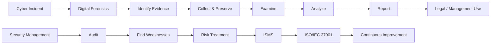

### The central idea

**Forensics asks:** *What happened, how did it happen, and what evidence proves it?*

**Auditing asks:** *Are our security controls and processes working as intended, and do they meet requirements?*

---

# 2. Cyber Forensics

## 2.1 Definition

**Cyber forensics**, often called **digital forensics** or **computer forensics** depending on the scope, is the systematic process of identifying, collecting, preserving, examining, analyzing, documenting, and presenting digital evidence.

The key word is **systematic**. A forensic investigator should not simply open files and start changing things. Evidence must be handled in a way that preserves its integrity and allows another qualified person to understand and reproduce the investigation.

### Simple explanation

Imagine a physical crime scene.

A police investigator may collect:

- fingerprints,
- CCTV footage,
- photographs,
- documents,
- physical objects.

In a cyber investigation, the equivalent evidence can include:

- hard disks,
- SSDs,
- mobile phones,
- USB devices,
- emails,
- browser artifacts,
- system logs,
- firewall logs,
- network packets,
- cloud records.

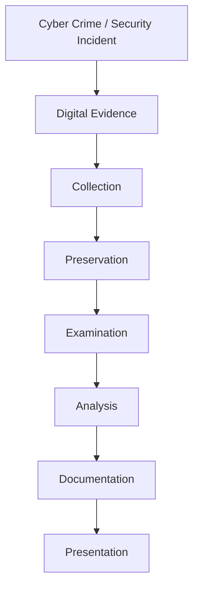

---

## 2.2 Objectives of Cyber Forensics

The major objectives are:

1. **Identify evidence**
   - Determine which systems and data may contain useful information.

2. **Preserve evidence**
   - Prevent accidental or intentional modification.

3. **Recover information**
   - Recover relevant files, logs, metadata, and sometimes deleted artifacts where technically possible.

4. **Determine what happened**
   - Reconstruct the sequence of events.

5. **Determine how it happened**
   - Identify the attack vector, compromised account, exploited service, or other mechanism.

6. **Identify relevant users/devices**
   - Establish which accounts or systems were involved, based on evidence.

7. **Document findings**
   - Produce a clear record of procedures and results.

8. **Support legal or organizational proceedings**
   - Provide evidence in a form that can be evaluated by authorized decision-makers or courts.

---

# 3. Digital Evidence

## 3.1 Definition

**Digital evidence** is information stored or transmitted in digital form that may be relevant to an investigation.

Examples:

- Email messages
- Documents
- Images
- Videos
- Browser history
- Chat records
- File metadata
- System logs
- Authentication records
- Network traffic
- Mobile-device data
- Cloud records

## 3.2 Important properties

Useful forensic evidence should be:

- **Authentic** — it should be possible to establish where it came from.
- **Reliable** — collection and analysis methods should be dependable.
- **Complete enough for the investigative question** — important context should not be omitted.
- **Preserved with integrity** — unauthorized modification should be prevented or detectable.
- **Properly documented** — the handling history should be recorded.

### Important distinction

A digital file being present does not automatically prove a person intentionally created or used it. Investigators interpret evidence in context.

For example:

> A file exists on a laptop.

This fact alone does not necessarily prove:

> The laptop owner created the file.

Additional evidence may be needed, such as timestamps, account activity, application artifacts, access logs, USB history, network records, or other corroborating information.

---

# 4. Sources of Digital Evidence

Digital evidence can come from many places.

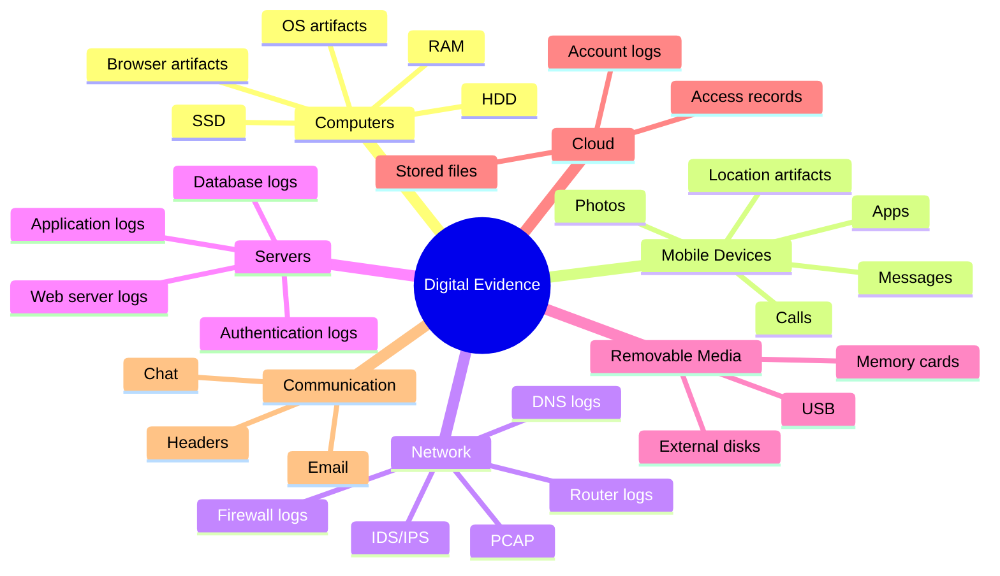

---

# 5. Computer Equipment and Storage Media

## 5.1 Computer Equipment

Computer equipment refers to physical devices that can process, store, or transmit information.

Examples:

- Desktop computers
- Laptops
- Servers
- Smartphones
- Tablets
- Routers
- Switches
- Firewalls
- CCTV/DVR systems
- USB storage devices
- External hard disks

From a forensic perspective, **any device that can contain relevant evidence may become part of the investigation**.

---

# 6. Primary and Secondary Storage

## 6.1 Primary Storage

Primary storage is directly used by the computer during operation.

Examples:

- RAM
- CPU cache
- Registers

### Characteristics

- Very fast
- Used during active computation
- RAM is volatile
- Usually smaller than secondary storage

## 6.2 Secondary Storage

Secondary storage is used for longer-term storage.

Examples:

- HDD
- SSD
- USB flash drives
- Memory cards
- CD/DVD/Blu-ray
- External disks

### Characteristics

- Usually non-volatile
- Larger capacity
- Used to store operating systems, applications, documents, media, etc.

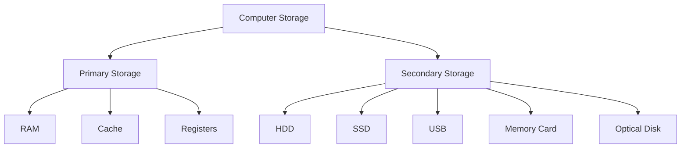

---

# 7. Volatile vs Non-Volatile Data

This is a highly important forensic concept.

## Volatile data

Data that can disappear when power is removed or the system state changes.

Example:

- RAM contents
- Active network connections
- Running processes
- Some temporary system state

## Non-volatile data

Data that normally remains stored after power is removed.

Examples:

- HDD contents
- SSD contents
- USB files
- Memory-card data

| Feature | Volatile | Non-Volatile |
|---|---|---|
| Power off | Data may disappear | Data normally remains |
| Example | RAM | HDD/SSD |
| Forensic concern | Often highly time-sensitive | Can usually be acquired after controlled seizure |
| Typical use | Active system state | Long-term storage |

### Memory trick

> **Volatile = Vanishes when power/state is lost**

> **Non-volatile = Normally remains after power is removed**

---

# 8. HDD, SSD and Removable Storage

## 8.1 HDD — Hard Disk Drive

An HDD uses magnetic storage and mechanical components.

### Forensic relevance

Investigators may examine:

- File system structures
- Existing files
- Deleted-file remnants
- Metadata
- Browser artifacts
- User activity
- System logs

### Advantages

- High capacity
- Relatively inexpensive

### Limitations

- Mechanical components
- Slower than modern SSDs
- Physical damage can complicate acquisition

---

## 8.2 SSD — Solid State Drive

An SSD uses flash memory rather than spinning magnetic disks.

### Advantages

- Fast
- No moving mechanical parts
- Low latency

### Forensic challenge

SSD storage uses technologies such as **wear leveling** and may support **TRIM**, which can make recovery of deleted data different from traditional HDD recovery.

Therefore, investigators must use appropriate acquisition and analysis procedures rather than assuming HDD recovery behavior applies to SSDs.

---

## 8.3 USB Flash Drive

USB drives are portable and can be used for:

- Data transfer
- Backup
- Software storage
- Unauthorized copying of files

Forensic examination may include:

- File contents
- Metadata
- Relevant system artifacts showing USB connection
- Timestamps
- Other corroborating evidence

---

## 8.4 Memory Cards

Common in:

- Smartphones
- Digital cameras
- Drones
- Embedded devices

Potential evidence:

- Photos
- Videos
- Documents
- Application data
- File-system artifacts

---

# 9. Role of a Forensics Investigator

## Definition

A **forensics investigator** is a trained professional who collects, preserves, examines, analyzes, documents, and communicates findings from digital evidence.

A useful mental model is:

> **A cyber detective who must also protect the evidence.**

---

# 10. Responsibilities of a Forensics Investigator

## 10.1 Identify Evidence

Determine:

- Which devices are relevant?
- Which accounts may be relevant?
- Which logs should be preserved?
- Which data sources could answer the investigative question?

## 10.2 Collect Evidence

Acquire evidence using controlled procedures.

Examples:

- Forensic disk image
- Relevant log exports
- Mobile-device acquisition
- Network captures
- Cloud records

## 10.3 Preserve Evidence

The investigator must minimize the possibility of changing the original evidence.

Typical concepts include:

- Write protection
- Forensic imaging
- Hash verification
- Secure evidence storage
- Chain of custody

## 10.4 Examine Evidence

Extract relevant artifacts.

Examples:

- Deleted-file artifacts
- Browser history
- Login records
- Application data
- Malware
- USB activity

## 10.5 Analyze Evidence

Interpret artifacts together to answer questions such as:

- What happened?
- When did it happen?
- Which systems were involved?
- What actions are supported by the evidence?

## 10.6 Document the Investigation

Record:

- Date/time
- Evidence identifier
- Acquisition method
- Tools
- Procedures
- Findings
- Hash values where appropriate
- Analyst observations

## 10.7 Present Findings

Communicate findings clearly to:

- Management
- Incident-response teams
- Legal counsel
- Investigators
- Courts, where applicable

---

# 11. Skills of a Forensics Investigator

A good investigator needs both technical and non-technical skills.

### Technical

- Operating systems
- File systems
- Networking
- Security
- Digital-forensic tools
- Log analysis
- Malware concepts
- Storage technology

### Analytical

- Logical reasoning
- Timeline reconstruction
- Correlation of evidence
- Attention to detail
- Hypothesis testing

### Professional

- Clear report writing
- Confidentiality
- Ethical behavior
- Impartiality
- Evidence-handling discipline

---

# 12. Ethics in Digital Forensics

A forensic investigator should:

- Follow applicable law and organizational authority.
- Avoid unnecessary access to unrelated private information.
- Preserve evidence integrity.
- Document procedures accurately.
- Avoid deliberately changing evidence.
- Distinguish facts from assumptions.
- Report limitations honestly.
- Maintain confidentiality.

### Important principle

> **A forensic investigator should report what the evidence supports, not what the investigator wants the evidence to prove.**

---

# 13. Chain of Custody

## Definition

**Chain of Custody** is the documented history of the handling of evidence from acquisition/seizure through storage, transfer, examination, and presentation.

It answers:

- Who collected it?
- When?
- Where?
- How?
- Who received it?
- Who accessed it?
- Where was it stored?

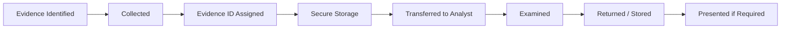

## Why is Chain of Custody important?

It helps demonstrate:

- Evidence provenance
- Proper handling
- Accountability
- Integrity of the investigative process

### Example

| Time | Person | Action |
|---|---|---|
| 10:00 | Investigator A | Collected laptop |
| 10:20 | Investigator A | Assigned evidence ID |
| 10:30 | Custodian | Placed in secure storage |
| 14:00 | Analyst B | Received forensic copy |
| 14:05 | Analyst B | Began analysis |

---

# 14. Forensics Investigation Process

A general digital forensic workflow is:

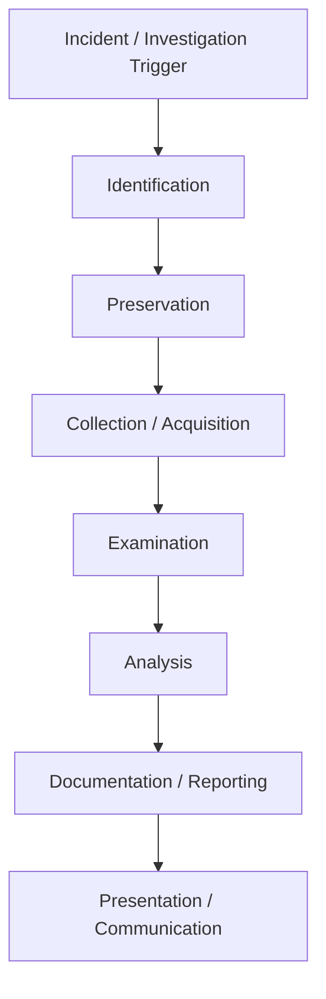

Different forensic frameworks may use different names or combine stages, but the underlying principles remain similar.

---

# 15. Step 1 — Identification

The investigator determines:

- What happened?
- What systems may be involved?
- What evidence may exist?
- What evidence is likely to be volatile?

### Example

A company's database has been accessed without authorization.

Potential evidence:

- Database server
- Authentication logs
- Firewall logs
- Employee workstation
- VPN records
- Cloud logs

---

# 16. Step 2 — Preservation

Preservation protects evidence from:

- Modification
- Deletion
- Contamination
- Accidental overwriting

Important activities may include:

- Isolating a device when appropriate
- Creating forensic images
- Using write-blocking mechanisms where applicable
- Securing original media
- Recording hashes
- Documenting every transfer

### Why preservation comes before careless examination

Opening applications, browsing files, rebooting a system, or allowing automated processes to run can change evidence. Therefore, forensic acquisition should be carefully planned.

---

# 17. Step 3 — Collection / Acquisition

Collection means obtaining relevant evidence.

Possible evidence:

- Disk images
- Memory captures
- Log files
- Email data
- Network captures
- Mobile-device data
- Cloud records

### Forensic image

A forensic image is a bit-level or otherwise forensic acquisition of storage media, depending on the acquisition method.

The objective is to create a controlled copy that can be analyzed while preserving the original.

---

# 18. Hashing and Evidence Integrity

A **cryptographic hash** produces a fixed-size value from data.

Conceptually:

```text
Evidence
   |
   v
Hash Function
   |
   v
Hash Value
```

If the relevant data changes, a secure hash algorithm will generally produce a different hash value.

Example:

```text
Original Image  ---> SHA-256 ---> Hash A
Forensic Copy   ---> SHA-256 ---> Hash B
```

If the acquisition process and comparison are appropriate, matching hashes can provide evidence that the compared data is identical.

### Important

A hash does **not** prove that a file is true, malicious, or created by a particular person. It is primarily an integrity/comparison mechanism.

---

# 19. Step 4 — Examination

Examination extracts useful information.

Typical activities:

- File-system examination
- Keyword searching
- Metadata extraction
- Deleted-artifact examination
- Browser-artifact analysis
- Email examination
- Log parsing
- Malware identification

---

# 20. Step 5 — Analysis

Analysis interprets evidence.

### Examination asks:

> **What data is present?**

### Analysis asks:

> **What does the evidence mean in the context of the investigation?**

Example:

```text
Evidence:
Login record at 02:15
        +
USB device connected at 02:18
        +
Sensitive file accessed at 02:20
        +
Network transfer at 02:25
        =
Possible sequence requiring further investigation
```

The investigator should avoid turning correlation into certainty without sufficient evidence.

---

# 21. Step 6 — Documentation

Documentation should allow another qualified person to understand:

- What was examined
- How it was examined
- What tools were used
- What evidence was found
- What limitations existed
- How conclusions were reached

---

# 22. Step 7 — Presentation

The findings may be communicated through:

- Written report
- Technical briefing
- Management presentation
- Legal proceedings
- Expert testimony, where applicable

The investigator should explain technical findings in understandable language.

---

# 23. Examination vs Analysis

| Examination | Analysis |
|---|---|
| Extracts and organizes evidence | Interprets evidence |
| More technical | More investigative |
| Finds artifacts | Determines significance |
| Example: find login record | Example: correlate login with other events |

### Easy memory

> **Examination = What is there?**

> **Analysis = What does it tell us?**

---

# 24. Collecting Network-Based Evidence

## Definition

**Network-based evidence** is digital evidence obtained from network communication, network devices, security systems, and network-related logs.

Network evidence can help reconstruct:

- Connections
- Attack attempts
- Authentication activity
- Data transfers
- Malware communication
- Timelines

---

# 25. Major Sources of Network Evidence

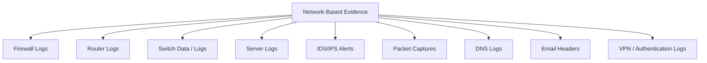

---

# 26. Firewall Logs

A firewall controls traffic according to configured rules.

A firewall log may contain:

- Timestamp
- Source IP
- Destination IP
- Source port
- Destination port
- Protocol
- Action such as allow/deny
- Rule identifier

### Example

```text
Time: 02:15
Source: 203.0.113.10
Destination: Internal Server
Port: 443
Action: ALLOW
```

A single log entry is not automatically proof of malicious activity. It must be correlated with other evidence.

---

# 27. Router and Switch Evidence

## Router

Routers connect networks and may provide information about:

- Network paths
- Interface activity
- Routing events
- Administrative events

## Switch

Switches connect devices inside local networks.

Potential evidence may include:

- MAC-address information
- Port associations
- Authentication events
- Network-management logs

---

# 28. Server Logs

Server logs are extremely valuable.

Possible information:

- Login attempts
- Successful authentication
- Failed authentication
- File access
- Application errors
- Administrative actions
- API requests
- Database activity

### Example

```text
02:15:22  LOGIN SUCCESS
02:16:04  ADMIN ACTION
02:18:17  FILE ACCESS
02:20:51  DATABASE QUERY
```

Investigators correlate these timestamps with other sources.

---

# 29. IDS and IPS

## IDS — Intrusion Detection System

An IDS monitors activity and generates alerts about potentially suspicious behavior.

## IPS — Intrusion Prevention System

An IPS can detect and take configured preventive actions, such as blocking or dropping traffic.

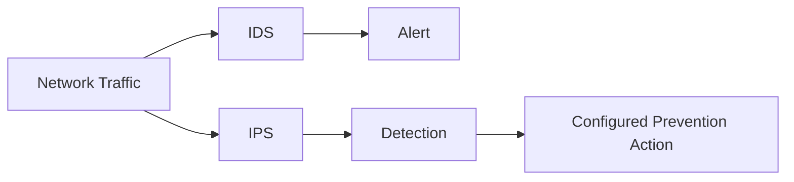

### Evidence

- Alert time
- Source/destination
- Detection rule
- Signature
- Severity
- Action taken

---

# 30. Packet Capture — PCAP

## Definition

**Packet capture** records network packets for later analysis.

Common packet-analysis software includes tools such as Wireshark and command-line capture tools, subject to organizational authorization.

A packet may contain:

- Source address
- Destination address
- Protocol
- Port
- Timestamp
- Protocol headers
- Payload, when available and not encrypted

### Important limitation

Modern traffic is often encrypted. Packet captures may still provide useful metadata, but they may not reveal application content.

---

# 31. Email Headers

Email headers contain technical routing and message information.

Potential fields include:

- From
- To
- Date
- Message-ID
- Received headers
- Mail servers involved

Investigators can use these fields to reconstruct message routing.

### Important caution

Email attribution is not always straightforward. Attackers can use compromised accounts, relays, spoofed fields, or other techniques. Header analysis should therefore be combined with other evidence.

---

# 32. Network Evidence Investigation Workflow

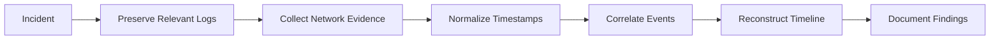

---

# 33. Challenges in Network Forensics

### 1. Huge Data Volume

Large networks can generate millions of events.

### 2. Encryption

Encrypted traffic can hide application content.

### 3. Short Log Retention

Some systems overwrite old logs.

### 4. NAT

Many devices can share one public IP address, making attribution more difficult.

### 5. VPN/Proxy/Tor

Traffic may pass through intermediary systems.

### 6. Time Synchronization Problems

Different system clocks can make timelines confusing.

### 7. Cloud and Distributed Systems

Evidence may be distributed across several providers and geographic locations.

---

# 34. Best Practices for Network Evidence

- Preserve logs quickly.
- Synchronize clocks where possible.
- Record time zones.
- Maintain original copies.
- Document collection methods.
- Restrict access.
- Use appropriate hashing/integrity controls.
- Correlate multiple independent sources.
- Record limitations.

---

# 35. Writing Computer Forensics Reports

## Definition

A **computer forensics report** is a formal document describing the investigation, evidence, methods, findings, and conclusions.

It is the major communication product of a forensic investigation.

---

# 36. Structure of a Forensic Report

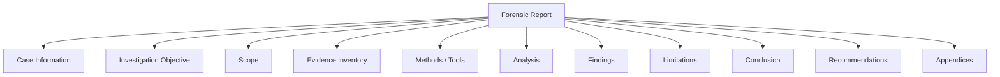

---

# 37. Case Information

May include:

- Case number
- Organization
- Investigator
- Date
- Incident description
- Evidence identifiers

---

# 38. Investigation Objective

Clearly state why the investigation was performed.

Example:

> Determine the sequence of events associated with unauthorized access to the organization's database.

A good objective is specific rather than vague.

---

# 39. Scope

Scope defines what was examined.

Example:

**Included:**

- Web server
- Database logs
- Firewall logs
- Relevant administrator workstation

**Excluded:**

- Unrelated employee systems

---

# 40. Evidence Inventory

Every evidence item should have an identifier.

Example:

| Evidence ID | Item | Source | Condition |
|---|---|---|---|
| E-01 | Laptop | IT department | Powered off |
| E-02 | HDD image | E-01 | Acquired |
| E-03 | Firewall logs | Firewall | Exported |
| E-04 | USB drive | Office | Seized |

---

# 41. Methods and Tools

The report should explain:

- Acquisition method
- Examination method
- Relevant tools
- Hash algorithms where used
- Important configuration details

Do not simply write:

> "I used a forensic tool."

Instead explain what the tool was used for.

---

# 42. Findings

Findings should be evidence-based.

### Weak wording

> "The employee definitely hacked the server."

### Better wording

> "The collected logs show a successful administrative login from the workstation at 02:15, followed by access to the specified database account."

The second statement separates observation from unsupported assumptions.

---

# 43. Limitations

A professional report should disclose limitations.

Examples:

- Some logs had expired.
- Encrypted data could not be inspected.
- The device was damaged.
- Relevant cloud records were unavailable.
- System clocks were not synchronized.

Reporting limitations increases transparency.

---

# 44. Conclusion

The conclusion should answer the investigation objective using evidence.

It should not introduce unsupported claims.

---

# 45. Recommendations

Recommendations can include:

- MFA
- Access-control improvements
- Patch management
- Better logging
- Longer appropriate log retention
- Security awareness
- Backup improvements
- Incident-response improvements

---

# 46. Characteristics of a Good Forensic Report

A good report is:

- Accurate
- Clear
- Complete
- Objective
- Reproducible
- Traceable
- Well organized
- Professionally written

### Key principle

> **Facts first, interpretation second, speculation avoided.**

---

# 47. Auditing

Now we move to the second major part of Unit 4.

## Definition

**Security auditing** is the systematic examination of information systems, policies, processes, and controls to determine whether they meet defined requirements and operate as intended.

### Simple explanation

A forensic investigation usually focuses on **an incident or evidence**.

An audit usually evaluates **controls, compliance, and management processes**.

---

# 48. Objectives of Security Auditing

An audit may aim to:

1. Evaluate security controls.
2. Identify weaknesses.
3. Verify policy compliance.
4. Assess risk-management practices.
5. Verify regulatory/contractual requirements.
6. Recommend improvements.
7. Support management decision-making.

---

# 49. Types of Audits

## 49.1 Internal Audit

Conducted by personnel within the organization or an internal audit function.

### Purpose

- Internal assurance
- Control evaluation
- Improvement

## 49.2 External Audit

Conducted by an independent external party.

### Purpose

- Independent assessment
- Certification or assurance activities
- Customer/contract requirements in some contexts

## 49.3 Compliance Audit

Checks whether required laws, regulations, standards, policies, or contractual requirements are being met.

---

# 50. Audit Process

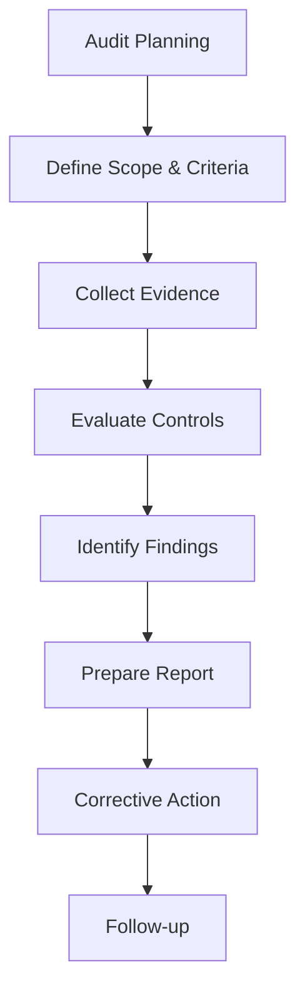

---

# 51. Audit Planning

## Definition

**Audit planning** is the process of deciding the objectives, scope, criteria, resources, schedule, methods, and responsibilities for an audit.

Before auditing, ask:

- What are we auditing?
- Why?
- Against which criteria?
- Who will audit?
- When?
- What evidence is needed?
- What risks or constraints exist?

---

# 52. Objectives of Audit Planning

Good planning helps:

- Define clear objectives.
- Establish audit scope.
- Identify important risks.
- Allocate resources.
- Schedule activities.
- Choose appropriate audit criteria.
- Avoid unnecessary work.
- Ensure adequate evidence.

---

# 53. Audit Scope

**Scope** defines the boundaries of the audit.

It can specify:

- Departments
- Systems
- Applications
- Locations
- Processes
- Time period
- Data types

### Example

> Audit the organization's customer portal, authentication system, database access controls, and supporting security logs.

---

# 54. Audit Criteria

**Audit criteria** are the requirements against which evidence is evaluated.

Examples:

- Internal security policy
- Contractual requirements
- Regulatory requirements
- ISO/IEC 27001 requirements
- Industry standards

---

# 55. Risk Assessment in Audit Planning

Risk assessment helps auditors prioritize areas where failure could have greater consequences.

A simple conceptual model is:

```text
Risk ≈ Likelihood × Impact
```

This is a simplified risk concept, not a universal mandatory formula.

### Example

| Risk | Likelihood | Impact | Priority |
|---|---|---|---|
| Weak admin authentication | High | High | High |
| Old documentation | Medium | Low | Medium |
| Non-critical unused device | Low | Low | Low |

---

# 56. Audit Resources

Resources may include:

- Auditors
- Security specialists
- Technical tools
- Documentation
- Budget
- Time
- System access

The team should have suitable competence for the scope.

---

# 57. Audit Schedule

A schedule assigns activities and time.

Example:

| Day | Activity |
|---|---|
| Day 1 | Opening meeting and document review |
| Day 2 | Access-control assessment |
| Day 3 | Network/security-control assessment |
| Day 4 | Evidence review and findings |
| Day 5 | Reporting |

---

# 58. Audit Checklist

A checklist helps ensure important controls are reviewed.

Example:

```text
[ ] Password policy reviewed
[ ] MFA checked
[ ] User access reviewed
[ ] Firewall rules reviewed
[ ] Backup process checked
[ ] Patch management checked
[ ] Logging reviewed
[ ] Incident response procedure checked
```

A checklist supports consistency but should not replace professional judgment.

---

# 59. ISMS — Information Security Management System

## Definition

An **Information Security Management System (ISMS)** is a systematic framework through which an organization manages information-security risks using policies, processes, people, and controls.

### Simple explanation

An ISMS is not just a firewall or antivirus.

It combines:

- People
- Policies
- Processes
- Technology
- Risk management
- Monitoring
- Improvement

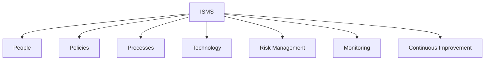

---

# 60. Objectives of ISMS

The main objective is to manage information-security risks and protect information.

The classic CIA objectives are:

### Confidentiality

Information is accessible only to authorized parties.

Example:

> Only authorized HR staff can access employee salary records.

### Integrity

Information remains accurate and protected from unauthorized modification.

Example:

> An attacker cannot silently change transaction amounts.

### Availability

Authorized users can access information when needed.

Example:

> An online banking system remains available for legitimate customers.

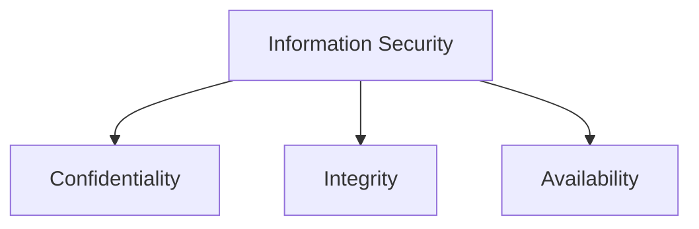

---

# 61. Components of an ISMS

Important components include:

## 61.1 Information Security Policies

Define management direction and rules.

Examples:

- Password policy
- Access-control policy
- Acceptable-use policy
- Backup policy

## 61.2 Risk Management

Identify:

- Assets
- Threats
- Vulnerabilities
- Risks
- Risk treatments

## 61.3 Security Controls

Controls can be:

- Technical
- Physical
- Organizational

Examples:

- Encryption
- Access control
- CCTV
- Security procedures
- Training

## 61.4 Procedures

Detailed instructions for recurring activities.

Examples:

- Backup procedure
- Incident-response procedure
- User onboarding/offboarding

## 61.5 Awareness and Training

Employees learn:

- Phishing awareness
- Password security
- Data handling
- Incident reporting

## 61.6 Monitoring and Review

The organization monitors performance and reviews whether controls remain suitable.

---

# 62. PDCA Cycle

A commonly taught model associated with ISO/IEC 27001:2013 is **PDCA — Plan, Do, Check, Act**.

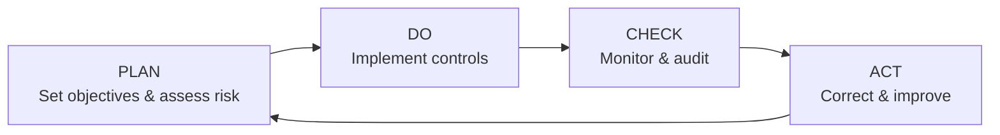

## Plan

- Define objectives.
- Understand context.
- Identify and assess risks.
- Select appropriate treatments and controls.

## Do

- Implement planned processes and controls.
- Train people.
- Operate the ISMS.

## Check

- Monitor.
- Measure where appropriate.
- Audit.
- Review performance.

## Act

- Correct problems.
- Address nonconformities.
- Improve the ISMS.

### Memory

> **Plan it → Do it → Check it → Improve it**

---

# 63. Why ISMS Matters

An ISMS helps an organization move from:

> **Ad-hoc security**

to:

> **Managed, risk-based, documented security**

Benefits can include:

- Better risk management
- Clear responsibilities
- More consistent security processes
- Improved compliance management
- Better incident preparedness
- Continuous improvement
- Increased confidence of stakeholders

---

# 64. ISMS Challenges

Implementation may face:

- Cost
- Lack of skilled staff
- Organizational resistance
- Complex systems
- Changing threats
- Poor documentation
- Difficulty maintaining continuous improvement

---

# 65. ISO and IEC

## ISO

**International Organization for Standardization**

## IEC

**International Electrotechnical Commission**

ISO and IEC jointly publish many international standards.

---

# 66. ISO/IEC 27001:2013

## Definition

**ISO/IEC 27001:2013** specifies requirements for establishing, implementing, maintaining, and continually improving an Information Security Management System.

It is a standard for **management of information security**, not simply a list of technical security products.

---

# 67. ISO 27001 and ISMS

This distinction is very important.

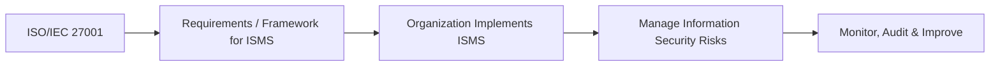

### Easy analogy

> **ISMS = the organization's information-security management system**

> **ISO/IEC 27001 = the international standard containing requirements for an ISMS**

---

# 68. What Does ISO 27001 Focus On?

The standard focuses on a management system approach involving areas such as:

- Organizational context
- Leadership
- Planning
- Support
- Operation
- Performance evaluation
- Improvement

The organization must understand its information-security context and manage risks systematically.

---

# 69. Risk Management Under ISO 27001

A simplified risk-management flow is:

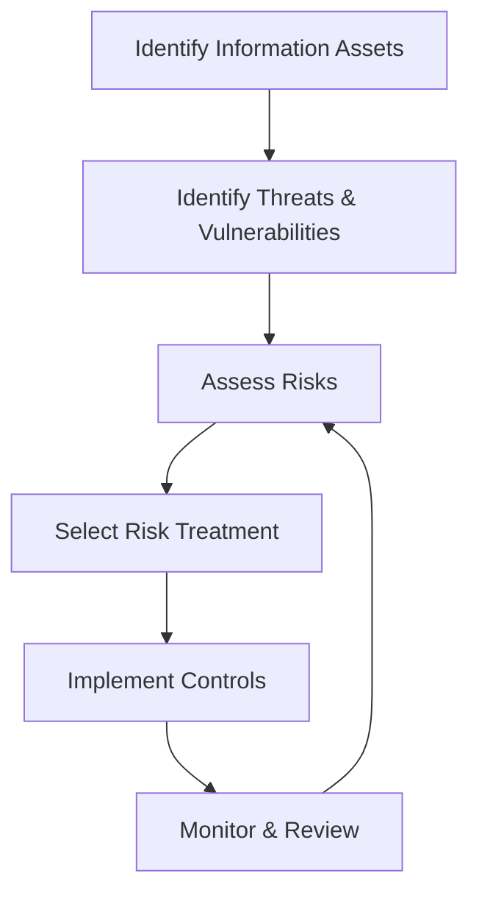

### Example

Asset:

> Customer database

Threat:

> Unauthorized access

Vulnerability:

> Weak authentication

Risk:

> Customer information may be exposed.

Possible treatment:

- Strong authentication
- Access control
- Monitoring
- Encryption where appropriate

---

# 70. Statement of Applicability — SoA

A particularly important ISO 27001 concept is the **Statement of Applicability (SoA)**.

The SoA records which Annex A controls are applicable to the organization's information-security risk treatment and explains inclusion/exclusion decisions.

### Simple explanation

It answers:

> **Which controls are relevant to us, and why?**

For exam purposes, remember:

> **SoA = documented applicability of controls and justification.**

---

# 71. Annex A Controls in ISO/IEC 27001:2013

The 2013 edition's Annex A contains a set of reference security controls organized into **14 domains**.

The 14 domains are:

1. Information security policies
2. Organization of information security
3. Human resource security
4. Asset management
5. Access control
6. Cryptography
7. Physical and environmental security
8. Operations security
9. Communications security
10. System acquisition, development and maintenance
11. Supplier relationships
12. Information security incident management
13. Information security aspects of business continuity management
14. Compliance

### Important exam note

These 14 domains belong specifically to the **2013 edition**. Later editions reorganized the control structure, so do not mix the 2013 domain count with newer editions.

---

# 72. Examples of ISO 27001 Control Areas

## Access Control

Ensures users receive appropriate access.

Examples:

- User accounts
- Privilege management
- Authentication
- Access reviews

## Cryptography

Protects information using cryptographic mechanisms.

Examples:

- Encryption
- Key management

## Physical Security

Protects facilities and equipment.

Examples:

- Entry controls
- Secure areas
- Equipment protection

## Operations Security

Includes secure operation of systems.

Examples:

- Malware protection
- Backup
- Logging
- Change management

## Incident Management

Ensures security incidents are:

- Reported
- Assessed
- Handled
- Documented
- Learned from

---

# 73. ISO 27001 Certification — Conceptual Process

A simplified certification path is:

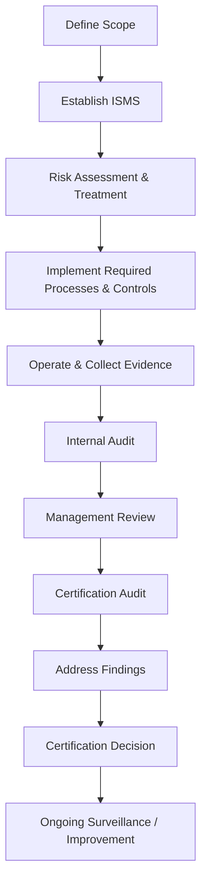

### Important

Certification is not the same thing as becoming permanently secure.

Security is an ongoing process. The organization must continue to operate, review, and improve its ISMS.

---

# 74. Benefits of ISO 27001

Potential organizational benefits include:

- Structured risk management
- Better information-security governance
- Clearer responsibilities
- Improved security processes
- Better stakeholder confidence
- Support for contractual requirements
- Continuous improvement

---

# 75. Challenges of ISO 27001

Organizations may face:

- Implementation cost
- Documentation effort
- Training requirements
- Resource constraints
- Maintaining evidence
- Continuous auditing and improvement
- Organizational resistance

---

# 76. Audit vs Forensics

This is a very important comparison.

| Aspect | Security Audit | Digital Forensics |
|---|---|---|
| Main purpose | Evaluate controls/processes | Investigate an incident or question |
| Typical timing | Planned/periodic | Often incident-driven |
| Main focus | Compliance, effectiveness, risk | Evidence, events, reconstruction |
| Output | Audit report | Forensic report |
| Evidence | Policies, configurations, records, samples | Digital artifacts, logs, images, captures |
| Key question | "Are controls working/meeting requirements?" | "What happened and what does the evidence show?" |

### Memory

> **Audit = Evaluate**

> **Forensics = Investigate**

---

# 77. ISMS vs Cyber Security

These terms are related but not identical.

| ISMS | Cyber Security |
|---|---|
| Management framework | Broad discipline |
| Risk and governance focused | Protection and defense focused |
| Includes people/processes/technology | Includes technical and organizational practices |
| Uses policies and controls | Uses technologies and procedures |
| ISO 27001 can specify ISMS requirements | Cybersecurity is broader than one standard |

---

# 78. ISO 27001 vs ISMS

| ISMS | ISO/IEC 27001 |
|---|---|
| Actual management system implemented by organization | International standard |
| Includes policies, processes, responsibilities, controls | Specifies requirements for the ISMS |
| Operates continuously | Used as a basis for assessment/certification |
| Organization-specific | Internationally standardized |

### One-line answer

> **ISMS is what the organization operates; ISO/IEC 27001 provides requirements against which the ISMS can be assessed.**

---

# 79. Forensics vs Incident Response

These are related but different.

## Incident Response

Focuses on:

- Detecting incident
- Containing it
- Eradicating threat
- Recovering systems
- Learning lessons

## Forensics

Focuses on:

- Evidence preservation
- Examination
- Analysis
- Reconstruction
- Documentation

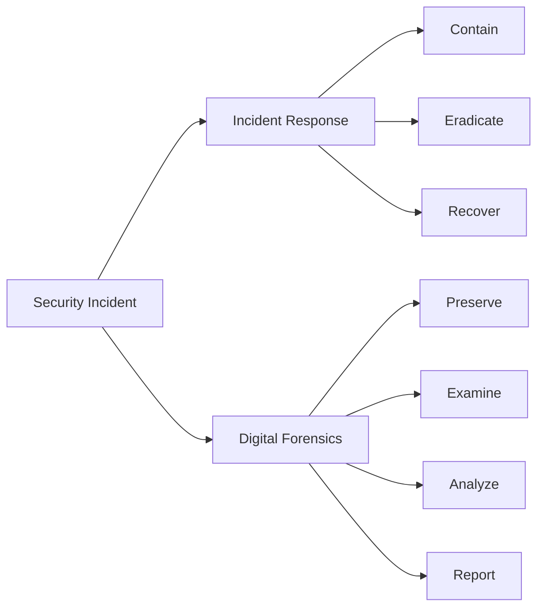

In real organizations, incident response and forensics often work together.

---

# 80. Complete Unit 4 Concept Map

```mermaid
flowchart TD
    U4[UNIT 4] --> F[Cyber Forensics]
    U4 --> A[Auditing & ISMS]

    F --> F1[Digital Evidence]
    F --> F2[Storage Media]
    F --> F3[Forensics Investigator]
    F --> F4[Investigation Process]
    F --> F5[Network Evidence]
    F --> F6[Forensic Report]

    F1 --> E1[Integrity]
    F1 --> E2[Authenticity]
    F1 --> E3[Chain of Custody]

    F2 --> S1[Primary]
    F2 --> S2[Secondary]
    F2 --> S3[Volatile]
    F2 --> S4[Non-Volatile]

    F4 --> P1[Identify]
    F4 --> P2[Preserve]
    F4 --> P3[Collect]
    F4 --> P4[Examine]
    F4 --> P5[Analyze]
    F4 --> P6[Document]
    F4 --> P7[Present]

    F5 --> N1[Firewall]
    F5 --> N2[Router]
    F5 --> N3[Server]
    F5 --> N4[IDS/IPS]
    F5 --> N5[PCAP]
    F5 --> N6[Email Headers]

    A --> A1[Audit]
    A --> A2[Audit Planning]
    A --> A3[ISMS]
    A --> A4[ISO/IEC 27001:2013]

    A1 --> AT1[Internal]
    A1 --> AT2[External]
    A1 --> AT3[Compliance]

    A2 --> AP1[Objectives]
    A2 --> AP2[Scope]
    A2 --> AP3[Risk]
    A2 --> AP4[Resources]
    A2 --> AP5[Schedule]
    A2 --> AP6[Checklist]

    A3 --> I1[CIA]
    A3 --> I2[Policies]
    A3 --> I3[Risk Management]
    A3 --> I4[Controls]
    A3 --> I5[Training]
    A3 --> I6[PDCA]

    A4 --> ISO1[ISMS Requirements]
    A4 --> ISO2[Risk Treatment]
    A4 --> ISO3[Statement of Applicability]
    A4 --> ISO4[Annex A 2013]
    A4 --> ISO5[Certification]
```

---

# 81. Important Definitions — Last-Minute Revision

## Cyber Forensics

> Systematic identification, collection, preservation, examination, analysis, documentation, and presentation of digital evidence.

## Digital Evidence

> Information stored or transmitted digitally that may be relevant to an investigation.

## Chain of Custody

> Documented history of evidence handling from collection through storage, transfer, examination, and presentation.

## Volatile Data

> Data that can be lost when power or system state changes.

## Network-Based Evidence

> Evidence obtained from network communications, devices, and network-related logs.

## PCAP

> Captured network packets used for network analysis and investigation.

## Security Audit

> Systematic examination of security controls, processes, and requirements.

## Audit Planning

> Planning the objectives, scope, criteria, resources, schedule, and methods of an audit.

## ISMS

> A systematic framework for managing information-security risks through people, processes, policies, and controls.

## ISO/IEC 27001:2013

> An international standard specifying requirements for establishing, implementing, maintaining, and continually improving an ISMS.

---

# 82. Important 2-Mark Questions

### Q1. Define Cyber Forensics.

**Answer:** Cyber forensics is the systematic process of identifying, collecting, preserving, examining, analyzing, documenting, and presenting digital evidence for an investigation.

### Q2. What is Chain of Custody?

**Answer:** Chain of Custody is the documented history of how evidence was collected, stored, transferred, examined, and handled throughout an investigation.

### Q3. What is volatile data?

**Answer:** Volatile data is information that may be lost when a system loses power or changes state, such as RAM contents.

### Q4. What is PCAP?

**Answer:** PCAP refers to captured network packets that can be analyzed to investigate network communication.

### Q5. Define ISMS.

**Answer:** ISMS is a systematic framework used by an organization to manage information-security risks using policies, processes, people, and controls.

### Q6. What is ISO/IEC 27001:2013?

**Answer:** It is an international standard specifying requirements for an Information Security Management System.

---

# 83. Important 5-Mark Questions

## Q1. Explain the role of a forensic investigator.

### Answer structure

1. Define forensic investigator.
2. Identify evidence.
3. Collect evidence.
4. Preserve evidence.
5. Examine and analyze.
6. Document findings.
7. Present findings.

---

## Q2. Explain the digital forensic investigation process.

Use:

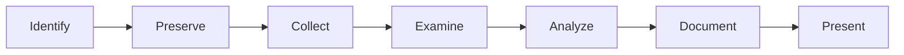

Then explain each stage in 2–3 lines.

---

## Q3. Explain sources of network-based evidence.

Mention:

- Firewall logs
- Router/switch records
- Server logs
- IDS/IPS
- PCAP
- DNS logs
- VPN/authentication logs
- Email headers

---

## Q4. Explain the components of ISMS.

Mention:

- Security policies
- Risk management
- Security controls
- Procedures
- Training
- Monitoring
- Continuous improvement

---

# 84. Important 10-Mark Questions

## Q1. Explain the complete cyber forensic investigation process.

### Recommended answer structure

**Introduction**

Define cyber forensics.

**Diagram**

```mermaid
flowchart TD
    A[Incident] --> B[Identification]
    B --> C[Preservation]
    C --> D[Collection]
    D --> E[Examination]
    E --> F[Analysis]
    F --> G[Documentation]
    G --> H[Presentation]
```

**Body**

Explain each phase.

**Add Chain of Custody**

Explain why evidence handling matters.

**Conclusion**

State that a systematic process helps maintain evidence integrity and supports reliable investigation.

---

# 85. Important 10-Mark Question — ISO 27001

## Question

> Explain ISO/IEC 27001:2013, its objectives, requirements, benefits, and certification process.

### Recommended structure

1. Definition
2. Purpose
3. Relationship with ISMS
4. Risk management
5. Security controls
6. Statement of Applicability
7. Internal audit
8. Management review
9. Certification process
10. Benefits
11. Conclusion

---

# 86. High-Value Differences to Memorize

## Primary vs Secondary Storage

> Primary = temporary/working memory

> Secondary = long-term storage

## Volatile vs Non-Volatile

> Volatile = may disappear when power/state changes

> Non-volatile = normally persists after power off

## Examination vs Analysis

> Examination = extract evidence

> Analysis = interpret evidence

## Audit vs Forensics

> Audit = evaluate controls

> Forensics = investigate evidence

## ISMS vs ISO 27001

> ISMS = organization's management system

> ISO 27001 = standard specifying requirements for the ISMS

## IDS vs IPS

> IDS = detects and alerts

> IPS = detects and can take configured preventive action

---

# 87. Common Exam Mistakes

### Mistake 1: Saying forensic investigation means "hacking"

Incorrect.

Forensics is about **evidence and investigation**, not unauthorized access.

### Mistake 2: Saying every deleted file can be recovered

Incorrect.

Recovery depends on factors such as storage technology, overwriting, TRIM, encryption, and acquisition conditions.

### Mistake 3: Treating an IP address as automatically identifying a person

Incorrect.

An IP address may identify a network endpoint or public connection, not necessarily a specific human.

### Mistake 4: Saying ISO 27001 is an antivirus standard

Incorrect.

ISO 27001 is an **information-security management-system standard**.

### Mistake 5: Saying auditing is always performed after an attack

Incorrect.

Audits are often planned and periodic and may occur without any security incident.

---

# 88. Final Unit 4 Memory Sheet

```mermaid
flowchart LR
    A[FORENSICS] --> B[Evidence]
    B --> C[Preserve]
    C --> D[Examine]
    D --> E[Analyze]
    E --> F[Report]

    G[AUDIT] --> H[Plan]
    H --> I[Collect Evidence]
    I --> J[Evaluate]
    J --> K[Findings]
    K --> L[Improve]

    M[ISMS] --> N[Risk Management]
    N --> O[Controls]
    O --> P[Monitor]
    P --> Q[Improve]

    R[ISO 27001:2013] --> S[ISMS Requirements]
    S --> T[Risk-Based Approach]
    T --> U[Controls / SoA]
    U --> V[Audit & Improvement]
```

---

# 89. One-Minute Revision

If you have only one minute before the exam, remember this:

### Cyber Forensics

**Identify → Preserve → Collect → Examine → Analyze → Document → Present**

### Evidence

**Computer + Mobile + Storage + Logs + Network + Email + Cloud**

### Chain of Custody

**Who → When → What → Where → How**

### Network Evidence

**Firewall + Router + Server + IDS/IPS + PCAP + DNS + Email**

### Audit

**Plan → Collect → Evaluate → Findings → Report → Follow-up**

### Audit Planning

**Objectives + Scope + Criteria + Risk + Resources + Schedule**

### ISMS

**People + Policies + Processes + Technology + Risk + Controls + Improvement**

### PDCA

**Plan → Do → Check → Act**

### ISO/IEC 27001:2013

**International standard for requirements of an ISMS**

### CIA

**Confidentiality + Integrity + Availability**

### ISO 27001:2013 Annex A

**14 control domains**

---

# 90. Final Exam Strategy for Unit 4

For a **5-mark answer**:

1. Definition
2. Diagram
3. 4–5 key points
4. Example
5. Short conclusion

For a **10-mark answer**:

1. Definition/introduction
2. Neat Mermaid-style conceptual diagram
3. Detailed explanation of every component
4. Example/case scenario
5. Advantages/importance
6. Limitations/challenges if relevant
7. Conclusion

### Most important topics to revise first

1. ⭐⭐⭐⭐⭐ Forensics Investigation Process
2. ⭐⭐⭐⭐⭐ ISO/IEC 27001:2013
3. ⭐⭐⭐⭐⭐ ISMS + PDCA
4. ⭐⭐⭐⭐ Digital Evidence + Chain of Custody
5. ⭐⭐⭐⭐ Network-Based Evidence
6. ⭐⭐⭐⭐ Role of Forensics Investigator
7. ⭐⭐⭐⭐ Audit Planning
8. ⭐⭐⭐ Computer Equipment and Storage Media
9. ⭐⭐⭐ Forensic Reports
10. ⭐⭐⭐ Types of Audits

---

# 🎓 Unit 4 Complete

You can now think of the whole unit as one connected story:

```mermaid
flowchart TD
    A[Cyber Incident] --> B{What do we need?}

    B --> C[Investigation]
    C --> D[Digital Forensics]
    D --> E[Evidence]
    E --> F[Preserve]
    F --> G[Examine]
    G --> H[Analyze]
    H --> I[Forensic Report]

    B --> J[Security Improvement]
    J --> K[Audit]
    K --> L[Find Weaknesses]
    L --> M[Risk Management]
    M --> N[ISMS]
    N --> O[ISO/IEC 27001:2013]
    O --> P[Continuous Improvement]
```

**Core idea:**  
**Forensics helps understand and document what happened; auditing checks whether security management and controls are working; ISMS provides the management framework; ISO/IEC 27001:2013 provides requirements for that ISMS.**
